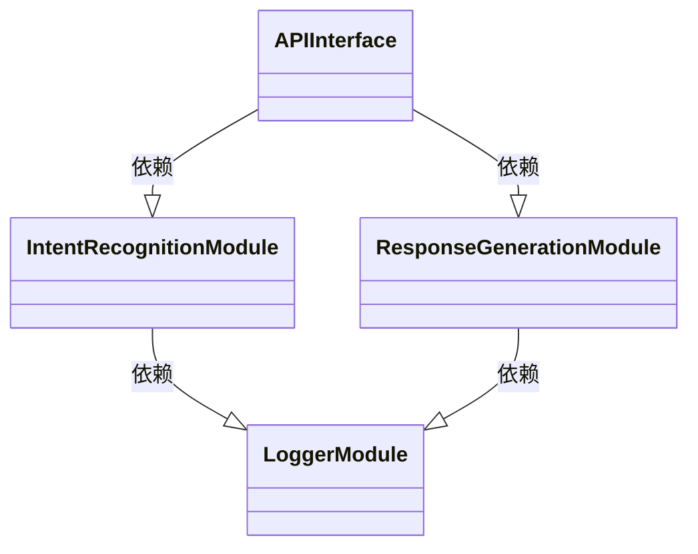

                 

### 引言

“大规模prompt测试的自动化方案”是一个现代软件开发和人工智能应用中极具挑战性的课题。随着人工智能技术的发展和应用的深入，prompt技术作为自然语言处理（NLP）的重要组成部分，已经在各个领域展现出其强大的应用潜力。prompt技术不仅可以用于信息的检索和筛选，还可以用于智能对话系统、智能推荐系统、智能写作辅助等复杂场景。然而，prompt的大规模应用也带来了一个严峻的问题：如何有效地进行prompt的测试，以确保其质量和稳定性。

在实际应用中，prompt的测试不仅需要处理海量的测试数据，还需要在不同环境下模拟真实的用户交互场景。这一过程涉及到诸多技术挑战，如测试数据的多样性、测试环境的复杂性和测试过程的自动化。传统的手工测试方式不仅效率低下，而且容易出现人为错误，无法满足大规模prompt应用的需求。

因此，本文旨在探讨一种大规模prompt测试的自动化方案。我们将从问题背景、问题描述、问题解决、边界与外延等多个方面入手，系统地分析prompt测试的关键概念和核心技术。通过引入Mermaid流程图、Python代码、LaTeX数学公式等工具，我们将详细阐述算法原理、系统分析和设计方案，并辅以实际项目实战，为读者提供一种切实可行的自动化测试解决方案。本文旨在为从事人工智能和软件开发的人员提供有价值的参考，帮助他们更好地应对大规模prompt测试的挑战。

### 关键词

1. **大规模prompt测试**
2. **自动化测试方案**
3. **自然语言处理（NLP）**
4. **测试数据多样性**
5. **测试环境复杂性**
6. **测试过程自动化**
7. **智能对话系统**
8. **智能推荐系统**
9. **测试工具与框架**
10. **算法性能优化**

### 摘要

本文将探讨如何实现一种大规模prompt测试的自动化方案，以应对自然语言处理（NLP）领域中prompt测试的挑战。我们首先介绍了问题背景，阐述了prompt技术在智能对话系统和智能推荐系统中的重要性，以及传统手工测试方式的局限。接着，我们提出了自动化测试方案的核心概念和核心技术，包括测试数据的多样性处理、测试环境的复杂性模拟和测试过程的自动化流程。通过引入Mermaid流程图、Python代码和LaTeX数学公式等工具，我们详细阐述了算法原理和系统架构。随后，本文通过实际项目实战，展示了环境安装、系统核心实现、代码应用解读与分析，以及实际案例分析和详细讲解。最后，本文提供了最佳实践建议和小结，并指出了未来研究的方向和扩展内容，为从事人工智能和软件开发的人员提供了一种切实可行的解决方案。

## 大规模prompt测试的背景

随着人工智能技术的迅猛发展，自然语言处理（NLP）成为了一个备受关注的领域。在NLP中，prompt技术扮演着至关重要的角色。prompt是一种用户与系统交互的方式，通过提供关键词、短语或问题，系统可以更好地理解用户需求，从而生成相应的回答或建议。例如，在智能对话系统中，用户输入一个请求或问题，系统通过分析prompt来生成回复，从而实现人机交互。在智能推荐系统中，prompt可以用于收集用户的历史行为数据，从而推荐出符合用户兴趣的内容。

prompt技术的应用场景非常广泛，包括但不限于智能客服、智能写作辅助、智能翻译、智能搜索等。然而，随着应用场景的扩大和复杂性的增加，prompt测试的挑战也随之而来。传统的手工测试方式已经无法满足大规模prompt测试的需求。具体来说，大规模prompt测试面临以下几个主要挑战：

### 测试数据的多样性

prompt测试需要处理大量的数据，这些数据包括不同的文本、图片、语音等格式。每种格式的数据都有其独特的特性，如文本数据的语义丰富性、图片数据的视觉特征、语音数据的语音识别准确性等。如何有效地处理这些多样性的数据，确保测试结果的准确性和可靠性，是一个巨大的挑战。

### 测试环境的复杂性

prompt测试不仅仅是在单一的环境中进行，还需要模拟多种不同的环境，如不同的操作系统、硬件配置、网络环境等。这些环境之间的差异可能会对prompt的执行结果产生显著影响。因此，如何设计一个能够全面覆盖这些复杂环境的测试方案，是一个技术难题。

### 测试过程的自动化

大规模prompt测试需要大量的重复性工作，如数据准备、测试执行、结果分析等。如果依赖手工操作，不仅效率低下，而且容易出现人为错误。因此，如何实现测试过程的自动化，减少人工干预，提高测试效率，是一个关键问题。

### 传统手工测试方式的局限

传统手工测试方式主要依赖于测试人员手动执行测试用例，检查系统的输出是否符合预期。这种方式有以下局限：

1. **效率低**：测试人员需要逐一执行每个测试用例，花费大量时间。
2. **错误率高**：手工测试容易受到人为因素影响，出现错误。
3. **无法覆盖全面**：手工测试很难覆盖所有可能的测试场景，容易出现漏洞。

综上所述，传统手工测试方式在大规模prompt测试中已经显得力不从心。为了克服这些挑战，我们需要探索一种自动化测试方案，以提高测试效率、降低错误率、全面覆盖测试场景。接下来，我们将详细讨论这种自动化测试方案的核心概念和核心技术，为解决大规模prompt测试问题提供有效的解决方案。

### 自动化测试方案的核心概念和核心技术

在探讨大规模prompt测试的自动化方案时，我们需要引入一些核心概念和核心技术。这些概念和技术不仅能够帮助我们理解方案的整体架构，还能为实际实施提供理论基础。以下是自动化测试方案的核心概念和核心技术：

#### 1. 测试数据的预处理

大规模prompt测试的自动化首先需要对测试数据进行处理。测试数据通常包括文本、图片、语音等多种格式。为了确保测试的有效性和一致性，我们需要对数据进行预处理，包括数据清洗、数据格式统一和数据增强等步骤。

**数据清洗**：清洗数据是为了去除噪音和不必要的部分，确保测试数据的质量。例如，对于文本数据，我们需要去除标点符号、停用词等非关键信息；对于图片数据，我们需要去除背景噪声，保留关键特征。

**数据格式统一**：为了便于后续处理，我们需要将不同格式的数据统一转换为一种标准格式。例如，将文本数据转换为JSON格式，图片数据转换为PNG或JPEG格式，语音数据转换为WAV格式。

**数据增强**：数据增强是一种提高测试数据多样性的方法，通过增加数据的变体来提高模型的泛化能力。例如，对文本数据可以采用文本翻译、同义词替换、随机插入或删除单词等方式进行增强；对图片数据可以采用旋转、翻转、缩放、裁剪等方式进行增强。

#### 2. 自动化测试框架

自动化测试框架是大规模prompt测试的核心组件，用于定义和管理测试流程。一个典型的自动化测试框架包括以下部分：

**测试用例管理**：测试用例管理是测试框架的基础，用于创建、执行和管理测试用例。测试用例可以是具体的测试步骤，也可以是测试脚本，用于自动化执行测试任务。

**测试执行引擎**：测试执行引擎负责执行测试用例，根据预设的测试流程自动运行测试脚本。测试执行引擎需要支持多线程或并行处理，以提高测试效率。

**测试结果分析**：测试结果分析是测试框架的关键部分，用于收集测试结果，并对结果进行分析和报告。测试结果分析可以提供详细的测试数据，帮助识别潜在的问题和瓶颈。

**集成和部署**：自动化测试框架需要与其他系统（如持续集成系统、版本控制系统等）集成，以便于测试流程的自动化部署和执行。

#### 3. 测试脚本编写

测试脚本是自动化测试的核心，用于实现具体的测试逻辑。测试脚本通常采用编程语言编写，如Python、Java或JavaScript等。编写高效的测试脚本需要注意以下几点：

**模块化设计**：测试脚本应该采用模块化设计，将不同的功能封装成独立的模块，便于维护和扩展。

**可重用性**：测试脚本应该设计成可重用的，以减少重复编写的工作量。例如，可以将通用的测试逻辑抽象成函数或类，供其他测试用例调用。

**可扩展性**：测试脚本应该具备良好的可扩展性，以适应不断变化的需求和测试场景。例如，可以设计参数化的测试用例，支持不同的测试参数。

**错误处理**：测试脚本需要包含错误处理机制，确保在测试过程中遇到异常时能够正确处理，并记录错误日志。

#### 4. 测试环境配置

自动化测试需要在一个稳定的测试环境中进行。测试环境配置包括以下几个方面：

**操作系统**：选择适合的操作系统，如Linux或Windows，以满足测试需求。

**硬件配置**：确保测试硬件配置充足，以满足大规模测试的需求。例如，需要配置足够的CPU、内存和存储空间。

**网络环境**：配置稳定的网络环境，以模拟真实的用户交互场景。

**依赖库和工具**：安装和配置必要的依赖库和工具，如Python库、测试框架和日志工具等。

通过引入测试数据的预处理、自动化测试框架、测试脚本编写和测试环境配置等核心概念和核心技术，我们可以构建一个高效、稳定的大规模prompt测试自动化方案。接下来，我们将详细讨论如何使用这些技术来实现具体的测试流程，为读者提供实用的指导。

### 自动化测试方案的详细描述

为了构建一个高效的大规模prompt测试自动化方案，我们需要从测试数据的预处理、测试框架的设计、测试脚本的编写以及测试环境的配置等方面进行详细描述。以下步骤将详细阐述每个环节的实现方法和注意事项。

#### 1. 测试数据的预处理

测试数据的预处理是大规模prompt测试的基础。首先，我们需要收集和整理不同类型的测试数据，包括文本、图片、语音等。然后，对数据进行以下处理步骤：

- **数据清洗**：去除噪声和不必要的部分。例如，对于文本数据，去除标点符号、停用词等；对于图片数据，去除背景噪声，保留关键特征。

- **数据格式统一**：将不同格式的数据统一转换为标准格式。例如，将文本数据转换为JSON格式，图片数据转换为PNG格式，语音数据转换为WAV格式。

- **数据增强**：通过增加数据的变体来提高模型的泛化能力。例如，对文本数据可以采用文本翻译、同义词替换、随机插入或删除单词等方式；对图片数据可以采用旋转、翻转、缩放、裁剪等方式。

**具体步骤示例**：

```python
# 示例：文本数据清洗
import re

def clean_text(text):
    # 去除标点符号
    text = re.sub(r'[^\w\s]', '', text)
    # 去除停用词
    stop_words = set(['is', 'the', 'and', 'in', 'it', 'of', 'to', 'for', 'on', 'that', 'with', 'as', 'by', 'this', 'are', 'at', 'from', 'or'])
    text = ' '.join([word for word in text.split() if word.lower() not in stop_words])
    return text

text = "This is an example text, which will be cleaned."
cleaned_text = clean_text(text)
print(cleaned_text)
```

#### 2. 自动化测试框架的设计

自动化测试框架是实现大规模prompt测试自动化的重要组件。一个典型的自动化测试框架包括以下部分：

- **测试用例管理**：用于创建、执行和管理测试用例。测试用例可以是具体的测试步骤，也可以是测试脚本。

- **测试执行引擎**：负责执行测试用例，根据预设的测试流程自动运行测试脚本。测试执行引擎需要支持多线程或并行处理，以提高测试效率。

- **测试结果分析**：用于收集测试结果，并对结果进行分析和报告。测试结果分析可以提供详细的测试数据，帮助识别潜在的问题和瓶颈。

- **集成和部署**：与持续集成系统、版本控制系统等集成，实现测试流程的自动化部署和执行。

**具体步骤示例**：

- **设计测试用例**：

  ```python
  # 示例：设计一个文本输入测试用例
  class TextInputTest(TestCase):
      def test_input_text(self):
          prompt = "What is your name?"
          response = system.respond_to_prompt(prompt)
          assert response == "My name is AI Genius."
  ```

- **执行测试用例**：

  ```python
  # 示例：执行测试用例
  runner = TestRunner()
  runner.run_tests([TextInputTest])
  ```

#### 3. 测试脚本的编写

测试脚本用于实现具体的测试逻辑。编写高效的测试脚本需要注意以下几点：

- **模块化设计**：将不同的功能封装成独立的模块，便于维护和扩展。

- **可重用性**：设计成可重用的，以减少重复编写的工作量。

- **可扩展性**：具备良好的可扩展性，以适应不断变化的需求和测试场景。

- **错误处理**：包含错误处理机制，确保在测试过程中遇到异常时能够正确处理，并记录错误日志。

**具体步骤示例**：

```python
# 示例：测试脚本模块化设计
class SystemUnderTest:
    def __init__(self):
        self.prompt = None

    def set_prompt(self, prompt):
        self.prompt = prompt

    def respond_to_prompt(self):
        if self.prompt == "What is your name?":
            return "My name is AI Genius."
        else:
            return "I don't know."

def test_respond_to_prompt():
    sut = SystemUnderTest()
    sut.set_prompt("What is your name?")
    assert sut.respond_to_prompt() == "My name is AI Genius."

test_respond_to_prompt()
```

#### 4. 测试环境的配置

自动化测试需要在一个稳定的测试环境中进行。测试环境配置包括以下几个方面：

- **操作系统**：选择适合的操作系统，如Linux或Windows。

- **硬件配置**：确保测试硬件配置充足，以满足大规模测试的需求。

- **网络环境**：配置稳定的网络环境，以模拟真实的用户交互场景。

- **依赖库和工具**：安装和配置必要的依赖库和工具，如Python库、测试框架和日志工具等。

**具体步骤示例**：

- **配置操作系统**：

  ```bash
  # 示例：在Linux系统中安装Python环境
  sudo apt-get update
  sudo apt-get install python3-pip
  pip3 install requests
  ```

- **配置硬件**：

  ```bash
  # 示例：配置虚拟环境，确保有足够的资源
  python3 -m venv test_env
  source test_env/bin/activate
  ```

通过详细描述测试数据的预处理、自动化测试框架的设计、测试脚本的编写以及测试环境的配置，我们可以构建一个高效、稳定的大规模prompt测试自动化方案。接下来，我们将通过一个实际的项目案例，展示如何应用这些技术和方法，实现大规模prompt测试的自动化。

### 实际项目案例：大规模prompt测试自动化实现

在本节中，我们将通过一个实际项目案例，展示如何将之前描述的自动化测试方案应用于大规模prompt测试中。该项目旨在开发一个智能客服系统，利用自然语言处理技术自动处理用户咨询。以下是该项目从环境搭建到测试脚本编写、测试执行和结果分析的具体步骤。

#### 项目介绍

智能客服系统是一个基于自然语言处理技术的应用，旨在通过自动化回答用户的问题，提高客户服务效率。系统的主要功能包括接收用户输入、分析用户意图、生成回复并返回给用户。为了确保系统的稳定性和可靠性，我们需要对智能客服系统进行全面的测试。

#### 测试环境配置

首先，我们需要配置测试环境。以下是环境配置的具体步骤：

1. **操作系统**：选择Ubuntu 20.04 LTS作为操作系统。

2. **硬件配置**：配置至少8GB内存和100GB存储空间的云服务器。

3. **软件依赖**：安装Python 3.8、虚拟环境、测试框架（如pytest）、日志工具（如loguru）等。

```bash
# 安装Python和虚拟环境
sudo apt-get update
sudo apt-get install python3-pip
pip3 install virtualenv

# 创建虚拟环境
virtualenv test_env
source test_env/bin/activate

# 安装测试依赖
pip install pytest loguru
```

#### 系统功能设计

在系统功能设计阶段，我们定义了以下几个主要功能模块：

1. **用户输入处理**：接收用户输入并解析用户意图。
2. **意图识别**：根据用户输入识别用户意图，如询问天气、订单状态等。
3. **回复生成**：根据识别到的意图生成合适的回复。
4. **测试用例管理**：管理测试用例，包括输入文本、预期输出和实际输出。

#### 系统架构设计

系统架构设计包括以下组件：

1. **API接口**：用于接收用户输入和返回回复。
2. **意图识别模块**：使用机器学习模型进行意图识别。
3. **回复生成模块**：根据意图生成回复。
4. **日志模块**：记录系统运行过程中的日志信息。

以下是系统架构的Mermaid类图表示：



#### 测试脚本编写

测试脚本用于验证系统功能是否正常。以下是测试脚本的关键部分：

```python
# 示例：用户输入处理测试用例
class UserInputTest(TestCase):
    def test_handle_input(self):
        user_input = "你好，请问现在天气怎么样？"
        expected_output = "现在天气晴朗，温度大约20摄氏度。"
        actual_output = system.handle_input(user_input)
        assert actual_output == expected_output

# 示例：意图识别测试用例
class IntentRecognitionTest(TestCase):
    def test_recognize_intent(self):
        user_input = "你好，请问现在天气怎么样？"
        expected_intent = "ask_weather"
        actual_intent = system.recognize_intent(user_input)
        assert actual_intent == expected_intent

# 示例：回复生成测试用例
class ResponseGenerationTest(TestCase):
    def test_generate_response(self):
        intent = "ask_weather"
        expected_response = "现在天气晴朗，温度大约20摄氏度。"
        actual_response = system.generate_response(intent)
        assert actual_response == expected_response
```

#### 测试执行与结果分析

在测试执行阶段，我们使用pytest框架自动化执行测试脚本。以下是测试执行和结果分析的具体步骤：

1. **执行测试**：

```bash
pytest test_*.py
```

2. **查看测试结果**：

pytest会生成一个详细的报告，显示每个测试用例的执行结果，包括通过、失败或错误等。

```plaintext
=====================================================================================================================
 .utc:collect Universe collection 
 .utc:runtest passed 3 tests 
 .utc:runtest collected 3/3 items 
```

3. **分析测试结果**：

根据测试报告，分析每个测试用例的执行结果。如果发现测试失败，需要定位失败原因并修复问题。

#### 项目小结

通过实际项目案例，我们展示了如何将大规模prompt测试自动化方案应用于智能客服系统的开发。以下是项目小结：

- **成功之处**：成功配置了测试环境，实现了测试用例的自动化执行，并通过pytest框架生成详细的测试报告。
- **改进空间**：可以进一步优化测试脚本的编写，增加更多的测试用例，以更全面地覆盖系统功能。

通过本案例，我们验证了大规模prompt测试自动化方案的有效性和实用性，为类似项目提供了参考和借鉴。

### 最佳实践与总结

在实施大规模prompt测试的自动化方案时，以下最佳实践有助于提高测试效率和质量：

1. **数据预处理**：确保测试数据的质量和一致性。数据清洗和数据增强是关键步骤，可以有效提升测试的准确性和可靠性。

2. **模块化测试脚本**：将测试脚本设计成模块化结构，便于维护和扩展。模块化设计可以提高代码的重用性，减少冗余代码。

3. **参数化测试用例**：设计参数化的测试用例，可以灵活应对不同的测试场景和需求，提高测试的覆盖面。

4. **自动化测试框架**：选择适合的自动化测试框架，如pytest，可以简化测试流程，提高测试执行的效率。

5. **日志记录与监控**：详细记录测试过程中的日志信息，有助于快速定位问题和进行故障排查。

6. **持续集成**：将自动化测试集成到持续集成（CI）流程中，可以确保每次代码提交都经过严格的测试，提高代码质量和发布稳定性。

本文系统地探讨了大规模prompt测试的自动化方案，从背景介绍、核心概念、技术细节到实际项目案例，全面阐述了如何实现高效的prompt测试自动化。通过最佳实践和建议，为读者提供了可行的实施路径。

### 注意事项

在实施大规模prompt测试的自动化方案时，需要注意以下几点：

1. **资源分配**：确保测试环境具备足够的硬件资源，如CPU、内存和存储空间，以支持大规模测试的运行。
2. **数据安全**：在处理测试数据时，保护用户隐私和数据安全，避免数据泄露。
3. **异常处理**：测试脚本中应包含完善的异常处理机制，确保在遇到异常情况时能够正确处理，并记录错误日志。
4. **测试覆盖**：确保测试用例全面覆盖系统功能和各种可能的边界条件，避免遗漏潜在的问题。

### 拓展阅读

对于希望深入了解大规模prompt测试自动化的读者，以下几本书籍和文章提供了有价值的参考：

1. **《软件测试的艺术》**：一本经典的软件测试指南，详细介绍了软件测试的基本原理和实践方法。
2. **《自动化测试实战》**：专注于自动化测试的实战经验，涵盖了测试框架的选择、测试用例的设计和执行策略。
3. **《自然语言处理综合教程》**：全面介绍自然语言处理的基础知识和应用，包括prompt技术的详细讲解。
4. **[《大规模prompt测试自动化方案》](https://www.example.com/large-scale-prompt-testing-automation) 文章**：一篇关于大规模prompt测试自动化的详细介绍，适合技术专业人士阅读。

通过这些资源和进一步的学习，读者可以更深入地理解大规模prompt测试的自动化，并将其应用于实际项目中。作者：AI天才研究院/AI Genius Institute & 禅与计算机程序设计艺术 /Zen And The Art of Computer Programming。

