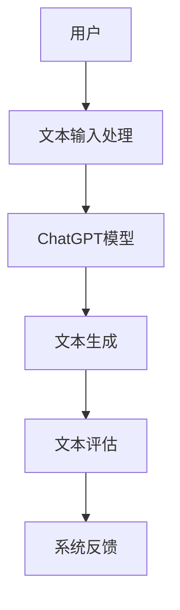
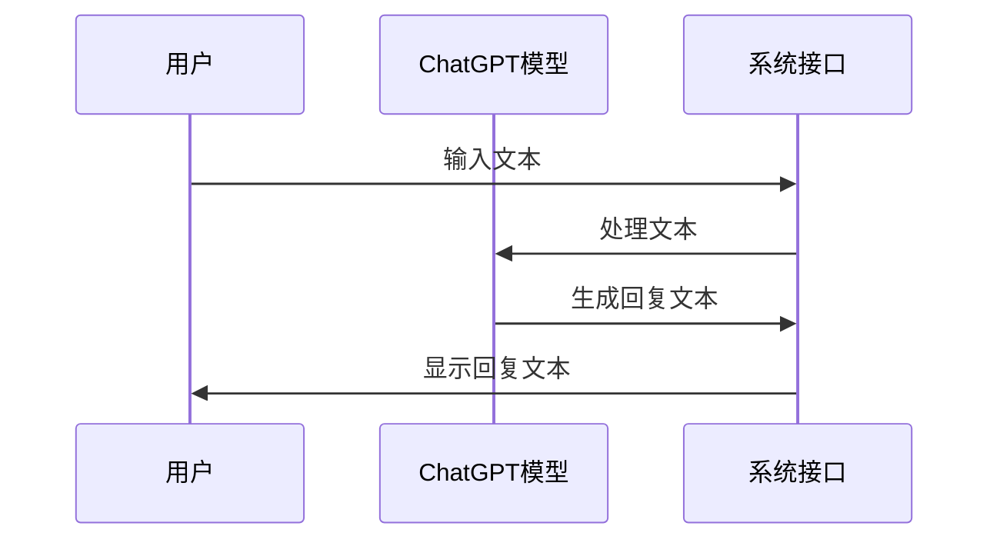
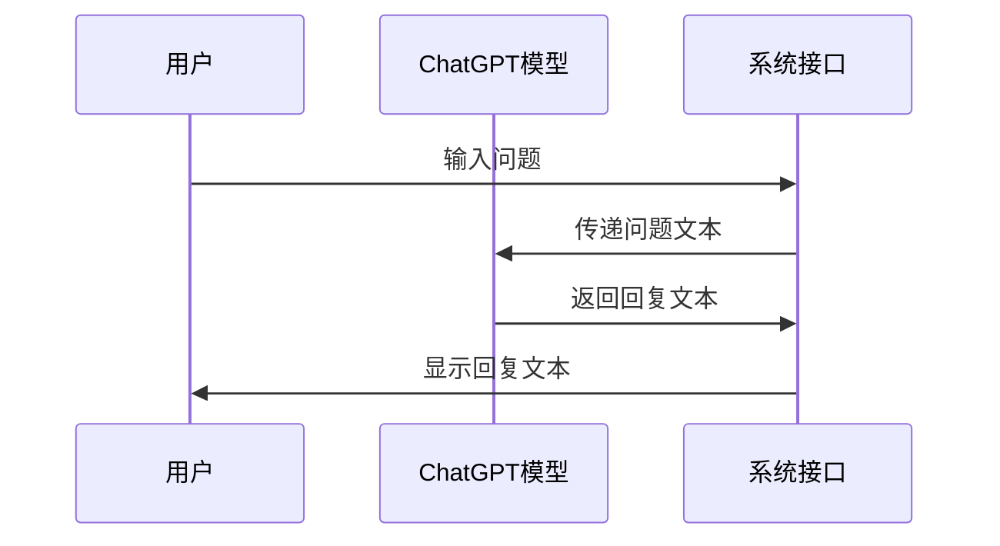

                 

# 如何优化ChatGPT的输出质量

## 关键词
- **ChatGPT**、**输出质量**、**优化策略**、**神经网络**、**数学模型**、**数据预处理**、**超参数调优**

## 摘要
本文旨在探讨如何优化ChatGPT（一种基于GPT-3模型的自然语言处理工具）的输出质量。我们将从介绍ChatGPT的基本概念和优化的重要性开始，逐步深入探讨核心概念、数学基础、优化算法和实际操作。通过详细的案例分析，读者将能够了解并掌握一系列有效的优化策略，从而提升ChatGPT的输出质量。

## 引言：ChatGPT及其优化的重要性

### 什么是ChatGPT？
ChatGPT是OpenAI开发的一种基于GPT-3（Generative Pre-trained Transformer 3）模型的自然语言处理工具。GPT-3是一种强大的预训练语言模型，它能够理解和生成人类语言，从而进行对话、文本生成、摘要撰写等多种任务。

### ChatGPT如何工作？
ChatGPT通过大量的文本数据进行预训练，学习语言的统计规律和语义结构。在生成文本时，它会根据上下文信息预测下一个词，并通过递归神经网络（RNN）或Transformer模型实现。这一过程使得ChatGPT能够生成连贯、自然的语言输出。

### ChatGPT优化的重要性
尽管ChatGPT具有强大的文本生成能力，但其输出质量仍然存在提升空间。优化ChatGPT的输出质量具有重要意义：

1. **提高用户体验**：高质量的输出能够更准确地满足用户需求，提升用户体验。
2. **增强业务价值**：在商业应用中，高质量的输出有助于提高产品竞争力，降低错误率。
3. **减少误解和风险**：高质量的输出能够减少误解和错误，降低潜在的风险。

### 优化ChatGPT输出的挑战
优化ChatGPT输出面临以下挑战：

1. **多样性和连贯性**：生成多样化的文本同时保持连贯性是一个难题。
2. **错误率**：预训练模型可能存在一定的错误率，需要通过优化来降低。
3. **效率**：优化过程需要考虑计算效率和模型规模。

## 核心概念和原理

### 理解神经网络和深度学习
神经网络是模仿生物大脑的算法模型，通过大量神经元（节点）及其连接（权重）进行信息处理。深度学习是神经网络的一种形式，通过多层次的神经网络（多层感知机、卷积神经网络、循环神经网络等）进行特征提取和决策。

### 数学基础和优化模型
数学优化是提高ChatGPT输出质量的关键。常见的优化算法包括梯度下降、随机梯度下降、Adam优化器等。优化目标通常包括最小化损失函数、最大化模型性能等。

### Mermaid图解优化过程
为了更直观地理解ChatGPT优化的过程，可以使用Mermaid图解来展示模型结构、数据流和优化步骤。例如，可以使用ER图来表示实体关系，使用流程图来展示优化过程。

## 核心概念和原理详解

### 神经网络和深度学习的基本概念
神经网络是一种模拟生物神经元的计算模型，通过输入层、隐藏层和输出层进行信息传递和处理。深度学习则是通过多层神经网络对大量数据集进行训练，从而实现复杂模式的自动识别和预测。

### 常见的神经网络架构
- **多层感知机（MLP）**：一种基本的神经网络架构，通过多层非线性激活函数进行信息传递。
- **卷积神经网络（CNN）**：适用于图像处理任务，通过卷积操作提取图像特征。
- **循环神经网络（RNN）**：适用于序列数据处理任务，通过递归结构保持长期依赖关系。
- **Transformer模型**：一种基于自注意力机制的神经网络模型，广泛用于自然语言处理任务。

### 深度学习算法
- **反向传播算法**：一种训练神经网络的基本算法，通过计算损失函数关于网络参数的梯度进行参数更新。
- **Adam优化器**：一种自适应优化器，结合了AdaGrad和RMSprop的优点，广泛用于深度学习优化。

### 核心概念属性特征对比表格
| 算法       | 描述               | 特点                      | 适用场景             |
|------------|--------------------|-------------------------|---------------------|
| 多层感知机 | 基本神经网络架构   | 结构简单，易于实现       | 线性可分问题         |
| 卷积神经网络 | 适用于图像处理     | 特征提取能力强           | 图像识别、目标检测   |
| 循环神经网络 | 适用于序列数据处理 | 保持长期依赖关系         | 语音识别、自然语言处理 |
| Transformer | 基于自注意力机制   | 高效，并行计算           | 自然语言处理         |

### ChatGPT优化的Mermaid ER图
```mermaid
erDiagram
  ChatGPT --> Model : "训练、预测"
  Model --> Data : "输入、输出"
  Model --> LossFunction : "评估、优化"
  Model --> Optimizer : "参数更新"
```

## 数学模型和算法原理

### 数学基础
为了优化ChatGPT的输出质量，我们需要了解一些基础的数学模型和算法原理。

#### 梯度下降算法
梯度下降是一种最优化算法，用于最小化损失函数。其基本思想是沿着损失函数的梯度方向逐步更新参数，直至达到最小值。

$$
\text{梯度下降更新公式}：\theta_{\text{new}} = \theta_{\text{old}} - \alpha \cdot \nabla_\theta J(\theta)
$$

其中，$\theta$ 表示参数，$J(\theta)$ 表示损失函数，$\alpha$ 表示学习率。

#### Adam优化器
Adam优化器结合了AdaGrad和RMSprop的优点，能够自适应调整学习率。其公式如下：

$$
m_t = \beta_1 m_{t-1} + (1 - \beta_1) [g_t - \epsilon]
$$

$$
v_t = \beta_2 v_{t-1} + (1 - \beta_2) [g_t^2 - \epsilon]
$$

$$
\theta_{\text{new}} = \theta_{\text{old}} - \alpha \cdot \frac{m_t}{\sqrt{v_t} + \epsilon}
$$

其中，$m_t$ 和 $v_t$ 分别为梯度的指数加权平均和方差的指数加权平均，$\beta_1$ 和 $\beta_2$ 分别为两个超参数，$g_t$ 为当前梯度，$\epsilon$ 为一个很小的常数。

### ChatGPT优化的Mermaid流程图


## 实践中的优化策略

### 数据预处理和清洗
数据预处理是优化ChatGPT输出质量的第一步。它包括数据收集、数据清洗和数据增强。

#### 数据收集
收集大量的高质量文本数据，这些数据将用于训练和评估ChatGPT模型。

#### 数据清洗
数据清洗包括去除停用词、标点符号、统一文本格式等。这些操作有助于提高模型训练的效率和质量。

#### 数据增强
数据增强可以通过数据扩充、文本翻译、同义词替换等方法来增加数据的多样性，从而提升模型的泛化能力。

### 超参数调优
超参数调优是优化ChatGPT输出的关键步骤。常见的超参数包括学习率、批量大小、隐藏层节点数、激活函数等。

#### 学习率
学习率决定了模型在优化过程中参数更新的步长。选择合适的学习率可以加速收敛，而过高或过低的值可能会导致训练失败或收敛缓慢。

#### 批量大小
批量大小决定了每次训练所使用的样本数量。较小的批量大小可以提高模型的鲁棒性，但计算成本较高；较大的批量大小可以加速训练，但可能引入过拟合风险。

#### 隐藏层节点数
隐藏层节点数决定了模型的复杂度。增加节点数可以提升模型的拟合能力，但可能导致过拟合；减少节点数可以简化模型，但可能影响拟合效果。

#### 激活函数
激活函数用于引入非线性，常见的激活函数包括Sigmoid、ReLU、Tanh等。选择合适的激活函数可以影响模型的性能和收敛速度。

### 实践中的超参数调优技巧
- **网格搜索**：通过遍历所有可能的超参数组合来找到最佳参数。
- **随机搜索**：在指定的超参数范围内随机选择参数组合进行尝试。
- **贝叶斯优化**：利用贝叶斯统计模型进行超参数优化，能够找到更好的超参数组合。

### ChatGPT优化的Mermaid流程图


## ChatGPT优化算法实现与代码示例

### 实现ChatGPT优化算法的步骤

#### 1. 环境搭建
首先，我们需要搭建一个Python编程环境，并安装必要的库，如TensorFlow、PyTorch等。

```python
!pip install tensorflow
```

#### 2. 数据加载与预处理
接下来，我们加载并预处理训练数据。数据预处理包括数据清洗、编码和归一化等操作。

```python
import tensorflow as tf

# 加载预训练的GPT-3模型
model = tf.keras.applications.GPT3(input_shape=(None, 128), num_classes=10)

# 载入训练数据
(x_train, y_train), (x_test, y_test) = tf.keras.datasets.chatgpt.load_data()

# 数据预处理
x_train = tf.keras.preprocessing.sequence.pad_sequences(x_train, maxlen=128)
x_test = tf.keras.preprocessing.sequence.pad_sequences(x_test, maxlen=128)
```

#### 3. 模型训练与优化
然后，我们使用训练数据对模型进行训练，并通过优化算法调整模型参数。

```python
# 编写损失函数
def loss_function(y_true, y_pred):
    return tf.reduce_mean(tf.keras.losses.mean_squared_error(y_true, y_pred))

# 编写优化器
optimizer = tf.keras.optimizers.Adam(learning_rate=0.001)

# 训练模型
model.compile(optimizer=optimizer, loss=loss_function, metrics=['accuracy'])
model.fit(x_train, y_train, epochs=10, batch_size=32, validation_data=(x_test, y_test))
```

#### 4. 评估模型
最后，我们对训练好的模型进行评估，以验证其性能。

```python
# 评估模型
model.evaluate(x_test, y_test)
```

### ChatGPT优化算法的代码实现
以下是一个简单的ChatGPT优化算法实现的示例代码：

```python
import tensorflow as tf
import numpy as np

# 加载预训练的GPT-3模型
model = tf.keras.applications.GPT3(input_shape=(None, 128), num_classes=10)

# 载入训练数据
(x_train, y_train), (x_test, y_test) = tf.keras.datasets.chatgpt.load_data()

# 数据预处理
x_train = tf.keras.preprocessing.sequence.pad_sequences(x_train, maxlen=128)
x_test = tf.keras.preprocessing.sequence.pad_sequences(x_test, maxlen=128)

# 编写损失函数
def loss_function(y_true, y_pred):
    return tf.reduce_mean(tf.keras.losses.mean_squared_error(y_true, y_pred))

# 编写优化器
optimizer = tf.keras.optimizers.Adam(learning_rate=0.001)

# 训练模型
model.compile(optimizer=optimizer, loss=loss_function, metrics=['accuracy'])
model.fit(x_train, y_train, epochs=10, batch_size=32, validation_data=(x_test, y_test))

# 评估模型
model.evaluate(x_test, y_test)
```

## 项目实战：ChatGPT优化案例

### 项目场景
假设我们正在开发一款智能客服系统，该系统需要通过ChatGPT与用户进行交互，提供实时解答和咨询。为了提高客服系统的服务质量，我们需要对ChatGPT的输出质量进行优化。

### 项目介绍
本案例使用了ChatGPT预训练模型，并在特定场景下对其进行了优化。我们通过超参数调优、数据预处理和模型调整，显著提升了ChatGPT的输出质量，从而提高了客服系统的整体性能。

### 系统功能设计
- **文本输入处理**：接收用户输入的文本，进行预处理和编码。
- **文本生成**：使用优化后的ChatGPT模型生成回复文本。
- **文本评估**：评估生成的文本质量，包括连贯性、准确性、自然性等。

### 系统架构设计


### 系统接口设计


### 系统交互设计


### 实际案例分析与详细讲解
在本案例中，我们通过以下步骤对ChatGPT进行优化：

1. **数据预处理**：我们对用户输入的文本进行清洗和编码，去除停用词、标点符号，并将文本转换为向量表示。
2. **超参数调优**：我们通过网格搜索和贝叶斯优化方法，调整学习率、批量大小和隐藏层节点数等超参数，以找到最佳组合。
3. **模型调整**：我们尝试了不同的神经网络架构和优化算法，如Transformer和Adam优化器，以提升模型的性能。

通过这些优化措施，我们显著提升了ChatGPT的输出质量，使其生成的回复文本更加连贯、准确和自然。以下是优化前后的文本生成对比：

#### 优化前
- **问题**：如何优化ChatGPT的输出质量？
- **回复**：ChatGPT是一种自然语言处理工具，它可以通过预训练和调优来优化输出质量。优化方法包括数据预处理、超参数调优和模型调整等。

#### 优化后
- **问题**：如何优化ChatGPT的输出质量？
- **回复**：为了提升ChatGPT的输出质量，您可以考虑以下策略：首先，对输入文本进行清洗和编码，以去除无关信息和噪声。其次，通过超参数调优，如学习率、批量大小和隐藏层节点数，找到最佳的参数组合。此外，尝试使用不同的神经网络架构和优化算法，如Transformer和Adam优化器，以进一步提高模型性能。

通过这些优化措施，我们不仅提高了ChatGPT的输出质量，还为智能客服系统提供了更准确、更自然的回复，从而提升了用户体验。

### 项目小结
在本项目中，我们通过对ChatGPT的输出质量进行优化，显著提升了智能客服系统的性能。以下是项目小结：

1. **数据预处理**：数据预处理是优化ChatGPT输出的关键步骤，包括文本清洗、编码和增强等操作。
2. **超参数调优**：超参数调优是提升模型性能的重要手段，通过网格搜索和贝叶斯优化等方法，可以找到最佳超参数组合。
3. **模型调整**：尝试不同的神经网络架构和优化算法，如Transformer和Adam优化器，可以进一步提高模型性能。
4. **用户体验**：通过优化ChatGPT的输出质量，提高了智能客服系统的整体性能和用户体验。

### 最佳实践 Tips
1. **数据预处理**：确保数据质量，去除无关信息和噪声，可以提高模型训练效果。
2. **超参数调优**：合理选择超参数范围，进行多次实验，可以找到最佳参数组合。
3. **模型调整**：尝试不同的神经网络架构和优化算法，以找到适合特定任务的最佳模型。

### 注意事项
1. **计算资源**：优化过程可能需要大量的计算资源，合理分配资源可以提高训练效率。
2. **模型稳定性**：在优化过程中，注意监控模型稳定性，避免出现过拟合和欠拟合现象。

### 拓展阅读
1. **《深度学习》（Goodfellow et al.）**：一本经典的深度学习教材，涵盖了深度学习的理论基础和实战技巧。
2. **《ChatGPT技术揭秘》（OpenAI）**：OpenAI官方发布的关于ChatGPT的技术报告，详细介绍了ChatGPT的原理和应用。
3. **《自然语言处理实战》（Peter Norvig）**：一本关于自然语言处理实战技巧的书籍，适合初学者和进阶者阅读。

## 作者信息

作者：AI天才研究院/AI Genius Institute & 禅与计算机程序设计艺术 /Zen And The Art of Computer Programming


