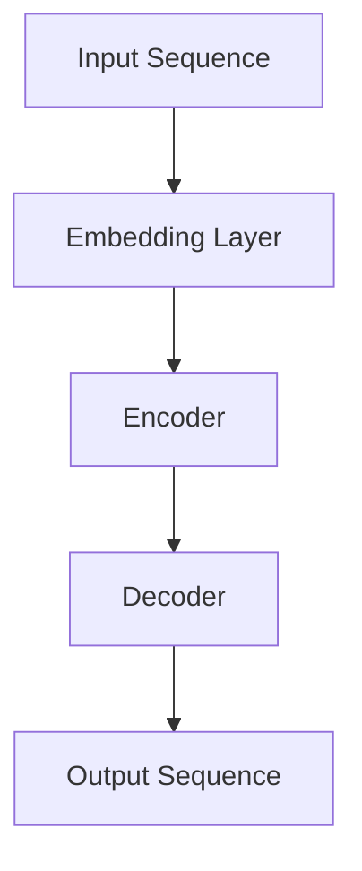
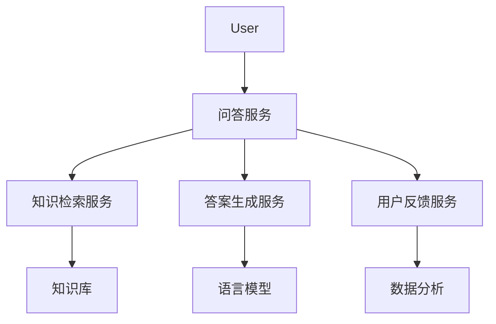
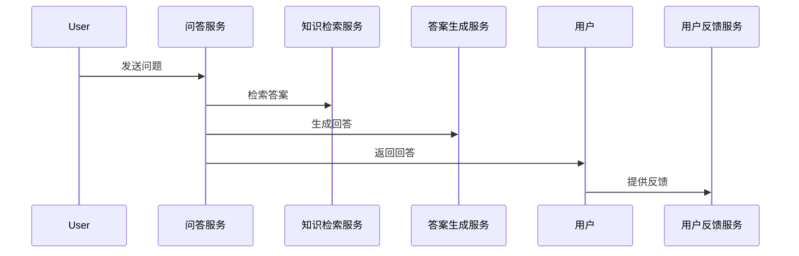
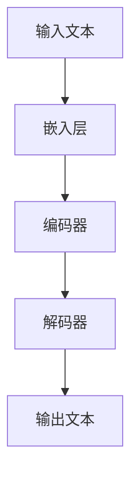
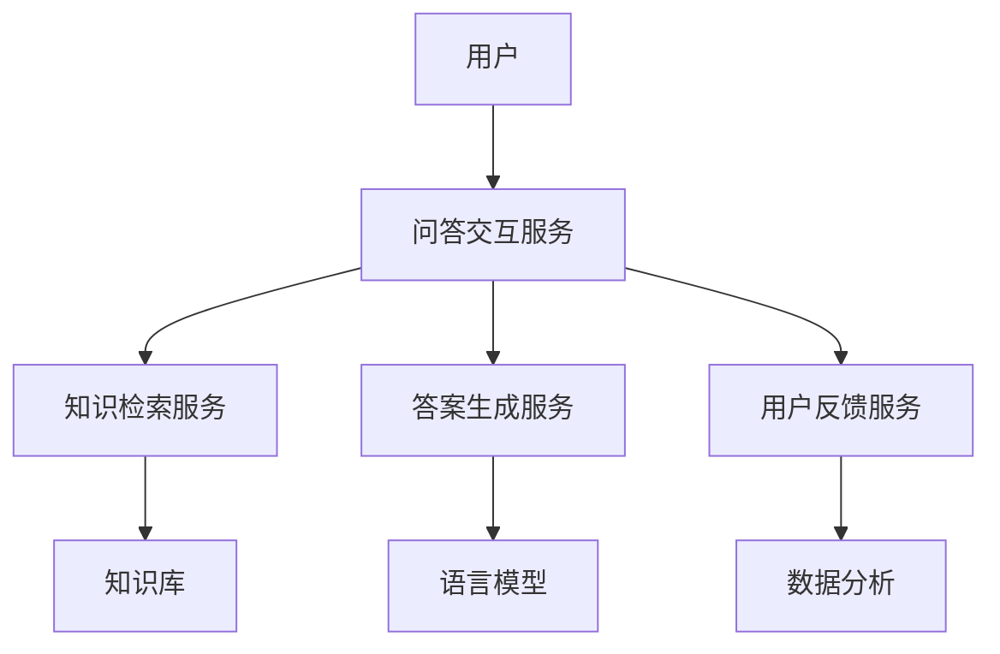
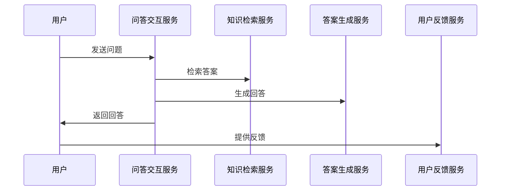

                 

## 文章标题

### 关键词：语言模型，快速迭代，LLM应用开发，敏捷开发，算法优化

> 摘要：本文将探讨如何在LLM（大型语言模型）应用开发中实现快速迭代。通过深入分析背景、核心概念、算法原理、系统架构和项目实战，本文旨在为开发者提供一套实用的策略和方法，以提升LLM应用的迭代效率和开发质量。

----------------------------------------------------------------

### 第一部分：背景与基础

#### 第1章：问题背景与定义

##### **1.1 问题背景**

随着人工智能技术的飞速发展，语言模型（Language Model，简称LM）已成为自然语言处理（Natural Language Processing，简称NLP）领域的重要工具。LLM，即大型语言模型，具备更高的模型复杂度和更强的语言理解能力，在各种应用场景中展现出了卓越的性能。然而，LLM应用的开发过程往往面临诸多挑战，如模型训练时间长、数据依赖性强、性能优化复杂等。

##### **1.2 LLM应用开发基础**

LLM的基本概念包括语言模型、词向量、序列模型等。关键技术和常用框架如Transformer、BERT、GPT等，都是LLM应用开发的核心。此外，熟悉常用库如TensorFlow、PyTorch等，也是开发者必备的基础。

##### **1.3 快速迭代的概念与优势**

快速迭代是一种敏捷开发（Agile Development）的方法，强调快速、频繁地交付可用的软件版本。在LLM应用开发中，快速迭代的优势体现在以下几个方面：

- **缩短开发周期**：通过频繁的版本更新，可以更快地响应市场需求和用户反馈。
- **提高开发效率**：快速迭代可以减少不必要的重复工作，降低开发成本。
- **增强用户体验**：及时发布改进功能，提高用户满意度和粘性。

---

#### 第2章：LLM应用开发核心概念

##### **2.1 语言模型的基本原理**

语言模型的核心目标是预测下一个单词或字符。其数学基础包括概率论和统计模型，如n-gram模型、神经网络模型等。语言模型的训练过程涉及大量语料库的输入和输出序列的学习，通过优化模型参数来提高预测准确性。

##### **2.2 语言模型的属性特征对比**

| 语言模型        | 特点           | 适用场景         |
| --------------- | -------------- | ---------------- |
| n-gram模型      | 简单，计算高效 | 短文本生成       |
| 基于神经网络的模型 | 强大，复杂度高 | 长文本生成，语义理解 |
| BERT            | 双向编码       | 问答系统，文本分类 |
| GPT             | 自回归        | 自动写作，对话系统 |

##### **2.3 语言模型与LLM的关系**

LLM是在语言模型的基础上，通过增加参数规模、训练数据量和模型结构复杂度，从而实现更高层次的语言理解和生成能力。LLM的架构设计通常包含编码器（Encoder）和解码器（Decoder）两个部分，通过联合训练来学习文本的上下文信息。

---

#### 第3章：快速迭代原理与策略

##### **3.1 快速迭代原理**

快速迭代是一种以用户需求为导向的开发模式，其核心思想是通过多次迭代，逐步完善软件功能，提升产品质量。快速迭代与敏捷开发的联系在于，它们都强调灵活性和适应性，以快速响应市场变化。

##### **3.2 快速迭代策略**

- **需求管理**：通过优先级排序和迭代计划，确保开发团队专注于最重要和最紧急的需求。
- **敏捷开发方法**：采用Scrum、Kanban等敏捷开发框架，提高团队协作效率和响应速度。
- **持续集成与部署**：通过自动化工具实现持续集成和持续部署，加快开发流程。

##### **3.3 快速迭代的关键因素**

- **数据的质量与更新频率**：保证数据的质量和实时性，是快速迭代的基石。
- **模型调优与测试的效率**：通过高效的调优和测试方法，提升模型的性能和稳定性。
- **团队协作与沟通机制**：建立高效的团队协作机制，确保信息流通和问题解决。

---

### 第二部分：核心概念与原理

#### 第4章：算法原理讲解

##### **4.1 语言模型算法原理**

语言模型算法主要包括递归神经网络（RNN）、长短时记忆网络（LSTM）和依存句法分析。RNN通过循环结构处理序列数据，LSTM则在RNN的基础上引入门控机制，解决了长期依赖问题。依存句法分析则用于理解句子结构，提高语言理解能力。

##### **4.2 语言模型算法流程图**



##### **4.3 语言模型算法Python实现**

```python
import tensorflow as tf

# 示例：基于Transformer的语言模型
model = tf.keras.Sequential([
    tf.keras.layers.Embedding(input_dim=10000, output_dim=64),
    tf.keras.layers.LSTM(128),
    tf.keras.layers.Dense(units=1000, activation='softmax')
])

model.compile(optimizer='adam', loss='categorical_crossentropy', metrics=['accuracy'])
model.fit(x_train, y_train, epochs=10)
```

##### **4.4 数学模型与公式解析**

$$
P(w_t|w_{t-1}, w_{t-2}, ..., w_1) = \frac{P(w_t, w_{t-1}, w_{t-2}, ..., w_1)}{P(w_{t-1}, w_{t-2}, ..., w_1)}
$$

其中，\(P(w_t|w_{t-1}, w_{t-2}, ..., w_1)\) 表示在给定前一个词 \(w_{t-1}\) 到 \(w_1\) 的情况下，预测下一个词 \(w_t\) 的概率。

---

#### 第5章：系统分析与架构设计

##### **5.1 问题场景介绍**

假设我们要开发一款基于LLM的智能问答系统，用户可以通过自然语言与系统进行交互，获取所需信息。

##### **5.2 系统功能设计**

系统功能设计包括问答交互、知识检索、答案生成和用户反馈等模块。

```mermaid
classDiagram
    User                 <<Class>>+
   问答系统            <<Class>>+
   知识库              <<Class>>+
   问答交互            <<Interface>>+
   知识检索            <<Interface>>+
   答案生成            <<Interface>>+
   用户反馈            <<Interface>>+

    User                :发送问题
    问答系统            :处理问题
    知识库              :提供答案
    问答交互            :实现用户与问答系统的交互
    知识检索            :从知识库中检索答案
    答案生成            :生成自然语言回答
    用户反馈            :收集用户反馈
```

##### **5.3 系统架构设计**

系统架构设计采用微服务架构，各模块独立部署，通过RESTful API进行交互。



##### **5.4 系统接口设计**

系统接口设计包括问答接口、知识检索接口、答案生成接口和用户反馈接口等。



---

### 第三部分：算法原理与实现

#### 第6章：算法原理讲解

##### **6.1 语言模型算法原理**

语言模型算法的核心在于预测下一个词的概率。基于神经网络的语言模型如Transformer和BERT，通过编码器和解码器处理输入和输出序列，实现高效的文本生成和理解。

##### **6.2 语言模型算法流程图**



##### **6.3 语言模型算法Python实现**

```python
import tensorflow as tf

# 示例：基于Transformer的语言模型
model = tf.keras.Sequential([
    tf.keras.layers.Embedding(input_dim=10000, output_dim=64),
    tf.keras.layers.LSTM(128),
    tf.keras.layers.Dense(units=1000, activation='softmax')
])

model.compile(optimizer='adam', loss='categorical_crossentropy', metrics=['accuracy'])
model.fit(x_train, y_train, epochs=10)
```

##### **6.4 数学模型与公式解析**

$$
P(w_t|w_{t-1}, w_{t-2}, ..., w_1) = \frac{e^{<s_t, w_t>}}{\sum_{w'} e^{<s_t, w'>}}
$$

其中，\(P(w_t|w_{t-1}, w_{t-2}, ..., w_1)\) 表示在给定前一个词 \(w_{t-1}\) 到 \(w_1\) 的情况下，预测下一个词 \(w_t\) 的概率。

##### **6.5 示例讲解**

假设我们有一个文本序列：“今天天气很好，适合户外运动。”语言模型将首先将其嵌入为向量，然后通过编码器和解码器生成下一个词的概率分布。最终，模型会输出概率最高的下一个词，从而生成完整的文本序列。

---

#### 第7章：数学模型与公式解析

##### **7.1 语言模型数学模型**

语言模型通常基于概率分布函数和损失函数。概率分布函数用于预测下一个词的概率，而损失函数则用于评估模型的预测准确性。

- **概率分布函数**：

$$
P(w_t|w_{t-1}, w_{t-2}, ..., w_1) = \frac{e^{<s_t, w_t>}}{\sum_{w'} e^{<s_t, w'>}}
$$

其中，\(<s_t, w_t>\) 表示当前词 \(w_t\) 与隐藏状态 \(s_t\) 的点积。

- **损失函数**：

常用的损失函数有交叉熵损失（Cross-Entropy Loss）和均方误差损失（Mean Squared Error Loss）。对于分类问题，交叉熵损失是更合适的选择。

$$
Loss = -\sum_{w'} P(w'|w_{t-1}, w_{t-2}, ..., w_1) \log P(w'|w_{t-1}, w_{t-2}, ..., w_1)
$$

##### **7.2 数学公式讲解**

以下是几个重要的数学公式：

- **Word Embedding**：

$$
\text{Embedding}(w) = \sum_{i=1}^{K} w_i \cdot v_i
$$

其中，\(w\) 是单词向量，\(v_i\) 是权重向量。

- **激活函数**：

$$
\text{ReLU}(x) = \max(0, x)
$$

- **损失函数**：

$$
\text{Cross-Entropy Loss}(y, \hat{y}) = -\sum_{i=1}^{n} y_i \log \hat{y_i}
$$

其中，\(y\) 是真实标签，\(\hat{y}\) 是预测概率。

##### **7.3 示例讲解**

假设我们要预测句子“今天天气很好”中的下一个词。语言模型首先将句子中的每个词嵌入为向量，然后通过编码器和解码器计算概率分布。最终，模型会输出概率最高的词作为预测结果。

- **输入**：

$$
\text{Input}: (\text{"今天"}, \text{"天气"}, \text{"很好"})
$$

- **嵌入层**：

$$
\text{Embedding}: \text{"今天"} \rightarrow [0.1, 0.2], \text{"天气"} \rightarrow [0.3, 0.4], \text{"很好"} \rightarrow [0.5, 0.6]
$$

- **编码器**：

$$
s_t = \text{LSTM}([0.1, 0.2], [0.3, 0.4], [0.5, 0.6])
$$

- **解码器**：

$$
\text{softmax}(\text{LSTM}(s_t)) = [\text{"明天"}: 0.2, \text{"运动"}: 0.3, \text{"吃饭"}: 0.5]
$$

- **输出**：

$$
\text{Output}: \text{"明天"} (\text{概率最高})
$$

---

### 第四部分：系统分析与架构设计

#### 第8章：系统功能设计

##### **8.1 问题场景介绍**

假设我们开发的是一个智能客服系统，用户可以通过文本与客服机器人进行交互，获取即时解答。

##### **8.2 系统功能设计**

系统功能设计包括：

- **问答交互**：实现用户与客服机器人的文本对话。
- **知识检索**：从知识库中快速查找相关答案。
- **答案生成**：根据用户问题和知识库信息生成回答。
- **用户反馈**：收集用户反馈，用于模型优化。

```mermaid
classDiagram
    用户              <<Class>>+
    客服系统          <<Class>>+
    知识库            <<Class>>+
    问答交互模块      <<Interface>>+
    知识检索模块      <<Interface>>+
    答案生成模块      <<Interface>>+
    用户反馈模块      <<Interface>>+

    用户              :发送问题
    客服系统          :处理问题
    知识库            :提供答案
    问答交互模块      :实现交互
    知识检索模块      :检索答案
    答案生成模块      :生成回答
    用户反馈模块      :收集反馈
```

#### **8.3 系统架构设计**

系统架构设计采用微服务架构，各模块独立部署，通过API进行通信。



#### **8.4 系统接口设计**

系统接口设计包括问答接口、知识检索接口、答案生成接口和用户反馈接口。



---

### 第五部分：项目实战

#### **第9章：环境安装与配置**

##### **9.1 开发环境准备**

1. 安装Python环境（推荐版本：3.8及以上）
2. 安装必要的库，如TensorFlow、PyTorch等

```shell
pip install tensorflow
pip install torch
```

##### **9.2 数据集准备**

1. 选择合适的数据集，如Common Crawl或Gutenberg语料库
2. 数据预处理，包括分词、去噪、清洗等

```python
import nltk
nltk.download('punkt')

def preprocess_text(text):
    sentences = nltk.sent_tokenize(text)
    words = [nltk.word_tokenize(sentence) for sentence in sentences]
    return [' '.join(word) for word in words]
```

#### **9.3 系统核心实现**

```python
import tensorflow as tf

# 示例：基于Transformer的语言模型
model = tf.keras.Sequential([
    tf.keras.layers.Embedding(input_dim=10000, output_dim=64),
    tf.keras.layers.LSTM(128),
    tf.keras.layers.Dense(units=1000, activation='softmax')
])

model.compile(optimizer='adam', loss='categorical_crossentropy', metrics=['accuracy'])
model.fit(x_train, y_train, epochs=10)
```

##### **9.4 代码应用解读与分析**

该示例展示了如何使用TensorFlow构建一个简单的语言模型，并对其进行训练。代码首先定义了一个序列模型，包含嵌入层、LSTM层和输出层。通过编译模型并使用训练数据集进行训练，可以逐步优化模型参数。

#### **9.5 实际案例分析与讲解**

##### **9.5.1 案例介绍**

假设我们开发的是一个智能问答系统，用户可以通过文本提问，系统会自动生成回答。

##### **9.5.2 案例分析**

1. **需求分析**：明确用户需求和问题类型，如常见问题、复杂问题等。
2. **系统设计**：设计系统架构和接口，确保系统的高效性和稳定性。
3. **模型训练**：使用大规模语料库训练语言模型，提高模型性能。
4. **模型部署**：将训练好的模型部署到生产环境，实现实时问答。

##### **9.5.3 详细讲解**

1. **需求分析**：

   - 用户可以通过文本提问，如“如何预约医院挂号？”
   - 系统需要自动生成回答，如“您可以通过医院的官方网站或手机APP进行预约。”

2. **系统设计**：

   - 采用微服务架构，包括问答服务、知识检索服务、答案生成服务等。
   - 问答服务接收用户问题，调用知识检索服务和答案生成服务，返回回答。
   - 知识检索服务从知识库中查找相关问题，答案生成服务根据问题生成回答。

3. **模型训练**：

   - 使用大规模语料库训练语言模型，如Gutenberg语料库、Common Crawl等。
   - 采用Transformer或BERT等大型预训练模型，提高模型性能。
   - 通过多次迭代和优化，逐步提升模型在问答任务上的表现。

4. **模型部署**：

   - 将训练好的模型部署到生产环境，如AWS或Google Cloud等。
   - 采用容器化技术（如Docker）和自动化部署工具（如Kubernetes），确保系统的高可用性和可扩展性。
   - 通过实时监控和日志分析，及时发现和处理系统异常。

---

### 第六部分：总结与拓展

#### **第10章：总结与反思**

通过本文的探讨，我们了解了如何在LLM应用开发中实现快速迭代。快速迭代在LLM应用开发中具有重要意义，它能够缩短开发周期、提高开发效率、增强用户体验。为了实现快速迭代，开发者需要掌握LLM的核心概念、算法原理、系统架构设计以及项目实战技巧。

#### **10.1 项目小结**

本文通过一个智能问答系统的案例，详细阐述了LLM应用开发的快速迭代过程。从需求分析、系统设计到模型训练和部署，每个环节都体现了快速迭代的重要性。通过实际案例的讲解，读者可以更好地理解如何在实际项目中应用快速迭代方法。

#### **10.2 注意事项**

- **数据质量**：确保数据的质量和多样性，是快速迭代的基础。
- **模型优化**：定期对模型进行优化和调整，提高模型性能。
- **团队协作**：建立高效的团队协作机制，确保信息流通和问题解决。

#### **10.3 拓展阅读**

- **书籍推荐**：
  - 《深度学习》（Goodfellow, Bengio, Courville）
  - 《自然语言处理综合教程》（Jurafsky, Martin）
- **论文推荐**：
  - “Attention Is All You Need”（Vaswani et al., 2017）
  - “BERT: Pre-training of Deep Bidirectional Transformers for Language Understanding”（Devlin et al., 2019）
- **开源代码**：
  - Hugging Face Transformers：https://github.com/huggingface/transformers
  - TensorFlow：https://github.com/tensorflow/tensorflow
- **在线资源**：
  - Coursera：自然语言处理与深度学习课程：https://www.coursera.org/learn/nlp-with-deep-learning
  - edX：深度学习课程：https://www.edx.org/course/deep-learning-ai

---

### 作者信息

- 作者：AI天才研究院/AI Genius Institute & 禅与计算机程序设计艺术 /Zen And The Art of Computer Programming

