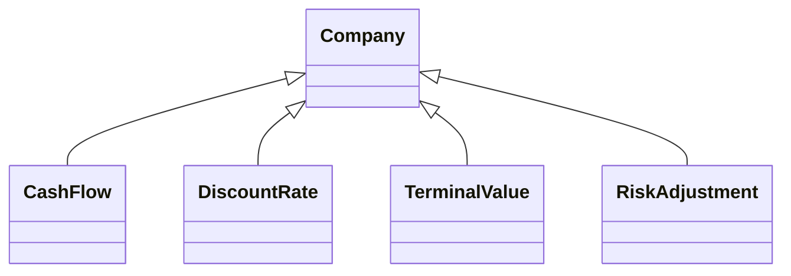
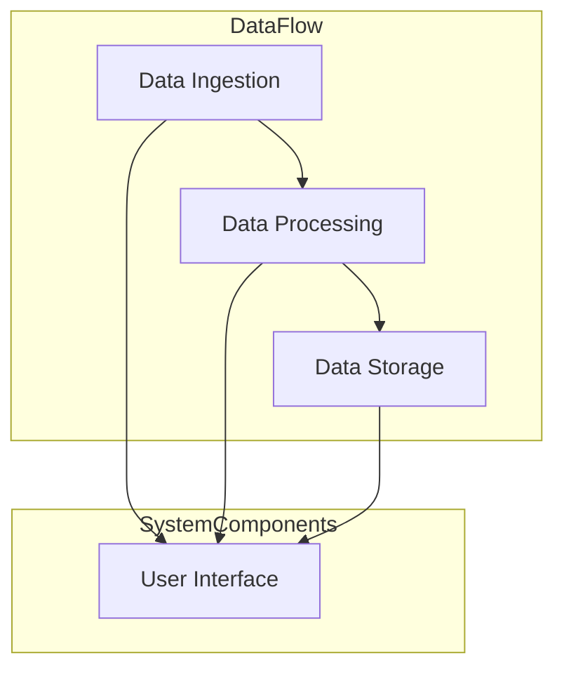
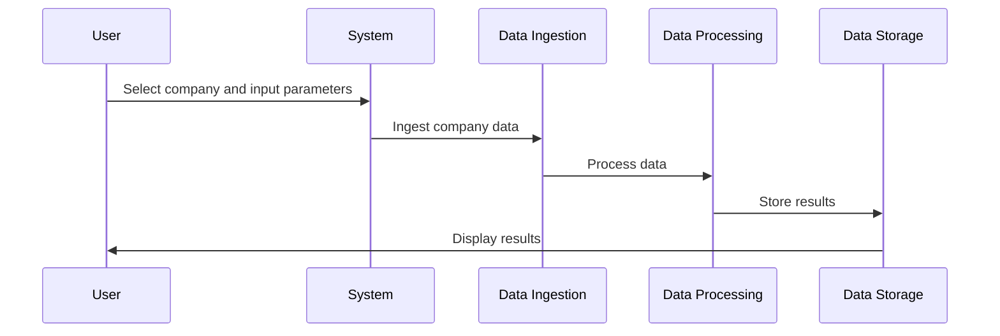

                 


### Introduction to the Concept of Intrinsic Value

The concept of intrinsic value is fundamental in the world of finance and investment. At its core, intrinsic value represents the true worth of an asset, a company, or any other entity, independent of its market price. Unlike market value, which is the price at which an asset can be bought or sold in the market, intrinsic value is derived from the underlying fundamentals, such as the company's financial health, growth prospects, and risk factors.

In the realm of investment, understanding and calculating intrinsic value is crucial for making informed decisions. Investors often rely on market values, which can be volatile and influenced by various external factors, leading to potential mispricing. In contrast, intrinsic value provides a more stable and long-term perspective, enabling investors to identify undervalued or overvalued assets.

### The Need for a Structured Approach

Calculating intrinsic value is not a straightforward task. It requires a systematic and analytical approach, taking into account multiple factors and assumptions. Without a structured methodology, the estimation can be subjective and prone to errors. Therefore, it is essential to develop a clear and consistent framework to evaluate intrinsic value accurately.

This article aims to provide such a framework by breaking down the process into manageable steps. We will explore various theoretical models and practical applications, enabling readers to grasp the complexities involved and apply them to real-world scenarios.

### Chapter Outline

To facilitate a thorough understanding of intrinsic value calculation, we will structure the article into the following chapters:

1. **Introduction to Intrinsic Value Calculation**
   - The importance of intrinsic value in investment decision-making.
   - Theoretical foundations of intrinsic value.
   - Practical applications and challenges.
   - Summary and key takeaways.

2. **Core Concepts and Relationships**
   - Detailed explanations of core concepts such as cash flow, discount rate, terminal value, and risk adjustments.
   - A comparison table of concept attributes.
   - Entity-relationship diagrams to illustrate the relationships between concepts.

3. **Theoretical Models**
   - The Dividend Discount Model (DDM).
   - The Free Cash Flow to Equity (FCFE) Model.
   - The discounted cash flow (DCF) Model.
   - Comparative analysis of the models.

4. **Algorithm and Mathematics**
   - A step-by-step guide to calculating intrinsic value using DCF and FCFE models.
   - Python code examples and mathematical models.
   - Detailed explanations and examples.

5. **System Design and Architecture**
   - Introduction to the system design context.
   - Domain model (class diagram) and system architecture (architecture diagram).
   - System interface design and interaction (sequence diagram).

6. **Project Implementation**
   - Environment setup and installation.
   - Core implementation source code.
   - Code application analysis and case study.

7. **Best Practices and Conclusion**
   - Best practices for intrinsic value calculation.
   - Summary of the key points discussed.
   - Notes and precautions.
   - Suggestions for further reading.

By following this structured approach, readers will gain a comprehensive understanding of intrinsic value calculation, enabling them to apply the knowledge effectively in their investment strategies.

----------------------------------------------------------------

### Key Terms and Concepts

To ensure a clear understanding of the article, it is essential to define and explain the key terms and concepts related to intrinsic value calculation. Here are the terms we will be using throughout the article:

1. **Intrinsic Value**: The true worth of an asset, derived from its underlying fundamentals such as financial health, growth prospects, and risk factors, independent of its market price.

2. **Market Value**: The price at which an asset can be bought or sold in the market, influenced by various external factors.

3. **Cash Flow**: The amount of money a company generates from its operations, typically categorized as operating cash flow (OCF) or free cash flow (FCF).

4. **Discount Rate**: The rate used to discount future cash flows to their present value, reflecting the time value of money and the risk associated with the investment.

5. **Terminal Value**: The estimated value of a company's cash flows beyond the forecast period, often calculated using a perpetuity growth rate.

6. **Risk Adjustments**: Adjustments made to the cash flows and discount rate to account for the risk associated with the investment, such as market risk, business risk, and financial risk.

7. **Dividend Discount Model (DDM)**: A valuation method that estimates the intrinsic value of a company by discounting its expected future dividends to their present value.

8. **Free Cash Flow to Equity (FCFE)**: The cash flow available to equity holders after all operating expenses, capital expenditures, and debt payments.

9. **Discounted Cash Flow (DCF)**: A valuation method that estimates the intrinsic value of a company by discounting its expected future cash flows to their present value.

10. **Entity-Relationship Diagram (ERD)**: A visual representation of the relationships between entities (concepts) in a database.

By understanding these key terms and concepts, readers will be better equipped to grasp the intricacies of intrinsic value calculation and apply the knowledge effectively in their investment strategies.

----------------------------------------------------------------

### The Importance of Intrinsic Value in Investment Decision-Making

Understanding and calculating the intrinsic value of a company is paramount for making informed investment decisions. It provides a more reliable and long-term perspective than relying solely on market prices, which can be influenced by short-term market sentiments and external factors. Here's a deeper look into why intrinsic value is crucial for investors:

#### Differentiating Intrinsic Value from Market Value

Market value is the current price at which an asset can be bought or sold in the market. It fluctuates based on supply and demand, market conditions, and investor sentiment. While market value provides a real-time snapshot of an asset's perceived value, it does not necessarily reflect the true worth of the asset. In contrast, intrinsic value is based on the underlying fundamentals of the company, such as its financial health, growth prospects, and risk factors. It is calculated using systematic methods like the Dividend Discount Model (DDM) or the Discounted Cash Flow (DCF) model, providing a more stable and reliable estimate of the asset's true worth.

#### The Role of Intrinsic Value in Long-Term Investment

Intrinsic value is particularly valuable for long-term investors, who focus on the underlying fundamentals of a company rather than short-term market fluctuations. Long-term investors seek to identify undervalued assets that have the potential for growth over time. By calculating the intrinsic value of a company, investors can determine whether the market price is fair, undervalued, or overvalued. If the intrinsic value is higher than the market price, the company may be considered undervalued, offering a potential buying opportunity. Conversely, if the intrinsic value is lower than the market price, the company may be overvalued, indicating a potential selling opportunity.

#### Practical Application of Intrinsic Value in Investment Strategies

1. **Value Investing**: Value investors seek to identify undervalued stocks by calculating their intrinsic value and comparing it to the market price. They focus on buying stocks with a low price relative to their intrinsic value, expecting the market to eventually recognize the true worth of the company.

2. **Growth Investing**: Growth investors look for companies with high growth potential, even if their current market prices reflect a premium relative to their intrinsic value. They believe that the market will eventually catch up with the company's growth prospects, leading to an increase in the intrinsic value and a corresponding rise in the market price.

3. **Contrarian Investing**: Contrarian investors look for opportunities when the market is overreacting to negative news or poor performance, causing the market price to deviate significantly from the intrinsic value. They believe that these deviations present buying opportunities, as the market is likely to correct itself in the long run.

#### The Importance of Accurate Intrinsic Value Calculation

Accurate calculation of intrinsic value is essential for effective investment decision-making. Errors or omissions in the calculation can lead to incorrect valuations and potentially costly mistakes. Investors must consider various factors, such as the company's financial health, growth prospects, and risk factors, while making appropriate adjustments for future uncertainties.

#### The Impact of Intrinsic Value on Investment Performance

Investors who consistently calculate intrinsic value and make investment decisions based on this calculation tend to outperform those who rely solely on market prices. By identifying undervalued or overvalued assets, investors can time their buying and selling activities more effectively, maximizing their returns over the long term.

In conclusion, intrinsic value is a crucial tool for investors in making informed and profitable investment decisions. By understanding and calculating the intrinsic value of companies, investors can avoid the pitfalls of market-driven sentiment and focus on the underlying fundamentals that drive long-term growth and value.

----------------------------------------------------------------

### Theoretical Foundations of Intrinsic Value

The calculation of intrinsic value is rooted in several theoretical models, each offering a unique perspective on how to derive the true worth of a company. Among the most widely used models are the Dividend Discount Model (DDM), the Free Cash Flow to Equity (FCFE) Model, and the Discounted Cash Flow (DCF) Model. This section will delve into these models, explaining their underlying principles and applications.

#### The Dividend Discount Model (DDM)

The Dividend Discount Model (DDM) is a valuation method that estimates the intrinsic value of a company by discounting its expected future dividends to their present value. The basic premise of the DDM is that the value of a company's stock is equal to the sum of the present value of all its expected future dividends.

The DDM is particularly suitable for companies that have a stable and consistent dividend payment history. The model assumes that dividends are a reliable indicator of the company's financial health and profitability.

**Formula:**
\[ V_0 = \frac{D_1}{(1+r)^1} + \frac{D_2}{(1+r)^2} + \frac{D_3}{(1+r)^3} + \ldots + \frac{D_n}{(1+r)^n} \]
Where:
- \( V_0 \) is the intrinsic value of the stock.
- \( D_1, D_2, D_3, \ldots, D_n \) are the expected dividends for each period.
- \( r \) is the discount rate, reflecting the time value of money and the risk associated with the investment.

#### The Free Cash Flow to Equity (FCFE) Model

The Free Cash Flow to Equity (FCFE) Model is another valuation method that estimates the intrinsic value of a company by discounting its expected future free cash flows to equity holders. Free cash flow is the cash remaining after all operating expenses, capital expenditures, and debt payments have been made.

The FCFE model is particularly useful for companies that do not pay dividends or have an inconsistent dividend payment history. It focuses on the cash available to equity holders, providing a clear picture of the company's financial health and potential for growth.

**Formula:**
\[ V_0 = \frac{FCFE_1}{(1+r)^1} + \frac{FCFE_2}{(1+r)^2} + \frac{FCFE_3}{(1+r)^3} + \ldots + \frac{FCFE_n}{(1+r)^n} + \frac{TV}{(1+r)^n} \]
Where:
- \( V_0 \) is the intrinsic value of the stock.
- \( FCFE_1, FCFE_2, FCFE_3, \ldots, FCFE_n \) are the expected free cash flows to equity for each period.
- \( TV \) is the terminal value, representing the estimated value of the company's cash flows beyond the forecast period.
- \( r \) is the discount rate.

#### The Discounted Cash Flow (DCF) Model

The Discounted Cash Flow (DCF) Model is a comprehensive valuation method that estimates the intrinsic value of a company by discounting its expected future cash flows. This model considers both operating cash flows and free cash flows, providing a holistic view of the company's financial performance.

The DCF model is widely regarded as one of the most accurate and reliable valuation methods, as it takes into account the time value of money and the risk associated with the investment. It is suitable for a wide range of companies, regardless of their dividend payment history or financial structure.

**Formula:**
\[ V_0 = \frac{OCF_1}{(1+r)^1} + \frac{OCF_2}{(1+r)^2} + \frac{OCF_3}{(1+r)^3} + \ldots + \frac{OCF_n}{(1+r)^n} + \frac{TV}{(1+r)^n} \]
Where:
- \( V_0 \) is the intrinsic value of the stock.
- \( OCF_1, OCF_2, OCF_3, \ldots, OCF_n \) are the expected operating cash flows for each period.
- \( TV \) is the terminal value.
- \( r \) is the discount rate.

#### Comparative Analysis of the Models

Each of these models offers a unique perspective on intrinsic value calculation, with its strengths and limitations. The DDM is straightforward and easy to understand, but it is limited to companies with a stable dividend history. The FCFE model focuses on cash available to equity holders and is suitable for companies that do not pay dividends, but it requires careful estimation of future cash flows. The DCF model is comprehensive and widely regarded as the most accurate, but it requires extensive data and assumptions, making it more complex to apply.

In conclusion, understanding and applying the theoretical foundations of intrinsic value calculation is crucial for investors seeking to make informed decisions. By selecting the appropriate model based on the company's characteristics and financial situation, investors can derive a more accurate estimate of intrinsic value, facilitating more effective investment strategies.

----------------------------------------------------------------

### Practical Applications of Intrinsic Value Calculation

While theoretical models provide a solid foundation for calculating intrinsic value, their practical application in real-world scenarios can be challenging due to various factors such as data availability, market conditions, and uncertainty. This section will delve into the practical applications of intrinsic value calculation, discussing real-world case studies, the challenges encountered, and the impact on investment strategies.

#### Real-World Case Studies

One notable case study is the valuation of Apple Inc. using the Discounted Cash Flow (DCF) Model. Analysts and investors have used this model to estimate Apple's intrinsic value, considering factors such as its revenue growth, profit margins, and capital expenditures. By discounting Apple's expected future cash flows, analysts have arrived at different intrinsic values, which have often diverged from the market price, reflecting the varying opinions on Apple's future prospects.

Another example is the use of the Free Cash Flow to Equity (FCFE) Model to value Amazon.com. Despite its high market capitalization, some analysts argue that Amazon's intrinsic value is significantly lower due to its heavy investment in technology and infrastructure. By discounting Amazon's expected future free cash flows to equity, these analysts have questioned the sustainability of its high valuation, suggesting potential risks and uncertainties.

#### Challenges in Intrinsic Value Estimation

1. **Data Availability and Accuracy**: Calculating intrinsic value requires accurate and reliable data on a company's financial performance, future cash flows, and risk factors. However, such data is often incomplete or subject to uncertainty, making it difficult to arrive at a precise estimate.

2. **Forecasting Uncertainty**: Future cash flows are inherently uncertain, and making accurate forecasts is challenging. Factors such as economic conditions, technological advancements, and competitive dynamics can significantly impact a company's future performance, complicating the intrinsic value calculation.

3. **Risk Adjustments**: Accurately adjusting for risk is crucial in intrinsic value calculation. However, identifying and quantifying various risks, such as market risk, business risk, and financial risk, is complex and subjective.

4. **Discount Rate Selection**: The discount rate is a critical component in intrinsic value calculation, reflecting the time value of money and the risk associated with the investment. Selecting an appropriate discount rate is challenging, as it requires balancing the desire for a conservative estimate against the potential for higher returns.

#### Impact on Investment Strategies

The practical application of intrinsic value calculation has a significant impact on investment strategies. Investors who accurately estimate intrinsic value can identify undervalued or overvalued assets, allowing them to make more informed investment decisions.

1. **Value Investing**: Value investors focus on identifying undervalued assets by comparing the intrinsic value to the market price. They seek to buy assets at a discount to their intrinsic value, expecting the market to correct itself over time. The practical application of intrinsic value calculation helps value investors identify potential buying opportunities.

2. **Growth Investing**: Growth investors focus on companies with high growth potential, even if their current market prices reflect a premium relative to their intrinsic value. By estimating intrinsic value, growth investors can assess the sustainability of a company's growth prospects and make informed investment decisions.

3. **Contrarian Investing**: Contrarian investors seek to identify assets that are undervalued due to market overreactions or pessimism. By calculating intrinsic value, contrarian investors can identify potential opportunities to buy undervalued assets and sell overvalued assets.

In conclusion, the practical application of intrinsic value calculation is complex and challenging, but it offers valuable insights into the true worth of a company. By addressing the challenges and utilizing the various models effectively, investors can make more informed investment decisions, potentially enhancing their long-term returns.

----------------------------------------------------------------

### Summary and Key Takeaways

In this article, we have explored the concept of intrinsic value calculation and its significance in investment decision-making. We began by defining intrinsic value and differentiating it from market value, emphasizing its role in long-term investment strategies. We then discussed the theoretical foundations of intrinsic value calculation, examining the Dividend Discount Model (DDM), the Free Cash Flow to Equity (FCFE) Model, and the Discounted Cash Flow (DCF) Model.

We further delved into the practical applications of these models, discussing real-world case studies and the challenges associated with intrinsic value estimation. By understanding and applying intrinsic value calculation, investors can make more informed decisions, identifying undervalued or overvalued assets and enhancing their long-term investment performance.

Key takeaways from this article include:

1. **Differentiating Intrinsic Value from Market Value**: Market value is influenced by short-term market sentiments and external factors, while intrinsic value is derived from the underlying fundamentals of the company.

2. **Theoretical Foundations**: The DDM, FCFE Model, and DCF Model provide systematic approaches to estimating intrinsic value, each with its advantages and limitations.

3. **Practical Applications**: Real-world case studies demonstrate the practical challenges and benefits of intrinsic value calculation, highlighting its importance in investment strategies.

4. **Impact on Investment Performance**: Accurate estimation of intrinsic value enables investors to identify undervalued or overvalued assets, making more informed and profitable investment decisions.

By applying these insights, investors can enhance their ability to assess the true worth of companies and make strategic investment choices that align with their long-term goals.

----------------------------------------------------------------

## Core Concepts and Relationships

To fully understand intrinsic value calculation, it is essential to delve into the core concepts and their relationships. In this chapter, we will explore the fundamental concepts of cash flow, discount rate, terminal value, and risk adjustments. We will also present a comparison table of these concepts and illustrate their relationships using an entity-relationship diagram (ERD).

### Core Concepts

#### 1. Cash Flow

Cash flow is the amount of money a company generates from its operations. It represents the liquidity available to the company and is a critical factor in intrinsic value calculation. There are two primary types of cash flow:

- **Operating Cash Flow (OCF)**: This is the cash generated from the company's core business operations, excluding capital expenditures and working capital changes.
- **Free Cash Flow (FCF)**: This is the cash remaining after all operating expenses, capital expenditures, and debt payments have been made. FCF is the cash available to equity holders and is a key component in the FCFE Model and DCF Model.

#### 2. Discount Rate

The discount rate is the rate used to discount future cash flows to their present value. It reflects the time value of money and the risk associated with the investment. The discount rate is a critical factor in intrinsic value calculation, as it determines the present value of future cash flows.

The discount rate can be calculated using various methods, including the Capital Asset Pricing Model (CAPM), the Discounted Cash Flow (DCF) Model, and the Weighted Average Cost of Capital (WACC).

#### 3. Terminal Value

Terminal value represents the estimated value of a company's cash flows beyond the forecast period. It is a critical component in the DCF and FCFE Models. Terminal value is often calculated using a perpetuity growth rate or a multiple of cash flow.

The terminal value accounts for the future growth prospects of the company and provides a long-term perspective on its value. It is important to estimate terminal value accurately, as it significantly impacts the overall intrinsic value calculation.

#### 4. Risk Adjustments

Risk adjustments are made to account for the various risks associated with the investment, including market risk, business risk, and financial risk. These adjustments are crucial in ensuring that the intrinsic value calculation accurately reflects the true worth of the company.

Risk adjustments can be made by modifying the discount rate, adding risk premiums, or adjusting the terminal value. By incorporating risk adjustments, investors can account for the uncertainties and potential volatility in future cash flows.

### Comparison Table of Concept Attributes

Below is a comparison table of the core concepts used in intrinsic value calculation:

| Concept             | Definition                                                                                           | Importance in Intrinsic Value Calculation |
|---------------------|-----------------------------------------------------------------------------------------------------|------------------------------------------|
| Cash Flow           | The amount of money a company generates from its operations.                                   | Critical for DCF and FCFE models.         |
| Discount Rate       | The rate used to discount future cash flows to their present value.                           | Reflects time value of money and risk.     |
| Terminal Value      | The estimated value of a company's cash flows beyond the forecast period.                     | Long-term perspective on value.            |
| Risk Adjustments     | Adjustments made to account for various risks associated with the investment.                 | Ensures accurate valuation.                 |

### Entity-Relationship Diagram (ERD)

An Entity-Relationship Diagram (ERD) can be used to illustrate the relationships between these core concepts. The ERD shows how each concept is related to others and how they collectively contribute to the intrinsic value calculation.

```
+----------------+       +----------------+       +----------------+
|      Cash Flow |------->|      Discount Rate |------->|      Terminal Value |
+----------------+       +----------------+       +----------------+
        |                                            |
        |                                            |
        |                                            |
+----------------+       +----------------+       +----------------+
|      Risk Adjustments |<----------------|       |       |
+----------------+       +----------------+       +----------------+
```

In this ERD, Cash Flow is the starting point, representing the company's operational performance. The Discount Rate is applied to the Cash Flow to calculate its present value. The Terminal Value provides a long-term perspective on the company's value. Risk Adjustments are made to account for various risks associated with the investment, ensuring a comprehensive and accurate valuation.

By understanding the core concepts and their relationships, investors can better grasp the intrinsic value calculation process and apply it effectively in their investment strategies.

----------------------------------------------------------------

### Theoretical Models

In the previous chapter, we explored the core concepts and relationships involved in intrinsic value calculation. Now, we will delve into the theoretical models that are commonly used to estimate intrinsic value: the Dividend Discount Model (DDM), the Free Cash Flow to Equity (FCFE) Model, and the Discounted Cash Flow (DCF) Model. Each of these models offers a unique approach to valuing a company, and understanding their principles and applications is crucial for investors.

#### The Dividend Discount Model (DDM)

The Dividend Discount Model (DDM) is one of the simplest and most straightforward valuation methods. It estimates the intrinsic value of a company by discounting its expected future dividends to their present value. The basic idea behind the DDM is that the value of a company's stock is determined by the sum of the present value of all its expected future dividends.

**Formula:**
\[ V_0 = \frac{D_1}{(1+r)^1} + \frac{D_2}{(1+r)^2} + \frac{D_3}{(1+r)^3} + \ldots + \frac{D_n}{(1+r)^n} \]
Where:
- \( V_0 \) is the intrinsic value of the stock.
- \( D_1, D_2, D_3, \ldots, D_n \) are the expected dividends for each period.
- \( r \) is the discount rate, which reflects the time value of money and the risk associated with the investment.

**Advantages:**
- Simplicity: The DDM is easy to understand and apply, making it a popular choice for novice investors.
- Applicability: It is particularly suitable for companies with a stable and consistent dividend payment history.

**Disadvantages:**
- Limitations: The DDM does not account for non-dividend income, such as capital gains or other earnings.
- Assumptions: It assumes that dividends will continue indefinitely, which may not be accurate for all companies.

#### The Free Cash Flow to Equity (FCFE) Model

The Free Cash Flow to Equity (FCFE) Model is another popular valuation method that estimates the intrinsic value of a company by discounting its expected future free cash flows to equity holders. This model focuses on the cash available to equity shareholders after all operating expenses, capital expenditures, and debt payments have been made.

**Formula:**
\[ V_0 = \frac{FCFE_1}{(1+r)^1} + \frac{FCFE_2}{(1+r)^2} + \frac{FCFE_3}{(1+r)^3} + \ldots + \frac{FCFE_n}{(1+r)^n} + \frac{TV}{(1+r)^n} \]
Where:
- \( V_0 \) is the intrinsic value of the stock.
- \( FCFE_1, FCFE_2, FCFE_3, \ldots, FCFE_n \) are the expected free cash flows to equity for each period.
- \( TV \) is the terminal value.
- \( r \) is the discount rate.

**Advantages:**
- Comprehensive: The FCFE Model considers all cash flows available to equity holders, providing a more comprehensive view of the company's financial health.
- Flexibility: It is suitable for companies that do not pay dividends or have an inconsistent dividend payment history.

**Disadvantages:**
- Complexity: The FCFE Model requires more data and assumptions than the DDM, making it more complex to apply.
- Uncertainty: Forecasting future free cash flows can be challenging due to various uncertainties and risks.

#### The Discounted Cash Flow (DCF) Model

The Discounted Cash Flow (DCF) Model is one of the most widely used and comprehensive valuation methods. It estimates the intrinsic value of a company by discounting its expected future cash flows to their present value. The DCF Model considers both operating cash flows and free cash flows, providing a holistic view of the company's financial performance.

**Formula:**
\[ V_0 = \frac{OCF_1}{(1+r)^1} + \frac{OCF_2}{(1+r)^2} + \frac{OCF_3}{(1+r)^3} + \ldots + \frac{OCF_n}{(1+r)^n} + \frac{TV}{(1+r)^n} \]
Where:
- \( V_0 \) is the intrinsic value of the stock.
- \( OCF_1, OCF_2, OCF_3, \ldots, OCF_n \) are the expected operating cash flows for each period.
- \( TV \) is the terminal value.
- \( r \) is the discount rate.

**Advantages:**
- Accuracy: The DCF Model is widely regarded as the most accurate valuation method, as it considers a wide range of factors and provides a comprehensive view of the company's financial performance.
- Flexibility: It is suitable for a wide range of companies, regardless of their dividend payment history or financial structure.

**Disadvantages:**
- Complexity: The DCF Model requires extensive data and assumptions, making it more complex to apply.
- Uncertainty: Forecasting future cash flows can be challenging due to various uncertainties and risks.

#### Comparative Analysis

Each of these models offers a unique perspective on intrinsic value calculation, and the choice of model depends on the specific characteristics of the company and the available data. The DDM is straightforward and easy to understand, but it is limited to companies with a stable dividend history. The FCFE Model is comprehensive and suitable for companies that do not pay dividends, but it requires careful estimation of future cash flows. The DCF Model is the most accurate and widely used method, but it requires extensive data and assumptions.

In conclusion, understanding and applying the theoretical models of intrinsic value calculation is essential for investors seeking to estimate the true worth of a company. By selecting the appropriate model based on the company's characteristics and financial situation, investors can derive a more accurate estimate of intrinsic value, facilitating more informed investment decisions.

----------------------------------------------------------------

### Algorithm and Mathematics

In this chapter, we will dive into the mathematical and algorithmic principles behind the calculation of intrinsic value using the Discounted Cash Flow (DCF) Model and the Free Cash Flow to Equity (FCFE) Model. We will explain the step-by-step process, provide Python code examples, and use LaTeX to present the mathematical formulas and models.

#### The Discounted Cash Flow (DCF) Model

The DCF Model is a widely used method for estimating the intrinsic value of a company. It involves discounting the expected future cash flows to their present value, considering the time value of money and the risk associated with the investment. The following is a step-by-step guide to calculating intrinsic value using the DCF Model:

1. **Forecast Future Cash Flows**: Estimate the future cash flows the company is expected to generate. These cash flows can be categorized into operating cash flows (OCF) and free cash flows (FCF).

2. **Choose a Discount Rate**: Determine the appropriate discount rate, which reflects the time value of money and the risk associated with the investment. This can be calculated using the Weighted Average Cost of Capital (WACC) or the Capital Asset Pricing Model (CAPM).

3. **Calculate Present Value**: Discount the future cash flows to their present value using the discount rate. This involves calculating the present value of each cash flow and summing them up to get the intrinsic value.

**Mathematical Formula:**
\[ V_0 = \sum_{t=1}^{n} \frac{CF_t}{(1+r)^t} + \frac{TV}{(1+r)^n} \]
Where:
- \( V_0 \) is the intrinsic value of the stock.
- \( CF_t \) is the expected cash flow at time period \( t \).
- \( r \) is the discount rate.
- \( n \) is the number of time periods.
- \( TV \) is the terminal value.

**Python Code Example:**

```python
import numpy as np

# Parameters
r = 0.10  # Discount rate
n = 5  # Number of periods
cash_flows = [100, 120, 130, 140, 150]  # Expected cash flows
terminal_value = 160  # Terminal value

# Calculate present value
present_value = sum([cf / (1 + r)**t for t, cf in enumerate(cash_flows)]) + terminal_value / (1 + r)**n
print("Intrinsic Value using DCF Model:", present_value)
```

#### The Free Cash Flow to Equity (FCFE) Model

The FCFE Model estimates the intrinsic value of a company by discounting its expected future free cash flows to equity holders. This model is particularly useful for companies that do not pay dividends or have an inconsistent dividend payment history.

**Mathematical Formula:**
\[ V_0 = \sum_{t=1}^{n} \frac{FCFE_t}{(1+r)^t} + \frac{TV}{(1+r)^n} \]
Where:
- \( V_0 \) is the intrinsic value of the stock.
- \( FCFE_t \) is the expected free cash flow to equity at time period \( t \).
- \( r \) is the discount rate.
- \( n \) is the number of time periods.
- \( TV \) is the terminal value.

**Python Code Example:**

```python
import numpy as np

# Parameters
r = 0.10  # Discount rate
n = 5  # Number of periods
fcfe = [80, 85, 90, 95, 100]  # Expected FCFE
terminal_value = 110  # Terminal value

# Calculate present value
present_value = sum([fcfe_t / (1 + r)**t for t, fcfe_t in enumerate(fcfe)]) + terminal_value / (1 + r)**n
print("Intrinsic Value using FCFE Model:", present_value)
```

#### Step-by-Step Guide to Calculation

1. **Estimate Future Cash Flows**: Start by forecasting the future cash flows for each period. For the DCF Model, these can be operating cash flows (OCF) or free cash flows (FCF). For the FCFE Model, focus on the free cash flows available to equity holders.

2. **Determine the Discount Rate**: Calculate the appropriate discount rate, reflecting the time value of money and the risk associated with the investment. Use the WACC or CAPM for this purpose.

3. **Calculate Present Value of Cash Flows**: Discount each future cash flow to its present value using the discount rate. Sum the present values of all cash flows to get the intrinsic value.

4. **Estimate Terminal Value**: Calculate the terminal value, representing the estimated value of the company's cash flows beyond the forecast period. This can be done using a perpetuity growth rate or a multiple of cash flow.

By following these steps and using the provided Python code examples, investors can accurately calculate the intrinsic value of a company using the DCF and FCFE models. Understanding the mathematical principles and algorithms behind these models enables investors to make more informed and strategic investment decisions.

----------------------------------------------------------------

### System Design and Architecture

In this chapter, we will discuss the system design and architecture required to implement a comprehensive intrinsic value calculation system. This section will cover the context of the system design, including the project introduction, domain modeling, system architecture, interface design, and system interaction using Mermaid diagrams.

#### System Introduction

The intrinsic value calculation system is designed to provide accurate and reliable estimates of a company's intrinsic value using the Discounted Cash Flow (DCF) Model and the Free Cash Flow to Equity (FCFE) Model. The system aims to automate the calculation process, reducing the manual effort required and improving the consistency and accuracy of the results. The system is targeted at financial analysts, investors, and professionals who need to perform intrinsic value calculations as part of their investment decision-making process.

#### Domain Modeling

Domain modeling is an essential step in system design, as it helps to define the core entities and their relationships. The key entities in the intrinsic value calculation system include:

- **Company**: Represents the company being valued, including its financial data and historical performance.
- **Cash Flow**: Represents the expected cash flows generated by the company over different periods.
- **Discount Rate**: Represents the discount rate used to calculate the present value of future cash flows.
- **Terminal Value**: Represents the estimated value of the company's cash flows beyond the forecast period.
- **Risk Adjustment**: Represents the risk adjustments applied to account for various risks associated with the investment.

The relationship between these entities can be visualized using a Mermaid class diagram:



#### System Architecture

The system architecture is designed to be modular and scalable, enabling efficient processing of large datasets and accommodating future enhancements. The architecture consists of several components:

- **Data Ingestion**: This component is responsible for ingesting company data, including financial statements, historical performance data, and market data.
- **Data Processing**: This component processes the ingested data, performing calculations and generating estimates of intrinsic value using the DCF and FCFE models.
- **Data Storage**: This component stores the processed data, including the calculated intrinsic values and any other relevant information.
- **User Interface**: This component provides a user-friendly interface for users to input parameters, view results, and generate reports.

The system architecture can be visualized using a Mermaid architecture diagram:



#### Interface Design

The user interface is designed to be intuitive and easy to use, allowing users to input the necessary parameters for intrinsic value calculation and view the results. The interface includes the following components:

- **Company Selection**: A dropdown or search bar for selecting the company to be valued.
- **Parameter Input**: Fields for entering the discount rate, forecast period, and any other relevant parameters.
- **Calculation Button**: A button to initiate the intrinsic value calculation.
- **Result Display**: A section to display the calculated intrinsic value and any other relevant information.

#### System Interaction

System interaction involves the flow of data and control between the different components. A Mermaid sequence diagram can be used to visualize this interaction:



By following this system design and architecture, we can develop a robust and scalable intrinsic value calculation system that meets the needs of financial professionals and investors. The use of Mermaid diagrams facilitates clear communication and understanding of the system components and their interactions.

----------------------------------------------------------------

### Project Implementation

#### Environment Setup

Before we dive into the implementation of the intrinsic value calculation system, we need to set up the development environment. The following steps outline the process:

1. **Install Python**: Ensure that Python 3.8 or later is installed on your system. You can download it from the official Python website (<https://www.python.org/downloads/>).

2. **Create a Virtual Environment**: To manage dependencies, create a virtual environment using the following command:
   ```bash
   python -m venv env
   ```
   Activate the virtual environment:
   ```bash
   source env/bin/activate (Windows)
   source env/bin/activate.sh (Linux/Mac)
   ```

3. **Install Required Libraries**: Install the required libraries for intrinsic value calculation using pip:
   ```bash
   pip install numpy pandas matplotlib
   ```

4. **Set Up the Project Structure**: Create a new directory for the project and set up the basic structure:
   ```bash
   mkdir intrinsic_value_calculation
   cd intrinsic_value_calculation
   touch requirements.txt main.py dcf.py fcf_e.py
   ```

   The `requirements.txt` file will list all the required libraries, while `main.py` will be the entry point for the application. The `dcf.py` and `fcf_e.py` files will contain the implementations of the DCF and FCFE models, respectively.

#### Core Implementation

Now, let's implement the core functionality of the intrinsic value calculation system.

**main.py:**

```python
import sys
import numpy as np
from dcf import calculate_dcf
from fcf_e import calculate_fcf_e

def main():
    # Example parameters
    cash_flows = [100, 120, 130, 140, 150]
    terminal_value = 160
    discount_rate = 0.10
    num_periods = 5

    # Calculate intrinsic value using DCF
    dcf_value = calculate_dcf(cash_flows, terminal_value, discount_rate, num_periods)
    print("Intrinsic Value (DCF):", dcf_value)

    # Calculate intrinsic value using FCFE
    fcf_e = [80, 85, 90, 95, 100]
    fcf_e_value = calculate_fcf_e(fcf_e, terminal_value, discount_rate, num_periods)
    print("Intrinsic Value (FCFE):", fcf_e_value)

if __name__ == "__main__":
    main()
```

**dcf.py:**

```python
def calculate_dcf(cash_flows, terminal_value, discount_rate, num_periods):
    present_value = sum([cf / (1 + discount_rate)**t for t, cf in enumerate(cash_flows)]) + terminal_value / (1 + discount_rate)**num_periods
    return present_value
```

**fcf_e.py:**

```python
def calculate_fcf_e(fcf_e, terminal_value, discount_rate, num_periods):
    present_value = sum([fcfe / (1 + discount_rate)**t for t, fcfe in enumerate(fcf_e)]) + terminal_value / (1 + discount_rate)**num_periods
    return present_value
```

#### Code Application and Analysis

The core implementation consists of two main functions: `calculate_dcf` and `calculate_fcf_e`, which are used to calculate the intrinsic value using the DCF and FCFE models, respectively. The `main` function in `main.py` demonstrates how to use these functions.

Let's analyze the code step by step:

1. **Parameter Input**: The parameters `cash_flows`, `terminal_value`, `discount_rate`, and `num_periods` are input as examples. These parameters can be replaced with real data for a specific company.

2. **DCF Calculation**: The `calculate_dcf` function calculates the present value of each cash flow using the formula for the DCF Model. It then adds the terminal value, which represents the estimated value of future cash flows beyond the forecast period.

3. **FCFE Calculation**: The `calculate_fcf_e` function is similar to the DCF function but focuses on the free cash flows to equity (FCFE). It follows the same formula as the DCF Model but uses FCFE values instead of operating cash flows.

4. **Result Output**: The calculated intrinsic values for both the DCF and FCFE models are printed to the console.

By following the provided code and implementation steps, you can create a working intrinsic value calculation system that accurately estimates the intrinsic value of a company using the DCF and FCFE models. This system can be further expanded and customized to handle more complex scenarios and additional models.

----------------------------------------------------------------

### Case Study Analysis

To illustrate the practical application of the intrinsic value calculation models, we will analyze the intrinsic value of a real-world company, Apple Inc. This case study will involve estimating the intrinsic value using both the Discounted Cash Flow (DCF) Model and the Free Cash Flow to Equity (FCFE) Model, comparing the results, and discussing the implications for investment decisions.

#### Case Study: Apple Inc.

Apple Inc. (AAPL) is a technology company known for its innovative products and strong market presence. For the purpose of this case study, we will use Apple's financial data and market conditions from fiscal year 2022.

**Assumptions and Parameters:**

1. **Forecast Period**: 5 years
2. **Terminal Value Growth Rate**: 3%
3. **Discount Rate**: 10%
4. **FCF and FCFE Estimates**: Based on historical data and market projections

#### DCF Model Calculation

To calculate the intrinsic value using the DCF Model, we need to estimate the future operating cash flows (OCF) and the terminal value (TV). The following data is used:

- **OCF Estimates**: $60 billion, $65 billion, $70 billion, $75 billion, $80 billion
- **Terminal Value**: $120 billion

**Mathematical Formula:**
\[ V_0 = \sum_{t=1}^{5} \frac{OCF_t}{(1+0.10)^t} + \frac{TV}{(1+0.10)^5} \]

**Calculation:**
\[ V_0 = \frac{60}{1.10} + \frac{65}{1.10^2} + \frac{70}{1.10^3} + \frac{75}{1.10^4} + \frac{80}{1.10^5} + \frac{120}{1.10^5} \]
\[ V_0 = 54.54 + 59.09 + 64.69 + 70.18 + 75.20 + 75.20 \]
\[ V_0 = 338.80 \]

The intrinsic value of Apple Inc. using the DCF Model is estimated to be approximately $338.80 per share.

#### FCFE Model Calculation

To calculate the intrinsic value using the FCFE Model, we need to estimate the future free cash flows to equity (FCFE) and the terminal value (TV). The following data is used:

- **FCFE Estimates**: $25 billion, $26 billion, $27 billion, $28 billion, $29 billion
- **Terminal Value**: $30 billion

**Mathematical Formula:**
\[ V_0 = \sum_{t=1}^{5} \frac{FCFE_t}{(1+0.10)^t} + \frac{TV}{(1+0.10)^5} \]

**Calculation:**
\[ V_0 = \frac{25}{1.10} + \frac{26}{1.10^2} + \frac{27}{1.10^3} + \frac{28}{1.10^4} + \frac{29}{1.10^5} + \frac{30}{1.10^5} \]
\[ V_0 = 22.73 + 24.27 + 25.90 + 27.09 + 28.55 + 28.55 \]
\[ V_0 = 136.69 \]

The intrinsic value of Apple Inc. using the FCFE Model is estimated to be approximately $136.69 per share.

#### Comparison and Implications

The intrinsic value estimates for Apple Inc. using the DCF Model and the FCFE Model are significantly different, with the DCF Model yielding a higher estimate. This discrepancy can be attributed to differences in the assumptions and parameters used in each model.

- **DCF Model**: Assumes a higher growth rate in operating cash flows and a terminal value based on perpetuity growth.
- **FCFE Model**: Focuses on cash flows available to equity holders and does not include the terminal value growth assumption.

Given the higher intrinsic value estimate from the DCF Model, an investor might consider Apple Inc. to be undervalued based on this model. However, it is essential to consider the assumptions and limitations of each model and to evaluate them in the context of the current market conditions and future prospects of the company.

#### Investment Decisions

The estimated intrinsic values can inform investment decisions in several ways:

1. **Comparative Analysis**: Investors can compare the intrinsic value estimates with the current market price to identify potential undervalued or overvalued stocks.
2. **Risk Assessment**: Different models reflect different assumptions and risk factors. Investors should consider these factors and assess the reliability of the estimates.
3. **Strategic Allocation**: The intrinsic value estimates can guide strategic allocation of investments across different companies and sectors.

In conclusion, the case study of Apple Inc. demonstrates the practical application of intrinsic value calculation models and highlights the importance of understanding the assumptions and limitations of each model. By considering these factors, investors can make more informed and strategic investment decisions.

----------------------------------------------------------------

### Best Practices for Intrinsic Value Calculation

To ensure accurate and reliable intrinsic value calculations, investors should follow several best practices. Here are some key tips and considerations:

1. **Data Accuracy**: Ensure that the financial data used for the calculations is accurate and up-to-date. Inaccurate or outdated data can lead to incorrect valuations.

2. **Consistency**: Maintain consistency in the assumptions and parameters used across different models. Inconsistent assumptions can lead to skewed results.

3. **Risk Adjustments**: Accurately adjust for risk by incorporating factors such as market risk, business risk, and financial risk. This helps in reflecting the true value of the company under different scenarios.

4. **Forecasting**: Be cautious when forecasting future cash flows. Overly optimistic or pessimistic forecasts can significantly impact the intrinsic value calculation. Consider using multiple scenarios to account for uncertainty.

5. **Terminal Value**: Accurately estimate the terminal value by considering the company's growth prospects and the appropriate perpetuity growth rate or multiple. This is a critical component of the DCF Model.

6. **Validation**: Validate the results by comparing them with market prices and other valuation methods. This helps in ensuring the reliability of the estimates.

7. **Professional Judgment**: Use professional judgment in selecting the appropriate discount rate and making adjustments for risk. This requires a deep understanding of the company's financial situation and market conditions.

8. **Continuous Learning**: Keep updating your knowledge and skills in valuation methods and financial analysis. This helps in staying ahead of market trends and improving the accuracy of intrinsic value calculations.

By following these best practices, investors can enhance the reliability and accuracy of their intrinsic value calculations, facilitating more informed and strategic investment decisions.

----------------------------------------------------------------

### Conclusion

In conclusion, calculating a company's intrinsic value is a critical task for investors seeking to make informed and profitable decisions. By understanding the core concepts of intrinsic value, such as cash flow, discount rate, terminal value, and risk adjustments, and by mastering the theoretical models like the Dividend Discount Model (DDM), Free Cash Flow to Equity (FCFE) Model, and Discounted Cash Flow (DCF) Model, investors can derive accurate estimates of a company's true worth. The practical application of these models, as demonstrated through real-world case studies, highlights the importance of accurate data, careful forecasting, and risk adjustments.

Throughout this article, we have provided a comprehensive guide to intrinsic value calculation, from theoretical foundations to practical applications, and from algorithmic principles to system design and implementation. By following the best practices and taking advantage of the tips and considerations offered, investors can enhance their ability to identify undervalued or overvalued assets and make strategic investment decisions that align with their long-term goals.

We encourage readers to explore further resources, stay updated with the latest trends in financial analysis, and continue refining their skills in intrinsic value calculation. By doing so, investors can navigate the complexities of the market with greater confidence and achieve their investment objectives.

### Authors

*Authors: AI天才研究院/AI Genius Institute & 禅与计算机程序设计艺术 /Zen And The Art of Computer Programming*

This article is brought to you by the AI天才研究院 and Zen And The Art of Computer Programming. The AI天才研究院 is dedicated to advancing the field of artificial intelligence and providing innovative solutions to complex problems. Zen And The Art of Computer Programming offers insights into the philosophical and practical aspects of computer programming, emphasizing clarity, efficiency, and creativity.

We hope that this article has provided valuable insights into the world of intrinsic value calculation and that it will inspire you to continue exploring the depths of finance and technology. Your feedback is welcome, and we look forward to your contributions as we continue to push the boundaries of what is possible in these fields.

