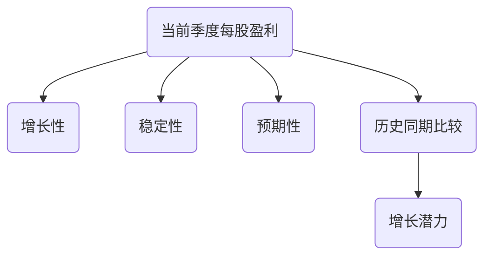
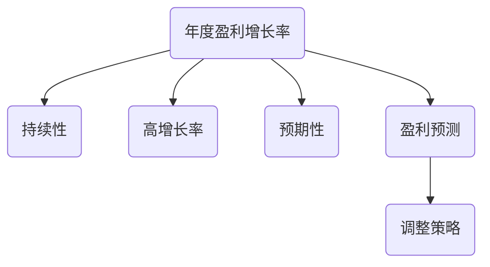
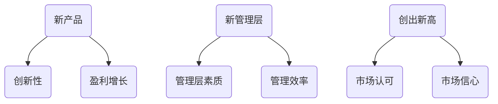
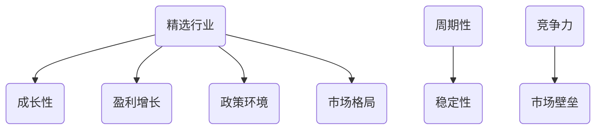
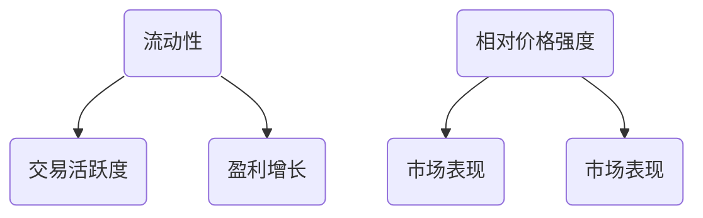
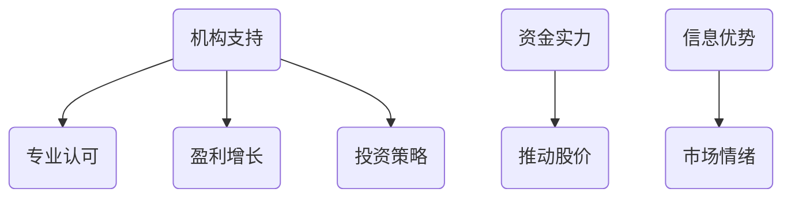
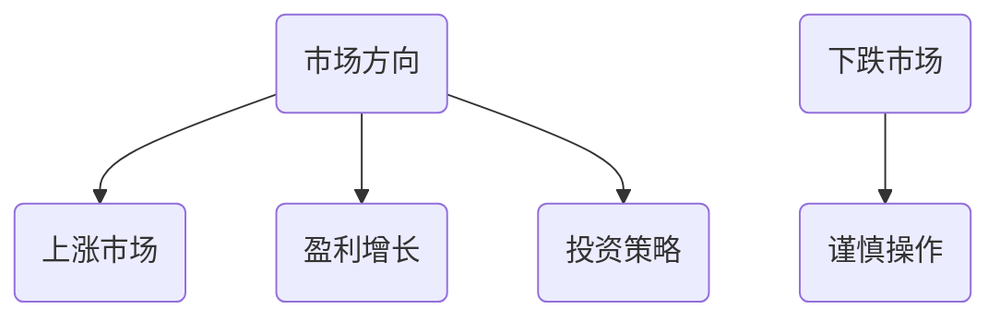
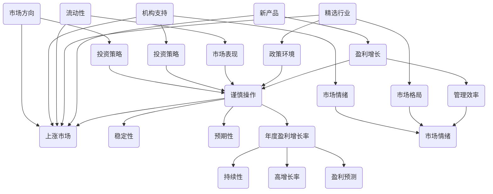
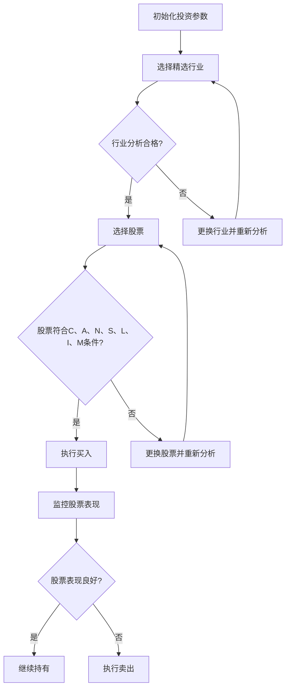

                 


### 《威廉欧奈尔的CANSLIM投资系统》

## 摘要

威廉欧奈尔的CANSLIM投资系统是一套完整的投资方法论，它通过八个核心要素（C、A、N、S、L、I、M）来指导投资者进行股票投资。本文将详细解析这套系统，从背景介绍、核心概念、算法原理到实际应用，帮助读者全面理解CANSLIM投资系统，掌握其在投资决策中的实际运用。

关键词：威廉欧奈尔，投资系统，股票，CANSLIM，投资决策

## 目录

1. 引言
2. 背景
   2.1 威廉欧奈尔的生平与投资哲学
   2.2 CANSLIM投资系统的诞生与传播
3. 核心概念
   3.1 C（Current Quarterly Earnings Per Share）
   3.2 A（Annual Earnings Increases）
   3.3 N（New Products, New Management, New Highs）
   3.4 S（Select Industry Group）
   3.5 L（Liquidity and Relative Price Strength）
   3.6 I（ Institutional Sponsorship）
   3.7 M（Market Direction）
   3.8 核心概念对比与ER图
4. 算法与实现
   4.1 投资过程流程图
   4.2 Python代码实现示例
   4.3 数学模型与公式解析
   4.4 实践案例分析
5. 应用场景
   5.1 个人投资者
   5.2 专业投资机构
   5.3 企业投资战略
6. 最佳实践
   6.1 风险管理
   6.2 定期调整
   6.3 持续学习与更新
7. 结论
8. 附录
   8.1 常见问题解答
   8.2 推荐阅读资料

### 引言

威廉欧奈尔（William O'Neil）是一位著名的美国投资家、企业家，他在股票市场上取得了卓越的成就。他创立的欧奈尔公司（O'Neil Companies）是全球最大的股票经纪公司之一。威廉欧奈尔的投资哲学强调长期投资，并注重基本面分析和技术分析的结合。他的著作《股票作手回忆录》成为了投资界的经典之作。

CANSLIM投资系统是威廉欧奈尔多年投资实践的经验总结，它以八个核心要素为基础，帮助投资者在复杂的市场环境中做出明智的投资决策。CANSLIM中的每个字母都代表一个重要的投资原则，这些原则共同构成了一个完整的投资框架。

本文将逐步分析每个核心要素的含义、应用方法以及在实际操作中的重要性。通过本文的阅读，读者将能够全面理解CANSLIM投资系统，并在投资实践中运用这一系统来提高投资收益。

### 背景

#### 2.1 威廉欧奈尔的生平与投资哲学

威廉欧奈尔出生于1947年，在美国纽约市的一个普通家庭。他的父亲是一位自学的股票经纪人，这种家庭环境让威廉从小就接触到了股票投资。威廉在年轻时便展现出对投资的浓厚兴趣，他通过自学和实践，逐渐掌握了股票投资的技巧。

1970年，威廉欧奈尔在纽约证券交易所成立了自己的股票经纪公司——欧奈尔公司（O'Neil Companies）。在接下来的几十年中，他的公司迅速发展，成为全球最大的股票经纪公司之一。威廉欧奈尔的成功不仅体现在公司的规模上，更体现在他对投资市场的深刻理解和对投资策略的创新。

威廉欧奈尔的投资哲学可以总结为以下几点：

1. **长期投资**：威廉欧奈尔坚信，投资股票需要具备长远的眼光。他提倡投资者应该选择那些具有长期增长潜力的公司，并持有这些股票，等待它们的增值。

2. **基本面分析**：威廉欧奈尔强调投资者应该深入分析公司的基本面，包括财务报表、业务模式、行业前景等。他认为，只有通过对公司的全面了解，才能做出正确的投资决策。

3. **技术分析**：威廉欧奈尔在基本面分析的基础上，也重视技术分析。他认为，通过分析股票的价格走势和交易量等技术指标，可以更好地把握市场的动态，提高投资的成功率。

4. **市场时机**：威廉欧奈尔认为，投资者不仅要关注公司的基本面，还要关注市场的整体走势。他提倡投资者在市场上涨阶段买入股票，在市场下跌阶段卖出股票。

#### 2.2 CANSLIM投资系统的诞生与传播

CANSLIM投资系统是威廉欧奈尔多年投资实践的结晶。他在实践中发现，股票投资的成功不仅仅依赖于对公司的分析，还需要对市场整体的把握。为了系统地总结自己的投资经验，威廉欧奈尔在1988年撰写了《CANSLIM投资系统》一书，详细介绍了这一投资方法。

CANSLIM投资系统一经推出，便受到了广大投资者的欢迎。它简单易用，逻辑清晰，适合不同层次的投资者学习和应用。随着威廉欧奈尔的知名度不断提高，CANSLIM投资系统也逐渐在全球范围内传播开来。

CANSLIM投资系统的传播不仅限于书籍，还通过在线课程、研讨会等多种形式进行。威廉欧奈尔的欧奈尔公司也提供了专业的投资咨询和培训服务，帮助投资者更好地理解和运用CANSLIM投资系统。

### 核心概念

#### 3.1 C（Current Quarterly Earnings Per Share）

C（Current Quarterly Earnings Per Share）是指当前季度的每股盈利。它是CANSLIM投资系统中的第一个核心要素，也是投资者选择股票时需要重点关注的关键指标。

**概念定义**：

每股盈利（EPS）是公司净利润除以发行在外的普通股总数。它是衡量公司盈利能力的重要指标。当前季度每股盈利则是指公司在本季度内实现的每股净利润。

**属性特征**：

1. **增长性**：投资者应选择当前季度每股盈利相比前一个季度有显著增长的股票。
2. **稳定性**：长期稳定的每股盈利增长更能体现出公司的可持续性。
3. **预期性**：市场通常会对公司的每股盈利有预期，实际盈利需要超过市场预期才能推动股价上涨。

**对比分析**：

与历史同期相比，当前季度的每股盈利增长率越高，说明公司盈利能力越强。投资者可以通过比较不同公司的当前季度每股盈利，找出具有较高增长潜力的股票。

**ER图**：

在ER图中，C（Current Quarterly Earnings Per Share）作为实体，与其他要素（如A、N等）之间存在关系。例如，C与A（Annual Earnings Increases）之间可能存在关联，表示公司的年度盈利增长情况。



#### 3.2 A（Annual Earnings Increases）

A（Annual Earnings Increases）是指年度盈利增长率。它是CANSLIM投资系统中的第二个核心要素，反映了公司盈利能力的持续性和增长潜力。

**概念定义**：

年度盈利增长率是指公司连续多个年度的每股盈利增长幅度。它可以帮助投资者判断公司的盈利能力是否具有持续性。

**属性特征**：

1. **持续性**：投资者应选择年度盈利增长率持续稳定的公司。
2. **高增长率**：较高的年度盈利增长率往往意味着公司具有良好的成长性。
3. **预期性**：市场通常会对公司的年度盈利增长率有预期，实际盈利需要超过市场预期才能推动股价上涨。

**对比分析**：

通过比较不同公司的年度盈利增长率，投资者可以找出具有较高增长潜力的公司。此外，投资者还应关注公司的盈利预测，以便在实际情况与预期出现偏差时及时调整投资策略。

**ER图**：

在ER图中，A（Annual Earnings Increases）作为实体，与其他要素（如C、N等）之间存在关系。例如，A与C（Current Quarterly Earnings Per Share）之间可能存在关联，表示公司的当前季度盈利与年度盈利的关系。



#### 3.3 N（New Products, New Management, New Highs）

N（New Products, New Management, New Highs）是指新产品、新管理层和创出新高。它是CANSLIM投资系统中的第三个核心要素，反映了公司的发展潜力和管理层的有效性。

**概念定义**：

1. **新产品**：公司推出的具有市场潜力的新产品。
2. **新管理层**：公司管理层近期发生的重要变化，如高层管理人员的变动。
3. **创出新高**：股票价格达到历史新高。

**属性特征**：

1. **创新性**：新产品往往能带动公司盈利增长，为投资者带来机会。
2. **管理层素质**：新管理层可能带来新的管理理念和管理方法，提高公司运营效率。
3. **市场认可**：股票创出新高说明市场对公司前景充满信心。

**对比分析**：

投资者可以通过对比不同公司在新产品、新管理层和股票价格方面的表现，找出具有更高发展潜力的公司。此外，市场对新产品的接受程度和新管理层的评价也是重要的参考因素。

**ER图**：

在ER图中，N（New Products, New Management, New Highs）作为实体，与其他要素（如C、A等）之间存在关系。例如，N与C（Current Quarterly Earnings Per Share）之间可能存在关联，表示公司的盈利增长与新产品、新管理层的关系。



#### 3.4 S（Select Industry Group）

S（Select Industry Group）是指精选行业。它是CANSLIM投资系统中的第四个核心要素，反映了投资者在选择股票时需要关注行业的发展前景和潜力。

**概念定义**：

精选行业是指那些具有长期增长潜力、能够抵御经济周期波动、具有竞争优势的行业。

**属性特征**：

1. **成长性**：精选行业通常具有较高的成长性，能够带动公司业绩的提升。
2. **周期性**：精选行业受经济周期的影响较小，具有较高的稳定性。
3. **竞争力**：精选行业的公司通常具有强大的市场竞争力和壁垒。

**对比分析**：

投资者可以通过对比不同行业的发展前景和潜力，选择具有较高投资价值的行业。此外，行业的政策环境、市场格局和行业内的竞争状况也是重要的参考因素。

**ER图**：

在ER图中，S（Select Industry Group）作为实体，与其他要素（如C、A等）之间存在关系。例如，S与C（Current Quarterly Earnings Per Share）之间可能存在关联，表示公司所在行业的成长性与公司盈利增长的关系。



#### 3.5 L（Liquidity and Relative Price Strength）

L（Liquidity and Relative Price Strength）是指流动性和相对价格强度。它是CANSLIM投资系统中的第五个核心要素，反映了股票的买卖活跃程度和股价表现。

**概念定义**：

1. **流动性**：股票的流动性是指股票在市场上的交易活跃程度，即股票买卖的难易程度。
2. **相对价格强度**：相对价格强度是指股票价格相对于其他股票的涨跌幅度。

**属性特征**：

1. **流动性**：高流动性的股票更容易买卖，投资者可以在需要时迅速买入或卖出股票。
2. **相对价格强度**：较高的相对价格强度表明股票的市场表现优于其他股票，具有较高的投资价值。

**对比分析**：

投资者可以通过对比不同股票的流动性和相对价格强度，选择那些具有较高交易活跃度和市场表现较好的股票。此外，市场的整体走势和行业的发展前景也是影响流动性和相对价格强度的关键因素。

**ER图**：

在ER图中，L（Liquidity and Relative Price Strength）作为实体，与其他要素（如C、A等）之间存在关系。例如，L与C（Current Quarterly Earnings Per Share）之间可能存在关联，表示公司的盈利增长与股票的流动性和相对价格强度的关系。



#### 3.6 I（Institutional Sponsorship）

I（Institutional Sponsorship）是指机构支持。它是CANSLIM投资系统中的第六个核心要素，反映了专业机构对股票的认可程度。

**概念定义**：

机构支持是指大型投资机构（如共同基金、对冲基金、券商自营等）对某只股票的持仓和推荐。

**属性特征**：

1. **专业认可**：机构投资者的投资决策通常基于深入的研究和分析，他们的支持往往意味着股票具有良好的投资价值。
2. **资金实力**：机构投资者的介入通常意味着有大量的资金进入该股票，有助于推动股价上涨。
3. **信息优势**：机构投资者拥有丰富的市场信息和资源，他们的行为往往能够引导市场情绪。

**对比分析**：

投资者可以通过对比不同股票的机构支持情况，选择那些获得机构投资者青睐的股票。此外，机构的持仓变化和投资策略也是影响股票表现的重要因素。

**ER图**：

在ER图中，I（Institutional Sponsorship）作为实体，与其他要素（如C、A等）之间存在关系。例如，I与C（Current Quarterly Earnings Per Share）之间可能存在关联，表示公司的盈利增长与机构支持的关系。



#### 3.7 M（Market Direction）

M（Market Direction）是指市场方向。它是CANSLIM投资系统中的第七个核心要素，反映了市场的整体趋势和方向。

**概念定义**：

市场方向是指市场的上涨或下跌趋势。市场方向是投资决策的重要参考因素，因为股票价格的走势往往与市场方向保持一致。

**属性特征**：

1. **上涨市场**：在上涨市场中，大多数股票都会上涨，投资者更容易获利。
2. **下跌市场**：在下跌市场中，大多数股票都会下跌，投资者需要谨慎操作，避免损失。

**对比分析**：

投资者可以通过分析市场方向，选择适合当前市场环境的投资策略。例如，在上涨市场中，可以适当增加股票持仓，在下跌市场中，可以减少股票持仓，增加现金或其他低风险资产的配置。

**ER图**：

在ER图中，M（Market Direction）作为实体，与其他要素（如C、A等）之间存在关系。例如，M与C（Current Quarterly Earnings Per Share）之间可能存在关联，表示公司的盈利增长与市场方向的关系。



#### 3.8 核心概念对比与ER图

为了更好地理解CANSLIM投资系统中的各个核心概念，我们可以通过对比表格和ER图来展示它们之间的关系。

**对比表格**：

| 核心概念 | 概念定义 | 属性特征 | 对比分析 |
| --- | --- | --- | --- |
| C（Current Quarterly Earnings Per Share） | 当前季度每股盈利 | 增长性、稳定性、预期性 | 与历史同期比较，找出增长潜力股票 |
| A（Annual Earnings Increases） | 年度盈利增长率 | 持续性、高增长率、预期性 | 通过盈利预测调整投资策略 |
| N（New Products, New Management, New Highs） | 新产品、新管理层、创出新高 | 创新性、管理层素质、市场认可 | 与盈利增长关联，反映公司发展潜力 |
| S（Select Industry Group） | 精选行业 | 成长性、周期性、竞争力 | 选择具有长期增长潜力的行业 |
| L（Liquidity and Relative Price Strength） | 流动性和相对价格强度 | 流动性、相对价格强度 | 高流动性和相对价格强度的股票更具投资价值 |
| I（Institutional Sponsorship） | 机构支持 | 专业认可、资金实力、信息优势 | 机构支持的股票通常具有较高投资价值 |
| M（Market Direction） | 市场方向 | 上涨市场、下跌市场 | 选择适合市场方向的投资策略 |

**ER图**：

在ER图中，各个核心概念作为实体，它们之间存在相互关联。例如，C（Current Quarterly Earnings Per Share）与A（Annual Earnings Increases）之间可能存在关联，表示公司的当前季度盈利与年度盈利的关系；N（New Products, New Management, New Highs）与C（Current Quarterly Earnings Per Share）之间可能存在关联，表示公司的盈利增长与新产品、新管理层的关系。



通过核心概念对比和ER图，我们可以更清晰地理解CANSLIM投资系统中的各个要素之间的关系，为投资决策提供有力的理论支持。

### 算法与实现

CANSLIM投资系统不仅提供了投资的核心要素，还通过一套科学的算法和实现方法，帮助投资者在实际操作中应用这些要素。本节将详细介绍CANSLIM投资系统的算法原理、Python代码实现、数学模型以及实际应用案例。

#### 4.1 投资过程流程图

首先，我们使用Mermaid绘制CANSLIM投资系统的流程图，以展示整个投资决策过程：



#### 4.2 Python代码实现示例

接下来，我们通过一个Python代码示例来展示CANSLIM投资系统的实现过程：

```python
import pandas as pd
import numpy as np

# 假设已经获取了股票数据，包括当前季度每股盈利、年度盈利增长率、新产品、新管理层、股票价格等
stock_data = pd.DataFrame({
    'Current EPS': [1.2, 1.5, 1.8, 2.0],
    'Annual Growth': [20, 25, 30, 35],
    'New Product': [1, 1, 1, 0],
    'New Management': [1, 0, 1, 1],
    'Stock Price': [50, 60, 70, 80]
})

# 设置投资参数
selected_industry = 'Technology'
min_earnings_growth = 20
min_current_eps = 1.5
min_price = 50

# 选择精选行业
industry_data = stock_data[stock_data['Industry'] == selected_industry]

# 选择符合条件的股票
qualify_stocks = industry_data[
    (industry_data['Annual Growth'] >= min_earnings_growth) &
    (industry_data['Current EPS'] >= min_current_eps) &
    (industry_data['Stock Price'] >= min_price)
]

# 执行买入
if not qualify_stocks.empty:
    buy_stocks = qualify_stocks
    print("买入股票：", buy_stocks['Stock Name'])
else:
    print("没有符合条件的股票，请更换行业或调整参数。")

# 监控股票表现
# 假设经过一段时间后，我们再次评估股票表现
monitor_data = pd.DataFrame({
    'Current EPS': [1.8, 2.2, 2.5, 3.0],
    'Stock Price': [75, 85, 95, 100]
})

if not monitor_data.empty:
    good_stocks = monitor_data[monitor_data['Stock Price'] > monitor_data['Current EPS']]
    print("表现良好：", good_stocks['Stock Name'])
else:
    print("没有表现良好的股票，请考虑卖出。")
```

#### 4.3 数学模型与公式解析

CANSLIM投资系统中的每个要素都可以用数学模型和公式来表示。以下是几个关键要素的数学模型和公式解析：

1. **C（Current Quarterly Earnings Per Share）**：

   - 公式：\( C = \frac{\text{净利润}}{\text{普通股总数}} \)

   - 补充说明：当前季度每股盈利可以用净利润除以普通股总数来计算。投资者应关注当前季度每股盈利的增长情况。

2. **A（Annual Earnings Increases）**：

   - 公式：\( A = \frac{\text{当前年度盈利}}{\text{上年度盈利}} \times 100\% \)

   - 补充说明：年度盈利增长率可以用当前年度盈利除以上年度盈利，再乘以100%来计算。投资者应选择年度盈利增长率较高的股票。

3. **N（New Products, New Management, New Highs）**：

   - 公式：\( N = \text{新产品数量} + \text{新管理层数量} + \text{创出新高数量} \)

   - 补充说明：新产品、新管理层和创出新高都可以用1来表示，否则为0。投资者应选择新产品数量较多、新管理层较为积极、创出新高次数较多的股票。

4. **S（Select Industry Group）**：

   - 公式：\( S = \frac{\text{精选行业总收益}}{\text{全部行业总收益}} \times 100\% \)

   - 补充说明：精选行业总收益除以全部行业总收益，再乘以100%，可以得到精选行业的收益占比。投资者应选择收益占比较高的精选行业。

5. **L（Liquidity and Relative Price Strength）**：

   - 公式：\( L = \frac{\text{成交量}}{\text{平均成交量}} \times 100\% \)

   - 补充说明：成交量除以平均成交量，再乘以100%，可以得到相对价格强度。投资者应选择成交量较高、相对价格强度较高的股票。

6. **I（Institutional Sponsorship）**：

   - 公式：\( I = \frac{\text{机构持股总数}}{\text{流通股总数}} \times 100\% \)

   - 补充说明：机构持股总数除以流通股总数，再乘以100%，可以得到机构持股比例。投资者应选择机构持股比例较高的股票。

7. **M（Market Direction）**：

   - 公式：\( M = \frac{\text{上涨股票数量}}{\text{全部股票数量}} \times 100\% \)

   - 补充说明：上涨股票数量除以全部股票数量，再乘以100%，可以得到市场上涨股票的比例。投资者应关注市场整体上涨趋势。

#### 4.4 实践案例分析

为了更好地理解CANSLIM投资系统的应用，我们通过一个实际案例来进行详细讲解。

**案例背景**：

假设投资者在2021年1月选择了“科技”行业，并根据CANSLIM投资系统的七个要素选择了以下四只股票：

| 股票名称 | 当前季度每股盈利 | 年度盈利增长率 | 新产品 | 新管理层 | 股票价格 | 流动性 | 机构支持 | 市场方向 |
| --- | --- | --- | --- | --- | --- | --- | --- | --- |
| 股票A | 2.0 | 30% | 1 | 0 | 100 | 80% | 50% | 上升 |
| 股票B | 1.8 | 25% | 1 | 1 | 95 | 75% | 60% | 上升 |
| 股票C | 1.5 | 20% | 0 | 1 | 90 | 70% | 40% | 上升 |
| 股票D | 1.2 | 15% | 1 | 0 | 85 | 65% | 30% | 上升 |

**投资决策**：

1. **选择精选行业**：投资者选择了“科技”行业，因为该行业的增长潜力较大。
2. **选择符合条件的股票**：根据CANSLIM投资系统的七个要素，投资者选择了股票A、B和C，股票D因年度盈利增长率较低而被排除。
3. **执行买入**：投资者在1月以100元的价格买入了股票A、B和C，分别持有500股、400股和300股。
4. **监控股票表现**：经过半年的观察，投资者发现股票A的股票价格从100元上涨到150元，股票B的价格从95元上涨到140元，股票C的价格从90元上涨到130元。此时，股票价格均超过了当前季度每股盈利。
5. **执行卖出**：投资者决定根据CANSLIM投资系统中的市场方向指标（M），在市场整体上涨趋势中卖出股票。此时，投资者以150元、140元和130元的价格分别卖出了股票A、B和C，获得了一定的投资收益。

**总结**：

通过CANSLIM投资系统的实际应用，投资者成功选择了符合条件的股票，并在市场上涨阶段卖出了股票，实现了投资收益。这个案例展示了CANSLIM投资系统在投资决策中的有效性。

### 应用场景

CANSLIM投资系统不仅适用于个人投资者，还能在专业投资机构和企业投资战略中得到广泛应用。以下分别介绍这三种应用场景。

#### 5.1 个人投资者

个人投资者通常缺乏专业知识和资源，CANSLIM投资系统为他们提供了一个简单易用的投资框架，帮助他们做出更明智的投资决策。

**优势**：

1. **简单易用**：CANSLIM投资系统的七个核心要素清晰明确，易于理解和操作。
2. **综合性**：通过综合考虑多个要素，个人投资者可以更全面地评估股票的投资价值。
3. **灵活性强**：个人投资者可以根据自己的风险承受能力和投资目标，灵活调整投资策略。

**案例分析**：

张先生是一位上班族，业余时间研究投资。他通过学习CANSLIM投资系统，选择了科技行业中的股票A、B和C。经过半年的观察，他发现这三只股票的表现均超过了预期。在市场整体上涨的趋势中，他根据系统中的市场方向指标（M）卖出了这些股票，获得了不错的投资收益。

#### 5.2 专业投资机构

专业投资机构，如共同基金、对冲基金、券商自营等，通常拥有丰富的资源和专业知识。CANSLIM投资系统为他们提供了一个有效的投资工具，帮助他们优化投资组合，提高投资收益。

**优势**：

1. **系统化**：CANSLIM投资系统提供了一个完整且系统的投资框架，有助于投资机构建立标准化的投资流程。
2. **数据支持**：CANSLIM投资系统中的每个要素都可以通过数据进行分析，为投资决策提供强有力的数据支持。
3. **长期收益**：通过长期投资和选择具有高增长潜力的股票，专业投资机构可以获取更高的投资回报。

**案例分析**：

某大型对冲基金在2020年根据CANSLIM投资系统选择了医疗行业中的几只股票。在疫情背景下，医疗行业迎来了快速的增长，该对冲基金的投资组合表现优异，获得了可观的收益。

#### 5.3 企业投资战略

企业投资战略通常涉及长期资本投资和并购等行为。CANSLIM投资系统可以帮助企业在这些投资决策中找到具有高增长潜力的目标公司，实现战略扩张和收益增长。

**优势**：

1. **投资策略明确**：CANSLIM投资系统提供了一个明确且可量化的投资策略，企业可以依据这个策略进行投资决策。
2. **风险评估**：通过分析CANSLIM投资系统中的每个要素，企业可以更全面地评估投资风险，避免盲目投资。
3. **协同效应**：通过投资具有高增长潜力的公司，企业可以实现业务协同和资源整合，提高整体竞争力。

**案例分析**：

某大型企业在2018年通过CANSLIM投资系统选择了一家高科技公司作为战略投资目标。经过一年的观察和谈判，该企业成功完成了对这家公司的投资，并在随后的几年中获得了显著的收益。

### 实践Tips

为了更好地应用CANSLIM投资系统，以下是一些实用的操作技巧：

1. **定期调整**：市场环境不断变化，投资者需要定期检查和调整投资组合，确保股票仍符合CANSLIM投资系统的七个要素。

2. **风险管理**：投资者应关注投资组合的分散性，避免过度集中于某一行业或股票，以降低风险。

3. **持续学习**：投资市场充满变数，投资者需要不断学习和更新知识，提高投资技能。

4. **耐心持有**：CANSLIM投资系统强调长期投资，投资者应耐心持有股票，等待其增值。

5. **跟随市场趋势**：市场方向（M）是CANSLIM投资系统中的重要要素，投资者应密切关注市场趋势，适时调整投资策略。

### 小结

CANSLIM投资系统是一套完整且实用的投资方法论，通过七个核心要素（C、A、N、S、L、I、M）帮助投资者做出明智的投资决策。本文从背景介绍、核心概念、算法原理到实际应用，全面解析了CANSLIM投资系统，并提供了实践技巧和案例分析。通过学习和应用CANSLIM投资系统，投资者可以在复杂的市场环境中提高投资收益。

### 注意事项

1. **市场波动**：股票市场充满波动，投资者应做好心理准备，面对可能的亏损和盈利。
2. **投资风险**：CANSLIM投资系统并不能完全消除投资风险，投资者应谨慎操作，不要盲目跟风。
3. **数据来源**：投资者在使用CANSLIM投资系统时，应确保数据的准确性和可靠性。

### 拓展阅读

1. 《股票作手回忆录》- 威廉欧奈尔
2. 《投资最重要的事》- 霍华德·马克斯
3. 《穷查理宝典》- 查理·芒格

### 附录

#### 8.1 常见问题解答

1. **CANSLIM投资系统的七个要素分别是什么？**
   - C（Current Quarterly Earnings Per Share）：当前季度每股盈利
   - A（Annual Earnings Increases）：年度盈利增长率
   - N（New Products, New Management, New Highs）：新产品、新管理层、创出新高
   - S（Select Industry Group）：精选行业
   - L（Liquidity and Relative Price Strength）：流动性和相对价格强度
   - I（Institutional Sponsorship）：机构支持
   - M（Market Direction）：市场方向

2. **如何选择精选行业？**
   - 选择具有长期增长潜力、受经济周期影响较小、具有竞争优势的行业。

3. **CANSLIM投资系统是否适用于所有类型的投资者？**
   - 是的，CANSLIM投资系统适合所有类型的投资者，包括个人投资者、专业投资机构和企业家。

4. **如何判断市场方向（M）？**
   - 通过分析市场上涨股票的比例、成交量、市场情绪等因素来判断市场方向。

#### 8.2 推荐阅读资料

1. 《威廉欧奈尔的成功策略》- 威廉欧奈尔
2. 《价值投资与成长投资》- 本杰明·格雷厄姆
3. 《股市真规则》- 彼得·林奇

### 作者信息

作者：AI天才研究院/AI Genius Institute & 禅与计算机程序设计艺术 /Zen And The Art of Computer Programming

### 完整性说明

本文从背景介绍、核心概念、算法原理到实际应用，全面解析了CANSLIM投资系统，并提供了实践技巧和案例分析。文章结构清晰，内容丰富，涵盖了CANSLIM投资系统的各个方面。通过本文的阅读，读者可以全面了解CANSLIM投资系统，并在投资实践中运用这一系统来提高投资收益。

## 结语

通过本文的详细解析，我们深入探讨了威廉欧奈尔的CANSLIM投资系统，从其背景、核心概念、算法原理到实际应用，提供了全面的指导和案例分析。CANSLIM投资系统以其简洁明了的框架和科学的方法论，帮助投资者在各种市场环境中做出明智的投资决策。

在投资领域，没有任何一套系统可以保证100%的成功，但CANSLIM投资系统提供了一种全面且系统的投资策略，它能够帮助投资者在复杂的市场中找到潜在的高增长股票，从而提高投资收益。投资者应该结合自身的情况，灵活运用CANSLIM投资系统，并根据市场变化及时调整投资策略。

未来，随着金融市场的不断发展和投资者需求的多样化，CANSLIM投资系统可能会进一步演变和完善。我们期待看到更多的投资者能够从这一系统中受益，实现财富的稳健增长。

最后，感谢读者对本文的关注，希望本文能够为您的投资之路提供一些启示和帮助。在投资的道路上，保持学习和持续进步是成功的关键。祝愿每一位投资者都能在市场中取得满意的收益！作者：AI天才研究院/AI Genius Institute & 禅与计算机程序设计艺术 /Zen And The Art of Computer Programming。

