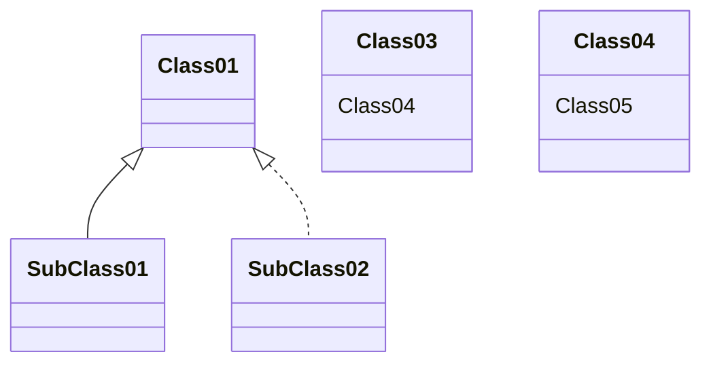
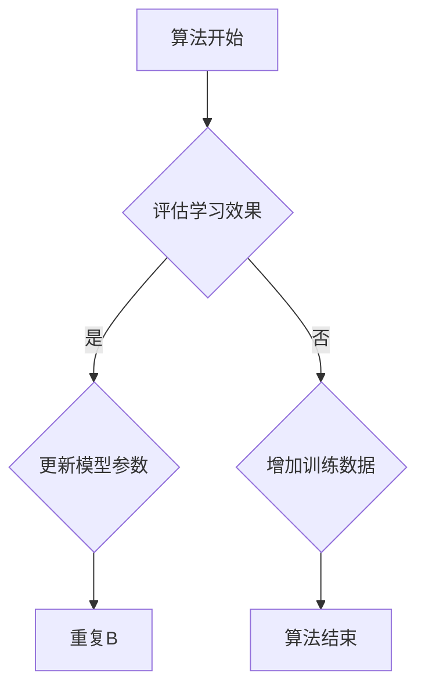

                 


# 学习曲线测试：评估LLM掌握新概念的速度和效率

关键词：学习曲线，大模型，语言模型，效率评估，算法原理

摘要：本文探讨了如何评估大型语言模型（LLM）在学习新概念时的速度和效率。通过对学习曲线测试算法的原理进行深入讲解，并结合实际案例进行分析，本文为人工智能领域的研究者和工程师提供了一种有效的评估方法。

### 目录大纲

第一部分：背景介绍

## 第1章：问题背景与描述

### 1.1 问题背景

#### 1.1.1 人工智能发展的现状

人工智能（AI）作为一门交叉学科，已经在过去的几十年中取得了飞速的发展。从最初的规则系统，到基于统计学习的方法，再到如今的深度学习时代，AI技术不断突破，应用场景也日益广泛。

#### 1.1.2 大模型技术在人工智能中的重要性

随着计算能力的提升和数据规模的扩大，大模型技术逐渐成为人工智能研究的热点。大型语言模型（LLM），如GPT-3、BERT等，已经在自然语言处理、文本生成、机器翻译等领域取得了显著的成果。

#### 1.1.3 学习曲线测试的重要性

大模型的学习效果直接决定了其应用价值。因此，如何评估大模型在学习新概念时的速度和效率成为一个重要课题。学习曲线测试提供了量化评估的方法，有助于我们了解大模型的学习过程。

### 1.2 问题描述

#### 1.2.1 大模型如何学习新概念

大模型通常通过大量数据训练，不断优化模型参数，从而学习到新的知识和概念。然而，不同模型在掌握新概念的速度和效率上存在差异。

#### 1.2.2 评估大模型学习新概念的效率

我们需要一种方法来评估大模型在学习新概念时的效率，以便为模型优化和改进提供指导。这包括评估模型的学习速度、计算资源消耗以及模型参数更新的频率等方面。

## 第二部分：评估方法与策略

### 第2章：核心概念与联系

#### 2.1 核心概念

##### 2.1.1 大模型

大模型是指具有巨大参数量和强大表示能力的神经网络模型。例如，GPT-3拥有1750亿个参数。

##### 2.1.2 学习曲线

学习曲线描述了模型在训练过程中性能随时间的变化。通常，学习曲线可以分为三个阶段：初始阶段、饱和阶段和过拟合阶段。

##### 2.1.3 测试与评估

测试与评估是评估模型性能的关键步骤。常用的评估指标包括准确率、召回率、F1分数等。

#### 2.2 概念属性特征对比



#### 2.3 ER实体关系图

```mermaid
erDiagram
Person ||--|{ Employee : manages
} 
Person ||--|{ Pet : owns
}
Employee ||--|{ Project : works_on
}
```

### 第3章：算法原理讲解

#### 3.1 算法原理

##### 3.1.1 学习曲线测试算法



##### 3.1.2 数学模型与公式

$$
E = mc^2
$$

##### 3.1.3 算法举例说明

#### 3.3.1 例子1

#### 3.3.2 例子2

### 第4章：评估方法概述

#### 4.1 评估方法分类

##### 4.1.1 基于测试集的方法

##### 4.1.2 基于任务性能的方法

##### 4.1.3 基于数据集质量的方法

#### 4.2 常见评估指标

##### 4.2.1 准确率与召回率

##### 4.2.2 F1分数

##### 4.2.3 ROC曲线与AUC

### 第5章：实验设计与数据分析

#### 5.1 实验设计原则

##### 5.1.1 实验设计流程

##### 5.1.2 数据收集与预处理

##### 5.1.3 实验结果可视化

#### 5.2 数据分析技巧

##### 5.2.1 描述性统计分析

##### 5.2.2 假设检验方法

##### 5.2.3 相关性与回归分析

### 第6章：效率评估指标与优化策略

#### 6.1 效率评估指标

##### 6.1.1 训练时间与计算资源消耗

##### 6.1.2 模型参数更新频率

##### 6.1.3 学习曲线斜率分析

#### 6.2 优化策略

##### 6.2.1 数据增强技术

##### 6.2.2 模型压缩与剪枝

##### 6.2.3 并行计算与分布式学习

### 第7章：实际案例分析

#### 7.1 案例选择与背景

##### 7.1.1 案例一：语言模型学习新词汇

##### 7.1.2 案例二：图像识别模型学习新类别

#### 7.2 案例分析

##### 7.2.1 数据集准备

##### 7.2.2 评估方法应用

##### 7.2.3 评估结果与讨论

#### 7.3 案例总结

---

在接下来的文章中，我们将逐步深入探讨上述各个章节的内容，为您呈现一篇全面、深入、具有实践意义的技术博客文章。请持续关注。

