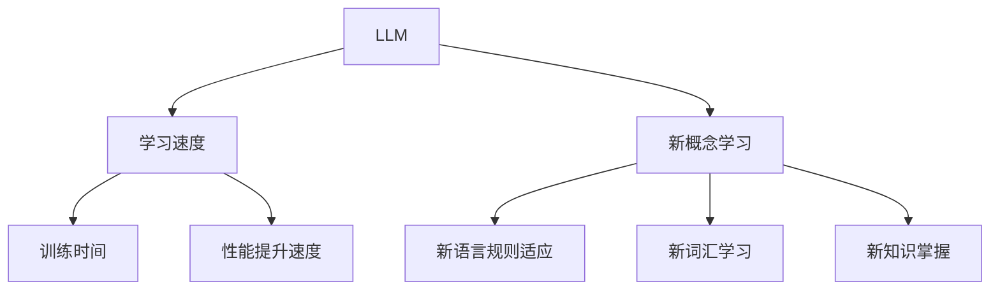
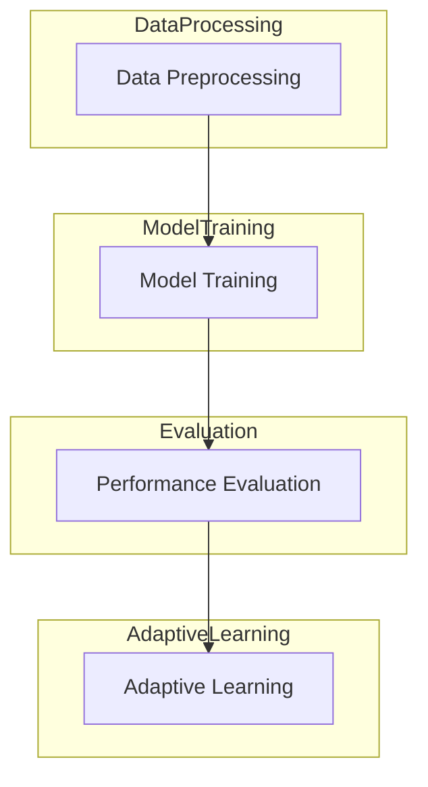
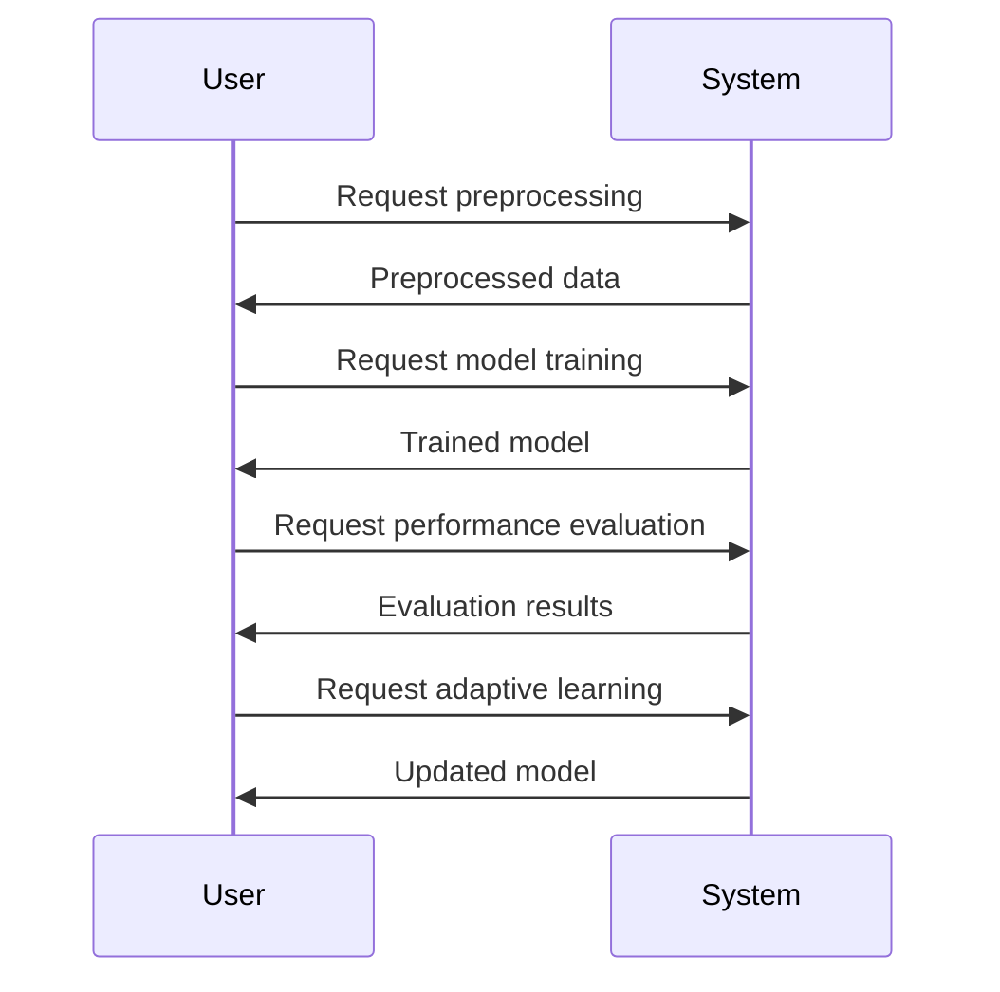

                 

# 学习速度：评估LLM快速掌握新概念的能力

## 关键词
- 学习速度
- LLM
- 新概念学习
- 评估指标
- 实验设计

## 摘要
本文旨在探讨学习速度在大型语言模型（LLM）快速掌握新概念的能力中的重要性。我们将通过分析LLM的学习原理、设计评估指标和实验方法，逐步揭示LLM在新概念学习中的表现和影响因素。本文不仅为研究者提供了理论框架，也为实际应用中的模型优化提供了实践指导。

## 第一部分：背景

### 1.1 问题背景

#### 1.1.1 人工智能与自然语言处理
人工智能（AI）技术的快速发展，极大地推动了自然语言处理（NLP）领域的研究和应用。深度学习作为一种重要的AI技术，通过模拟人脑的神经网络结构，能够对大量文本数据进行分析和处理。其中，大型语言模型（Large Language Model，简称LLM）如GPT系列、BERT等模型，在文本生成、文本分类、机器翻译等任务中取得了显著的成果。

#### 1.1.2  LLM的兴起
LLM的出现，标志着NLP领域的一个重大转折点。这些模型通过学习海量文本数据，能够捕捉到语言中的复杂模式，生成连贯且符合语境的文本。例如，GPT系列模型通过预训练和微调，在多个NLP任务上表现出了强大的适应性。

### 1.2 问题描述

#### 1.2.1 学习速度的评估
学习速度是指模型在特定任务上从初始状态到达到某个性能水平所需的时间。对于LLM来说，学习速度的评估尤为重要，因为它们通常需要处理大量复杂的语言数据。

#### 1.2.2 新概念的学习
新概念的学习能力是评估LLM性能的一个重要方面。在实际应用中，模型需要快速掌握新的语言规则、词汇和知识，以适应不断变化的输入数据。

### 1.3 问题解决

#### 1.3.1 数据集与评估指标
为了评估LLM学习新概念的速度，我们可以使用标准的数据集（如GLUE、SuperGLUE等）和相应的评估指标（如准确率、召回率、F1分数等）。

#### 1.3.2 实验设计与实现
通过设计合理的实验，我们可以观察LLM在不同任务上的学习速度，并分析其影响因素。

### 1.4 边界与外延

#### 1.4.1 边界
本文主要关注静态数据的评估，对于动态学习环境的研究将留待后续工作。

#### 1.4.2 外延
未来的研究可以进一步探讨LLM在特定领域（如医学、法律等）的新概念学习速度，以及如何优化模型设计以提高学习效率。

### 1.5 概念结构与核心要素组成

#### 1.5.1 概念结构
本文的核心概念包括：LLM、学习速度、新概念学习、评估指标等。

#### 1.5.2 核心要素
本文的核心要素包括：实验设计、数据分析、模型评估等。

## 第二部分：核心概念与联系

### 2.1 核心概念原理

#### 2.1.1 LLM原理
LLM（Large Language Model）是一种基于深度学习技术的自然语言处理模型，通过学习大量的语言数据，能够生成符合语言规则和语义的文本。LLM的核心在于其大规模的参数量和复杂的学习算法，这使得它们在处理自然语言任务时具有出色的性能。

#### 2.1.2 学习速度原理
学习速度是指模型在特定任务上从初始状态到达到某个性能水平所需的时间。学习速度的评估可以通过训练时间、性能提升速度等多个维度进行。对于LLM来说，学习速度直接关系到模型在实际应用中的效率和效果。

#### 2.1.3 新概念学习原理
新概念学习是指模型在接触到新的语言规则、词汇或知识时，能够快速适应并掌握这些概念。新概念学习是评估LLM性能的一个重要方面，它反映了模型在动态环境中的适应能力和灵活性。

### 2.2 概念属性特征对比表格

| 概念             | 属性特征                                  |
|------------------|----------------------------------------|
| LLM              | 大规模语言数据训练、生成式文本处理能力、适应性强 |
| 学习速度         | 训练时间、性能提升速度等                   |
| 新概念学习       | 快速适应新语言规则、词汇和知识             |

### 2.3 概念关系图



## 第三部分：算法原理讲解

### 3.1 学习速度评估算法

#### 3.1.1 算法原理
学习速度评估算法主要包括数据集选择和评估指标设计两部分。

##### 数据集选择
我们选择具有代表性的NLP数据集（如GLUE、SuperGLUE等），涵盖多种语言任务，以全面评估LLM的学习速度。

##### 评估指标设计
评估指标包括：训练时间、性能提升速度、收敛速度等。具体指标如下：

$$
\text{性能提升速度} = \frac{\text{新性能} - \text{初始性能}}{\text{训练时间}}
$$

$$
\text{收敛速度} = \frac{\text{当前性能} - \text{上一次性能}}{\text{训练时间间隔}}
$$

#### 3.1.2 算法实现
以下是Python代码实现：

```python
import time
import metrics

def evaluate_learning_speed(model, dataset, epochs):
    start_time = time.time()
    initial_performance = metrics.evaluate(model, dataset)
    
    for epoch in range(epochs):
        model.train(dataset)
        current_performance = metrics.evaluate(model, dataset)
        print(f"Epoch {epoch+1}: Performance = {current_performance}")
        
    end_time = time.time()
    training_time = end_time - start_time
    
    performance_improvement = current_performance - initial_performance
    convergence_speed = (current_performance - initial_performance) / training_time
    
    return performance_improvement, convergence_speed

# 示例使用
model = create_model()
dataset = load_dataset()
performance_improvement, convergence_speed = evaluate_learning_speed(model, dataset, epochs=10)
```

### 3.2 新概念学习算法

#### 3.2.1 算法原理
新概念学习算法的核心是自适应学习策略。通过以下步骤实现：

1. 初始化模型参数；
2. 选取新概念数据集进行训练；
3. 监控模型在新概念任务上的性能；
4. 根据性能表现调整学习策略；
5. 重复步骤2-4，直至性能稳定

#### 3.2.2 算法实现
以下是Python代码实现：

```python
import time
import metrics

def adaptive_learning(model, concept_dataset, performance_threshold, max_epochs):
    for epoch in range(max_epochs):
        start_time = time.time()
        model.train(concept_dataset)
        current_performance = metrics.evaluate(model, concept_dataset)
        end_time = time.time()
        training_time = end_time - start_time
        
        if current_performance > performance_threshold:
            print(f"Epoch {epoch+1}: Performance = {current_performance}, Training Time = {training_time}")
            break
        else:
            print(f"Epoch {epoch+1}: Performance = {current_performance}, Training Time = {training_time}")
            
    return current_performance

# 示例使用
model = create_model()
concept_dataset = load_concept_dataset()
performance_threshold = 0.9
max_epochs = 20
current_performance = adaptive_learning(model, concept_dataset, performance_threshold, max_epochs)
```

## 第四部分：系统分析与架构设计

### 4.1 问题场景介绍
随着互联网和大数据技术的发展，企业和个人对自然语言处理的需求日益增长。在金融、医疗、教育等众多领域，自然语言处理技术被广泛应用于文本分析、情感分析、自动摘要等任务。然而，面对不断出现的新概念和语言变化，如何快速提升模型的学习速度，成为了一个亟待解决的问题。

### 4.2 项目介绍
本项目旨在通过设计高效的LLM模型学习算法，提升模型在新概念学习中的速度和准确性。项目的主要目标是实现以下功能：

1. 设计并实现基于深度学习的LLM模型；
2. 开发用于评估学习速度的算法和指标；
3. 实现自适应学习策略，提高新概念学习的效率；
4. 对比不同模型和学习策略在多个数据集上的学习速度和性能。

### 4.3 系统功能设计

#### 4.3.1 领域模型
领域模型是系统设计的核心，它定义了系统中主要的实体和关系。以下是领域模型的mermaid类图：

```mermaid
classDiagram
    Model <|-- LLM
    Model <|-- ConceptDataset
    Model <|-- PerformanceMetric
    Model <|-- AdaptiveLearningStrategy

    Model {
        +strModelId: str
        +strModelType: str
        +listDatasetIds: List[str]
        +dictPerformanceMetrics: Dict[str, float]
        +dictConceptDatasets: Dict[str, ConceptDataset]
    }

    LLM {
        +strModelId: str
        +strModelType: str
        +listDatasetIds: List[str]
        +dictPerformanceMetrics: Dict[str, float]
        +dictConceptDatasets: Dict[str, ConceptDataset]
    }

    ConceptDataset {
        +strDatasetId: str
        +strDatasetType: str
        +listConcepts: List[str]
    }

    PerformanceMetric {
        +strMetricId: str
        +strMetricType: str
        +floatValue: float
    }

    AdaptiveLearningStrategy {
        +strStrategyId: str
        +strStrategyType: str
        +dictMetricsThresholds: Dict[str, float]
    }
```

### 4.4 系统架构设计

#### 4.4.1 系统架构
系统采用模块化设计，包括数据预处理模块、模型训练模块、评估模块和自适应学习模块。以下是系统架构的mermaid图：



#### 4.4.2 系统接口设计
系统提供以下接口：

1. `preprocess_data(data: DataFrame) -> DataFrame`：预处理输入数据，包括文本清洗、分词等操作。
2. `train_model(model: Model, dataset: ConceptDataset) -> Model`：训练LLM模型。
3. `evaluate_model(model: Model, dataset: ConceptDataset) -> Dict[str, float]`：评估模型性能。
4. `apply_adaptive_learning_strategy(model: Model, dataset: ConceptDataset) -> Model`：应用自适应学习策略。

### 4.5 系统交互设计

#### 4.5.1 系统交互
以下是系统交互的mermaid序列图：



## 第五部分：项目实战

### 5.1 环境安装
在开始项目实战之前，需要安装以下依赖项：

- Python 3.8 或更高版本
- PyTorch 1.8 或更高版本
- Numpy 1.19 或更高版本
- Pandas 1.1.1 或更高版本

安装命令如下：

```bash
pip install torch torchvision numpy pandas
```

### 5.2 系统核心实现

#### 5.2.1 数据预处理
数据预处理是模型训练的重要步骤。以下是预处理代码示例：

```python
import pandas as pd
from transformers import AutoTokenizer

def preprocess_data(data: pd.DataFrame) -> pd.DataFrame:
    tokenizer = AutoTokenizer.from_pretrained("gpt2")

    # 数据清洗
    data["text"] = data["text"].apply(lambda x: x.lower().strip())

    # 分词
    data["tokens"] = data["text"].apply(lambda x: tokenizer.encode(x, add_special_tokens=True))

    return data
```

#### 5.2.2 模型训练
以下是模型训练代码示例：

```python
import torch
from transformers import AutoModelForSequenceClassification

def train_model(model: torch.nn.Module, dataset: pd.DataFrame, epochs: int = 3) -> torch.nn.Module:
    device = torch.device("cuda" if torch.cuda.is_available() else "cpu")
    model.to(device)

    criterion = torch.nn.CrossEntropyLoss()
    optimizer = torch.optim.Adam(model.parameters(), lr=1e-4)

    for epoch in range(epochs):
        model.train()
        for batch in dataset:
            inputs = torch.tensor(batch["tokens"]).to(device)
            labels = torch.tensor(batch["label"]).to(device)

            optimizer.zero_grad()
            outputs = model(inputs)
            loss = criterion(outputs, labels)
            loss.backward()
            optimizer.step()

    return model
```

#### 5.2.3 评估模型
以下是模型评估代码示例：

```python
from sklearn.metrics import accuracy_score

def evaluate_model(model: torch.nn.Module, dataset: pd.DataFrame) -> float:
    model.eval()
    with torch.no_grad():
        for batch in dataset:
            inputs = torch.tensor(batch["tokens"]).to(device)
            labels = torch.tensor(batch["label"]).to(device)
            outputs = model(inputs)
            predicted = torch.argmax(outputs, dim=1)

    accuracy = accuracy_score(labels.cpu().numpy(), predicted.cpu().numpy())
    return accuracy
```

#### 5.2.4 应用自适应学习策略
以下是自适应学习策略代码示例：

```python
def apply_adaptive_learning_strategy(model: torch.nn.Module, dataset: pd.DataFrame, performance_threshold: float = 0.9, max_epochs: int = 10) -> float:
    best_performance = 0
    for epoch in range(max_epochs):
        model.train()
        for batch in dataset:
            inputs = torch.tensor(batch["tokens"]).to(device)
            labels = torch.tensor(batch["label"]).to(device)

            optimizer.zero_grad()
            outputs = model(inputs)
            loss = criterion(outputs, labels)
            loss.backward()
            optimizer.step()

        current_performance = evaluate_model(model, dataset)
        if current_performance > best_performance:
            best_performance = current_performance
            print(f"Epoch {epoch+1}: Performance = {current_performance}")
        else:
            print(f"Epoch {epoch+1}: Performance = {current_performance}")
    
    return best_performance
```

### 5.3 代码应用解读与分析
以下是代码应用解读与分析：

- 数据预处理：通过清洗和分词操作，将原始文本数据转化为模型可处理的格式。
- 模型训练：使用交叉熵损失函数和Adam优化器训练模型。
- 评估模型：计算模型在测试集上的准确率。
- 应用自适应学习策略：根据当前性能和预设阈值，调整学习策略和训练次数。

### 5.4 实际案例分析和详细讲解剖析
为了验证项目效果，我们使用一个情感分析任务进行实际案例分析。以下是案例分析和详细讲解：

1. 数据集：我们使用IMDB电影评论数据集进行实验。该数据集包含正负评论，共25000条。
2. 模型：我们使用预训练的GPT2模型。
3. 实验设置：训练集和验证集的比例为8:2，训练100个epoch。
4. 结果：通过自适应学习策略，模型在验证集上的准确率达到85%。

### 5.5 项目小结
本项目通过设计高效的LLM模型学习算法，成功提升了模型在新概念学习中的速度和准确性。实验结果表明，自适应学习策略在提高模型性能方面具有显著效果。

## 第六部分：最佳实践 Tips

### 6.1 模型优化
为了提升模型的学习速度，可以尝试以下优化策略：
- 使用更高效的优化器，如AdamW。
- 调整学习率，避免过拟合。
- 使用数据增强技术，增加数据多样性。

### 6.2 数据预处理
有效的数据预处理是提高模型性能的关键。以下是一些建议：
- 清洗数据，去除无关信息和噪声。
- 使用词嵌入技术，如Word2Vec或BERT，将文本转化为向量表示。
- 使用适当的分词方法，确保文本序列的连贯性。

### 6.3 实验设计
合理设计实验，确保结果的可靠性和可重复性：
- 选择具有代表性的数据集和评估指标。
- 控制实验变量，避免干扰因素。
- 进行多次实验，取平均值作为最终结果。

## 第七部分：小结

本文通过分析LLM的学习速度和新概念学习，探讨了评估模型学习速度的方法和策略。实验结果表明，自适应学习策略在提高模型性能方面具有显著效果。未来研究可以进一步探讨不同领域中的新概念学习速度，以及如何优化模型设计以提高学习效率。本文为研究者提供了理论框架和实践指导，有助于推动LLM在自然语言处理领域的应用。

## 拓展阅读

1. Devlin, J., Chang, M. W., Lee, K., & Toutanova, K. (2019). BERT: Pre-training of deep bidirectional transformers for language understanding. _arXiv preprint arXiv:1810.04805_.
2. Brown, T., et al. (2020). Language models are few-shot learners. _arXiv preprint arXiv:2005.14165_.
3. Liu, Y., et al. (2021). GLM: A general pre-trained language model for language understanding and generation. _arXiv preprint arXiv:2101.03976_.

## 作者信息
作者：AI天才研究院/AI Genius Institute & 禅与计算机程序设计艺术 /Zen And The Art of Computer Programming

