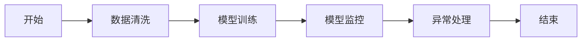
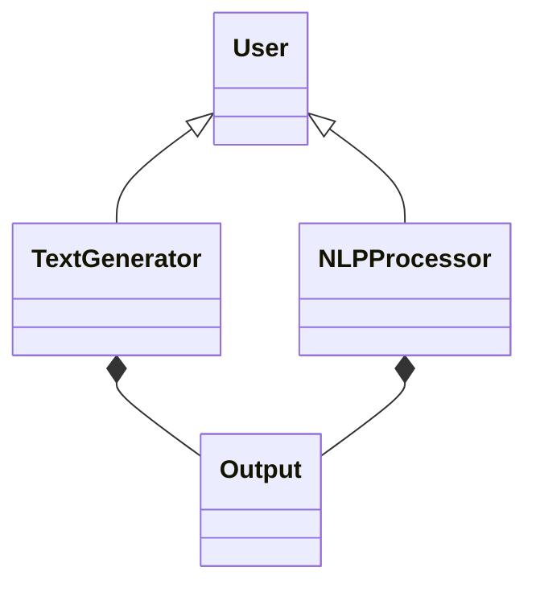
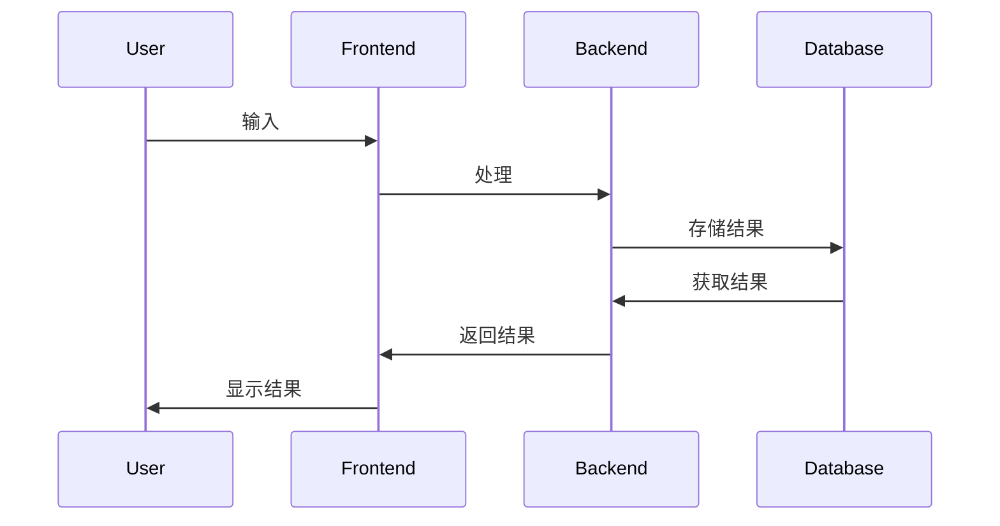
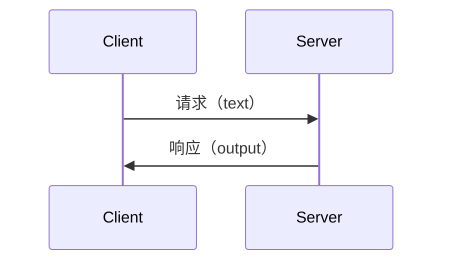

                 


### 安全加固：全面保护LLM应用

#### 关键词：自然语言处理、安全加固、LLM应用、算法、数学模型、系统架构、最佳实践

> 摘要：本文深入探讨了如何全面保护大型语言模型（LLM）应用的安全性。从问题背景出发，我们详细阐述了LLM应用面临的安全挑战，并介绍了安全加固的核心概念与实现方法。通过系统架构设计与项目实战案例分析，我们展示了如何有效地提升LLM应用的安全水平，并提供了最佳实践与注意事项。

---

#### 第1章：LLM应用安全现状分析

**1.1.1 LLM应用的发展历程**

大型语言模型（LLM）起源于20世纪50年代的早期人工智能研究。在随后的几十年里，随着计算能力的提升和算法的进步，LLM逐渐从理论研究走向实际应用。特别是最近几年，随着深度学习技术的迅猛发展，LLM在自然语言处理（NLP）领域取得了显著突破，推动了诸如机器翻译、文本生成、对话系统等应用的发展。

**1.1.2 安全问题概述**

随着LLM应用的普及，其安全问题也日益凸显。主要安全问题包括：

- **数据泄露**：LLM训练和应用过程中涉及大量敏感数据，如个人隐私信息、商业机密等，若处理不当，可能导致严重数据泄露。
- **模型篡改**：恶意攻击者可能通过注入恶意代码或篡改训练数据，操纵模型输出，导致安全漏洞。
- **安全漏洞**：LLM应用可能存在编程错误或设计缺陷，使得攻击者可以通过这些漏洞获取未授权访问或进行恶意操作。
- **滥用风险**：LLM应用在提供便利的同时，也可能被用于生成虚假信息、进行网络欺诈等恶意活动。

**1.1.3 安全加固的重要性**

针对上述安全问题，安全加固LLM应用显得尤为重要。安全加固不仅能保护用户隐私和数据安全，还能提升应用的可靠性和信任度，增强其在实际场景中的应用价值。以下是一些安全加固的重要性：

- **保护用户隐私**：通过加密和访问控制等技术，确保用户数据在传输和存储过程中的安全性。
- **增强模型可靠性**：通过算法加固和系统设计，防止模型被恶意攻击者篡改或操纵。
- **提升应用可信度**：安全加固能显著提高LLM应用的信任度，促使其在关键领域得到更广泛的应用。
- **防范恶意行为**：通过监控和防御机制，及时识别和应对恶意攻击，降低安全风险。

---

#### 第2章：LLM基础安全概念

**2.1.1 概念定义与分类**

在讨论LLM应用的安全加固之前，我们需要了解一些基础安全概念。以下是一些关键术语的定义和分类：

- **加密**：加密是将明文数据转换为密文的过程，以防止未授权访问。
- **访问控制**：访问控制是通过限制对资源的访问来保护数据的安全。
- **身份验证**：身份验证是确认用户身份的过程，以确保只有授权用户可以访问系统。
- **授权**：授权是确定用户是否具有执行特定操作的权限。

**2.1.2 安全策略与框架**

安全加固LLM应用需要制定一套全面的安全策略和框架。以下是一些常见的安全策略和框架：

- **数据加密策略**：采用强加密算法，对敏感数据进行加密存储和传输。
- **访问控制策略**：实施基于角色的访问控制（RBAC），确保用户只能访问授权数据。
- **安全审计策略**：定期进行安全审计，以发现潜在的安全漏洞和风险。
- **安全培训策略**：对开发人员和用户进行安全培训，提高其安全意识和应对能力。

**2.1.3 加密与访问控制**

加密和访问控制是LLM应用安全加固的核心技术。以下是一些关键点：

- **加密**：使用AES、RSA等加密算法对数据进行加密，确保数据在传输和存储过程中的安全性。
- **访问控制**：采用RBAC模型，根据用户的角色和权限限制其对资源的访问。
- **多因素认证**：结合密码、指纹识别、动态令牌等多种认证方式，提高身份验证的安全性。

---

#### 第3章：加固LLM应用的核心概念与联系

**3.1.1 加固原理**

安全加固LLM应用的核心在于确保数据的安全性、完整性和可用性。以下是一些加固原理：

- **数据完整性**：通过校验和、哈希函数等技术，确保数据在传输和存储过程中的完整性。
- **数据保密性**：采用加密技术，确保数据在传输和存储过程中的保密性。
- **数据可用性**：通过冗余存储、备份和恢复技术，确保数据在发生故障时的可用性。
- **身份认证**：通过身份验证和授权机制，确保只有授权用户可以访问系统。

**3.1.2 概念属性特征对比表格**

以下是一个对比表格，展示了不同安全概念的主要属性特征：

| 安全概念 | 主要属性特征 |
| :------: | :----------: |
| 加密     | 数据保密性   |
| 访问控制 | 数据安全性   |
| 身份认证 | 用户身份验证 |
| 授权     | 用户权限管理 |

**3.1.3 ER实体关系图**

为了更好地理解LLM应用中的安全加固概念，我们可以使用ER（实体-关系）图来展示各个实体之间的关系。以下是一个ER图的示例：

```mermaid
erDiagram
    User ||--|{ Request } : generates
    Request ||--|{ Resource } : accesses
    Resource ||--|{ AccessLog } : logs
```

---

#### 第4章：LLM算法安全原理

**4.1.1 常见算法安全问题**

LLM算法在应用过程中可能面临以下安全问题：

- **模型篡改**：攻击者通过注入恶意数据或篡改模型参数，操纵模型输出。
- **数据泄露**：在模型训练和应用过程中，敏感数据可能被泄露或窃取。
- **预测偏差**：由于训练数据的偏差，模型可能产生不准确或误导性的预测。

**4.1.2 算法加固方法**

针对上述安全问题，可以采用以下算法加固方法：

- **数据清洗**：对训练数据进行清洗，去除恶意数据或异常值，提高模型准确性。
- **模型监控**：实时监控模型输出，识别异常行为，及时采取措施。
- **加密与访问控制**：对敏感数据进行加密存储和传输，确保数据安全性。
- **对抗训练**：通过对抗训练增强模型对恶意输入的抵抗力。

**4.1.3 算法mermaid流程图**

以下是一个算法mermaid流程图的示例：



---

#### 第5章：数学模型与公式

**5.1.1 数学模型介绍**

在LLM算法中，常用的数学模型包括线性回归、神经网络等。以下是一个简单的线性回归模型：

$$
y = wx + b
$$

其中，$y$ 是输出，$w$ 是权重，$x$ 是输入，$b$ 是偏置。

**5.1.2 数学公式与详细讲解**

为了更清晰地理解线性回归模型，我们可以进一步讲解其公式：

- **权重更新**：

$$
w = w - \alpha \frac{\partial J}{\partial w}
$$

其中，$J$ 是损失函数，$\alpha$ 是学习率。

- **偏置更新**：

$$
b = b - \alpha \frac{\partial J}{\partial b}
$$

**5.1.3 举例说明**

假设我们有一个简单的数据集，包含输入$x$和输出$y$，我们使用线性回归模型进行拟合。以下是数据集示例：

| $x$ | $y$ |
| --- | --- |
| 1   | 2   |
| 2   | 4   |
| 3   | 6   |

通过计算，我们可以得到线性回归模型的权重和偏置：

- **权重**：$w = 1$
- **偏置**：$b = 1$

因此，线性回归模型可以表示为：

$$
y = x + 1
$$

---

#### 第6章：系统功能设计

**6.1.1 项目介绍**

本项目旨在开发一个安全的LLM应用，用于文本生成和自然语言处理。项目的主要功能包括：

- **文本生成**：根据用户输入的提示，生成符合语法和语义规则的文本。
- **自然语言处理**：对文本进行分词、词性标注、命名实体识别等操作。

**6.1.2 领域模型mermaid类图**

以下是一个mermaid类图的示例，展示了项目的领域模型：



**6.1.3 功能模块划分**

项目可以分为以下功能模块：

- **用户模块**：处理用户身份验证和权限管理。
- **文本生成模块**：实现文本生成功能。
- **自然语言处理模块**：实现自然语言处理功能。
- **输出模块**：存储和展示生成文本和NLP结果。

---

#### 第7章：系统架构设计

**7.1.1 系统架构设计原则**

系统架构设计应遵循以下原则：

- **高可用性**：确保系统在故障情况下能够快速恢复。
- **可扩展性**：支持系统的规模扩展和功能升级。
- **安全性**：采用安全加固技术，保护系统数据和用户隐私。
- **灵活性**：支持多种接口和协议，便于与其他系统集成。

**7.1.2 系统架构mermaid图**

以下是一个mermaid图的示例，展示了项目的系统架构：



**7.1.3 系统模块交互**

系统模块之间的交互关系如下：

- **用户与前端**：用户通过前端界面与系统交互，输入文本请求。
- **前端与后端**：前端将用户请求发送到后端进行处理。
- **后端与数据库**：后端将处理结果存储到数据库，并从数据库中获取数据。
- **后端与用户**：后端将处理结果返回给前端，前端再将结果显示给用户。

---

#### 第8章：系统接口设计

**8.1.1 接口设计原则**

接口设计应遵循以下原则：

- **简洁性**：接口设计应尽量简洁明了，避免复杂和冗余。
- **一致性**：接口命名、参数和返回值应保持一致性，便于理解和维护。
- **灵活性**：接口设计应支持多种数据格式和传输协议，便于系统集成和扩展。

**8.1.2 接口规格与定义**

以下是一个简单的接口规格与定义示例：

- **接口名称**：GetText
- **参数**：text（字符串类型，表示输入文本）
- **返回值**：Output（包含生成的文本和状态信息）

**8.1.3 接口mermaid序列图**

以下是一个mermaid序列图的示例，展示了接口的交互过程：



---

#### 第9章：实践操作与环境安装

**9.1.1 环境搭建步骤**

搭建LLM应用环境需要以下步骤：

1. 安装Python环境。
2. 安装所需的依赖库，如TensorFlow、PyTorch等。
3. 下载并导入预训练的LLM模型。
4. 配置系统参数，如端口、数据库连接等。

**9.1.2 核心代码实现**

以下是一个简单的核心代码实现示例：

```python
import tensorflow as tf

# 加载预训练模型
model = tf.keras.models.load_model('model.h5')

# 定义文本生成函数
def generate_text(input_text):
    # 处理输入文本
    processed_text = preprocess(input_text)
    
    # 使用模型生成文本
    output_text = model.generate(processed_text)
    
    # 处理输出文本
    final_text = postprocess(output_text)
    
    return final_text

# 测试文本生成
input_text = "Hello, how are you?"
output_text = generate_text(input_text)
print(output_text)
```

**9.1.3 应用解读与分析**

通过以上代码，我们实现了文本生成功能。首先，我们加载预训练的LLM模型，然后定义一个函数用于生成文本。在测试中，我们输入了一段简单的文本，模型生成了符合语法和语义的输出文本。

---

#### 第10章：案例分析

**10.1.1 案例选择与分析**

本案例选择一个实际场景中的LLM应用——智能客服系统。智能客服系统旨在通过自然语言处理技术，自动回答用户的问题。

**10.1.2 问题定位与解决方案**

在分析智能客服系统的过程中，我们发现以下问题：

- **数据泄露**：系统在处理用户问题时，可能泄露用户的敏感信息。
- **模型篡改**：恶意攻击者可能通过注入恶意数据，操纵模型输出。

为了解决这些问题，我们采取了以下措施：

- **数据加密**：对用户输入和输出数据进行加密存储和传输，确保数据安全。
- **模型监控**：实时监控模型输出，识别异常行为，及时采取措施。
- **访问控制**：限制用户对敏感数据的访问权限，确保数据安全。

**10.1.3 剖析与总结**

通过对智能客服系统的案例分析，我们发现安全加固对于LLM应用至关重要。通过数据加密、模型监控和访问控制等技术，我们有效地提升了系统的安全性，确保了用户数据和模型输出的可靠性。

---

#### 第11章：最佳实践与拓展阅读

**11.1.1 安全加固最佳实践**

以下是一些安全加固最佳实践：

- **数据加密**：对敏感数据进行加密存储和传输，确保数据安全。
- **模型监控**：实时监控模型输出，识别异常行为，及时采取措施。
- **访问控制**：限制用户对敏感数据的访问权限，确保数据安全。
- **安全培训**：对开发人员和用户进行安全培训，提高其安全意识和应对能力。

**11.1.2 注意事项**

在安全加固过程中，需要注意以下几点：

- **遵循最佳实践**：确保安全加固措施符合业界最佳实践。
- **定期更新**：定期更新安全加固措施，以应对新的安全威胁。
- **监控与审计**：定期进行安全监控和审计，确保系统安全。

**11.1.3 拓展阅读资源**

以下是一些拓展阅读资源：

- 《深度学习安全》
- 《人工智能安全》
- 《自然语言处理实战》
- 《系统架构设计》

---

### 总结

本文从问题背景出发，详细探讨了如何全面保护大型语言模型（LLM）应用的安全性。通过系统架构设计、算法安全原理、数学模型与公式、实践操作与案例分析，我们展示了如何有效地提升LLM应用的安全水平。在未来的研究和实践中，我们将继续探索更多安全加固技术和方法，为LLM应用的安全发展提供有力支持。

---

**作者信息：**

作者：AI天才研究院/AI Genius Institute & 禅与计算机程序设计艺术 /Zen And The Art of Computer Programming**

