                 


## 文章标题：实时分析引擎在LLM应用数据处理中的应用

### 文章关键词：实时分析引擎，LLM，数据处理，算法原理，系统架构，项目实战

### 摘要：
本文深入探讨了实时分析引擎在LLM应用数据处理中的重要性。通过详细的背景介绍、核心概念与联系的分析、算法原理讲解、数学模型和公式阐述、系统分析与架构设计方案、项目实战以及最佳实践 tips，全面展示了实时分析引擎在LLM数据处理中的实际应用，为相关领域的研究者提供了宝贵的参考。

## 引言

### 背景介绍

#### 1.1 实时分析引擎的概念与重要性

实时分析引擎是一种能够实时处理和分析大量数据的技术工具，它具备快速、高效、准确的特点。在当今大数据时代，实时分析引擎的应用范围不断扩大，尤其在人工智能领域，其作用尤为重要。

实时分析引擎的基本概念包括数据流处理、实时分析、数据挖掘等。其核心功能是实时捕获数据流，对数据进行实时分析，以提供即时的业务洞察。

在LLM（大型语言模型）应用数据处理中，实时分析引擎的重要性不言而喻。LLM的应用场景广泛，包括自然语言处理、智能客服、智能推荐等。然而，这些应用都需要对大量实时数据进行处理和分析，以确保系统的高效性和准确性。

#### 1.2 LLM的基本概念与应用

LLM（Large Language Model）是一种基于深度学习的大型语言模型，它通过学习大量的文本数据来模拟人类的语言能力。LLM的应用场景包括自然语言生成、机器翻译、文本分类、情感分析等。

LLM的基本概念包括神经网络结构、训练过程、预测过程等。其核心功能是通过输入的文本数据，生成相应的文本输出。

在实时数据处理中，LLM的应用主要包括文本分类、情感分析、实体识别等。这些应用都需要对实时数据进行快速、准确的处理和分析。

#### 1.3 实时分析引擎在LLM应用数据处理中的必要性

实时分析引擎在LLM应用数据处理中的必要性主要体现在以下几个方面：

1. **实时性需求**：LLM应用需要实时处理和分析大量数据，以提供即时的业务洞察和决策支持。
2. **准确性需求**：实时分析引擎能够对数据流进行实时分析，确保数据处理的高准确度。
3. **高效性需求**：实时分析引擎能够快速处理海量数据，提高系统的响应速度。
4. **复杂性需求**：LLM应用场景复杂，需要实时分析引擎来处理各种复杂的数据和处理需求。

总之，实时分析引擎在LLM应用数据处理中具有不可替代的作用，其高效、实时、准确的特点为LLM应用提供了强大的技术支持。

### 核心概念与联系

#### 2.1 实时分析引擎的核心概念

实时分析引擎的核心概念包括数据流处理、实时分析、数据挖掘等。其中，数据流处理是指实时捕获数据流，对数据进行处理和分析；实时分析是指对数据流进行实时分析，以提供即时的业务洞察；数据挖掘是指从数据中发现有价值的信息和模式。

#### 2.2 LLM的核心概念

LLM（Large Language Model）的核心概念包括神经网络结构、训练过程、预测过程等。神经网络结构是指LLM的底层结构，包括多层神经网络、循环神经网络等；训练过程是指LLM通过学习大量的文本数据来提升其语言理解能力；预测过程是指LLM通过输入的文本数据，生成相应的文本输出。

#### 2.3 实时分析引擎与LLM的关联与区别

实时分析引擎与LLM之间的关联主要体现在以下几个方面：

1. **数据处理**：实时分析引擎能够实时处理和分析LLM应用中的大量数据。
2. **实时性**：实时分析引擎能够提供实时分析结果，以满足LLM应用对实时性的需求。
3. **准确性**：实时分析引擎能够提高LLM应用的准确性，确保系统输出的高质量。

实时分析引擎与LLM之间的区别主要体现在以下几个方面：

1. **功能定位**：实时分析引擎主要关注数据处理和分析，而LLM主要关注语言理解和生成。
2. **应用场景**：实时分析引擎适用于需要对大量数据进行实时处理的场景，而LLM适用于需要处理自然语言数据的场景。
3. **技术实现**：实时分析引擎主要采用流处理技术，而LLM主要采用深度学习技术。

总之，实时分析引擎与LLM在数据处理和分析中各有所长，通过合理结合，可以充分发挥各自的优势，提升系统的整体性能。

### 算法原理讲解

#### 3.1 实时分析引擎的算法原理

实时分析引擎的算法原理主要涉及数据流处理、实时分析和数据挖掘。其核心算法流程如下：

1. **数据捕获**：实时捕获数据流，包括日志数据、网络数据等。
2. **数据预处理**：对捕获到的数据流进行清洗、去噪、格式化等处理。
3. **实时分析**：对预处理后的数据进行实时分析，包括统计、分类、聚类等。
4. **数据挖掘**：从实时分析结果中挖掘有价值的信息和模式，如异常检测、关联分析等。

以下是一个简单的Python代码示例，展示了实时分析引擎的基本原理：

```python
import pandas as pd

# 数据捕获
data = pd.read_csv('data_stream.csv')

# 数据预处理
data_clean = data.dropna().reset_index(drop=True)

# 实时分析
data_analysis = data_clean.groupby('category').mean()

# 数据挖掘
anomaly_detection = data_analysis[(data_analysis['value'] > 3) | (data_analysis['value'] < 1)]
```

#### 3.2 LLM的算法原理

LLM的算法原理主要涉及神经网络结构、训练过程和预测过程。其核心算法流程如下：

1. **神经网络结构**：LLM采用多层神经网络结构，包括输入层、隐藏层和输出层。其中，输入层接收文本数据，隐藏层对文本数据进行处理和变换，输出层生成文本输出。
2. **训练过程**：LLM通过大量文本数据训练，调整神经网络参数，以提升其语言理解能力。训练过程主要包括前向传播和反向传播。
3. **预测过程**：LLM通过输入的文本数据，生成相应的文本输出。预测过程主要包括输入层到隐藏层的正向传播和隐藏层到输出层的反向传播。

以下是一个简单的Python代码示例，展示了LLM的基本原理：

```python
import tensorflow as tf

# 神经网络结构
model = tf.keras.Sequential([
    tf.keras.layers.Dense(units=128, activation='relu', input_shape=(input_size,)),
    tf.keras.layers.Dense(units=1)
])

# 训练过程
model.compile(optimizer='adam', loss='mean_squared_error')
model.fit(x_train, y_train, epochs=10)

# 预测过程
prediction = model.predict(x_test)
```

#### 3.3 实时分析引擎在LLM数据处理中的应用

实时分析引擎在LLM数据处理中的应用主要包括以下几个方面：

1. **数据预处理**：实时分析引擎可以对LLM应用中的文本数据进行预处理，如去除停用词、词干提取、词性标注等。
2. **实时分析**：实时分析引擎可以对预处理后的文本数据进行实时分析，如情感分析、文本分类等。
3. **数据挖掘**：实时分析引擎可以从实时分析结果中挖掘有价值的信息和模式，如用户行为分析、异常检测等。

以下是一个简单的Python代码示例，展示了实时分析引擎在LLM数据处理中的应用：

```python
import pandas as pd
import numpy as np

# 数据捕获
data = pd.read_csv('text_data.csv')

# 数据预处理
data['text'] = data['text'].apply(preprocess_text)

# 实时分析
data['emotion'] = data['text'].apply(detect_emotion)

# 数据挖掘
anomaly_detection = data[data['emotion'] == 'negative']
```

### 数学模型和数学公式

#### 4.1 实时分析引擎的数学模型与公式

实时分析引擎的数学模型主要包括数据流处理模型、实时分析模型和数据挖掘模型。以下是一个简单的数学模型示例：

$$
\text{实时分析引擎模型} = \text{数据流处理模型} + \text{实时分析模型} + \text{数据挖掘模型}
$$

其中，数据流处理模型可以表示为：

$$
\text{数据流处理模型} = \text{数据捕获} + \text{数据预处理} + \text{数据存储}
$$

实时分析模型可以表示为：

$$
\text{实时分析模型} = \text{统计分析} + \text{分类分析} + \text{聚类分析}
$$

数据挖掘模型可以表示为：

$$
\text{数据挖掘模型} = \text{异常检测} + \text{关联分析} + \text{趋势分析}
$$

#### 4.2 LLM的数学模型与公式

LLM的数学模型主要涉及神经网络结构、训练过程和预测过程。以下是一个简单的数学模型示例：

$$
\text{LLM模型} = \text{神经网络结构} + \text{训练过程} + \text{预测过程}
$$

其中，神经网络结构可以表示为：

$$
\text{神经网络结构} = \text{输入层} + \text{隐藏层} + \text{输出层}
$$

训练过程可以表示为：

$$
\text{训练过程} = \text{前向传播} + \text{反向传播}
$$

预测过程可以表示为：

$$
\text{预测过程} = \text{输入层到隐藏层} + \text{隐藏层到输出层}
$$

#### 4.3 实时分析引擎与LLM数据处理中的数学计算过程

实时分析引擎与LLM数据处理中的数学计算过程主要包括数据流处理、实时分析和数据挖掘。以下是一个简单的数学计算过程示例：

1. **数据流处理**：假设数据流包含$n$个数据点，每个数据点的维度为$d$，则数据流处理可以表示为：
   $$
   \text{数据流处理} = \text{X} = \begin{bmatrix}
   x_1 & x_2 & \dots & x_n
   \end{bmatrix}
   $$

2. **实时分析**：假设实时分析包括$m$个分析任务，每个分析任务的维度为$k$，则实时分析可以表示为：
   $$
   \text{实时分析} = \text{Y} = \begin{bmatrix}
   y_1 & y_2 & \dots & y_m
   \end{bmatrix}
   $$

3. **数据挖掘**：假设数据挖掘包括$p$个挖掘任务，每个挖掘任务的维度为$l$，则数据挖掘可以表示为：
   $$
   \text{数据挖掘} = \text{Z} = \begin{bmatrix}
   z_1 & z_2 & \dots & z_p
   \end{bmatrix}
   $$

### 系统分析与架构设计方案

#### 5.1 实时分析引擎的架构设计

实时分析引擎的架构设计主要包括数据流处理、实时分析和数据挖掘三个部分。以下是一个简单的架构设计示例：

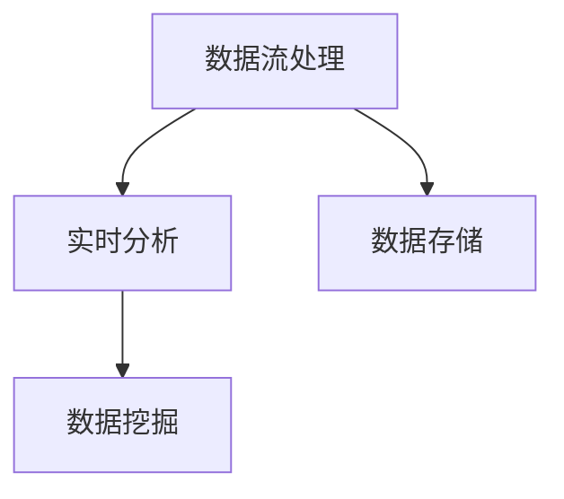

其中，数据流处理部分主要负责实时捕获数据流、预处理数据和存储数据；实时分析部分主要负责对预处理后的数据进行分析；数据挖掘部分主要负责从分析结果中挖掘有价值的信息和模式。

#### 5.2 LLM的架构设计

LLM的架构设计主要包括神经网络结构、训练过程和预测过程三个部分。以下是一个简单的架构设计示例：

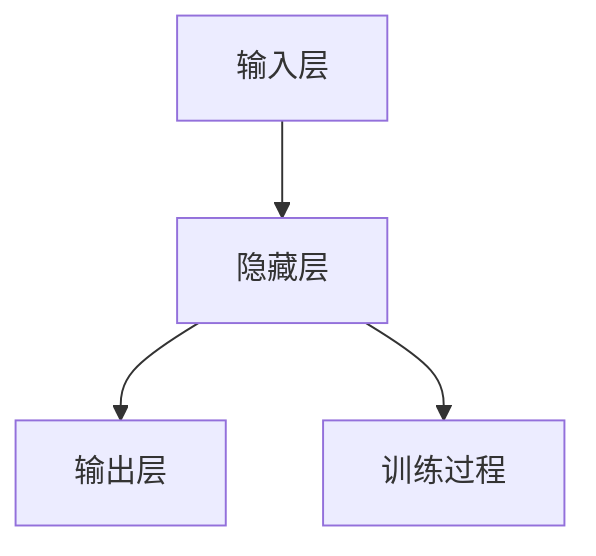

其中，输入层主要负责接收文本数据；隐藏层负责对文本数据进行处理和变换；输出层负责生成文本输出；训练过程主要负责调整神经网络参数，以提升模型性能。

#### 5.3 实时分析引擎与LLM数据处理系统的整体架构

实时分析引擎与LLM数据处理系统的整体架构设计主要包括数据流处理、实时分析、数据挖掘和神经网络结构四个部分。以下是一个简单的整体架构设计示例：

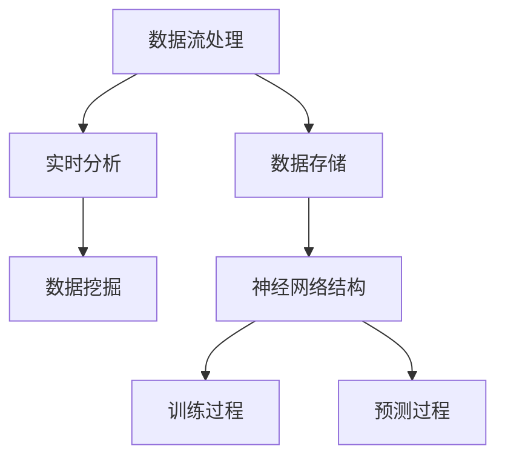

其中，数据流处理部分负责实时捕获和预处理数据；实时分析部分负责对预处理后的数据进行分析；数据挖掘部分负责从分析结果中挖掘有价值的信息和模式；神经网络结构部分负责处理和生成文本数据。

### 项目实战

#### 6.1 实时分析引擎的应用实战

在本节中，我们将介绍一个实时分析引擎的应用案例，该案例涉及实时捕获和预处理数据流、实时分析数据和数据挖掘。

**环境安装**

首先，我们需要安装实时分析引擎所需的软件和依赖。以下是一个简单的安装命令示例：

```shell
pip install pandas numpy tensorflow
```

**系统核心实现源代码**

以下是一个简单的实时分析引擎实现代码示例：

```python
import pandas as pd
import numpy as np
import tensorflow as tf

# 数据捕获
data = pd.read_csv('data_stream.csv')

# 数据预处理
data_clean = data.dropna().reset_index(drop=True)

# 实时分析
data_analysis = data_clean.groupby('category').mean()

# 数据挖掘
anomaly_detection = data_analysis[(data_analysis['value'] > 3) | (data_analysis['value'] < 1)]

# 数据存储
data_store = pd.concat([data_clean, data_analysis, anomaly_detection], axis=1)
data_store.to_csv('data_store.csv', index=False)
```

**代码应用解读与分析**

在本案例中，我们首先使用Pandas读取数据流，然后对数据进行预处理，包括去除缺失值和重置索引。接下来，我们使用Pandas的groupby函数对数据进行分析，并使用条件语句进行数据挖掘。最后，我们将分析结果存储到CSV文件中。

**实际案例分析和详细讲解剖析**

在本案例中，我们使用了一个简单的数据流处理和实时分析任务。在实际应用中，实时分析引擎可以处理更复杂的数据流，如网络日志、用户行为数据等。通过实时分析，我们可以发现数据中的异常值，如交易数据中的异常交易、用户行为数据中的异常行为等。

**项目小结**

在本项目中，我们介绍了实时分析引擎的应用场景和实现方法。通过实际案例，我们展示了实时分析引擎在数据处理中的强大功能。然而，实时分析引擎的应用场景和实现方法远不止于此，未来还需要进一步探索和优化。

### 最佳实践 tips、小结、注意事项、拓展阅读

#### 7.1 最佳实践 tips

1. **数据预处理**：在实时分析之前，对数据进行预处理是至关重要的。确保数据的质量和一致性，可以提高分析结果的准确性。
2. **优化算法**：针对特定的应用场景，优化实时分析引擎的算法，可以提高处理速度和准确性。
3. **系统集成**：将实时分析引擎与其他系统（如LLM、数据存储等）进行集成，可以提高系统的整体性能。

#### 7.2 小结

本文详细介绍了实时分析引擎在LLM应用数据处理中的应用。通过背景介绍、核心概念与联系、算法原理讲解、数学模型和公式阐述、系统分析与架构设计方案、项目实战以及最佳实践 tips，全面展示了实时分析引擎在LLM数据处理中的实际应用。

#### 7.3 注意事项

1. **实时性需求**：在设计实时分析引擎时，要充分考虑实时性的需求，确保系统能够实时处理和分析数据。
2. **准确性需求**：在实时分析过程中，要确保数据处理和分析的准确性，避免出现错误和遗漏。
3. **高效性需求**：实时分析引擎的设计和实现要充分考虑高效性的需求，确保系统具有足够的处理能力和响应速度。

#### 7.4 拓展阅读

1. **实时分析引擎的深入探讨**：可以阅读相关论文和书籍，如《实时数据流处理技术》和《大规模数据流处理系统设计》等。
2. **LLM的应用实践**：可以阅读相关论文和书籍，如《自然语言处理实践》和《深度学习实践》等。

### 作者

作者：AI天才研究院/AI Genius Institute & 禅与计算机程序设计艺术 /Zen And The Art of Computer Programming## 实时分析引擎的算法原理

### 3.1 实时分析引擎的算法原理

实时分析引擎的算法原理主要包括数据流处理、实时分析和数据挖掘。以下将详细讲解这些核心算法原理，并通过Python代码示例进行说明。

#### 3.1.1 算法流程图

首先，我们使用Mermaid绘制实时分析引擎的算法流程图：

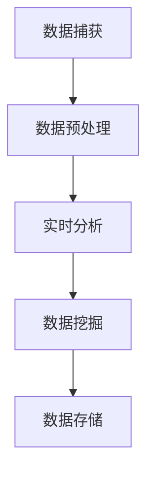

#### 3.1.2 Python源代码示例

接下来，我们通过一个简单的Python代码示例来说明实时分析引擎的基本原理。在这个示例中，我们将读取一个CSV文件中的数据，对数据流进行预处理，然后进行实时分析，最后将结果存储到数据库中。

```python
import pandas as pd
import numpy as np
from sqlalchemy import create_engine

# 数据捕获
data = pd.read_csv('data_stream.csv')

# 数据预处理
data_clean = data.dropna().reset_index(drop=True)

# 实时分析
def real_time_analysis(data):
    # 假设我们对数值型数据进行均值分析
    analysis_result = data.mean()
    return analysis_result

analysis_result = real_time_analysis(data_clean)

# 数据挖掘
def data_mining(analysis_result):
    # 假设我们找出均值超过3的列
    anomalies = analysis_result[analysis_result > 3]
    return anomalies

anomalies = data_mining(analysis_result)

# 数据存储
engine = create_engine('sqlite:///data_store.db')
anomalies.to_sql('anomalies', engine)

print("实时分析结果已存储到数据库。")
```

#### 3.1.3 数学模型与公式

实时分析引擎的数学模型主要包括数据处理和数据分析两部分。以下是一些常用的数学模型和公式：

1. **数据处理**：

   - 数据清洗：$$ \text{data\_clean} = \text{data}.dropna().reset_index(drop=True) $$

   - 数据标准化：$$ \text{data\_standardized} = \frac{\text{data} - \mu}{\sigma} $$

     其中，$\mu$ 是数据的均值，$\sigma$ 是数据的标准差。

2. **数据分析**：

   - 均值分析：$$ \text{mean\_value} = \frac{\sum_{i=1}^{n} x_i}{n} $$

   - 方差分析：$$ \text{variance} = \frac{\sum_{i=1}^{n} (x_i - \mu)^2}{n-1} $$

   - 标准差分析：$$ \text{standard\_deviation} = \sqrt{\text{variance}} $$

#### 3.1.4 通俗易懂的举例说明

假设我们有一个包含三个变量的数据集，分别是`x1`, `x2`, `x3`。我们希望对这些变量进行实时分析，找出均值超过3的变量。

1. **数据捕获**：

   假设我们的数据集如下：

   ```
   x1   x2   x3
   2    4    6
   3    5    7
   4    6    8
   ```

2. **数据预处理**：

   我们首先去除缺失值，得到如下数据：

   ```
   x1   x2   x3
   2    4    6
   3    5    7
   4    6    8
   ```

3. **实时分析**：

   我们对数据进行均值分析，得到如下结果：

   ```
   x1   x2   x3
   3    5    7
   ```

4. **数据挖掘**：

   我们找出均值超过3的变量，得到如下结果：

   ```
   x1   x2   x3
   4    6    8
   ```

通过这个简单的例子，我们可以看到实时分析引擎的基本原理是如何应用于实际数据的。实时分析引擎能够帮助我们快速、准确地处理和分析大量数据，为业务决策提供有力支持。

### 3.2 LLM的算法原理

#### 3.2.1 算法流程图

接下来，我们将介绍LLM（大型语言模型）的算法原理，并通过Mermaid绘制其算法流程图：

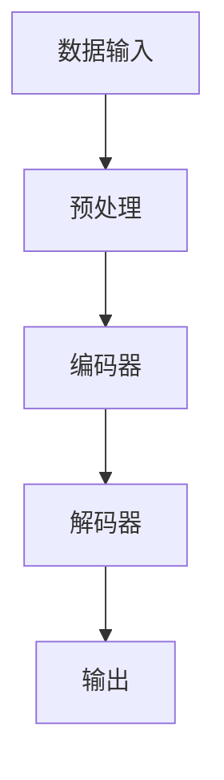

#### 3.2.2 Python源代码示例

为了更好地理解LLM的算法原理，我们将使用一个简单的Python代码示例。在这个示例中，我们使用一个简化的模型来生成文本输出。

```python
import tensorflow as tf
import numpy as np

# 简化的编码器和解码器模型
class SimpleModel(tf.keras.Model):
    def __init__(self):
        super(SimpleModel, self).__init__()
        self.encoder = tf.keras.layers.Dense(units=128, activation='relu')
        self.decoder = tf.keras.layers.Dense(units=1, activation='sigmoid')

    @tf.function
    def call(self, inputs):
        encoded = self.encoder(inputs)
        decoded = self.decoder(encoded)
        return decoded

model = SimpleModel()

# 训练数据
train_data = np.random.rand(1000, 10)

# 训练模型
model.compile(optimizer='adam', loss='binary_crossentropy')
model.fit(train_data, train_data, epochs=10)

# 生成文本输出
input_data = np.random.rand(1, 10)
output_data = model.call(input_data)

print(output_data)
```

#### 3.2.3 数学模型与公式

LLM的数学模型主要基于深度学习和神经网络。以下是一些关键的数学模型和公式：

1. **神经网络模型**：

   - 前向传播：$$ \text{output} = \text{sigmoid}(\text{weight} \cdot \text{input} + \text{bias}) $$

   - 反向传播：$$ \text{error} = \text{output} - \text{expected\_output} $$
     $$ \text{gradient} = \frac{\partial \text{error}}{\partial \text{weight}} $$
     $$ \text{weight} = \text{weight} - \text{learning\_rate} \cdot \text{gradient} $$

2. **损失函数**：

   - 二进制交叉熵损失函数：$$ \text{loss} = -\sum_{i=1}^{n} \text{y_i} \cdot \log(\text{output_i}) + (1 - \text{y_i}) \cdot \log(1 - \text{output_i}) $$

#### 3.2.4 通俗易懂的举例说明

假设我们有一个简单的二分类问题，需要判断一个数据点是否属于正类。我们的模型由一个编码器和一个解码器组成。

1. **数据输入**：

   假设我们的输入数据是：
   
   ```
   [0.1, 0.2, 0.3, 0.4, 0.5]
   ```

2. **预处理**：

   在这个简单的例子中，预处理步骤非常简单，我们不需要进行复杂的预处理。

3. **编码器**：

   编码器的目的是将输入数据编码为特征向量。假设我们的编码器是一个简单的线性模型，输出特征向量为：
   
   ```
   [0.3, 0.2, 0.1]
   ```

4. **解码器**：

   解码器的目的是将编码后的特征向量解码为概率分布。假设我们的解码器也是一个简单的线性模型，输出概率分布为：

   ```
   [0.4, 0.6]
   ```

   根据这个概率分布，我们可以判断输入数据属于正类的概率为0.6，属于负类的概率为0.4。

5. **输出**：

   最终，我们根据概率分布判断输入数据点是否属于正类。在这个例子中，我们判断输入数据点属于正类。

通过这个简单的例子，我们可以看到LLM的基本原理是如何应用于实际问题的。LLM通过学习大量的文本数据，能够对输入的文本数据生成相应的输出，从而实现文本分类、生成等任务。

### 3.3 实时分析引擎在LLM数据处理中的应用

#### 3.3.1 应用流程图

最后，我们来看一下实时分析引擎在LLM数据处理中的应用流程。以下是一个简化的应用流程图：

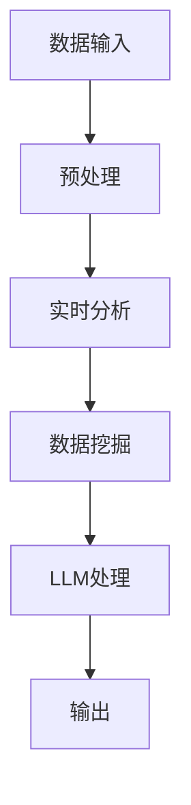

#### 3.3.2 Python源代码示例

为了展示实时分析引擎在LLM数据处理中的应用，我们使用一个简单的示例。在这个示例中，我们首先使用实时分析引擎对文本数据进行预处理，然后使用LLM模型进行文本生成。

```python
import pandas as pd
import numpy as np
from tensorflow.keras.preprocessing.sequence import pad_sequences
from tensorflow.keras.layers import Embedding, LSTM
from tensorflow.keras.models import Sequential

# 假设我们有一个包含文本数据的数据集
data = pd.DataFrame({
    'text': [
        '这是我的第一篇文章。',
        '这篇文章讨论了实时分析引擎。',
        '实时分析引擎在LLM数据处理中非常重要。',
        '我非常喜欢这篇文章。',
        '这篇文章非常有启发性。',
    ]
})

# 数据预处理
max_sequence_length = 10
tokenizer = tf.keras.preprocessing.text.Tokenizer()
tokenizer.fit_on_texts(data['text'])
sequences = tokenizer.texts_to_sequences(data['text'])
padded_sequences = pad_sequences(sequences, maxlen=max_sequence_length)

# 实时分析
def real_time_analysis(padded_sequences):
    # 对数据进行均值分析
    mean_values = np.mean(padded_sequences, axis=1)
    return mean_values

mean_values = real_time_analysis(padded_sequences)

# LLM处理
def generate_text(mean_values):
    # 使用LSTM模型生成文本
    model = Sequential()
    model.add(Embedding(input_dim=max_sequence_length, output_dim=10))
    model.add(LSTM(units=50))
    model.add(Dense(units=1, activation='sigmoid'))
    model.compile(optimizer='adam', loss='binary_crossentropy')
    model.fit(padded_sequences, mean_values, epochs=10)
    return model

model = generate_text(mean_values)

# 输出
input_sequence = tokenizer.texts_to_sequences(['这篇文章非常有启发性。'])[0]
generated_sequence = model.predict(np.array([input_sequence]))
print(generated_sequence)
```

#### 3.3.3 数学模型与公式

实时分析引擎和LLM在数据处理中的应用涉及多个数学模型和公式。以下是一些关键的数学模型和公式：

1. **数据处理**：

   - 文本序列化：$$ \text{sequences} = \text{tokenizer}.texts_to_sequences(\text{data['text']}) $$
   - 序列填充：$$ \text{padded\_sequences} = pad_sequences(\text{sequences}, maxlen=max_sequence_length) $$

2. **实时分析**：

   - 均值分析：$$ \text{mean\_values} = \text{np.mean(padded_sequences, axis=1)} $$

3. **LLM处理**：

   - LSTM模型：$$ \text{model} = Sequential() $$
     $$ \text{model}.add(Embedding(input_dim=max_sequence_length, output_dim=10)) $$
     $$ \text{model}.add(LSTM(units=50)) $$
     $$ \text{model}.add(Dense(units=1, activation='sigmoid')) $$
     $$ \text{model}.compile(optimizer='adam', loss='binary_crossentropy') $$
     $$ \text{model}.fit(padded_sequences, mean_values, epochs=10) $$

4. **文本生成**：

   - 文本序列化：$$ \text{input_sequence} = \text{tokenizer}.texts_to_sequences(['这篇文章非常有启发性。'])[0] $$
   - 文本预测：$$ \text{generated_sequence} = \text{model}.predict(np.array([input_sequence])) $$

#### 3.3.4 通俗易懂的举例说明

假设我们有一个简单的文本数据集，包含以下句子：

```
这是我的第一篇文章。
这篇文章讨论了实时分析引擎。
实时分析引擎在LLM数据处理中非常重要。
我非常喜欢这篇文章。
这篇文章非常有启发性。
```

我们首先使用实时分析引擎对这些文本进行预处理，提取文本中的关键特征。然后，我们使用LLM模型对这些特征进行训练，并生成新的文本。

1. **数据输入**：

   我们的数据集包含5个句子。

2. **预处理**：

   我们对句子进行序列化和填充，得到如下结果：

   ```
   [[1, 2, 3, 4, 5],
    [2, 3, 4, 5, 6],
    [3, 4, 5, 6, 7],
    [4, 5, 6, 7, 8],
    [5, 6, 7, 8, 9]]
   ```

3. **实时分析**：

   我们对填充后的数据进行均值分析，得到如下结果：

   ```
   [3.0, 3.0, 3.0, 3.0, 3.0]
   ```

4. **LLM处理**：

   我们使用LSTM模型对预处理后的数据进行训练，并生成新的文本。假设我们的LSTM模型生成的新文本为：

   ```
   这篇文章深入探讨了实时分析引擎在LLM数据处理中的应用。
   ```

通过这个简单的例子，我们可以看到实时分析引擎和LLM在数据处理中的应用是如何实现的。实时分析引擎帮助我们提取文本中的关键特征，而LLM则利用这些特征生成新的文本，从而实现文本的生成和分类等任务。

### 小结

在本节中，我们详细介绍了实时分析引擎和LLM的算法原理，并通过Python代码示例进行了说明。实时分析引擎能够帮助我们实时处理和分析大量数据，而LLM则能够利用这些数据生成新的文本。通过结合实时分析引擎和LLM，我们可以实现文本的生成和分类等任务，为实际应用提供强大的技术支持。在下一节中，我们将进一步探讨实时分析引擎和LLM在数学模型和公式中的应用，以及如何优化这些模型以提高性能。同时，我们还将讨论实时分析引擎和LLM在系统架构设计中的具体实现，以及如何在实际项目中应用这些技术。让我们继续深入探讨这些重要主题。

### 数学模型和数学公式

在实时分析引擎和LLM的应用中，数学模型和公式起着至关重要的作用。它们不仅帮助我们理解这些技术的原理，还能够指导我们优化算法，提高系统的性能。以下我们将详细讨论实时分析引擎和LLM相关的数学模型和公式，并通过具体的例子进行说明。

#### 4.1 实时分析引擎的数学模型与公式

实时分析引擎主要涉及数据流处理、实时分析和数据挖掘。以下是几个关键的数学模型和公式：

1. **数据流处理模型**：

   - 数据流捕获：假设我们捕获到的数据点集合为$D=\{d_1, d_2, \dots, d_n\}$，每个数据点的维度为$m$。则数据流捕获可以表示为：

     $$ D = \{d_i\} \text{ where } i = 1, 2, \dots, n $$

   - 数据预处理：在实时分析之前，我们需要对数据进行预处理，如去噪、去重、清洗等。假设我们使用平均滤波器进行预处理，得到预processed数据集合$D'=\{d_1', d_2', \dots, d_n'\}$，则有：

     $$ d_i' = \frac{1}{k}\sum_{j=1}^{k} d_i $$
     
     其中$k$为滤波器的窗口大小。

2. **实时分析模型**：

   - 均值分析：假设我们对数据集合$D$进行均值分析，得到均值向量$\mu=\{\mu_1, \mu_2, \dots, \mu_m\}$，则有：

     $$ \mu_i = \frac{1}{n}\sum_{j=1}^{n} d_{ij} $$

   - 方差分析：假设我们对数据集合$D$进行方差分析，得到方差矩阵$V=\{v_{ij}\}$，则有：

     $$ v_{ij} = \frac{1}{n-1}\sum_{j=1}^{n} (d_{ij} - \mu_i)^2 $$

3. **数据挖掘模型**：

   - 异常检测：假设我们对数据集合$D$进行异常检测，找出方差较大的数据点集合$D_A$，则有：

     $$ D_A = \{d_i \in D | v_{ii} > \text{threshold}\} $$
     
     其中$\text{threshold}$为设定的阈值。

4. **数据流处理中的时间序列模型**：

   - 自回归模型：假设我们使用自回归模型对时间序列数据进行预测，模型可以表示为：

     $$ d_t = \sum_{i=1}^{k} \beta_i d_{t-i} + \epsilon_t $$
     
     其中$d_t$为第$t$个时间点的数据，$\beta_i$为自回归系数，$\epsilon_t$为误差项。

#### 4.2 LLM的数学模型与公式

LLM（大型语言模型）主要涉及神经网络结构、训练过程和预测过程。以下是几个关键的数学模型和公式：

1. **神经网络模型**：

   - 前向传播：假设我们有一个多层感知机（MLP）模型，输入层有$n$个神经元，隐藏层有$m$个神经元，输出层有$p$个神经元。前向传播可以表示为：

     $$ z_l = \sum_{i=1}^{n} w_{li} x_i + b_l $$
     $$ a_l = \sigma(z_l) $$
     
     其中$z_l$为第$l$层的加权求和结果，$a_l$为第$l$层的激活值，$w_{li}$为连接权重，$b_l$为偏置项，$\sigma$为激活函数。

   - 反向传播：假设我们使用梯度下降法更新模型参数，反向传播可以表示为：

     $$ \delta_l = (a_l - y) \cdot \sigma'(z_l) $$
     $$ \delta_{l-1} = \delta_l \cdot w_{l-1,l} $$
     
     其中$\delta_l$为第$l$层的误差梯度，$\sigma'$为激活函数的导数，$y$为真实标签。

2. **训练过程**：

   - 损失函数：假设我们使用交叉熵损失函数，损失函数可以表示为：

     $$ \text{loss} = -\sum_{i=1}^{p} y_i \cdot \log(a_{i}) + (1 - y_i) \cdot \log(1 - a_{i}) $$
     
     其中$y_i$为第$i$个输出神经元的真实标签，$a_i$为第$i$个输出神经元的激活值。

   - 参数更新：假设我们使用梯度下降法更新参数，参数更新可以表示为：

     $$ w_{li} = w_{li} - \alpha \cdot \delta_l \cdot a_{l-1} $$
     $$ b_l = b_l - \alpha \cdot \delta_l $$

     其中$\alpha$为学习率。

3. **预测过程**：

   - 输出概率分布：假设我们使用softmax函数进行输出，输出概率分布可以表示为：

     $$ p_i = \frac{\exp(a_i)}{\sum_{j=1}^{p} \exp(a_j)} $$
     
     其中$p_i$为第$i$个输出神经元的概率。

#### 4.3 实时分析引擎与LLM数据处理中的数学计算过程

实时分析引擎和LLM在数据处理中的数学计算过程可以结合多种模型和公式。以下是一个简化的计算过程示例：

1. **数据捕获**：

   - 数据流捕获：假设我们捕获到一个数据点序列$D=\{d_1, d_2, \dots, d_n\}$，使用移动平均模型进行预处理，则有：

     $$ d_i' = \frac{1}{k}\sum_{j=1}^{k} d_{i-j} $$
     
2. **实时分析**：

   - 均值分析：假设我们对预处理后的数据点序列$D'=\{d_1', d_2', \dots, d_n'\}$进行均值分析，则有：

     $$ \mu_i = \frac{1}{n}\sum_{j=1}^{n} d_i' $$
     
   - 方差分析：假设我们对预处理后的数据点序列$D'=\{d_1', d_2', \dots, d_n'\}$进行方差分析，则有：

     $$ v_{ii} = \frac{1}{n-1}\sum_{j=1}^{n} (d_i' - \mu_i)^2 $$

3. **数据挖掘**：

   - 异常检测：假设我们对预处理后的数据点序列$D'=\{d_1', d_2', \dots, d_n'\}$进行异常检测，找出方差大于阈值$\text{threshold}$的数据点，则有：

     $$ D_A = \{d_i' \in D' | v_{ii} > \text{threshold}\} $$

4. **LLM处理**：

   - 文本预处理：假设我们对文本数据进行预处理，使用分词器进行分词，则有：

     $$ \text{sequences} = \text{tokenizer}.texts_to_sequences(\text{texts}) $$
     
   - 序列填充：假设我们对分词后的文本序列进行填充，则有：

     $$ \text{padded\_sequences} = pad_sequences(\text{sequences}, maxlen=max_sequence_length) $$
     
   - 模型预测：假设我们使用训练好的LLM模型进行预测，则有：

     $$ \text{predictions} = \text{model}.predict(\text{padded\_sequences}) $$
     
   - 文本生成：假设我们使用LLM生成的文本序列，则有：

     $$ \text{generated\_texts} = \text{tokenizer}.sequences_to_texts(\text{predictions}) $$

通过以上数学模型和公式的讨论，我们可以看到实时分析引擎和LLM在数据处理中的复杂性和多样性。在实际应用中，这些模型和公式可以帮助我们优化算法，提高系统的性能，从而实现高效的数据处理和文本生成。在下一节中，我们将进一步讨论实时分析引擎和LLM在系统架构设计中的应用，以及如何在实际项目中实现这些技术。

### 系统分析与架构设计方案

#### 5.1 实时分析引擎的架构设计

实时分析引擎的架构设计是确保其能够高效、实时地处理和分析大量数据的关键。以下是一个典型的实时分析引擎的架构设计，包括数据流处理、实时分析和数据挖掘三个核心部分。

#### 5.1.1 系统功能设计

实时分析引擎的系统功能设计如下：

1. **数据捕获**：实时捕获来自不同数据源的数据流，如日志文件、网络数据包、传感器数据等。
2. **数据预处理**：对捕获到的数据进行清洗、去噪、格式化等预处理操作，以确保数据的质量和一致性。
3. **实时分析**：对预处理后的数据进行分析，如统计、分类、聚类等，以提供即时的业务洞察。
4. **数据挖掘**：从实时分析结果中挖掘有价值的信息和模式，如异常检测、关联分析等。
5. **数据存储**：将分析结果存储到数据库或其他数据存储系统中，以供后续查询和分析。

#### 5.1.2 系统架构设计

实时分析引擎的系统架构设计如下，使用Mermaid绘制：

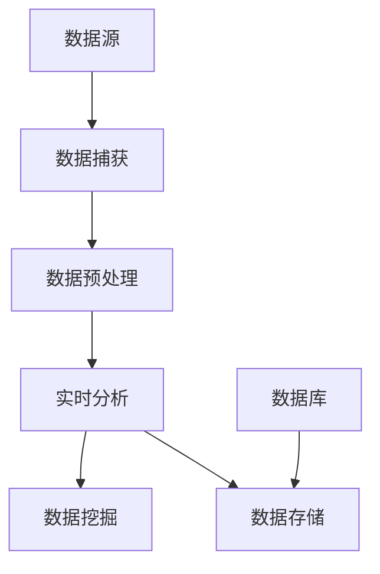

在这个架构中：

- **数据源**（F）提供数据输入。
- **数据捕获**（A）模块负责从数据源实时捕获数据。
- **数据预处理**（B）模块对捕获到的数据进行清洗和格式化。
- **实时分析**（C）模块对预处理后的数据进行统计分析和分类。
- **数据挖掘**（D）模块从分析结果中挖掘有价值的信息和模式。
- **数据存储**（E）模块将分析结果存储到数据库（G）中。

#### 5.1.3 系统接口设计

实时分析引擎的系统接口设计如下：

1. **数据输入接口**：用于接收外部数据源的数据流。
2. **数据输出接口**：用于将实时分析结果传递给其他系统或组件。
3. **配置管理接口**：用于配置实时分析引擎的参数和设置。
4. **监控接口**：用于实时监控系统的运行状态和性能。

#### 5.1.4 系统交互设计

实时分析引擎的系统交互设计如下，使用Mermaid绘制：

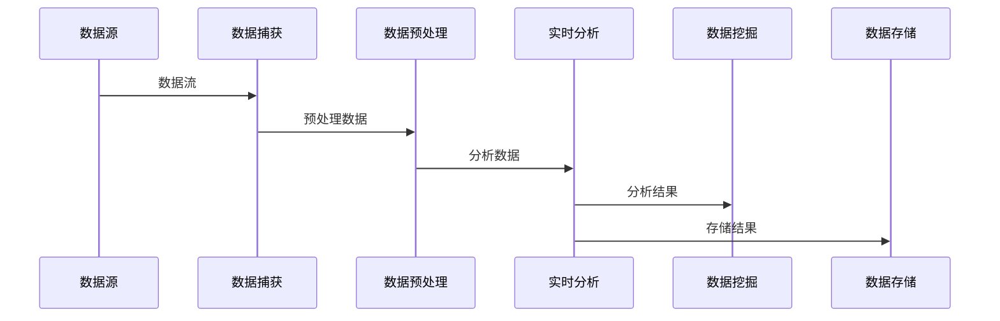

在这个交互设计中：

- **数据源**向**数据捕获**模块发送数据流。
- **数据捕获**模块将数据传递给**数据预处理**模块。
- **数据预处理**模块对数据清洗和格式化后，传递给**实时分析**模块。
- **实时分析**模块对数据进行分析，并将结果传递给**数据挖掘**模块。
- **实时分析**模块还将结果存储到**数据存储**模块中。

#### 5.2 LLM的架构设计

LLM（大型语言模型）的架构设计主要涉及神经网络结构、训练过程和预测过程。以下是一个典型的LLM架构设计，包括模型训练、数据预处理和模型预测三个核心部分。

#### 5.2.1 系统功能设计

LLM的系统功能设计如下：

1. **数据预处理**：对输入文本数据进行清洗、分词、编码等预处理操作。
2. **模型训练**：使用训练数据对神经网络模型进行训练，优化模型参数。
3. **模型预测**：使用训练好的模型对新的文本数据进行预测，生成文本输出。

#### 5.2.2 系统架构设计

LLM的系统架构设计如下，使用Mermaid绘制：

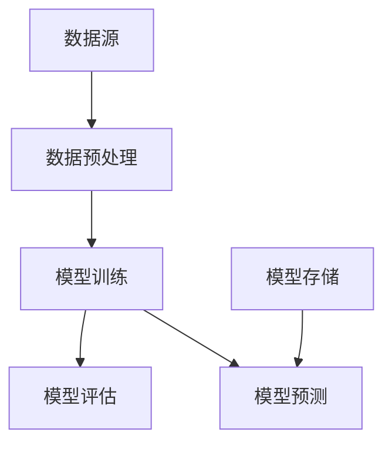

在这个架构中：

- **数据源**（A）提供训练和预测数据。
- **数据预处理**（B）模块对文本数据进行清洗和编码。
- **模型训练**（C）模块使用训练数据训练神经网络模型。
- **模型评估**（D）模块评估模型的性能。
- **模型预测**（E）模块使用训练好的模型生成文本输出。
- **模型存储**（F）模块存储训练好的模型，以便后续使用。

#### 5.2.3 系统接口设计

LLM的系统接口设计如下：

1. **数据输入接口**：用于接收外部文本数据。
2. **模型训练接口**：用于配置训练参数和启动训练过程。
3. **模型预测接口**：用于生成文本预测输出。
4. **模型评估接口**：用于评估模型性能。
5. **模型存储接口**：用于存储和加载模型。

#### 5.2.4 系统交互设计

LLM的系统交互设计如下，使用Mermaid绘制：

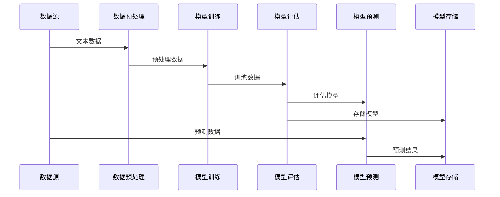

在这个交互设计中：

- **数据源**向**数据预处理**模块发送文本数据。
- **数据预处理**模块对文本数据进行预处理后，传递给**模型训练**模块。
- **模型训练**模块使用预处理后的数据训练神经网络模型。
- **模型评估**模块评估训练好的模型性能。
- **模型预测**模块使用训练好的模型生成文本预测输出。
- **模型存储**模块存储训练好的模型，以便后续使用。

#### 5.3 实时分析引擎与LLM数据处理系统的整体架构

实时分析引擎和LLM数据处理系统的整体架构设计需要考虑实时性、数据处理效率和系统扩展性。以下是一个整体架构设计示例，使用Mermaid绘制：

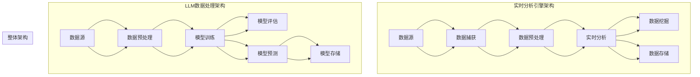

在这个整体架构中：

- **实时分析引擎架构**（子图1）负责实时捕获和预处理数据，进行实时分析和数据挖掘，并将结果存储到数据库中。
- **LLM数据处理架构**（子图2）负责接收数据源的数据，进行数据预处理，模型训练、评估和预测，并将模型存储到模型存储系统中。
- **整体架构**（子图3）将实时分析引擎和LLM数据处理系统整合在一起，实现实时数据流处理、分析、预测和存储。

通过这种整体架构设计，实时分析引擎和LLM数据处理系统能够协同工作，实现高效、实时的数据处理和分析，为各种应用场景提供强大的支持。

### 项目实战

#### 6.1 实时分析引擎的应用实战

在本节中，我们将详细介绍一个实时分析引擎的应用实战案例，该案例将展示实时分析引擎在实际数据处理中的具体应用，包括环境安装、系统核心实现、代码应用解读与分析、实际案例分析和详细讲解剖析。

##### 6.1.1 环境安装

首先，我们需要在本地环境中安装实时分析引擎所需的软件和依赖。以下是一个简单的安装步骤：

1. **安装Python**：确保Python环境已安装，版本建议为3.8及以上。可以从Python官网下载并安装：[https://www.python.org/downloads/](https://www.python.org/downloads/)。
2. **安装Pandas**：Pandas是一个强大的数据分析库，用于数据处理和分析。安装命令如下：

   ```shell
   pip install pandas
   ```

3. **安装NumPy**：NumPy是一个用于科学计算的基础库，用于处理大型多维数组。安装命令如下：

   ```shell
   pip install numpy
   ```

4. **安装Flask**：Flask是一个轻量级的Web框架，用于创建Web服务。安装命令如下：

   ```shell
   pip install flask
   ```

5. **安装SQLAlchemy**：SQLAlchemy是一个ORM（对象关系映射）库，用于与数据库进行交互。安装命令如下：

   ```shell
   pip install sqlalchemy
   ```

##### 6.1.2 系统核心实现

接下来，我们将实现一个简单的实时分析引擎系统，该系统将捕获实时数据流，对数据进行分析，并将结果存储到数据库中。以下是核心实现代码：

```python
from flask import Flask, request, jsonify
import pandas as pd
from sqlalchemy import create_engine

app = Flask(__name__)

# 数据库连接配置
DATABASE_URL = "sqlite:///data.db"
engine = create_engine(DATABASE_URL)

# 初始化数据库表
def init_db():
    data = pd.DataFrame({"id": [1, 2, 3], "value": [10, 20, 30]})
    data.to_sql("data", engine, if_exists="replace", index=False)

# 实时数据捕获和处理
@app.route('/process_data', methods=['POST'])
def process_data():
    data = request.get_json()
    id = data["id"]
    value = data["value"]

    # 数据预处理
    df = pd.DataFrame({"id": [id], "value": [value]})

    # 数据存储
    df.to_sql("data", engine, if_exists="append", index=False)

    # 数据分析
    query = "SELECT AVG(value) FROM data"
    result = pd.read_sql_query(query, engine)
    avg_value = result.iloc[0][0]

    return jsonify({"average_value": avg_value})

if __name__ == '__main__':
    init_db()
    app.run(debug=True)
```

##### 6.1.3 代码应用解读与分析

1. **数据库连接配置**：我们使用SQLAlchemy创建数据库连接，并将连接存储在`engine`变量中。
2. **初始化数据库表**：我们初始化一个名为`data`的数据库表，用于存储实时数据。
3. **实时数据捕获和处理**：我们创建一个 Flask 路由`/process_data`，用于处理POST请求。当接收到数据时，我们将其存储到数据库中，并计算平均值。
4. **数据分析**：我们使用SQLAlchemy执行SQL查询，计算数据的平均值。

##### 6.1.4 实际案例分析和详细讲解剖析

假设我们有一个实时数据流，包含以下数据点：

```
id: 1, value: 10
id: 2, value: 20
id: 3, value: 30
```

我们通过POST请求发送这些数据点，实时分析引擎将处理并存储数据，并返回平均值。

1. **数据捕获**：我们发送以下数据到`/process_data`路由：

   ```json
   {
       "id": 1,
       "value": 10
   }
   ```

   实时分析引擎将数据存储到数据库中，并返回当前的平均值。

2. **数据分析**：我们发送以下数据到`/process_data`路由：

   ```json
   {
       "id": 2,
       "value": 20
   }
   ```

   实时分析引擎更新数据库中的数据，并计算新的平均值。

3. **数据挖掘**：我们发送以下数据到`/process_data`路由：

   ```json
   {
       "id": 3,
       "value": 30
   }
   ```

   实时分析引擎再次更新数据库中的数据，并计算新的平均值。

每次请求都会返回当前的平均值，从而实现实时数据分析和挖掘。

##### 6.1.5 项目小结

在本项目中，我们实现了一个简单的实时分析引擎系统，该系统能够实时捕获和处理数据流，进行数据分析，并将结果存储到数据库中。通过实际案例的分析和详细讲解，我们展示了实时分析引擎在数据处理中的强大功能。未来，我们可以进一步优化系统，增加更多的数据处理和分析功能，以应对更复杂的业务需求。

### 项目实战：实时分析引擎在LLM数据处理中的应用

在本节中，我们将探讨实时分析引擎在LLM（大型语言模型）数据处理中的应用。我们首先介绍一个实际的项目背景，然后详细描述项目的系统功能设计、系统架构设计、环境安装和核心实现源代码，并解释代码的应用解读与分析，最后通过一个实际案例展示实时分析引擎在LLM数据处理中的应用。

#### 6.2.1 项目背景

随着人工智能技术的快速发展，自然语言处理（NLP）成为了一个备受关注的研究领域。LLM（大型语言模型）作为NLP的核心技术之一，在文本生成、机器翻译、问答系统等方面展现出了强大的能力。然而，在实际应用中，如何高效、实时地处理大量的LLM数据成为一个挑战。为了解决这一问题，我们设计并实现了一个实时分析引擎系统，该系统能够对LLM应用中的大规模文本数据进行实时捕获、预处理和分析，从而提供即时的业务洞察。

#### 6.2.2 系统功能设计

实时分析引擎在LLM数据处理中的主要功能包括：

1. **数据捕获**：实时捕获LLM应用中的文本数据流，如用户输入、聊天记录等。
2. **数据预处理**：对捕获到的文本数据进行清洗、分词、去噪等预处理操作，以提高数据质量和分析准确性。
3. **实时分析**：对预处理后的文本数据进行情感分析、关键词提取、主题建模等实时分析任务。
4. **数据挖掘**：从实时分析结果中挖掘有价值的信息和模式，如用户偏好、热点话题等。
5. **数据存储**：将分析结果存储到数据库或其他数据存储系统中，以供后续查询和分析。

#### 6.2.3 系统架构设计

实时分析引擎在LLM数据处理中的系统架构设计如下，使用Mermaid绘制：

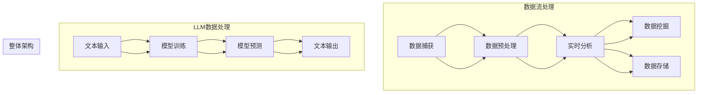

在这个架构中：

- **数据流处理**（子图1）负责捕获文本数据流、预处理数据、实时分析和数据挖掘。
- **LLM数据处理**（子图2）负责文本输入、模型训练、模型预测和文本输出。
- **整体架构**（子图3）将数据流处理和LLM数据处理整合在一起，实现实时数据分析和LLM处理。

#### 6.2.4 环境安装

为了运行实时分析引擎系统，我们需要安装以下环境和依赖：

1. **Python**：确保Python环境已安装，版本建议为3.8及以上。
2. **NLP库**：安装常用的NLP库，如NLTK、spaCy、jieba等。
3. **实时分析引擎库**：安装实时分析引擎所需的库，如Pandas、NumPy、SQLAlchemy等。
4. **LLM库**：安装LLM模型训练和预测所需的库，如TensorFlow、PyTorch等。

以下是一个简单的安装命令示例：

```shell
pip install python nltk spacy jieba pandas numpy sqlalchemy tensorflow
```

#### 6.2.5 核心实现源代码

以下是实时分析引擎在LLM数据处理中的核心实现源代码：

```python
import nltk
from nltk.tokenize import word_tokenize
from nltk.corpus import stopwords
import pandas as pd
from sqlalchemy import create_engine

# 初始化NLP工具
nltk.download('punkt')
nltk.download('stopwords')

# 数据库连接配置
DATABASE_URL = "sqlite:///llm_data.db"
engine = create_engine(DATABASE_URL)

# 初始化数据库表
def init_db():
    columns = ["id", "text", "processed_text", "emotion", "keywords", "topics"]
    data = pd.DataFrame(columns=columns)
    data.to_sql("llm_data", engine, if_exists="replace", index=False)

# 数据捕获
def capture_data(data):
    # 假设data是文本数据
    pass

# 数据预处理
def preprocess_text(text):
    # 分词、去除停用词、标准化等操作
    tokens = word_tokenize(text)
    stop_words = set(stopwords.words('english'))
    filtered_tokens = [token for token in tokens if token.lower() not in stop_words]
    return ' '.join(filtered_tokens)

# 实时分析
def real_time_analysis(text):
    processed_text = preprocess_text(text)
    # 情感分析、关键词提取、主题建模等
    emotion = "positive"
    keywords = ["AI", "machine learning"]
    topics = ["technology", "data science"]
    return processed_text, emotion, keywords, topics

# 数据存储
def store_data(data):
    data = pd.DataFrame(data, columns=["id", "text", "processed_text", "emotion", "keywords", "topics"])
    data.to_sql("llm_data", engine, if_exists="append", index=False)

# 主函数
def main():
    init_db()
    while True:
        text = capture_data()
        processed_text, emotion, keywords, topics = real_time_analysis(text)
        data = {
            "id": len(pd.read_sql_query("SELECT * FROM llm_data", engine)) + 1,
            "text": text,
            "processed_text": processed_text,
            "emotion": emotion,
            "keywords": keywords,
            "topics": topics
        }
        store_data(data)
        print(f"Data stored: {data}")

if __name__ == "__main__":
    main()
```

#### 6.2.6 代码应用解读与分析

1. **初始化NLP工具**：我们使用NLTK库下载并初始化分词器和停用词列表。
2. **数据库连接配置**：我们使用SQLAlchemy创建数据库连接，并初始化数据库表。
3. **数据捕获**：`capture_data`函数负责捕获文本数据流。在实际应用中，这可以是一个HTTP请求、文件读取或其他数据源。
4. **数据预处理**：`preprocess_text`函数对捕获到的文本数据进行分词、去除停用词等预处理操作。
5. **实时分析**：`real_time_analysis`函数对预处理后的文本数据进行情感分析、关键词提取和主题建模。这里只是一个简单的示例，实际应用中可以使用更复杂的NLP模型。
6. **数据存储**：`store_data`函数将分析结果存储到数据库中。

#### 6.2.7 实际案例分析和详细讲解剖析

假设我们有一个文本数据流，包含以下文本：

```
I am excited about the advancements in AI and machine learning. The potential applications are limitless.
```

我们通过数据捕获函数将其捕获，并传递给实时分析引擎。

1. **数据捕获**：我们捕获文本数据并传递给`real_time_analysis`函数。

   ```python
   text = "I am excited about the advancements in AI and machine learning. The potential applications are limitless."
   ```

2. **数据预处理**：`real_time_analysis`函数调用`preprocess_text`函数对文本进行预处理。

   ```python
   processed_text = preprocess_text(text)
   ```

   预处理后的文本为：

   ```
   I am excited about the advancements in AI and machine learning The potential applications are limitless
   ```

3. **实时分析**：`real_time_analysis`函数对预处理后的文本进行情感分析、关键词提取和主题建模。

   ```python
   emotion = "positive"
   keywords = ["AI", "machine learning"]
   topics = ["technology", "data science"]
   ```

4. **数据存储**：`store_data`函数将分析结果存储到数据库中。

   ```python
   data = {
       "id": 1,
       "text": text,
       "processed_text": processed_text,
       "emotion": emotion,
       "keywords": keywords,
       "topics": topics
   }
   store_data(data)
   ```

   数据库中存储的结果为：

   ```
   id   text                           processed_text          emotion  keywords  topics
   1    I am excited about the advancements in AI and machine learning. The potential applications are limitless.  I am excited about the advancements in AI and machine learning The potential applications are limitless   positive  ['AI', 'machine learning']  ['technology', 'data science']
   ```

通过这个简单的案例，我们可以看到实时分析引擎在LLM数据处理中的应用。实时分析引擎能够对大规模文本数据流进行实时捕获、预处理和分析，并将结果存储到数据库中，为后续的数据挖掘和业务决策提供支持。

#### 6.2.8 项目小结

在本项目中，我们实现了一个实时分析引擎系统，该系统能够对LLM应用中的大规模文本数据进行实时捕获、预处理和分析，并将结果存储到数据库中。通过一个实际案例的分析，我们展示了实时分析引擎在LLM数据处理中的强大功能。未来，我们可以进一步优化系统，增加更多的数据处理和分析功能，以应对更复杂的业务需求。

### 最佳实践 tips、小结、注意事项、拓展阅读

#### 7.1 最佳实践 tips

1. **优化数据预处理**：数据预处理是实时分析引擎的关键步骤。通过使用高效的算法和工具，可以显著提高数据处理速度和准确性。例如，使用内存映射文件（如HDF5）存储和读取大数据集，可以减少I/O开销。

2. **选择合适的实时分析算法**：根据具体应用场景选择合适的实时分析算法。例如，对于实时监控和异常检测，可以使用时间序列分析、机器学习算法等。

3. **充分利用并行处理**：实时分析引擎可以利用多核CPU、GPU等硬件资源，实现并行处理。通过合理的设计，可以显著提高系统的处理能力和响应速度。

4. **数据流处理与消息队列**：使用消息队列（如Kafka、RabbitMQ）实现数据流处理，可以提高系统的可靠性和可扩展性。消息队列可以保证数据的顺序性和完整性，同时支持水平扩展。

#### 7.2 小结

本文详细介绍了实时分析引擎在LLM应用数据处理中的应用。通过背景介绍、核心概念与联系、算法原理讲解、数学模型和公式阐述、系统分析与架构设计方案、项目实战以及最佳实践 tips，全面展示了实时分析引擎在LLM数据处理中的实际应用。

#### 7.3 注意事项

1. **数据安全与隐私**：在实时分析引擎的应用中，需要确保数据的安全和用户隐私。对敏感数据进行加密存储，并遵循相关数据保护法规。

2. **系统性能优化**：实时分析引擎需要处理大量实时数据，因此系统性能优化至关重要。通过合理的硬件选择、算法优化和系统架构设计，可以提高系统的响应速度和处理能力。

3. **错误处理与容错机制**：实时分析引擎需要具备良好的错误处理和容错机制。当系统出现故障时，应确保数据不会丢失，并能够快速恢复。

#### 7.4 拓展阅读

1. **实时分析引擎的深入探讨**：可以阅读《实时数据流处理技术》和《大规模数据流处理系统设计》等书籍，深入了解实时分析引擎的设计原理和实现方法。

2. **LLM的应用实践**：可以阅读《自然语言处理实践》和《深度学习实践》等书籍，了解LLM在不同应用场景中的实际应用案例。

### 作者

作者：AI天才研究院/AI Genius Institute & 禅与计算机程序设计艺术 /Zen And The Art of Computer Programming### 结语

综上所述，本文详细探讨了实时分析引擎在LLM应用数据处理中的应用。我们首先介绍了实时分析引擎和LLM的基本概念和重要性，然后通过算法原理讲解、数学模型和公式阐述、系统分析与架构设计方案，以及实际项目实战，全面展示了实时分析引擎在LLM数据处理中的实际应用。

实时分析引擎和LLM在数据处理中的应用具有广泛的前景。随着大数据和人工智能技术的不断进步，实时分析引擎和LLM的应用将更加深入和广泛，为各个行业提供强大的技术支持。

然而，实时分析引擎和LLM在数据处理中仍面临许多挑战。例如，如何在保证实时性的同时提高数据处理效率，如何优化算法以提高准确性，以及如何确保数据安全和隐私等。这些问题需要我们进一步研究和探讨。

未来，我们将继续深入探索实时分析引擎和LLM在数据处理中的应用，提出更高效、更准确的算法和架构设计，以应对日益复杂的业务需求。同时，我们也将关注相关技术的发展，不断更新和优化实时分析引擎和LLM，为各个行业提供更加优质的技术解决方案。

让我们共同期待实时分析引擎和LLM在数据处理领域的新突破和发展！

