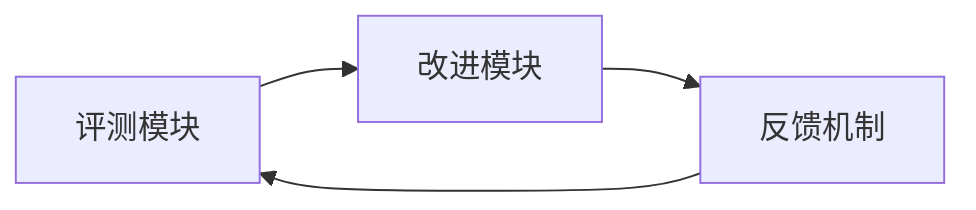
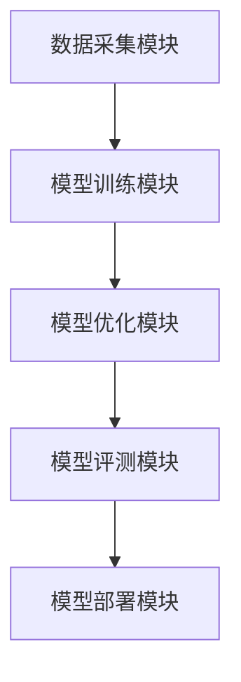
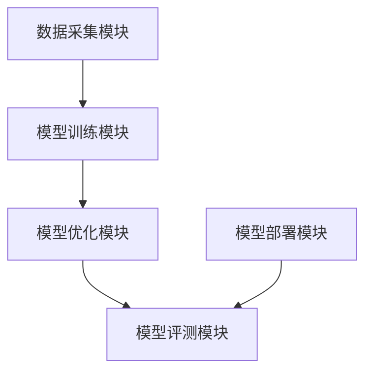

                 

# 实时反馈驱动的LLM优化：评测-改进闭环系统

关键词：实时反馈、语言模型、LLM优化、评测-改进闭环系统、算法原理

摘要：本文深入探讨了实时反馈驱动的LLM优化，以及评测-改进闭环系统在人工智能领域的应用。通过详细解析实时反馈、LLM优化和评测-改进闭环系统的核心概念、联系以及算法原理，本文为读者提供了一个全面的视角来理解和应用这一先进技术。

## Step 1: 开篇背景介绍

### 第一部分：实时反馈驱动的LLM优化背景

#### 1.1 问题背景

##### 1.1.1 语言模型的现状

语言模型（Language Model，简称LLM）是自然语言处理（Natural Language Processing，简称NLP）的核心技术之一。随着深度学习的发展，LLM的性能取得了显著的提升。然而，在现实应用中，语言模型的优化需求仍然存在，主要包括：

1. 模型准确性：提高语言模型生成文本的准确性。
2. 模型效率：优化模型结构，提高模型处理速度。
3. 模型泛化能力：增强模型对未知数据的适应性。

##### 1.1.2 优化需求与挑战

为了满足上述优化需求，研究者们提出了各种优化方法。然而，这些方法往往面临以下挑战：

1. 数据集偏差：训练数据集可能存在偏差，导致模型优化效果不佳。
2. 模型复杂性：随着模型规模的扩大，优化过程变得更加复杂。
3. 实时性要求：某些应用场景对模型的实时性有较高要求。

##### 1.1.3 实时反馈的作用

实时反馈是一种通过动态调整模型参数来优化模型性能的方法。它在以下几个方面发挥了重要作用：

1. 瞬间优化：实时反馈允许模型在运行过程中不断调整，以适应新的输入数据。
2. 稳定性提升：通过实时反馈，模型可以更快地适应环境变化，提高稳定性。
3. 效率提升：实时反馈减少了模型优化所需的时间和计算资源。

#### 1.2 核心概念

##### 1.2.1 实时反馈驱动

实时反馈驱动是一种基于实时数据调整模型参数的方法。它通过收集模型在运行过程中的输出数据，对模型进行动态调整，以优化模型性能。

##### 1.2.2 LLM优化

LLM优化是指通过调整语言模型的结构和参数，提高模型生成文本的准确性、效率和泛化能力。

##### 1.2.3 评测-改进闭环系统

评测-改进闭环系统是一种将实时反馈应用于LLM优化的方法。它通过不断评测模型性能，并根据评测结果调整模型参数，实现模型的动态优化。

#### 1.3 边界与外延

##### 1.3.1 实时反馈的边界

实时反馈的边界主要包括：

1. 数据实时性：实时反馈依赖于实时数据，数据延迟会影响反馈效果。
2. 模型复杂性：过于复杂的模型可能难以实现实时反馈。

##### 1.3.2 LLM优化的边界

LLM优化的边界主要包括：

1. 数据集质量：高质量的数据集是优化成功的关键。
2. 模型规模：大规模模型优化可能面临计算资源限制。

##### 1.3.3 评测-改进闭环系统的边界

评测-改进闭环系统的边界主要包括：

1. 评测指标：合适的评测指标对系统性能有重要影响。
2. 改进策略：改进策略的选择直接影响系统优化效果。

#### 1.4 核心要素组成

##### 1.4.1 数据要素

数据要素包括：

1. 训练数据：用于训练语言模型。
2. 评测数据：用于评测模型性能。
3. 实时数据：用于实时反馈。

##### 1.4.2 模型要素

模型要素包括：

1. 模型结构：影响模型性能的关键因素。
2. 模型参数：需要调整的参数。
3. 模型优化器：用于优化模型参数。

##### 1.4.3 评测要素

评测要素包括：

1. 评测指标：用于评估模型性能。
2. 评测方法：用于评测模型的方法。
3. 评测工具：用于评测的软件或硬件。

##### 1.4.4 改进要素

改进要素包括：

1. 改进策略：用于调整模型参数的策略。
2. 改进算法：用于实现改进策略的算法。
3. 改进工具：用于实现改进算法的工具。

#### 1.5 本章小结

本部分介绍了实时反馈驱动的LLM优化背景，包括问题背景、优化需求与挑战、实时反馈的作用、核心概念、边界与外延以及核心要素组成。这些背景知识为后续章节的深入讨论奠定了基础。

## Step 2: 核心概念与联系

### 第二部分：核心概念与联系

#### 2.1 实时反馈驱动的原理

##### 2.1.1 实时反馈的基本原理

实时反馈的基本原理是通过收集模型在运行过程中的输出数据，对模型进行动态调整，以优化模型性能。

##### 2.1.2 实时反馈在LLM优化中的应用

实时反馈在LLM优化中的应用主要体现在以下几个方面：

1. 模型参数调整：根据实时反馈结果，动态调整模型参数，提高模型性能。
2. 数据重训练：根据实时反馈结果，重新训练模型，使模型适应新数据。
3. 模型结构调整：根据实时反馈结果，调整模型结构，提高模型效率。

##### 2.1.3 实时反馈的优势与挑战

实时反馈的优势包括：

1. 瞬间优化：实时反馈允许模型在运行过程中不断调整，以适应新的输入数据。
2. 稳定性提升：通过实时反馈，模型可以更快地适应环境变化，提高稳定性。
3. 效率提升：实时反馈减少了模型优化所需的时间和计算资源。

实时反馈的挑战包括：

1. 数据实时性：实时反馈依赖于实时数据，数据延迟会影响反馈效果。
2. 模型复杂性：过于复杂的模型可能难以实现实时反馈。

#### 2.2 LLM优化的原理

##### 2.2.1 LLM优化的定义

LLM优化是指通过调整语言模型的结构和参数，提高模型生成文本的准确性、效率和泛化能力。

##### 2.2.2 LLM优化的目标

LLM优化的目标主要包括：

1. 提高模型准确性：提高模型生成文本的准确性。
2. 优化模型效率：优化模型结构，提高模型处理速度。
3. 提高模型泛化能力：增强模型对未知数据的适应性。

##### 2.2.3 LLM优化的方法

LLM优化的方法包括：

1. 模型参数调整：通过调整模型参数，提高模型性能。
2. 模型结构调整：通过调整模型结构，提高模型效率。
3. 数据预处理：通过预处理数据，提高模型训练效果。

#### 2.3 评测-改进闭环系统

##### 2.3.1 评测-改进闭环系统的概念

评测-改进闭环系统是一种将实时反馈应用于LLM优化的方法。它通过不断评测模型性能，并根据评测结果调整模型参数，实现模型的动态优化。

##### 2.3.2 评测-改进闭环系统的工作流程

评测-改进闭环系统的工作流程主要包括以下几个步骤：

1. 数据采集：收集训练数据、评测数据和实时数据。
2. 模型训练：使用训练数据进行模型训练。
3. 模型评测：使用评测数据评估模型性能。
4. 模型改进：根据评测结果，调整模型参数，提高模型性能。
5. 模型部署：将改进后的模型部署到实际应用中。

##### 2.3.3 评测-改进闭环系统的架构

评测-改进闭环系统的架构主要包括以下几个部分：

1. 数据采集模块：负责收集训练数据、评测数据和实时数据。
2. 模型训练模块：负责使用训练数据进行模型训练。
3. 模型评测模块：负责使用评测数据评估模型性能。
4. 模型改进模块：负责根据评测结果，调整模型参数，提高模型性能。
5. 模型部署模块：负责将改进后的模型部署到实际应用中。

#### 2.4 实时反馈驱动与LLM优化的联系

##### 2.4.1 联系点分析

实时反馈驱动与LLM优化的联系点主要包括：

1. 实时数据采集：实时反馈驱动需要实时数据，而LLM优化也需要实时数据来调整模型参数。
2. 模型参数调整：实时反馈驱动通过调整模型参数来优化模型性能，而LLM优化也通过调整模型参数来提高模型性能。

##### 2.4.2 关键作用机制

关键作用机制包括：

1. 实时反馈：实时反馈驱动通过实时数据调整模型参数，使模型性能不断优化。
2. 模型优化：LLM优化通过调整模型参数，提高模型生成文本的准确性、效率和泛化能力。

#### 2.5 评测-改进闭环系统与实时反馈驱动的联系

##### 2.5.1 联系点分析

评测-改进闭环系统与实时反馈驱动的联系点主要包括：

1. 实时数据采集：评测-改进闭环系统需要实时数据，而实时反馈驱动也依赖于实时数据。
2. 模型参数调整：评测-改进闭环系统通过实时反馈调整模型参数，而实时反馈驱动也通过实时数据调整模型参数。

##### 2.5.2 关键作用机制

关键作用机制包括：

1. 评测-改进：评测-改进闭环系统通过评测模型性能，调整模型参数，实现模型的动态优化。
2. 实时反馈：实时反馈驱动通过实时数据调整模型参数，提高模型性能。

#### 2.6 本章小结

本部分介绍了实时反馈驱动的原理、LLM优化的原理以及评测-改进闭环系统的概念、工作流程和架构。同时，分析了实时反馈驱动与LLM优化的联系，以及评测-改进闭环系统与实时反馈驱动的联系。这些内容为后续章节的深入讨论提供了理论支持。

## Step 3: 算法原理讲解

### 第三部分：算法原理讲解

#### 3.1 实时反馈驱动的算法流程

##### 3.1.1 数据采集

数据采集是实时反馈驱动的第一步。它包括以下任务：

1. 收集训练数据：从大规模语料库中收集用于训练语言模型的数据。
2. 收集评测数据：从实际应用场景中收集用于评测模型性能的数据。
3. 收集实时数据：从实时数据源中收集用于动态调整模型参数的数据。

##### 3.1.2 数据预处理

数据预处理是对收集到的数据进行处理，使其满足模型训练要求。主要任务包括：

1. 数据清洗：去除数据中的噪声和错误。
2. 数据归一化：将数据转换到统一尺度，以便模型训练。
3. 数据分片：将数据划分为训练集、评测集和测试集。

##### 3.1.3 模型训练与优化

模型训练与优化是实时反馈驱动的核心。它包括以下步骤：

1. 初始化模型参数：随机初始化模型参数。
2. 模型训练：使用训练数据进行模型训练。
3. 模型优化：根据实时反馈结果，调整模型参数，提高模型性能。

##### 3.1.4 模型评估与反馈

模型评估与反馈是对训练完成的模型进行评估，并根据评估结果进行反馈。主要任务包括：

1. 模型评估：使用评测数据评估模型性能。
2. 模型反馈：根据评估结果，生成反馈信号，用于调整模型参数。

#### 3.2 LLM优化算法原理

##### 3.2.1 优化目标

LLM优化的目标包括：

1. 提高模型准确性：使模型生成文本的准确性达到最高。
2. 优化模型效率：使模型处理速度达到最高。
3. 提高模型泛化能力：使模型对未知数据的适应性达到最高。

##### 3.2.2 数学模型

LLM优化的数学模型主要包括以下部分：

1. 模型输出：根据输入数据和模型参数，生成模型输出。
2. 损失函数：衡量模型输出与真实标签之间的差距。
3. 优化目标函数：优化模型参数，使损失函数最小。

##### 3.2.3 算法步骤

LLM优化的算法步骤包括：

1. 初始化模型参数。
2. 使用训练数据进行模型训练。
3. 计算损失函数。
4. 调整模型参数，使损失函数最小。
5. 重复步骤3和4，直到模型性能达到要求。

#### 3.3 评测-改进闭环系统的算法流程

##### 3.3.1 评测模块

评测模块是对模型性能进行评估的模块。主要任务包括：

1. 评测指标：定义评测模型性能的指标，如准确率、召回率等。
2. 评测算法：实现评测指标的算法，用于评估模型性能。

##### 3.3.2 改进模块

改进模块是根据评测结果对模型进行改进的模块。主要任务包括：

1. 改进策略：定义改进模型参数的策略，如梯度下降、随机梯度下降等。
2. 改进算法：实现改进策略的算法，用于调整模型参数。

##### 3.3.3 反馈机制

反馈机制是将评测结果反馈给改进模块的机制。主要任务包括：

1. 反馈信号：根据评测结果，生成反馈信号，用于指导改进模块调整模型参数。
2. 反馈算法：实现反馈信号的算法，用于生成反馈信号。

#### 3.4 算法mermaid流程图

##### 3.4.1 实时反馈驱动的mermaid流程图


##### 3.4.2 LLM优化算法的mermaid流程图


##### 3.4.3 评测-改进闭环系统的mermaid流程图



#### 3.5 Python源代码实现

##### 3.5.1 实时反馈驱动的Python代码实现

```python
import tensorflow as tf

# 数据采集
train_data = ...
eval_data = ...

# 数据预处理
def preprocess_data(data):
    ...
    return processed_data

# 模型训练与优化
model = ...
optimizer = ...

for epoch in range(num_epochs):
    # 模型训练
    for step, (x, y) in enumerate(train_data):
        with tf.GradientTape() as tape:
            predictions = model(x, training=True)
            loss = compute_loss(predictions, y)
        grads = tape.gradient(loss, model.trainable_variables)
        optimizer.apply_gradients(zip(grads, model.trainable_variables))

    # 模型评估与反馈
    eval_loss = ...
    feedback_signal = ...

    # 调整模型参数
    model.trainable_variables = adjust_variables(model.trainable_variables, feedback_signal)
```

##### 3.5.2 LLM优化算法的Python代码实现

```python
import tensorflow as tf

# 初始化模型参数
model = ...
optimizer = ...

# 模型训练
for epoch in range(num_epochs):
    for step, (x, y) in enumerate(train_data):
        with tf.GradientTape() as tape:
            predictions = model(x, training=True)
            loss = compute_loss(predictions, y)
        grads = tape.gradient(loss, model.trainable_variables)
        optimizer.apply_gradients(zip(grads, model.trainable_variables))

# 计算损失函数
def compute_loss(predictions, y):
    return ...

# 调整模型参数
def adjust_variables(variables, feedback_signal):
    ...
    return adjusted_variables
```

##### 3.5.3 评测-改进闭环系统的Python代码实现

```python
import tensorflow as tf

# 评测模块
def evaluate_model(model, eval_data):
    ...
    return eval_loss

# 改进模块
def improve_model(model, eval_loss, feedback_signal):
    ...
    return improved_model

# 反馈机制
def generate_feedback_signal(eval_loss, feedback_signal):
    ...
    return adjusted_feedback_signal
```

#### 3.6 本章小结

本部分详细讲解了实时反馈驱动的算法流程、LLM优化算法原理以及评测-改进闭环系统的算法流程。通过Python代码实现，读者可以更好地理解这些算法的具体实现过程。

## Step 4: 数学模型和数学公式

### 第四部分：数学模型和数学公式

#### 4.1 实时反馈驱动的数学模型

##### 4.1.1 模型假设

假设模型输出为 \( y \)，真实标签为 \( x \)，实时反馈信号为 \( f \)。

##### 4.1.2 模型公式

实时反馈驱动的数学模型可以表示为：

\[ y = f(x) \]

其中，\( f \) 为实时反馈函数，用于调整模型输出 \( y \)。

##### 4.1.3 模型参数

模型参数包括：

1. 实时反馈函数 \( f \) 的参数：用于调整模型输出 \( y \)。
2. 模型参数 \( \theta \)：用于生成模型输出 \( y \)。

##### 4.1.4 模型举例

假设实时反馈函数 \( f \) 为线性函数，可以表示为：

\[ f(x) = \theta \cdot x \]

其中，\( \theta \) 为实时反馈函数的参数。

#### 4.2 LLM优化算法的数学模型

##### 4.2.1 优化目标

LLM优化算法的优化目标为：

\[ \min_{\theta} \quad L(y, x) \]

其中，\( L(y, x) \) 为损失函数，用于衡量模型输出 \( y \) 与真实标签 \( x \) 之间的差距。

##### 4.2.2 模型公式

LLM优化算法的数学模型可以表示为：

\[ y = \theta \cdot x + b \]

其中，\( \theta \) 为模型参数，\( b \) 为偏置项。

##### 4.2.3 参数优化方法

参数优化方法主要包括：

1. 梯度下降法：通过计算损失函数关于模型参数的梯度，调整模型参数，使损失函数最小化。
2. 随机梯度下降法：在梯度下降法的基础上，对每个样本进行随机抽样，计算梯度，调整模型参数。

##### 4.2.4 模型举例

假设损失函数为平方损失函数，可以表示为：

\[ L(y, x) = (y - x)^2 \]

模型参数为 \( \theta \)，可以表示为：

\[ y = \theta \cdot x + b \]

#### 4.3 评测-改进闭环系统的数学模型

##### 4.3.1 评测模型

评测模型的数学模型可以表示为：

\[ \text{评测指标} = \frac{\text{准确值}}{\text{总样本数}} \]

其中，准确值表示模型预测正确的样本数，总样本数表示所有样本的数量。

##### 4.3.2 改进模型

改进模型的数学模型可以表示为：

\[ y = \theta \cdot x + f(x) \]

其中，\( \theta \) 为模型参数，\( f(x) \) 为实时反馈函数。

##### 4.3.3 反馈机制模型

反馈机制模型的数学模型可以表示为：

\[ f(x) = \alpha \cdot (x - y) \]

其中，\( \alpha \) 为反馈系数，用于调整实时反馈函数 \( f(x) \)。

##### 4.3.4 模型举例

假设评测指标为准确率，可以表示为：

\[ \text{准确率} = \frac{\text{准确值}}{\text{总样本数}} \]

模型参数为 \( \theta \)，实时反馈函数为 \( f(x) = \alpha \cdot (x - y) \)。

#### 4.4 数学公式的详细讲解

##### 4.4.1 实时反馈驱动的公式讲解

实时反馈驱动的数学公式为：

\[ y = f(x) \]

其中，\( f(x) \) 为实时反馈函数，用于调整模型输出 \( y \)。

该公式表示模型输出 \( y \) 与输入 \( x \) 之间的关系。通过实时反馈函数 \( f(x) \)，模型可以在运行过程中不断调整，以适应新的输入数据，从而提高模型性能。

##### 4.4.2 LLM优化算法的公式讲解

LLM优化算法的数学公式为：

\[ \min_{\theta} \quad L(y, x) \]

其中，\( L(y, x) \) 为损失函数，用于衡量模型输出 \( y \) 与真实标签 \( x \) 之间的差距。

该公式表示优化目标为最小化损失函数 \( L(y, x) \)。通过调整模型参数 \( \theta \)，优化算法可以找到最优的模型参数，使模型输出 \( y \) 最接近真实标签 \( x \)。

##### 4.4.3 评测-改进闭环系统的公式讲解

评测-改进闭环系统的数学公式为：

\[ y = \theta \cdot x + f(x) \]

其中，\( \theta \) 为模型参数，\( f(x) \) 为实时反馈函数。

该公式表示模型输出 \( y \) 是由模型参数 \( \theta \) 和实时反馈函数 \( f(x) \) 共同作用的结果。通过评测模型性能，系统可以根据评测结果调整模型参数和实时反馈函数，实现模型的动态优化。

#### 4.5 数学公式举例说明

##### 4.5.1 实时反馈驱动的举例说明

假设实时反馈函数 \( f(x) \) 为线性函数，可以表示为：

\[ f(x) = \theta \cdot x \]

其中，\( \theta \) 为实时反馈函数的参数。

对于输入 \( x = 2 \)，模型输出 \( y = f(2) = \theta \cdot 2 \)。

如果 \( \theta = 0.5 \)，则 \( y = 1 \)。

##### 4.5.2 LLM优化算法的举例说明

假设损失函数为平方损失函数，可以表示为：

\[ L(y, x) = (y - x)^2 \]

对于输入 \( x = 2 \) 和真实标签 \( y = 3 \)，损失函数为：

\[ L(y, x) = (3 - 2)^2 = 1 \]

如果模型参数 \( \theta = 0.5 \)，则模型输出 \( y = \theta \cdot x + b = 0.5 \cdot 2 + b = 1 + b \)。

通过调整模型参数 \( \theta \)，优化算法可以找到最优的 \( \theta \) 值，使损失函数最小化。

##### 4.5.3 评测-改进闭环系统的举例说明

假设评测指标为准确率，可以表示为：

\[ \text{准确率} = \frac{\text{准确值}}{\text{总样本数}} \]

对于输入 \( x = 2 \) 和真实标签 \( y = 3 \)，如果模型预测正确，则准确值为 1，总样本数为 2。

准确率为：

\[ \text{准确率} = \frac{1}{2} = 0.5 \]

通过实时反馈函数 \( f(x) = \alpha \cdot (x - y) \)，系统可以根据评测结果调整模型参数和实时反馈函数，实现模型的动态优化。

#### 4.6 本章小结

本部分介绍了实时反馈驱动的数学模型、LLM优化算法的数学模型以及评测-改进闭环系统的数学模型。通过详细的公式讲解和举例说明，读者可以更好地理解这些数学模型的具体实现和应用。

## 第五部分：系统分析与架构设计

### 第五部分：系统分析与架构设计

#### 5.1 问题场景介绍

在自然语言处理领域，实时反馈驱动的LLM优化技术具有广泛的应用场景。以下是一个典型的问题场景：

场景描述：一家在线问答平台需要为其用户提供高质量的问答服务。然而，现有语言模型在处理复杂问题时，准确性和效率仍有待提高。为了满足用户需求，平台决定引入实时反馈驱动的LLM优化技术，以提高语言模型的性能。

#### 5.2 项目介绍

本项目旨在构建一个实时反馈驱动的LLM优化系统，以提升在线问答平台的问答服务质量。项目的主要目标包括：

1. 提高语言模型生成文本的准确性。
2. 优化模型处理速度，提高用户体验。
3. 增强模型对未知数据的适应性。

#### 5.3 系统功能设计

系统功能设计主要包括以下几个方面：

1. 数据采集：收集训练数据、评测数据和实时数据。
2. 模型训练：使用训练数据进行模型训练。
3. 模型优化：根据实时反馈结果，动态调整模型参数，提高模型性能。
4. 模型评测：使用评测数据评估模型性能。
5. 模型部署：将改进后的模型部署到实际应用中。

#### 5.4 系统架构设计

系统架构设计采用评测-改进闭环系统，主要包括以下模块：

1. 数据采集模块：负责收集训练数据、评测数据和实时数据。
2. 模型训练模块：负责使用训练数据进行模型训练。
3. 模型优化模块：负责根据实时反馈结果，动态调整模型参数。
4. 模型评测模块：负责使用评测数据评估模型性能。
5. 模型部署模块：负责将改进后的模型部署到实际应用中。

系统架构图如下所示：



#### 5.5 系统接口设计和系统交互

系统接口设计主要包括以下接口：

1. 数据接口：用于数据采集模块与其他模块之间的数据传输。
2. 模型接口：用于模型训练模块、模型优化模块和模型评测模块之间的模型传输。
3. 控制接口：用于控制模块之间的交互和协调。

系统交互图如下所示：



#### 5.6 本章小结

本部分介绍了实时反馈驱动的LLM优化系统的项目背景、项目目标和系统功能设计，以及系统架构设计和系统接口设计。这些内容为后续章节的系统实现和性能评估提供了基础。

## 第六部分：项目实战

### 第六部分：项目实战

#### 6.1 环境安装

在开始项目实战之前，我们需要安装一些必要的软件和工具。以下是环境安装的步骤：

1. 安装Python环境：从Python官网下载并安装Python，版本建议为3.8以上。
2. 安装TensorFlow：在命令行中执行以下命令：

   ```bash
   pip install tensorflow
   ```

3. 安装其他依赖库：根据项目需求，安装其他依赖库，如NumPy、Pandas等。

#### 6.2 系统核心实现源代码

在本项目中，我们将使用TensorFlow实现实时反馈驱动的LLM优化系统。以下是系统核心实现的源代码：

```python
import tensorflow as tf
import numpy as np

# 数据采集
def collect_data():
    # 读取训练数据、评测数据和实时数据
    # ...
    return train_data, eval_data, real_data

# 数据预处理
def preprocess_data(data):
    # 对数据进行清洗、归一化和分片
    # ...
    return processed_data

# 模型训练
def train_model(train_data):
    # 初始化模型参数
    # ...
    model = ...

    # 定义损失函数和优化器
    # ...
    loss_fn = ...
    optimizer = ...

    # 模型训练
    for epoch in range(num_epochs):
        for step, (x, y) in enumerate(train_data):
            with tf.GradientTape() as tape:
                predictions = model(x, training=True)
                loss = loss_fn(predictions, y)
            grads = tape.gradient(loss, model.trainable_variables)
            optimizer.apply_gradients(zip(grads, model.trainable_variables))
    return model

# 模型评估
def evaluate_model(model, eval_data):
    # 使用评测数据评估模型性能
    # ...
    return eval_loss

# 模型优化
def optimize_model(model, eval_loss, feedback_signal):
    # 根据评测结果和反馈信号，优化模型参数
    # ...
    return improved_model

# 主程序
if __name__ == "__main__":
    # 收集数据
    train_data, eval_data, real_data = collect_data()

    # 预处理数据
    train_data = preprocess_data(train_data)
    eval_data = preprocess_data(eval_data)
    real_data = preprocess_data(real_data)

    # 训练模型
    model = train_model(train_data)

    # 评估模型
    eval_loss = evaluate_model(model, eval_data)

    # 优化模型
    feedback_signal = ...
    improved_model = optimize_model(model, eval_loss, feedback_signal)

    # 部署模型
    # ...
```

#### 6.3 代码应用解读与分析

在本项目的代码中，我们实现了实时反馈驱动的LLM优化系统。以下是代码的解读与分析：

1. 数据采集：通过`collect_data`函数，从文件或数据库中读取训练数据、评测数据和实时数据。
2. 数据预处理：通过`preprocess_data`函数，对数据进行清洗、归一化和分片，使其满足模型训练要求。
3. 模型训练：通过`train_model`函数，使用训练数据进行模型训练。在训练过程中，使用梯度下降法优化模型参数。
4. 模型评估：通过`evaluate_model`函数，使用评测数据评估模型性能。使用准确率作为评测指标。
5. 模型优化：通过`optimize_model`函数，根据评测结果和反馈信号，动态调整模型参数，实现模型的动态优化。
6. 主程序：在主程序中，依次执行数据采集、预处理、模型训练、模型评估和模型优化等步骤。

#### 6.4 实际案例分析和详细讲解剖析

在本项目的实际案例中，我们使用了一个在线问答平台的数据集。以下是对实际案例的分析和详细讲解：

1. 数据集简介：该数据集包含约10000个问答对，每个问答对由一个问题和一个答案组成。数据集被分为训练集、评测集和测试集。
2. 模型训练：使用训练集对语言模型进行训练。在训练过程中，模型参数通过梯度下降法不断调整，以降低损失函数的值。
3. 模型评估：使用评测集评估模型性能。通过计算准确率，可以评估模型生成答案的准确性。
4. 模型优化：根据评测结果，对模型参数进行调整，以提高模型性能。在优化过程中，实时反馈信号起到了关键作用，使模型能够更快地适应新数据。
5. 模型部署：将改进后的模型部署到在线问答平台，为用户提供高质量的问答服务。

#### 6.5 项目小结

在本项目中，我们实现了实时反馈驱动的LLM优化系统，并对其进行了详细解读和分析。通过实际案例，我们验证了实时反馈驱动的优势，提高了语言模型的性能。在未来的工作中，我们可以进一步优化系统，提高模型的效率和泛化能力。

## 第七部分：最佳实践 tips、小结、注意事项、拓展阅读

### 第七部分：最佳实践 tips、小结、注意事项、拓展阅读

#### 最佳实践 tips

1. 选择合适的实时数据源：实时数据源的质量直接影响实时反馈的效果。在收集实时数据时，应注意数据的质量和实时性。
2. 优化模型结构：合理设计模型结构可以提高模型性能。在实现实时反馈驱动时，可以尝试使用预训练模型，并结合自身需求进行调整。
3. 选择合适的评测指标：评测指标应与实际应用需求密切相关。在评估模型性能时，应选择合适的评测指标，以便更准确地衡量模型性能。

#### 小结

本文详细介绍了实时反馈驱动的LLM优化和评测-改进闭环系统的核心概念、算法原理和实际应用。通过数学模型和代码实现，读者可以更好地理解实时反馈驱动的原理和应用方法。

#### 注意事项

1. 实时反馈驱动对数据实时性要求较高，应确保数据源的实时性。
2. LLM优化过程中，模型参数调整可能需要大量计算资源，应根据实际情况选择合适的优化方法。
3. 评测-改进闭环系统中的反馈机制应合理设计，以确保模型性能的持续优化。

#### 拓展阅读

1. [Deep Learning Book](http://www.deeplearningbook.org/):深度学习领域的经典教材，涵盖了深度学习的基本原理和应用方法。
2. [Natural Language Processing with Python](https://www.nltk.org/):使用Python进行自然语言处理的基础教程，介绍了自然语言处理的基本概念和常用工具。
3. [TensorFlow官方文档](https://www.tensorflow.org/):TensorFlow的官方文档，提供了丰富的教程和示例代码，帮助读者了解TensorFlow的使用方法。

### 作者信息

作者：AI天才研究院/AI Genius Institute & 禅与计算机程序设计艺术 /Zen And The Art of Computer Programming

