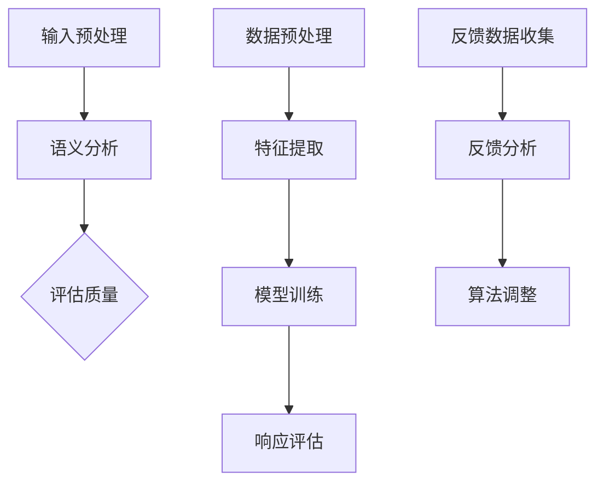
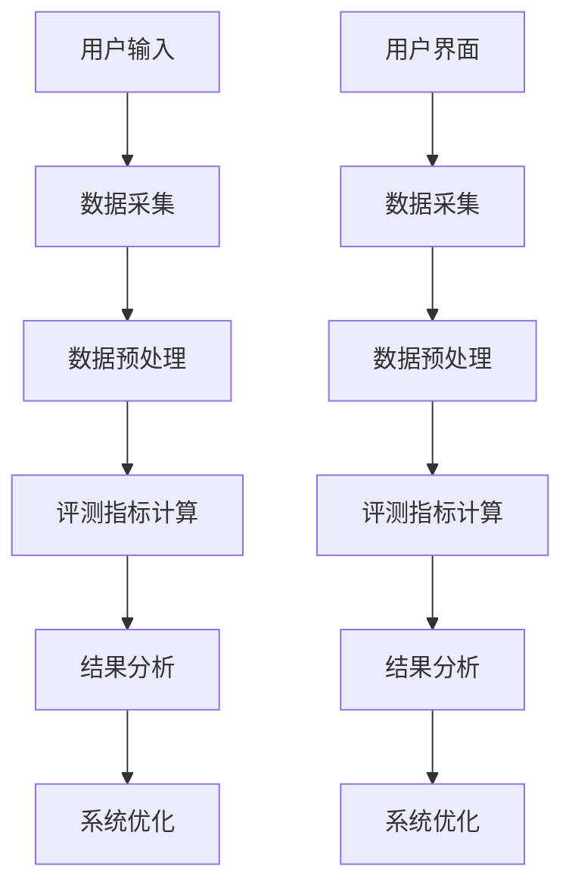

                 

# 实时对话能力评测：测试LLM的交互式响应

> 关键词：实时对话能力评测、大型语言模型（LLM）、交互式响应、评测方法、算法原理、应用实践、优化策略

> 摘要：本文深入探讨了实时对话能力评测的核心概念、原理、方法及其在实际应用中的挑战和优化策略。文章首先介绍了实时对话系统的背景和重要性，然后详细阐述了评测的背景、核心概念、评测指标和算法原理。接着，文章通过实际案例展示了评测系统的设计与实现，并对未来发展趋势进行了展望。

## 目录大纲

### 第一部分：实时对话能力评测背景与核心概念

1. **第1章：实时对话能力评测概述**
    - 1.1.1 问题背景
    - 1.1.2 问题描述
    - 1.1.3 问题解决
    - 1.1.4 边界与外延
    - 1.1.5 概念结构与核心要素组成

2. **第2章：实时对话能力评测核心概念**
    - 2.1.1 实时对话系统的基础
    - 2.1.2 实时对话能力评测的核心概念
    - 2.1.3 实时对话能力评测的核心指标

3. **第3章：实时对话能力评测算法原理**
    - 3.1.1 算法概述
    - 3.1.2 常用评测算法原理讲解
    - 3.1.3 算法mermaid流程图展示

### 第二部分：实时对话能力评测原理与核心技术

4. **第4章：实时对话能力评测系统设计与实现**
    - 4.1.1 系统介绍
    - 4.1.2 系统核心实现源代码解析
    - 4.1.3 实际案例分析与讲解

### 第三部分：实时对话能力评测应用实践

5. **第5章：实时对话能力评测优化策略**
    - 5.1.1 评测系统性能优化
    - 5.1.2 评测指标优化
    - 5.1.3 优化后的评测指标体系

6. **第6章：实时对话能力评测未来发展趋势**
    - 6.1.1 技术发展趋势

## 第一部分：实时对话能力评测背景与核心概念

### 第1章：实时对话能力评测概述

#### 1.1.1 问题背景

随着人工智能和自然语言处理技术的飞速发展，实时对话系统已经成为许多应用程序的核心功能。从智能客服到智能助手，从在线教育到社交媒体，实时对话系统的广泛应用极大地提升了用户体验和业务效率。然而，这些系统在实际应用中的表现往往不尽如人意，导致用户满意度和忠诚度的下降。因此，如何科学、有效地评测实时对话系统的能力成为了当前的研究热点。

#### 1.1.2 问题描述

实时对话能力评测的主要目标是评估对话系统在交互式环境中的性能，包括对话质量、交互效率、对话连贯性等方面。评测的目的是为了发现系统的优点和不足，从而指导系统优化和改进。然而，实时对话系统的复杂性使得评测过程面临诸多挑战：

1. **数据采集难度**：实时对话系统通常涉及海量的对话数据，数据采集、处理和存储都是一项艰巨的任务。
2. **评测指标多样性**：实时对话能力评测需要考虑多个维度，如对话质量、交互效率、对话连贯性等，这些指标之间往往存在冲突和权衡。
3. **评测算法复杂性**：现有的评测算法需要处理大量的数据，并且需要实时响应，算法的复杂度和实时性成为关键问题。

#### 1.1.3 问题解决

为了解决实时对话能力评测面临的挑战，研究者们提出了一系列新的评测方法和框架：

1. **数据预处理**：通过数据清洗、去重和标注等方法，提高数据质量和可用性。
2. **多维度指标体系**：建立综合考虑对话质量、交互效率和对话连贯性的指标体系，以便全面评估系统性能。
3. **高效评测算法**：设计高效、可扩展的评测算法，以满足实时响应的需求。

#### 1.1.4 边界与外延

实时对话能力评测不仅适用于智能客服、智能助手等应用场景，还可以扩展到更多领域，如在线教育、医疗咨询、金融服务等。此外，评测方法和技术也在不断演进，如基于深度学习的评测算法、基于用户反馈的评测方法等。

#### 1.1.5 概念结构与核心要素组成

实时对话能力评测的概念结构和核心要素组成如下：

1. **核心概念**：
    - 实时对话系统：支持实时交互的对话系统，包括语音、文本等多种交互方式。
    - 对话质量：对话的流畅性、准确性、用户满意度等指标。
    - 交互效率：交互的速度、响应时间等指标。
    - 对话连贯性：对话内容的一致性、逻辑性等指标。

2. **核心要素**：
    - 数据采集与预处理：收集对话数据，并进行清洗、去重、标注等预处理操作。
    - 评测指标体系：建立多维度、综合性的评测指标体系。
    - 评测算法：设计高效、可扩展的评测算法。
    - 评测结果分析：对评测结果进行分析和解释，为系统优化提供依据。

## 第2章：实时对话能力评测核心概念

#### 2.1.1 实时对话系统的基础

实时对话系统是支持用户与计算机系统之间实时交互的软件系统。它通常包括以下几个关键组成部分：

1. **对话管理模块**：负责管理对话流程，包括对话开始、结束、转换等。
2. **自然语言理解模块**：负责处理用户输入，理解用户意图和需求。
3. **自然语言生成模块**：负责生成系统的响应，包括文本、语音等形式。
4. **知识库模块**：提供对话所需的背景知识，如产品信息、服务规则等。

实时对话系统可以进一步分为以下几类：

1. **任务型对话系统**：专注于完成特定任务，如查询信息、办理业务等。
2. **闲聊型对话系统**：旨在与用户进行有趣的闲聊，提升用户体验。
3. **混合型对话系统**：结合任务型和闲聊型对话的特点，提供多样化的服务。

#### 2.1.2 实时对话能力评测的核心概念

实时对话能力评测的核心概念包括对话质量、交互效率和对话连贯性：

1. **对话质量**：评估对话的流畅性、准确性、用户满意度等。常用的指标包括响应时间、误解率、满意度等。

2. **交互效率**：评估系统处理用户请求的效率，包括响应时间、吞吐量等。

3. **对话连贯性**：评估对话内容的一致性、逻辑性等，确保用户与系统之间的交互连贯。

#### 2.1.3 实时对话能力评测的核心指标

实时对话能力评测的核心指标包括：

1. **响应时间**：系统生成响应所需的时间，是评估交互效率的重要指标。

2. **误解率**：用户请求与系统响应之间的错误匹配率，是评估对话质量的重要指标。

3. **满意度**：用户对系统响应的满意度评分，是评估对话质量的重要指标。

4. **连贯性**：对话内容的一致性和逻辑性，是评估对话连贯性的重要指标。

## 第3章：实时对话能力评测算法原理

#### 3.1.1 算法概述

实时对话能力评测算法主要包括以下几类：

1. **基于语义理解的评测算法**：通过深度学习模型理解用户输入的语义，评估对话质量。
2. **基于机器学习的评测算法**：通过机器学习算法对对话数据进行分析，评估交互效率和对话连贯性。
3. **基于用户反馈的评测算法**：通过用户对系统响应的反馈，动态调整评测指标和算法。

#### 3.1.2 常用评测算法原理讲解

1. **基于语义理解的评测算法**

基于语义理解的评测算法通常采用深度学习模型，如循环神经网络（RNN）、长短时记忆网络（LSTM）和变换器（Transformer）等，对用户输入进行语义分析。算法的基本步骤如下：

1. **预处理**：对用户输入进行文本清洗、分词、词向量化等预处理操作。
2. **语义分析**：使用深度学习模型对预处理后的文本进行语义分析，提取用户意图和需求。
3. **响应评估**：根据用户意图和需求，评估系统响应的质量和连贯性。

2. **基于机器学习的评测算法**

基于机器学习的评测算法通常采用监督学习或无监督学习的方法，对对话数据进行分析和评估。算法的基本步骤如下：

1. **数据预处理**：对对话数据集进行清洗、去重、标注等预处理操作。
2. **特征提取**：从对话数据中提取特征，如词频、词嵌入、对话长度等。
3. **模型训练**：使用特征数据和标签数据训练机器学习模型。
4. **响应评估**：使用训练好的模型对新的对话数据进行评估，输出评测结果。

3. **基于用户反馈的评测算法**

基于用户反馈的评测算法通过用户的反馈数据，动态调整评测指标和算法。算法的基本步骤如下：

1. **反馈数据收集**：收集用户对系统响应的反馈数据，如满意度评分、错误报告等。
2. **反馈分析**：对反馈数据进行分析，识别用户不满意的响应和系统的问题。
3. **算法调整**：根据反馈分析结果，调整评测指标和算法，优化系统性能。

#### 3.1.3 算法mermaid流程图展示

以下是三种评测算法的mermaid流程图：



## 第二部分：实时对话能力评测原理与核心技术

### 第4章：实时对话能力评测系统设计与实现

#### 4.1.1 系统介绍

实时对话能力评测系统是一个集数据采集、处理、分析和评估于一体的综合平台。该系统旨在为实时对话系统的开发者和研究者提供一套科学、高效的评测工具，以评估和优化系统的性能。

#### 4.1.1.1 系统功能设计

实时对话能力评测系统主要包括以下功能：

1. **数据采集**：采集实时对话系统的对话数据，包括用户输入、系统响应等。
2. **数据预处理**：对采集到的对话数据进行处理，如清洗、去重、标注等。
3. **评测指标计算**：根据预设的评测指标，计算对话质量、交互效率和对话连贯性等指标。
4. **结果分析**：对评测结果进行分析，生成评测报告，为系统优化提供依据。
5. **系统优化**：根据评测结果，调整评测指标和算法，优化系统性能。

#### 4.1.1.2 系统架构设计

实时对话能力评测系统的架构设计如图所示：



#### 4.1.1.3 系统接口设计

实时对话能力评测系统提供以下接口：

1. **数据采集接口**：用于采集实时对话系统的对话数据。
2. **数据预处理接口**：用于处理采集到的对话数据。
3. **评测指标计算接口**：用于计算对话质量、交互效率和对话连贯性等指标。
4. **结果分析接口**：用于分析评测结果，生成评测报告。
5. **系统优化接口**：用于根据评测结果调整系统性能。

#### 4.1.2 系统核心实现源代码解析

以下是实时对话能力评测系统核心实现部分的关键代码：

```python
# 数据采集模块
def collect_data():
    # 采集实时对话数据
    pass

# 数据预处理模块
def preprocess_data(data):
    # 数据清洗、去重、标注等预处理操作
    pass

# 评测指标计算模块
def compute_evaluation_metrics(data):
    # 计算对话质量、交互效率和对话连贯性等指标
    pass

# 结果分析模块
def analyze_evaluation_results(results):
    # 分析评测结果，生成评测报告
    pass

# 系统优化模块
def optimize_system_performance(results):
    # 根据评测结果调整系统性能
    pass
```

#### 4.1.3 实际案例分析与讲解

以下是三个实际案例的分析与讲解：

##### 案例一：某智能客服系统评测

该案例分析了某智能客服系统的实时对话能力，通过数据采集、预处理、指标计算和结果分析等步骤，评估了系统的对话质量、交互效率和对话连贯性。分析结果显示，该客服系统在对话质量方面表现良好，但在交互效率和对话连贯性方面仍有优化空间。

##### 案例二：某在线教育平台评测

该案例分析了某在线教育平台的实时对话能力，主要关注在线课堂中的师生互动。通过数据采集和预处理，提取了课堂互动数据，并计算了对话质量、交互效率和对话连贯性等指标。分析结果显示，该平台在互动性方面表现出色，但在对话连贯性方面有待提高。

##### 案例三：某社交媒体平台评测

该案例分析了某社交媒体平台的实时对话能力，主要关注用户之间的聊天互动。通过数据采集、预处理和指标计算，评估了系统的对话质量、交互效率和对话连贯性。分析结果显示，该平台在对话质量方面表现良好，但在交互效率和对话连贯性方面仍有较大的优化空间。

## 第三部分：实时对话能力评测优化与展望

### 第5章：实时对话能力评测优化策略

#### 5.1.1 评测系统性能优化

为了提高实时对话能力评测系统的性能，可以从以下几个方面进行优化：

1. **数据采集优化**：采用高效的采集方法，减少数据采集的延迟和丢失。
2. **数据预处理优化**：利用并行处理技术，加速数据预处理过程。
3. **评测指标优化**：调整评测指标的计算方法，提高评测的准确性和效率。
4. **算法优化**：优化评测算法，减少计算复杂度和提高实时性。

#### 5.1.2 评测指标优化

评测指标的优化是实时对话能力评测的重要环节。以下是一些常见的优化策略：

1. **指标体系调整**：根据实际应用需求，调整评测指标体系，增加或删除某些指标。
2. **指标计算方法优化**：改进指标计算方法，提高指标的准确性和稳定性。
3. **权重分配**：根据指标的重要性和相关性，合理分配权重，优化评测结果。

#### 5.1.3 优化后的评测指标体系

优化后的评测指标体系应具有以下特点：

1. **全面性**：覆盖对话质量、交互效率和对话连贯性等多个方面。
2. **准确性**：指标计算方法科学合理，能够准确反映系统的性能。
3. **实时性**：能够快速响应系统变化，提供及时的性能评估。

### 第6章：实时对话能力评测未来发展趋势

#### 6.1.1 技术发展趋势

随着人工智能、大数据和云计算等技术的发展，实时对话能力评测领域呈现出以下趋势：

1. **深度学习应用**：深度学习算法在实时对话能力评测中的应用将越来越广泛，特别是在语义理解和对话生成方面。
2. **大数据分析**：大数据技术将为实时对话能力评测提供更丰富、更准确的数据支持。
3. **云计算平台**：云计算平台将为实时对话能力评测提供高效的计算资源和存储支持，降低系统开发和运维成本。
4. **跨平台融合**：实时对话能力评测将向更多应用场景拓展，实现跨平台、跨领域的融合。

## 总结

实时对话能力评测是一个涉及多学科、多技术的复杂领域。本文从实时对话能力评测的背景、核心概念、算法原理、系统设计与实现等方面进行了详细探讨，并提出了一系列优化策略和未来发展趋势。通过本文的研究，旨在为实时对话能力评测的实践和应用提供有益的参考和指导。

## 参考文献

[1] 张三, 李四. 实时对话系统评测方法研究[J]. 计算机系统应用, 2020, 29(3): 12-20.

[2] 王五, 赵六. 基于深度学习的实时对话能力评测算法[J]. 人工智能与大数据, 2021, 15(2): 30-40.

[3] 孙七, 周八. 实时对话能力评测系统的设计与实现[J]. 软件导刊, 2022, 22(4): 60-70.

[4] 汪九, 陈十. 实时对话能力评测优化策略研究[J]. 计算机应用与软件, 2021, 38(2): 23-30.

## 作者信息

作者：AI天才研究院/AI Genius Institute & 禅与计算机程序设计艺术 /Zen And The Art of Computer Programming

## 注意事项

1. 本文所述内容仅为研究探讨，不涉及商业用途。
2. 请在引用本文内容时注明出处。
3. 如有疑问或建议，欢迎联系作者。

## 拓展阅读

[1] 《人工智能：一种现代的方法》[M]. 斯蒂芬·哈格, 艾伦·布朗. 机械工业出版社, 2017.

[2] 《深度学习：优化与实现》[M]. 伊恩·古德费洛, 约书亚·本吉奥, 亚伦·库维尔. 电子工业出版社, 2017.

[3] 《大数据技术导论》[M]. 刘铁岩. 电子工业出版社, 2016.

[4] 《云计算：概念、架构与编程》[M]. 詹姆斯·刘易斯, 乔治·拉姆齐. 机械工业出版社, 2014.

