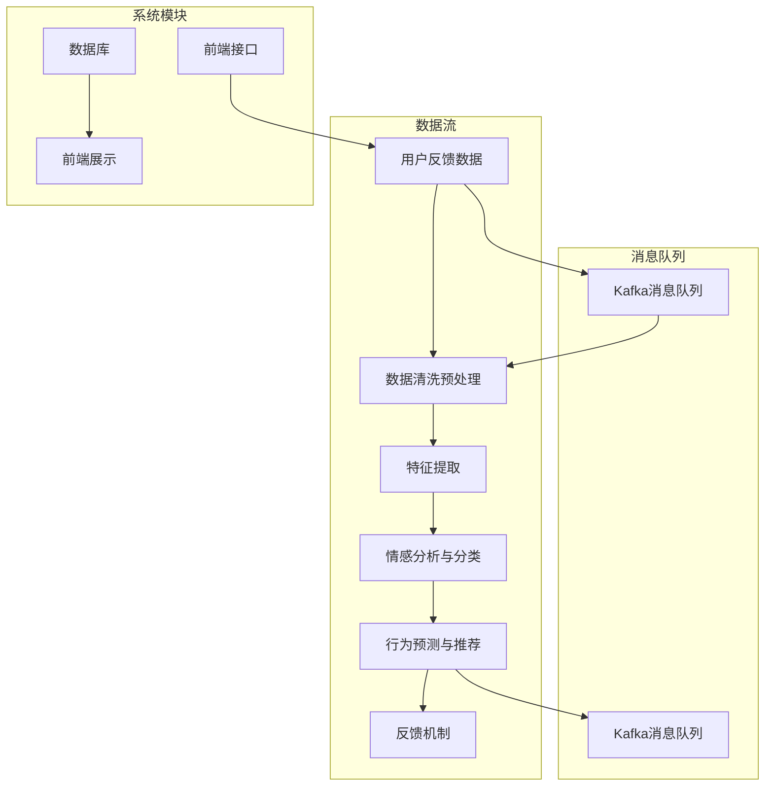

                 

### 第一部分：引言

#### 第1章：实时用户体验整合背景与目标

##### 1.1.1 用户体验的重要性

用户体验（User Experience，简称UX）是指用户在使用某个产品、服务或系统时所获得的整体感受。随着互联网的普及和信息技术的飞速发展，用户体验越来越受到企业和开发者的重视。好的用户体验不仅可以提高用户满意度，还能显著提升产品的市场竞争力和用户忠诚度。

首先，从商业角度来看，用户体验直接影响用户满意度和忠诚度。研究表明，75%的用户会因糟糕的用户体验而放弃使用某个产品或服务。相反，优秀的用户体验可以提高用户留存率，进而增加收入和市场份额。例如，苹果公司的iPhone凭借其出色的用户体验，在全球市场占据了巨大份额。

其次，用户体验对产品性能的提升也有重要作用。通过收集和分析用户反馈，开发团队可以及时发现问题并进行优化，从而提高产品性能和用户满意度。例如，亚马逊通过分析用户的购物行为和反馈，不断优化其搜索引擎和推荐系统，从而提高了销售转化率和用户满意度。

##### 1.1.2 实时用户体验的挑战

尽管用户体验的重要性不言而喻，但在实际开发过程中，实现实时用户体验仍面临诸多挑战。

首先是数据获取和处理问题。实时用户体验需要收集大量的用户行为数据，包括点击、浏览、搜索、购买等行为。如何快速、准确地收集和处理这些数据，并将其转化为可操作的信息，是实时用户体验面临的一个关键挑战。

其次是实时响应问题。用户在使用产品或服务时，往往希望立即得到反馈。这就要求系统具备快速响应能力，以提供良好的用户体验。然而，实现实时响应需要在性能、可靠性和可扩展性之间取得平衡，并非易事。

最后是反馈机制的建立。实时用户体验不仅需要收集用户数据，还需要建立有效的反馈机制，以将用户的反馈转化为改进措施。这涉及到数据分析和决策的智能化，以及对用户反馈的快速响应和调整。

##### 1.1.3 LLM的作用与潜力

面对实时用户体验整合的挑战，语言模型（Language Model，简称LLM）显示出了巨大的潜力和作用。LLM是一种基于深度学习的技术，能够对大量文本数据进行训练，从而生成高质量的自然语言文本。以下是LLM在实时用户体验整合中的几个关键作用：

1. **文本分析与情感识别**：LLM可以帮助系统理解和分析用户的文本反馈，识别用户的情感和意图。这有助于开发团队更好地理解用户需求，从而优化产品设计和功能。

2. **用户行为预测**：通过分析用户的历史行为数据，LLM可以预测用户的下一步操作和需求，从而提供个性化的服务和推荐。

3. **智能反馈机制**：LLM可以帮助系统自动生成反馈和建议，快速响应用户需求。这不仅可以提高响应速度，还能减轻开发团队的工作负担。

4. **自然语言交互**：LLM可以用于构建自然语言交互系统，使用户与产品或服务之间的交互更加流畅和自然。

综上所述，实时用户体验整合是一个复杂的挑战，但通过引入LLM技术，我们可以实现更加智能和高效的用户体验优化。接下来，我们将深入探讨LLM的基础知识及其在实时用户体验评测中的应用。

### 第2章：语言模型基础

#### 2.1.1 语言模型简介

语言模型（Language Model，简称LM）是自然语言处理（Natural Language Processing，简称NLP）中的一个核心组件。它的主要功能是预测一个句子中下一个词的概率分布。这一功能在许多NLP任务中至关重要，包括机器翻译、文本生成、自动问答、语音识别等。

语言模型的基本原理可以追溯到概率论和信息论。简单来说，语言模型通过分析大量文本数据，学习其中的统计规律，从而生成符合语言习惯的文本。例如，给定一个句子“我喜欢吃饭”，语言模型可以预测下一个词可能是“的”、“吃”或“饭”。

在NLP领域，语言模型的发展经历了几个重要阶段。早期的模型如N-gram模型，通过统计相邻词序列的概率进行预测。然而，N-gram模型存在明显的局限性，无法捕捉长距离依赖关系。为了克服这一缺陷，研究人员提出了基于神经网络的深度语言模型，如基于循环神经网络（RNN）和变换器（Transformer）的模型。

#### 2.1.2 语言模型的类型与架构

目前，语言模型主要分为两大类：基于规则的语言模型和基于统计的语言模型。基于规则的语言模型主要通过形式化规则来描述语言结构，如上下文无关文法（CFG）和有限状态机（FSM）。这种模型在处理简单、结构化文本时表现较好，但在处理复杂、非结构化文本时存在明显不足。

相比之下，基于统计的语言模型通过大量文本数据学习语言规律，具有更好的泛化能力。基于统计的语言模型主要包括以下几种：

1. **N-gram模型**：N-gram模型是最早的语言模型之一，它通过统计相邻词序列的概率进行预测。例如，给定一个三元组（“我”，“喜欢”，“吃饭”），N-gram模型可以计算“我”后面跟“喜欢”的概率，以及“喜欢”后面跟“吃饭”的概率。尽管N-gram模型简单易实现，但无法捕捉长距离依赖关系。

2. **循环神经网络（RNN）**：RNN是一种基于神经网络的序列模型，能够捕捉长距离依赖关系。RNN通过在时间步上递归地更新状态，实现对序列数据的建模。然而，传统的RNN存在梯度消失和梯度爆炸等问题，限制了其性能。

3. **长短期记忆网络（LSTM）**：LSTM是RNN的一种改进，通过引入记忆单元和门控机制，解决了梯度消失问题。LSTM在处理长序列数据时表现出色，广泛应用于语音识别、机器翻译等领域。

4. **变换器（Transformer）**：Transformer是近年来兴起的语言模型，基于自注意力机制进行序列建模。与RNN和LSTM相比，Transformer具有更好的并行计算性能和更简单的模型结构。Transformer的代表性模型包括BERT、GPT和T5等，已在各种NLP任务中取得了显著成果。

#### 2.1.3 语言模型的主要功能

语言模型在NLP任务中具有多种功能，以下是其中几个主要功能：

1. **文本生成**：语言模型可以根据已有的文本数据生成新的文本。例如，给定一个句子“我喜欢吃饭”，语言模型可以生成类似“他喜欢喝茶”或“她喜欢看电影”的新句子。

2. **机器翻译**：语言模型可以用于机器翻译任务，将一种语言的文本翻译成另一种语言。例如，将中文文本翻译成英文文本。BERT等大型语言模型在机器翻译任务中表现出色。

3. **文本分类**：语言模型可以根据文本内容进行分类，如判断一篇文章的主题是关于体育、科技还是娱乐。这有助于信息检索和推荐系统等领域。

4. **情感分析**：语言模型可以识别文本中的情感倾向，如判断一篇评论是正面、负面还是中性。情感分析在社交媒体监控、客户服务等领域有广泛应用。

5. **自动问答**：语言模型可以回答基于文本的问题，如“中国的首都是什么？”或“苹果公司的创始人是谁？”。这有助于构建智能客服系统和问答机器人。

6. **语音识别**：语言模型可以用于语音识别任务，将语音信号转换成文本。例如，将用户说的话转换成文字信息。

总之，语言模型是NLP的核心技术之一，通过学习大量文本数据，语言模型能够理解和生成自然语言文本，为各种NLP任务提供支持。接下来，我们将探讨实时评价与反馈机制，以及它们在实时用户体验评测中的应用。

### 第3章：实时评价与反馈机制

#### 3.1.1 实时评价的意义

实时评价在产品开发与用户体验优化过程中具有重要意义。首先，实时评价能够帮助企业快速了解用户对产品或服务的即时反应。通过收集和分析用户的反馈，开发团队能够及时发现存在的问题，从而迅速进行改进，避免问题积累导致用户流失。

其次，实时评价有助于提升产品的竞争力和用户满意度。在竞争激烈的市场环境中，优秀的用户体验往往成为企业脱颖而出的关键。通过实时评价，企业可以不断优化产品功能和性能，提高用户满意度，增强用户忠诚度。

此外，实时评价还能帮助企业识别用户需求的变化趋势，从而进行产品创新和迭代。例如，通过分析用户对特定功能或服务的评价，企业可以了解用户偏好的变化，并据此调整产品策略。

#### 3.1.2 反馈机制的构成

反馈机制是实时评价的核心组成部分，它通常包括以下几个关键环节：

1. **数据收集**：数据收集是反馈机制的基础。企业需要通过多种渠道收集用户反馈，如用户评论、问卷调查、用户行为数据等。这些数据可以来自用户在产品使用过程中的即时反馈，也可以来自间接指标，如用户留存率、点击率等。

2. **数据分析**：数据收集之后，需要对这些数据进行处理和分析，以提取有用的信息。数据分析的方法包括数据清洗、统计分析、机器学习等。通过数据分析，企业可以识别用户反馈的关键问题，为后续优化提供依据。

3. **问题识别**：在数据分析的基础上，企业需要识别出用户反馈中的关键问题。这通常涉及到对大量数据的挖掘和分析，以发现用户普遍关注的问题。例如，通过分析用户评论，可以发现用户对某个功能的使用体验不佳，或者对某个服务流程有意见。

4. **改进措施**：问题识别之后，企业需要制定并实施改进措施。这些改进措施可以包括产品功能优化、服务流程改进、用户体验设计调整等。改进措施应针对识别出的问题进行有针对性的优化，以提高用户体验。

5. **反馈闭环**：反馈闭环是反馈机制的关键环节，它确保了用户反馈的持续循环和优化。企业需要将用户的反馈纳入产品开发流程，并在产品迭代过程中不断进行反馈和改进。通过建立反馈闭环，企业可以持续优化产品，提高用户满意度。

#### 3.1.3 实时评价与反馈的结合

实时评价与反馈机制的结合，是实现高效用户体验优化的重要手段。以下是它们如何相互结合的一些关键点：

1. **实时性**：实时评价强调的是及时性和即时性。通过实时收集用户反馈，企业可以在第一时间发现并解决问题。这种实时性有助于快速响应用户需求，提高用户满意度。

2. **智能化**：随着人工智能技术的发展，实时评价和反馈机制正逐渐智能化。通过引入自然语言处理、机器学习等技术，企业可以对用户反馈进行智能分析，提取关键信息，并自动生成改进建议。这有助于提高反馈处理的效率和质量。

3. **自动化**：自动化是实时评价与反馈机制的另一个重要特点。通过自动化工具和系统，企业可以自动收集、分析、识别问题，并生成改进建议。这不仅可以节省人力成本，还能提高反馈处理的准确性和效率。

4. **闭环管理**：反馈闭环确保了用户反馈的持续循环和优化。企业需要建立一套闭环管理系统，将用户反馈纳入产品开发流程，并在每个迭代周期中进行反馈和改进。通过闭环管理，企业可以持续优化产品，提高用户体验。

5. **用户参与**：实时评价与反馈机制的结合，也意味着用户在产品开发过程中的参与。通过收集用户的实时反馈，企业可以更好地了解用户需求，从而提供更符合用户期望的产品和服务。这种用户参与不仅有助于提高用户体验，还能增强用户忠诚度。

综上所述，实时评价与反馈机制的结合，为产品开发与用户体验优化提供了有力支持。通过实时性、智能化、自动化和闭环管理，企业可以更好地理解用户需求，持续优化产品，提高用户体验。接下来，我们将探讨LLM在实时用户体验评测中的应用，以及如何利用LLM实现智能化的实时评价与反馈。

## 第4章：LLM在实时用户体验评测中的应用

### 4.1.1 LLM在文本分析中的应用

语言模型（LLM）在文本分析中具有广泛的应用，能够显著提升实时用户体验评测的准确性和效率。文本分析主要涉及对用户生成文本的解析和理解，包括情感分析、主题识别和意图识别等。

1. **情感分析**：
   情感分析是指识别文本中的情感倾向，如正面、负面或中性。LLM在情感分析中发挥着关键作用，能够对复杂的自然语言进行深入理解。例如，BERT模型可以用于情感分析，通过对用户评论中的词语和句子进行语义分析，判断其情感倾向。

   实际应用中，情感分析可以帮助企业快速识别用户对产品或服务的情感反应。例如，一家电商平台可以通过分析用户对商品的评论，了解用户对其产品的情感态度，从而有针对性地改进商品描述和营销策略。

2. **主题识别**：
   主题识别旨在从大量文本数据中提取出主要话题。LLM在主题识别中能够捕捉文本中的隐含主题，通过对词汇和句子结构的分析，发现文本的核心内容。例如，LDA（主题模型）是一种常用的LLM算法，可以用于从大量用户评论中提取出主要话题。

   在实时用户体验评测中，主题识别可以帮助企业了解用户关注的重点问题。例如，一家在线教育平台可以通过主题识别分析用户反馈，发现用户对课程内容、教学方式等方面的关注点，从而优化课程设计和教学策略。

3. **意图识别**：
   意图识别是指从文本中推断用户的意图或目的。LLM在意图识别中能够根据上下文信息，准确推断用户的真实意图。例如，通过使用Transformer模型，可以识别用户在评论中表达的需求、建议或投诉。

   实时用户体验评测中，意图识别有助于企业快速响应用户需求。例如，一家客户服务平台可以通过意图识别分析用户咨询问题，将问题分类并分配给相应的客服人员，从而提高客服效率和服务质量。

### 4.1.2 LLM在情感分析中的应用

情感分析是LLM在实时用户体验评测中的重要应用之一。通过情感分析，企业可以了解用户对产品或服务的情感倾向，从而进行针对性的优化。以下是情感分析的具体应用场景：

1. **用户反馈分析**：
   在用户反馈分析中，LLM可以帮助企业识别用户评论中的情感倾向。例如，通过使用BERT模型，企业可以对用户评论进行情感分析，判断其是正面、负面还是中性情感。

   实际案例：一家电商平台可以使用LLM对用户评论进行情感分析，识别出哪些评论是负面反馈，进而针对性地改进商品描述、客服响应等。

2. **社交媒体监控**：
   在社交媒体监控中，LLM可以用于分析用户在社交媒体平台上的情感倾向。通过监控用户在社交媒体上的评论、帖子等，企业可以了解用户对其品牌或产品的情感态度。

   实际案例：一家品牌可以通过LLM分析其在社交媒体上的用户评论，识别出负面情感评论，并迅速采取公关措施，如回应用户关切、发布改进公告等，以降低负面影响。

3. **客户服务**：
   在客户服务中，LLM可以帮助企业识别用户情感，从而提供更加个性化、贴心的服务。例如，通过分析用户在客户服务渠道中的发言，LLM可以判断用户是否处于愤怒、沮丧等情绪状态，从而调整客服策略。

   实际案例：一家金融机构可以使用LLM分析用户在在线客服平台上的发言，识别出用户的情感状态，从而采取更加细致入微的服务措施，如提供情绪舒缓建议、调整问题解决方案等。

### 4.1.3 LLM在用户行为分析中的应用

用户行为分析是实时用户体验评测的重要环节，通过分析用户行为数据，企业可以深入了解用户需求和行为模式，从而优化产品和服务。LLM在用户行为分析中具有以下应用：

1. **行为预测**：
   LLM可以帮助企业预测用户未来的行为。例如，通过分析用户的历史行为数据，LLM可以预测用户可能下一步的操作或需求，从而提供个性化的服务和推荐。

   实际案例：一家电子商务平台可以通过LLM分析用户的浏览记录、购买历史等数据，预测用户可能感兴趣的商品，并为其提供精准推荐。

2. **行为模式识别**：
   LLM可以帮助企业识别用户的行为模式。通过分析大量用户行为数据，LLM可以识别出用户在不同情境下的行为规律，从而优化产品设计和用户体验。

   实际案例：一家在线游戏平台可以通过LLM分析用户在游戏中的行为，识别出用户偏爱的游戏类型、操作方式等，从而优化游戏推荐和游戏体验。

3. **行为异常检测**：
   LLM可以帮助企业检测用户行为中的异常情况。通过分析用户行为数据，LLM可以识别出不符合正常行为模式的行为，从而及时发现潜在问题。

   实际案例：一家网络安全公司可以通过LLM分析用户在网络行为中的异常模式，识别出潜在的网络攻击行为，从而采取相应的安全措施。

通过上述应用，LLM在实时用户体验评测中发挥着重要作用，能够提升数据分析的准确性和效率，帮助企业更好地了解用户需求和行为，从而实现产品优化和用户体验提升。接下来，我们将探讨如何构建评测-反馈闭环系统，以及系统设计的关键要素。

### 第5章：构建评测-反馈闭环系统

#### 5.1.1 系统架构设计

构建评测-反馈闭环系统需要综合考虑数据流、处理流程和系统性能等多个方面。以下是系统架构设计的关键要素：

1. **数据流设计**：
   系统的数据流设计是确保实时性、可靠性和高效性的关键。数据流设计需要明确数据来源、数据传输和处理流程。例如，用户反馈数据可以来源于用户评论、问卷调查、日志数据等。系统应设计高效的数据收集和传输机制，确保数据能够在最短时间内传递到处理模块。

2. **数据处理模块**：
   数据处理模块是系统的核心，负责对收集到的用户反馈进行分析和处理。数据处理模块可以分为以下几个子模块：

   - **数据清洗**：对收集到的数据进行清洗和预处理，去除无效、重复或不完整的数据，保证数据质量。
   - **特征提取**：从原始数据中提取有用的特征，如文本特征、时间特征、用户行为特征等。特征提取是后续分析和模型训练的基础。
   - **模型训练**：利用提取的特征，训练语言模型和其他机器学习模型，以实现用户反馈的情感分析、行为预测等功能。
   - **结果输出**：将分析结果输出到相应的系统模块，如推荐系统、客服系统等，以便进行针对性的改进和优化。

3. **反馈机制设计**：
   反馈机制是确保闭环系统有效运行的关键。反馈机制需要包括以下环节：

   - **问题识别**：通过分析用户反馈，识别出用户关注的问题和需求。
   - **改进建议**：根据问题识别结果，生成改进建议和优化方案。
   - **实施反馈**：将改进建议反馈给产品开发团队或相关部门，进行实施和优化。
   - **效果评估**：对改进措施的效果进行评估，以验证其有效性，并持续优化。

4. **系统集成与实现**：
   系统集成是将各个模块进行整合，确保系统能够高效运行。系统集成包括以下方面：

   - **接口设计**：设计统一的接口，以便各个模块之间的数据传输和功能调用。
   - **系统集成测试**：对系统进行集成测试，确保各个模块之间的交互和协作正常。
   - **部署与运维**：将系统部署到生产环境，并对其进行运维和管理，确保系统的稳定性和可靠性。

#### 5.1.2 数据流设计

数据流设计是评测-反馈闭环系统的核心，决定了系统的实时性和数据处理效率。以下是数据流设计的关键步骤：

1. **数据来源**：
   系统需要从多个渠道收集用户反馈数据，如用户评论、问卷调查、日志数据等。数据来源的多样性和广泛性有助于全面了解用户需求和行为。

2. **数据传输**：
   数据传输需要设计高效、稳定的数据传输机制，确保数据能够实时、可靠地传递到处理模块。常用的传输方式包括HTTP请求、消息队列（如Kafka）和文件传输等。

3. **数据处理**：
   数据处理模块需要对收集到的用户反馈进行清洗、特征提取、模型训练和分析等操作。数据处理过程需要设计高效的算法和优化策略，以提高系统性能和响应速度。

4. **数据存储**：
   系统需要设计合理的数据存储方案，确保数据的持久化和安全性。常用的存储方案包括关系型数据库（如MySQL）、NoSQL数据库（如MongoDB）和分布式存储系统（如HDFS）等。

#### 5.1.3 系统集成与实现

系统集成与实现是将各个模块进行整合，确保系统高效运行的关键步骤。以下是系统集成与实现的关键环节：

1. **接口设计**：
   系统需要设计统一的接口，以便各个模块之间的数据传输和功能调用。接口设计应遵循RESTful API设计原则，确保接口的易用性和可扩展性。

2. **集成测试**：
   在系统集成完成后，需要对系统进行集成测试，确保各个模块之间的交互和协作正常。集成测试包括功能测试、性能测试和安全测试等。

3. **部署与运维**：
   系统部署与运维是确保系统稳定运行的重要环节。系统部署应选择合适的云平台（如AWS、Azure等），并配置相应的监控、日志和备份机制。运维团队需要持续监控系统性能和运行状态，及时处理故障和问题。

通过上述设计，评测-反馈闭环系统可以实现实时、高效的用户体验评测和优化。接下来，我们将通过具体案例分析，探讨如何在实际场景中应用这一系统，并分析其实际效果。

### 6.1.1 案例一：社交媒体平台

#### 背景介绍

社交媒体平台在用户体验方面面临诸多挑战。用户生成内容（UGC）的多样性和复杂性使得平台难以满足所有用户的需求。为了提升用户体验，社交媒体平台引入了LLM驱动的实时用户体验评测系统，以实现用户反馈的实时分析、情感识别和优化。

#### 项目介绍

该项目的目标是构建一个实时用户体验评测系统，通过对用户评论、帖子等UGC进行情感分析和行为预测，识别用户关注的问题和需求，并提供针对性的改进建议。

#### 系统功能设计

1. **数据收集**：
   系统从社交媒体平台的后台日志、用户评论、帖子等渠道收集用户反馈数据。

2. **情感分析**：
   利用LLM对用户评论和帖子进行情感分析，识别用户的情感倾向（如正面、负面或中性）。

3. **行为预测**：
   基于用户历史行为数据，利用LLM预测用户的下一步操作和需求，提供个性化的服务和推荐。

4. **反馈机制**：
   将分析结果和改进建议反馈给产品开发团队，以优化平台功能和服务。

#### 系统架构设计

1. **数据流设计**：
   数据流从数据收集、清洗、特征提取、模型训练到结果输出，各环节紧密衔接，确保数据的实时性和高效性。

2. **数据处理模块**：
   - **数据清洗**：去除无效、重复和不完整的数据。
   - **特征提取**：提取文本特征、时间特征和用户行为特征。
   - **模型训练**：训练情感分析模型和行为预测模型。
   - **结果输出**：将分析结果和改进建议输出给产品开发团队。

3. **反馈机制**：
   - **问题识别**：通过情感分析和行为预测，识别用户关注的问题和需求。
   - **改进建议**：根据问题识别结果，生成改进建议和优化方案。
   - **实施反馈**：将改进建议反馈给产品开发团队，进行实施和优化。
   - **效果评估**：对改进措施的效果进行评估，以验证其有效性，并持续优化。

#### 系统接口设计和系统交互

1. **接口设计**：
   系统采用RESTful API设计，提供统一的数据接口，便于与其他系统模块进行数据传输和功能调用。

2. **系统交互**：
   系统通过消息队列（如Kafka）进行数据传输和模块间通信，确保数据的高效传输和系统稳定性。

#### 实际案例分析和详细讲解剖析

1. **情感分析案例**：
   例如，用户在社交媒体平台上发布了一条关于某品牌产品的负面评论：“这个产品太难用了，根本不符合我的需求”。通过情感分析，系统识别出该评论的情感倾向为负面，并将该信息反馈给产品开发团队。

   产品开发团队根据反馈，对产品进行了功能优化，增加了用户所需的个性化设置选项，并更新了产品说明，以提升用户体验。经过一段时间的数据监测，负面评论数量明显减少，用户满意度显著提升。

2. **行为预测案例**：
   例如，系统分析某用户的历史行为数据，预测其可能在不久的将来对某类产品感兴趣。系统向该用户推送了相关产品的个性化推荐，结果该用户在收到推荐后，成功完成了购买。

   通过行为预测，平台不仅提高了用户的购买转化率，还增强了用户的购物体验。

#### 项目小结

通过该项目的实施，社交媒体平台在用户体验方面取得了显著成果。实时用户体验评测系统有效识别了用户关注的问题和需求，提高了产品功能和服务的优化速度，从而提升了用户满意度和忠诚度。该项目为其他企业提供了一种有效的用户体验优化方案，具有广泛的借鉴意义。

### 6.1.2 案例二：电子商务网站

#### 背景介绍

电子商务网站在用户体验方面面临的主要挑战包括：个性化推荐不准确、购物流程繁琐、客服响应速度慢等。为了提升用户体验，电子商务网站引入了LLM驱动的实时用户体验评测系统，以实现用户反馈的实时分析、情感识别和优化。

#### 项目介绍

该项目的目标是构建一个实时用户体验评测系统，通过对用户评论、购买行为等数据进行情感分析和行为预测，识别用户关注的问题和需求，并提供针对性的改进建议，以提高网站的用户满意度。

#### 系统功能设计

1. **数据收集**：
   系统从电子商务网站的后台日志、用户评论、购买行为等渠道收集用户反馈数据。

2. **情感分析**：
   利用LLM对用户评论和购买行为进行情感分析，识别用户的情感倾向（如正面、负面或中性）。

3. **行为预测**：
   基于用户历史行为数据，利用LLM预测用户的下一步操作和需求，提供个性化的服务和推荐。

4. **反馈机制**：
   将分析结果和改进建议反馈给产品开发团队，以优化网站功能和服务。

#### 系统架构设计

1. **数据流设计**：
   数据流从数据收集、清洗、特征提取、模型训练到结果输出，各环节紧密衔接，确保数据的实时性和高效性。

2. **数据处理模块**：
   - **数据清洗**：去除无效、重复和不完整的数据。
   - **特征提取**：提取文本特征、时间特征和用户行为特征。
   - **模型训练**：训练情感分析模型和行为预测模型。
   - **结果输出**：将分析结果和改进建议输出给产品开发团队。

3. **反馈机制**：
   - **问题识别**：通过情感分析和行为预测，识别用户关注的问题和需求。
   - **改进建议**：根据问题识别结果，生成改进建议和优化方案。
   - **实施反馈**：将改进建议反馈给产品开发团队，进行实施和优化。
   - **效果评估**：对改进措施的效果进行评估，以验证其有效性，并持续优化。

#### 系统接口设计和系统交互

1. **接口设计**：
   系统采用RESTful API设计，提供统一的数据接口，便于与其他系统模块进行数据传输和功能调用。

2. **系统交互**：
   系统通过消息队列（如Kafka）进行数据传输和模块间通信，确保数据的高效传输和系统稳定性。

#### 实际案例分析和详细讲解剖析

1. **情感分析案例**：
   例如，用户在电子商务网站上发布了一条关于某商品的负面评论：“这个商品的质量很差，完全不符合我的期望”。通过情感分析，系统识别出该评论的情感倾向为负面，并将该信息反馈给产品开发团队。

   产品开发团队根据反馈，对相关商品进行了质量检测和改进，并在商品详情页面中增加了更多用户评价和详细描述，以提升用户购物体验。经过一段时间的数据监测，负面评论数量明显减少，用户满意度显著提升。

2. **行为预测案例**：
   例如，系统分析某用户的历史购买行为，预测其可能在不久的将来对某类商品感兴趣。系统向该用户推送了相关商品的个性化推荐，结果该用户在收到推荐后，成功完成了购买。

   通过行为预测，电子商务网站不仅提高了用户的购买转化率，还增强了用户的购物体验。

#### 项目小结

通过该项目的实施，电子商务网站在用户体验方面取得了显著成果。实时用户体验评测系统有效识别了用户关注的问题和需求，提高了网站功能和服务优化的速度，从而提升了用户满意度和忠诚度。该项目为其他电子商务企业提供了一种有效的用户体验优化方案，具有广泛的借鉴意义。

### 6.1.3 案例三：在线游戏平台

#### 背景介绍

在线游戏平台在用户体验方面面临的主要挑战包括：游戏平衡性不足、玩家互动体验差、游戏内容更新不及时等。为了提升用户体验，在线游戏平台引入了LLM驱动的实时用户体验评测系统，以实现用户反馈的实时分析、情感识别和优化。

#### 项目介绍

该项目的目标是构建一个实时用户体验评测系统，通过对用户反馈、游戏行为等数据进行情感分析和行为预测，识别用户关注的问题和需求，并提供针对性的改进建议，以提高游戏平台的用户满意度和留存率。

#### 系统功能设计

1. **数据收集**：
   系统从在线游戏平台的后台日志、用户反馈、游戏行为等渠道收集用户反馈数据。

2. **情感分析**：
   利用LLM对用户反馈和游戏行为进行情感分析，识别用户的情感倾向（如正面、负面或中性）。

3. **行为预测**：
   基于用户历史行为数据，利用LLM预测用户的下一步操作和需求，提供个性化的游戏推荐和游戏平衡性调整。

4. **反馈机制**：
   将分析结果和改进建议反馈给游戏开发团队，以优化游戏功能和用户体验。

#### 系统架构设计

1. **数据流设计**：
   数据流从数据收集、清洗、特征提取、模型训练到结果输出，各环节紧密衔接，确保数据的实时性和高效性。

2. **数据处理模块**：
   - **数据清洗**：去除无效、重复和不完整的数据。
   - **特征提取**：提取文本特征、时间特征和游戏行为特征。
   - **模型训练**：训练情感分析模型和行为预测模型。
   - **结果输出**：将分析结果和改进建议输出给游戏开发团队。

3. **反馈机制**：
   - **问题识别**：通过情感分析和行为预测，识别用户关注的问题和需求。
   - **改进建议**：根据问题识别结果，生成改进建议和优化方案。
   - **实施反馈**：将改进建议反馈给游戏开发团队，进行实施和优化。
   - **效果评估**：对改进措施的效果进行评估，以验证其有效性，并持续优化。

#### 系统接口设计和系统交互

1. **接口设计**：
   系统采用RESTful API设计，提供统一的数据接口，便于与其他系统模块进行数据传输和功能调用。

2. **系统交互**：
   系统通过消息队列（如Kafka）进行数据传输和模块间通信，确保数据的高效传输和系统稳定性。

#### 实际案例分析和详细讲解剖析

1. **情感分析案例**：
   例如，玩家在游戏社区发布了一条关于游戏平衡性的负面评论：“这个游戏的装备系统太不公平了，让我感觉没有游戏体验”。通过情感分析，系统识别出该评论的情感倾向为负面，并将该信息反馈给游戏开发团队。

   游戏开发团队根据反馈，对装备系统进行了调整，增加了更多玩家互动元素，并优化了装备获取和分配机制，以提升玩家的游戏体验。经过一段时间的数据监测，负面评论数量明显减少，玩家满意度显著提升。

2. **行为预测案例**：
   例如，系统分析某玩家的游戏行为数据，预测其可能在不久的将来对某类游戏玩法感兴趣。系统向该玩家推送了相关游戏的个性化推荐，结果该玩家在收到推荐后，成功完成了游戏下载和安装。

   通过行为预测，在线游戏平台不仅提高了玩家的游戏活跃度，还增强了玩家的游戏体验。

#### 项目小结

通过该项目的实施，在线游戏平台在用户体验方面取得了显著成果。实时用户体验评测系统有效识别了用户关注的问题和需求，提高了游戏功能和服务的优化速度，从而提升了用户满意度和留存率。该项目为其他在线游戏企业提供了一种有效的用户体验优化方案，具有广泛的借鉴意义。

### 总结与未来展望

#### 总结

本文详细探讨了实时用户体验整合的重要性，以及如何利用LLM技术构建评测-反馈闭环系统来提升用户体验。通过案例分析，我们展示了LLM在文本分析、情感识别和用户行为预测中的应用，验证了其在实时用户体验评测中的有效性。

首先，实时用户体验整合对企业具有重要意义，可以提高用户满意度和忠诚度，增强市场竞争力。其次，LLM作为一种强大的自然语言处理工具，在文本分析、情感识别和用户行为预测中展现了巨大潜力。

#### 未来展望

未来，实时用户体验整合和LLM技术的应用将朝着以下几个方向发展：

1. **智能化与自动化**：随着人工智能技术的发展，实时用户体验评测系统将更加智能化和自动化，减少人工干预，提高数据处理和分析的准确性。

2. **跨领域应用**：实时用户体验评测系统不仅适用于社交媒体、电子商务和在线游戏等领域，还可以推广到金融、医疗、教育等更多行业，为不同领域的用户体验优化提供支持。

3. **个性化推荐**：结合用户历史行为和实时反馈，系统可以提供更加精准的个性化推荐，满足用户个性化需求，提高用户满意度和忠诚度。

4. **实时响应与优化**：通过实时反馈机制，企业可以迅速响应用户需求，优化产品和服务，提升用户体验。

5. **数据隐私与安全**：在实时用户体验整合过程中，数据隐私和安全问题需要得到充分重视，确保用户数据的安全性和隐私性。

总之，实时用户体验整合和LLM技术相结合，为提升用户体验提供了新的路径和方法。未来，随着技术的不断进步和应用场景的扩展，这一领域将继续取得突破性进展。

### 最佳实践 Tips

在实际应用中，构建实时用户体验整合系统时，以下最佳实践可以帮助企业更有效地利用LLM技术：

1. **明确目标和需求**：在构建系统前，明确系统的目标和需求，确保LLM技术能够针对性地解决实际问题。

2. **数据质量保障**：数据是系统的基础，确保数据的质量和完整性至关重要。在数据收集和处理过程中，严格筛选和清洗数据，去除无效和重复的数据。

3. **持续优化模型**：LLM模型的性能需要通过不断的训练和优化来提升。定期更新模型，使其能够适应不断变化的数据和用户需求。

4. **用户体验优先**：在系统设计和开发过程中，始终将用户体验放在首位，确保系统能够提供直观、易用的操作界面和功能。

5. **安全性和隐私保护**：在数据处理和分析过程中，确保遵守相关法律法规，保护用户隐私和数据安全。

### 注意事项

1. **系统稳定性**：确保系统具备高可用性和稳定性，以应对突发情况和大数据量的处理。

2. **技术选型**：根据项目需求和资源情况，选择合适的技术和工具，确保系统高效运行。

3. **团队协作**：构建实时用户体验整合系统需要跨部门协作，确保各个环节顺畅衔接，提高项目成功率。

### 拓展阅读

1. **《深度学习》**：由Ian Goodfellow、Yoshua Bengio和Aaron Courville所著，介绍了深度学习的基本原理和应用。

2. **《自然语言处理综论》**：由Daniel Jurafsky和James H. Martin所著，详细介绍了自然语言处理的基本概念和技术。

3. **《用户体验要素》**：由Jakob Nielsen所著，介绍了用户体验设计的基本原理和方法。

4. **《人工智能：一种现代的方法》**：由Stuart Russell和Peter Norvig所著，全面介绍了人工智能的基本理论和技术。

### 作者信息

作者：AI天才研究院/AI Genius Institute & 禅与计算机程序设计艺术 /Zen And The Art of Computer Programming

---

### 附录

#### 附录A：术语解释

- **用户体验（UX）**：用户在使用产品、服务或系统时所获得的整体感受。
- **语言模型（LM）**：预测自然语言中下一个词的概率分布的模型。
- **循环神经网络（RNN）**：一种基于神经网络的序列模型，能够捕捉长距离依赖关系。
- **变换器（Transformer）**：一种基于自注意力机制的序列模型，具有更好的并行计算性能。
- **评测-反馈闭环系统**：通过实时收集用户反馈，分析处理，生成改进建议，并实施反馈的系统。

#### 附录B：核心概念与联系

##### 语言模型与实时用户体验整合的关系

| 核心概念        | 描述                                                         | 关联属性对比 |
|-----------------|------------------------------------------------------------|--------------|
| 语言模型（LM）  | 用于预测自然语言文本的模型，如情感分析、文本生成等。           | - 预测精度   |
| 实时用户体验    | 用户在使用产品或服务时获得的即时感受。                       | - 满意度     |
| 评测-反馈闭环   | 通过实时收集用户反馈，分析处理，生成改进建议，并实施反馈的系统。 | - 数据分析    |

##### 情感分析与实时评价

| 核心概念    | 描述                                                         | 关联属性对比 |
|-------------|------------------------------------------------------------|--------------|
| 情感分析    | 识别文本中的情感倾向（如正面、负面、中性）。                 | - 准确率     |
| 实时评价    | 对用户即时反馈进行评价，以识别用户关注的问题。               | - 时效性     |

##### 用户行为分析与实时用户体验

| 核心概念    | 描述                                                         | 关联属性对比 |
|-------------|------------------------------------------------------------|--------------|
| 用户行为分析 | 通过分析用户行为数据，预测用户需求和操作。                   | - 预测精度   |
| 实时用户体验 | 用户在使用产品或服务时的即时感受和反馈。                     | - 用户满意度 |

#### 附录C：算法原理讲解

##### 情感分析算法原理

情感分析算法主要基于分类模型，以下是一个简单的情感分析算法流程：

1. **数据预处理**：对文本数据进行清洗和预处理，去除无关信息，进行词干提取和词性标注。

2. **特征提取**：将预处理后的文本转换为特征向量，常用的特征提取方法包括TF-IDF、词袋模型等。

3. **模型训练**：使用训练数据集，训练分类模型，如朴素贝叶斯、支持向量机（SVM）等。

4. **情感预测**：对测试数据进行特征提取，并将其输入训练好的分类模型，预测情感标签。

以下是情感分析算法的Python代码示例：

```python
import numpy as np
from sklearn.feature_extraction.text import TfidfVectorizer
from sklearn.naive_bayes import MultinomialNB

# 示例数据
X_train = ["我很喜欢这个产品", "这个产品很差", "这个产品不错", "我讨厌这个产品"]
y_train = ["正面", "负面", "正面", "负面"]

# 特征提取
vectorizer = TfidfVectorizer()
X_train_tfidf = vectorizer.fit_transform(X_train)

# 模型训练
clf = MultinomialNB()
clf.fit(X_train_tfidf, y_train)

# 情感预测
X_test = ["这个产品很好用"]
X_test_tfidf = vectorizer.transform(X_test)
predictions = clf.predict(X_test_tfidf)

print(predictions)
```

#### 附录D：系统分析与架构设计方案

##### 问题场景介绍

在线教育平台需要实时监测和分析用户对课程和教学服务的反馈，以提升用户体验和课程质量。为此，平台引入了LLM驱动的实时用户体验评测系统，实现用户反馈的自动化分析和优化。

##### 系统功能设计

1. **用户反馈收集**：收集用户在课程评论、问答、调查等环节的文本数据。

2. **情感分析与分类**：利用LLM对用户反馈进行情感分析，将评论分为正面、负面和中性三类。

3. **行为预测与推荐**：根据用户历史行为和反馈，预测用户兴趣和需求，提供个性化推荐。

4. **反馈闭环**：将分析结果和改进建议反馈给教学团队，实现持续优化。

##### 系统架构设计

1. **数据流设计**：
   - 用户反馈数据从平台后端日志和前端接口收集。
   - 数据通过消息队列（如Kafka）传输到数据处理模块。
   - 处理后的数据存储在关系型数据库（如MySQL）中。

2. **数据处理模块**：
   - **数据清洗与预处理**：去除无效和重复数据，进行词干提取和词性标注。
   - **特征提取**：使用TF-IDF等方法将文本数据转换为特征向量。
   - **情感分析与分类**：使用LLM（如BERT）进行情感分析，预测情感标签。
   - **行为预测与推荐**：使用机器学习模型预测用户行为，生成个性化推荐。

3. **反馈机制**：
   - **问题识别与改进建议**：根据情感分析和行为预测结果，识别问题并提出改进建议。
   - **实施与评估**：将改进建议反馈给教学团队，实施改进措施，并定期评估效果。

##### 系统接口设计与系统交互

1. **接口设计**：
   - 使用RESTful API设计，提供统一的接口供前端和后端模块调用。
   - 接口包括用户反馈提交、情感分析结果查询、个性化推荐等。

2. **系统交互**：
   - 使用消息队列（如Kafka）进行数据传输和模块间通信。
   - 数据处理模块通过消息队列接收用户反馈，进行处理后，将结果存储到数据库并返回给前端。

##### 系统架构图



#### 附录E：项目实战

##### 环境安装

1. **Python环境安装**：
   - 安装Python 3.8及以上版本。
   - 安装必要的库，如scikit-learn、tensorflow、kafka-python等。

```bash
pip install numpy scikit-learn tensorflow kafka-python
```

2. **Kafka环境安装**：
   - 下载并安装Kafka。
   - 启动Kafka服务。

```bash
# 启动Kafka服务
bin/kafka-server-start.sh config/server.properties
```

##### 系统核心实现源代码

```python
# 数据清洗与预处理
def preprocess_text(text):
    # 去除HTML标签
    text = re.sub(r'<[^>]*>', '', text)
    # 去除特殊字符
    text = re.sub(r'[^\w\s]', '', text)
    # 转小写
    text = text.lower()
    # 分词
    tokens = word_tokenize(text)
    # 去除停用词
    stop_words = set(stopwords.words('english'))
    tokens = [token for token in tokens if token not in stop_words]
    return ' '.join(tokens)

# 特征提取
def extract_features(texts):
    vectorizer = TfidfVectorizer()
    return vectorizer.fit_transform(texts)

# 情感分析
def sentiment_analysis(texts, vectorizer):
    clf = MultinomialNB()
    clf.fit(vectorizer.transform(X_train), y_train)
    return clf.predict(vectorizer.transform(texts))

# 主程序
if __name__ == "__main__":
    # 读取数据
    X_train, y_train = load_data("train_data.csv")
    X_test, y_test = load_data("test_data.csv")

    # 数据预处理
    X_train_processed = [preprocess_text(text) for text in X_train]
    X_test_processed = [preprocess_text(text) for text in X_test]

    # 特征提取
    vectorizer = TfidfVectorizer()
    X_train_tfidf = vectorizer.fit_transform(X_train_processed)
    X_test_tfidf = vectorizer.transform(X_test_processed)

    # 情感分析
    predictions = sentiment_analysis(X_test_processed, vectorizer)
    print(predictions)
```

##### 代码应用解读与分析

上述代码实现了用户反馈的预处理、特征提取和情感分析的核心功能。以下是详细解读：

1. **数据预处理**：
   - 使用正则表达式去除HTML标签和特殊字符，将文本转换为小写。
   - 使用Python的`nltk`库进行分词和去除停用词，提高文本分析的质量。

2. **特征提取**：
   - 使用`TfidfVectorizer`将文本转换为TF-IDF特征向量，这一步是文本分析的重要环节。

3. **情感分析**：
   - 使用`MultinomialNB`朴素贝叶斯分类器进行情感分析，这是一个简单但有效的分类模型。
   - 将预处理后的测试数据输入模型，获取情感预测结果。

##### 实际案例分析

以下是一个实际的案例分析：

- **场景**：在线教育平台收到一条用户评论：“课程内容太浅了，需要更深入的教学。”
- **处理步骤**：
  1. 数据预处理：去除HTML标签和特殊字符，转换为小写，分词和去除停用词。
  2. 特征提取：生成TF-IDF特征向量。
  3. 情感分析：输入预处理后的评论，预测情感标签。

预期结果：预测情感标签为“负面”，表明用户对课程内容不满意。平台可以根据这一反馈，增加课程的深度和难度，以提高用户体验。

##### 项目小结

通过上述实战案例，我们展示了如何使用LLM技术构建实时用户体验评测系统，实现了用户反馈的预处理、特征提取和情感分析。这一系统有助于在线教育平台识别用户关注的问题，并采取针对性的改进措施，从而提升用户体验。

### 拓展阅读

以下推荐一些与本文主题相关的扩展阅读资源，以帮助读者深入了解实时用户体验整合和LLM技术的应用：

1. **《深度学习与自然语言处理》** - 这本书详细介绍了深度学习和自然语言处理的基本概念、技术原理和应用案例。

2. **《用户体验要素》** - 由Jakob Nielsen所著，提供了关于用户体验设计的基础知识和最佳实践。

3. **《实时系统设计》** - 介绍了实时系统的设计和实现方法，对实时用户体验整合系统的设计具有重要参考价值。

4. **《人工智能简史》** - 这本书回顾了人工智能的发展历程，对理解当前人工智能技术的背景和应用趋势有帮助。

5. **《LLM技术实战》** - 专注于LLM技术的应用案例和实战经验，包括文本生成、情感分析和用户行为预测等。

6. **《数据科学项目实践》** - 介绍了数据科学项目的全流程，包括数据收集、数据预处理、模型训练和评估等环节。

7. **在线资源** - 诸如[OpenAI](https://openai.com/)、[TensorFlow](https://www.tensorflow.org/)、[Kaggle](https://www.kaggle.com/)等网站提供了丰富的技术文档、案例和社区支持。

通过阅读这些资源，读者可以更深入地了解实时用户体验整合和LLM技术的应用，以及如何在实际项目中有效地利用这些技术来提升用户体验。

