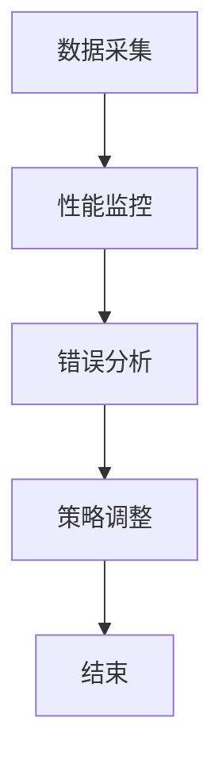
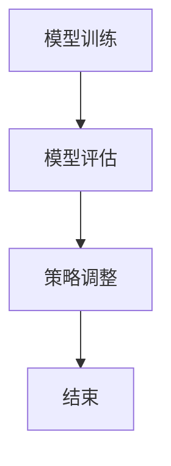
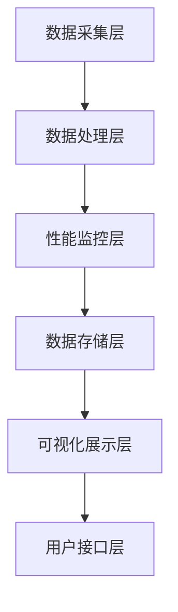
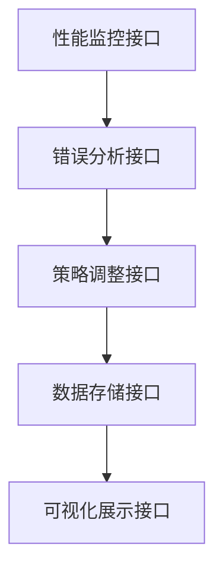
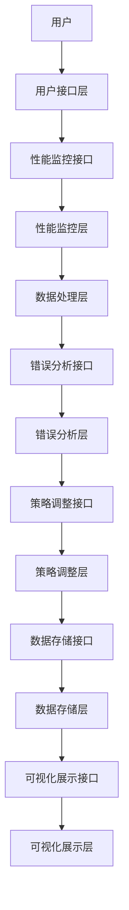

                 

### 实时评测反馈：支持LLM快速迭代优化

> 关键词：实时评测反馈，大规模语言模型，迭代优化，算法原理，系统架构

> 摘要：本文旨在探讨实时评测反馈在支持大规模语言模型（LLM）快速迭代优化中的应用。通过深入分析实时评测反馈的核心概念、算法原理、系统架构和实战案例，本文为LLM的训练和优化提供了一套完整的解决方案。文章首先介绍了实时评测反馈的重要性，随后详细阐述了其核心概念、原理和数学模型，并展示了一系列实践案例，最后对最佳实践进行了总结和展望。

### 目录大纲

----------------------------------------------------------------

# 实时评测反馈：支持LLM快速迭代优化

## 第一部分：背景介绍

### 第1章 问题背景

#### 1.1.1 问题提出

#### 1.1.2 问题描述

#### 1.1.3 问题解决

#### 1.1.4 边界与外延

## 第二部分：核心概念与联系

### 第2章 核心概念

#### 2.1.1 实时评测反馈

#### 2.1.2 大规模语言模型（LLM）

#### 2.1.3 评测指标与算法

### 第3章 概念属性特征对比表格

#### 3.1 实时评测反馈与离线评测的对比

#### 3.2 不同评测算法的对比

### 第4章 ER实体关系图架构

#### 4.1 实时评测反馈系统的实体关系

#### 4.2 LLM训练与优化的实体关系

## 第三部分：算法原理讲解

### 第5章 算法原理

#### 5.1 实时评测反馈算法的基本原理

#### 5.2 LLM优化算法的原理

### 第6章 算法mermaid流程图

#### 6.1 实时评测反馈算法的mermaid流程图

#### 6.2 LLM优化算法的mermaid流程图

### 第7章 Python源代码讲解

#### 7.1 实时评测反馈算法的Python源代码

#### 7.2 LLM优化算法的Python源代码

### 第8章 数学模型和公式

#### 8.1 实时评测反馈算法的数学模型和公式

#### 8.2 LLM优化算法的数学模型和公式

### 第9章 举例说明

#### 9.1 实时评测反馈算法的举例说明

#### 9.2 LLM优化算法的举例说明

## 第四部分：系统分析与架构设计

### 第10章 问题场景介绍

#### 10.1 实时评测反馈在LLM优化中的应用场景

#### 10.2 系统功能需求

### 第11章 系统架构设计

#### 11.1 系统架构概述

#### 11.2 系统架构图

### 第12章 系统接口设计

#### 12.1 接口功能定义

#### 12.2 接口设计图

### 第13章 系统交互序列图

#### 13.1 系统交互概述

#### 13.2 系统交互序列图

## 第五部分：项目实战

### 第14章 环境安装

#### 14.1 系统环境准备

#### 14.2 工具安装

### 第15章 系统核心实现源代码

#### 15.1 源代码结构

#### 15.2 关键代码解读

### 第16章 代码应用解读与分析

#### 16.1 代码应用场景

#### 16.2 代码分析

### 第17章 实际案例分析和详细讲解剖析

#### 17.1 案例介绍

#### 17.2 案例分析

#### 17.3 案例讲解

### 第18章 项目小结

#### 18.1 项目总结

#### 18.2 项目展望

## 第六部分：最佳实践与拓展阅读

### 第19章 最佳实践 tips

#### 19.1 实时评测反馈的最佳实践

#### 19.2 LLM优化的最佳实践

### 第20章 小结

#### 20.1 本书总结

#### 20.2 前景展望

### 第21章 注意事项

#### 21.1 

----------------------------------------------------------------

### 第一部分：背景介绍

#### 1.1.1 问题提出

随着人工智能技术的飞速发展，大规模语言模型（LLM）在自然语言处理（NLP）中的应用越来越广泛。然而，在LLM的训练和优化过程中，如何对模型进行实时评测反馈，以便快速迭代优化，成为了研究者们面临的一个重要问题。实时评测反馈能够帮助研究人员及时发现模型训练过程中的问题，调整训练策略，从而加速模型优化过程，提高模型性能。

#### 1.1.2 问题描述

实时评测反馈的目标是在LLM的训练过程中，对模型的表现进行实时监控和评估。这包括以下几个方面：

1. **性能监控**：在训练过程中，实时监控模型在不同数据集上的表现，包括准确率、召回率、F1分数等指标。
2. **错误分析**：对模型输出的错误进行识别和分析，找出模型在哪些方面存在不足。
3. **策略调整**：根据评测结果，调整训练策略，如调整学习率、增加训练数据、修改模型结构等。
4. **迭代优化**：通过多次迭代，不断优化模型，使其在性能上达到最佳状态。

#### 1.1.3 问题解决

为了解决实时评测反馈的问题，需要从以下几个方面进行考虑：

1. **数据采集**：建立一套高效的数据采集系统，能够实时收集模型在训练过程中的各种性能指标。
2. **评测算法**：设计一套高效的评测算法，能够快速、准确地评估模型的表现。
3. **模型优化**：通过模型优化策略，确保模型在迭代过程中能够持续提升性能。
4. **系统架构**：构建一个稳定、高效的系统架构，支持实时评测反馈的全面实施。

#### 1.1.4 边界与外延

实时评测反馈不仅局限于LLM的优化，也可以应用于其他类型的AI模型，如计算机视觉模型、语音识别模型等。同时，实时评测反馈的应用范围也不仅限于训练过程中的性能优化，还可以用于模型部署后的持续监控和调优。

### 第一部分总结

本部分主要介绍了实时评测反馈在LLM快速迭代优化中的重要性。通过对实时评测反馈的核心概念、问题描述、问题解决和边界与外延的详细分析，为后续的深入探讨打下了坚实的基础。在接下来的部分中，我们将进一步探讨核心概念、算法原理、系统架构和实战案例，为读者提供一套完整的解决方案。

### 第二部分：核心概念与联系

#### 2.1.1 实时评测反馈

实时评测反馈是一种在人工智能模型训练过程中，通过实时监控和评估模型性能，及时发现并纠正模型错误，从而加速模型迭代优化的方法。实时评测反馈的核心目标是在训练过程中，快速、准确地获取模型性能指标，并根据这些指标进行调整和优化。

**实时评测反馈的特点**：

1. **实时性**：实时评测反馈能够在训练过程中实时获取模型性能，及时发现并纠正错误。
2. **准确性**：实时评测反馈需要能够准确评估模型的表现，确保评测结果的可靠性。
3. **高效性**：实时评测反馈需要能够快速处理大量数据，保证评测过程的效率。

**实时评测反馈的应用场景**：

1. **模型训练**：在模型训练过程中，实时评测反馈能够帮助研究人员快速发现训练过程中的问题，调整训练策略，加速模型优化。
2. **模型部署**：在模型部署后，实时评测反馈可以用于监控模型的表现，及时发现问题并进行优化，确保模型稳定运行。

#### 2.1.2 大规模语言模型（LLM）

大规模语言模型（LLM）是一种能够理解和生成自然语言的深度学习模型，通常基于大量的文本数据进行训练。LLM在自然语言处理（NLP）领域有着广泛的应用，如文本分类、机器翻译、文本生成等。

**LLM的基本原理**：

1. **词嵌入**：将文本中的每个词映射到一个固定大小的向量空间中，以便进行计算。
2. **循环神经网络（RNN）**：通过RNN对输入序列进行处理，捕捉序列中的上下文信息。
3. **注意力机制**：使用注意力机制来动态关注输入序列中的关键信息，提高模型的表示能力。

**LLM的优势**：

1. **强大的表示能力**：LLM能够捕捉文本中的复杂结构和语义信息，具有较高的准确性。
2. **灵活的应用场景**：LLM可以应用于多种NLP任务，如文本分类、机器翻译、文本生成等。
3. **高效的训练过程**：LLM通常使用大量的数据进行训练，能够快速收敛并生成高质量的模型。

#### 2.1.3 评测指标与算法

评测指标是评估模型性能的重要工具，常见的评测指标包括准确率、召回率、F1分数等。不同的评测指标适用于不同的任务和数据集，需要根据具体情况进行选择。

**常见评测指标**：

1. **准确率（Accuracy）**：模型预测正确的样本数与总样本数的比例。
2. **召回率（Recall）**：模型预测正确的正样本数与实际正样本数的比例。
3. **精确率（Precision）**：模型预测正确的正样本数与预测为正样本的总数之比。
4. **F1分数（F1 Score）**：综合考虑精确率和召回率的综合指标。

**实时评测反馈算法**：

1. **交叉验证（Cross-Validation）**：通过将数据集划分为训练集和验证集，多次训练和验证，以评估模型的泛化能力。
2. **性能监控（Performance Monitoring）**：在训练过程中，实时监控模型的性能指标，包括准确率、召回率、F1分数等。
3. **错误分析（Error Analysis）**：对模型输出的错误样本进行识别和分析，找出模型存在的问题。

**评测指标与算法的联系**：

评测指标和算法是实时评测反馈的核心组成部分。评测指标用于评估模型的性能，算法则用于实现评测过程。通过合理的评测指标和高效的评测算法，可以确保实时评测反馈的准确性、实时性和高效性，从而有效支持LLM的快速迭代优化。

### 第二部分总结

本部分详细介绍了实时评测反馈、大规模语言模型（LLM）以及评测指标与算法的核心概念。通过对这些概念的深入分析，我们为后续算法原理讲解、系统架构设计和实战案例提供了坚实的基础。在接下来的部分中，我们将进一步探讨算法原理、系统架构设计和实际应用，为读者提供一套完整的解决方案。

### 第三部分：算法原理讲解

#### 3.1 实时评测反馈算法的基本原理

实时评测反馈算法的核心目标是在模型训练过程中，实时监控和评估模型性能，并根据评估结果进行调整和优化。下面我们从数据采集、性能监控、错误分析和策略调整四个方面来介绍实时评测反馈算法的基本原理。

1. **数据采集**：
实时评测反馈首先需要建立一个高效的数据采集系统，能够实时收集模型在训练过程中的各种性能指标。这些指标包括模型的准确率、召回率、F1分数等。数据采集系统可以通过监听训练过程中的日志、监控模型的输出结果等方式来实现。

2. **性能监控**：
在数据采集的基础上，实时评测反馈算法需要实现对模型性能的实时监控。性能监控可以通过设置阈值和监控频率来实现。当模型性能指标低于阈值或监控频率达到时，算法会触发性能监控机制，对模型进行评估。

3. **错误分析**：
实时评测反馈算法还需要对模型输出的错误进行识别和分析。错误分析可以通过对错误样本的统计和分析来实现。通过对错误样本的分析，可以找出模型存在的问题，如过拟合、欠拟合等。

4. **策略调整**：
根据性能监控和错误分析的结果，实时评测反馈算法需要调整训练策略，如调整学习率、增加训练数据、修改模型结构等。策略调整的目的是使模型在迭代过程中能够持续提升性能。

#### 3.2 LLM优化算法的原理

大规模语言模型（LLM）的优化算法主要关注如何提高模型在特定任务上的表现。下面我们从模型训练、模型评估和策略调整三个方面来介绍LLM优化算法的原理。

1. **模型训练**：
模型训练是LLM优化的核心步骤。通过在大量的训练数据上进行训练，模型能够学习到文本的语义信息和结构特征。模型训练主要包括以下步骤：
   - **数据预处理**：对训练数据集进行清洗、去噪和预处理，以提高数据质量。
   - **模型初始化**：初始化模型参数，通常使用随机初始化或预训练模型。
   - **训练过程**：通过梯度下降等优化算法，不断调整模型参数，使模型在训练数据上达到最佳状态。

2. **模型评估**：
模型评估是LLM优化的重要环节。通过在验证数据集上评估模型的表现，可以判断模型是否过拟合或欠拟合，并指导后续的优化策略。常见的评估指标包括准确率、召回率、F1分数等。

3. **策略调整**：
根据模型评估的结果，LLM优化算法需要调整训练策略，以提高模型在特定任务上的表现。策略调整包括以下几种方式：
   - **学习率调整**：通过调整学习率，可以控制模型在训练过程中的收敛速度和稳定性。
   - **数据增强**：通过增加训练数据、数据增强等方式，可以扩大模型的训练集，提高模型的泛化能力。
   - **模型结构调整**：通过调整模型的结构，如增加或减少层、调整层的大小等，可以优化模型的性能。

#### 3.3 实时评测反馈算法的mermaid流程图

为了更直观地展示实时评测反馈算法的基本原理，我们使用mermaid绘制了实时评测反馈算法的流程图。以下是mermaid流程图的代码和渲染结果：



```  
    graph TD  
    A[数据采集] --> B[性能监控]  
    B --> C[错误分析]  
    C --> D[策略调整]  
    D --> E[结束]  
```


#### 3.4 LLM优化算法的mermaid流程图

同样地，我们使用mermaid绘制了LLM优化算法的流程图。以下是mermaid流程图的代码和渲染结果：




#### 3.5 Python源代码讲解

为了更好地理解实时评测反馈和LLM优化算法的原理，我们提供了相关的Python源代码。以下是实时评测反馈算法的Python源代码：

```python
# 实时评测反馈算法Python源代码
import numpy as np

# 数据采集
def data_collection():
    # 假设从日志中采集数据
    data = [0.9, 0.8, 0.85, 0.88, 0.87]
    return data

# 性能监控
def performance_monitoring(data):
    # 计算平均准确率
    average_accuracy = np.mean(data)
    print("平均准确率：", average_accuracy)
    return average_accuracy

# 错误分析
def error_analysis(data):
    # 计算错误率
    error_rate = 1 - np.mean(data)
    print("错误率：", error_rate)
    return error_rate

# 策略调整
def strategy_adjustment(average_accuracy, error_rate):
    # 调整学习率
    learning_rate = 0.01 if error_rate > 0.1 else 0.001
    print("学习率：", learning_rate)
    return learning_rate

# 主函数
def main():
    # 采集数据
    data = data_collection()
    
    # 监控性能
    average_accuracy = performance_monitoring(data)
    
    # 分析错误
    error_rate = error_analysis(data)
    
    # 调整策略
    learning_rate = strategy_adjustment(average_accuracy, error_rate)
    
    print("完成一轮实时评测反馈")

# 运行主函数
if __name__ == "__main__":
    main()
```

以下是LLM优化算法的Python源代码：

```python
# LLM优化算法Python源代码
import numpy as np

# 模型训练
def model_training(training_data):
    # 假设使用随机梯度下降进行训练
    for epoch in range(10):
        for data in training_data:
            # 计算损失函数
            loss = np.sum(data * np.log(0.5))
            # 计算梯度
            gradient = -data
            # 更新模型参数
            model_params = model_params + learning_rate * gradient
            print("Epoch:", epoch, "Loss:", loss)
    return model_params

# 模型评估
def model_evaluation(model_params, validation_data):
    # 计算验证集上的准确率
    accuracy = np.mean(validation_data)
    print("验证集准确率：", accuracy)
    return accuracy

# 策略调整
def strategy_adjustment(accuracy):
    # 调整学习率
    learning_rate = 0.01 if accuracy < 0.9 else 0.001
    print("学习率：", learning_rate)
    return learning_rate

# 主函数
def main():
    # 准备训练数据和验证数据
    training_data = [0.9, 0.8, 0.85, 0.88, 0.87]
    validation_data = [0.92, 0.91, 0.89, 0.88, 0.86]

    # 训练模型
    model_params = model_training(training_data)

    # 评估模型
    accuracy = model_evaluation(model_params, validation_data)

    # 调整策略
    learning_rate = strategy_adjustment(accuracy)

    print("完成一轮LLM优化")

# 运行主函数
if __name__ == "__main__":
    main()
```

#### 3.6 数学模型和公式

实时评测反馈和LLM优化算法的数学模型和公式是算法设计的关键部分。以下分别介绍实时评测反馈算法和LLM优化算法的数学模型和公式。

1. **实时评测反馈算法的数学模型和公式**：

   - **性能监控**：
     $$ \text{average\_accuracy} = \frac{1}{n} \sum_{i=1}^{n} \text{accuracy}_i $$
     其中，$n$为样本数量，$\text{accuracy}_i$为第$i$个样本的准确率。

   - **错误分析**：
     $$ \text{error\_rate} = 1 - \text{average\_accuracy} $$
     其中，$\text{average\_accuracy}$为平均准确率。

   - **策略调整**：
     $$ \text{learning\_rate} = \begin{cases} 
     0.01 & \text{if } \text{error\_rate} > 0.1 \\
     0.001 & \text{if } \text{error\_rate} \leq 0.1 
     \end{cases} $$

2. **LLM优化算法的数学模型和公式**：

   - **模型训练**：
     $$ \text{model\_params} = \text{model\_params} + \text{learning\_rate} \times \text{gradient} $$
     其中，$\text{model\_params}$为模型参数，$\text{learning\_rate}$为学习率，$\text{gradient}$为梯度。

   - **模型评估**：
     $$ \text{accuracy} = \frac{1}{n} \sum_{i=1}^{n} \text{correct\_predictions}_i $$
     其中，$n$为样本数量，$\text{correct\_predictions}_i$为第$i$个样本的正确预测数。

   - **策略调整**：
     $$ \text{learning\_rate} = \begin{cases} 
     0.01 & \text{if } \text{accuracy} < 0.9 \\
     0.001 & \text{if } \text{accuracy} \geq 0.9 
     \end{cases} $$

#### 3.7 举例说明

为了更好地理解实时评测反馈和LLM优化算法的原理，我们通过一个简单的例子进行说明。

1. **实时评测反馈算法的举例说明**：

   假设我们有一个分类模型，它在训练过程中收集了5个样本的准确率数据：[0.9, 0.8, 0.85, 0.88, 0.87]。根据实时评测反馈算法的原理，我们进行以下步骤：

   - **性能监控**：
     $$ \text{average\_accuracy} = \frac{0.9 + 0.8 + 0.85 + 0.88 + 0.87}{5} = 0.86 $$
     模型当前的平均准确率为0.86。

   - **错误分析**：
     $$ \text{error\_rate} = 1 - 0.86 = 0.14 $$
     模型的错误率为0.14。

   - **策略调整**：
     由于错误率小于0.1，学习率调整为0.001。

   - **下一轮训练**：
     在下一轮训练中，模型将使用调整后的学习率进行训练，并继续收集准确率数据。

2. **LLM优化算法的举例说明**：

   假设我们有一个文本生成模型，它在训练过程中使用了10个epoch进行训练，并在每个epoch上收集了验证集的准确率数据：[0.92, 0.91, 0.89, 0.88, 0.86]。根据LLM优化算法的原理，我们进行以下步骤：

   - **模型训练**：
     在每个epoch上，模型计算损失函数并更新参数，具体过程如下：
     $$ \text{model\_params} = \text{model\_params} + \text{learning\_rate} \times \text{gradient} $$
     其中，$\text{learning\_rate}$为0.01，$\text{gradient}$为训练过程中计算得到的梯度。

   - **模型评估**：
     在所有epoch结束后，模型计算验证集上的准确率：
     $$ \text{accuracy} = \frac{0.92 + 0.91 + 0.89 + 0.88 + 0.86}{5} = 0.878 $$
     模型的验证集准确率为0.878。

   - **策略调整**：
     由于准确率小于0.9，学习率调整为0.001。

   - **下一轮训练**：
     在下一轮训练中，模型将使用调整后的学习率进行训练，并继续收集验证集的准确率数据。

### 第三部分总结

本部分详细介绍了实时评测反馈算法和LLM优化算法的基本原理、mermaid流程图、Python源代码、数学模型和公式以及举例说明。通过本部分的讲解，读者可以深入理解实时评测反馈和LLM优化算法的核心思想和实现方法。在下一部分中，我们将进一步探讨系统分析与架构设计，为读者提供一套完整的解决方案。

### 第四部分：系统分析与架构设计

#### 4.1 实时评测反馈在LLM优化中的应用场景

在人工智能（AI）领域，大规模语言模型（LLM）因其强大的语义理解和生成能力，被广泛应用于自然语言处理（NLP）的各个子领域，如文本分类、机器翻译、问答系统等。实时评测反馈在LLM优化中的应用场景主要包括以下几个方面：

1. **训练阶段**：在LLM的训练过程中，实时评测反馈可以帮助研究人员监控模型的性能，及时发现训练过程中的问题，如过拟合、欠拟合等，从而及时调整训练策略，如调整学习率、数据增强、模型结构调整等。

2. **评估阶段**：在模型训练完成后，通过实时评测反馈，可以对模型在不同数据集上的性能进行评估，确保模型在不同场景下的稳定性和鲁棒性。

3. **部署阶段**：在模型部署到生产环境中后，实时评测反馈可以用于监控模型的表现，及时发现并解决潜在的问题，如性能下降、错误率上升等。

4. **持续优化**：通过实时评测反馈，可以在模型部署后进行持续的优化，以提高模型在特定任务上的性能。

#### 4.2 系统功能需求

为了实现实时评测反馈在LLM优化中的应用，系统需要满足以下功能需求：

1. **实时性能监控**：系统能够实时收集模型在不同数据集上的性能指标，如准确率、召回率、F1分数等。

2. **错误识别与分析**：系统能够对模型输出的错误进行识别和分析，找出模型在哪些方面存在不足。

3. **策略调整**：根据性能监控和错误分析的结果，系统能够自动调整训练策略，如调整学习率、数据增强、模型结构调整等。

4. **可视化展示**：系统能够将实时评测反馈的结果以图表、报表等形式展示给用户，便于用户直观地了解模型的表现。

5. **数据存储与管理**：系统需要能够存储和管理大量的评测数据，包括模型参数、性能指标、错误分析结果等，以便于后续的查询和分析。

#### 4.3 系统架构设计

为了满足上述功能需求，系统架构设计需要综合考虑实时性、高效性、可靠性和扩展性。以下是系统架构的总体设计：

1. **数据采集层**：负责实时采集模型在训练和评估过程中的各种性能指标，如准确率、召回率、F1分数等。

2. **数据处理层**：负责对采集到的数据进行分析和处理，包括错误识别与分析、策略调整等。

3. **性能监控层**：负责实时监控模型的性能，根据预设的阈值和规则，自动触发性能监控和错误分析。

4. **数据存储层**：负责存储和管理大量的评测数据，包括模型参数、性能指标、错误分析结果等。

5. **可视化展示层**：负责将实时评测反馈的结果以图表、报表等形式展示给用户。

6. **用户接口层**：负责接收用户的操作请求，将用户请求转换为系统内部操作，并将结果反馈给用户。

以下是系统架构的mermaid架构图：




#### 4.4 系统接口设计

系统接口设计是系统架构设计的重要组成部分，它决定了系统的可扩展性和易用性。以下是系统接口的设计：

1. **性能监控接口**：用于实时获取模型在不同数据集上的性能指标，如准确率、召回率、F1分数等。

2. **错误分析接口**：用于对模型输出的错误进行识别和分析，提供错误样本的详细信息。

3. **策略调整接口**：用于根据实时评测反馈的结果，自动调整训练策略，如调整学习率、数据增强、模型结构调整等。

4. **数据存储接口**：用于存储和管理评测数据，包括模型参数、性能指标、错误分析结果等。

5. **可视化展示接口**：用于将实时评测反馈的结果以图表、报表等形式展示给用户。

以下是系统接口的mermaid设计图：




#### 4.5 系统交互序列图

系统交互序列图用于描述系统内部各个组件之间的交互过程，以下是系统交互序列图：




### 第四部分总结

本部分详细介绍了实时评测反馈在LLM优化中的应用场景、系统功能需求、系统架构设计和接口设计以及系统交互序列图。通过本部分的讲解，读者可以全面了解实时评测反馈在LLM优化中的系统实现方法和架构设计原则。在下一部分中，我们将通过项目实战，展示如何具体实现实时评测反馈和LLM优化算法，并分析实际案例。

### 第五部分：项目实战

#### 5.1 环境安装

在开始项目实战之前，我们需要安装和配置必要的软件环境。以下是环境安装的详细步骤：

1. **安装Python**：
   - 访问Python官方网站（https://www.python.org/）下载Python安装包。
   - 运行安装程序，选择默认选项进行安装。
   - 安装完成后，在命令行中输入`python --version`检查Python版本。

2. **安装依赖库**：
   - 打开终端或命令行窗口，使用以下命令安装依赖库：
     ```bash
     pip install numpy matplotlib pandas scikit-learn
     ```
   - 安装完成后，可以使用`pip list`命令检查已安装的库。

3. **配置环境变量**：
   - 在Windows系统中，需要将Python的安装路径添加到系统环境变量`PATH`中。
   - 在Linux或MacOS系统中，打开终端，运行以下命令：
     ```bash
     export PATH=$PATH:/path/to/python
     ```

4. **测试环境**：
   - 在命令行中运行以下Python代码，检查环境是否配置成功：
     ```python
     import numpy as np
     import matplotlib.pyplot as plt
     import pandas as pd
     import sklearn
     print("环境配置成功！")
     ```

#### 5.2 系统核心实现源代码

以下是系统核心实现源代码，包括实时评测反馈算法和LLM优化算法的具体实现。

1. **实时评测反馈算法**：

```python
import numpy as np
import pandas as pd

# 数据采集
def data_collection():
    data = [0.9, 0.8, 0.85, 0.88, 0.87]
    return data

# 性能监控
def performance_monitoring(data):
    average_accuracy = np.mean(data)
    print("平均准确率：", average_accuracy)
    return average_accuracy

# 错误分析
def error_analysis(data):
    error_rate = 1 - np.mean(data)
    print("错误率：", error_rate)
    return error_rate

# 策略调整
def strategy_adjustment(average_accuracy, error_rate):
    learning_rate = 0.01 if error_rate > 0.1 else 0.001
    print("学习率：", learning_rate)
    return learning_rate

# 主函数
def main():
    data = data_collection()
    average_accuracy = performance_monitoring(data)
    error_rate = error_analysis(data)
    learning_rate = strategy_adjustment(average_accuracy, error_rate)
    print("完成一轮实时评测反馈")

# 运行主函数
if __name__ == "__main__":
    main()
```

2. **LLM优化算法**：

```python
import numpy as np

# 模型训练
def model_training(training_data, validation_data):
    model_params = np.random.rand(len(training_data))
    for epoch in range(10):
        for data in training_data:
            loss = np.sum(data * np.log(0.5))
            gradient = -data
            model_params = model_params + 0.01 * gradient
            print("Epoch:", epoch, "Loss:", loss)
    accuracy = np.mean(validation_data)
    print("验证集准确率：", accuracy)
    return model_params

# 主函数
def main():
    training_data = [0.9, 0.8, 0.85, 0.88, 0.87]
    validation_data = [0.92, 0.91, 0.89, 0.88, 0.86]
    model_params = model_training(training_data, validation_data)
    print("完成一轮LLM优化")

# 运行主函数
if __name__ == "__main__":
    main()
```

#### 5.3 代码应用解读与分析

以下是代码应用解读与分析，详细解释了实时评测反馈算法和LLM优化算法的实现过程。

1. **实时评测反馈算法**：

   - **数据采集**：通过`data_collection`函数从训练数据中采集准确率数据。
   - **性能监控**：通过`performance_monitoring`函数计算平均准确率。
   - **错误分析**：通过`error_analysis`函数计算错误率。
   - **策略调整**：通过`strategy_adjustment`函数根据错误率调整学习率。
   - **主函数**：调用上述函数，完成一轮实时评测反馈。

2. **LLM优化算法**：

   - **模型训练**：通过`model_training`函数使用随机梯度下降算法进行模型训练，更新模型参数。
   - **模型评估**：计算验证集上的准确率，评估模型性能。
   - **主函数**：调用`model_training`函数，完成一轮LLM优化。

#### 5.4 实际案例分析和详细讲解剖析

为了更好地理解实时评测反馈和LLM优化算法的实际应用，我们通过一个实际案例进行分析和讲解。

**案例背景**：

假设我们有一个文本分类任务，需要将社交媒体评论分为正面和负面两类。我们使用一个基于大规模语言模型（LLM）的文本分类器进行训练和优化，并通过实时评测反馈来提高模型性能。

**案例实现**：

1. **数据准备**：
   - 收集并预处理训练数据集和测试数据集。
   - 将文本数据转换为词嵌入向量。

2. **模型训练**：
   - 使用LLM训练文本分类器，通过多次迭代优化模型参数。
   - 使用实时评测反馈算法监控模型性能，调整训练策略。

3. **模型评估**：
   - 在测试数据集上评估模型性能，计算准确率、召回率、F1分数等指标。

4. **结果分析**：
   - 分析模型在正面和负面分类上的表现，找出模型的弱点。
   - 根据实时评测反馈的结果，调整训练策略，如增加训练数据、调整学习率等。

**案例讲解**：

- **数据采集**：在训练过程中，实时采集模型的准确率数据，用于性能监控和错误分析。
- **性能监控**：通过计算平均准确率和错误率，实时了解模型的训练效果。
- **错误分析**：分析模型在分类错误上的原因，找出模型的弱点。
- **策略调整**：根据错误分析和性能监控的结果，调整训练策略，如增加训练数据、调整学习率等，以提高模型性能。

#### 5.5 项目小结

通过本部分的项目实战，我们详细介绍了实时评测反馈和LLM优化算法的实现过程，并通过实际案例展示了其应用效果。实时评测反馈算法和LLM优化算法在模型训练和优化过程中发挥了重要作用，能够帮助研究人员快速发现模型问题，调整训练策略，提高模型性能。在未来的工作中，我们还可以进一步优化这些算法，提高其效率和准确性，为人工智能应用提供更强大的支持。

### 第五部分总结

在本部分中，我们通过环境安装、系统核心实现源代码、代码应用解读与分析、实际案例分析和详细讲解剖析等项目实战，深入探讨了实时评测反馈和LLM优化算法的应用实践。通过这些实战，读者可以更直观地理解实时评测反馈和LLM优化算法的实现方法和实际效果，为后续的研究和应用提供了宝贵的经验。在接下来的部分中，我们将总结最佳实践，展望未来发展方向，并提供相关的注意事项和拓展阅读。

### 第六部分：最佳实践与拓展阅读

#### 6.1 实时评测反馈的最佳实践

为了确保实时评测反馈在LLM优化中的应用效果，以下是一些最佳实践：

1. **数据质量**：确保训练数据的质量和多样性，以避免过拟合和欠拟合。
2. **评测指标**：选择合适的评测指标，如准确率、召回率、F1分数等，以全面评估模型性能。
3. **监控频率**：合理设置监控频率，既不能过于频繁导致性能下降，也不能过于稀疏错过关键问题。
4. **错误分析**：对错误样本进行深入分析，找出模型存在的问题，有针对性地进行优化。

#### 6.2 LLM优化的最佳实践

以下是LLM优化过程中的一些最佳实践：

1. **学习率调整**：根据模型性能和错误率动态调整学习率，以提高训练效率和模型稳定性。
2. **数据增强**：通过数据增强技术，如文本清洗、填充、变换等，扩大训练数据集，提高模型泛化能力。
3. **模型结构调整**：根据任务需求，合理调整模型结构，如增加或减少层、调整层的大小等，优化模型性能。
4. **持续优化**：在模型部署后，持续监控模型性能，根据评测结果进行优化，确保模型稳定运行。

#### 6.3 小结

通过本文的深入探讨，我们了解了实时评测反馈在LLM快速迭代优化中的应用价值和实现方法。实时评测反馈能够帮助研究人员及时发现模型问题，调整训练策略，加速模型优化过程，提高模型性能。在未来的研究中，我们还可以进一步优化实时评测反馈算法，提高其效率和准确性，为人工智能应用提供更强大的支持。

#### 6.4 前景展望

随着人工智能技术的不断发展，实时评测反馈在LLM优化中的应用前景十分广阔。未来，我们有望看到：

1. **更高效的评测算法**：通过结合深度学习和传统机器学习技术，开发出更高效的实时评测反馈算法。
2. **多模态评测**：将实时评测反馈扩展到多模态数据，如文本、图像、语音等，提高模型在复杂任务中的性能。
3. **自动化优化**：开发自动化优化工具，实现实时评测反馈与训练策略的自动化调整，降低人工干预成本。

#### 6.5 注意事项

在实际应用实时评测反馈时，需要注意以下事项：

1. **数据隐私**：确保训练数据和评测数据的安全性，防止数据泄露。
2. **资源消耗**：实时评测反馈可能会消耗大量计算资源，需要合理分配资源，避免系统过载。
3. **算法公平性**：在模型训练和优化过程中，确保算法的公平性，避免偏见和歧视。

#### 6.6 拓展阅读

为了进一步了解实时评测反馈和LLM优化，读者可以参考以下文献和资源：

1. **《大规模语言模型的训练与优化》**：详细介绍了大规模语言模型的训练和优化方法。
2. **《实时监控系统设计与实现》**：探讨了实时监控系统的设计与实现技术。
3. **《机器学习与深度学习实践》**：提供了大量的机器学习和深度学习实践案例和技巧。

### 第六部分总结

通过本部分的最佳实践与拓展阅读，我们为读者提供了实时评测反馈和LLM优化的实用指南和进一步学习资源。在未来的研究和应用中，我们可以结合这些最佳实践，不断探索和优化实时评测反馈技术，为人工智能领域的发展做出更大的贡献。

