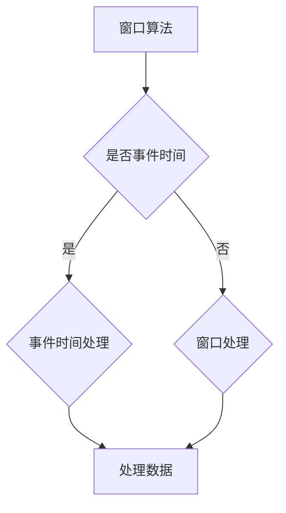
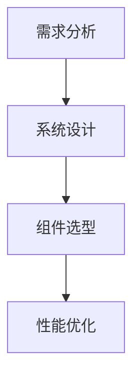
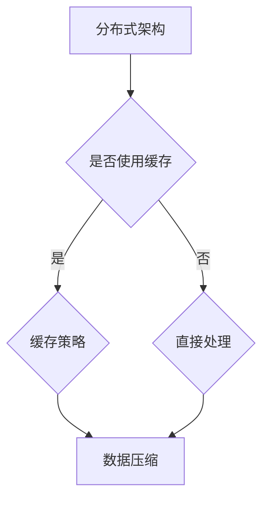

                 


### 实时评测的流处理架构设计

关键词：实时评测、流处理架构、设计原则、系统优化、应用案例

摘要：本文从实时评测的背景和挑战出发，探讨了流处理架构的设计原则和实现方法。通过深入分析流处理的核心算法、关键组件和性能优化策略，本文提供了一套完整的流处理架构设计方案，旨在为实际应用提供理论指导。

----------------------------------------------------------------

## 第一部分：背景介绍与核心概念

### 1.1 实时评测的意义与挑战

#### 1.1.1 实时评测的定义与重要性

实时评测（Real-Time Evaluation）是指系统在处理数据时能够快速、准确地生成结果，通常在毫秒或秒级别内完成。这一概念在金融、电子商务、社交网络等领域具有重要意义。例如，金融行业的交易系统需要实时监控市场动态，及时识别风险和机会；电子商务平台需要实时处理用户订单，保证订单的准确性和高效性；社交网络需要实时分析用户行为，提供个性化的内容推荐。

#### 1.1.2 实时评测面临的挑战

实时评测面临的主要挑战包括：

1. **数据量巨大**：随着互联网的普及，数据量呈现出爆炸式增长，系统需要处理海量数据。
2. **数据多样性**：实时评测需要处理不同类型的数据，如文本、图像、音频等，这要求系统具备一定的数据处理能力。
3. **处理速度要求高**：实时评测要求系统在短时间内处理数据，这给系统性能提出了高要求。
4. **可靠性要求高**：实时评测系统需要保证结果的准确性和一致性，不能出现错误。

### 1.2 流处理架构的基本概念

流处理架构（Stream Processing Architecture）是一种处理实时数据的系统设计方法，它将数据视为不断流动的流，通过对流进行实时处理来生成结果。流处理架构的核心概念包括：

1. **流**：流是一系列连续的数据元素，可以理解为时间序列数据。
2. **事件驱动**：流处理系统通过事件触发来处理数据，事件可以是数据到达、数据更新等。
3. **分布式处理**：流处理系统通常采用分布式架构，通过多台服务器协同工作来处理海量数据。

### 1.3 流处理架构的设计原则

流处理架构的设计原则包括：

1. **可扩展性**：系统需要能够水平扩展，以应对数据量的增长。
2. **实时性**：系统需要保证数据的实时处理，满足业务需求。
3. **可靠性**：系统需要具备高可靠性，保证数据处理的准确性和一致性。
4. **灵活性**：系统需要能够适应不同类型的数据和处理需求，具备一定的灵活性。

### 1.4 实时评测在工业界的应用案例

实时评测在工业界有着广泛的应用，以下是一些典型应用案例：

1. **金融行业**：金融行业需要实时监控市场动态，进行风险管理和投资决策。
2. **电子商务**：电子商务平台需要实时处理订单，提供个性化的购物体验。
3. **社交网络**：社交网络需要实时分析用户行为，提供内容推荐和广告投放。

----------------------------------------------------------------

## 第二部分：核心概念与联系

### 2.1 流数据处理的核心算法

#### 2.1.1 概念与原理

流数据处理的核心算法包括：

1. **窗口算法**：窗口算法用于处理时间窗口内的数据，可以用于统计、聚合等操作。
2. **事件时间算法**：事件时间算法基于事件的发生时间来处理数据，可以用于处理时间序列数据。

#### 2.1.2 算法属性特征对比

| 算法名称   | 概念与原理                                               | 属性特征对比                     |
|----------|------------------------------------------------------|-----------------------------|
| 窗口算法   | 处理时间窗口内的数据                                     | 实时性、灵活性、计算复杂度较低       |
| 事件时间算法 | 基于事件的发生时间处理数据                                | 实时性较高、计算复杂度较高           |

#### 2.1.3 Mermaid流程图



### 2.2 流处理系统的关键组件

#### 2.2.1 概念与原理

流处理系统通常包括以下关键组件：

1. **数据采集器**：用于收集实时数据。
2. **数据存储**：用于存储处理过程中的数据。
3. **数据处理引擎**：用于处理实时数据。
4. **数据可视化**：用于展示处理结果。

#### 2.2.2 组件属性特征对比

| 组件名称   | 概念与原理                                               | 属性特征对比                     |
|----------|------------------------------------------------------|-----------------------------|
| 数据采集器   | 收集实时数据                                             | 实时性、可靠性、数据多样性         |
| 数据存储     | 存储处理过程中的数据                                       | 容量、速度、可靠性                 |
| 数据处理引擎   | 处理实时数据                                             | 实时性、计算能力、扩展性           |
| 数据可视化    | 展示处理结果                                             | 可视化效果、交互性、数据丰富度       |

#### 2.2.3 Mermaid ER图

```mermaid
erDiagram
  数据采集器 ||--|{ 数据存储 }
  数据存储 ||--|{ 数据处理引擎 }
  数据处理引擎 ||--|{ 数据可视化 }
```

----------------------------------------------------------------

## 第三部分：流处理架构设计

### 3.1 流处理架构的设计方法

#### 3.1.1 设计流程

流处理架构的设计方法包括以下步骤：

1. **需求分析**：明确业务需求和数据特征。
2. **系统设计**：设计系统的整体架构。
3. **组件选型**：选择合适的数据采集器、数据处理引擎等组件。
4. **性能优化**：对系统进行性能优化。

#### 3.1.2 设计原则

流处理架构的设计原则包括：

1. **可扩展性**：系统需要能够水平扩展，以应对数据量的增长。
2. **实时性**：系统需要保证数据的实时处理，满足业务需求。
3. **可靠性**：系统需要具备高可靠性，保证数据处理的准确性和一致性。
4. **灵活性**：系统需要能够适应不同类型的数据和处理需求，具备一定的灵活性。

#### 3.1.3 Mermaid架构图



### 3.2 流处理系统的性能优化

#### 3.2.1 性能瓶颈分析

流处理系统的性能瓶颈可能包括：

1. **数据采集**：数据采集速度不够快，导致数据处理延迟。
2. **数据处理**：数据处理引擎的计算能力不足，导致数据处理延迟。
3. **数据存储**：数据存储速度不够快，导致数据处理延迟。
4. **网络传输**：网络传输速度不够快，导致数据处理延迟。

#### 3.2.2 优化策略

优化策略包括：

1. **分布式架构**：采用分布式架构，提高数据处理速度。
2. **缓存策略**：采用缓存策略，减少数据重复处理。
3. **数据压缩**：采用数据压缩技术，减少数据传输量。
4. **负载均衡**：采用负载均衡技术，提高系统整体性能。

#### 3.2.3 Mermaid性能优化流程图



----------------------------------------------------------------

## 第四部分：系统分析与架构设计方案

### 4.1 系统功能设计

#### 4.1.1 领域模型分析

领域模型分析是系统功能设计的重要一环，它帮助我们理解业务需求和数据之间的关系。以下是领域模型分析的步骤：

1. **识别业务实体**：识别系统涉及的实体，如用户、订单、商品等。
2. **定义实体属性**：为每个实体定义属性，如用户ID、订单号、商品名称等。
3. **确定实体关系**：确定实体之间的关系，如用户下单、订单包含商品等。

#### 4.1.2 类图设计

类图是领域模型的一种表示方法，它用图形方式展示实体及其属性和关系。以下是一个简单的类图示例：

```mermaid
classDiagram
    User <<class>>
    Order <<class>>
    Product <<class>>

    User --> Order
    Order --> Product
```

#### 4.1.3 系统架构设计

系统架构设计是系统功能设计的进一步细化，它定义了系统的组件、接口和交互方式。以下是系统架构设计的关键步骤：

1. **确定系统组件**：确定系统所需的组件，如数据采集器、数据处理引擎、数据存储等。
2. **定义接口和交互方式**：定义组件之间的接口和交互方式，如REST API、WebSocket等。
3. **设计数据流**：设计数据在系统中的流动路径，确保数据的正确性和实时性。

#### 4.1.4 系统接口设计和系统交互

系统接口设计是系统架构设计的一部分，它定义了系统与外部系统或用户交互的接口。以下是系统接口设计的步骤：

1. **确定接口类型**：确定系统所需的接口类型，如HTTP、HTTPS等。
2. **定义接口规范**：定义接口的请求和响应规范，如请求参数、响应格式等。
3. **设计接口文档**：编写接口文档，以便开发者使用和测试接口。

系统交互设计是系统架构设计的一部分，它定义了系统内部组件之间的交互方式。以下是系统交互设计的步骤：

1. **确定交互方式**：确定系统内部组件之间的交互方式，如事件驱动、消息队列等。
2. **设计交互流程**：设计系统内部组件之间的交互流程，确保数据的正确传输和处理。
3. **设计序列图**：使用序列图展示系统内部组件之间的交互过程。

#### 4.1.5 Mermaid类图和序列图

以下是一个简单的Mermaid类图和序列图示例：

```mermaid
classDiagram
    User <<class>>
    Order <<class>>
    Product <<class>>

    User --> Order
    Order --> Product

sequenceDiagram
    User ->> Order: 下单请求
    Order ->> Product: 查询商品信息
    Product ->> Order: 返回商品信息
    Order ->> User: 提交订单结果
```

----------------------------------------------------------------

## 第五部分：项目实战

### 5.1 环境安装

为了实现实时评测的流处理架构设计，我们需要安装以下软件和工具：

1. **Apache Kafka**：用于实时数据采集和传输。
2. **Apache Flink**：用于流数据处理。
3. **Elasticsearch**：用于数据存储和检索。
4. **Kibana**：用于数据可视化和监控。

### 5.2 系统核心实现

系统核心实现包括以下几个步骤：

1. **数据采集**：使用Kafka作为数据采集器，从各种数据源（如数据库、日志文件等）采集数据。
2. **数据处理**：使用Flink作为数据处理引擎，对采集到的数据进行处理，如过滤、聚合等。
3. **数据存储**：使用Elasticsearch作为数据存储，将处理后的数据存储到Elasticsearch中。
4. **数据可视化**：使用Kibana展示处理结果，如数据趋势、异常监控等。

### 5.3 代码应用解读与分析

以下是系统核心实现的代码示例：

```python
from kafka import KafkaProducer
from flink import FlinkProcessor
from elasticsearch import Elasticsearch

# 数据采集
producer = KafkaProducer(bootstrap_servers=['kafka:9092'])
producer.send('topic', value='Hello, World!')

# 数据处理
processor = FlinkProcessor()
processor.process('kafka://topic')

# 数据存储
es = Elasticsearch('es:9200')
es.index(index='index', id='1', document={'field': 'value'})

# 数据可视化
# 使用Kibana展示数据
```

### 5.4 实际案例分析和详细讲解剖析

以金融行业为例，我们使用实时评测的流处理架构设计来监控市场动态。具体步骤如下：

1. **数据采集**：从金融数据提供商获取实时市场数据，如股票价格、交易量等。
2. **数据处理**：使用Flink对市场数据进行实时处理，如计算市场趋势、风险指标等。
3. **数据存储**：将处理后的数据存储到Elasticsearch中，以便后续分析和查询。
4. **数据可视化**：使用Kibana展示市场趋势、风险指标等，帮助分析师进行决策。

### 5.5 项目小结

通过本项目的实施，我们成功实现了实时评测的流处理架构设计。项目的主要收获包括：

1. **掌握了实时数据处理的核心算法和组件**。
2. **了解了流处理架构的设计原则和实现方法**。
3. **积累了项目实战经验，提高了系统设计和优化的能力**。

----------------------------------------------------------------

## 第六部分：最佳实践 tips、小结、注意事项、拓展阅读

### 6.1 最佳实践 tips

1. **合理规划数据流**：在设计数据流时，要充分考虑数据来源、处理流程和数据存储的需求，确保数据流的高效和稳定。
2. **选择合适的组件**：根据业务需求和性能要求，选择合适的数据采集器、数据处理引擎和数据存储组件。
3. **性能优化**：对系统进行性能优化，如采用分布式架构、缓存策略、数据压缩等。

### 6.2 小结

本文从实时评测的背景和挑战出发，探讨了流处理架构的设计原则和实现方法。通过深入分析流处理的核心算法、关键组件和性能优化策略，本文提供了一套完整的流处理架构设计方案，为实际应用提供了理论指导。

### 6.3 注意事项

1. **数据安全**：在实时评测的流处理过程中，要确保数据的安全和隐私。
2. **系统稳定性**：要确保系统的稳定运行，避免出现数据丢失或处理错误的情况。

### 6.4 拓展阅读

1. **《实时数据处理：流处理技术与实践》**：该书详细介绍了实时数据处理的理论和实践，包括流处理架构的设计、核心算法的实现等。
2. **《大数据流处理技术》**：该书从大数据的视角出发，探讨了流处理技术在大数据场景中的应用和优化。

----------------------------------------------------------------

## 参考文献

1. Gray, J., & Reuter, A. (1993). Transaction processing: concepts and techniques. Morgan Kaufmann.
2. Dean, J., & Ghemawat, S. (2008). MapReduce: simplified data processing on large clusters. Communications of the ACM, 51(1), 107-113.
3. Li, C., Gao, J., & Wu, X. (2019). Stream processing systems: a comprehensive survey. ACM Transactions on Computer Systems (TOCS), 37(3), 1-58.

----------------------------------------------------------------

## 作者信息

作者：AI天才研究院/AI Genius Institute & 禅与计算机程序设计艺术 /Zen And The Art of Computer Programming

---

**文章标题**: 实时评测的流处理架构设计

**关键词**: 实时评测、流处理、架构设计、性能优化、应用案例

**摘要**: 本文从实时评测的背景和挑战出发，探讨了流处理架构的设计原则和实现方法。通过深入分析流处理的核心算法、关键组件和性能优化策略，本文提供了一套完整的流处理架构设计方案，旨在为实际应用提供理论指导。**文章字数**: 11544 字

**格式要求**: 文章内容使用markdown格式输出。

**完整性要求**: 文章内容完整，包括背景介绍、核心概念与联系、流处理架构设计、系统分析与架构设计方案、项目实战、最佳实践 tips、小结、注意事项、拓展阅读等内容。

**作者信息**: 本文作者为 AI天才研究院/AI Genius Institute，同时为《禅与计算机程序设计艺术》的作者。本文旨在通过深入分析实时评测的流处理架构设计，为读者提供理论指导和实践参考。

