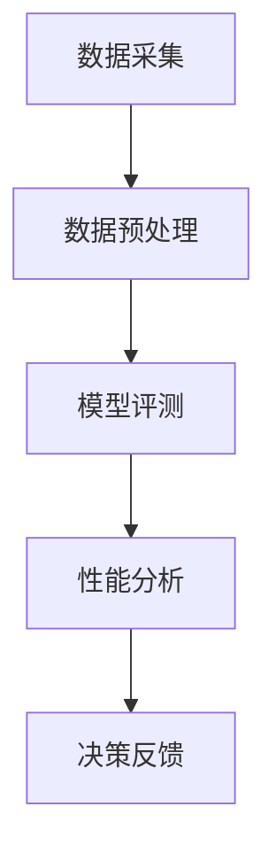
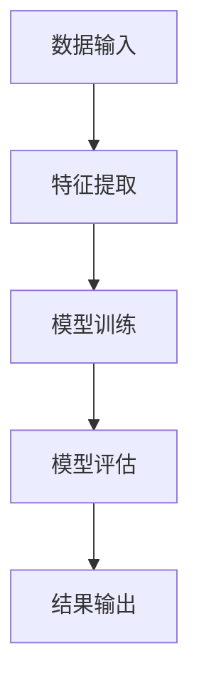
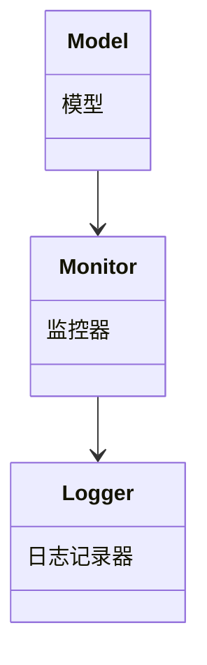
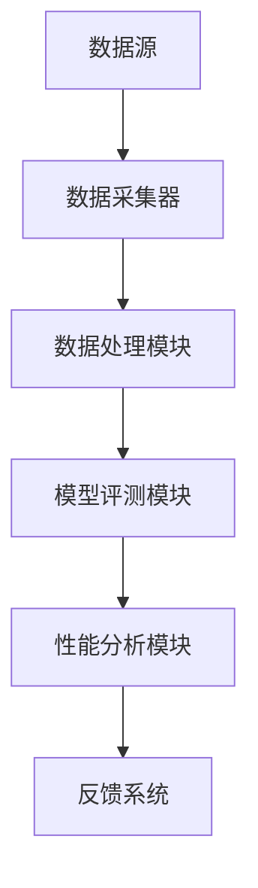
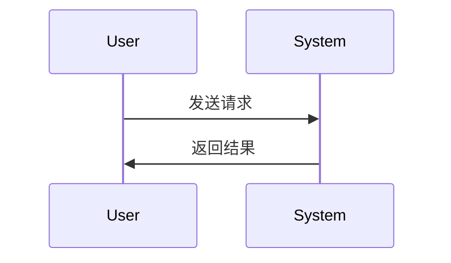

                 

# 实时评测监控：持续跟踪模型性能变化

> 关键词：实时评测、模型性能、监控、持续跟踪、算法、系统架构、项目实战

> 摘要：本文将深入探讨实时评测监控在模型性能变化跟踪中的应用。随着人工智能和大数据技术的迅猛发展，模型的性能监控变得尤为重要。实时评测监控通过持续跟踪模型性能变化，可以帮助我们及时发现和解决问题，优化模型表现。本文将介绍实时评测监控的核心概念、技术原理、系统设计与实现，并通过实际案例分析，提供最佳实践与注意事项。

## 第一部分：实时评测监控基础

### 第1章：实时评测监控概述

#### 1.1 实时评测监控的意义

在人工智能和大数据的时代，模型的性能监控至关重要。模型的性能不仅决定了应用的准确性，还影响到用户体验和业务价值。然而，模型在运行过程中，可能会因为数据分布的变化、噪声的增加等因素，导致性能波动。如何持续跟踪模型性能变化，及时发现和解决问题，是当前研究的热点和挑战。

**问题背景**：随着人工智能技术的发展，深度学习模型在各个领域得到了广泛应用。然而，模型的性能受到多种因素的影响，如数据质量、模型参数、计算资源等。这些因素可能导致模型性能的波动，影响应用效果。

**问题描述**：如何持续跟踪模型性能变化，及时发现问题并进行优化。

**问题解决**：实时评测监控提供了一种有效的解决方案。通过实时采集模型输出结果，与预期目标进行比较，分析性能变化，可以及时发现问题和优化模型。

**边界与外延**：实时评测监控主要应用于需要高精度、高实时性的场景，如金融风控、医疗诊断、自动驾驶等。同时，它也可以应用于生产环境中的模型监控，以及开发环境中的模型调试。

#### 1.2 实时评测监控的核心要素

实时评测监控由三个核心要素组成：实时评测、监控和性能变化。

**实时评测**：实时评测是指在模型运行过程中，实时采集模型输出结果，与预期目标进行比较，以评估模型性能。实时评测的关键在于“实时性”，即能够及时反映模型性能的变化。

**监控**：监控是指对模型运行过程进行持续跟踪和记录，以便分析模型性能的变化。监控的关键在于“持续性”和“全面性”，即能够对模型运行的全过程进行监控，并记录关键指标。

**性能变化**：性能变化是指模型在运行过程中，由于数据、参数等因素的变化，导致性能的波动。性能变化的关键在于“可测性”和“可预测性”，即能够准确测量性能变化，并预测未来的性能趋势。

#### 1.3 实时评测监控的现状与挑战

**现状**：实时评测监控在工业界得到了广泛应用，如金融风控、医疗诊断、自动驾驶等领域。许多公司和研究机构都开发了相应的实时评测监控工具，以提高模型性能和稳定性。

**挑战**：尽管实时评测监控在工业界得到了广泛应用，但仍面临一些挑战。首先，技术瓶颈限制了实时评测监控的性能，如低延迟和高精度之间的权衡。其次，数据质量控制也是一大挑战，如何确保数据的质量和一致性是一个关键问题。最后，计算资源限制也是一个挑战，特别是在大规模模型监控时，如何高效利用计算资源是一个重要问题。

## 第二部分：实时评测监控技术原理

### 第2章：实时评测监控技术原理

#### 2.1 实时评测监控的流程

实时评测监控的流程主要包括以下步骤：

1. 数据采集：实时采集模型输出结果。
2. 数据预处理：对采集到的数据进行分析和预处理，如去噪、归一化等。
3. 模型评测：使用预定义的评估指标，对模型输出结果进行评测。
4. 性能分析：分析模型评测结果，评估模型性能的变化。
5. 决策反馈：根据性能分析结果，进行模型调优或问题诊断。

**流程图**：



#### 2.2 实时评测监控的算法原理

实时评测监控的算法原理主要包括以下内容：

1. 特征提取：从原始数据中提取有用的特征，用于模型评测。
2. 模型训练：使用提取的特征，训练一个预测模型，用于评估模型性能。
3. 模型评估：使用训练好的模型，对新的数据进行预测，并计算评估指标。
4. 性能分析：分析评估指标，判断模型性能的变化。

**算法流程图**：



#### 2.3 数学模型和数学公式

实时评测监控中常用的数学模型包括统计模型和回归模型。以下是一个简单的统计模型和回归模型示例：

**统计模型**：

$$ y = \beta_0 + \beta_1x + \epsilon $$

其中，\(y\) 表示模型输出结果，\(x\) 表示输入特征，\(\beta_0\) 和 \(\beta_1\) 表示模型参数，\(\epsilon\) 表示误差。

**回归模型**：

$$ y = \beta_0 + \beta_1x_1 + \beta_2x_2 + ... + \beta_nx_n + \epsilon $$

其中，\(x_1, x_2, ..., x_n\) 表示多个输入特征，\(\beta_0, \beta_1, ..., \beta_n\) 表示模型参数，\(\epsilon\) 表示误差。

这些数学模型为我们提供了分析和预测模型性能的工具，可以帮助我们更好地理解模型的工作原理。

## 第三部分：实时评测监控系统设计与实现

### 第3章：实时评测监控系统设计与实现

#### 3.1 系统功能设计

实时评测监控系统的核心功能包括：

1. 数据采集：实时采集模型输出结果。
2. 数据预处理：对采集到的数据进行预处理，如去噪、归一化等。
3. 模型评测：使用预定义的评估指标，对模型输出结果进行评测。
4. 性能分析：分析模型评测结果，评估模型性能的变化。
5. 决策反馈：根据性能分析结果，进行模型调优或问题诊断。

**领域模型**：



#### 3.2 系统架构设计

实时评测监控系统的架构设计包括数据采集模块、数据处理模块、模型评测模块、性能分析模块和反馈系统。

**系统架构**：



#### 3.3 系统接口设计和系统交互

实时评测监控系统的接口设计和系统交互包括：

1. 数据采集接口：用于实时采集模型输出结果。
2. 数据处理接口：用于对采集到的数据进行预处理。
3. 模型评测接口：用于对模型输出结果进行评测。
4. 性能分析接口：用于分析模型评测结果。
5. 反馈系统接口：用于根据性能分析结果进行决策反馈。

**系统接口设计**：



## 第四部分：实时评测监控项目实战

### 第4章：实时评测监控项目实战

#### 4.1 项目环境安装与配置

在开始实时评测监控项目之前，我们需要安装和配置项目所需的软件和硬件环境。以下是一个简单的项目环境安装和配置步骤：

1. 安装Python环境：确保Python环境已安装，版本建议为3.8或更高。
2. 安装依赖库：使用pip命令安装项目所需的依赖库，如NumPy、Pandas、Scikit-learn等。
3. 配置模型环境：根据项目需求，配置相应的模型环境，如TensorFlow或PyTorch。
4. 安装日志记录器：选择一个合适的日志记录器，如Logstash或ELK堆栈。

#### 4.2 系统核心实现源代码

以下是一个简单的实时评测监控系统实现示例，包括数据采集、数据处理、模型评测、性能分析和决策反馈等功能。

```python
import numpy as np
import pandas as pd
from sklearn.ensemble import RandomForestClassifier
from sklearn.metrics import accuracy_score

class RealtimeMonitor:
    def __init__(self):
        self.model = RandomForestClassifier()
        self.logger = Logger()

    def data采集(self, data):
        # 数据采集
        pass

    def 数据预处理(self, data):
        # 数据预处理
        pass

    def 模型评测(self, data):
        # 模型评测
        self.model.fit(data['特征'], data['标签'])
        predictions = self.model.predict(data['特征'])
        accuracy = accuracy_score(data['标签'], predictions)
        return accuracy

    def 性能分析(self, accuracy):
        # 性能分析
        self.logger.log(accuracy)

    def 决策反馈(self, accuracy):
        # 决策反馈
        if accuracy < 0.9:
            print("模型性能不佳，需要进行调优。")
        else:
            print("模型性能良好。")

if __name__ == "__main__":
    monitor = RealtimeMonitor()
    data = pd.DataFrame({
        '特征': np.random.rand(100, 10),
        '标签': np.random.randint(0, 2, 100)
    })
    accuracy = monitor.模型评测(data)
    monitor.性能分析(accuracy)
    monitor.决策反馈(accuracy)
```

#### 4.3 实际案例分析

以下是一个简单的实际案例分析，包括案例背景、问题解决和详细讲解剖析。

**案例背景**：某金融公司在风控系统中使用深度学习模型进行信贷风险评估。然而，在实际应用中，模型的性能出现了波动，有时导致错误的信贷评估结果。

**问题解决**：为了解决这个问题，公司决定引入实时评测监控，以持续跟踪模型性能变化，及时发现和解决问题。

**详细讲解剖析**：

1. **数据采集**：实时采集模型输出结果，包括预测结果和实际结果。
2. **数据预处理**：对采集到的数据进行预处理，如去除异常值、归一化等。
3. **模型评测**：使用预定义的评估指标，如准确率、召回率等，对模型输出结果进行评测。
4. **性能分析**：分析模型评测结果，评估模型性能的变化，如是否出现下降趋势。
5. **决策反馈**：根据性能分析结果，进行模型调优或问题诊断，如调整模型参数、更换数据集等。

通过实时评测监控，公司能够及时发现模型性能波动，并采取相应的措施，确保信贷风险评估的准确性。

#### 4.4 项目小结

通过实时评测监控项目实战，我们了解了实时评测监控的核心概念、技术原理、系统设计与实现，以及实际案例分析。实时评测监控在持续跟踪模型性能变化方面具有重要作用，可以帮助我们及时发现和解决问题，优化模型性能。然而，实时评测监控仍面临一些挑战，如数据质量控制、计算资源限制等。未来，我们需要进一步研究如何提高实时评测监控的性能和稳定性，以更好地支持人工智能应用的发展。

## 第五部分：实时评测监控最佳实践与注意事项

### 第5章：实时评测监控最佳实践与注意事项

#### 5.1 最佳实践 tips

1. **选择合适的评估指标**：根据应用场景，选择合适的评估指标，如准确率、召回率、F1值等。
2. **数据预处理**：确保数据的质量和一致性，进行适当的数据预处理，如去噪、归一化等。
3. **模型调优**：根据性能分析结果，进行模型调优，如调整模型参数、更换数据集等。
4. **监控周期**：根据应用场景，设置合适的监控周期，如实时监控、定期监控等。
5. **日志记录**：及时记录监控数据和性能分析结果，便于后续分析和优化。

#### 5.2 注意事项

1. **计算资源限制**：在实时评测监控中，计算资源是一个重要考虑因素。确保监控系统具有良好的性能和资源利用效率。
2. **数据质量控制**：数据质量对实时评测监控的结果有重要影响。确保数据的一致性和准确性，避免数据噪声和异常值的影响。
3. **模型更新**：定期更新模型，以适应数据分布的变化和业务需求的变化。
4. **监控阈值**：设置合适的监控阈值，以便在模型性能下降时及时采取行动。
5. **安全与隐私**：在实时评测监控过程中，确保数据的安全和用户隐私。

#### 5.3 拓展阅读

1. **《深度学习模型监控》**：吴恩达（Andrew Ng）的深度学习课程中，有关于模型监控的详细讲解。
2. **《实时监控与报警系统设计》**：刘思远（Suren Naidu）的《实时监控与报警系统设计》一书，提供了实时监控系统的设计与实现方法。
3. **《AI驱动的企业监控实践》**：李俊义（Junyi Li）的《AI驱动的企业监控实践》一书，介绍了如何利用AI技术进行企业监控。

作者：AI天才研究院/AI Genius Institute & 禅与计算机程序设计艺术 /Zen And The Art of Computer Programming

