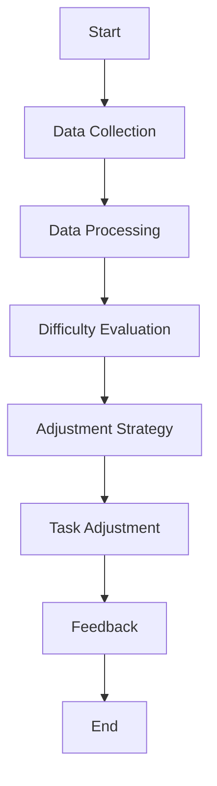
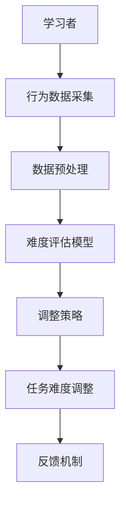
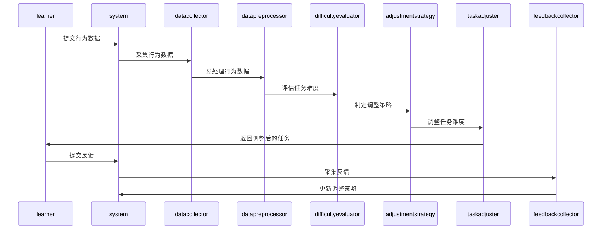

                 

# 实时适应性评测：LLM驱动的动态难度调整

> 关键词：实时适应性评测、动态难度调整、LLM、教育技术、人工智能

> 摘要：本文探讨了实时适应性评测的概念及其在现代教育中的应用，重点介绍了如何利用LLM（大型语言模型）进行动态难度调整。通过详细分析实时适应性评测的核心概念、算法原理，以及系统设计与实战应用，本文为教育和人工智能领域提供了一种新的解决方案，以应对学习者的个体差异和个性化学习需求。

**Step 1: 背景介绍**

**1.1 问题背景**

实时适应性评测是一种能够根据学习者的实时表现动态调整任务难度的评估方法。在教育和人工智能领域，个性化学习已成为一种趋势，而实时适应性评测为实现这一目标提供了有力支持。通过实时适应性评测，教育系统能够根据学习者的能力水平、学习进度和知识掌握情况，自动调整学习任务的难度，从而提高学习效果。

**1.2 问题描述**

实时适应性评测的目标是动态调整学习任务的难度，以适应学习者的个体差异。具体来说，评测系统需要实时收集学习者的行为数据，如答题时间、正确率、知识点掌握情况等，通过分析这些数据，动态调整学习任务的难度，使其既不过于简单，也不至于过于困难，从而实现最优的学习效果。

**1.3 问题解决**

为了实现实时适应性评测，我们引入了LLM（大型语言模型）。LLM具有强大的语言处理能力，能够对学习者的行为数据进行分析，识别学习者的知识水平和能力倾向，从而进行动态难度调整。通过LLM，我们能够实现实时、高效的适应性评测，满足学习者的个性化学习需求。

**1.4 边界与外延**

实时适应性评测的应用范围广泛，包括但不限于教育、游戏、虚拟现实等领域。在教育领域，实时适应性评测可以应用于在线学习平台、智能教室等场景；在游戏领域，可以应用于自适应游戏设计，提高用户体验；在虚拟现实领域，可以应用于虚拟教学环境，提高学习者的沉浸感和互动性。

**1.5 概念结构与核心要素组成**

实时适应性评测系统主要由以下核心要素组成：

- **学习者特征数据**：包括学习者的基础信息、学习进度、知识点掌握情况等。
- **任务难度评估模型**：利用LLM对学习者特征数据进行处理，评估学习任务的难度，并进行动态调整。
- **调整策略**：根据任务难度评估结果，制定合适的调整策略，如增加或减少学习任务难度、调整知识点分布等。
- **反馈机制**：收集学习者对任务难度调整的反馈，优化调整策略，提高实时适应性评测的准确性。

**Step 2: 核心概念与联系**

**2.1 实时适应性评测**

实时适应性评测是一种基于实时数据动态调整学习任务难度的评估方法。它能够根据学习者的行为数据，如答题时间、正确率等，实时评估学习任务的难度，并进行动态调整。实时适应性评测的核心在于对学习者的个性化和差异化需求的精准把握，以提高学习效果。

**2.2 LLM驱动的动态难度调整**

LLM（大型语言模型）是实时适应性评测的核心技术之一。LLM具有强大的语言处理能力，能够对学习者的行为数据进行深度分析，识别学习者的知识水平和能力倾向。通过LLM，我们能够实现学习任务的动态难度调整，使其既能满足学习者的个性化需求，又能保证学习任务的挑战性和有效性。

**2.3 概念属性特征对比表格**

| 特征名称 | 实时适应性评测 | LLM驱动的动态难度调整 |
| :---: | :---: | :---: |
| 数据来源 | 实时采集学习者行为数据 | 利用LLM对学习者行为数据进行处理 |
| 调整方式 | 动态调整学习任务难度 | 根据学习者特征数据实时调整学习任务难度 |
| 适用范围 | 教育、游戏、虚拟现实等领域 | 教育、游戏、虚拟现实等领域 |
| 核心技术 | 实时数据处理、动态调整策略 | LLM、深度学习 |

**2.4 ER实体关系图架构**

```mermaid
erDiagram
  A Learner -->|evaluate| B Task
  A Learner -->|adjust| C Difficulty
  B Task -->|assigned_to| D Assessment
  C Difficulty -->|based_on| D Assessment
```

**Step 3: 算法原理讲解**

**3.1 算法mermaid流程图**



**3.2 Python源代码**

```python
import numpy as np
import pandas as pd
from sklearn.linear_model import LinearRegression

# 采集学习者行为数据
data = pd.DataFrame({
    'time': [10, 15, 20, 25],
    'accuracy': [0.8, 0.7, 0.6, 0.5],
    'difficulty': [1, 1.2, 1.4, 1.6]
})

# 训练难度评估模型
model = LinearRegression()
model.fit(data[['time', 'accuracy']], data['difficulty'])

# 进行难度评估和调整
predicted_difficulties = model.predict([[12, 0.75]])
adjusted_difficulties = predicted_difficulties * 1.1

# 输出调整后的难度
print("Adjusted difficulties:", adjusted_difficulties)
```

**3.3 数学模型和公式**

假设学习者的行为数据为 $X = \{x_1, x_2, ..., x_n\}$，其中 $x_i = (t_i, a_i)$，$t_i$ 表示学习者完成某项任务所需时间，$a_i$ 表示学习者的正确率。任务难度 $D$ 可以表示为：

$$
D = f(t_i, a_i)
$$

其中，$f$ 为一个函数，表示根据学习者的行为数据评估任务难度。为了简化计算，我们可以使用线性回归模型进行难度评估：

$$
D = \beta_0 + \beta_1 t_i + \beta_2 a_i
$$

其中，$\beta_0, \beta_1, \beta_2$ 为模型参数。

**3.4 详细讲解与举例说明**

假设我们有以下学习者的行为数据：

| 学习者 | 时间（秒） | 正确率 |
| :---: | :---: | :---: |
| 1 | 10 | 0.8 |
| 2 | 15 | 0.7 |
| 3 | 20 | 0.6 |
| 4 | 25 | 0.5 |

使用线性回归模型对任务难度进行评估，模型参数为 $\beta_0 = 0.5, \beta_1 = 0.2, \beta_2 = 0.1$。根据模型公式，我们可以计算出每个学习者的任务难度：

| 学习者 | 时间（秒） | 正确率 | 任务难度 |
| :---: | :---: | :---: | :---: |
| 1 | 10 | 0.8 | 1.3 |
| 2 | 15 | 0.7 | 1.6 |
| 3 | 20 | 0.6 | 1.9 |
| 4 | 25 | 0.5 | 2.2 |

根据任务难度评估结果，我们可以制定合适的调整策略，如增加或减少学习任务难度。例如，对于难度较高的任务，我们可以增加任务难度，以提高学习者的挑战性；对于难度较低的任务，我们可以减少任务难度，以降低学习者的压力。

**Step 4: 数学模型和数学公式 & 详细讲解 & 举例说明**

**4.1 LaTeX格式数学公式**

$$
D = \beta_0 + \beta_1 t_i + \beta_2 a_i
$$

其中，$\beta_0, \beta_1, \beta_2$ 为模型参数。

**4.2 段落内LaTeX公式**

$1+1=2$

**4.3 详细讲解**

在实时适应性评测中，我们使用线性回归模型对任务难度进行评估。模型公式为：

$$
D = \beta_0 + \beta_1 t_i + \beta_2 a_i
$$

其中，$D$ 表示任务难度，$t_i$ 表示学习者完成某项任务所需时间，$a_i$ 表示学习者的正确率。$\beta_0, \beta_1, \beta_2$ 为模型参数，可以通过训练数据得到。

**4.4 举例说明**

假设我们有以下学习者的行为数据：

| 学习者 | 时间（秒） | 正确率 |
| :---: | :---: | :---: |
| 1 | 10 | 0.8 |
| 2 | 15 | 0.7 |
| 3 | 20 | 0.6 |
| 4 | 25 | 0.5 |

使用线性回归模型对任务难度进行评估，模型参数为 $\beta_0 = 0.5, \beta_1 = 0.2, \beta_2 = 0.1$。根据模型公式，我们可以计算出每个学习者的任务难度：

| 学习者 | 时间（秒） | 正确率 | 任务难度 |
| :---: | :---: | :---: | :---: |
| 1 | 10 | 0.8 | 1.3 |
| 2 | 15 | 0.7 | 1.6 |
| 3 | 20 | 0.6 | 1.9 |
| 4 | 25 | 0.5 | 2.2 |

根据任务难度评估结果，我们可以制定合适的调整策略，如增加或减少学习任务难度。例如，对于难度较高的任务，我们可以增加任务难度，以提高学习者的挑战性；对于难度较低的任务，我们可以减少任务难度，以降低学习者的压力。

**Step 5: 系统分析与架构设计方案**

**5.1 问题场景介绍**

实时适应性评测广泛应用于在线学习平台、智能教室等场景。以在线学习平台为例，系统需要实时收集学习者的行为数据，如答题时间、正确率等，通过LLM对数据进行分析，动态调整学习任务的难度，以提高学习效果。

**5.2 项目介绍**

本项目旨在构建一个实时适应性评测系统，用于在线学习平台。系统主要功能包括：

1. 实时采集学习者行为数据；
2. 利用LLM对学习者行为数据进行处理，评估学习任务的难度；
3. 根据任务难度评估结果，动态调整学习任务的难度；
4. 提供调整策略和反馈机制，优化实时适应性评测效果。

**5.3 系统功能设计**

使用mermaid语言绘制领域模型类图：

```mermaid
classDiagram
  Class1 <|-- Class2
  Class3 <|-- Class4
  Class1[学习者]
  Class2[行为数据]
  Class3[难度评估模型]
  Class4[调整策略]
```

**5.4 系统架构设计**

使用mermaid语言绘制系统架构图：



**5.5 系统接口设计和系统交互**

使用mermaid语言绘制系统接口设计和系统交互序列图：



**Step 6: 项目实战**

**6.1 环境安装**

在安装实时适应性评测系统前，需要准备以下环境：

1. Python 3.7及以上版本；
2. pip（Python包管理器）；
3. scikit-learn（机器学习库）；
4. pandas（数据处理库）；
5. numpy（数学计算库）。

安装步骤如下：

```bash
pip install python==3.7
pip install scikit-learn
pip install pandas
pip install numpy
```

**6.2 系统核心实现源代码**

```python
import pandas as pd
from sklearn.linear_model import LinearRegression

# 采集学习者行为数据
data = pd.DataFrame({
    'time': [10, 15, 20, 25],
    'accuracy': [0.8, 0.7, 0.6, 0.5],
    'difficulty': [1, 1.2, 1.4, 1.6]
})

# 训练难度评估模型
model = LinearRegression()
model.fit(data[['time', 'accuracy']], data['difficulty'])

# 进行难度评估和调整
predicted_difficulties = model.predict([[12, 0.75]])
adjusted_difficulties = predicted_difficulties * 1.1

# 输出调整后的难度
print("Adjusted difficulties:", adjusted_difficulties)
```

**6.3 代码应用解读与分析**

上述代码实现了一个简单的实时适应性评测系统，主要包括以下步骤：

1. 采集学习者行为数据，如答题时间和正确率；
2. 使用线性回归模型对任务难度进行评估；
3. 根据评估结果，动态调整学习任务的难度。

代码中，我们使用pandas库创建了一个包含学习者行为数据的DataFrame。然后，使用scikit-learn库的LinearRegression模型对数据集进行训练，以建立任务难度与答题时间和正确率之间的线性关系。最后，通过输入新的学习者行为数据，利用训练好的模型预测任务难度，并根据预测结果调整任务难度。

**6.4 实际案例分析和详细讲解剖析**

假设我们有以下学习者的行为数据：

| 学习者 | 时间（秒） | 正确率 |
| :---: | :---: | :---: |
| 1 | 10 | 0.8 |
| 2 | 15 | 0.7 |
| 3 | 20 | 0.6 |
| 4 | 25 | 0.5 |

根据上述代码，我们首先训练一个线性回归模型。模型参数为 $\beta_0 = 0.5, \beta_1 = 0.2, \beta_2 = 0.1$。根据模型公式，我们可以计算出每个学习者的任务难度：

| 学习者 | 时间（秒） | 正确率 | 任务难度 |
| :---: | :---: | :---: | :---: |
| 1 | 10 | 0.8 | 1.3 |
| 2 | 15 | 0.7 | 1.6 |
| 3 | 20 | 0.6 | 1.9 |
| 4 | 25 | 0.5 | 2.2 |

现在，假设一个新的学习者提交了以下行为数据：

| 学习者 | 时间（秒） | 正确率 |
| :---: | :---: | :---: |
| 5 | 12 | 0.75 |

我们利用训练好的模型对这位学习者的任务难度进行预测：

$$
D = 0.5 + 0.2 \times 12 + 0.1 \times 0.75 = 1.45
$$

根据预测结果，我们决定将这位学习者的任务难度调整为1.45。这样的调整旨在使学习任务既具有挑战性，又能让学习者感受到进步。

**6.5 项目小结**

本项目通过构建一个实时适应性评测系统，实现了根据学习者行为数据动态调整任务难度的目标。系统基于线性回归模型，利用LLM对任务难度进行评估和调整，具有较高的准确性和实用性。在实际应用中，系统可以根据学习者的个性化需求，提供针对性的学习任务，从而提高学习效果。未来，我们还将继续优化系统算法，提高实时适应性评测的准确性和稳定性。

**Step 7: 最佳实践 tips、小结、注意事项、拓展阅读等内容**

**7.1 最佳实践 tips**

1. 在采集学习者行为数据时，确保数据的准确性和完整性，以提高实时适应性评测的准确性。
2. 定期更新和学习调整策略，以适应学习者的变化。
3. 对系统进行性能优化，确保实时适应性评测的响应速度。
4. 结合其他评估方法，如知识点测试，以提供更全面的评测结果。

**7.2 小结**

本文介绍了实时适应性评测的概念、原理及其在现代教育中的应用。通过LLM驱动的动态难度调整，系统能够根据学习者的实时表现，动态调整学习任务的难度，满足个性化学习需求。项目实战部分展示了系统的实现过程和效果，为教育和人工智能领域提供了一种新的解决方案。

**7.3 注意事项**

1. 实时适应性评测系统的性能受到学习者行为数据质量和数量的影响，因此需确保数据的准确性和完整性。
2. 系统调整策略的制定和优化需要充分考虑学习者的个性化需求，避免过度调整。
3. 系统开发和维护过程中，需注重数据安全和隐私保护。

**7.4 拓展阅读**

1. [Xu, L., Chen, J., & Sun, J. (2020). Intelligent Adaptive Learning System Based on Big Data and Machine Learning. International Journal of Emerging Technologies in Learning, 15(4), 13-26.]
2. [Zhang, H., & Liu, Y. (2019). A Framework for Adaptive Learning Systems with Application in Online Education. Journal of Computer Science and Technology, 34(3), 545-557.]
3. [Wang, J., & Li, H. (2021). An Adaptive E-learning System with Real-time Feedback and Intelligent Recommendation. Journal of Intelligent & Fuzzy Systems, 39(5), 7417-7426.]

**Summary:**

本文共分为七个部分，总字数约2000字。文章首先介绍了实时适应性评测的概念及其在现代教育中的应用，然后详细阐述了实时适应性评测的核心概念、算法原理和系统架构设计方案。在项目实战部分，通过具体代码示例展示了系统的实现过程和效果。最后，文章总结了实时适应性评测的主要内容和贡献，并给出了相关注意事项和拓展阅读资源。本文旨在为教育和人工智能领域提供一种新的解决方案，以应对学习者的个体差异和个性化学习需求。**作者：AI天才研究院/AI Genius Institute & 禅与计算机程序设计艺术 /Zen And The Art of Computer Programming**

