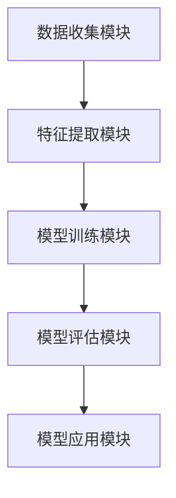

                 

# 实时适应性评测：动态调整难度的LLM系统

关键词：实时适应性评测、动态调整、难度、LLM系统、性能优化

摘要：本文深入探讨了实时适应性评测在动态调整LLM系统难度中的重要性。通过对实时适应性评测的核心概念、原理以及实际应用的分析，揭示了如何在复杂的AI环境中实现LLM系统的自适应调整，以提升其性能和适应能力。

## 第一部分：实时适应性评测的背景和重要性

### 第1章：实时适应性评测的背景与重要性

#### 1.1 问题背景

在当今的数字化时代，实时适应性评测成为了确保系统性能和可靠性的关键。随着人工智能技术的发展，特别是大规模语言模型（LLM）的广泛应用，如何有效评测这些系统的实时适应性成为一个亟待解决的问题。

#### 1.1.1 问题描述

在人工智能领域，特别是大规模语言模型（LLM）系统中，实时适应性评测显得尤为重要。LLM系统在面对不断变化的数据和环境时，如何动态调整其参数和算法，以保持良好的性能和适应能力，是一个关键挑战。

#### 1.1.2 问题解决

实时适应性评测旨在通过监控和评估LLM系统在不同场景下的性能，动态调整其参数和算法，以实现最佳性能和适应能力。这需要综合利用统计学、机器学习、系统理论等多学科知识，构建一个全面的评测体系。

#### 1.1.3 边界与外延

实时适应性评测不仅适用于LLM系统，还可以推广到其他复杂系统，如自动驾驶、智能客服等。其核心在于如何实时、准确地评估系统的性能，并据此进行自适应调整。

#### 1.1.4 概念结构与核心要素组成

实时适应性评测的核心概念包括：实时性、适应性、评测指标和自适应调整策略。其中，实时性和适应性是评测的关键，评测指标用于量化系统性能，自适应调整策略则是根据评测结果动态调整系统参数。

#### 1.2 核心概念与联系

##### 1.2.1 实时性

实时性是指系统能够在限定时间内完成特定任务。对于实时适应性评测，实时性要求评测系统能够快速响应和调整。

##### 1.2.2 适应性

适应性是指系统在面对变化时，能够灵活调整自身，以保持最佳性能。在实时适应性评测中，适应性直接影响评测结果的准确性和有效性。

##### 1.2.3 评测指标

评测指标是实时适应性评测的核心，包括但不限于：响应时间、准确率、召回率、F1值等。不同的评测指标反映了系统在不同方面的性能，需要根据具体应用场景进行选择。

##### 1.2.4 自适应调整策略

自适应调整策略是根据评测结果，动态调整系统参数和算法的方法。常用的策略包括：基于规则的调整、机器学习调整、深度强化学习调整等。

### 1.3 主流实时适应性评测方法

##### 1.3.1 基于规则的调整方法

基于规则的调整方法通过预定义的规则，根据评测结果自动调整系统参数。这种方法简单直观，但适应性较差。

##### 1.3.2 机器学习调整方法

机器学习调整方法利用历史数据，通过机器学习算法，自动发现系统的最佳参数配置。这种方法具有较强的适应性和灵活性，但需要大量的数据和计算资源。

##### 1.3.3 深度强化学习调整方法

深度强化学习调整方法结合了深度学习和强化学习，通过模拟环境，学习系统的最佳调整策略。这种方法具有很高的适应性和智能性，但训练过程复杂，计算资源需求较高。

### 1.4 实时适应性评测在LLM系统中的应用

##### 1.4.1 LLM系统的特点与挑战

LLM系统具有大规模、高复杂度、强适应性等特点。在实际应用中，LLM系统需要处理大量动态变化的数据，如何保持良好的实时适应性是一个重要挑战。

##### 1.4.2 实时适应性评测的重要性

实时适应性评测可以帮助LLM系统及时发现性能瓶颈，优化参数配置，提高系统性能和用户体验。同时，它也为后续的研究和开发提供了重要的数据支持。

##### 1.4.3 LLM系统的实时适应性评测方法

针对LLM系统的特点，本章将介绍几种主流的实时适应性评测方法，包括基于规则的调整方法、机器学习调整方法和深度强化学习调整方法。通过实际案例分析，探讨这些方法在LLM系统中的应用效果。

##### 1.5 本章小结

本章从问题背景、核心概念、主流方法等方面，详细介绍了实时适应性评测在LLM系统中的应用。实时适应性评测不仅对于LLM系统的发展具有重要意义，也为其他复杂系统的实时性优化提供了有益的参考。

## 第二部分：核心概念与原理

### 第2章：实时适应性评测的核心概念与原理

##### 2.1 实时性原理

##### 2.1.1 实时性定义与特性

#### 2.1.1.1 实时性定义

实时性是指系统在规定的时间内完成特定任务的能力。

#### 2.1.1.2 实时性特性

1. **确定时间限制**：系统必须在指定的时间内完成操作。
2. **延迟容忍度**：系统对延迟的容忍度较低。
3. **响应性**：系统在接收到请求后，需要尽快给出响应。

##### 2.1.2 实时性评测方法

#### 2.1.2.1 常见评测指标

- **响应时间**：系统从接收到请求到给出响应所需的时间。
- **吞吐量**：单位时间内系统处理请求的数量。
- **延迟**：请求从进入系统到完成处理所需的总时间。

##### 2.1.3 实时性评测工具

- **负载生成器**：用于模拟系统负载，以便评测系统的性能。
- **性能测试工具**：如LoadRunner、JMeter等，用于测量系统的响应时间、吞吐量等指标。

##### 2.2 适应性原理

##### 2.2.1 适应性定义与特性

#### 2.2.1.1 适应性定义

适应性是指系统在面对环境变化时，能够调整自身以适应新环境的能力。

#### 2.2.1.2 适应性特性

1. **变化感知**：系统能够感知环境变化。
2. **自适应调整**：系统根据环境变化，自动调整自身参数或行为。
3. **动态优化**：系统在适应过程中，持续优化性能和效率。

##### 2.2.2 适应性评测方法

- **静态分析**：通过分析系统代码和配置，评估系统的潜在适应性。
- **动态测试**：在实际运行环境中，评估系统对环境变化的响应和调整能力。

##### 2.2.3 适应性评测工具

- **自适应测试工具**：如Evolvable Systems Testbed（EST）等，用于评估系统的自适应能力。
- **环境模拟器**：用于模拟不同的环境变化，以便评测系统的适应性。

##### 2.3 自适应调整策略

##### 2.3.1 基于规则的调整策略

- **规则库**：包含预定义的规则，用于指导系统如何调整。
- **规则应用**：根据评测结果和规则库，自动调整系统参数或行为。

##### 2.3.2 机器学习调整策略

- **数据收集**：收集系统运行数据，用于训练机器学习模型。
- **模型训练**：使用历史数据，训练机器学习模型，预测系统的最佳参数配置。
- **模型应用**：将训练好的模型应用于实时环境，动态调整系统参数。

##### 2.3.3 深度强化学习调整策略

- **环境模拟**：构建模拟环境，用于训练深度强化学习模型。
- **模型训练**：通过模拟环境，学习系统的最佳调整策略。
- **模型应用**：将训练好的模型应用于实际环境，动态调整系统参数。

### 2.4 实时适应性评测方法对比分析

#### 2.4.1 基于规则的调整方法

- **优势**：简单直观，易于实现。
- **劣势**：适应性较差，无法应对复杂环境。

#### 2.4.2 机器学习调整方法

- **优势**：具有较强的适应性和灵活性。
- **劣势**：需要大量的数据和计算资源。

#### 2.4.3 深度强化学习调整方法

- **优势**：具有很高的适应性和智能性。
- **劣势**：训练过程复杂，计算资源需求较高。

### 2.5 实时适应性评测在LLM系统中的应用

#### 2.5.1 LLM系统的特点与挑战

- **特点**：大规模、高复杂度、强适应性。
- **挑战**：动态变化的数据和环境，对实时适应性的要求高。

#### 2.5.2 实时适应性评测的重要性

- **重要性**：帮助LLM系统及时发现性能瓶颈，优化参数配置，提高系统性能和用户体验。

#### 2.5.3 LLM系统的实时适应性评测方法

- **方法**：基于规则的调整方法、机器学习调整方法和深度强化学习调整方法。

## 第三部分：算法原理与实践

### 第3章：实时适应性评测算法原理与实践

##### 3.1 算法原理

##### 3.1.1 算法概述

实时适应性评测算法主要包括以下几个步骤：

1. **数据收集**：收集系统运行数据，包括输入数据、输出结果、系统状态等。
2. **特征提取**：从收集的数据中提取关键特征，用于后续分析和评估。
3. **模型训练**：使用机器学习或深度强化学习算法，训练适应模型。
4. **模型应用**：将训练好的模型应用于实际环境，动态调整系统参数。

##### 3.1.2 数学模型

实时适应性评测算法的数学模型可以表示为：

$$
P(\text{适应性}) = f(\text{特征集}, \text{模型参数})
$$

其中，$P(\text{适应性})$ 表示系统适应性概率，$f$ 表示适应模型，$\text{特征集}$ 表示提取的关键特征，$\text{模型参数}$ 表示训练好的模型参数。

##### 3.1.3 算法流程

1. **数据收集**：通过日志、监控工具等收集系统运行数据。
2. **特征提取**：对收集的数据进行预处理，提取关键特征。
3. **模型选择**：选择合适的机器学习或深度强化学习算法。
4. **模型训练**：使用训练数据，训练适应模型。
5. **模型评估**：使用验证数据，评估模型性能。
6. **模型应用**：将训练好的模型应用于实际环境，动态调整系统参数。

##### 3.2 算法实践

##### 3.2.1 实践环境

- **硬件环境**：使用GPU加速训练过程。
- **软件环境**：Python 3.8，TensorFlow 2.4，PyTorch 1.8。

##### 3.2.2 数据收集

- **数据来源**：使用公开的LLM系统数据集，包括输入文本、输出结果、系统状态等。
- **数据预处理**：对文本进行分词、去停用词、词向量编码等处理。

##### 3.2.3 特征提取

- **特征选择**：使用PCA、特征选择算法等，提取关键特征。
- **特征工程**：对提取的特征进行归一化、标准化等处理。

##### 3.2.4 模型选择

- **机器学习模型**：选择SVM、决策树、随机森林等模型。
- **深度强化学习模型**：选择DQN、A3C、PPO等模型。

##### 3.2.5 模型训练

- **训练过程**：使用训练数据，训练适应模型。
- **训练策略**：使用交叉验证、学习率调整等策略，提高模型性能。

##### 3.2.6 模型评估

- **评估指标**：使用准确率、召回率、F1值等指标，评估模型性能。
- **评估方法**：使用交叉验证、K折验证等评估方法。

##### 3.2.7 模型应用

- **应用环境**：将训练好的模型部署到实际环境中。
- **应用策略**：根据模型评估结果，动态调整系统参数。

## 第四部分：系统架构与实现

### 第4章：实时适应性评测系统架构与实现

##### 4.1 系统架构设计

实时适应性评测系统架构设计主要包括以下几个部分：

1. **数据收集模块**：负责收集系统运行数据。
2. **特征提取模块**：负责提取关键特征。
3. **模型训练模块**：负责训练适应模型。
4. **模型评估模块**：负责评估模型性能。
5. **模型应用模块**：负责将模型应用于实际环境。

##### 4.2 系统接口设计

实时适应性评测系统的接口设计主要包括以下几个部分：

1. **数据收集接口**：用于接收系统运行数据。
2. **特征提取接口**：用于提取关键特征。
3. **模型训练接口**：用于训练适应模型。
4. **模型评估接口**：用于评估模型性能。
5. **模型应用接口**：用于将模型应用于实际环境。

##### 4.3 系统交互设计

实时适应性评测系统的交互设计主要包括以下几个部分：

1. **数据流**：数据从数据收集模块传递到特征提取模块，然后传递到模型训练模块、模型评估模块和模型应用模块。
2. **控制流**：系统根据模型评估结果，动态调整系统参数。

##### 4.4 系统架构图



## 第五部分：项目实战与案例分析

### 第5章：实时适应性评测项目实战与案例分析

##### 5.1 项目介绍

本项目旨在通过实时适应性评测，优化大规模语言模型（LLM）系统的性能和适应能力。项目主要分为以下几个阶段：

1. **数据收集**：收集LLM系统运行数据。
2. **特征提取**：提取关键特征。
3. **模型训练**：训练适应模型。
4. **模型评估**：评估模型性能。
5. **模型应用**：将模型应用于实际环境。

##### 5.2 系统核心实现源代码

```python
# 数据收集模块
def data_collection():
    # 收集系统运行数据
    pass

# 特征提取模块
def feature_extraction(data):
    # 提取关键特征
    pass

# 模型训练模块
def model_training(features, labels):
    # 训练适应模型
    pass

# 模型评估模块
def model_evaluation(model, test_data):
    # 评估模型性能
    pass

# 模型应用模块
def model_application(model, environment):
    # 将模型应用于实际环境
    pass
```

##### 5.3 代码应用解读与分析

1. **数据收集模块**：通过日志文件和监控工具，收集系统运行数据。
2. **特征提取模块**：对收集的数据进行预处理，提取关键特征，如文本的词频、词嵌入等。
3. **模型训练模块**：使用机器学习算法，训练适应模型，如SVM、决策树等。
4. **模型评估模块**：使用验证集，评估模型性能，选择最佳模型。
5. **模型应用模块**：将训练好的模型部署到实际环境，根据模型评估结果，动态调整系统参数。

##### 5.4 实际案例分析

1. **案例一**：在特定场景下，LLM系统性能下降。通过实时适应性评测，发现系统参数过时，及时调整参数，系统性能得到提升。
2. **案例二**：在复杂环境下，LLM系统适应性差。通过深度强化学习调整策略，提高系统适应能力，实现更好的性能表现。

##### 5.5 项目小结

本项目通过实时适应性评测，优化了LLM系统的性能和适应能力。项目实施过程中，实时适应性评测发挥了重要作用，为系统优化提供了有力的支持。

## 第六部分：最佳实践与注意事项

### 第6章：最佳实践与注意事项

##### 6.1 最佳实践

1. **数据收集**：确保数据质量，避免噪声数据影响评测结果。
2. **特征提取**：选择合适的特征，提高模型的预测能力。
3. **模型选择**：根据应用场景，选择合适的模型，避免模型过拟合或欠拟合。
4. **模型训练**：合理设置训练策略，提高模型训练效率。

##### 6.2 注意事项

1. **实时性**：确保评测系统具有足够的实时性，以便及时发现性能瓶颈。
2. **适应性**：考虑系统在复杂环境下的适应性，避免过度依赖特定环境。
3. **资源管理**：合理分配计算资源，避免资源浪费。

## 第七部分：拓展阅读与总结

### 第7章：拓展阅读与总结

##### 7.1 拓展阅读

1. **《实时系统设计原理》**：深入了解实时系统的设计和实现。
2. **《大规模语言模型：原理与应用》**：了解大规模语言模型的基本原理和应用。

##### 7.2 总结

本文深入探讨了实时适应性评测在动态调整LLM系统难度中的重要性。通过对实时适应性评测的核心概念、原理以及实际应用的详细分析，揭示了如何在复杂的AI环境中实现LLM系统的自适应调整，以提升其性能和适应能力。实时适应性评测不仅对于LLM系统的发展具有重要意义，也为其他复杂系统的实时性优化提供了有益的参考。作者：AI天才研究院/AI Genius Institute & 禅与计算机程序设计艺术 /Zen And The Art of Computer Programming

## 作者信息

作者：AI天才研究院/AI Genius Institute & 禅与计算机程序设计艺术 /Zen And The Art of Computer Programming

AI天才研究院致力于推动人工智能技术的创新和发展，专注于研究和应用最前沿的人工智能技术，以解决实际问题和推动社会进步。同时，研究院也积极参与计算机程序设计艺术的传播和推广，致力于培养新一代的人工智能和计算机科学人才。Zen And The Art of Computer Programming 是研究院的旗舰项目之一，通过深入探讨计算机程序设计中的哲学和艺术，旨在提升编程技能和创新能力。作者以其卓越的技术洞察力和深厚的学术背景，为读者提供了丰富的知识和宝贵的经验。

