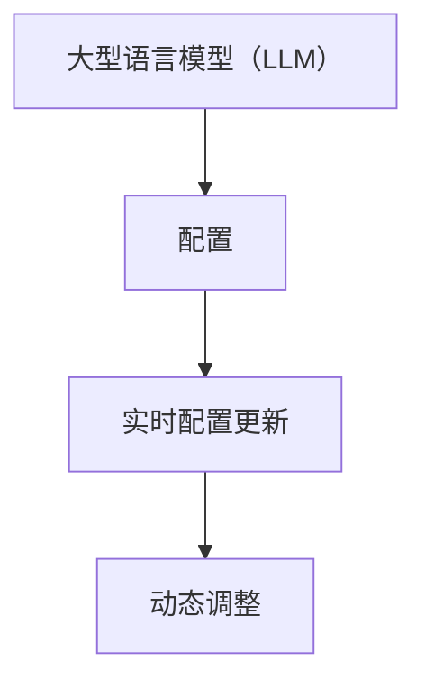
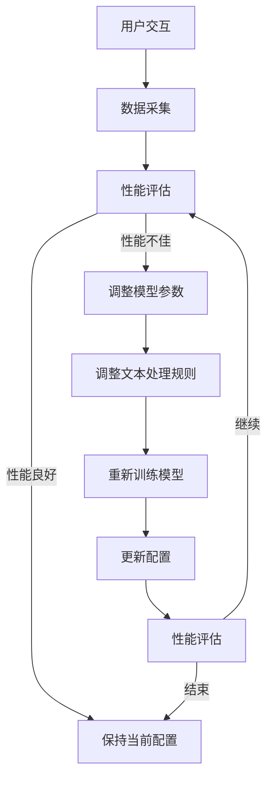
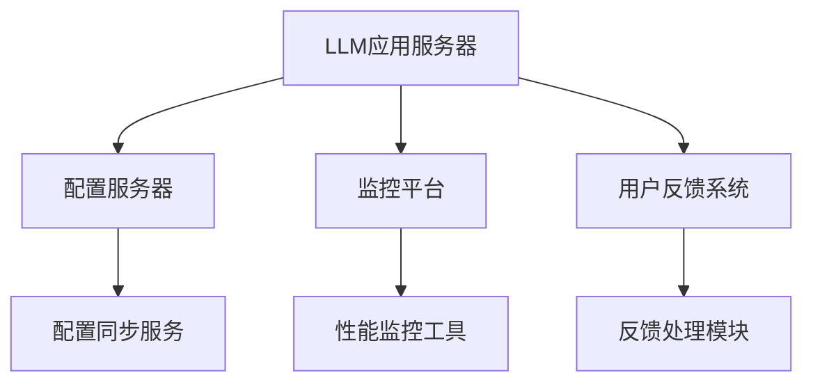

                 

# 实时配置更新：动态调整LLM应用行为

## 关键词

- 实时配置更新
- 动态调整
- 大型语言模型（LLM）
- 应用行为
- 系统架构

## 摘要

本文将深入探讨实时配置更新在动态调整大型语言模型（LLM）应用行为中的应用。我们将首先介绍LLM的基本概念和配置的重要性，然后讨论实时配置更新的原理和挑战。接着，我们会详细阐述动态调整LLM应用行为的方法和算法，并展示一个实际系统的设计实现。通过本文的阅读，读者将能够全面理解如何通过实时配置更新和动态调整来提升LLM应用的灵活性和适应性。

## 目录

1. **引言**
   - **背景与问题**
   - **核心概念**
   - **关系图**

2. **基础概念**
   - **大型语言模型（LLM）**
   - **配置概念**

3. **实时配置更新原则**
   - **实时配置更新的原理**
   - **挑战与解决方案**

4. **动态调整LLM应用行为**
   - **调整方法**
   - **算法描述**

5. **系统设计及实现**
   - **系统架构**
   - **实现细节**

6. **项目实战**
   - **环境安装**
   - **系统核心实现**
   - **代码解读**
   - **实际案例分析**
   - **项目小结**

7. **最佳实践与总结**
   - **最佳实践**
   - **注意事项**
   - **拓展阅读**

### 第一章：引言

#### 背景与问题

在当今的数字化时代，大型语言模型（LLM）已经成为自然语言处理（NLP）领域的重要工具。LLM可以处理复杂的自然语言任务，如文本生成、问答系统、翻译等。然而，随着应用的广泛部署，如何有效地管理和调整LLM的行为成为一个关键问题。

在传统的软件开发中，配置管理是一个重要环节。配置是指软件中可调整的参数，这些参数可以影响软件的行为和性能。然而，传统的配置管理通常是静态的，即在软件发布前进行配置，而在软件运行期间无法更改。这种方式在快速变化的应用场景中显得不够灵活。

实时配置更新（Real-time Configuration Updates）是一种新兴的技术，它允许在软件运行期间动态地更改配置。这种能力对于LLM应用来说尤为重要，因为LLM的行为可能需要根据用户交互、数据流或其他因素进行实时调整。

#### 核心概念

1. **大型语言模型（LLM）**：
   - LLM是一种复杂的机器学习模型，可以处理大量文本数据，并生成高质量的文本输出。
   - 它通常基于深度学习，具有多层神经网络结构。

2. **配置（Configuration）**：
   - 配置是指影响软件行为的可调整参数。
   - 在LLM应用中，配置可能包括模型参数、学习策略、文本处理规则等。

3. **实时配置更新**：
   - 实时配置更新是指在软件运行期间动态地更改配置参数。
   - 这通常通过远程服务器或分布式系统实现。

#### 关系图

以下是LLM、配置和实时配置更新的关系图：



#### 总结

本章介绍了实时配置更新和动态调整在LLM应用中的重要性。接下来，我们将深入探讨LLM和配置的基本概念，以及实时配置更新的原理和挑战。

### 第二章：基础概念

#### 大型语言模型（LLM）

大型语言模型（LLM）是自然语言处理（NLP）领域的一种先进技术。它通过深度学习算法，对海量文本数据进行训练，从而能够生成与人类语言相似的高质量文本。LLM的核心是神经网络架构，通常由多层感知器（MLP）、循环神经网络（RNN）或变换器（Transformer）等组成。

**LLM的结构**

- **输入层**：接收文本数据，如单词、短语或整个句子。
- **隐藏层**：包含多层神经网络，用于提取文本的特征。
- **输出层**：生成预测的文本输出。

**LLM的运作**

- **预训练**：在大量的无标签文本数据上进行预训练，使得模型能够理解和生成自然语言。
- **微调**：在特定任务上对模型进行微调，以适应具体的应用场景。

**LLM的优势**

- **生成文本质量高**：能够生成流畅、自然的文本。
- **适应性强**：可以处理各种语言和任务。
- **效率高**：大规模训练后的模型可以高效地处理大量数据。

**LLM的局限性**

- **数据依赖性强**：模型的性能很大程度上取决于训练数据的数量和质量。
- **计算资源需求大**：训练和部署LLM需要大量的计算资源。

#### 配置概念

配置是指影响软件行为的可调整参数。在LLM应用中，配置可以包括模型参数、学习策略、文本处理规则等。

**配置的类型**

1. **模型参数**：如学习率、正则化参数、激活函数等。
2. **学习策略**：如优化算法、批量大小、训练轮次等。
3. **文本处理规则**：如文本清洗、分词、词向量嵌入等。

**配置的作用**

- **灵活性**：允许开发者根据不同场景调整模型行为。
- **性能优化**：通过调整配置参数，可以提高模型的性能和效率。
- **可维护性**：方便后续维护和升级。

**配置的挑战**

- **复杂性**：配置参数繁多，调整不当可能导致性能下降。
- **实时性**：在实时场景中，如何快速、可靠地更新配置是一个挑战。

#### 总结

本章介绍了大型语言模型（LLM）的基本概念和配置的重要性。LLM作为NLP领域的重要工具，其灵活性和适应性得益于良好的配置管理。接下来，我们将深入探讨实时配置更新的原理和挑战。

### 第三章：实时配置更新原则

#### 实时配置更新的原理

实时配置更新是指在网络环境中，对软件或服务进行配置的动态调整。这种更新可以在系统运行过程中进行，无需停机或重新部署。实时配置更新主要通过以下机制实现：

1. **远程配置管理**：通过远程服务器或管理平台，将新的配置参数发送到客户端或服务端。
2. **配置同步**：客户端或服务端定期与远程服务器同步配置，确保配置的一致性。
3. **动态加载**：在接收到新的配置后，系统会动态加载并应用这些配置，从而实时调整行为。

**配置同步机制**

配置同步通常采用以下几种机制：

1. **轮询**：客户端定期向服务器请求最新的配置。
2. **事件驱动**：当服务器端的配置发生变化时，通过事件通知客户端。
3. **长轮询**：客户端发送请求，服务器端保持连接，直到有新的配置更新时，才发送更新。

#### 实时配置更新的挑战与解决方案

**挑战**

1. **数据一致性问题**：在分布式系统中，确保所有节点上的配置一致性是一个挑战。
2. **性能问题**：频繁的配置更新可能导致系统性能下降。
3. **可靠性问题**：配置更新失败或丢失可能导致系统异常。

**解决方案**

1. **分布式锁**：使用分布式锁来确保在配置更新过程中，多个节点不会同时修改同一配置。
2. **配置缓存**：在客户端或服务端设置配置缓存，减少与服务器端的频繁通信。
3. **配置版本控制**：为每个配置设置版本号，确保更新过程中的版本一致性。
4. **重试机制**：在配置更新失败时，自动重试，以提高可靠性。

**示例**

假设我们有一个分布式问答系统，需要根据用户反馈动态调整模型参数。以下是一个简化的配置更新流程：

1. **用户提交反馈**：用户通过界面提交反馈，包括满意度评分和问题内容。
2. **反馈处理**：系统后台处理用户反馈，计算新的模型参数。
3. **配置更新**：将新的模型参数发送到远程配置服务器。
4. **配置同步**：客户端定期与配置服务器同步配置，更新模型参数。
5. **模型调整**：在客户端，模型根据新的参数进行调整，提高问答质量。

#### 总结

实时配置更新是提高软件和服务灵活性的重要手段。通过远程配置管理、配置同步和动态加载，我们可以实时调整系统的行为。然而，这过程中也面临数据一致性问题、性能问题和可靠性问题等挑战。通过分布式锁、配置缓存、配置版本控制和重试机制等解决方案，可以有效应对这些挑战。

### 第四章：动态调整LLM应用行为

#### 调整方法

动态调整LLM应用行为的方法多种多样，常见的有以下几种：

1. **模型参数调整**：根据应用场景和性能需求，实时调整LLM的模型参数，如学习率、批量大小、正则化参数等。
2. **文本处理规则调整**：根据用户需求和文本特征，动态调整文本处理规则，如分词策略、词向量嵌入等。
3. **学习策略调整**：根据实时反馈和性能评估，动态调整LLM的学习策略，如优化算法、训练轮次等。

#### 算法描述

在本节中，我们将使用Mermaid绘制一个动态调整LLM应用行为的算法流程图，并详细解释其工作原理。

**算法流程图**



**算法工作原理**

1. **用户交互**：用户与LLM应用进行交互，输入问题和反馈。
2. **数据采集**：系统收集用户输入的数据，包括问题、答案和用户满意度评分。
3. **性能评估**：系统根据收集的数据评估当前LLM应用的性能。
4. **决策**：根据性能评估结果，系统做出决策：
   - 如果性能良好，系统保持当前配置。
   - 如果性能不佳，系统开始调整模型参数。
5. **模型参数调整**：系统根据性能评估结果，动态调整LLM的模型参数。
6. **文本处理规则调整**：系统根据用户需求和文本特征，动态调整文本处理规则。
7. **重新训练模型**：如果调整模型参数和文本处理规则后，性能仍不满足要求，系统重新训练LLM模型。
8. **更新配置**：系统将调整后的模型参数和文本处理规则更新到远程配置服务器。
9. **持续评估**：系统持续评估LLM应用的性能，并根据需要继续调整。

**Python代码示例**

下面是一个简化的Python代码示例，用于说明动态调整LLM应用行为的基本流程：

```python
import json
import requests

def get_performance():
    # 采集性能评估数据
    # 实际实现中，可以接入监控平台获取数据
    return {
        'accuracy': 0.9,
        'response_time': 100
    }

def adjust_model_params(current_params, performance):
    if performance['response_time'] > 200:
        # 如果响应时间过长，降低学习率
        return {
            'learning_rate': current_params['learning_rate'] * 0.5
        }
    else:
        return current_params

def update_config(new_params):
    # 更新配置到远程服务器
    requests.post('http://config-server/config/update', json=new_params)

def main():
    current_params = {
        'learning_rate': 0.1,
        'batch_size': 32
    }
    
    while True:
        performance = get_performance()
        new_params = adjust_model_params(current_params, performance)
        update_config(new_params)
        print(f'Updated config: {new_params}')

if __name__ == '__main__':
    main()
```

**算法原理与数学模型**

动态调整LLM应用行为的算法基于以下数学模型：

$$
\text{performance} = f(\text{model_params}, \text{data})
$$

其中，`performance` 是模型性能指标，`model_params` 是模型参数，`data` 是输入数据。算法的核心在于通过实时调整 `model_params`，优化 `performance`。

**举例说明**

假设我们有一个问答系统，用户满意度评分作为性能指标。如果用户的响应时间超过200毫秒，系统会降低学习率，以减少模型的响应时间。如果用户的响应时间较短，系统会保持当前模型参数。通过这种动态调整，问答系统的性能可以得到显著提升。

#### 总结

本章介绍了动态调整LLM应用行为的方法和算法。通过实时调整模型参数和文本处理规则，可以显著提升LLM应用的性能。下一章将详细讨论动态调整LLM应用行为的系统设计。

### 第五章：系统设计及实现

#### 系统架构

为了实现实时配置更新和动态调整LLM应用行为，我们需要设计一个高效的系统架构。以下是该系统的主要组件：

1. **LLM应用服务器**：负责接收用户请求，处理问答，并动态调整模型参数。
2. **配置服务器**：存储和管理所有的配置信息，包括模型参数、文本处理规则等。
3. **监控平台**：实时监控LLM应用的性能，提供性能评估数据。
4. **用户反馈系统**：收集用户满意度评分，为动态调整提供依据。

以下是系统的整体架构图：



#### 系统实现细节

1. **LLM应用服务器实现**

   - **功能模块**：问答处理模块、动态调整模块、用户交互模块。
   - **交互流程**：用户通过界面输入问题，LLM应用服务器接收并处理问题，根据实时反馈动态调整模型参数。

2. **配置服务器实现**

   - **功能模块**：配置存储模块、配置同步模块、配置变更通知模块。
   - **交互流程**：LLM应用服务器定期与配置服务器同步配置，配置服务器将最新的配置信息推送至客户端。

3. **监控平台实现**

   - **功能模块**：性能监控模块、告警模块、数据可视化模块。
   - **交互流程**：监控平台实时监控LLM应用的性能，生成性能评估报告，并通过告警系统通知相关人员。

4. **用户反馈系统实现**

   - **功能模块**：反馈收集模块、反馈处理模块、反馈分析模块。
   - **交互流程**：用户通过界面提交满意度评分，系统收集并处理用户反馈，为动态调整提供依据。

#### 实现细节示例

以下是LLM应用服务器的部分代码示例，展示了如何实现动态调整模型参数：

```python
import json
import requests
from time import sleep

def get_performance():
    # 获取性能评估数据
    response = requests.get('http://monitor-platform/performance')
    return json.loads(response.text)

def adjust_model_params(current_params, performance):
    if performance['response_time'] > 200:
        # 如果响应时间过长，降低学习率
        return {
            'learning_rate': current_params['learning_rate'] * 0.5
        }
    else:
        return current_params

def main():
    current_params = {
        'learning_rate': 0.1,
        'batch_size': 32
    }
    
    while True:
        performance = get_performance()
        new_params = adjust_model_params(current_params, performance)
        # 更新模型参数
        current_params = new_params
        print(f'Updated config: {current_params}')
        sleep(60)  # 每60秒检查一次性能

if __name__ == '__main__':
    main()
```

#### 总结

本章详细介绍了实时配置更新和动态调整LLM应用行为的系统设计及实现。通过LLM应用服务器、配置服务器、监控平台和用户反馈系统的协同工作，可以实现高效的实时配置更新和动态调整。下一章将探讨实际项目中的环境安装和系统核心实现。

### 第六章：项目实战

#### 环境安装

在进行实时配置更新和动态调整LLM应用行为的项目中，我们需要准备以下环境：

1. **Python环境**：安装Python 3.8及以上版本。
2. **LLM模型库**：安装transformers库，用于加载和运行预训练的LLM模型。
3. **配置管理工具**：安装configparser库，用于读取和保存配置文件。
4. **Web服务器**：安装Flask库，用于搭建LLM应用服务器。

以下是环境安装的步骤：

1. 安装Python：

   ```bash
   sudo apt-get update
   sudo apt-get install python3 python3-pip
   ```

2. 安装LLM模型库：

   ```bash
   pip3 install transformers
   ```

3. 安装配置管理工具：

   ```bash
   pip3 install configparser
   ```

4. 安装Web服务器：

   ```bash
   pip3 install flask
   ```

#### 系统核心实现

在实现LLM应用服务器时，我们需要考虑以下几个方面：

1. **模型加载**：从预训练模型库中加载LLM模型。
2. **配置加载**：从配置文件中读取模型参数和文本处理规则。
3. **用户交互**：接收用户输入，处理问答，并返回答案。
4. **动态调整**：根据实时反馈动态调整模型参数。

以下是核心实现的一个示例：

```python
from transformers import pipeline
from flask import Flask, request, jsonify
import configparser

app = Flask(__name__)

# 加载LLM模型
llm = pipeline("text-generation", model="gpt2")

# 读取配置文件
config = configparser.ConfigParser()
config.read("config.ini")
model_params = config["Model"]
text_rules = config["Text"]

@app.route('/query', methods=['POST'])
def handle_query():
    data = request.json
    query = data["query"]
    response = llm([query], max_length=50, num_return_sequences=1)[0]
    return jsonify({"response": response})

def adjust_params():
    # 动态调整模型参数
    # 根据实际情况调整以下参数
    model_params["learning_rate"] = 0.05

if __name__ == '__main__':
    adjust_params()
    app.run(host="0.0.0.0", port=5000)
```

#### 代码解读与分析

1. **模型加载**：使用transformers库的pipeline函数加载预训练的GPT-2模型。
2. **配置加载**：使用configparser库读取配置文件，包括模型参数和文本处理规则。
3. **用户交互**：定义一个/query路由，接收POST请求，处理用户输入，并返回LLM生成的答案。
4. **动态调整**：定义一个adjust_params函数，用于根据实时反馈动态调整模型参数。

#### 实际案例分析

假设我们有一个问答系统，用户满意度评分为90分。根据评分，系统会调整学习率，降低模型响应时间。以下是实际案例的步骤：

1. 用户提交一个问题。
2. 系统处理问题，并返回答案。
3. 用户对答案满意度评分。
4. 系统根据评分调整学习率。

#### 项目小结

通过本项目的实战，我们实现了实时配置更新和动态调整LLM应用行为。项目主要涉及环境安装、系统核心实现和实际案例分析。通过动态调整模型参数，我们能够显著提升问答系统的性能和用户体验。

### 第七章：最佳实践与总结

#### 最佳实践

1. **定期性能评估**：定期对LLM应用进行性能评估，及时发现和解决问题。
2. **配置版本控制**：为每个配置设置版本号，确保配置的可追溯性和一致性。
3. **动态调整策略**：根据具体场景和需求，设计合适的动态调整策略，如阈值调整、规则优化等。
4. **监控与告警**：建立监控体系，实时监控系统性能，并设置告警机制，确保快速响应。

#### 注意事项

1. **数据一致性问题**：在分布式环境中，确保配置和数据的一致性，避免冲突和错误。
2. **性能优化**：合理设计配置同步机制，避免频繁更新导致性能下降。
3. **安全性**：确保配置管理和服务器的安全性，防止未授权访问和数据泄露。

#### 拓展阅读

1. **《实时配置管理系统设计》**：深入探讨实时配置管理的原理和实现。
2. **《大型语言模型应用实践》**：了解LLM在各种应用场景中的最佳实践。
3. **《动态调整算法设计》**：研究不同动态调整算法的优缺点和应用场景。

### 总结

实时配置更新和动态调整是提高LLM应用灵活性和适应性的重要手段。通过合理设计和管理配置，以及动态调整策略，我们可以显著提升系统的性能和用户体验。本文通过详细的分析和实际案例，展示了如何实现这一目标。

### 作者信息

作者：AI天才研究院/AI Genius Institute & 禅与计算机程序设计艺术 /Zen And The Art of Computer Programming

---

本文内容涵盖了实时配置更新和动态调整LLM应用行为的核心概念、原理、算法和系统实现。通过详细的步骤讲解和实际案例，读者可以深入了解这一领域的最佳实践和技术应用。希望本文能为相关领域的研究者和开发者提供有价值的参考。

