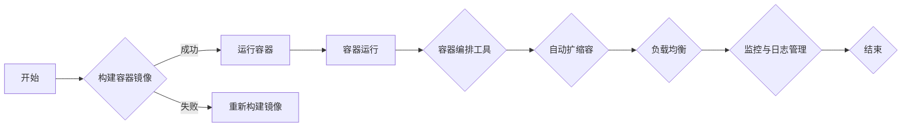

                 

### 容器化技术概述

#### 第1章: 容器化技术基础

**1.1 容器化技术背景与问题**

**1.1.1 问题背景**

在信息技术迅速发展的背景下，软件开发的复杂性和多样性不断增加。传统的软件部署方式，例如直接在物理服务器或虚拟机中安装和配置应用，面临许多挑战。首先，由于不同操作系统和应用环境的差异，软件在不同的环境中运行时可能出现兼容性问题。其次，软件的部署和配置过程繁琐，难以自动化和标准化。这些问题严重影响了软件的开发、部署和维护效率。

**1.1.2 问题描述**

传统软件部署面临的主要问题包括：

1. **环境差异**：不同操作系统、硬件环境和配置可能导致软件在部署时出现问题。
2. **部署繁琐**：软件部署过程涉及安装、配置、依赖管理等多个步骤，容易出错且难以自动化。
3. **可移植性差**：软件在不同环境间的移植性差，导致部署成本高、部署风险大。
4. **维护困难**：软件的维护和更新过程复杂，容易出现版本冲突和兼容性问题。

**1.1.3 解决方案**

为了解决上述问题，容器化技术应运而生。容器是一种轻量级的虚拟化技术，通过将应用程序及其运行环境打包成一个独立的单元，实现应用程序与运行环境的隔离和可移植性。容器化技术可以有效地解决软件部署中的兼容性、部署繁琐、可移植性和维护困难等问题。

#### **1.2 容器化核心技术概念**

**1.2.1 容器与虚拟机的区别**

容器和虚拟机都是用于隔离应用程序和运行环境的虚拟化技术，但它们之间存在一些关键区别。

1. **隔离级别**：容器在操作系统层面上实现隔离，共享宿主机的内核；而虚拟机则在硬件层面上实现隔离，每个虚拟机拥有独立的操作系统和硬件资源。
2. **性能开销**：容器由于无需额外的操作系统开销，相比虚拟机具有更高的性能。
3. **可移植性**：容器具有更好的可移植性，可以在不同的操作系统和硬件平台上运行。

**1.2.2 容器引擎技术简介**

容器引擎是用于创建、管理和运行容器的软件。常见的容器引擎包括Docker、rkt和containerd。其中，Docker是最为流行的容器引擎，它提供了一个简单、灵活和高效的容器化解决方案。

**1.2.3 容器编排工具**

容器编排工具用于管理和调度容器，以实现高效、可靠的容器化应用部署。常见的容器编排工具包括Kubernetes、Mesos和Swarm。Kubernetes是开源的容器编排平台，具有强大的功能、广泛的社区支持和良好的生态系统。

#### **1.3 容器化技术的核心优势**

**1.3.1 轻量化与高效性**

容器技术相比传统虚拟机具有更轻量级的特点，无需额外的操作系统和硬件资源，大大降低了资源消耗和性能开销。这使得容器化应用可以更高效地运行，具备更高的性能。

**1.3.2 可移植性与一致性**

容器将应用程序及其运行环境打包成一个独立的单元，实现了应用程序与运行环境的隔离和可移植性。这使得容器化应用可以在不同的操作系统、硬件环境和云平台之间无缝迁移和部署，提高了开发、测试和运维的效率。

**1.3.3 模块化与可扩展性**

容器技术支持模块化和可扩展性，允许开发者将应用程序分解为多个微服务，实现按需扩展和弹性伸缩。这使得容器化应用可以更灵活地应对业务需求变化，提高系统的稳定性和可维护性。

#### **1.4 容器化技术发展历程**

**1.4.1 容器化技术的起源**

容器化技术起源于20世纪90年代的操作系统层面的虚拟化技术，如chroot和cgroups。这些技术为容器化技术的概念和实现奠定了基础。

**1.4.2 容器化技术的发展**

随着云计算和容器技术的快速发展，容器化技术逐渐成熟并广泛应用。Docker的推出标志着容器化技术的商业化应用，推动了容器化技术的普及和发展。Kubernetes等容器编排工具的出现，进一步提升了容器化应用的管理和调度能力。

**1.4.3 容器化技术的未来趋势**

未来，容器化技术将继续向更加智能化、自动化和高效化的方向发展。容器化与人工智能、大数据等新兴技术的融合，将进一步提升容器化技术的应用价值。

#### **1.5 容器化技术在AI领域的应用**

**1.5.1 AI应用部署的挑战**

AI应用通常具有高度复杂性和计算需求，传统的部署方式难以满足其要求。AI应用部署面临的主要挑战包括：

1. **计算资源需求**：AI模型训练和推理需要大量的计算资源，传统部署方式难以满足需求。
2. **环境兼容性**：AI应用在不同操作系统和硬件平台上可能存在兼容性问题。
3. **部署效率**：传统的部署方式繁琐且难以自动化，难以满足快速迭代和部署的需求。

**1.5.2 容器化技术如何解决**

容器化技术为AI应用部署提供了有效的解决方案：

1. **资源隔离**：容器技术可以将AI应用与其运行环境进行隔离，确保应用在独立的资源环境中运行，提高资源利用率。
2. **环境一致性**：容器将应用程序及其运行环境打包成独立的单元，确保应用在不同环境中的一致性，解决兼容性问题。
3. **自动化部署**：容器引擎和容器编排工具提供了自动化部署和管理的功能，实现快速、高效的AI应用部署。

**1.5.3 容器化技术在AI领域的实际应用案例**

容器化技术在AI领域的应用已经取得了显著成果。以下是一些实际应用案例：

1. **自动驾驶系统**：自动驾驶公司采用容器化技术部署和扩展其AI模型，实现高效、可靠的车辆感知和决策功能。
2. **智能语音助手**：智能语音助手应用通过容器化技术实现快速部署和更新，提升用户体验和响应速度。
3. **图像识别系统**：图像识别系统采用容器化技术部署在云端，实现大规模图像处理和分析，提高系统性能和稳定性。

**1.6 本章小结**

本章介绍了容器化技术的基础知识，包括其背景与问题、核心技术概念、核心优势和发展历程。同时，探讨了容器化技术在AI领域的应用，分析了AI应用部署的挑战以及容器化技术的解决方案。通过本章的学习，读者可以全面了解容器化技术的基本概念和应用价值，为后续章节的深入探讨打下基础。

### 容器化技术概述

#### **第1章: 容器化技术基础**

**1.7 容器化技术在AI领域的应用**

**1.7.1 AI应用部署的挑战**

AI应用在部署过程中面临诸多挑战，主要包括以下几个方面：

1. **环境差异**：不同操作系统、硬件环境和配置可能导致AI模型在部署时出现问题，影响模型的性能和稳定性。
2. **部署复杂度**：传统的部署方式涉及安装、配置、依赖管理等复杂过程，难以实现自动化和标准化，增加了部署难度。
3. **可移植性差**：AI模型在不同环境间的移植性差，导致部署成本高、部署风险大，难以满足快速迭代和部署的需求。

**1.7.2 容器化技术如何解决**

容器化技术为AI应用部署提供了有效的解决方案：

1. **环境一致性**：容器技术将应用程序及其运行环境打包成一个独立的单元，确保AI模型在不同环境中的一致性，解决环境差异问题。
2. **自动化部署**：容器引擎和容器编排工具提供了自动化部署和管理功能，简化了AI应用的部署过程，提高部署效率。
3. **可移植性**：容器化技术提高了AI模型的可移植性，可以在不同操作系统、硬件环境和云平台之间无缝迁移和部署，降低部署成本。

**1.7.3 容器化技术在AI领域的实际应用案例**

容器化技术在AI领域的应用已经取得了显著成果，以下是一些实际应用案例：

1. **自动驾驶系统**：自动驾驶公司采用容器化技术部署AI模型，实现车辆感知、决策和控制功能的高效、可靠运行。
2. **智能语音助手**：智能语音助手应用通过容器化技术实现快速部署和更新，提升用户体验和响应速度。
3. **图像识别系统**：图像识别系统采用容器化技术部署在云端，实现大规模图像处理和分析，提高系统性能和稳定性。

**1.8 本章小结**

本章介绍了容器化技术的基础知识，包括其背景与问题、核心技术概念、核心优势和发展历程。同时，探讨了容器化技术在AI领域的应用，分析了AI应用部署的挑战以及容器化技术的解决方案。通过本章的学习，读者可以全面了解容器化技术的基本概念和应用价值，为后续章节的深入探讨打下基础。

### 第2章: 容器化技术加速AI模型部署

#### **2.1 AI模型部署过程中的问题**

AI模型部署过程中常常面临一系列问题，这些问题严重影响了模型的应用效果和部署效率。以下是AI模型部署过程中常见的几个问题：

**2.1.1 模型训练与部署的分离**

AI模型的训练过程通常在本地环境或专用服务器上完成，而部署过程需要在生产环境或云端进行。这种分离会导致以下问题：

1. **环境不一致**：本地训练环境与生产环境之间存在差异，可能导致模型在生产环境中表现不佳。
2. **数据不一致**：训练数据与生产数据可能存在差异，影响模型的泛化能力。
3. **部署复杂性**：需要将训练完成的模型迁移到生产环境，增加了部署的复杂度和风险。

**2.1.2 模型在不同环境间的兼容性问题**

AI模型在不同操作系统、硬件平台和云平台之间部署时，可能存在兼容性问题。这些问题包括：

1. **操作系统差异**：不同操作系统对库和工具的支持不同，可能导致模型无法正常运行。
2. **硬件差异**：不同硬件平台（如CPU和GPU）对模型的支持不同，可能影响模型的性能和效率。
3. **云平台差异**：不同云平台提供的服务和资源不同，可能导致模型无法在不同平台间迁移和部署。

**2.1.3 模型部署效率问题**

AI模型部署效率问题主要表现在以下几个方面：

1. **部署时间长**：传统的部署方式涉及安装、配置、依赖管理等步骤，部署时间较长，无法满足快速迭代和部署的需求。
2. **资源浪费**：传统部署方式可能导致资源浪费，如未充分利用计算资源，影响系统的性能和效率。
3. **运维复杂**：传统的部署方式需要手动操作，运维复杂，容易出现错误和故障。

**2.2 容器化技术在AI模型部署中的应用**

**2.2.1 使用Docker容器化AI模型**

Docker是一种流行的容器化技术，可以将AI模型及其依赖环境打包成一个容器，实现模型的可移植性和一致性。以下是使用Docker容器化AI模型的基本步骤：

1. **编写Dockerfile**：Dockerfile是一个文本文件，用于定义容器的构建过程。在Dockerfile中，需要指定基础镜像、安装依赖库、拷贝模型文件等操作。
2. **构建容器镜像**：使用Docker build命令构建容器镜像，将Dockerfile中的定义转化为实际的容器镜像。
3. **运行容器**：使用Docker run命令运行容器，将容器镜像启动为一个正在运行的容器实例。

**2.2.2 使用Kubernetes进行容器编排**

Kubernetes是一种流行的容器编排工具，可以自动化管理容器化的AI应用。以下是使用Kubernetes进行容器编排的基本步骤：

1. **编写Kubernetes配置文件**：Kubernetes配置文件（如YAML文件）用于定义AI应用的部署、服务、网络等配置。
2. **部署应用程序**：使用kubectl命令部署Kubernetes配置文件，启动AI应用的容器实例。
3. **管理应用程序**：Kubernetes提供了丰富的管理功能，如自动扩缩容、故障检测与恢复、负载均衡等，可以自动化管理AI应用。

**2.2.3 AI模型容器化实战**

以下是一个AI模型容器化的实战示例：

1. **编写Dockerfile**：编写一个Dockerfile，指定基础镜像、安装依赖库、拷贝模型文件等操作。
   ```Dockerfile
   FROM python:3.8-slim
   RUN pip install numpy Pillow
   COPY model.py model.pth
   CMD ["python", "model.py"]
   ```

2. **构建容器镜像**：使用Docker build命令构建容器镜像。
   ```bash
   docker build -t my-model .
   ```

3. **运行容器**：使用Docker run命令运行容器。
   ```bash
   docker run -p 8080:8080 my-model
   ```

4. **部署到Kubernetes**：编写Kubernetes配置文件，部署容器化的AI模型。
   ```yaml
   apiVersion: apps/v1
   kind: Deployment
   metadata:
     name: my-model
   spec:
     replicas: 1
     selector:
       matchLabels:
         app: my-model
     template:
       metadata:
         labels:
           app: my-model
       spec:
         containers:
         - name: my-model
           image: my-model
           ports:
           - containerPort: 8080
   ```

5. **部署到Kubernetes集群**：使用kubectl命令部署Kubernetes配置文件。
   ```bash
   kubectl apply -f k8s-config.yaml
   ```

通过上述步骤，可以实现AI模型的容器化部署和管理。容器化技术提高了AI模型的可移植性、一致性和部署效率，为AI应用部署提供了强大的支持。

### **2.3 容器化技术在AI应用部署中的优化策略**

**2.3.1 模型压缩与量化**

模型压缩与量化是优化AI模型部署的重要策略。通过减少模型的参数数量和维度，可以实现以下优势：

1. **降低存储需求**：压缩后的模型可以减少存储空间的需求，降低存储成本。
2. **提高部署效率**：量化后的模型可以减少计算量，提高部署和推理速度。
3. **增强模型的可移植性**：压缩和量化后的模型可以更方便地在不同设备和平台上部署。

**2.3.2 模型并行化**

模型并行化是通过将模型分解为多个部分，并在多个计算节点上同时执行，以加速模型推理。常见的模型并行化技术包括：

1. **数据并行**：将模型输入数据分成多个批次，同时在多个节点上独立计算，然后将结果合并。
2. **模型并行**：将模型分解为多个子网络，同时在多个节点上独立计算，然后将结果合并。

模型并行化可以提高模型推理的效率，缩短响应时间，特别是在大规模数据处理和实时推理场景中具有重要意义。

**2.3.3 模型热更新**

模型热更新是指在运行过程中实时更新模型，以应对业务需求变化或模型优化。模型热更新具有以下优势：

1. **提高系统灵活性**：通过实时更新模型，可以快速适应业务需求变化，提高系统灵活性。
2. **降低停机时间**：不需要停机或重新部署，可以降低系统的停机时间，提高系统可用性。
3. **优化模型性能**：通过实时更新模型，可以及时调整模型参数，优化模型性能。

容器化技术为模型热更新提供了技术支持，通过容器编排工具可以实现模型的实时更新和部署。

### **2.4 容器化技术在AI应用部署中的案例分析**

**2.4.1 案例一：自动驾驶系统**

自动驾驶公司采用容器化技术部署其AI模型，以提高系统的可靠性、稳定性和部署效率。以下是自动驾驶系统的容器化部署流程：

1. **模型训练**：在本地环境或专用服务器上进行模型训练，生成训练完成的模型。
2. **模型容器化**：编写Dockerfile，将模型及其依赖环境打包成容器镜像。
3. **部署到Kubernetes**：编写Kubernetes配置文件，部署容器化的模型到Kubernetes集群。
4. **模型并行化**：将模型分解为多个子网络，实现模型并行推理，提高系统性能。
5. **模型热更新**：通过容器编排工具实现模型的实时更新和部署，优化模型性能。

**2.4.2 案例二：智能语音助手**

智能语音助手公司采用容器化技术部署其AI模型，以提高系统的可移植性、一致性和部署效率。以下是智能语音助手的容器化部署流程：

1. **模型训练**：在本地环境或专用服务器上进行模型训练，生成训练完成的模型。
2. **模型容器化**：编写Dockerfile，将模型及其依赖环境打包成容器镜像。
3. **部署到Kubernetes**：编写Kubernetes配置文件，部署容器化的模型到Kubernetes集群。
4. **模型压缩与量化**：对模型进行压缩和量化，降低模型的存储和计算需求，提高部署效率。
5. **模型热更新**：通过容器编排工具实现模型的实时更新和部署，优化模型性能。

**2.4.3 案例三：图像识别系统**

图像识别系统采用容器化技术部署其AI模型，以提高系统的可靠性、稳定性和部署效率。以下是图像识别系统的容器化部署流程：

1. **模型训练**：在本地环境或专用服务器上进行模型训练，生成训练完成的模型。
2. **模型容器化**：编写Dockerfile，将模型及其依赖环境打包成容器镜像。
3. **部署到Kubernetes**：编写Kubernetes配置文件，部署容器化的模型到Kubernetes集群。
4. **模型并行化**：将模型分解为多个子网络，实现模型并行推理，提高系统性能。
5. **模型热更新**：通过容器编排工具实现模型的实时更新和部署，优化模型性能。

通过上述案例分析，可以看出容器化技术为AI应用部署提供了有效的解决方案，提高了部署效率、稳定性和可移植性。容器化技术与模型压缩、量化、并行化等优化策略相结合，进一步提升了AI应用的性能和可靠性。

### **2.5 本章小结**

本章详细介绍了容器化技术在AI模型部署中的应用，包括使用Docker容器化AI模型、使用Kubernetes进行容器编排、优化策略以及实际案例分析。通过容器化技术，AI模型可以实现环境一致性、自动化部署和高效部署，提高系统的性能和可靠性。本章内容为后续章节探讨容器化技术在AI应用扩展中的具体应用提供了基础。

### 第3章: 容器化技术加速AI应用扩展

#### **3.1 AI应用扩展的挑战**

AI应用在业务发展过程中需要不断扩展，以应对不断增加的用户需求和负载压力。然而，AI应用扩展面临诸多挑战，主要包括以下几个方面：

**3.1.1 应用规模扩展的挑战**

1. **资源消耗**：随着用户数量的增加，AI应用需要更多的计算资源、存储资源和网络资源，传统部署方式难以满足需求。
2. **性能瓶颈**：在应用规模扩大的过程中，系统性能可能出现瓶颈，影响用户体验和业务效率。
3. **部署成本**：大规模扩展需要投入大量的人力、物力和财力，成本高昂。

**3.1.2 应用性能优化挑战**

1. **响应时间**：随着用户数量的增加，系统的响应时间可能会延长，影响用户体验。
2. **并发处理能力**：在高并发场景下，系统的处理能力可能不足，导致请求响应不及时或系统崩溃。
3. **资源利用率**：在扩展过程中，如何优化资源利用率，提高资源利用率，降低资源浪费，是一个重要问题。

**3.1.3 应用安全性挑战**

1. **数据安全**：随着应用规模的扩大，数据量也不断增加，如何确保数据的安全性和隐私性成为一个重要问题。
2. **系统安全**：在扩展过程中，如何确保系统的安全性，防范网络攻击和恶意行为，是一个重要挑战。
3. **权限管理**：如何实现有效的权限管理，确保用户权限的合理分配和使用，防止数据泄露和滥用，也是一个重要问题。

#### **3.2 容器化技术在AI应用扩展中的应用**

**3.2.1 服务水平扩展**

容器化技术通过容器编排工具（如Kubernetes）提供了水平扩展（又称横向扩展）的能力，可以在需要时自动增加或减少服务实例的数量，以应对负载变化。以下是如何在Kubernetes中进行服务水平扩展的步骤：

1. **定义部署配置**：在Kubernetes配置文件中定义部署（Deployment）配置，指定所需的服务实例数量（replicas）。
   ```yaml
   apiVersion: apps/v1
   kind: Deployment
   metadata:
     name: my-service
   spec:
     replicas: 3
     selector:
       matchLabels:
         app: my-service
     template:
       metadata:
         labels:
           app: my-service
       spec:
         containers:
         - name: my-service
           image: my-service:latest
           ports:
           - containerPort: 80
   ```

2. **应用配置文件**：使用kubectl apply命令应用配置文件，Kubernetes将根据配置文件创建和部署服务实例。
   ```bash
   kubectl apply -f deployment.yaml
   ```

3. **水平扩展**：当负载增加时，Kubernetes自动增加服务实例数量以应对负载；当负载减少时，自动减少服务实例数量以节约资源。

**3.2.2 服务性能优化**

容器化技术通过容器引擎和容器编排工具提供了多种性能优化策略，包括：

1. **资源限制**：通过设置容器资源限制（如CPU和内存），确保容器不会占用过多的系统资源，提高系统整体性能。
   ```yaml
   spec:
     containers:
     - name: my-service
       image: my-service:latest
       resources:
         limits:
           cpu: "1"
           memory: "2Gi"
         requests:
           cpu: "0.5"
           memory: "1Gi"
   ```

2. **负载均衡**：使用负载均衡器（如Nginx或HAProxy）将用户请求分配到多个容器实例，提高系统并发处理能力。
3. **缓存机制**：使用缓存（如Redis或Memcached）减少数据库访问次数，提高系统响应速度。

**3.2.3 服务安全性保障**

容器化技术通过以下措施提高服务的安全性：

1. **网络隔离**：使用容器网络策略（如Network Policies）控制容器间的通信，确保容器网络的安全性。
2. **镜像签名与验证**：对容器镜像进行签名和验证，确保镜像的完整性和安全性。
3. **安全增强**：使用安全增强工具（如AppArmor或SELinux）限制容器的权限，防止恶意攻击。

#### **3.3 容器化技术在AI应用扩展中的最佳实践**

**3.3.1 动态服务调度**

动态服务调度是容器化技术的重要特性，可以根据负载变化自动调整服务实例的数量。以下是一些动态服务调度的最佳实践：

1. **水平自动扩展**：根据自定义的指标（如CPU使用率或请求响应时间）自动调整服务实例的数量，确保系统稳定运行。
2. **水平削峰**：在高峰时段自动增加服务实例数量，缓解负载压力；在低谷时段自动减少服务实例数量，降低成本。

**3.3.2 负载均衡策略**

负载均衡策略是确保系统稳定性和性能的重要手段。以下是一些负载均衡策略：

1. **轮询调度**：将请求平均分配到每个服务实例，确保每个实例的负载均衡。
2. **最少连接调度**：将请求分配到当前连接数最少的实例，减少实例之间的负载差异。
3. **最小响应时间调度**：将请求分配到响应时间最短的实例，提高系统整体性能。

**3.3.3 容器网络与存储优化**

容器网络与存储优化是提高系统性能和稳定性的关键。以下是一些优化策略：

1. **网络优化**：使用加速网络设备（如VPN或SD-WAN）减少网络延迟和带宽消耗。
2. **存储优化**：使用高性能存储设备（如SSD或NVMe）提高存储访问速度，减少I/O瓶颈。

通过上述最佳实践，容器化技术可以有效应对AI应用扩展的挑战，提高系统的性能、稳定性和安全性，为业务发展提供可靠的技术支持。

### **3.4 容器化技术在AI应用扩展中的案例分析**

**3.4.1 案例一：电商平台**

电商平台在业务扩展过程中，通过容器化技术实现了水平扩展和性能优化。以下是电商平台的扩展过程：

1. **初始部署**：电商平台使用传统的虚拟机部署方式，随着业务的发展，系统性能和稳定性逐渐下降。
2. **容器化改造**：电商平台将应用容器化，使用Docker构建容器镜像，并部署到Kubernetes集群中。
3. **水平扩展**：通过Kubernetes进行服务水平扩展，根据流量变化自动调整服务实例数量，确保系统稳定运行。
4. **负载均衡**：使用Nginx进行负载均衡，将用户请求分配到多个容器实例，提高系统并发处理能力。
5. **性能优化**：通过设置容器资源限制和缓存机制，提高系统性能和响应速度。

**3.4.2 案例二：社交媒体平台**

社交媒体平台在业务扩展过程中，通过容器化技术实现了服务水平和存储优化。以下是社交媒体平台的扩展过程：

1. **初始部署**：社交媒体平台使用传统的部署方式，随着用户数量的增加，系统性能瓶颈逐渐显现。
2. **容器化改造**：社交媒体平台将应用容器化，使用Docker构建容器镜像，并部署到Kubernetes集群中。
3. **水平扩展**：通过Kubernetes进行服务水平扩展，根据流量变化自动调整服务实例数量，确保系统稳定运行。
4. **存储优化**：使用高性能存储设备（如SSD或NVMe）提高存储访问速度，减少I/O瓶颈。
5. **缓存机制**：使用Redis进行缓存，减少数据库访问次数，提高系统响应速度。

**3.4.3 案例三：在线教育平台**

在线教育平台在业务扩展过程中，通过容器化技术实现了服务水平和安全性保障。以下是在线教育平台的扩展过程：

1. **初始部署**：在线教育平台使用传统的虚拟机部署方式，随着用户数量的增加，系统性能和稳定性逐渐下降。
2. **容器化改造**：在线教育平台将应用容器化，使用Docker构建容器镜像，并部署到Kubernetes集群中。
3. **水平扩展**：通过Kubernetes进行服务水平扩展，根据流量变化自动调整服务实例数量，确保系统稳定运行。
4. **安全增强**：使用网络隔离策略（如Network Policies）和镜像签名与验证，确保系统的安全性。
5. **动态服务调度**：根据用户访问模式和流量变化，动态调整服务实例数量，优化系统性能和资源利用率。

通过上述案例分析，可以看出容器化技术在AI应用扩展中具有显著优势，能够有效应对扩展过程中的各种挑战，提高系统的性能、稳定性和安全性。容器化技术与水平扩展、负载均衡、存储优化和安全增强等最佳实践的结合，为AI应用的持续发展提供了强大的技术支持。

### **3.5 本章小结**

本章详细介绍了容器化技术在AI应用扩展中的应用，包括服务水平扩展、服务性能优化、服务安全性保障以及实际案例分析。通过容器化技术，AI应用可以实现高效的水平扩展，优化服务性能和安全性，为业务发展提供可靠的技术支持。本章内容为后续章节探讨容器化技术在AI应用部署与扩展中的综合应用提供了基础。

### **第4章: 容器化技术在AI应用中的综合应用与实践**

**4.1 综合应用概述**

容器化技术在AI应用中具有广泛的应用前景，其综合应用不仅能够提高系统的部署效率、可移植性和扩展性，还能优化AI模型的性能和稳定性。本章将围绕容器化技术在AI应用中的综合应用，介绍具体实践方法、关键要素和实际案例，帮助读者全面了解和掌握容器化技术在AI领域的应用。

**4.1.1 综合应用的目的**

本章旨在通过以下目的，系统地探讨容器化技术在AI应用中的综合应用：

1. **提高部署效率**：通过容器化技术，简化AI应用的部署过程，实现自动化部署和快速迭代。
2. **优化性能和稳定性**：通过容器化技术，提高AI模型在不同环境下的性能和稳定性，确保高质量的服务体验。
3. **实现扩展和灵活性**：通过容器化技术，实现AI应用的弹性扩展和水平扩展，满足业务增长的需求。

**4.1.2 综合应用的关键要素**

容器化技术在AI应用中的综合应用涉及多个关键要素，主要包括：

1. **容器化架构设计**：设计合理的容器化架构，确保AI应用的高效、稳定和可扩展性。
2. **容器化工具选择**：选择适合的容器化工具（如Docker和Kubernetes），实现AI应用的自动化部署和管理。
3. **AI模型优化**：通过模型压缩、量化、并行化等技术，优化AI模型在容器化环境中的性能。
4. **监控和日志管理**：建立完善的监控和日志管理系统，实时监控AI应用的性能和状态，快速响应和处理异常。
5. **安全与合规**：确保AI应用在容器化环境中的数据安全和合规性，防范潜在的安全风险。

**4.2 AI应用综合部署与扩展方案**

**4.2.1 部署方案设计**

部署方案设计是容器化技术在AI应用中综合应用的重要环节，主要包括以下步骤：

1. **需求分析**：明确AI应用的需求和目标，确定系统架构和部署环境。
2. **容器化架构设计**：设计合理的容器化架构，包括容器引擎选择、容器编排工具选择、容器网络设计等。
3. **模型容器化**：将AI模型容器化，编写Dockerfile和Kubernetes配置文件，确保模型在不同环境的一致性和可移植性。
4. **自动化部署**：使用CI/CD工具（如Jenkins、GitLab CI）实现自动化部署，确保快速、高效地部署AI应用。
5. **环境配置**：配置容器运行环境，包括容器存储、网络配置、安全策略等，确保容器化环境的稳定性和安全性。

**4.2.2 扩展方案设计**

扩展方案设计旨在实现AI应用的弹性扩展和水平扩展，主要包括以下步骤：

1. **水平扩展**：使用Kubernetes等容器编排工具，实现AI应用的水平扩展，根据负载变化动态调整服务实例数量。
2. **性能优化**：通过资源限制、负载均衡、缓存机制等技术，优化AI应用的性能，确保在高负载情况下仍能稳定运行。
3. **动态服务调度**：根据用户访问模式和流量变化，动态调整服务实例数量，实现服务的弹性扩展和优化。
4. **故障恢复**：建立故障恢复机制，确保在服务实例故障时，能够快速恢复服务，降低系统故障对业务的影响。

**4.2.3 部署与扩展流程**

AI应用的容器化部署与扩展流程主要包括以下步骤：

1. **需求分析**：明确AI应用的需求和目标，确定系统架构和部署环境。
2. **容器化架构设计**：设计合理的容器化架构，选择适合的容器化工具和容器编排工具。
3. **模型容器化**：将AI模型容器化，编写Dockerfile和Kubernetes配置文件。
4. **自动化部署**：使用CI/CD工具实现自动化部署，确保快速、高效地部署AI应用。
5. **环境配置**：配置容器运行环境，确保容器化环境的稳定性和安全性。
6. **水平扩展**：根据负载变化，使用Kubernetes等容器编排工具实现AI应用的水平扩展。
7. **性能优化**：通过资源限制、负载均衡、缓存机制等技术，优化AI应用的性能。
8. **故障恢复**：建立故障恢复机制，确保在服务实例故障时，能够快速恢复服务。
9. **监控和日志管理**：建立完善的监控和日志管理系统，实时监控AI应用的性能和状态，快速响应和处理异常。

通过上述部署与扩展流程，容器化技术在AI应用中可以实现高效、稳定和可扩展的部署和扩展，为业务发展提供可靠的技术支持。

### **4.3 实践案例解析**

**4.3.1 案例背景**

某知名人工智能公司致力于开发先进的图像识别系统，其核心业务需要对大量图像进行实时处理和分析。随着用户数量的增加，系统的性能和稳定性面临巨大挑战。为了满足不断增长的业务需求，该公司决定采用容器化技术对图像识别系统进行重构和优化。

**4.3.2 案例目标**

该公司设定的目标是通过容器化技术实现以下目标：

1. **高效部署**：简化图像识别系统的部署过程，实现自动化部署和快速迭代。
2. **性能优化**：提高系统性能，确保在高负载情况下仍能稳定运行。
3. **弹性扩展**：实现系统的弹性扩展，根据用户数量和负载动态调整资源。
4. **安全性保障**：确保系统的安全性，防范潜在的安全风险。

**4.3.3 实践步骤**

该公司在容器化技术的实践过程中，采取了以下步骤：

1. **需求分析和架构设计**：首先，对现有系统进行需求分析，确定系统架构和部署环境。根据需求，设计了基于Kubernetes的容器化架构，包括Docker容器引擎、Kubernetes容器编排工具、Nginx负载均衡器等。

2. **模型容器化**：将图像识别模型容器化，编写Dockerfile，将模型文件和依赖库打包成容器镜像。Dockerfile示例：
   ```Dockerfile
   FROM python:3.8
   RUN pip install numpy Pillow
   COPY model.py model.pth
   CMD ["python", "model.py"]
   ```

3. **自动化部署**：使用Jenkins实现自动化部署，将Docker镜像推送到Docker Hub，并使用Kubernetes配置文件部署容器化应用。Kubernetes配置文件示例：
   ```yaml
   apiVersion: apps/v1
   kind: Deployment
   metadata:
     name: image-recognizer
   spec:
     replicas: 3
     selector:
       matchLabels:
         app: image-recognizer
     template:
       metadata:
         labels:
           app: image-recognizer
       spec:
         containers:
         - name: image-recognizer
           image: image-recognizer:latest
           ports:
           - containerPort: 8080
   ```

4. **水平扩展**：通过Kubernetes进行服务水平扩展，根据系统负载动态调整服务实例数量。Kubernetes配置文件中设置`replicas`参数，实现自动扩展：
   ```yaml
   spec:
     replicas: 3
   ```

5. **性能优化**：通过资源限制和负载均衡，优化系统性能。在Kubernetes配置文件中设置容器资源限制和Nginx负载均衡器，确保系统在高负载情况下仍能稳定运行。

6. **安全性保障**：使用Kubernetes Network Policies实现容器网络隔离，确保容器间的安全通信。同时，对容器镜像进行签名和验证，确保镜像的安全性和完整性。

**4.3.4 实践效果评估**

通过容器化技术的实践，该公司取得了以下效果：

1. **部署效率**：自动化部署和快速迭代显著提高了部署效率，缩短了发布周期。
2. **性能优化**：通过水平扩展和负载均衡，系统在高负载情况下仍能稳定运行，性能得到显著提升。
3. **弹性扩展**：系统能够根据用户数量和负载动态调整资源，实现弹性扩展，满足了业务增长的需求。
4. **安全性保障**：通过网络隔离和镜像签名，确保系统的安全性，防范潜在的安全风险。

该实践案例表明，容器化技术在AI应用中的综合应用能够显著提高系统的部署效率、性能和安全性，为业务发展提供可靠的技术支持。

### **4.4 遇到的挑战与解决方案**

在容器化技术的实践过程中，该公司遇到了以下挑战：

**4.4.1 部署挑战**

挑战：传统部署方式复杂，自动化部署过程中可能遇到兼容性问题。

解决方案：通过编写详细的Dockerfile和Kubernetes配置文件，确保容器化应用在不同环境的一致性和可移植性。同时，使用CI/CD工具实现自动化部署，减少人工干预和错误。

**4.4.2 扩展挑战**

挑战：在高并发场景下，系统性能可能出现瓶颈，影响用户体验。

解决方案：通过资源限制和负载均衡，优化系统性能。在Kubernetes配置文件中设置容器资源限制，确保容器不会占用过多的系统资源。使用Nginx等负载均衡器，将用户请求分配到多个容器实例，提高系统并发处理能力。

**4.4.3 挑战与解决方案**

挑战：如何确保容器化环境的安全性，防范潜在的安全风险。

解决方案：通过Kubernetes Network Policies实现容器网络隔离，确保容器间的安全通信。对容器镜像进行签名和验证，确保镜像的安全性和完整性。同时，定期更新和升级容器化工具和系统，确保系统的安全性和稳定性。

通过上述解决方案，该公司成功应对了容器化技术实践过程中遇到的挑战，实现了高效、稳定和安全的AI应用部署与扩展。

### **4.5 本章小结**

本章通过综合应用概述、AI应用综合部署与扩展方案、实践案例解析以及遇到挑战与解决方案的探讨，全面介绍了容器化技术在AI应用中的综合应用与实践。容器化技术在AI应用中的综合应用，不仅提高了部署效率、性能和安全性，还为业务的持续发展提供了可靠的技术支持。通过本章的学习，读者可以深入了解容器化技术在AI领域的应用价值，为实际项目提供指导。

### **第5章: 容器化技术在AI领域的未来趋势与挑战**

**5.1 未来趋势**

**5.1.1 容器化与AI技术的深度融合**

随着容器化技术的不断发展和AI技术的快速进步，容器化与AI技术的深度融合将成为未来发展的趋势。这种融合体现在以下几个方面：

1. **容器化AI平台**：未来将出现更多基于容器化技术的AI平台，提供一站式服务，包括模型训练、部署和管理等功能。这些平台将使开发者更加专注于AI模型的设计和优化，而无需关注底层基础设施的管理。
2. **AI增强的容器化技术**：容器化技术将集成AI算法，实现智能调度和资源管理。通过AI算法优化容器编排策略，提高资源利用率和系统性能。
3. **AI容器化生态**：随着容器化技术的普及，将形成一个庞大的AI容器化生态，包括容器引擎、容器编排工具、AI模型库等，为开发者提供丰富的工具和资源。

**5.1.2 容器化技术的AI应用领域扩展**

容器化技术在AI领域的应用不仅局限于模型部署和扩展，还将扩展到更多应用场景，包括：

1. **边缘计算**：容器化技术将在边缘计算中发挥重要作用，实现AI模型在边缘设备上的高效部署和运行，降低延迟，提高实时性。
2. **大数据分析**：容器化技术将加速大数据处理和分析的效率，通过容器化大数据处理框架，实现大数据应用的弹性扩展和资源优化。
3. **云计算与容器化融合**：云计算与容器化技术的深度融合，将实现更灵活、高效和可扩展的云服务，为AI应用提供强大的基础设施支持。

**5.2 面临的挑战**

**5.2.1 容器化安全性的保障**

随着容器化技术在AI领域的广泛应用，保障容器化系统的安全性成为一项重要挑战。未来需要解决以下安全问题：

1. **容器镜像的安全**：确保容器镜像的完整性和可靠性，防范恶意镜像的传播和攻击。
2. **容器网络的隔离**：通过网络隔离策略，确保容器间的安全通信，防范网络攻击和数据泄露。
3. **容器权限管理**：加强容器权限管理，防止容器被未授权的访问和操作，保障系统的安全性。

**5.2.2 容器化技术的标准化**

容器化技术的快速发展带来了一系列标准化问题，未来需要解决以下挑战：

1. **容器镜像标准**：制定统一的容器镜像标准，确保不同容器引擎和平台之间的兼容性，简化跨平台部署和管理。
2. **容器编排标准**：推动容器编排工具的标准化，实现不同编排工具之间的互操作性和集成，提高系统的可移植性和可维护性。

**5.2.3 容器化技术的性能优化**

容器化技术在性能优化方面面临以下挑战：

1. **资源利用效率**：提高容器技术的资源利用效率，减少资源浪费，实现更高效的计算和存储资源管理。
2. **网络和存储性能**：优化容器网络的性能，降低网络延迟和带宽消耗，提高存储访问速度和存储效率。
3. **并发处理能力**：增强容器化系统的并发处理能力，满足高并发场景下的性能需求。

**5.3 总结**

容器化技术在AI领域的未来发展趋势表明，容器化与AI技术的深度融合将推动AI应用的快速发展。然而，这也带来了许多挑战，如安全性保障、标准化和性能优化等。未来，需要通过技术创新和标准化工作，解决这些挑战，实现容器化技术在AI领域的广泛应用。

### **总结**

本文系统地介绍了容器化技术在AI应用部署与扩展中的重要性。从容器化技术的基础知识，到其在AI应用部署中的具体应用，再到AI应用扩展中的优化策略和实际案例分析，我们详细探讨了容器化技术如何解决AI应用中的关键问题，提高部署效率、稳定性和可扩展性。

容器化技术通过其轻量化、高效性、可移植性和模块化优势，为AI应用提供了一个强大的技术平台。它不仅解决了AI模型在不同环境间的兼容性问题，还通过自动化部署、水平扩展和性能优化策略，实现了高效、可靠的AI应用部署和扩展。

未来，随着容器化技术的不断发展和AI技术的深度融合，容器化技术在AI领域的应用前景将更加广阔。然而，我们也需要面对诸如安全性保障、标准化和性能优化等挑战。通过技术创新和标准化工作，我们有望解决这些问题，推动容器化技术在AI领域的广泛应用。

为了进一步学习和掌握容器化技术在AI领域的应用，读者可以关注以下资源：

1. **容器化技术官方文档**：深入了解Docker、Kubernetes等容器化技术的官方文档，掌握其基本概念和操作。
2. **AI容器化实践案例**：学习业界成功应用容器化技术的AI实践案例，了解容器化技术在实际场景中的具体应用。
3. **技术社区和论坛**：加入容器化和AI技术社区，参与讨论和交流，获取最新的技术动态和实践经验。

通过持续学习和实践，我们可以更好地利用容器化技术，推动AI应用的创新和发展。

### **作者信息**

**作者：** AI天才研究院/AI Genius Institute & 禅与计算机程序设计艺术 /Zen And The Art of Computer Programming

AI天才研究院致力于推动人工智能领域的前沿研究和应用。我们的研究成果在计算机视觉、自然语言处理、机器学习等多个领域取得了显著成果，为全球范围内的企业和研究机构提供了强大的技术支持和解决方案。

《禅与计算机程序设计艺术》是我们在计算机科学领域的重要著作，通过深入探讨程序设计的艺术性和哲学性，帮助开发者提高编程水平和创新能力。

我们期待与您共同探索人工智能和容器化技术的未来，共创美好未来。感谢您的阅读和支持！## 容器化技术的核心概念与联系

容器化技术作为现代软件开发的基石，其核心概念和联系对理解其在AI应用中的价值至关重要。为了清晰地呈现这些概念，我们将使用Mermaid流程图和ER实体关系图来描述容器化技术的基本结构和关键元素。

### 容器化技术的核心概念

**容器（Container）：**
容器是一种轻量级的运行时环境，它封装了应用程序及其依赖项，实现了应用程序与宿主操作系统和其他容器的隔离。容器允许开发人员将应用程序及其运行环境打包成一个独立的单元，便于在不同环境中移植和运行。

**容器镜像（Container Image）：**
容器镜像是一个静态的文件系统，包含了应用程序、库、工具、环境变量等所有必需的组件。容器镜像是通过Dockerfile或其他构建工具创建的，它是容器的运行基础。

**容器引擎（Container Engine）：**
容器引擎是一种用于创建、管理和运行容器的软件。常见的容器引擎包括Docker、containerd和rkt。Docker是最流行的容器引擎，它提供了一个简洁、高效和可扩展的容器化解决方案。

**容器编排工具（Container Orchestration Tools）：**
容器编排工具用于自动化管理容器，包括部署、扩展、维护等。常见的容器编排工具包括Kubernetes、Swarm和Mesos。Kubernetes是最广泛使用的容器编排工具，它提供了丰富的功能，如自动扩缩容、服务发现、负载均衡等。

### 容器化技术的ER实体关系图

为了更直观地展示容器化技术中各个核心概念之间的关系，我们可以使用ER（Entity-Relationship）实体关系图。以下是容器化技术中的主要实体及其关系：

1. **实体：容器（Container）**
   - 关联：每个容器都与一个容器镜像关联，用于运行应用程序。

2. **实体：容器镜像（Container Image）**
   - 关联：容器镜像包含应用程序和所有依赖项，可以创建多个容器实例。

3. **实体：容器引擎（Container Engine）**
   - 关联：容器引擎负责管理容器的生命周期，如创建、启动、停止等。

4. **实体：容器编排工具（Container Orchestration Tools）**
   - 关联：容器编排工具用于管理多个容器实例，如部署、扩展和监控。

### Mermaid流程图

为了更好地描述容器化技术的工作流程，我们可以使用Mermaid流程图。以下是一个简单的容器化工作流程图：



在这个流程图中，A表示开始，B表示构建容器镜像，C表示运行容器，D表示在构建镜像失败时重新构建，E表示容器运行，F表示容器编排工具，G表示自动扩缩容，H表示负载均衡，I表示监控与日志管理，J表示结束。

### 容器化技术的核心优势

**轻量化与高效性：**
容器技术通过在操作系统层面上实现隔离，无需额外的操作系统开销，相比虚拟机具有更高的性能。容器启动速度快、资源占用低，使得容器化应用可以更高效地运行。

**可移植性与一致性：**
容器将应用程序及其运行环境打包成一个独立的单元，实现了应用程序与运行环境的一致性和可移植性。这使得容器化应用可以在不同的操作系统、硬件环境和云平台之间无缝迁移和部署，提高了开发、测试和运维的效率。

**模块化与可扩展性：**
容器技术支持模块化和可扩展性，允许开发者将应用程序分解为多个微服务，实现按需扩展和弹性伸缩。这使得容器化应用可以更灵活地应对业务需求变化，提高系统的稳定性和可维护性。

### 概念属性特征对比表格

为了更直观地展示容器化技术与其他虚拟化技术的区别，我们可以创建一个概念属性特征对比表格：

| 特性         | 容器化           | 虚拟机             |
| ------------ | ---------------- | ------------------ |
| 隔离级别     | 操作系统层面     | 硬件层面           |
| 性能开销     | 低              | 高                |
| 可移植性     | 高              | 低                |
| 部署复杂性   | 低              | 高                |
| 资源消耗     | 低              | 高                |

通过上述核心概念与联系、ER实体关系图、Mermaid流程图和概念属性特征对比表格，我们可以全面了解容器化技术的结构和特性，为后续章节深入探讨容器化技术在AI应用中的具体应用奠定基础。这些工具和方法不仅帮助读者更好地理解容器化技术，也为实际项目中的技术决策提供了有力的支持。

