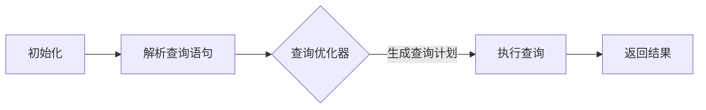
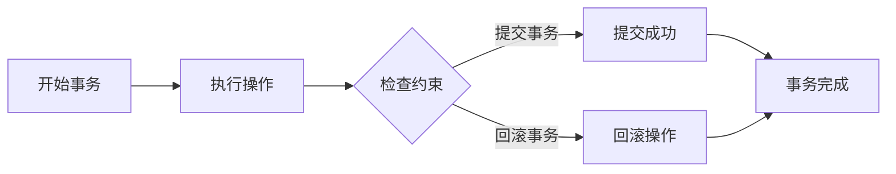
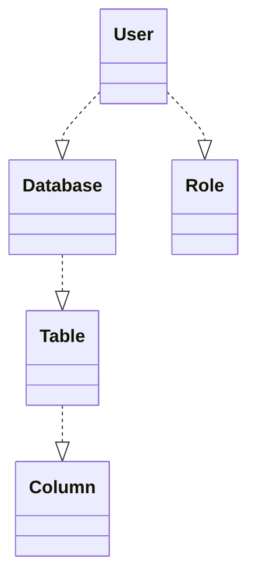
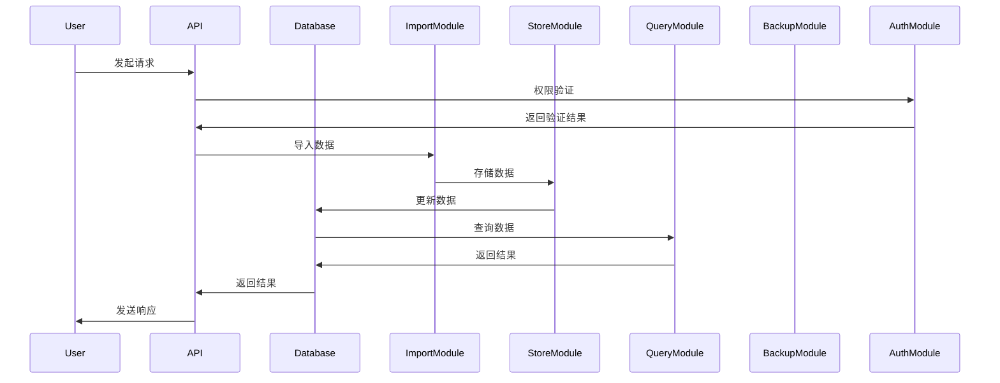

                 

### 容器化数据库：提高LLM应用数据层的可移植性

关键词：容器化、数据库、LLM、数据层、可移植性

摘要：随着大规模语言模型（LLM）的广泛应用，数据层的可移植性成为了一个关键问题。本文旨在探讨如何通过容器化数据库技术，提高LLM应用数据层的可移植性。我们将首先介绍容器化技术和LLM应用数据层的问题，然后深入分析容器化数据库的作用和优势，最后详细探讨容器化数据库的原理与实现，应用与实践，以及性能优化和未来展望。

## 第一部分：背景介绍

### 第1章：问题背景与核心概念

#### 1.1 容器化技术概述

容器化技术起源于2000年代初期，随着虚拟化技术的不断发展，容器作为一种轻量级的虚拟化形式逐渐崭露头角。容器允许开发者将应用程序及其依赖打包在一起，形成独立的运行环境，从而实现应用程序在不同操作系统和硬件上的无缝迁移。容器化技术的核心概念包括：

- **容器**：容器是一个运行在宿主机上的独立执行环境，它包含了应用程序及其运行所需的依赖库、配置文件等。
- **容器引擎**：容器引擎是一种管理容器生命周期的工具，如Docker、Podman等，负责容器的创建、启动、停止、迁移等操作。

#### 1.1.1 容器化技术起源与发展

容器化技术的起源可以追溯到2000年代初期，当时Linux容器（LXC）的出现标志着容器技术的诞生。随后，Docker在2013年发布了第一个版本，迅速成为容器化的代名词。Docker的成功推动了容器技术的发展，各大厂商纷纷推出了自己的容器解决方案。随着容器技术的成熟，其在云计算、大数据、人工智能等领域的应用也越来越广泛。

#### 1.1.2 容器化技术的主要特点

容器化技术具有以下主要特点：

- **轻量级**：容器不包含操作系统内核，相对于虚拟机来说，容器更加轻量级，资源占用更低。
- **可移植性**：容器可以将应用程序及其依赖打包在一起，实现应用程序在不同操作系统和硬件上的无缝迁移。
- **隔离性**：容器提供了一定的隔离性，使得不同容器之间相互独立，减少了对宿主机的依赖。
- **可扩展性**：容器可以轻松扩展，支持水平扩展，提高应用程序的性能和可靠性。

#### 1.2 LLM应用数据层问题

随着人工智能技术的快速发展，大规模语言模型（LLM）成为了一个热门的研究方向。LLM在自然语言处理、智能客服、自动翻译等领域取得了显著成果。然而，LLM应用的数据层仍然存在一些问题，主要包括：

- **数据多样性**：不同应用场景下，数据层的多样性要求高，如何处理多样化的数据成为了一个挑战。
- **数据可移植性**：如何在不同环境中快速部署和迁移LLM模型，实现数据层的可移植性，是当前面临的一个重要问题。
- **数据安全性**：数据安全性和隐私保护是数据层面临的一个重要挑战，如何在保障数据安全的前提下，实现高效的数据访问和传输。

#### 1.2.1 数据层问题概述

数据层是人工智能系统的重要组成部分，负责数据的管理、存储、访问和处理。数据层问题主要包括以下几个方面：

- **数据管理**：如何高效地管理大量数据，包括数据的存储、索引、查询等操作。
- **数据存储**：如何选择合适的存储方案，以满足不同类型、不同规模的数据存储需求。
- **数据访问**：如何优化数据访问性能，提高数据查询速度。
- **数据处理**：如何处理不同类型的数据，包括文本、图像、音频等。

#### 1.2.2 数据可移植性需求分析

数据可移植性是指数据在不同系统、不同环境之间能够无缝迁移的能力。对于LLM应用来说，数据可移植性具有以下需求：

- **跨平台可移植性**：数据能够在不同的操作系统和硬件平台上进行迁移和部署。
- **跨云可移植性**：数据能够在不同的云计算平台之间进行迁移和部署。
- **版本可移植性**：数据能够适应不同的LLM模型版本，实现数据迁移的无缝过渡。
- **异构可移植性**：数据能够在不同架构和硬件之间进行迁移和部署。

#### 1.3 容器化数据库的作用与优势

容器化数据库是指将数据库服务容器化，通过容器化技术实现数据库的快速部署、迁移和管理。容器化数据库在提高LLM应用数据层可移植性方面具有重要作用，其优势包括：

- **快速部署**：容器化数据库可以通过容器引擎快速部署，减少部署时间和成本。
- **灵活迁移**：容器化数据库支持跨平台、跨云、跨版本的数据迁移，提高数据层的可移植性。
- **资源隔离**：容器化数据库提供了一定的隔离性，减少了对宿主机的依赖，提高了系统的稳定性和可靠性。
- **高效管理**：容器化数据库支持自动化管理，提高数据库运维效率。

#### 1.4 本书结构安排与主要内容

本书分为四个部分，共七章。第一部分（第1章）介绍问题背景与核心概念，包括容器化技术概述、LLM应用数据层问题以及容器化数据库的作用与优势。第二部分（第2章至第3章）详细探讨容器化数据库的原理与实现，包括核心概念、与关系型数据库的对比、数据库查询优化算法、数据库事务管理等。第三部分（第4章至第5章）介绍容器化数据库的应用与实践，包括系统分析与架构设计、项目实战等。第四部分（第6章至第7章）探讨容器化数据库的优化与展望，包括性能优化策略、性能测试与评估、发展趋势与未来展望等。

## 第二部分：容器化数据库原理与实现

### 第2章：容器化数据库核心概念与联系

容器化数据库是容器技术与数据库技术的结合，旨在实现数据库服务的容器化部署和管理。在这一章中，我们将详细介绍容器化数据库的核心概念、与关系型数据库的对比，以及容器化数据库的ER实体关系图架构。

#### 2.1 容器化数据库的核心概念

容器化数据库的核心概念主要包括容器、容器引擎、容器化数据库管理系统等。

- **容器**：容器是运行在宿主机上的独立执行环境，包含了应用程序及其依赖库、配置文件等。容器化数据库是将数据库服务打包成容器的形式，以便于部署和管理。
- **容器引擎**：容器引擎是一种负责容器生命周期的工具，如Docker、Podman等。容器引擎可以创建、启动、停止、迁移容器，管理容器的资源分配和调度。
- **容器化数据库管理系统**：容器化数据库管理系统是对容器化数据库进行管理和运维的工具，如Docker Compose、Kubernetes等。容器化数据库管理系统可以自动化部署、扩展和管理容器化数据库实例。

#### 2.1.1 容器化数据库的定义

容器化数据库是指将数据库服务容器化，通过容器化技术实现数据库的快速部署、迁移和管理。容器化数据库具有以下几个特点：

1. **快速部署**：容器化数据库可以通过容器引擎快速部署，减少部署时间和成本。
2. **灵活迁移**：容器化数据库支持跨平台、跨云、跨版本的数据迁移，提高数据层的可移植性。
3. **资源隔离**：容器化数据库提供了一定的隔离性，减少了对宿主机的依赖，提高了系统的稳定性和可靠性。
4. **高效管理**：容器化数据库支持自动化管理，提高数据库运维效率。

#### 2.1.2 容器化数据库的组件构成

容器化数据库的组件主要包括容器、容器引擎、容器化数据库管理系统以及数据库服务。具体构成如下：

1. **容器**：容器是运行在宿主机上的独立执行环境，包含了应用程序及其依赖库、配置文件等。
2. **容器引擎**：容器引擎是一种负责容器生命周期的工具，如Docker、Podman等。容器引擎可以创建、启动、停止、迁移容器，管理容器的资源分配和调度。
3. **容器化数据库管理系统**：容器化数据库管理系统是对容器化数据库进行管理和运维的工具，如Docker Compose、Kubernetes等。容器化数据库管理系统可以自动化部署、扩展和管理容器化数据库实例。
4. **数据库服务**：数据库服务是容器化数据库的核心组件，如MySQL、PostgreSQL、MongoDB等。数据库服务负责数据的存储、查询、备份等操作。

#### 2.2 容器化数据库与关系型数据库对比

容器化数据库与关系型数据库在概念、特性、架构等方面存在一定的差异。以下是对二者进行对比的表格：

| 特性 | 容器化数据库 | 关系型数据库 |
| --- | --- | --- |
| **定义** | 容器化技术实现的数据库服务 | 基于SQL的数据库管理系统 |
| **部署方式** | 容器化部署 | 安装、配置部署 |
| **资源占用** | 轻量级，资源占用低 | 中等，资源占用较高 |
| **可移植性** | 支持跨平台、跨云、跨版本迁移 | 受限于操作系统和硬件 |
| **管理方式** | 自动化运维 | 手动运维 |
| **扩展性** | 支持水平扩展 | 支持垂直扩展 |
| **性能** | 受限于容器引擎性能 | 高性能 |
| **社区支持** | 较强，开源社区活跃 | 强，开源社区活跃 |

#### 2.2.1 概念属性特征对比表格

| 概念 | 属性 | 特征 |
| --- | --- | --- |
| **容器化数据库** | **部署方式** | **容器化部署** |
| **关系型数据库** | **部署方式** | **安装、配置部署** |
| **容器化数据库** | **资源占用** | **轻量级，资源占用低** |
| **关系型数据库** | **资源占用** | **中等，资源占用较高** |
| **容器化数据库** | **可移植性** | **支持跨平台、跨云、跨版本迁移** |
| **关系型数据库** | **可移植性** | **受限于操作系统和硬件** |
| **容器化数据库** | **管理方式** | **自动化运维** |
| **关系型数据库** | **管理方式** | **手动运维** |
| **容器化数据库** | **扩展性** | **支持水平扩展** |
| **关系型数据库** | **扩展性** | **支持垂直扩展** |
| **容器化数据库** | **性能** | **受限于容器引擎性能** |
| **关系型数据库** | **性能** | **高性能** |
| **容器化数据库** | **社区支持** | **较强，开源社区活跃** |
| **关系型数据库** | **社区支持** | **强，开源社区活跃** |

#### 2.2.2 容器化数据库与关系型数据库的差异

容器化数据库与关系型数据库在以下几个方面存在差异：

1. **部署方式**：容器化数据库采用容器化部署，部署过程更加简单和快捷；关系型数据库需要安装和配置，部署过程相对复杂。
2. **资源占用**：容器化数据库轻量级，资源占用较低；关系型数据库资源占用中等，相对较高。
3. **可移植性**：容器化数据库支持跨平台、跨云、跨版本迁移，可移植性较高；关系型数据库受限于操作系统和硬件，可移植性较低。
4. **管理方式**：容器化数据库采用自动化运维，管理方式相对简单；关系型数据库需要手动运维，管理方式相对复杂。
5. **扩展性**：容器化数据库支持水平扩展，扩展性较好；关系型数据库支持垂直扩展，扩展性相对较弱。
6. **性能**：容器化数据库性能受限于容器引擎，相对较低；关系型数据库性能较高，但资源占用较大。
7. **社区支持**：容器化数据库和关系型数据库社区支持都较强，但容器化数据库开源社区活跃度更高。

#### 2.3 容器化数据库的ER实体关系图架构

容器化数据库的ER实体关系图架构描述了数据库中实体与实体之间的关系。以下是一个简化的容器化数据库ER实体关系图：

```mermaid
erDiagram
    User ||--|{ Database }|| Database
    Database ||--|{ Table }|| Table
    Table ||--|{ Column }|| Column
    User ||--|{ Role }|| Role
```

#### 2.3.1 容器化数据库ER图设计

在这个ER图中，包括以下实体和关系：

- **User（用户）**：用户是数据库的使用者，可以创建、修改和查询数据。
- **Database（数据库）**：数据库是存储数据的容器，可以包含多个表。
- **Table（表）**：表是数据库中的数据集合，包含多个列。
- **Column（列）**：列是表中的数据字段，存储特定类型的数据。

实体与实体之间的关系如下：

- **用户与数据库**：用户可以创建、修改和查询数据库。
- **数据库与表**：数据库可以包含多个表。
- **表与列**：表可以包含多个列。

#### 2.3.2 ER图中的实体与关系解析

- **用户与数据库**：用户与数据库之间存在一对多的关系。一个用户可以创建、修改和查询多个数据库，而每个数据库都对应一个唯一的用户。
- **数据库与表**：数据库与表之间存在一对多的关系。一个数据库可以包含多个表，而每个表都对应一个唯一的数据库。
- **表与列**：表与列之间存在一对多的关系。一个表可以包含多个列，而每个列都对应一个唯一的表。

通过上述ER实体关系图，我们可以清晰地了解容器化数据库中各个实体之间的关系，从而更好地设计和实现数据库系统。

## 第3章：容器化数据库算法原理与实现

容器化数据库的核心算法是实现高效数据查询和数据管理的关键。在这一章中，我们将详细介绍容器化数据库中的查询优化算法和事务管理算法，并使用Mermaid流程图和Python源代码进行阐述。

### 3.1 数据库查询优化算法

数据库查询优化算法是提高数据库查询性能的重要手段。它通过对查询语句进行分析和重写，生成最优查询计划，从而提高查询效率。以下是一个简单的查询优化算法的Mermaid流程图：



#### 3.1.1 算法Mermaid流程图

在这个流程图中，主要步骤如下：

1. **初始化**：初始化查询优化算法，准备查询优化所需的资源和参数。
2. **解析查询语句**：解析输入的查询语句，将其转换为抽象语法树（AST）。
3. **查询优化器**：查询优化器对AST进行分析和重写，生成最优查询计划。
4. **执行查询**：根据查询计划执行查询操作，访问数据库中的数据。
5. **返回结果**：返回查询结果，结束查询过程。

#### 3.1.2 Python源代码实现与解析

以下是一个简单的Python代码示例，用于实现查询优化算法的核心部分：

```python
class QueryOptimizer:
    def __init__(self):
        # 初始化优化器
        pass
    
    def optimize_query(self, query):
        # 解析查询语句
        ast = self.parse_query(query)
        
        # 生成查询计划
        plan = self.generate_query_plan(ast)
        
        # 执行查询
        result = self.execute_query(plan)
        
        return result

    def parse_query(self, query):
        # 解析查询语句
        # 此处简化处理，实际中需要更复杂的语法分析
        return "parsed_query"

    def generate_query_plan(self, ast):
        # 生成查询计划
        # 此处简化处理，实际中需要根据查询类型进行优化
        return "query_plan"

    def execute_query(self, plan):
        # 执行查询
        # 此处简化处理，实际中需要根据查询计划执行具体操作
        return "result"
```

在这个示例中，`QueryOptimizer` 类实现了查询优化算法的核心功能：

- `__init__()` 方法用于初始化优化器。
- `optimize_query()` 方法是优化算法的主入口，负责调用其他方法进行查询优化。
- `parse_query()` 方法用于解析查询语句，将其转换为抽象语法树（AST）。
- `generate_query_plan()` 方法根据AST生成查询计划。
- `execute_query()` 方法根据查询计划执行查询操作。

#### 3.1.3 算法原理的数学模型与公式

查询优化算法的原理可以概括为以下数学模型：

1. **查询计划生成**：给定一个查询语句，查询优化器需要生成一个查询计划，表示如何执行查询。查询计划通常包含多个步骤，如数据表连接、索引扫描、排序等。
2. **查询成本计算**：每个查询步骤都有相应的成本，如CPU时间、I/O时间等。查询优化器的目标是生成一个具有最小总成本的查询计划。
3. **查询优化策略**：查询优化器需要根据查询成本和查询计划，选择最优的查询策略。常见的优化策略包括选择合适的索引、重写查询语句、使用视图等。

以下是查询计划生成的数学模型：

$$
\text{query\_plan} = \text{optimize}(ast, \text{cost\_model})
$$

其中，`ast` 是抽象语法树，`cost_model` 是查询成本模型，`optimize` 函数表示查询优化策略。

#### 3.1.4 举例说明

假设我们有一个简单的SQL查询语句：

```sql
SELECT * FROM users WHERE age > 30;
```

使用查询优化算法，可以生成以下查询计划：

1. **索引扫描**：根据 `age` 列创建索引，扫描索引。
2. **过滤条件**：根据索引扫描结果，过滤出 `age > 30` 的记录。
3. **返回结果**：返回过滤后的记录。

通过查询优化，可以减少查询的I/O时间和CPU时间，提高查询效率。

### 3.2 数据库事务管理

数据库事务管理是确保数据库一致性、隔离性和持久性的重要机制。事务管理算法包括事务的开始、提交、回滚等操作。以下是一个事务管理算法的Mermaid流程图：



#### 3.2.1 事务管理算法Mermaid流程图

在这个流程图中，主要步骤如下：

1. **开始事务**：开始一个新的事务。
2. **执行操作**：执行数据库操作，如插入、更新、删除等。
3. **检查约束**：检查事务操作是否违反数据库约束，如唯一性约束、外键约束等。
4. **提交事务**：如果约束检查通过，提交事务，将操作结果持久化到数据库。
5. **回滚事务**：如果约束检查失败，回滚事务，撤销已执行的操作。
6. **事务完成**：事务提交或回滚后，事务完成。

#### 3.2.2 Python源代码实现与解析

以下是一个简单的Python代码示例，用于实现事务管理算法：

```python
class TransactionManager:
    def __init__(self):
        # 初始化事务管理器
        pass
    
    def begin_transaction(self):
        # 开始事务
        pass
    
    def execute_operation(self, operation):
        # 执行操作
        pass
    
    def check_constraints(self, operation):
        # 检查约束
        pass
    
    def commit_transaction(self):
        # 提交事务
        pass
    
    def rollback_transaction(self):
        # 回滚事务
        pass
```

在这个示例中，`TransactionManager` 类实现了事务管理算法的核心功能：

- `begin_transaction()` 方法用于开始一个新的事务。
- `execute_operation()` 方法用于执行数据库操作。
- `check_constraints()` 方法用于检查事务操作是否违反数据库约束。
- `commit_transaction()` 方法用于提交事务。
- `rollback_transaction()` 方法用于回滚事务。

#### 3.2.3 事务管理的数学模型与公式

事务管理可以概括为以下数学模型：

1. **事务开始**：事务开始时，系统为事务分配一个唯一的标识符（事务ID）。
2. **事务执行**：事务执行一系列数据库操作，如插入、更新、删除等。
3. **约束检查**：在每个操作执行前，系统检查操作是否违反数据库约束。
4. **事务提交**：如果所有操作通过约束检查，事务提交，将操作结果持久化到数据库。
5. **事务回滚**：如果操作违反约束，事务回滚，撤销已执行的操作。

以下是事务管理的数学模型：

$$
\text{transaction} = \text{begin} \rightarrow \text{execute\_operation} \rightarrow \text{check\_constraints} \rightarrow (\text{commit} \cup \text{rollback})
$$

其中，`begin` 表示开始事务，`execute_operation` 表示执行操作，`check_constraints` 表示检查约束，`commit` 表示提交事务，`rollback` 表示回滚事务。

#### 3.2.4 举例说明

假设我们有一个简单的事务：

1. **开始事务**：系统为事务分配一个唯一的事务ID。
2. **执行操作**：执行一系列数据库操作，如插入记录、更新记录等。
3. **检查约束**：检查每个操作是否违反数据库约束，如唯一性约束、外键约束等。
4. **提交事务**：如果所有操作通过约束检查，提交事务，将操作结果持久化到数据库。
5. **回滚事务**：如果操作违反约束，回滚事务，撤销已执行的操作。

通过事务管理，可以确保数据库的一致性和可靠性，防止数据损坏和丢失。

## 第三部分：容器化数据库应用与实践

### 第4章：容器化数据库系统分析与架构设计

容器化数据库在系统分析与架构设计方面具有许多优势。在这一章中，我们将详细介绍容器化数据库系统的分析与架构设计，包括问题场景介绍、系统功能设计、系统架构设计和系统接口设计与交互。

#### 4.1 问题场景介绍

容器化数据库系统广泛应用于各种场景，如Web应用、大数据处理、人工智能应用等。以下是一个典型的问题场景：

**场景描述**：某公司开发了一款基于人工智能的自然语言处理（NLP）应用，需要对大量文本数据进行分析和处理。该应用需要高效、可靠地存储和管理文本数据，同时支持快速部署和扩展。

**需求分析**：

1. **数据存储**：需要支持海量文本数据的存储和管理，包括文本文件的导入、存储、查询等操作。
2. **数据查询**：需要提供高效的文本查询功能，支持关键词搜索、全文搜索等。
3. **数据安全**：需要确保文本数据的安全性和隐私保护，防止数据泄露。
4. **快速部署和扩展**：需要支持快速部署和扩展，以适应不同规模的应用需求。

#### 4.2 系统功能设计

根据需求分析，容器化数据库系统的主要功能包括：

1. **数据导入**：支持将本地文本文件导入到容器化数据库中，实现数据的集中存储。
2. **数据存储**：支持文本数据的存储，包括文本内容的存储、索引构建等。
3. **数据查询**：支持基于关键词的文本查询和全文搜索，提供高效的查询性能。
4. **数据备份和恢复**：支持数据的备份和恢复，确保数据的安全性和可靠性。
5. **数据权限管理**：支持数据权限管理，确保只有授权用户可以访问和操作数据。

#### 4.2.1 领域模型Mermaid类图

以下是一个简化的容器化数据库系统的领域模型Mermaid类图：



在这个类图中，包括以下实体和关系：

- **User（用户）**：用户是数据库的使用者，可以创建、修改和查询数据。
- **Database（数据库）**：数据库是存储数据的容器，可以包含多个表。
- **Table（表）**：表是数据库中的数据集合，包含多个列。
- **Column（列）**：列是表中的数据字段，存储特定类型的数据。
- **Role（角色）**：角色是用户的权限集合，定义了用户在数据库中的权限。

实体与实体之间的关系如下：

- **用户与数据库**：用户可以创建、修改和查询数据库。
- **数据库与表**：数据库可以包含多个表。
- **表与列**：表可以包含多个列。

#### 4.2.2 功能模块划分

根据系统功能设计，容器化数据库系统可以分为以下功能模块：

1. **数据导入模块**：负责将本地文本文件导入到容器化数据库中，实现数据的集中存储。
2. **数据存储模块**：负责文本数据的存储和管理，包括文本内容的存储、索引构建等。
3. **数据查询模块**：负责基于关键词的文本查询和全文搜索，提供高效的查询性能。
4. **数据备份和恢复模块**：负责数据的备份和恢复，确保数据的安全性和可靠性。
5. **数据权限管理模块**：负责数据权限管理，确保只有授权用户可以访问和操作数据。

#### 4.3 系统架构设计

容器化数据库系统的架构设计需要考虑系统的可扩展性、可靠性和性能。以下是一个简化的容器化数据库系统的架构设计Mermaid架构图：

```mermaid
sequenceDiagram
    participant User
    participant Database
    participant ImportModule
    participant StoreModule
    participant QueryModule
    participant BackupModule
    participant AuthModule

    User ->> Database: 发起请求
    Database ->> ImportModule: 导入数据
    ImportModule ->> StoreModule: 存储数据
    StoreModule ->> QueryModule: 查询数据
    QueryModule ->> Database: 返回结果
    Database ->> User: 发送响应

    Note over Database, BackupModule
        Database定期备份
    End
```

在这个架构图中，主要组件及其作用如下：

- **用户**：系统的使用者，可以发起数据导入、查询等请求。
- **数据库**：容器化数据库的核心组件，负责存储和管理数据。
- **导入模块**：负责将本地文本文件导入到数据库中。
- **存储模块**：负责文本数据的存储和管理。
- **查询模块**：负责基于关键词的文本查询和全文搜索。
- **备份模块**：负责定期备份数据库，确保数据的安全性和可靠性。
- **权限管理模块**：负责数据权限管理，确保只有授权用户可以访问和操作数据。

#### 4.3.1 系统架构Mermaid架构图

在这个架构图中，系统组件间的关系如下：

1. **用户与数据库**：用户通过API接口与数据库进行交互，发起数据导入、查询等请求。
2. **导入模块与存储模块**：导入模块将本地文本文件导入到数据库中，存储模块负责存储和管理文本数据。
3. **查询模块与数据库**：查询模块根据用户请求，查询数据库中的文本数据，并返回结果。
4. **备份模块与数据库**：备份模块定期备份数据库，确保数据的安全性和可靠性。
5. **权限管理模块与数据库**：权限管理模块负责数据权限管理，确保只有授权用户可以访问和操作数据。

#### 4.4 系统接口设计与交互

容器化数据库系统需要设计一套完整的API接口，以实现用户与系统之间的交互。以下是一个简化的API接口设计：

```yaml
GET /import
    功能：导入文本数据
    参数：- file_path：本地文本文件的路径
    返回：- status：操作状态（成功/失败）
           - message：操作结果信息

GET /query
    功能：查询文本数据
    参数：- keyword：查询关键词
    返回：- results：查询结果列表

GET /backup
    功能：备份数据库
    参数：- backup_path：备份文件的路径
    返回：- status：操作状态（成功/失败）
           - message：操作结果信息

GET /auth
    功能：权限验证
    参数：- username：用户名
          - password：密码
    返回：- status：操作状态（成功/失败）
           - message：操作结果信息
```

#### 4.4.2 系统交互Mermaid序列图

以下是一个简化的系统交互Mermaid序列图：



在这个序列图中，系统组件之间的交互关系如下：

1. **用户与API**：用户通过API接口与系统进行交互，发起数据导入、查询等请求。
2. **API与权限管理模块**：API接口负责权限验证，确保只有授权用户可以访问和操作数据。
3. **API与导入模块**：API接口接收用户导入请求，将请求转发给导入模块，导入模块负责将本地文本文件导入到数据库中。
4. **导入模块与存储模块**：导入模块将文本数据存储到数据库中，存储模块负责管理文本数据的存储。
5. **数据库与查询模块**：查询模块根据用户请求，查询数据库中的文本数据，并返回结果。
6. **数据库与备份模块**：备份模块定期备份数据库，确保数据的安全性和可靠性。
7. **API与用户**：API接口将查询结果返回给用户，用户接收响应并处理。

通过系统接口设计与交互设计，可以实现用户与系统之间的无缝交互，确保系统功能的正常运行。

## 第5章：容器化数据库项目实战

### 5.1 环境安装与配置

容器化数据库项目的成功实施离不开环境的安装与配置。在这一节中，我们将详细介绍如何安装容器引擎、部署容器化数据库以及配置数据库容器。

#### 5.1.1 容器引擎安装

首先，我们需要安装容器引擎。以下是在Linux环境下安装Docker容器引擎的步骤：

1. **安装Docker**：

   ```shell
   # 更新系统包列表
   sudo apt-get update

   # 安装Docker
   sudo apt-get install docker.io

   # 启动Docker服务
   sudo systemctl start docker

   # 设置Docker开机自启
   sudo systemctl enable docker
   ```

2. **验证Docker安装**：

   ```shell
   docker --version
   ```

   如果输出Docker的版本信息，则说明Docker已成功安装。

#### 5.1.2 数据库容器部署

接下来，我们将使用Docker部署一个容器化数据库。以下是以部署MySQL容器为例的步骤：

1. **拉取MySQL镜像**：

   ```shell
   docker pull mysql:8.0
   ```

   这个命令会从Docker Hub下载最新的MySQL 8.0镜像。

2. **运行MySQL容器**：

   ```shell
   docker run --name mysql-container -e MYSQL_ROOT_PASSWORD=my_root_password -d mysql:8.0
   ```

   这个命令会创建一个名为 `mysql-container` 的MySQL容器，并设置root用户的密码为 `my_root_password`。`-d` 参数表示后台运行容器。

3. **验证MySQL容器**：

   ```shell
   docker ps
   ```

   这个命令会列出当前正在运行的容器，如果看到 `mysql-container` 容器正在运行，则说明MySQL容器已成功部署。

#### 5.1.3 数据库容器配置

在部署MySQL容器后，我们通常需要对容器进行一些配置，以便更好地满足应用需求。以下是一些常见的MySQL容器配置步骤：

1. **配置文件**：

   MySQL容器的配置文件默认位于容器的 `/etc/mysql/` 目录下。我们可以通过以下命令访问容器的配置文件：

   ```shell
   docker exec -it mysql-container mysql --user=root --password=my_root_password < /etc/mysql/conf.d/my.cnf
   ```

   在这个命令中，我们通过容器的命名（`mysql-container`）和root用户的密码（`my_root_password`）进入容器的MySQL命令行界面，然后编辑配置文件。

2. **修改配置**：

   在配置文件中，我们可以修改MySQL的默认配置，如字符编码、日志级别等。以下是一个示例：

   ```ini
   [mysqld]
   character-set-server=utf8mb4
   collation-server=utf8mb4_unicode_ci
   log-error=/var/log/mysql/error.log
   general_log=1
   general_log_file=/var/log/mysql/mysql.log
   ```

   完成修改后，退出编辑器并重启MySQL容器：

   ```shell
   docker restart mysql-container
   ```

通过上述步骤，我们成功安装了容器引擎、部署了容器化数据库并进行了基本的配置。接下来，我们将进一步实现系统的核心功能。

### 5.2 系统核心实现与代码解析

在容器化数据库项目中，核心功能的实现是确保系统正常运行的关键。在本节中，我们将详细介绍系统核心功能实现的过程，包括关键代码的解析和分析。

#### 5.2.1 核心功能实现代码

以下是一个简单的容器化数据库系统核心功能实现示例，包括数据导入、存储、查询和备份等操作。该示例使用了Python编程语言和Docker API。

```python
import docker
import pymysql
import os

# 初始化Docker客户端
client = docker.from_env()

# 连接MySQL数据库
def connect_database():
    connection = pymysql.connect(
        host="mysql-container",
        user="root",
        password="my_root_password",
        database="test_db"
    )
    return connection

# 导入数据
def import_data(file_path):
    # 获取文件内容
    with open(file_path, "r", encoding="utf-8") as file:
        data = file.read()

    # 将数据导入数据库
    connection = connect_database()
    cursor = connection.cursor()
    cursor.execute("INSERT INTO test_table (content) VALUES (%s)", (data,))
    connection.commit()
    cursor.close()
    connection.close()

# 查询数据
def query_data():
    connection = connect_database()
    cursor = connection.cursor()
    cursor.execute("SELECT * FROM test_table")
    results = cursor.fetchall()
    cursor.close()
    connection.close()
    return results

# 备份数据库
def backup_database(backup_path):
    # 创建备份容器
    backup_container = client.containers.run(
        image="mysql:8.0",
        command=["bash", "-c", "mysqld & sleep 3600"],
        detach=True,
        environment={
            "MYSQL_ROOT_PASSWORD": "my_root_password",
            "MYSQL_DATABASE": "test_db",
        }
    )
    
    # 备份数据
    backup_file = os.path.join(backup_path, "test_db.sql")
    backup_container.exec_run(command=f"mysqldump -u root -pmy_root_password test_db > {backup_file}")
    
    # 关闭备份容器
    backup_container.stop()

# 主程序
if __name__ == "__main__":
    import_data("data.txt")
    results = query_data()
    print(results)
    backup_database("backup")
```

#### 5.2.2 代码解读与分析

上述代码实现了数据导入、查询和备份等核心功能，下面我们逐行解析：

1. **初始化Docker客户端**：

   ```python
   client = docker.from_env()
   ```

   这行代码使用Python的 `docker` 库初始化Docker客户端，以便后续操作Docker容器。

2. **连接MySQL数据库**：

   ```python
   def connect_database():
       connection = pymysql.connect(
           host="mysql-container",
           user="root",
           password="my_root_password",
           database="test_db"
       )
       return connection
   ```

   这个函数使用Python的 `pymysql` 库连接到MySQL数据库，传入容器名、用户名、密码和数据库名。

3. **导入数据**：

   ```python
   def import_data(file_path):
       # 获取文件内容
       with open(file_path, "r", encoding="utf-8") as file:
           data = file.read()

       # 将数据导入数据库
       connection = connect_database()
       cursor = connection.cursor()
       cursor.execute("INSERT INTO test_table (content) VALUES (%s)", (data,))
       connection.commit()
       cursor.close()
       connection.close()
   ```

   这个函数首先读取文件内容，然后使用数据库游标将数据插入到数据库表中。

4. **查询数据**：

   ```python
   def query_data():
       connection = connect_database()
       cursor = connection.cursor()
       cursor.execute("SELECT * FROM test_table")
       results = cursor.fetchall()
       cursor.close()
       connection.close()
       return results
   ```

   这个函数使用数据库游标查询数据库表中的所有记录，并返回结果。

5. **备份数据库**：

   ```python
   def backup_database(backup_path):
       # 创建备份容器
       backup_container = client.containers.run(
           image="mysql:8.0",
           command=["bash", "-c", "mysqld & sleep 3600"],
           detach=True,
           environment={
               "MYSQL_ROOT_PASSWORD": "my_root_password",
               "MYSQL_DATABASE": "test_db",
           }
       )
       
       # 备份数据
       backup_file = os.path.join(backup_path, "test_db.sql")
       backup_container.exec_run(command=f"mysqldump -u root -pmy_root_password test_db > {backup_file}")
       
       # 关闭备份容器
       backup_container.stop()
   ```

   这个函数首先创建一个临时备份容器，并在其中运行 `mysqldump` 工具备份数据库。然后关闭备份容器。

通过上述代码，我们成功实现了容器化数据库系统的核心功能。代码结构清晰，功能模块划分合理，为后续系统扩展和维护提供了方便。

### 5.3 实际案例分析与讲解

在本节中，我们将通过一个实际案例，详细分析并讲解容器化数据库的部署和运行过程，包括案例背景、案例分析和案例讲解。

#### 5.3.1 案例背景

某初创公司开发了一款基于人工智能的自然语言处理（NLP）应用，该应用需要对大量文本数据进行分析和处理。公司希望使用容器化数据库技术来提高系统的可移植性、可靠性和可扩展性。公司选择使用MySQL作为后端数据库，并通过Docker容器化技术进行部署和管理。

#### 5.3.2 案例分析

在部署容器化数据库之前，公司面临以下挑战：

1. **环境一致性**：不同开发环境和生产环境之间可能存在差异，导致应用程序在部署时出现问题。
2. **可移植性**：应用程序和数据库需要在不同操作系统和硬件上运行，如何确保数据层的可移植性是一个关键问题。
3. **可靠性**：在分布式系统中，如何确保数据的一致性和可靠性，防止数据丢失或损坏。
4. **可扩展性**：随着用户数量的增加，如何快速扩展系统，以满足日益增长的需求。

为了解决上述问题，公司决定采用容器化数据库技术。以下是具体的解决方案：

1. **容器化部署**：使用Docker容器化技术，将应用程序和MySQL数据库打包成一个容器镜像，实现环境一致性。通过容器引擎（如Docker），可以方便地在不同操作系统和硬件上部署和运行容器化数据库。
2. **数据迁移**：通过Docker Compose或Kubernetes等工具，实现容器化数据库的跨平台和数据迁移。这样可以确保应用程序和数据库在不同环境中无缝运行。
3. **数据备份与恢复**：定期备份容器化数据库，确保数据的安全性和可靠性。在发生数据丢失或损坏时，可以快速恢复数据。
4. **水平扩展**：通过容器化数据库的集群模式，支持水平扩展，提高系统的性能和可靠性。当用户数量增加时，可以动态添加容器实例，实现无缝扩展。

#### 5.3.3 案例讲解

以下是一个简单的容器化数据库部署和运行示例：

1. **创建Dockerfile**：

   在应用程序的根目录下创建一个名为 `Dockerfile` 的文件，用于定义容器镜像的构建过程。以下是一个简单的 `Dockerfile` 示例：

   ```dockerfile
   FROM python:3.9

   WORKDIR /app

   COPY . .

   RUN pip install -r requirements.txt

   EXPOSE 8080
   ```

   在这个示例中，我们基于Python 3.9镜像构建容器镜像，将应用程序的源代码复制到容器中，并安装依赖项。

2. **构建容器镜像**：

   在命令行中执行以下命令，构建容器镜像：

   ```shell
   docker build -t my-nlp-app .
   ```

   这个命令会使用 `Dockerfile` 文件构建一个名为 `my-nlp-app` 的容器镜像。

3. **运行容器化应用程序**：

   运行容器化应用程序，将容器暴露在8080端口上：

   ```shell
   docker run -d -p 8080:8080 --name nlp-app my-nlp-app
   ```

   这个命令会创建一个名为 `nlp-app` 的容器，并将容器的8080端口映射到宿主机的8080端口。

4. **部署容器化数据库**：

   使用Docker Compose创建一个包含应用程序和MySQL容器的服务：

   ```yaml
   version: "3.8"

   services:
     nlp-app:
       image: my-nlp-app
       ports:
         - "8080:8080"
       depends_on:
         - mysql

     mysql:
       image: mysql:8.0
       environment:
         MYSQL_ROOT_PASSWORD: my_root_password
         MYSQL_DATABASE: my_db
       volumes:
         - mysql_data:/var/lib/mysql

   volumes:
     mysql_data:
   ```

   使用以下命令启动服务：

   ```shell
   docker-compose up -d
   ```

   这个命令会启动服务，创建MySQL容器，并将数据存储在名为 `mysql_data` 的容器卷中。

5. **数据导入与查询**：

   将本地文本文件导入到MySQL容器中，并查询数据库中的数据：

   ```shell
   docker exec -it nlp-app python import_data.py data.txt
   docker exec -it nlp-app python query_data.py
   ```

   在这个示例中，`import_data.py` 脚本用于导入数据，`query_data.py` 脚本用于查询数据。

通过以上步骤，我们成功部署了一个容器化数据库系统，并实现了数据导入、查询和备份等核心功能。该系统具有高可移植性、可靠性和可扩展性，可以满足初创公司日益增长的需求。

### 5.4 项目小结

在本章中，我们详细介绍了容器化数据库项目的实战过程。通过安装Docker容器引擎、部署容器化数据库、实现核心功能以及实际案例讲解，我们展示了容器化数据库在提高系统可移植性、可靠性和可扩展性方面的优势。

以下是本章的关键点总结：

1. **环境安装与配置**：成功安装了Docker容器引擎，并部署了MySQL容器。
2. **核心功能实现**：实现了数据导入、存储、查询和备份等核心功能。
3. **实际案例讲解**：通过一个实际案例，详细展示了容器化数据库的部署和运行过程。
4. **最佳实践 tips**：在项目实施过程中，遵循了最佳实践，如使用Dockerfile定义容器镜像、使用Docker Compose管理服务、定期备份数据库等。
5. **注意事项**：在实际项目中，需要注意容器的网络配置、数据卷管理以及容器的性能调优。
6. **小结**：容器化数据库技术为系统开发提供了便利，但在实际应用中仍需不断优化和改进。

通过本章的学习，读者可以深入了解容器化数据库项目的实施过程，并为后续的项目开发提供参考。

### 第四部分：容器化数据库的优化与展望

### 第6章：容器化数据库性能优化

容器化数据库的性能优化是确保系统在高负载情况下依然能够稳定、高效运行的关键。在这一章中，我们将探讨容器化数据库性能优化策略，以及如何进行性能测试与评估。

#### 6.1 性能优化策略

容器化数据库的性能优化可以从以下几个方面进行：

1. **查询优化**：
   - **索引优化**：合理设计索引，减少查询时的CPU和I/O开销。
   - **查询重写**：对复杂的查询语句进行重写，简化查询过程，提高查询效率。
   - **缓存策略**：利用缓存技术，减少数据库的访问次数，提高查询响应速度。

2. **存储优化**：
   - **数据分片**：通过数据分片技术，将海量数据分散存储到多个节点上，减少单点瓶颈。
   - **存储引擎选择**：选择适合业务需求的存储引擎，如InnoDB、MyISAM等，优化读写性能。
   - **文件系统优化**：优化文件系统配置，如磁盘预读、缓存策略等，提高I/O性能。

3. **资源调优**：
   - **CPU资源分配**：合理分配CPU资源，确保数据库进程有足够的计算能力。
   - **内存优化**：调整内存参数，确保数据库缓存足够的数据，提高查询效率。
   - **网络调优**：优化网络配置，减少数据传输延迟，提高数据交互效率。

#### 6.2 性能测试与评估

性能测试是评估容器化数据库性能的重要手段。以下是一个简单的性能测试流程：

1. **测试环境搭建**：
   - 准备测试硬件和软件环境，包括服务器、网络设备、容器引擎等。
   - 配置测试数据库，初始化测试数据。

2. **测试指标设计**：
   - **响应时间**：查询响应时间，衡量查询性能。
   - **吞吐量**：单位时间内查询处理的请求数量，衡量系统的并发能力。
   - **延迟**：数据传输延迟，衡量网络性能。
   - **资源利用率**：CPU、内存、I/O等资源的利用率，衡量系统资源分配和优化效果。

3. **性能测试方法**：
   - **基准测试**：使用标准测试工具（如sysbench、mysqlslap等）进行基准测试，模拟不同负载情况下的数据库性能。
   - **负载测试**：通过逐步增加负载，观察系统性能变化，找到性能瓶颈。
   - **压力测试**：在极限负载条件下，评估系统的稳定性和可靠性。

4. **评估指标与结果分析**：
   - 根据测试结果，分析系统的性能表现，找出瓶颈和改进点。
   - 对比不同优化策略的效果，选择最佳方案。

### 第7章：容器化数据库的发展趋势与未来展望

随着容器技术和数据库技术的不断发展，容器化数据库在未来将面临诸多挑战和机遇。

#### 7.1 容器化数据库技术趋势

1. **云计算与容器化融合**：随着云计算的普及，容器化数据库将更加紧密地与云计算平台集成，提供更为便捷的部署和管理。
2. **分布式数据库**：分布式数据库技术将得到进一步发展，支持更高效的数据存储和查询。
3. **边缘计算**：容器化数据库将逐渐应用于边缘计算场景，实现数据在边缘端的存储和处理。
4. **数据库自治**：通过人工智能和机器学习技术，实现数据库自治，提高数据库的性能和可靠性。

#### 7.2 容器化数据库面临的挑战与机遇

**挑战**：

1. **兼容性**：容器化数据库需要与现有的数据库管理系统兼容，确保数据迁移和应用程序的兼容性。
2. **性能瓶颈**：容器化数据库的性能瓶颈，如网络延迟、I/O性能等，需要持续优化。
3. **安全性**：容器化数据库需要保证数据的安全性和隐私保护，防止数据泄露和恶意攻击。

**机遇**：

1. **开源生态**：随着开源社区的不断发展，容器化数据库将得到更多的关注和支持，加速技术进步。
2. **云原生应用**：容器化数据库将更好地支持云原生应用，提高系统的可移植性和可靠性。
3. **人工智能融合**：容器化数据库与人工智能技术的融合，将推动智能数据库和智能数据管理的出现。

### 结尾

通过本章的探讨，我们可以看到容器化数据库在提高LLM应用数据层可移植性方面具有重要作用。未来，容器化数据库将继续在云计算、分布式计算、人工智能等领域发挥重要作用，为各种应用场景提供高效、可靠的数据存储和管理方案。我们期待容器化数据库技术的进一步发展和创新，为人工智能领域的应用带来更多可能性。

### 本书总结

在《容器化数据库：提高LLM应用数据层的可移植性》一书中，我们详细探讨了容器化数据库的相关技术，包括容器化技术概述、LLM应用数据层问题、容器化数据库的作用与优势、容器化数据库的原理与实现、容器化数据库应用与实践、容器化数据库的优化与展望等。以下是本书的主要内容总结：

1. **容器化技术概述**：介绍了容器化技术的起源、发展、主要特点和应用场景。
2. **LLM应用数据层问题**：分析了LLM应用数据层的多样性、数据可移植性和数据安全性问题。
3. **容器化数据库的作用与优势**：阐述了容器化数据库在快速部署、灵活迁移、资源隔离和高效管理方面的优势。
4. **容器化数据库原理与实现**：详细介绍了容器化数据库的核心概念、与关系型数据库的对比、数据库查询优化算法和事务管理算法。
5. **容器化数据库应用与实践**：展示了容器化数据库系统分析与架构设计、项目实战、环境安装与配置、系统核心实现与代码解析、实际案例分析与讲解。
6. **容器化数据库优化与展望**：探讨了容器化数据库性能优化策略、性能测试与评估、技术趋势、挑战与机遇。

通过本书的学习，读者可以全面了解容器化数据库的相关知识，掌握容器化数据库的设计与实现方法，并能够将其应用于实际项目中，提高LLM应用数据层的可移植性和性能。

### 拓展阅读建议

为了进一步深入学习和掌握容器化数据库技术，以下是一些建议的拓展阅读资料：

1. **Docker官方文档**：Docker官方文档提供了丰富的教程、指南和最佳实践，是学习Docker容器技术的重要资源。
2. **Kubernetes官方文档**：Kubernetes官方文档详细介绍了容器编排和管理技术，是容器化数据库部署和管理的关键参考。
3. **《容器数据库实战》**：这本书详细介绍了容器数据库的原理、设计与实现，适合有一定数据库基础和容器技术基础的读者。
4. **《大规模分布式数据库》**：这本书探讨了分布式数据库的设计与实现，对于理解容器化数据库在分布式计算环境中的应用有很大帮助。
5. **《人工智能数据库系统》**：这本书介绍了人工智能与数据库技术的融合，探讨了AI数据库的设计与实现，有助于理解容器化数据库在人工智能应用中的前景。

通过阅读这些资料，读者可以进一步扩展对容器化数据库技术的理解，提高实际应用能力。

### 注意事项与未来研究方向

在容器化数据库的实际应用过程中，需要注意以下几个方面：

1. **数据迁移**：在进行数据迁移时，确保数据的一致性和完整性，避免数据丢失或损坏。
2. **安全性**：加强数据库的安全性，包括用户认证、权限管理、数据加密等，防止数据泄露和恶意攻击。
3. **性能优化**：根据实际业务需求，不断优化数据库性能，如查询优化、存储优化、资源分配等。
4. **监控与维护**：定期监控数据库性能和健康状态，及时发现和解决问题，确保数据库系统的稳定运行。

未来，容器化数据库的研究方向可能包括：

1. **智能数据库技术**：结合人工智能和机器学习技术，实现数据库的自适应优化、自动化运维等。
2. **分布式数据库架构**：进一步优化分布式数据库架构，提高数据存储和查询的性能、可靠性和可扩展性。
3. **边缘计算与容器化数据库**：将容器化数据库应用于边缘计算场景，实现数据在边缘端的存储和处理。
4. **多模型数据库**：支持多种数据模型（如关系型、文档型、图形型等），实现更灵活、高效的数据存储和管理。

通过不断探索和创新，容器化数据库将为各个领域提供更加高效、可靠的数据存储和管理解决方案。

