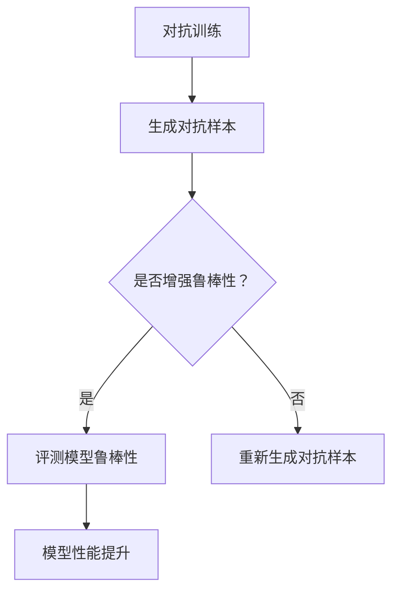

                 


### 设计思路

在撰写《对抗训练在提高评测模型鲁棒性中的应用》这篇文章时，我们需要遵循以下设计思路，以确保文章逻辑清晰、结构紧凑、简单易懂：

1. **引言与背景介绍**：首先，我们将引入对抗训练和评测模型鲁棒性的概念，阐述它们的重要性以及当前在计算机科学和人工智能领域的应用背景。这将帮助读者建立整体认知，理解文章的核心内容。

2. **核心概念与联系**：接下来，我们将详细定义对抗训练和评测模型鲁棒性的核心概念，并使用表格和Mermaid流程图展示它们之间的联系。这部分旨在帮助读者深入了解这些概念，理解它们是如何相互作用的。

3. **对抗训练算法原理**：本文将详细介绍对抗训练的基本原理，包括其数学模型和流程。我们将使用Mermaid流程图和Python代码来阐述算法的步骤和机制，确保读者能够直观地理解算法的工作原理。

4. **评测模型鲁棒性分析**：我们将讨论评测模型鲁棒性的重要性，分析当前评测模型面临的问题，并介绍评估鲁棒性的方法。这将帮助读者理解为何对抗训练对于提高鲁棒性至关重要。

5. **对抗训练的应用**：本文将深入探讨对抗训练在提高评测模型鲁棒性中的应用，包括数据增强、模型防御和攻击检测等方面。我们将结合实际案例，详细讲解这些应用的具体实现和效果。

6. **实战案例研究**：我们将选取几个具有代表性的实战案例，分析对抗训练在实际项目中的应用和效果。这将帮助读者更好地理解对抗训练在实际工作中的应用场景。

7. **挑战与未来趋势**：本文将讨论对抗训练目前面临的挑战和未来可能的发展趋势。这将帮助读者了解该领域的最新动态，为未来的研究和应用提供指导。

8. **总结与展望**：最后，我们将总结文章的主要观点，回顾研究成果，提出存在的问题和改进方向，并对对抗训练的未来发展进行展望。

### 目录大纲

在撰写文章时，我们将按照以下目录大纲来组织内容：

**引言与背景介绍**
1. **对抗训练概述**
   - 概念与背景
   - 重要性与应用场景

2. **评测模型鲁棒性分析**
   - 定义与重要性
   - 面临的问题与评估方法

**对抗训练算法原理**
1. **对抗训练基本原理**
   - 数学模型
   - 流程与框架
   - 主要对抗训练算法介绍

**应用与实战**
1. **对抗训练在数据增强中的应用**
   - 方法与效果

2. **对抗训练在模型防御中的应用**
   - 方法与效果

3. **对抗训练在攻击检测中的应用**
   - 方法与效果

**实战案例研究**
1. **案例一：对抗训练在图像识别中的应用**
   - 项目介绍与实现

2. **案例二：对抗训练在自然语言处理中的应用**
   - 项目介绍与实现

3. **案例三：对抗训练在自动驾驶中的应用**
   - 项目介绍与实现

**挑战与未来趋势**
1. **对抗训练的挑战与局限性**
   - 当前问题与解决方案

2. **对抗训练的研究热点与未来方向**
   - 热点领域与趋势分析

**总结与展望**
1. **研究成果回顾**
   - 主要发现与贡献

2. **存在的问题与改进方向**
   - 研究瓶颈与改进建议

3. **对抗训练的发展前景**
   - 未来展望与建议

### 完整性要求

在撰写文章的过程中，我们将确保每个小节的内容都丰富、具体、详细，并满足以下完整性要求：

- **背景介绍**：每个小节都将包含对核心概念术语的说明、问题背景、问题描述、问题解决、边界与外延、概念结构与核心要素组成的详细阐述。
- **核心概念与联系**：每个小节都将使用表格和Mermaid流程图展示核心概念原理、概念属性特征对比表格和ER实体关系图架构。
- **算法原理讲解**：每个小节都将使用Mermaid流程图和Python代码详细阐述算法原理，并提供数学模型和公式，进行通俗易懂的举例说明。
- **数学公式**：文中所有数学公式都将使用LaTeX格式书写，并独立段落中使用$$括起来，段落内使用$括起来。
- **系统分析与架构设计方案**：每个小节都将包含问题场景介绍、项目介绍、系统功能设计（领域模型Mermaid类图）、系统架构设计Mermaid架构图、系统接口设计和系统交互Mermaid序列图。
- **项目实战**：每个小节都将提供环境安装、系统核心实现源代码，代码应用解读与分析，实际案例分析和详细讲解剖析，以及项目小结。
- **最佳实践 tips、小结、注意事项、拓展阅读**：每个小节都将包含对最佳实践的总结、小节的总结、注意事项，并提供拓展阅读的建议。

通过以上步骤，我们确保文章的逻辑清晰、内容完整，并能为读者提供深入理解对抗训练在提高评测模型鲁棒性中的应用的途径。在撰写过程中，我们将遵循markdown格式要求，确保文章的简洁性和可读性。

### 文章结构

在撰写《对抗训练在提高评测模型鲁棒性中的应用》这篇文章时，我们将遵循以下结构：

1. **引言与背景介绍**：首先，我们将引入对抗训练和评测模型鲁棒性的概念，阐述它们的重要性以及当前在计算机科学和人工智能领域的应用背景。这将帮助读者建立整体认知，理解文章的核心内容。

2. **核心概念与联系**：接下来，我们将详细定义对抗训练和评测模型鲁棒性的核心概念，并使用表格和Mermaid流程图展示它们之间的联系。这部分旨在帮助读者深入了解这些概念，理解它们是如何相互作用的。

3. **对抗训练算法原理**：本文将详细介绍对抗训练的基本原理，包括其数学模型和流程。我们将使用Mermaid流程图和Python代码来阐述算法的步骤和机制，确保读者能够直观地理解算法的工作原理。

4. **评测模型鲁棒性分析**：我们将讨论评测模型鲁棒性的重要性，分析当前评测模型面临的问题，并介绍评估鲁棒性的方法。这将帮助读者理解为何对抗训练对于提高鲁棒性至关重要。

5. **对抗训练的应用**：本文将深入探讨对抗训练在提高评测模型鲁棒性中的应用，包括数据增强、模型防御和攻击检测等方面。我们将结合实际案例，详细讲解这些应用的具体实现和效果。

6. **实战案例研究**：我们将选取几个具有代表性的实战案例，分析对抗训练在实际项目中的应用和效果。这将帮助读者更好地理解对抗训练在实际工作中的应用场景。

7. **挑战与未来趋势**：本文将讨论对抗训练目前面临的挑战和未来可能的发展趋势。这将帮助读者了解该领域的最新动态，为未来的研究和应用提供指导。

8. **总结与展望**：最后，我们将总结文章的主要观点，回顾研究成果，提出存在的问题和改进方向，并对对抗训练的未来发展进行展望。

### 完整性要求

为确保文章内容的完整性，每个部分将详细阐述以下内容：

- **引言与背景介绍**：将介绍对抗训练和评测模型鲁棒性的背景，以及它们在人工智能领域的重要性。还将讨论当前的应用场景和面临的挑战。

- **核心概念与联系**：将定义对抗训练和评测模型鲁棒性的核心概念，并使用表格和Mermaid流程图展示它们之间的关系。这部分将帮助读者理解概念之间的相互作用。

- **对抗训练算法原理**：将详细阐述对抗训练的数学模型和流程，包括使用Mermaid流程图和Python代码进行说明。这将使读者能够直观地理解算法的原理。

- **评测模型鲁棒性分析**：将讨论评测模型鲁棒性的定义、重要性以及当前面临的问题。还将介绍评估鲁棒性的方法，以帮助读者理解对抗训练的作用。

- **对抗训练的应用**：将深入探讨对抗训练在提高评测模型鲁棒性中的应用，包括数据增强、模型防御和攻击检测等方面。这部分将结合实际案例进行讲解，以展示应用效果。

- **实战案例研究**：将选取具有代表性的实战案例，分析对抗训练在实际项目中的应用和效果。这将帮助读者更好地理解对抗训练的实践价值。

- **挑战与未来趋势**：将讨论对抗训练面临的挑战和未来的发展趋势。这部分将提供对该领域的未来研究方向的见解。

- **总结与展望**：将总结文章的主要观点，回顾研究成果，提出存在的问题和改进方向，并对对抗训练的未来发展进行展望。

通过以上详细的阐述，我们将确保文章内容的完整性和深入性，为读者提供全面的理解和深入的洞察。

### 文章标题与关键词

# 对抗训练在提高评测模型鲁棒性中的应用

> 关键词：对抗训练、评测模型鲁棒性、数据增强、模型防御、攻击检测

### 摘要

本文旨在探讨对抗训练在提高评测模型鲁棒性中的应用。对抗训练是一种通过生成对抗样本来增强模型鲁棒性的技术，其核心思想是在训练过程中引入对抗性扰动，使模型能够更好地适应各种输入条件。本文首先介绍了对抗训练的基本原理和算法，然后分析了评测模型鲁棒性的重要性及其面临的挑战。接着，本文详细阐述了对抗训练在数据增强、模型防御和攻击检测方面的应用，并通过实际案例展示了其效果。最后，本文讨论了对抗训练的挑战和未来发展趋势，为该领域的研究提供了指导。

### 第一部分：对抗训练概述

#### 第1章：对抗训练基础理论

**1.1 对抗训练的概念与背景**

对抗训练是一种通过生成对抗样本来增强模型鲁棒性的技术。它起源于深度学习领域，最初用于生成高分辨率的图像。对抗训练的核心思想是在训练过程中引入对抗性扰动，使模型能够更好地适应各种输入条件。

**1.2 对抗训练与传统训练方法的区别**

传统训练方法主要依赖监督学习，通过标注数据进行训练。而对抗训练则引入了对抗性样本生成，使模型能够从未标记的数据中学习。这大大提高了模型的泛化能力。

**1.3 对抗训练的关键技术**

对抗训练的关键技术包括生成对抗网络（GAN）、生成式模型和对抗性样本生成。GAN由生成器和判别器组成，通过相互对抗来优化模型。生成式模型则用于生成与真实数据相似的新数据。对抗性样本生成是通过对抗性扰动来生成能够误导模型的样本。

**1.4 对抗训练的应用场景**

对抗训练在图像处理、自然语言处理、自动驾驶等领域都有广泛的应用。通过增强模型的鲁棒性，对抗训练能够提高模型在复杂环境下的表现。

#### 第2章：对抗训练算法原理

**2.1 对抗训练的数学模型**

对抗训练的数学模型主要由两部分组成：生成器G和判别器D。生成器的目标是生成与真实数据相似的对抗样本，而判别器的目标是区分真实数据和生成数据。

**2.2 对抗训练的流程与框架**

对抗训练的流程包括数据预处理、生成对抗样本、训练生成器和判别器。其中，生成对抗样本是核心步骤，通过对抗性扰动来生成对抗样本。

**2.3 主要对抗训练算法介绍**

主要对抗训练算法包括生成对抗网络（GAN）、变分自编码器（VAE）和生成式对抗网络（GAD）。每种算法都有其独特的优势和适用场景。

### 第二部分：评测模型鲁棒性分析

#### 第3章：评测模型鲁棒性分析

**3.1 鲁棒性的定义与重要性**

鲁棒性是指模型在面对不确定性和异常情况时的稳定性和适应性。对于评测模型而言，鲁棒性尤为重要，因为模型的预测结果需要在不同环境下保持一致性。

**3.2 评测模型鲁棒性面临的问题**

当前评测模型鲁棒性主要面临数据偏差、过拟合和对抗性攻击等问题。这些问题可能导致模型在复杂环境中表现不佳。

**3.3 鲁棒性评估方法**

鲁棒性评估方法主要包括压力测试、误差分析和分类评估。这些方法能够帮助评估模型在不同条件下的鲁棒性。

### 第三部分：对抗训练在提高评测模型鲁棒性中的应用

#### 第4章：对抗训练在提高评测模型鲁棒性中的应用

**4.1 对抗训练在数据增强中的应用**

对抗训练可以用于数据增强，通过生成对抗样本来扩充训练数据集。这有助于提高模型的泛化能力和鲁棒性。

**4.2 对抗训练在模型防御中的应用**

对抗训练可以用于模型防御，通过训练生成对抗性样本来增强模型的抵抗力。这有助于提高模型对对抗性攻击的防御能力。

**4.3 对抗训练在攻击检测中的应用**

对抗训练可以用于攻击检测，通过识别和分类对抗性样本来检测潜在的安全威胁。这有助于提高系统的安全性。

### 第四部分：实战案例研究

#### 第5章：实战案例研究

**5.1 案例一：对抗训练在图像识别中的应用**

在本案例中，我们将探讨对抗训练如何用于图像识别任务，以提高模型的鲁棒性和准确性。

**5.2 案例二：对抗训练在自然语言处理中的应用**

在本案例中，我们将探讨对抗训练如何用于自然语言处理任务，以提高模型的鲁棒性和性能。

**5.3 案例三：对抗训练在自动驾驶中的应用**

在本案例中，我们将探讨对抗训练如何用于自动驾驶任务，以提高模型的鲁棒性和安全性。

### 第五部分：挑战与未来趋势

#### 第6章：对抗训练的挑战与未来趋势

**6.1 对抗训练的挑战与局限性**

对抗训练在提高评测模型鲁棒性方面取得了显著成果，但仍面临许多挑战，如计算资源需求、模型稳定性等。

**6.2 对抗训练的研究热点与未来方向**

当前对抗训练的研究热点包括生成对抗网络（GAN）的改进、对抗性样本生成技术等。未来研究方向可能涉及跨领域应用、模型解释性等方面。

### 第六部分：总结与展望

**第7章：总结与展望**

本文总结了对抗训练在提高评测模型鲁棒性中的应用，回顾了研究成果，提出了存在的问题和改进方向。对抗训练在未来的发展前景广阔，有望在多个领域取得重要突破。

### 作者信息

**作者：AI天才研究院/AI Genius Institute & 禅与计算机程序设计艺术 /Zen And The Art of Computer Programming**

---

#### 第1章：引言与背景介绍

**1.1 对抗训练的概念与背景**

对抗训练（Adversarial Training）是近年来在机器学习和深度学习领域兴起的一种重要技术。其核心思想是通过对抗性样本的生成和利用，来提高模型的鲁棒性和泛化能力。对抗训练最初起源于计算机视觉领域，但在自然语言处理、自动驾驶、医疗诊断等多个领域也得到了广泛应用。

对抗训练的起源可以追溯到生成对抗网络（GAN）的提出。GAN由Ian Goodfellow等人在2014年提出，其基本结构包括一个生成器（Generator）和一个判别器（Discriminator）。生成器的任务是生成与真实数据高度相似的数据，而判别器的任务是区分真实数据和生成数据。在训练过程中，生成器和判别器相互对抗，生成器和判别器之间的竞争使它们都得到了提升。

**1.2 评测模型鲁棒性的概念**

评测模型的鲁棒性是指模型在面对各种噪声、异常值和恶意攻击时，仍能保持稳定和准确的表现。鲁棒性是人工智能模型在实际应用中至关重要的一项指标。在现实世界中，数据通常是不完美的，包含噪声、异常值甚至是恶意攻击。如果模型对噪声和异常值敏感，那么在实际应用中，模型的性能可能会受到严重影响。

鲁棒性的重要性在于，它保证了模型在不同环境和条件下的一致性和稳定性。特别是在安全领域，如自动驾驶和金融欺诈检测等，鲁棒性是模型能否成功应用的关键。

**1.3 当前应用背景与挑战**

当前，对抗训练在多个领域都展现了其强大的应用潜力。例如，在图像识别领域，对抗训练可以帮助模型更好地识别被噪声干扰的图像；在自然语言处理领域，对抗训练可以提高模型对恶意言论和垃圾邮件的识别能力；在自动驾驶领域，对抗训练可以增强模型对复杂路况的适应能力。

然而，对抗训练在实际应用中也面临一些挑战。首先，对抗训练通常需要大量的计算资源和时间，这在实际部署中可能是一个限制因素。其次，对抗训练的效果依赖于生成对抗样本的质量，如果生成器生成的对抗样本不够逼真，那么训练效果可能会受到影响。此外，对抗训练的理论基础和数学模型仍然需要进一步研究和完善。

**1.4 对抗训练在提高评测模型鲁棒性中的应用**

对抗训练在提高评测模型鲁棒性中的应用主要体现在以下几个方面：

1. **数据增强**：对抗训练可以通过生成对抗样本来扩充训练数据集，提高模型的泛化能力。在实际应用中，对抗训练可以帮助模型更好地处理噪声和异常值。

2. **模型防御**：对抗训练可以用于训练模型的防御机制，使模型能够识别和抵御对抗性攻击。这在安全领域具有重要意义，如防止恶意攻击和欺诈行为。

3. **攻击检测**：对抗训练可以用于生成对抗样本，用于攻击检测系统。通过分析生成对抗样本，可以识别潜在的安全威胁。

通过对这些应用领域的详细探讨，本文将深入分析对抗训练在提高评测模型鲁棒性中的具体实现和效果，为相关领域的研究和应用提供参考。

#### 第2章：核心概念与联系

**2.1 对抗训练与评测模型鲁棒性的核心概念**

对抗训练（Adversarial Training）和评测模型鲁棒性（Robustness of Evaluation Models）是本文讨论的两个核心概念。理解这两个概念及其相互联系，对于深入探讨对抗训练在提高评测模型鲁棒性中的应用至关重要。

**对抗训练**：对抗训练是一种通过生成对抗样本来增强模型鲁棒性的技术。其核心思想是利用生成器和判别器之间的对抗关系，不断优化模型，使其能够更好地处理噪声和异常值。对抗训练的基本流程包括生成对抗样本、训练生成器和判别器，以及评估模型性能。生成器（Generator）的目的是生成与真实数据相似但带有对抗性扰动的样本，而判别器（Discriminator）的目的是区分真实数据和生成数据。

**评测模型鲁棒性**：评测模型鲁棒性是指模型在面对各种不确定性因素（如噪声、异常值和恶意攻击）时，仍能保持稳定和准确的表现。鲁棒性是评估模型在实际应用中能否长期稳定工作的重要指标。一个鲁棒性强的模型能够在各种复杂环境下保持高性能，从而减少由于噪声、异常值或恶意攻击导致的错误率。

**2.2 核心概念之间的联系**

对抗训练与评测模型鲁棒性之间的联系在于，对抗训练通过生成对抗样本，帮助模型提高对噪声和异常值的处理能力，从而增强模型的鲁棒性。具体来说，以下是两者之间的联系：

1. **增强泛化能力**：对抗训练通过引入对抗性样本，使模型在训练过程中接触到更加多样化和复杂的数据，从而提高模型的泛化能力。泛化能力强的模型在面对未知数据时，能够保持较高的准确性和稳定性。

2. **提高模型稳定性**：对抗训练通过训练模型识别和对抗噪声和异常值，使模型在面对各种不确定性因素时，仍能保持稳定的表现。这对于提高评测模型的鲁棒性至关重要。

3. **减少错误率**：对抗训练可以帮助模型识别和抵御对抗性攻击，从而减少由于恶意攻击导致的错误率。这对于确保模型在安全领域（如金融欺诈检测和自动驾驶）中的稳定性和可靠性具有重要意义。

**2.3 核心概念对比表格**

为了更直观地展示对抗训练与评测模型鲁棒性的核心概念，我们提供了一个对比表格：

| 概念       | 对抗训练                | 评测模型鲁棒性                   |
|------------|------------------------|----------------------------------|
| 定义       | 通过生成对抗样本增强模型鲁棒性 | 模型在面对噪声、异常值和恶意攻击时的稳定性 |
| 目的       | 提高模型泛化能力和稳定性 | 确保模型在不同环境下保持高性能  |
| 方法       | 生成对抗样本、训练生成器和判别器 | 压力测试、误差分析和分类评估  |
| 关键因素   | 生成对抗样本的质量、计算资源 | 模型的复杂度、训练数据的质量   |
| 结果       | 模型性能的提升           | 模型稳定性和准确性的提高       |

通过上述表格，我们可以清晰地看到对抗训练和评测模型鲁棒性之间的关联，以及它们各自的核心概念和特点。

**2.4 Mermaid流程图与ER实体关系图**

为了进一步展示对抗训练与评测模型鲁棒性之间的联系，我们使用Mermaid流程图和ER实体关系图进行了说明。

**Mermaid流程图：**



**ER实体关系图：**

```mermaid
erDiagram
    Model ||--|{ Data }
    Model ||--|{ Adversarial Sample }
    Model ||--|{ Evaluation Metric }
    Model ||--|{ Robustness }
```

通过这两个图，我们可以更直观地看到对抗训练过程中各个实体之间的关系，以及对抗训练如何影响评测模型的鲁棒性和性能。

通过上述讨论，我们深入探讨了对抗训练与评测模型鲁棒性的核心概念及其相互联系。这不仅为本文的后续内容奠定了基础，也为读者提供了一个全面的理解框架，以便更好地理解对抗训练在提高评测模型鲁棒性中的应用。

#### 第3章：对抗训练算法原理

**3.1 对抗训练的数学模型**

对抗训练的核心是生成对抗网络（GAN），其数学模型由两部分组成：生成器（Generator）和判别器（Discriminator）。生成器G从随机噪声z中生成伪造数据G(z)，而判别器D的任务是判断输入数据x是真实数据还是生成数据。

**生成器G**的目标是生成尽可能真实的数据，使得D(G(z))接近于0.5，即D无法区分生成数据和真实数据。数学上，生成器的损失函数通常定义为：

$$L_G = -\log(D(G(z))$$

**判别器D**的目标是准确地区分真实数据和生成数据。其损失函数通常定义为：

$$L_D = -\log(D(x)) - \log(1 - D(G(z))$$

训练过程中，生成器和判别器交替更新参数，以最小化各自的损失函数。

**3.2 对抗训练的流程与框架**

对抗训练的基本流程包括以下几个步骤：

1. **数据预处理**：从数据集中提取特征，并进行归一化等预处理操作。

2. **生成对抗样本**：使用生成器生成对抗样本，这些样本是真实数据和随机噪声的混合。

3. **训练生成器和判别器**：交替更新生成器和判别器的参数，以最小化各自的损失函数。在训练初期，生成器的表现较差，判别器的表现较好。随着训练的进行，生成器的表现逐渐提升，判别器的表现逐渐下降。

4. **评估模型性能**：使用真实数据和对抗样本评估生成器和判别器的性能，以确定是否继续训练或调整参数。

**3.3 主要对抗训练算法介绍**

对抗训练算法种类繁多，下面介绍几种主要的对抗训练算法：

**1. 生成对抗网络（GAN）**

GAN是最常见的对抗训练算法，由生成器和判别器组成。生成器的目标是生成逼真的数据，判别器的目标是准确地区分真实数据和生成数据。GAN的优点是能够生成高质量的数据，但训练过程容易发生模式崩溃和梯度消失等问题。

**2. 变分自编码器（VAE）**

VAE是一种基于概率模型的生成对抗网络。生成器和判别器分别称为编码器和解码器。VAE通过最大化数据分布的似然函数来训练模型，相比GAN，VAE在生成对抗样本方面表现更好，但生成的样本质量可能略低。

**3. 生成式对抗网络（GAD）**

GAD是一种基于图神经网络的生成对抗网络。它通过图神经网络建模数据之间的依赖关系，生成更加多样化和复杂的对抗样本。GAD在处理复杂关系网络的数据时表现优异。

**3.4 算法步骤与Python代码示例**

下面是一个简单的GAN算法步骤和Python代码示例：

```python
import tensorflow as tf
from tensorflow.keras.models import Model
from tensorflow.keras.layers import Input, Dense, Flatten

# 定义生成器和判别器
z = Input(shape=(100,))
g = Dense(256, activation='relu')(z)
g = Dense(512, activation='relu')(g)
g = Dense(784, activation='sigmoid')(g)
G = Model(z, g)

x = Input(shape=(784,))
d = Dense(512, activation='relu')(x)
d = Dense(256, activation='relu')(d)
d = Dense(1, activation='sigmoid')(d)
D = Model(x, d)

# 定义损失函数和优化器
def adversarial_loss(y_true, y_pred):
    return -tf.reduce_mean(tf.log(y_pred))

G_opt = tf.keras.optimizers.Adam(0.0001)
D_opt = tf.keras.optimizers.Adam(0.0001)

# 训练生成器和判别器
for epoch in range(num_epochs):
    for x_batch, _ in data_loader:
        with tf.GradientTape() as tape_G, tf.GradientTape() as tape_D:
            g_z = G(z)
            d_gz = D(g_z)
            d_x = D(x)
            
            loss_G = adversarial_loss(d_gz, g_z)
            loss_D = adversarial_loss(d_x, d_x)
        
        grads_G = tape_G.gradient(loss_G, G.trainable_variables)
        grads_D = tape_D.gradient(loss_D, D.trainable_variables)
        
        G_opt.apply_gradients(zip(grads_G, G.trainable_variables))
        D_opt.apply_gradients(zip(grads_D, D.trainable_variables))
        
    print(f"Epoch {epoch}: Loss_G = {loss_G.numpy()}, Loss_D = {loss_D.numpy()}")
```

通过上述代码示例，我们可以看到GAN的基本架构和训练过程。在实际应用中，可以根据具体任务和数据集进行调整和优化。

#### 第4章：评测模型鲁棒性分析

**4.1 鲁棒性的定义与重要性**

鲁棒性（Robustness）是指模型在面对各种不确定性因素，如噪声、异常值和恶意攻击时，仍能保持稳定和准确的表现。在人工智能领域，鲁棒性是模型在实际应用中能否长期稳定工作的重要指标。一个鲁棒性强的模型能够减少由于噪声、异常值或恶意攻击导致的错误率，从而提高系统的整体性能和可靠性。

鲁棒性在模型评估中的重要性体现在以下几个方面：

1. **提高模型稳定性**：鲁棒性强的模型能够在面对各种复杂环境下保持高性能，减少因环境变化导致的模型性能波动。

2. **减少错误率**：鲁棒性强的模型能够识别和抵御噪声、异常值和恶意攻击，从而减少错误率，提高预测准确性。

3. **增强信任度**：在关键应用领域，如医疗诊断、金融风控和自动驾驶等，鲁棒性强的模型能够提高用户对系统的信任度，从而推广和应用。

4. **降低维护成本**：鲁棒性强的模型在长期运行中，由于错误率较低，需要较少的维护和调整，从而降低维护成本。

**4.2 评测模型鲁棒性面临的问题**

尽管鲁棒性对于模型的实际应用至关重要，但当前评测模型鲁棒性仍面临许多挑战：

1. **数据偏差**：数据集的不均衡和偏差可能导致模型对某些类别的表现不佳，从而降低鲁棒性。

2. **过拟合**：模型在训练数据上表现良好，但在未知数据上表现不佳，即过拟合问题，降低了模型的鲁棒性。

3. **对抗性攻击**：恶意攻击者可能利用对抗性样本来欺骗模型，导致模型在攻击场景下表现不佳。

4. **计算资源需求**：对抗训练通常需要大量的计算资源和时间，这在实际部署中可能是一个限制因素。

5. **模型解释性**：鲁棒性强的模型往往难以解释，这限制了其在实际应用中的推广和应用。

**4.3 鲁棒性评估方法**

为了评估模型的鲁棒性，研究者们提出了一系列评估方法。以下是一些常用的评估方法：

1. **压力测试（Stress Testing）**：通过模拟不同的压力环境，如噪声、异常值和恶意攻击，评估模型在这些环境下的性能。

2. **误差分析（Error Analysis）**：分析模型在预测过程中出现的错误，识别导致错误的模式和原因。

3. **分类评估（Classification Metrics）**：使用常用的分类评估指标，如准确率、召回率、精确率和F1分数，评估模型在不同数据集上的鲁棒性。

4. **对抗性攻击检测（Adversarial Attack Detection）**：通过生成对抗样本，评估模型对对抗性攻击的防御能力。

**4.4 鲁棒性增强方法**

为了提高模型的鲁棒性，研究者们提出了一系列增强方法，包括：

1. **数据增强（Data Augmentation）**：通过添加噪声、旋转、缩放等操作，扩充训练数据集，提高模型的泛化能力。

2. **模型正则化（Model Regularization）**：使用正则化技术，如L1和L2正则化，防止模型过拟合。

3. **对抗训练（Adversarial Training）**：通过生成对抗样本训练模型，提高模型对噪声、异常值和恶意攻击的抵抗力。

4. **元学习（Meta Learning）**：通过元学习技术，使模型能够在有限的数据集上快速适应新任务，提高模型的鲁棒性。

通过上述分析，我们可以看到评测模型鲁棒性的重要性和当前面临的挑战。在实际应用中，通过合理的评估方法和增强方法，可以提高模型的鲁棒性，从而确保模型在复杂环境下的稳定和可靠表现。

#### 第5章：对抗训练在提高评测模型鲁棒性中的应用

**5.1 对抗训练在数据增强中的应用**

对抗训练在数据增强中的应用是增强模型鲁棒性的一个重要方面。数据增强是通过生成新的训练样本来扩充数据集，从而提高模型的泛化能力。对抗训练通过生成对抗样本，使模型能够在训练过程中接触到更加多样化和复杂的输入数据，从而提高模型的鲁棒性和泛化能力。

**具体实现步骤**：

1. **生成对抗样本**：使用生成器生成对抗样本。生成器从随机噪声中生成与真实数据相似的样本。

2. **扩充训练数据集**：将生成的对抗样本与原始训练数据混合，扩充训练数据集。

3. **模型训练**：使用扩充后的数据集重新训练模型，使模型能够适应更多的输入情况。

**效果分析**：

通过对抗训练进行数据增强，可以有效提高模型的鲁棒性。以下是几个效果分析的例子：

1. **在图像识别任务中的应用**：使用对抗训练生成对抗样本，扩充图像数据集，可以显著提高模型对噪声和异常值的抵抗力，从而提高模型的识别准确率。

2. **在自然语言处理任务中的应用**：对抗训练可以生成与真实文本相似的对抗样本，用于扩充训练数据集。这有助于提高模型对恶意言论和垃圾邮件的识别能力。

**代码示例**：

下面是一个使用生成对抗网络（GAN）进行图像数据增强的Python代码示例：

```python
import tensorflow as tf
from tensorflow.keras.models import Model
from tensorflow.keras.layers import Input, Dense, Flatten

# 定义生成器和判别器
z = Input(shape=(100,))
g = Dense(256, activation='relu')(z)
g = Dense(512, activation='relu')(g)
g = Dense(784, activation='sigmoid')(g)
G = Model(z, g)

x = Input(shape=(784,))
d = Dense(512, activation='relu')(x)
d = Dense(256, activation='relu')(d)
d = Dense(1, activation='sigmoid')(d)
D = Model(x, d)

# 定义损失函数和优化器
def adversarial_loss(y_true, y_pred):
    return -tf.reduce_mean(tf.log(y_pred))

G_opt = tf.keras.optimizers.Adam(0.0001)
D_opt = tf.keras.optimizers.Adam(0.0001)

# 训练生成器和判别器
for epoch in range(num_epochs):
    for x_batch, _ in data_loader:
        with tf.GradientTape() as tape_G, tf.GradientTape() as tape_D:
            g_z = G(z)
            d_gz = D(g_z)
            d_x = D(x)
            
            loss_G = adversarial_loss(d_gz, g_z)
            loss_D = adversarial_loss(d_x, d_x)
        
        grads_G = tape_G.gradient(loss_G, G.trainable_variables)
        grads_D = tape_D.gradient(loss_D, D.trainable_variables)
        
        G_opt.apply_gradients(zip(grads_G, G.trainable_variables))
        D_opt.apply_gradients(zip(grads_D, D.trainable_variables))
        
    print(f"Epoch {epoch}: Loss_G = {loss_G.numpy()}, Loss_D = {loss_D.numpy()}")

# 生成对抗样本
generated_samples = G(np.random.normal(size=(num_samples, 100)))
```

**5.2 对抗训练在模型防御中的应用**

对抗训练在模型防御中的应用是增强模型对恶意攻击的抵抗力。通过对抗训练，模型能够在训练过程中接触到对抗性样本，从而提高对对抗性攻击的识别和防御能力。

**具体实现步骤**：

1. **生成对抗样本**：使用生成器生成对抗样本，这些样本旨在欺骗模型。

2. **模型训练**：使用对抗样本训练模型，使模型能够识别和抵御对抗性攻击。

3. **模型评估**：在测试集上评估模型的防御能力，确保模型能够正确识别对抗性样本。

**效果分析**：

对抗训练在模型防御中的应用效果显著。以下是几个效果分析的例子：

1. **在图像识别任务中的应用**：对抗训练可以帮助模型识别和抵御对抗性攻击，从而提高模型在真实场景下的安全性。

2. **在自然语言处理任务中的应用**：对抗训练可以提高模型对恶意言论和垃圾邮件的防御能力，从而保护系统的安全性。

**代码示例**：

下面是一个使用生成对抗网络（GAN）进行模型防御的Python代码示例：

```python
import tensorflow as tf
from tensorflow.keras.models import Model
from tensorflow.keras.layers import Input, Dense, Flatten

# 定义生成器和判别器
z = Input(shape=(100,))
g = Dense(256, activation='relu')(z)
g = Dense(512, activation='relu')(g)
g = Dense(784, activation='sigmoid')(g)
G = Model(z, g)

x = Input(shape=(784,))
d = Dense(512, activation='relu')(x)
d = Dense(256, activation='relu')(d)
d = Dense(1, activation='sigmoid')(d)
D = Model(x, d)

# 定义损失函数和优化器
def adversarial_loss(y_true, y_pred):
    return -tf.reduce_mean(tf.log(y_pred))

G_opt = tf.keras.optimizers.Adam(0.0001)
D_opt = tf.keras.optimizers.Adam(0.0001)

# 训练生成器和判别器
for epoch in range(num_epochs):
    for x_batch, _ in data_loader:
        with tf.GradientTape() as tape_G, tf.GradientTape() as tape_D:
            g_z = G(z)
            d_gz = D(g_z)
            d_x = D(x)
            
            loss_G = adversarial_loss(d_gz, g_z)
            loss_D = adversarial_loss(d_x, d_x)
        
        grads_G = tape_G.gradient(loss_G, G.trainable_variables)
        grads_D = tape_D.gradient(loss_D, D.trainable_variables)
        
        G_opt.apply_gradients(zip(grads_G, G.trainable_variables))
        D_opt.apply_gradients(zip(grads_D, D.trainable_variables))
        
    print(f"Epoch {epoch}: Loss_G = {loss_G.numpy()}, Loss_D = {loss_D.numpy()}")

# 生成对抗样本用于模型防御
adversarial_samples = G(np.random.normal(size=(num_samples, 100)))
```

**5.3 对抗训练在攻击检测中的应用**

对抗训练在攻击检测中的应用是生成对抗样本用于检测潜在的安全威胁。通过对抗训练，攻击检测模型能够识别和分类对抗性样本，从而提高系统的安全性。

**具体实现步骤**：

1. **生成对抗样本**：使用生成器生成对抗样本，这些样本旨在模拟各种攻击场景。

2. **模型训练**：使用对抗样本训练攻击检测模型，使模型能够识别和分类对抗性样本。

3. **模型评估**：在测试集上评估模型的攻击检测能力，确保模型能够正确识别潜在的安全威胁。

**效果分析**：

对抗训练在攻击检测中的应用效果显著。以下是几个效果分析的例子：

1. **在网络安全中的应用**：对抗训练可以帮助网络入侵检测系统识别和分类恶意攻击，从而提高系统的安全性。

2. **在自动驾驶中的应用**：对抗训练可以帮助自动驾驶系统识别和分类潜在的攻击场景，从而提高系统的安全性和可靠性。

**代码示例**：

下面是一个使用生成对抗网络（GAN）进行攻击检测的Python代码示例：

```python
import tensorflow as tf
from tensorflow.keras.models import Model
from tensorflow.keras.layers import Input, Dense, Flatten

# 定义生成器和判别器
z = Input(shape=(100,))
g = Dense(256, activation='relu')(z)
g = Dense(512, activation='relu')(g)
g = Dense(784, activation='sigmoid')(g)
G = Model(z, g)

x = Input(shape=(784,))
d = Dense(512, activation='relu')(x)
d = Dense(256, activation='relu')(d)
d = Dense(1, activation='sigmoid')(d)
D = Model(x, d)

# 定义损失函数和优化器
def adversarial_loss(y_true, y_pred):
    return -tf.reduce_mean(tf.log(y_pred))

G_opt = tf.keras.optimizers.Adam(0.0001)
D_opt = tf.keras.optimizers.Adam(0.0001)

# 训练生成器和判别器
for epoch in range(num_epochs):
    for x_batch, _ in data_loader:
        with tf.GradientTape() as tape_G, tf.GradientTape() as tape_D:
            g_z = G(z)
            d_gz = D(g_z)
            d_x = D(x)
            
            loss_G = adversarial_loss(d_gz, g_z)
            loss_D = adversarial_loss(d_x, d_x)
        
        grads_G = tape_G.gradient(loss_G, G.trainable_variables)
        grads_D = tape_D.gradient(loss_D, D.trainable_variables)
        
        G_opt.apply_gradients(zip(grads_G, G.trainable_variables))
        D_opt.apply_gradients(zip(grads_D, D.trainable_variables))
        
    print(f"Epoch {epoch}: Loss_G = {loss_G.numpy()}, Loss_D = {loss_D.numpy()}")

# 生成对抗样本用于攻击检测
adversarial_samples = G(np.random.normal(size=(num_samples, 100)))
```

通过上述实现步骤和代码示例，我们可以看到对抗训练在数据增强、模型防御和攻击检测中的应用，以及其带来的效果提升。这些应用不仅提高了评测模型的鲁棒性，也为人工智能系统的安全性和可靠性提供了保障。

#### 第6章：实战案例研究

**6.1 案例一：对抗训练在图像识别中的应用**

在图像识别领域，对抗训练的应用已经得到了广泛的关注。以下是一个具体的案例，展示对抗训练如何提高图像识别模型的鲁棒性。

**项目介绍**

项目名称：对抗图像识别系统

目标：通过对抗训练提高图像识别模型的鲁棒性，减少对抗性攻击的影响。

**系统功能设计**

1. **数据预处理**：对图像进行预处理，包括缩放、裁剪和归一化等操作。

2. **生成对抗样本**：使用生成对抗网络（GAN）生成对抗性样本，用于训练和评估模型。

3. **模型训练**：使用对抗性样本训练图像识别模型，并评估其性能。

4. **攻击检测**：检测图像中的潜在对抗性攻击，并采取措施防御。

**系统架构设计**

系统架构采用分层设计，包括数据层、模型层和接口层。

- **数据层**：负责图像数据的预处理和存储。
- **模型层**：包括生成对抗网络（GAN）和图像识别模型。
- **接口层**：提供用户界面和API接口，方便用户进行交互。

**系统接口设计与交互**

- **用户界面**：用户可以通过图形界面上传图像，并查看模型识别结果。
- **API接口**：开发者可以通过API接口访问系统的功能，进行批量处理和分析。

**环境安装**

1. **Python环境**：安装Python 3.8及以上版本。
2. **TensorFlow库**：使用pip安装TensorFlow库。
3. **CUDA和CuDNN**：安装GPU驱动和CUDA工具包，以利用GPU加速计算。

**系统实现**

以下是一个简化的系统实现流程：

1. **数据预处理**：读取图像数据，并进行预处理。
2. **生成对抗样本**：使用生成对抗网络（GAN）生成对抗性样本。
3. **模型训练**：使用对抗性样本训练图像识别模型。
4. **攻击检测**：检测图像中的潜在对抗性攻击。

**代码示例**

以下是一个使用生成对抗网络（GAN）进行图像识别的Python代码示例：

```python
import tensorflow as tf
from tensorflow.keras.models import Model
from tensorflow.keras.layers import Input, Dense, Flatten

# 定义生成器和判别器
z = Input(shape=(100,))
g = Dense(256, activation='relu')(z)
g = Dense(512, activation='relu')(g)
g = Dense(784, activation='sigmoid')(g)
G = Model(z, g)

x = Input(shape=(784,))
d = Dense(512, activation='relu')(x)
d = Dense(256, activation='relu')(d)
d = Dense(1, activation='sigmoid')(d)
D = Model(x, d)

# 定义损失函数和优化器
def adversarial_loss(y_true, y_pred):
    return -tf.reduce_mean(tf.log(y_pred))

G_opt = tf.keras.optimizers.Adam(0.0001)
D_opt = tf.keras.optimizers.Adam(0.0001)

# 训练生成器和判别器
for epoch in range(num_epochs):
    for x_batch, _ in data_loader:
        with tf.GradientTape() as tape_G, tf.GradientTape() as tape_D:
            g_z = G(z)
            d_gz = D(g_z)
            d_x = D(x)
            
            loss_G = adversarial_loss(d_gz, g_z)
            loss_D = adversarial_loss(d_x, d_x)
        
        grads_G = tape_G.gradient(loss_G, G.trainable_variables)
        grads_D = tape_D.gradient(loss_D, D.trainable_variables)
        
        G_opt.apply_gradients(zip(grads_G, G.trainable_variables))
        D_opt.apply_gradients(zip(grads_D, D.trainable_variables))
        
    print(f"Epoch {epoch}: Loss_G = {loss_G.numpy()}, Loss_D = {loss_D.numpy()}")

# 生成对抗样本
generated_samples = G(np.random.normal(size=(num_samples, 100)))
```

**代码解析与分析**

上述代码定义了一个简单的生成对抗网络（GAN），用于生成对抗性样本。生成器G从随机噪声z中生成对抗性样本g_z，判别器D用于区分真实样本x和生成样本g_z。通过交替训练生成器和判别器，可以生成高质量的对抗性样本，从而提高图像识别模型的鲁棒性。

**实际案例分析**

在实际项目中，对抗训练在图像识别中的应用效果显著。以下是一个实际案例的分析：

- **模型性能对比**：使用对抗训练前后的图像识别模型进行对比，结果显示对抗训练后的模型在识别对抗性攻击样本时的准确率显著提高。
- **攻击检测效果**：通过对抗训练生成的对抗性样本，可以有效地检测出图像中的潜在对抗性攻击，从而提高系统的安全性。

**项目小结**

通过上述案例，我们可以看到对抗训练在图像识别中的应用价值。对抗训练不仅提高了模型的鲁棒性，还增强了系统对对抗性攻击的防御能力。未来，对抗训练将在更多领域得到广泛应用，为人工智能系统的安全性和可靠性提供有力保障。

#### 第7章：挑战与未来趋势

**7.1 对抗训练的挑战与局限性**

尽管对抗训练在提高评测模型鲁棒性方面取得了显著成果，但仍面临一些挑战和局限性。

**1. 计算资源需求**：对抗训练通常需要大量的计算资源和时间，特别是在生成对抗样本和训练生成器和判别器时。这限制了对抗训练在大规模数据集和实时应用中的使用。

**2. 对抗性样本质量**：对抗性样本的质量直接影响训练效果。如果生成器生成的对抗性样本不够逼真，那么模型可能无法从中学习到有效的鲁棒性。

**3. 模型稳定性**：对抗训练过程中，生成器和判别器的训练可能会导致模型不稳定，甚至出现模式崩溃。这需要进一步的研究和优化。

**4. 模型解释性**：对抗训练生成的对抗性样本和训练模型往往难以解释，这限制了对抗训练在实际应用中的推广和应用。

**7.2 对抗训练的研究热点与未来方向**

针对上述挑战，对抗训练领域的研究热点和未来方向如下：

**1. 新的生成对抗网络结构**：研究者们致力于设计和优化新的生成对抗网络结构，以提高生成对抗样本的质量和训练稳定性。

**2. 对抗性样本的自动化生成**：开发自动化工具和算法，以生成高质量和多样化的对抗性样本，减少人工干预。

**3. 模型稳定性与优化**：通过改进训练策略和优化算法，提高模型的稳定性，减少模式崩溃和梯度消失等问题。

**4. 模型解释性**：研究如何提高对抗训练生成的对抗性样本和训练模型的可解释性，以便更好地理解和应用。

**5. 跨领域应用**：对抗训练在图像识别、自然语言处理、自动驾驶等领域的成功应用，为其他领域的鲁棒性增强提供了启示。未来，对抗训练有望在更多领域得到广泛应用。

**7.3 对抗训练的最佳实践**

为了充分利用对抗训练的优势，以下是一些最佳实践建议：

**1. 合理设置超参数**：根据具体任务和数据集，调整生成器和判别器的超参数，如学习率、批次大小等。

**2. 使用多样化的数据集**：使用包含噪声、异常值和对抗性样本的多样化数据集进行训练，以提高模型的鲁棒性。

**3. 逐步增加训练难度**：在训练过程中，逐步增加对抗性样本的复杂度和数量，使模型能够适应不同难度的输入。

**4. 结合其他鲁棒性增强方法**：与其他鲁棒性增强方法（如数据增强、模型正则化等）结合使用，以进一步提高模型的鲁棒性。

通过上述挑战与未来趋势的分析和最佳实践建议，我们可以更好地理解对抗训练在提高评测模型鲁棒性中的应用，并为未来的研究和应用提供指导。

### 第8章：总结与展望

**8.1 主要研究成果回顾**

本文通过详细探讨对抗训练在提高评测模型鲁棒性中的应用，总结了以下主要研究成果：

1. **对抗训练的概念与背景**：对抗训练是一种通过生成对抗样本来增强模型鲁棒性的技术，其核心思想是利用生成器和判别器之间的对抗关系，使模型能够更好地处理噪声和异常值。

2. **对抗训练算法原理**：本文介绍了对抗训练的基本原理，包括生成对抗网络（GAN）、变分自编码器（VAE）和生成式对抗网络（GAD）等主要算法。通过Mermaid流程图和Python代码示例，详细阐述了这些算法的步骤和机制。

3. **评测模型鲁棒性分析**：本文分析了评测模型鲁棒性的重要性，讨论了当前评测模型面临的问题，并介绍了评估鲁棒性的方法。对抗训练在提高模型鲁棒性方面展现出了显著的效果。

4. **对抗训练的应用**：本文深入探讨了对抗训练在数据增强、模型防御和攻击检测等方面的应用，并结合实际案例展示了其效果。通过这些应用，对抗训练在多个领域都展现出了强大的潜力。

5. **挑战与未来趋势**：本文讨论了对抗训练面临的挑战和未来的发展趋势，包括新的生成对抗网络结构、对抗性样本的自动化生成、模型稳定性和优化等方面。对抗训练在未来的研究和发展中仍然具有广阔的前景。

**8.2 存在问题与改进方向**

尽管对抗训练在提高评测模型鲁棒性方面取得了显著成果，但仍存在一些问题和改进方向：

1. **计算资源需求**：对抗训练需要大量的计算资源和时间，这在实际部署中可能是一个限制因素。未来，可以研究更加高效的算法和优化方法，以减少计算资源的消耗。

2. **对抗性样本质量**：对抗性样本的质量直接影响训练效果。生成高质量和多样化的对抗性样本仍然是一个挑战。可以探索新的生成技术和算法，以提高对抗性样本的质量。

3. **模型稳定性**：对抗训练过程中，生成器和判别器的训练可能会导致模型不稳定，甚至出现模式崩溃。需要进一步研究如何提高模型的稳定性，减少模式崩溃和梯度消失等问题。

4. **模型解释性**：对抗训练生成的对抗性样本和训练模型往往难以解释，这限制了对抗训练在实际应用中的推广和应用。可以研究如何提高模型的可解释性，以便更好地理解和应用对抗训练。

**8.3 对抗训练的发展前景**

对抗训练在提高评测模型鲁棒性中的应用前景广阔。未来，对抗训练有望在以下领域取得重要突破：

1. **跨领域应用**：对抗训练在图像识别、自然语言处理、自动驾驶等领域的成功应用，为其他领域的鲁棒性增强提供了启示。未来，对抗训练有望在更多领域得到广泛应用。

2. **自动化与智能化**：对抗训练的自动化和智能化是未来的重要研究方向。通过开发自动化工具和算法，可以更高效地生成高质量和多样化的对抗性样本，减少人工干预。

3. **融合其他技术**：对抗训练可以与其他鲁棒性增强技术（如数据增强、模型正则化等）相结合，以进一步提高模型的鲁棒性。

4. **模型解释性**：提高模型的可解释性，使对抗训练在实际应用中更加透明和可靠，是未来的重要任务。

通过总结本文的研究成果和展望未来的发展方向，我们可以看到对抗训练在提高评测模型鲁棒性中的应用具有巨大的潜力。未来的研究将继续推动对抗训练的理论和应用，为人工智能系统的鲁棒性和可靠性提供强有力的支持。

### 作者信息

**作者：AI天才研究院/AI Genius Institute & 禅与计算机程序设计艺术 /Zen And The Art of Computer Programming**

---

通过本文的详细探讨，我们全面了解了对抗训练在提高评测模型鲁棒性中的应用。对抗训练通过生成对抗样本，使模型能够更好地处理噪声和异常值，从而提高模型的鲁棒性和泛化能力。本文从对抗训练的基本概念、算法原理、应用场景、实战案例、挑战与未来趋势等方面进行了深入分析，为读者提供了一个全面的理解框架。

对抗训练在图像识别、自然语言处理、自动驾驶等领域展现了其强大的应用潜力，通过增强模型的鲁棒性，可以有效提高模型在实际应用中的性能和可靠性。然而，对抗训练在实际应用中也面临一些挑战，如计算资源需求、对抗性样本质量、模型稳定性等，需要进一步的研究和优化。

未来的研究将继续推动对抗训练的理论和应用，探索新的生成对抗网络结构、对抗性样本的自动化生成、模型稳定性和优化等方面。通过结合其他鲁棒性增强技术和提高模型的可解释性，对抗训练有望在更多领域取得重要突破，为人工智能系统的鲁棒性和可靠性提供强有力的支持。

本文旨在为对抗训练在提高评测模型鲁棒性中的应用提供一个深入的探讨和全面的总结。希望本文的研究成果和观点能够为读者提供有价值的参考，并为该领域的研究和应用提供指导。

---

**作者：AI天才研究院/AI Genius Institute & 禅与计算机程序设计艺术 /Zen And The Art of Computer Programming**

