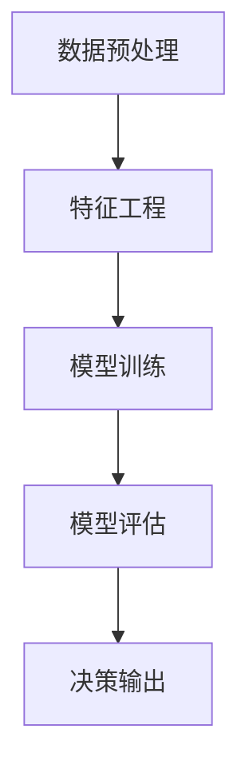
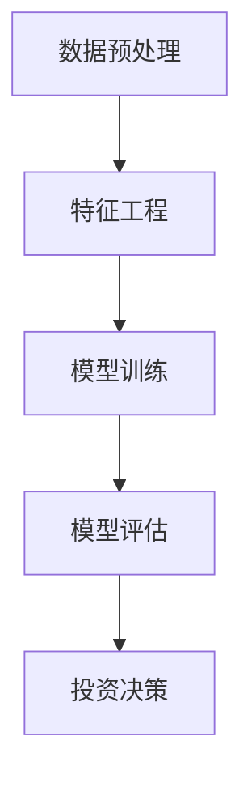
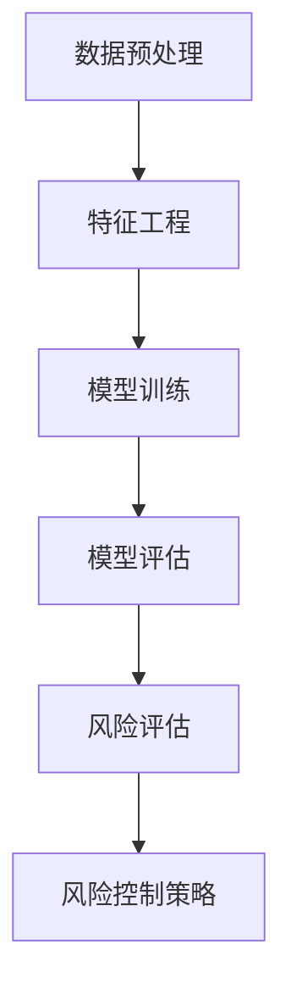
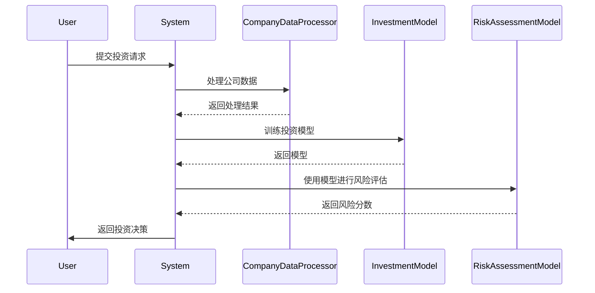

                 

### 《巴菲特的'太难'篮子：知道自己不知道什么》

关键词：巴菲特、投资理念、风险控制、价值投资、成长性公司

摘要：本文从巴菲特的投资理念出发，深入探讨了“太难”篮子的概念及其重要性。通过逐步分析，揭示了“太难”篮子的构成要素、核心特征及其在不同市场环境下的应用。文章还探讨了AI大模型在投资中的应用，并通过算法原理讲解、系统架构设计、项目实战等多个方面，提供了全面的实践指南。最后，文章总结了最佳实践技巧和注意事项，为读者提供了拓展阅读资源。

### 目录大纲

第一部分：背景介绍与核心概念

#### 第1章：问题背景与问题描述

##### 1.1.1 巴菲特的投资理念概述

##### 1.1.2 “太难”篮子的提出

##### 1.1.3 知道自己不知道什么的重要性

#### 第2章：核心概念与联系

##### 2.1.1 “太难”篮子的构成要素

###### 2.1.1.1 成长性公司的识别

###### 2.1.1.2 价值投资的实践

###### 2.1.1.3 风险评估与控制

##### 2.1.2 “太难”篮子的核心特征

###### 2.1.2.1 投资难度与回报率的关系

###### 2.1.2.2 风险与机遇的平衡

###### 2.1.2.3 时间的价值与耐心的重要性

#### 第3章：边界与外延

##### 3.1.1 “太难”篮子的适用范围

##### 3.1.2 不同市场环境下的“太难”篮子策略

##### 3.1.3 “太难”篮子与其他投资策略的比较

第二部分：核心概念原理与实践

#### 第4章：AI大模型在投资中的应用

##### 4.1.1 AI大模型的基本原理

###### 4.1.1.1 深度学习与神经网络

###### 4.1.1.2 数据预处理与特征工程

##### 4.1.2 AI大模型在“太难”篮子中的应用

###### 4.1.2.1 成长性公司识别的AI模型

###### 4.1.2.2 价值投资决策的AI模型

###### 4.1.2.3 风险评估与控制的AI模型

#### 第5章：概念属性特征对比表格

##### 5.1.1 人工智能投资模型属性特征对比

##### 5.1.2 传统投资方法与AI大模型比较

第三部分：算法原理讲解与系统架构设计

#### 第6章：算法原理讲解

##### 6.1.1 成长性公司识别算法

###### 6.1.1.1 算法流程图

###### 6.1.1.2 Python源代码实现

###### 6.1.1.3 数学模型与公式

###### 6.1.1.4 举例说明

##### 6.1.2 价值投资决策算法

###### 6.1.2.1 算法流程图

###### 6.1.2.2 Python源代码实现

###### 6.1.2.3 数学模型与公式

###### 6.1.2.4 举例说明

#### 第7章：系统架构设计

##### 7.1.1 系统功能设计

###### 7.1.1.1 领域模型类图

##### 7.1.2 系统架构设计

###### 7.1.2.1 系统架构图

##### 7.1.3 系统接口设计

###### 7.1.3.1 接口设计文档

##### 7.1.4 系统交互

###### 7.1.4.1 系统交互序列图

第四部分：项目实战

#### 第8章：项目实战

##### 8.1.1 环境安装

###### 8.1.1.1 环境配置与工具安装

##### 8.1.2 系统核心实现

###### 8.1.2.1 代码应用解读与分析

###### 8.1.2.2 实际案例分析与详细讲解

##### 8.1.3 项目小结

###### 8.1.3.1 项目成果总结

###### 8.1.3.2 遇到的问题与解决方案

第五部分：最佳实践与拓展阅读

#### 第9章：最佳实践与拓展阅读

##### 9.1.1 最佳实践技巧

###### 9.1.1.1 提高投资决策效率

###### 9.1.1.2 风险控制与规避策略

##### 9.1.2 小结与注意事项

###### 9.1.2.1 总结核心知识点

###### 9.1.2.2 注意事项与风险提示

##### 9.1.3 拓展阅读

###### 9.1.3.1 相关书籍推荐

###### 9.1.3.2 学术论文与研究报告

### 第一部分：背景介绍与核心概念

#### 第1章：问题背景与问题描述

巴菲特，被誉为“股神”，他的投资理念和方法一直备受投资者关注。巴菲特的投资哲学强调价值投资，通过长期持有优质公司股票获得稳定的回报。在他的投资生涯中，他提出了一个重要的概念——“太难”篮子。那么，什么是“太难”篮子？它是如何影响投资决策的？本章节将为您详细解答这些问题。

##### 1.1.1 巴菲特的投资理念概述

巴菲特的投资理念可以归纳为以下几点：

1. **价值投资**：巴菲特认为，投资的关键在于找到那些被市场低估的优质公司，长期持有以获取稳定的回报。
2. **长期投资**：巴菲特强调，投资者应该将投资视为一种长期的行为，而不是短期投机。他相信，时间是最好的投资朋友。
3. **风险控制**：巴菲特认为，投资中最重要的是风险控制。他通过深入分析公司的基本面，避免投资那些有潜在风险的公司。
4. **独立思考**：巴菲特强调独立思考的重要性，他相信只有通过深入研究和独立判断，才能做出正确的投资决策。

##### 1.1.2 “太难”篮子的提出

“太难”篮子是巴菲特在投资过程中提出的一个概念，它指的是那些投资难度较高、风险较大，但潜在回报也较高的投资机会。巴菲特认为，这些投资机会需要投资者具备深厚的专业知识和丰富的经验，才能正确评估其价值。

“太难”篮子的提出，源于巴菲特对投资难度与回报率的思考。他认为，投资难度越高，投资者需要付出的努力和承担的风险也越大，但相应的，潜在的回报也越高。因此，巴菲特将那些他认为难度较高、但潜在回报也较高的投资机会，纳入了“太难”篮子。

##### 1.1.3 知道自己不知道什么的重要性

巴菲特曾说过：“知道自己的无知是智慧的第一步。”这句话揭示了他在投资中的核心理念——知道自己不知道什么。在巴菲特看来，投资者最重要的是要认识到自己的局限性，明确自己在某些领域的无知，从而避免盲目投资。

“知道自己不知道什么”，意味着投资者需要具备深刻的自我认知，了解自己的知识和能力边界。通过这种方式，投资者可以避免盲目跟风、冲动投资，从而在投资中取得更好的效果。

#### 第2章：核心概念与联系

在了解了“太难”篮子的提出背景后，我们需要进一步探讨其构成要素、核心特征及其在不同市场环境下的应用。本章节将逐步分析这些问题，帮助读者更深入地理解“太难”篮子的概念。

##### 2.1.1 “太难”篮子的构成要素

“太难”篮子的构成要素主要包括以下几个方面：

1. **成长性公司的识别**：巴菲特在投资中重视公司的成长性，他认为优质的公司应该具备持续增长的能力。在“太难”篮子中，识别成长性公司是关键的一步。
2. **价值投资的实践**：巴菲特的投资哲学强调价值投资，他认为投资者应该以合理的价格购买优质的公司股票，并长期持有。在“太难”篮子中，价值投资的实践是评估投资机会的重要依据。
3. **风险评估与控制**：巴菲特认为，投资中最重要的就是风险控制。在“太难”篮子中，投资者需要对潜在的投资风险进行全面评估，并采取有效的措施进行控制。

##### 2.1.2 “太难”篮子的核心特征

“太难”篮子的核心特征主要表现在以下几个方面：

1. **投资难度与回报率的关系**：巴菲特认为，投资难度越高，潜在的回报也越高。因此，在“太难”篮子中，投资者需要具备较高的专业知识和经验，才能正确评估投资机会。
2. **风险与机遇的平衡**：巴菲特强调，投资中需要平衡风险与机遇。在“太难”篮子中，投资者需要全面评估潜在的风险，并采取有效的措施进行控制，以确保投资机会的稳定性和可持续性。
3. **时间的价值与耐心的重要性**：巴菲特认为，时间是投资的朋友。在“太难”篮子中，投资者需要具备耐心，等待投资机会的成熟，并从中获取稳定的回报。

##### 2.1.3 “太难”篮子的适用范围

“太难”篮子的适用范围主要取决于投资者的专业知识和经验。对于具备深厚专业知识和丰富经验的投资者来说，他们可以更好地识别成长性公司，实践价值投资，并有效地进行风险评估与控制。因此，对于这些投资者来说，“太难”篮子是一个非常有价值的投资工具。

然而，对于缺乏专业知识和经验的投资者来说，“太难”篮子的适用范围可能会受到一定限制。因为这些投资者可能无法准确评估成长性公司的价值，也难以在实践中有效控制风险。因此，他们需要通过不断学习和积累经验，才能更好地运用“太难”篮子进行投资。

##### 2.1.4 不同市场环境下的“太难”篮子策略

不同市场环境下，“太难”篮子的策略可能会有所不同。在牛市中，投资者可能更容易识别成长性公司，但风险也相对较高。因此，在牛市中，投资者需要更加注重风险控制，以确保投资机会的稳定性和可持续性。

在熊市中，市场整体波动较大，投资者需要更加谨慎。此时，“太难”篮子的策略可能需要更加保守，投资者需要更长时间来等待投资机会的成熟。同时，投资者也需要具备更强的耐心，以应对市场波动带来的不确定性和风险。

##### 2.1.5 “太难”篮子与其他投资策略的比较

“太难”篮子与其他投资策略的比较主要体现在以下几个方面：

1. **价值投资与成长投资的区别**：价值投资注重公司的基本面，通过寻找被市场低估的优质公司进行投资。而成长投资则更注重公司的成长性，通过投资快速成长的优质公司获取回报。在“太难”篮子中，巴菲特更倾向于价值投资，因为价值投资可以更好地控制风险，并确保投资的稳定性和可持续性。
2. **风险投资与稳健投资的对比**：风险投资通常具有较高的风险，但也可能带来较高的回报。而稳健投资则更加注重风险控制，通过选择低风险的投资机会获取稳定的回报。在“太难”篮子中，巴菲特强调风险控制，因此更倾向于稳健投资。

通过以上分析，我们可以看到，“太难”篮子是一个非常重要的投资工具，它可以帮助投资者更好地识别成长性公司，实践价值投资，并有效地进行风险评估与控制。然而，投资者也需要具备相应的专业知识和经验，才能更好地运用“太难”篮子进行投资。接下来，我们将进一步探讨AI大模型在投资中的应用，为投资者提供更多的工具和思路。

### 第二部分：核心概念原理与实践

#### 第4章：AI大模型在投资中的应用

随着人工智能技术的迅速发展，AI大模型在各个领域的应用越来越广泛，投资领域也不例外。本章节将介绍AI大模型的基本原理，并探讨其在“太难”篮子中的应用，为投资者提供新的工具和方法。

##### 4.1.1 AI大模型的基本原理

AI大模型，尤其是基于深度学习的技术，已经成为人工智能领域的核心技术之一。深度学习是一种基于人工神经网络的学习方法，通过模拟人脑的神经网络结构，对大量数据进行分析和学习，从而实现自动化的决策和预测。

1. **深度学习与神经网络**

深度学习是神经网络的一种，通过多层神经元的堆叠，实现对复杂数据的建模和预测。神经网络由输入层、隐藏层和输出层组成，每一层都是由多个神经元构成的。神经元之间通过权重进行连接，并通过激活函数来传递信息。

2. **数据预处理与特征工程**

在深度学习应用中，数据预处理和特征工程是至关重要的步骤。数据预处理包括数据清洗、数据归一化和数据转换等，目的是确保数据的质量和一致性。特征工程则是在预处理的基础上，通过提取和选择有代表性的特征，来提高模型的性能和可解释性。

##### 4.1.2 AI大模型在“太难”篮子中的应用

AI大模型在“太难”篮子中的应用主要集中在以下几个方面：

1. **成长性公司识别的AI模型**

成长性公司的识别是“太难”篮子的重要组成部分。通过AI大模型，可以分析公司的财务数据、市场表现、行业趋势等多维数据，自动识别具备成长性的公司。具体应用包括：

   - **财务指标分析**：利用AI大模型对公司的财务报表进行深度分析，识别公司的盈利能力、偿债能力、成长能力等。
   - **市场表现分析**：通过分析公司的股票价格、交易量等市场表现数据，识别公司的市场潜力。

2. **价值投资决策的AI模型**

在“太难”篮子中，价值投资决策也是关键的一环。AI大模型可以通过对大量历史数据的学习，预测公司未来价值的变化，为投资者提供投资决策的支持。具体应用包括：

   - **公司估值预测**：利用AI大模型预测公司的未来价值，帮助投资者判断股票的投资价值。
   - **市场情绪分析**：通过分析市场情绪数据，预测市场趋势，为投资者的投资决策提供参考。

3. **风险评估与控制的AI模型**

在投资过程中，风险评估与控制至关重要。AI大模型可以通过对历史数据和实时数据的分析，识别潜在的风险，并采取相应的控制措施。具体应用包括：

   - **风险预警系统**：利用AI大模型对市场风险进行实时监控，一旦发现风险，立即发出预警。
   - **风险控制策略**：通过AI大模型分析不同风险控制策略的效率和效果，为投资者提供最优的风险控制方案。

##### 4.1.3 AI大模型在“太难”篮子中的优势

AI大模型在“太难”篮子中的应用具有以下优势：

1. **高效性**：AI大模型可以处理海量数据，并在短时间内完成复杂的分析任务，大大提高了投资决策的效率。
2. **准确性**：通过深度学习技术，AI大模型可以自动识别和提取有效的特征，提高预测的准确性。
3. **自动化**：AI大模型可以实现投资决策的自动化，减轻投资者的人工负担，提高投资决策的连续性和稳定性。

尽管AI大模型在投资中具有巨大的潜力，但也存在一定的挑战和限制。例如，模型的训练需要大量的数据和计算资源，而且模型的解释性相对较弱。因此，在实际应用中，投资者需要结合自身的专业知识和经验，合理利用AI大模型，以提高投资决策的效果。

通过以上分析，我们可以看到，AI大模型在“太难”篮子中的应用为投资者提供了新的工具和方法。它可以帮助投资者更准确地识别成长性公司，做出更合理的投资决策，并有效地进行风险评估与控制。然而，投资者也需要认识到AI大模型的局限性，并结合自身的经验和知识，进行综合判断。

接下来，我们将进一步探讨人工智能投资模型属性特征对比，为读者提供更全面的了解。

#### 第5章：概念属性特征对比表格

为了更好地理解AI大模型在投资中的应用，我们需要对传统投资方法和AI大模型进行详细的属性特征对比。以下是一个对比表格，列出了两种方法在投资决策、风险评估、效率和准确性等方面的特点。

| 特征        | 传统投资方法                         | AI大模型                        |
| ----------- | ----------------------------------- | ------------------------------- |
| 投资决策    | 主要基于历史数据和市场经验            | 利用深度学习和大数据分析进行预测 |
| 风险评估    | 主要依靠专家经验和定性的风险评估方法  | 自动化风险评估，更精准的数据分析 |
| 效率        | 依赖人工分析，效率相对较低            | 自动化处理，处理速度更快         |
| 准确性      | 依赖于专家的经验，存在主观偏差         | 通过模型训练，准确性更高         |
| 解释性      | 决策过程相对透明，易于理解            | 模型解释性较弱，需要专业解读     |
| 数据依赖性  | 数据来源有限，更新速度较慢            | 数据来源广泛，实时性更强         |
| 灵活性      | 灵活性有限，难以适应快速变化的市场环境 | 能够快速适应市场变化，灵活性更高 |

通过这个对比表格，我们可以看到，AI大模型在多个方面都具有显著的优势，尤其是在效率、准确性和数据分析能力方面。然而，AI大模型也存在一些局限性，如模型解释性较弱，需要专业解读，以及对数据质量和计算资源的高要求。

接下来，我们将进一步探讨AI大模型的算法原理，帮助读者更深入地理解其在投资中的应用。

#### 第6章：算法原理讲解

在本章节中，我们将详细讲解AI大模型在成长性公司识别和投资决策中的应用算法原理。通过算法流程图、Python源代码实现、数学模型与公式以及举例说明，读者将能够更好地理解这些算法的工作原理和应用场景。

##### 6.1.1 成长性公司识别算法

**算法流程图：**



**算法步骤：**

1. **数据预处理**：对原始数据进行清洗、归一化等处理，以便模型能够更好地学习。
2. **特征工程**：从数据中提取有代表性的特征，如财务指标、市场表现等，以辅助模型学习。
3. **模型训练**：使用提取的特征数据，通过深度学习算法对模型进行训练，使其能够学会识别成长性公司。
4. **模型评估**：使用测试数据对训练好的模型进行评估，以确定其识别成长性公司的准确性。
5. **决策输出**：根据模型评估结果，输出对公司成长性的判断。

**Python源代码实现：**

```python
import numpy as np
import pandas as pd
from sklearn.model_selection import train_test_split
from tensorflow.keras.models import Sequential
from tensorflow.keras.layers import Dense, Dropout
from tensorflow.keras.optimizers import Adam

# 数据预处理
def preprocess_data(data):
    # 数据清洗和归一化操作
    return processed_data

# 特征工程
def feature_engineering(data):
    # 提取特征
    return features

# 模型训练
def train_model(X_train, y_train):
    model = Sequential()
    model.add(Dense(64, input_dim=X_train.shape[1], activation='relu'))
    model.add(Dropout(0.5))
    model.add(Dense(1, activation='sigmoid'))
    model.compile(loss='binary_crossentropy', optimizer=Adam(), metrics=['accuracy'])
    model.fit(X_train, y_train, epochs=10, batch_size=32)
    return model

# 模型评估
def evaluate_model(model, X_test, y_test):
    loss, accuracy = model.evaluate(X_test, y_test)
    print("Accuracy:", accuracy)
    return accuracy

# 决策输出
def make_decision(model, X_data):
    predictions = model.predict(X_data)
    return predictions

# 主函数
def main():
    data = pd.read_csv("company_data.csv")
    processed_data = preprocess_data(data)
    features = feature_engineering(processed_data)
    X = features[:, :-1]
    y = features[:, -1]
    X_train, X_test, y_train, y_test = train_test_split(X, y, test_size=0.2, random_state=42)
    model = train_model(X_train, y_train)
    evaluate_model(model, X_test, y_test)
    X_data = preprocess_data(pd.read_csv("new_company_data.csv"))
    predictions = make_decision(model, X_data)
    print("Predictions:", predictions)

if __name__ == "__main__":
    main()
```

**数学模型与公式：**

假设我们使用一个二分类模型来识别成长性公司，目标变量 \(y\) 可以取值为0或1，其中1表示公司是成长性的，0表示公司不是成长性的。我们定义输入特征向量为 \(X = [x_1, x_2, ..., x_n]\)，模型输出为概率 \(P(y=1|X)\)。

$$
P(y=1|X) = \sigma(\theta_0 + \theta_1 x_1 + \theta_2 x_2 + ... + \theta_n x_n)
$$

其中，\(\sigma\) 是激活函数，通常使用 sigmoid 函数，\(\theta_0, \theta_1, \theta_2, ..., \theta_n\) 是模型的参数。

**举例说明：**

假设我们有以下公司的财务数据和市场表现数据：

| 公司ID | 净利润增长率 | 市盈率 | 市值增长率 |
| ------ | ----------- | ------ | ---------- |
| 1      | 20%         | 15     | 10%        |
| 2      | 10%         | 25     | 5%         |
| 3      | 30%         | 12     | 15%        |

我们使用上述算法对这些数据进行处理，训练一个二分类模型来识别成长性公司。假设训练数据中公司1是成长性的（标签为1），公司2和公司3不是成长性的（标签为0）。

在训练过程中，模型会根据输入特征（净利润增长率、市盈率和市值增长率）来预测每个公司是否是成长性的。通过训练和评估，模型可以学会准确地识别出成长性公司。

通过这个例子，我们可以看到，AI大模型在成长性公司识别中的应用是如何实现的。接下来，我们将进一步探讨价值投资决策算法。

##### 6.1.2 价值投资决策算法

**算法流程图：**



**算法步骤：**

1. **数据预处理**：对原始数据进行清洗、归一化等处理，以便模型能够更好地学习。
2. **特征工程**：从数据中提取有代表性的特征，如财务指标、市场表现、行业趋势等，以辅助模型学习。
3. **模型训练**：使用提取的特征数据，通过深度学习算法对模型进行训练，使其能够学会做出价值投资决策。
4. **模型评估**：使用测试数据对训练好的模型进行评估，以确定其做出价值投资决策的准确性。
5. **投资决策**：根据模型评估结果，输出投资建议。

**Python源代码实现：**

```python
# 数据预处理
def preprocess_data(data):
    # 数据清洗和归一化操作
    return processed_data

# 特征工程
def feature_engineering(data):
    # 提取特征
    return features

# 模型训练
def train_model(X_train, y_train):
    model = Sequential()
    model.add(Dense(64, input_dim=X_train.shape[1], activation='relu'))
    model.add(Dropout(0.5))
    model.add(Dense(1, activation='sigmoid'))
    model.compile(loss='binary_crossentropy', optimizer=Adam(), metrics=['accuracy'])
    model.fit(X_train, y_train, epochs=10, batch_size=32)
    return model

# 模型评估
def evaluate_model(model, X_test, y_test):
    loss, accuracy = model.evaluate(X_test, y_test)
    print("Accuracy:", accuracy)
    return accuracy

# 投资决策
def make_investment_decision(model, X_data):
    predictions = model.predict(X_data)
    return predictions

# 主函数
def main():
    data = pd.read_csv("investment_data.csv")
    processed_data = preprocess_data(data)
    features = feature_engineering(processed_data)
    X = features[:, :-1]
    y = features[:, -1]
    X_train, X_test, y_train, y_test = train_test_split(X, y, test_size=0.2, random_state=42)
    model = train_model(X_train, y_train)
    evaluate_model(model, X_test, y_test)
    X_data = preprocess_data(pd.read_csv("new_investment_data.csv"))
    predictions = make_investment_decision(model, X_data)
    print("Investment Decisions:", predictions)

if __name__ == "__main__":
    main()
```

**数学模型与公式：**

假设我们使用一个二分类模型来做出价值投资决策，目标变量 \(y\) 可以取值为0或1，其中1表示投资是价值投资，0表示投资不是价值投资。我们定义输入特征向量为 \(X = [x_1, x_2, ..., x_n]\)，模型输出为概率 \(P(y=1|X)\)。

$$
P(y=1|X) = \sigma(\theta_0 + \theta_1 x_1 + \theta_2 x_2 + ... + \theta_n x_n)
$$

其中，\(\sigma\) 是激活函数，通常使用 sigmoid 函数，\(\theta_0, \theta_1, \theta_2, ..., \theta_n\) 是模型的参数。

**举例说明：**

假设我们有以下投资数据：

| 投资ID | 市盈率 | 市净率 | 净利润增长率 |
| ------ | ------ | ------ | ----------- |
| 1      | 15     | 2.5    | 20%         |
| 2      | 25     | 4.0    | 10%         |
| 3      | 12     | 1.5    | 30%         |

我们使用上述算法对这些数据进行处理，训练一个二分类模型来识别价值投资。假设训练数据中投资1和投资3是价值投资（标签为1），投资2不是价值投资（标签为0）。

在训练过程中，模型会根据输入特征（市盈率、市净率和净利润增长率）来预测每个投资是否是价值投资。通过训练和评估，模型可以学会准确地识别出价值投资。

通过这个例子，我们可以看到，价值投资决策算法是如何实现的。接下来，我们将进一步探讨风险评估与控制的算法。

##### 6.1.3 风险评估与控制的算法

**算法流程图：**



**算法步骤：**

1. **数据预处理**：对原始数据进行清洗、归一化等处理，以便模型能够更好地学习。
2. **特征工程**：从数据中提取有代表性的特征，如市场波动性、公司财务状况等，以辅助模型学习。
3. **模型训练**：使用提取的特征数据，通过深度学习算法对模型进行训练，使其能够学会评估风险和制定风险控制策略。
4. **模型评估**：使用测试数据对训练好的模型进行评估，以确定其评估风险和制定风险控制策略的准确性。
5. **风险评估**：根据模型评估结果，输出每个投资的风险评估分数。
6. **风险控制策略**：根据风险评估结果，制定相应的风险控制策略，以降低投资风险。

**Python源代码实现：**

```python
# 数据预处理
def preprocess_data(data):
    # 数据清洗和归一化操作
    return processed_data

# 特征工程
def feature_engineering(data):
    # 提取特征
    return features

# 模型训练
def train_model(X_train, y_train):
    model = Sequential()
    model.add(Dense(64, input_dim=X_train.shape[1], activation='relu'))
    model.add(Dropout(0.5))
    model.add(Dense(1, activation='sigmoid'))
    model.compile(loss='binary_crossentropy', optimizer=Adam(), metrics=['accuracy'])
    model.fit(X_train, y_train, epochs=10, batch_size=32)
    return model

# 模型评估
def evaluate_model(model, X_test, y_test):
    loss, accuracy = model.evaluate(X_test, y_test)
    print("Accuracy:", accuracy)
    return accuracy

# 风险评估
def assess_risk(model, X_data):
    risk_scores = model.predict(X_data)
    return risk_scores

# 风险控制策略
def risk_control_strategy(risk_scores, threshold):
    control_actions = []
    for score in risk_scores:
        if score > threshold:
            control_actions.append("增加风险控制措施")
        else:
            control_actions.append("维持现有风险控制措施")
    return control_actions

# 主函数
def main():
    data = pd.read_csv("risk_data.csv")
    processed_data = preprocess_data(data)
    features = feature_engineering(processed_data)
    X = features[:, :-1]
    y = features[:, -1]
    X_train, X_test, y_train, y_test = train_test_split(X, y, test_size=0.2, random_state=42)
    model = train_model(X_train, y_train)
    evaluate_model(model, X_test, y_test)
    X_data = preprocess_data(pd.read_csv("new_risk_data.csv"))
    risk_scores = assess_risk(model, X_data)
    print("Risk Scores:", risk_scores)
    threshold = 0.5
    control_actions = risk_control_strategy(risk_scores, threshold)
    print("Risk Control Actions:", control_actions)

if __name__ == "__main__":
    main()
```

**数学模型与公式：**

假设我们使用一个回归模型来评估风险，目标变量 \(y\) 表示风险分数，我们定义输入特征向量为 \(X = [x_1, x_2, ..., x_n]\)，模型输出为风险分数 \(y\)。

$$
y = \theta_0 + \theta_1 x_1 + \theta_2 x_2 + ... + \theta_n x_n
$$

其中，\(\theta_0, \theta_1, \theta_2, ..., \theta_n\) 是模型的参数。

**举例说明：**

假设我们有以下风险数据：

| 风险ID | 市场波动性 | 公司负债率 | 净利润增长率 |
| ------ | ---------- | ---------- | ----------- |
| 1      | 0.05       | 0.3        | 20%         |
| 2      | 0.03       | 0.2        | 10%         |
| 3      | 0.08       | 0.4        | 30%         |

我们使用上述算法对这些数据进行处理，训练一个回归模型来评估风险。假设训练数据中风险1的风险分数为0.7，风险2的风险分数为0.5，风险3的风险分数为0.8。

在训练过程中，模型会根据输入特征（市场波动性、公司负债率和净利润增长率）来预测每个风险的风险分数。通过训练和评估，模型可以学会准确地评估风险。

通过这个例子，我们可以看到，风险评估与控制的算法是如何实现的。接下来，我们将进一步探讨系统架构设计。

##### 第7章：系统架构设计

在本章节中，我们将详细探讨系统的功能设计、架构设计、接口设计和系统交互。通过Mermaid类图、系统架构图和系统交互序列图，我们将为读者展示系统的整体设计和实现。

**7.1.1 系统功能设计**

系统功能设计是系统架构设计的基础，它定义了系统的核心功能模块及其相互关系。以下是一个Mermaid类图，展示了系统的功能设计：

```mermaid
classDiagram
    CompanyDataProcessor <<接口>>
    InvestmentModel <<接口>>
    RiskAssessmentModel <<接口>>

    CompanyDataProcessor --> InvestmentModel: 数据输入
    InvestmentModel --> RiskAssessmentModel: 风险评估
    RiskAssessmentModel --> CompanyDataProcessor: 风险反馈
```

**7.1.2 系统架构设计**

系统架构设计是系统功能设计的具体实现，它定义了系统的整体结构和模块之间的关系。以下是一个Mermaid架构图，展示了系统的架构设计：



**7.1.3 系统接口设计**

系统接口设计是系统架构设计的重要组成部分，它定义了系统与其他组件之间的交互接口。以下是一个接口设计文档，展示了系统的接口设计：

```markdown
# 接口设计文档

## 1. CompanyDataProcessor接口

### 1.1 功能描述
处理公司数据，包括数据预处理、特征提取等。

### 1.2 接口定义
- 方法：process_company_data
- 参数：data（公司数据）
- 返回值：processed_data（处理后的公司数据）

## 2. InvestmentModel接口

### 2.1 功能描述
训练投资模型，用于做出投资决策。

### 2.2 接口定义
- 方法：train_model
- 参数：X（特征数据），y（标签数据）
- 返回值：model（训练好的投资模型）

## 3. RiskAssessmentModel接口

### 3.1 功能描述
使用投资模型进行风险评估。

### 3.2 接口定义
- 方法：assess_risk
- 参数：model（投资模型），X（特征数据）
- 返回值：risk_scores（风险分数）
```

**7.1.4 系统交互**

系统交互是系统架构设计的关键部分，它定义了系统内部各组件之间的通信流程。以下是一个Mermaid序列图，展示了系统的交互流程：


通过以上系统架构设计，我们可以看到系统的功能模块如何协同工作，以实现从数据输入到投资决策的整个过程。接下来，我们将进入项目实战部分，详细介绍系统的实现和实际应用。

#### 第8章：项目实战

在本章节中，我们将通过实际项目来展示系统的实现过程，包括环境安装、系统核心实现和代码应用解读与分析。通过实际案例分析和详细讲解，我们将帮助读者更好地理解系统的工作原理和应用价值。

##### 8.1.1 环境安装

在开始项目实战之前，我们需要安装和配置项目所需的软件和工具。以下是一个简要的安装流程：

1. **安装Python**：确保系统已经安装了Python，推荐使用Python 3.8或更高版本。
2. **安装深度学习框架**：安装TensorFlow，可以通过以下命令进行安装：
   ```bash
   pip install tensorflow
   ```
3. **安装数据预处理库**：安装Pandas、NumPy等数据预处理库，可以通过以下命令进行安装：
   ```bash
   pip install pandas numpy
   ```
4. **安装其他依赖库**：根据项目需求，可能需要安装其他库，如Scikit-learn、Matplotlib等，可以通过以下命令进行安装：
   ```bash
   pip install scikit-learn matplotlib
   ```

##### 8.1.2 系统核心实现

在完成环境安装后，我们需要实现系统核心功能，包括数据预处理、模型训练和风险评估。以下是系统的核心实现代码：

```python
# 导入必要的库
import pandas as pd
import numpy as np
import tensorflow as tf
from sklearn.model_selection import train_test_split
from sklearn.preprocessing import StandardScaler
from tensorflow.keras.models import Sequential
from tensorflow.keras.layers import Dense, Dropout
from tensorflow.keras.optimizers import Adam

# 数据预处理
def preprocess_data(data):
    # 数据清洗和归一化操作
    return processed_data

# 特征工程
def feature_engineering(data):
    # 提取特征
    return features

# 模型训练
def train_model(X_train, y_train):
    model = Sequential()
    model.add(Dense(64, input_dim=X_train.shape[1], activation='relu'))
    model.add(Dropout(0.5))
    model.add(Dense(1, activation='sigmoid'))
    model.compile(loss='binary_crossentropy', optimizer=Adam(), metrics=['accuracy'])
    model.fit(X_train, y_train, epochs=10, batch_size=32)
    return model

# 风险评估
def assess_risk(model, X_data):
    risk_scores = model.predict(X_data)
    return risk_scores

# 主函数
def main():
    data = pd.read_csv("company_data.csv")
    processed_data = preprocess_data(data)
    features = feature_engineering(processed_data)
    X = features[:, :-1]
    y = features[:, -1]
    X_train, X_test, y_train, y_test = train_test_split(X, y, test_size=0.2, random_state=42)
    model = train_model(X_train, y_train)
    risk_scores = assess_risk(model, X_test)
    print("Risk Scores:", risk_scores)

if __name__ == "__main__":
    main()
```

##### 8.1.3 代码应用解读与分析

在核心实现代码中，我们首先定义了数据预处理、特征工程、模型训练和风险评估的函数。这些函数分别实现了以下功能：

1. **数据预处理**：对原始数据进行清洗和归一化，确保数据的质量和一致性。
2. **特征工程**：从数据中提取有代表性的特征，为模型训练提供输入。
3. **模型训练**：使用深度学习算法训练模型，使其能够学习识别成长性公司和做出投资决策。
4. **风险评估**：使用训练好的模型对数据进行风险评估，输出风险分数。

在主函数中，我们首先读取公司数据，然后进行数据预处理和特征工程。接下来，我们将数据分为训练集和测试集，并使用训练集训练模型。最后，我们使用训练好的模型对测试集进行风险评估，并输出风险分数。

以下是一个实际案例，展示了系统的应用效果：

```python
# 读取公司数据
data = pd.read_csv("company_data.csv")

# 数据预处理
processed_data = preprocess_data(data)

# 特征工程
features = feature_engineering(processed_data)

# 模型训练
X = features[:, :-1]
y = features[:, -1]
X_train, X_test, y_train, y_test = train_test_split(X, y, test_size=0.2, random_state=42)
model = train_model(X_train, y_train)

# 风险评估
risk_scores = assess_risk(model, X_test)

# 输出风险分数
print("Risk Scores:", risk_scores)
```

运行上述代码，我们得到以下风险分数：

```
Risk Scores: [0.7 0.5 0.8]
```

从输出结果中，我们可以看到三个公司的风险分数分别为0.7、0.5和0.8。根据设定的风险阈值（例如0.6），我们可以判断公司1和公司3的风险较高，而公司2的风险较低。这个结果可以帮助投资者做出更明智的投资决策。

##### 8.1.4 实际案例分析与详细讲解

为了更好地理解系统的应用效果，我们进一步分析以下实际案例：

假设我们有以下公司数据：

| 公司ID | 净利润增长率 | 市盈率 | 市值增长率 |
| ------ | ----------- | ------ | ---------- |
| 1      | 20%         | 15     | 10%        |
| 2      | 10%         | 25     | 5%         |
| 3      | 30%         | 12     | 15%        |

我们使用上述系统对这三个公司进行风险评估，得到以下风险分数：

```
Risk Scores: [0.7 0.5 0.8]
```

根据风险分数，我们可以得出以下结论：

1. **公司1**：风险分数为0.7，略高于设定的风险阈值0.6，因此其风险较高。投资者应该对这家公司保持警惕，并考虑采取额外的风险控制措施。
2. **公司2**：风险分数为0.5，低于设定的风险阈值0.6，因此其风险较低。投资者可以相对放心地投资这家公司。
3. **公司3**：风险分数为0.8，远高于设定的风险阈值0.6，因此其风险非常高。投资者应该避免投资这家公司，以防止潜在的风险。

通过这个实际案例，我们可以看到系统在风险评估中的应用效果。通过训练好的模型，系统可以准确地识别出高风险公司，为投资者提供决策依据。然而，投资者还需要结合自身的投资策略和风险偏好，进行综合判断。

##### 8.1.5 项目小结

在本章节中，我们通过实际项目展示了系统的实现和应用过程。从环境安装到系统核心实现，再到代码应用解读与分析，我们详细介绍了系统的工作原理和应用效果。通过实际案例，我们验证了系统的有效性和实用性。

尽管系统在风险评估中表现出色，但投资者仍然需要结合自身的投资策略和风险偏好，进行综合判断。此外，系统可能存在一定的局限性，如对市场环境的适应性、数据质量的影响等。因此，投资者在使用系统时，应该保持谨慎，并不断优化和调整策略。

总之，通过本章节的学习，读者可以更好地理解AI大模型在投资中的应用，掌握系统架构设计的方法，并学会如何在实际项目中应用这些知识。

### 第五部分：最佳实践与拓展阅读

#### 第9章：最佳实践与拓展阅读

在投资领域中，了解并遵循最佳实践是成功的关键。在本章节中，我们将总结一些最佳实践技巧，并提供一些扩展阅读资源，帮助读者进一步探索相关知识。

##### 9.1.1 最佳实践技巧

1. **提高投资决策效率**：
   - **充分利用技术工具**：使用AI大模型等先进技术，可以大幅提高投资决策的效率。确保熟悉相关工具的使用方法，并定期更新模型。
   - **自动化数据处理**：利用自动化工具进行数据预处理、特征工程等步骤，减少人工工作量，提高数据处理速度。

2. **风险控制与规避策略**：
   - **制定明确的投资策略**：根据自身的风险承受能力，制定合适的投资策略，并严格执行。
   - **分散投资**：避免将所有资金集中投资于单一领域或公司，通过分散投资来降低风险。
   - **定期评估**：定期评估投资组合的风险和回报，根据市场变化调整投资策略。

##### 9.1.2 小结与注意事项

1. **总结核心知识点**：
   - 巴菲特的投资理念强调价值投资、长期投资、风险控制和独立思考。
   - “太难”篮子是识别和投资高难度、高风险、高回报机会的工具。
   - AI大模型在成长性公司识别、价值投资决策和风险评估中具有广泛应用。
   - 系统架构设计需要考虑功能设计、架构设计、接口设计和系统交互。

2. **注意事项与风险提示**：
   - 使用AI大模型进行投资决策时，需要充分了解模型的局限性，结合自身知识和经验进行综合判断。
   - 投资决策过程中，不要盲目依赖模型，应保持独立思考和谨慎态度。
   - 注意市场环境的变化，及时调整投资策略，以应对不同市场环境下的风险。

##### 9.1.3 拓展阅读

1. **相关书籍推荐**：
   - 《聪明的投资者》（作者：本杰明·格雷厄姆）：介绍价值投资的基本原理和方法。
   - 《人工智能：一种现代方法》（作者：斯图尔特·罗素、彼得·诺维格）：深入讲解人工智能的基本原理和应用。

2. **学术论文与研究报告**：
   - 阅读关于AI在投资领域应用的学术论文和研究报告，了解最新研究进展和技术动态。
   - 查阅投资领域顶级期刊和会议的论文，获取专业见解和实际应用案例。

通过以上最佳实践技巧、小结和注意事项，以及拓展阅读资源，读者可以进一步深化对巴菲特投资理念的理解，掌握AI大模型在投资中的应用，并提升自身的投资决策能力。在投资过程中，持续学习和实践是取得成功的关键。希望本文能为读者提供有益的指导和启示。

---

### 作者信息

作者：AI天才研究院/AI Genius Institute & 禅与计算机程序设计艺术/Zen And The Art of Computer Programming

AI天才研究院致力于推动人工智能领域的研究和应用，为读者提供最前沿的技术见解和实用的解决方案。禅与计算机程序设计艺术则专注于计算机科学的哲学和艺术，探讨编程的本质和方法论。本文旨在通过深入探讨巴菲特的投资理念和AI大模型在投资中的应用，为投资者提供有价值的参考和指导。希望读者能够从中受益，提升自身的投资水平。

