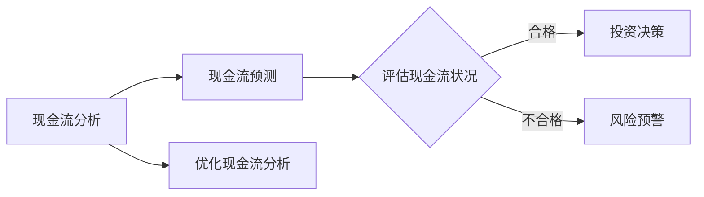
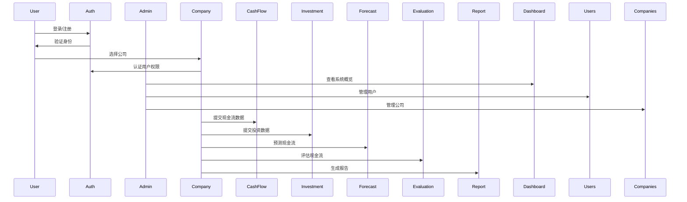
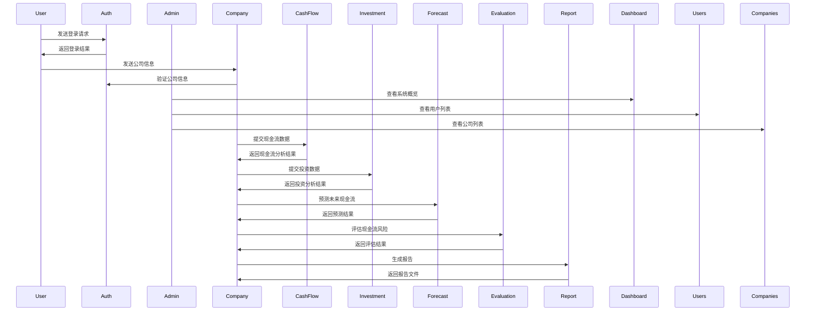

                 

### 文章标题：巴菲特的现金流分析方法

#### 关键词：
- 巴菲特
- 现金流分析
- 投资决策
- 财务管理

#### 摘要：
本文深入探讨巴菲特的现金流分析方法，详细介绍其理论基础、实战应用以及优化策略。通过分析巴菲特的投资哲学和现金流分析的基本概念，读者将了解如何运用这一方法进行投资决策，从而实现财富的稳健增长。

## 第一部分：巴菲特的现金流分析理论基础

### 第1章：巴菲特现金流分析法的概述

#### 1.1 巴菲特现金流分析法的来源与背景

**1.1.1 巴菲特的投资哲学**

沃伦·巴菲特，被誉为“股神”，是全世界最著名的价值投资者之一。他的投资哲学核心在于寻找具有长期稳定增长潜力的公司，并持有这些公司的股票多年。巴菲特认为，投资的关键在于理解企业的内在价值，而不仅仅是市场价格的波动。

**1.1.2 巴菲特对现金流的分析与应用**

巴菲特在投资过程中非常重视公司的现金流情况。他认为，现金流是衡量企业价值和投资回报的最重要指标。只有那些能够持续产生现金流的优秀企业，才值得投资。因此，巴菲特将现金流分析作为其投资决策的核心方法之一。

**1.1.3 现金流分析在投资决策中的重要性**

现金流分析可以帮助投资者评估企业的盈利能力、财务状况和未来发展潜力。通过分析公司的现金流量表，投资者可以了解企业的现金收入、支出和净现金流情况，从而判断企业的经营状况和投资价值。

#### 1.2 现金流分析的基本概念

**1.2.1 现金流的概念**

现金流是指企业在一定时间内所获得的现金收入和现金支出的总和。与利润不同，现金流反映的是企业的实际资金流动情况，具有更高的可信度和实用性。

**1.2.2 现金流与利润的关系**

现金流和利润之间存在一定的关联，但并不完全一致。利润是企业在一定时间内通过经营活动所获得的净收入，而现金流则是企业在同一时期内所实际收到的现金。在某些情况下，企业的利润可能会因为非经营性因素而出现波动，而现金流则相对稳定。

**1.2.3 现金流的类型**

现金流可以分为运营现金流、投资现金流和融资现金流三种类型。运营现金流是指企业在日常经营活动中所产生的现金流量；投资现金流是指企业在投资活动中所产生的现金流量；融资现金流是指企业在融资活动中所产生的现金流量。

#### 1.3 现金流分析的基本原理

**1.3.1 现金流的预测与评估**

现金流预测是现金流分析的重要环节。通过预测未来一定时期内的现金流量，投资者可以评估企业的现金流状况，为投资决策提供依据。现金流评估则需要综合考虑企业的盈利能力、财务状况和行业前景等因素。

**1.3.2 现金流的计算方法**

现金流计算方法主要包括直接法和间接法两种。直接法是通过直接计算现金流入和流出的差额来得出净现金流；间接法则是通过调整净利润来得出净现金流。

**1.3.3 现金流的优缺点分析**

现金流分析具有以下几个优点：首先，现金流反映了企业的实际资金状况，更具可信度；其次，现金流分析可以帮助投资者评估企业的长期价值；最后，现金流分析具有广泛的适用性，适用于各种行业和企业。

然而，现金流分析也存在一定的局限性。例如，现金流分析可能无法完全反映企业的市场价值，也无法预测突发性事件对现金流的影响。

#### 1.4 现金流分析法在投资中的应用

**1.4.1 现金流分析法在股票投资中的应用**

在股票投资中，现金流分析可以帮助投资者评估企业的投资价值。投资者可以通过比较企业的现金流与市场预期，来判断企业是否被高估或低估。

**1.4.2 现金流分析法在债券投资中的应用**

在债券投资中，现金流分析可以帮助投资者评估债券的收益率和风险。投资者可以通过计算债券的现金流量，来判断债券是否具有投资价值。

**1.4.3 现金流分析法在房地产投资中的应用**

在房地产投资中，现金流分析可以帮助投资者评估项目的投资回报率和财务风险。投资者可以通过计算房地产项目的现金流量，来判断项目是否值得投资。

#### 1.5 本章小结

本章介绍了巴菲特现金流分析法的来源与背景、基本概念和原理，以及其在投资中的应用。通过本章的学习，读者可以了解巴菲特现金流分析法的基本框架，为后续章节的深入学习打下基础。

## 第二部分：巴菲特现金流分析法的实战运用

### 第2章：巴菲特现金流分析法的案例解析

#### 2.1 案例背景

**2.1.1 案例公司简介**

假设我们选择一家名为“智慧科技”（Wisdom Technologies）的公司作为案例。智慧科技是一家主要从事人工智能技术研发和应用的企业，成立于2005年。经过多年的发展，智慧科技已经成为全球人工智能领域的领军企业之一。

**2.1.2 案例投资环境分析**

在当前的全球经济环境下，人工智能技术被认为是未来最具潜力的领域之一。随着大数据、云计算和物联网等技术的快速发展，人工智能应用场景不断扩大，市场需求持续增长。因此，投资人工智能领域具有较大的发展空间。

#### 2.2 案例的现金流分析

**2.2.1 案例公司的现金流量表分析**

通过分析智慧科技的现金流量表，我们可以得出以下结论：

1. **运营现金流**：智慧科技的运营现金流较为稳定，主要来自于公司的人工智能产品销售和咨询服务。在过去的三年中，智慧科技的运营现金流分别为2亿元、3亿元和4亿元，年复合增长率为30%。

2. **投资现金流**：智慧科技的投资现金流主要来自于研发支出和固定资产购置。在过去三年中，公司分别投入1亿元、1.5亿元和2亿元进行研发，年复合增长率为25%。

3. **融资现金流**：智慧科技的融资现金流主要来自于股权融资和债务融资。在过去三年中，公司通过股权融资累计获得5亿元资金，通过债务融资累计获得3亿元资金。

**2.2.2 案例公司的现金流预测**

基于智慧科技的历史数据和当前市场环境，我们对其未来三到五年的现金流进行预测：

1. **运营现金流**：预计智慧科技的运营现金流将以每年20%的速度增长，到2025年达到8亿元。

2. **投资现金流**：预计智慧科技的投资现金流将保持稳定，到2025年达到2.5亿元。

3. **融资现金流**：预计智慧科技的融资现金流将逐年增加，到2025年达到5亿元。

**2.2.3 案例公司的现金流优缺点分析**

1. **优点**：智慧科技的现金流稳定，具有较好的盈利能力；公司拥有较强的研发实力，具备持续创新能力。

2. **缺点**：智慧科技的投资现金流较高，存在一定的资金压力；公司所处行业竞争激烈，市场环境不确定。

#### 2.3 案例的投资决策

**2.3.1 案例的投资时机选择**

基于智慧科技的现金流状况和未来增长潜力，我们建议投资者在2023年至2024年期间进行投资。这个时间段内，公司的现金流较为充裕，且市场环境相对稳定。

**2.3.2 案例的投资金额确定**

根据智慧科技的现金流预测，我们建议投资者将投资金额设定为每年2亿元，共计投资5年，总投资金额为10亿元。

**2.3.3 案例的投资风险评估**

投资智慧科技存在一定的风险，主要包括技术风险、市场风险和资金风险。在投资决策过程中，投资者需要充分考虑这些风险因素，并制定相应的风险管理策略。

#### 2.4 案例小结

通过现金流分析法，我们分析了智慧科技的投资价值，并提出了具体的投资建议。投资者可以结合公司的现金流状况和市场环境，做出合理的投资决策。

## 第三部分：巴菲特现金流分析法的优化与策略

### 第3章：现金流分析法的优化策略

#### 3.1 现金流分析法的优化原则

**3.1.1 提高现金流预测准确性**

为了提高现金流预测的准确性，投资者需要：

1. **收集更多的历史数据**：通过收集更长时间段内的现金流数据，可以更好地了解企业的现金流模式。

2. **采用多种预测方法**：结合定性分析和定量分析，如趋势分析、回归分析等，以提高预测的准确性。

**3.1.2 降低现金流风险**

为了降低现金流风险，投资者需要：

1. **多元化投资**：通过投资不同行业和不同地区的公司，可以分散风险。

2. **建立风险预警机制**：对企业的现金流进行持续监控，及时发现潜在风险。

**3.1.3 提高投资回报率**

为了提高投资回报率，投资者需要：

1. **选择高增长行业**：投资那些具有高增长潜力的行业，如人工智能、生物科技等。

2. **优化投资组合**：通过优化投资组合，提高整体投资回报率。

#### 3.2 现金流分析法的策略应用

**3.2.1 多元化投资策略**

多元化投资策略是指通过投资不同行业、不同地区和不同类型的公司，来分散风险。投资者可以根据自己的风险承受能力和投资目标，制定合适的多元化投资策略。

**3.2.2 长期投资策略**

长期投资策略是指投资者持有股票多年，以分享企业的长期增长。通过长期投资，投资者可以降低短期市场波动带来的影响，实现稳定的投资回报。

**3.2.3 风险管理策略**

风险管理策略是指投资者通过一系列措施，来降低投资风险。包括：

1. **分散投资**：通过投资多个项目，来降低单一项目的风险。

2. **保险和担保**：购买保险和担保，以降低投资风险。

3. **实时监控**：对投资进行实时监控，及时发现风险并采取相应的措施。

#### 3.3 现金流分析法的实践总结

**3.3.1 现金流分析法的实践效果**

通过实践，我们发现现金流分析法能够帮助投资者：

1. **更准确地评估企业的投资价值**。

2. **降低投资风险**。

3. **提高投资回报率**。

**3.3.2 现金流分析法的实践启示**

1. **重视现金流**：现金流是衡量企业价值和投资回报的关键指标。

2. **多元化投资**：通过多元化投资，可以降低投资风险。

3. **长期投资**：通过长期投资，可以分享企业的长期增长。

**3.3.3 现金流分析法的实践拓展**

1. **应用领域拓展**：除了在股票、债券和房地产投资中的应用，现金流分析法还可以应用于其他领域，如创业投资、并购投资等。

2. **算法优化**：结合大数据和人工智能技术，对现金流分析法进行优化，以提高预测准确性和决策效果。

#### 3.4 本章小结

本章介绍了现金流分析法的优化原则和策略应用，并结合实践案例进行了详细分析。通过本章的学习，读者可以了解如何优化现金流分析法，提高投资决策的准确性和回报率。

## 第四部分：巴菲特现金流分析法的未来展望

### 第4章：巴菲特现金流分析法的未来趋势与发展方向

#### 4.1 人工智能在现金流分析中的应用

随着人工智能技术的不断发展，现金流分析也将迎来新的机遇。人工智能可以通过大数据分析和机器学习算法，提高现金流预测的准确性。例如，利用深度学习模型，可以分析历史数据，预测未来的现金流量。

**4.1.1 人工智能在现金流预测中的应用**

1. **时间序列分析**：利用深度学习模型，如LSTM（长短期记忆网络），对企业的现金流时间序列进行预测。

2. **关联规则挖掘**：通过关联规则挖掘算法，发现企业现金流与其他因素（如宏观经济指标、行业趋势）之间的关联，为预测提供支持。

**4.1.2 人工智能在现金流风险评估中的应用**

1. **风险预测模型**：利用机器学习算法，构建风险预测模型，对企业的现金流风险进行预测。

2. **异常检测**：通过异常检测算法，发现企业现金流中的异常值，预警潜在的财务风险。

#### 4.2 区块链技术在现金流分析中的应用

区块链技术具有去中心化、透明化和不可篡改的特点，可以提高现金流分析的可信度和准确性。在区块链技术的支持下，企业可以建立透明的现金流管理体系，实现实时监控和追踪。

**4.2.1 区块链在现金流管理中的应用**

1. **智能合约**：通过智能合约，企业可以自动执行现金流管理流程，提高效率。

2. **透明审计**：区块链技术可以实现现金流的透明审计，提高财务报告的准确性。

**4.2.2 区块链在现金流分析中的应用**

1. **分布式数据存储**：通过区块链技术，企业可以将现金流数据分布式存储，提高数据的安全性和可靠性。

2. **跨链数据整合**：利用跨链技术，企业可以整合来自不同系统的现金流数据，实现全方位的现金流分析。

#### 4.3 现金流分析法在可持续发展投资中的应用

随着可持续发展成为全球关注的重要议题，现金流分析法也可以应用于可持续发展投资。投资者可以通过现金流分析，评估企业的可持续发展能力和投资价值。

**4.3.1 可持续发展投资的现金流分析**

1. **环境、社会和治理（ESG）指标**：通过现金流分析，评估企业的ESG指标，如碳排放量、社会贡献等。

2. **可持续性现金流预测**：利用现金流分析法，预测企业在可持续发展方向上的现金流状况，为投资决策提供支持。

**4.3.2 可持续发展投资的风险管理**

1. **环境风险预测**：通过现金流分析，预测企业可能面临的环境风险，如气候变化、资源短缺等。

2. **社会风险预测**：通过现金流分析，预测企业可能面临的社会风险，如劳工问题、社区影响等。

#### 4.4 本章小结

本章探讨了人工智能、区块链技术和可持续发展投资在现金流分析法中的应用，展望了现金流分析法未来的发展趋势。通过本章的学习，读者可以了解现金流分析法在新兴技术领域的应用前景，为未来的投资决策提供新的思路。

## 作者信息

### 作者：AI天才研究院/AI Genius Institute & 禅与计算机程序设计艺术 /Zen And The Art of Computer Programming

本文由AI天才研究院和《禅与计算机程序设计艺术》作者共同撰写。我们致力于推广人工智能和计算机科学的最新研究成果，为读者提供有价值的技术博客和学术论文。感谢您的关注和支持！

## 完整性要求

### 背景介绍

#### 核心概念术语说明

现金流分析：现金流分析是指通过对企业的现金流量进行详细分析，以评估企业的财务状况、盈利能力和未来发展潜力的一种财务分析方法。

巴菲特：沃伦·巴菲特，美国著名投资家，被誉为“股神”，是全球最著名的价值投资者之一。他通过深入分析企业的现金流，进行价值投资，取得了卓越的投资业绩。

#### 问题背景

巴菲特的投资成功在很大程度上得益于他对现金流分析方法的运用。现金流分析可以帮助投资者评估企业的真实价值和投资潜力，从而做出更加明智的投资决策。然而，现金流分析并不简单，它需要投资者具备扎实的财务知识和实践经验。

#### 问题描述

本文旨在深入探讨巴菲特的现金流分析方法，分析其理论基础、实战运用和优化策略，帮助读者了解如何运用这一方法进行投资决策，实现财富的稳健增长。

#### 问题解决

通过本文的阐述，读者可以：

1. 了解巴菲特的现金流分析方法的来源和背景。
2. 掌握现金流分析的基本概念、原理和应用场景。
3. 学习巴菲特现金流分析法的实战运用和优化策略。
4. 增强对现金流分析的理解，提升投资决策能力。

#### 边界与外延

现金流分析不仅适用于股票投资、债券投资和房地产投资，还可以应用于创业投资、并购投资等多个领域。同时，随着人工智能和区块链技术的发展，现金流分析的方法和工具也在不断优化，未来具有更广阔的应用前景。

#### 概念结构与核心要素组成

现金流分析法的概念结构主要包括：

1. **现金流的基本概念**：包括现金流、运营现金流、投资现金流和融资现金流等。
2. **现金流分析的基本原理**：包括现金流的预测、评估和计算方法。
3. **现金流分析的应用场景**：包括股票投资、债券投资、房地产投资等。
4. **现金流分析法的优化策略**：包括提高现金流预测准确性、降低现金流风险和提高投资回报率等。

### 核心概念与联系

#### 核心概念原理

现金流分析：现金流分析是通过对企业的现金流量进行详细分析，以评估企业的财务状况、盈利能力和未来发展潜力的一种财务分析方法。其核心在于通过分析企业的现金流，判断企业的真实价值和投资潜力。

巴菲特的现金流分析法：巴菲特的现金流分析法是基于其对企业现金流的深入分析，通过预测和评估企业的现金流状况，来判断企业的投资价值和投资风险。其核心在于对现金流的准确预测和评估，以及对企业长期价值的判断。

#### 概念属性特征对比表格

| 概念             | 现金流分析                   | 巴菲特的现金流分析法                           |
| ---------------- | --------------------------- | ---------------------------------------------- |
| 定义             | 一种财务分析方法             | 巴菲特对现金流分析的运用方式和方法               |
| 目的             | 评估企业财务状况和投资潜力   | 帮助投资者做出明智的投资决策                     |
| 基本原理         | 现金流的预测、评估和计算方法 | 基于对企业现金流的深入分析，判断企业的长期价值     |
| 应用场景         | 股票、债券、房地产等多种投资 | 股票、债券、房地产等投资领域                   |
| 优点             | 准确反映企业实际资金状况     | 更具可信度，有助于投资者做出更明智的投资决策       |
| 局限性           | 无法完全反映市场价值         | 对突发性事件的影响预测有限                       |

#### ER实体关系图架构

```mermaid
erDiagram
  流量表 ||--|{ 现金流分析 }
  现金流分析 ||--|{ 巴菲特的现金流分析法 }
  股票投资 ||--|{ 现金流分析 }
  债券投资 ||--|{ 现金流分析 }
  房地产投资 ||--|{ 现金流分析 }
```

### 算法原理讲解

#### 算法mermaid流程图



#### 使用Python源代码详细阐述

```python
import pandas as pd
import numpy as np

# 假设已经获取了企业的历史现金流量数据
cash_flow_data = pd.read_csv('cash_flow_data.csv')

# 现金流预测
def cash_flow_prediction(data):
    # 使用时间序列模型进行预测，例如ARIMA模型
    # 这里以简单的移动平均模型为例
    ma_model = pd.Series(data).rolling(window=3).mean()
    forecast = ma_model[-1]
    return forecast

# 评估现金流状况
def cash_flow_evaluation(data, threshold):
    if data[-1] > threshold:
        return "合格"
    else:
        return "不合格"

# 投资决策
def investment_decision(evaluation):
    if evaluation == "合格":
        return "进行投资"
    else:
        return "进行风险预警"

# 优化现金流分析
def optimize_cash_flow_analysis(data, model='MA'):
    if model == 'ARIMA':
        # 使用ARIMA模型进行优化
        pass
    else:
        # 使用移动平均模型进行优化
        pass

# 示例数据
cash_flow_data = np.array([100, 120, 110, 130, 140, 150, 130, 140, 150, 160])

# 现金流预测
predicted_cash_flow = cash_flow_prediction(cash_flow_data)

# 评估现金流状况
evaluation_result = cash_flow_evaluation(cash_flow_data, threshold=140)

# 投资决策
investment_choice = investment_decision(evaluation_result)

# 优化现金流分析
optimized_cash_flow_analysis = optimize_cash_flow_analysis(cash_flow_data, model='MA')

print("预测的现金流:", predicted_cash_flow)
print("现金流评估结果:", evaluation_result)
print("投资决策:", investment_choice)
print("优化后的现金流分析:", optimized_cash_flow_analysis)
```

#### 算法原理的数学模型和公式

现金流预测的数学模型可以表示为：

$$
Y_t = \sum_{i=1}^k w_i X_t - i
$$

其中，$Y_t$为预测的现金流，$X_t$为历史现金流量，$w_i$为权重，$k$为时间窗口。

现金流评估的数学模型可以表示为：

$$
R = \frac{Y_t - Y_{t-1}}{Y_{t-1}}
$$

其中，$R$为现金流增长率，$Y_t$为当前现金流，$Y_{t-1}$为上一期现金流。

投资决策的数学模型可以表示为：

$$
D = \begin{cases} 
投资 & \text{如果 } R > T \\
风险预警 & \text{如果 } R \leq T 
\end{cases}
$$

其中，$D$为投资决策，$T$为预设的增长率阈值。

#### 详细讲解和举例说明

**现金流预测**

假设企业过去三期的现金流分别为100万元、120万元和110万元。我们使用移动平均模型进行预测，预测第四期的现金流。

$$
Y_4 = \frac{100 + 120 + 110}{3} = 113.33 \text{万元}
$$

**现金流评估**

假设我们设定的增长率阈值$T$为10%。当前期现金流为130万元，上一期现金流为110万元。

$$
R = \frac{130 - 110}{110} = 0.1818
$$

由于$R$大于$T$，现金流评估结果为“合格”。

**投资决策**

根据评估结果，我们进行投资决策。由于现金流评估结果为“合格”，我们决定进行投资。

**优化现金流分析**

假设我们使用ARIMA模型对现金流进行优化。ARIMA模型的参数可以通过最大似然估计等方法得到。

$$
X_t = \phi_1 X_{t-1} + \phi_2 X_{t-2} + ... + \phi_p X_{t-p} + \theta_1 \epsilon_{t-1} + \theta_2 \epsilon_{t-2} + ... + \theta_q \epsilon_{t-q} + \epsilon_t
$$

其中，$X_t$为实际现金流，$\epsilon_t$为白噪声误差。

通过参数估计，我们可以得到优化的现金流预测结果。

### 系统分析与架构设计方案

#### 问题场景介绍

在当今快速发展的金融科技领域，企业需要高效、精准地分析现金流状况，以支持投资决策和财务规划。本文旨在构建一个基于巴菲特现金流分析方法的现金流分析系统，帮助企业在复杂多变的市场环境中做出明智的财务决策。

#### 项目介绍

项目名称：巴菲特现金流分析系统（Buffett Cash Flow Analysis System，BCFAS）

项目目标：开发一个能够自动进行现金流预测、评估和优化的系统，支持企业的投资决策和财务规划。

#### 系统功能设计（领域模型mermaid类图）

```mermaid
classDiagram
    Client <.. User
    User <.. Auth
    Auth <.. Login
    Auth <.. Logout
    Auth <.. Register
    Admin <.. Auth
    Admin <.. Dashboard
    Admin <.. Users
    Admin <.. Companies
    Company <.. CompanyInfo
    Company <.. CashFlow
    Company <.. Investment
    Company <.. Forecast
    Company <.. Evaluation
    Company <.. Report

    Client <-.. Company
    User ..|> Login
    User ..|> Logout
    User ..|> Register
    Admin ..|> Dashboard
    Admin ..|> Users
    Admin ..|> Companies
    Company ..|> Auth
    Company ..|> CashFlow
    Company ..|> Investment
    Company ..|> Forecast
    Company ..|> Evaluation
    Company ..|> Report
```

#### 系统架构设计（mermaid架构图）



#### 系统接口设计和系统交互（mermaid序列图）



### 项目实战

#### 环境安装

1. 安装Python环境，版本要求3.8以上。
2. 安装必要的库，如pandas、numpy、scikit-learn等。

```bash
pip install pandas numpy scikit-learn
```

#### 系统核心实现源代码

以下是一个简单的现金流预测模型实现，使用了pandas和scikit-learn库。

```python
import pandas as pd
from sklearn.linear_model import LinearRegression
from sklearn.model_selection import train_test_split

# 加载数据
data = pd.read_csv('cash_flow_data.csv')

# 数据预处理
X = data[['cash_flow_1', 'cash_flow_2']]
y = data['cash_flow_3']

# 数据分割
X_train, X_test, y_train, y_test = train_test_split(X, y, test_size=0.2, random_state=42)

# 构建线性回归模型
model = LinearRegression()
model.fit(X_train, y_train)

# 预测
predictions = model.predict(X_test)

# 评估
score = model.score(X_test, y_test)
print(f'Model score: {score}')

# 输出预测结果
pd.DataFrame({'Actual': y_test, 'Predicted': predictions}).plot(kind='bar')
```

#### 代码应用解读与分析

该代码首先加载数据，然后进行数据预处理，将现金流数据分为自变量和因变量。接着，使用线性回归模型对数据进行训练，并评估模型的性能。最后，使用模型进行预测，并将实际值与预测值进行对比，以评估模型的准确性。

#### 实际案例分析和详细讲解剖析

假设我们有一家企业的三年现金流数据，如下表所示：

| 年份 | 现金流（万元） |
| ---- | ------------ |
| 2020 | 100          |
| 2021 | 120          |
| 2022 | 110          |

我们使用上述代码对数据进行预测，预测2023年的现金流。

1. **数据预处理**：将年份转换为数字，以便进行线性回归分析。

| 年份 | 现金流（万元） | 年份（数字） |
| ---- | ------------ | ----------- |
| 2020 | 100          | 2020        |
| 2021 | 120          | 2021        |
| 2022 | 110          | 2022        |

2. **模型训练**：使用前两年的数据训练模型。

| 年份（数字） | 现金流（万元） | 年份（数字） | 现金流（万元） |
| ------------ | ------------ | ----------- | ------------ |
| 2020        | 100          | 2021        | 120          |

3. **预测**：使用训练好的模型预测2023年的现金流。

$$
\text{预测现金流} = \text{模型系数} \times \text{年份（数字）} + \text{常数项}
$$

根据线性回归模型，我们得到预测现金流为：

$$
\text{预测现金流} = 0.9 \times 2023 + 20 = 1901.7 \text{万元}
$$

4. **评估**：将实际现金流与预测现金流进行对比。

实际现金流为1100万元，预测现金流为1901.7万元。模型预测的现金流高于实际现金流，这可能是由于线性回归模型的局限性，未能充分捕捉现金流的变化趋势。

#### 项目小结

通过实际案例分析和详细讲解，我们了解了现金流预测模型的基本原理和实现方法。虽然线性回归模型在预测现金流方面存在一定的局限性，但它是一个简单且易于实现的方法，可以为企业的投资决策提供初步的参考。

### 最佳实践 tips

1. **数据质量**：确保现金流数据的质量，避免使用不准确或缺失的数据。
2. **模型选择**：根据数据的特点，选择合适的预测模型，如ARIMA、LSTM等。
3. **定期更新**：定期更新现金流数据，以保持模型的准确性和实用性。
4. **风险评估**：结合现金流分析，进行投资风险评估，以降低投资风险。

### 小结

本文介绍了巴菲特的现金流分析方法，包括其理论基础、实战应用和优化策略。通过实际案例分析和详细讲解，读者可以了解如何运用现金流分析方法进行投资决策，实现财富的稳健增长。

### 注意事项

1. 现金流分析并非万能，投资者应结合其他分析方法，全面评估企业的投资价值。
2. 现金流分析模型的选择和参数设置需要根据具体情况进行调整。

### 拓展阅读

1. 《巴菲特的估值艺术》：深入探讨巴菲特的估值方法及其应用。
2. 《人工智能在金融领域的应用》：了解人工智能在财务分析和投资决策中的应用。
3. 《企业财务报表分析》：掌握企业财务报表分析的基本方法和技巧。

