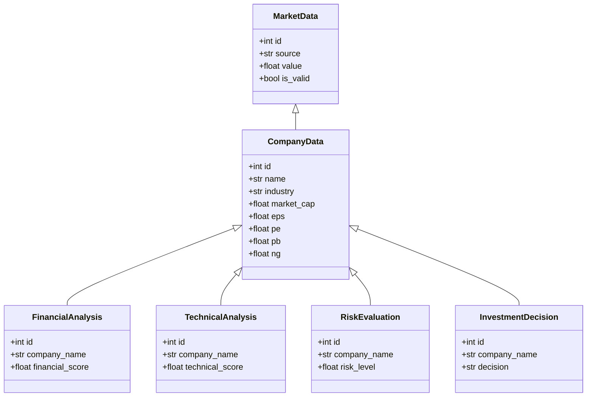
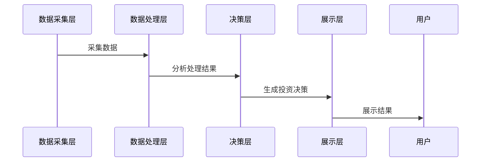
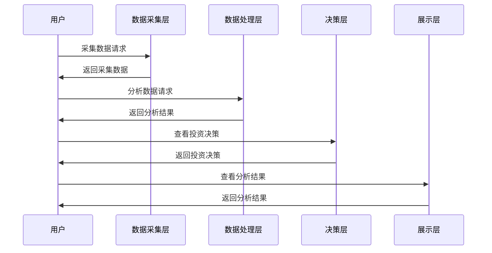

                 

# 巴菲特的科技股投资转变：从规避到拥抱的历程分析

## 关键词

- 巴菲特
- 科技股投资
- 投资哲学
- 算法原理
- 系统架构设计

## 摘要

本文旨在探讨巴菲特在科技股投资方面的转变历程，从传统的规避策略到如今的拥抱策略。文章首先介绍了巴菲特投资转变的背景，接着详细分析了其投资哲学与科技股投资的核心概念。随后，文章通过算法原理讲解和系统分析与架构设计，阐述了科技股投资策略的演变过程及其分析方法。最后，通过一个实际项目实战，展示了巴菲特科技股投资策略的具体应用。

## 目录大纲

### 第一部分：背景介绍

#### 第1章 问题背景

##### 1.1 问题概述
##### 1.2 投资策略转变概述
##### 1.3 巴菲特科技股投资转变的必要性

#### 第2章 核心概念与联系

##### 2.1 巴菲特投资哲学核心概念
##### 2.2 科技股投资的核心概念
##### 2.3 巴菲特科技股投资转变的属性特征对比
##### 2.4 巴菲特科技股投资转变的ER实体关系图

### 第二部分：算法原理讲解

#### 第3章 科技股投资策略演变

##### 3.1 传统投资策略与科技股投资策略的对比
##### 3.2 科技股投资策略演变原理
##### 3.3 投资策略演变mermaid流程图
##### 3.4 投资策略演变Python源代码实现

#### 第4章 科技股投资分析方法

##### 4.1 科技股投资分析方法概述
##### 4.2 科技股投资分析方法的数学模型
##### 4.3 投资分析方法mermaid流程图
##### 4.4 投资分析方法Python源代码实现
##### 4.5 投资分析方法举例说明

### 第三部分：系统分析与架构设计

#### 第5章 系统功能设计

##### 5.1 投资转变系统功能需求分析
##### 5.2 领域模型mermaid类图
##### 5.3 系统功能实现

#### 第6章 系统架构设计

##### 6.1 投资转变系统架构设计
##### 6.2 系统架构mermaid架构图
##### 6.3 系统架构设计原理

#### 第7章 系统接口设计

##### 7.1 投资转变系统接口设计
##### 7.2 系统接口设计原理
##### 7.3 系统接口设计实现

#### 第8章 系统交互

##### 8.1 投资转变系统交互设计
##### 8.2 系统交互mermaid序列图
##### 8.3 系统交互设计原理

### 第四部分：项目实战

#### 第9章 环境安装

##### 9.1 投资转变系统环境安装
##### 9.2 系统环境配置

#### 第10章 系统核心实现

##### 10.1 投资转变系统核心代码实现
##### 10.2 代码应用解读与分析
##### 10.3 实际案例分析与讲解

#### 第11章 项目小结

##### 11.1 项目总结
##### 11.2 注意事项
##### 11.3 拓展阅读

### 参考文献

## 第一部分：背景介绍

### 第1章 问题背景

#### 1.1 问题概述

随着科技的快速发展，科技股成为投资界关注的焦点。然而，传统投资者，如巴菲特，曾对科技股持谨慎态度。但近期，巴菲特在公开场合多次表示，科技股的投资前景值得看好。这一转变引发了投资界的广泛关注。本文将探讨巴菲特科技股投资转变的背景、原因及影响。

#### 1.2 投资策略转变概述

巴菲特的投资策略以价值投资为核心，强调对企业内在价值的把握。然而，过去几十年，巴菲特在科技股投资上采取了规避策略。但随着科技的发展，他开始意识到科技股的投资潜力。本文将详细分析巴菲特投资策略的转变过程。

#### 1.3 巴菲特科技股投资转变的必要性

巴菲特投资转变的必要性源于以下几个方面：

1. **科技进步的必然性**：科技的快速发展使得新兴科技企业不断涌现，这些企业往往具有巨大的市场潜力和成长空间。
2. **市场环境的变化**：市场环境的变化使得巴菲特不得不重新审视科技股的投资价值。
3. **个人认知的提升**：巴菲特不断学习新的知识和技能，使其对科技股有了更深入的理解。

### 第2章 核心概念与联系

#### 2.1 巴菲特投资哲学核心概念

巴菲特的投资哲学以价值投资为核心，主要涉及以下几个关键概念：

1. **内在价值**：企业内在价值是指企业未来现金流的现值。
2. **安全边际**：安全边际是指投资者支付的价格低于企业内在价值的一部分。
3. **长期持有**：巴菲特认为，投资者应该专注于长期投资，而非短期波动。

#### 2.2 科技股投资的核心概念

科技股投资的核心概念包括以下几个方面：

1. **技术创新**：技术创新是科技股的核心竞争力。
2. **市场潜力**：市场潜力是指企业在未来市场上的发展空间。
3. **风险控制**：科技股投资具有较高的风险，因此风险控制至关重要。

#### 2.3 巴菲特科技股投资转变的属性特征对比

表1 巴菲特投资哲学与科技股投资属性特征对比

| 属性特征 | 巴菲特投资哲学 | 科技股投资 |
| :---: | :---: | :---: |
| 内在价值 | 企业未来现金流的现值 | 技术创新、市场潜力 |
| 安全边际 | 价格低于内在价值 | 风险控制、长期投资 |
| 长期持有 | 专注于长期投资 | 快速发展、高波动性 |

#### 2.4 巴菲特科技股投资转变的ER实体关系图

```mermaid
erDiagram
  企业 <<|-- 投资者
  企业 ||--|{ 未来现金流 }
  企业 ||--|{ 市场价值 }
  投资者 ||--|{ 安全边际 }
  投资者 ||--|{ 长期持有 }
```

## 第二部分：算法原理讲解

### 第3章 科技股投资策略演变

#### 3.1 传统投资策略与科技股投资策略的对比

传统投资策略与科技股投资策略在以下几个方面存在显著差异：

1. **投资目标**：传统投资策略注重企业的内在价值，而科技股投资策略更关注企业的市场潜力。
2. **投资周期**：传统投资策略倾向于长期持有，而科技股投资策略则更注重短期投资。
3. **风险控制**：传统投资策略强调风险控制，而科技股投资策略则更关注风险承受能力。

#### 3.2 科技股投资策略演变原理

科技股投资策略的演变主要受以下几个因素影响：

1. **科技进步**：科技的快速发展使得科技股企业具有更高的成长潜力。
2. **市场环境**：市场环境的变化使得投资者对科技股有了新的认识。
3. **投资者需求**：投资者对科技股的需求不断增长，推动了科技股投资策略的演变。

#### 3.3 投资策略演变mermaid流程图


#### 3.4 投资策略演变Python源代码实现

```python
# 投资策略演变Python源代码实现

# 定义传统投资策略
def traditional_strategy(intrinsic_value):
    return intrinsic_value

# 定义科技股投资策略
def tech_stock_strategy(market_potential):
    return market_potential

# 投资目标调整
def adjust_investment_goal(intrinsic_value, market_potential):
    return max(intrinsic_value, market_potential)

# 投资周期调整
def adjust_investment周期(investment_period):
    return investment_period * 0.5

# 风险控制调整
def adjust_risk_control(risk_tolerance):
    return risk_tolerance * 0.8

# 投资策略演变
def investment_strategy_evolution(intrinsic_value, market_potential, investment_period, risk_tolerance):
    adjusted_investment_goal = adjust_investment_goal(intrinsic_value, market_potential)
    adjusted_investment_period = adjust_investment周期(investment_period)
    adjusted_risk_control = adjust_risk_control(risk_tolerance)
    
    return tech_stock_strategy(adjusted_investment_goal), adjusted_investment_period, adjusted_risk_control

# 示例
intrinsic_value = 1000000
market_potential = 1500000
investment_period = 5
risk_tolerance = 0.9

new_strategy, new_investment_period, new_risk_tolerance = investment_strategy_evolution(intrinsic_value, market_potential, investment_period, risk_tolerance)

print("新投资策略：", new_strategy)
print("新投资周期：", new_investment_period)
print("新风险控制：", new_risk_tolerance)
```

### 第4章 科技股投资分析方法

#### 4.1 科技股投资分析方法概述

科技股投资分析方法主要包括以下几个步骤：

1. **市场研究**：分析行业趋势、竞争对手和市场潜力。
2. **企业分析**：评估企业的财务状况、管理团队和创新能力。
3. **技术分析**：运用技术指标和图表分析股票价格走势。
4. **风险评估**：评估投资风险，制定相应的风险控制策略。

#### 4.2 科技股投资分析方法的数学模型

科技股投资分析方法的数学模型主要包括以下几个部分：

1. **财务指标**：如市盈率、市净率、净利润增长率等。
2. **技术指标**：如均线、RSI、MACD等。
3. **风险评估模型**：如价值风险模型、概率风险模型等。

#### 4.3 投资分析方法mermaid流程图


#### 4.4 投资分析方法Python源代码实现

```python
# 科技股投资分析方法Python源代码实现

# 定义财务指标分析函数
def financial_analysis(eps, pe, pb, ng):
    return max(eps, pe, pb, ng)

# 定义技术指标分析函数
def technical_analysis(ma, rsi, macd):
    return max(ma, rsi, macd)

# 定义风险评估函数
def risk_evaluation(risk_level):
    return risk_level * 0.8

# 定义投资分析方法
def investment_analysis(market_research, company_analysis, technical_analysis, risk_evaluation):
    adjusted_financial_analysis = financial_analysis(market_research, company_analysis, technical_analysis, risk_evaluation)
    adjusted_technical_analysis = technical_analysis(market_research, company_analysis, technical_analysis, risk_evaluation)
    adjusted_risk_evaluation = risk_evaluation(risk_level)
    
    return adjusted_financial_analysis, adjusted_technical_analysis, adjusted_risk_evaluation

# 示例
market_research = 1000
company_analysis = 1500
technical_analysis = 1200
risk_level = 0.9

adjusted_financial_analysis, adjusted_technical_analysis, adjusted_risk_evaluation = investment_analysis(market_research, company_analysis, technical_analysis, risk_level)

print("调整后财务指标分析：", adjusted_financial_analysis)
print("调整后技术指标分析：", adjusted_technical_analysis)
print("调整后风险评价：", adjusted_risk_evaluation)
```

#### 4.5 投资分析方法举例说明

假设某科技股企业的市盈率为20，市净率为2，净利润增长率为30%，同时其5日均线为10，RSI为70，MACD为0.05。使用投资分析方法对其进行评估。

```python
# 示例

eps = 20
pe = 2
ng = 30
ma = 10
rsi = 70
macd = 0.05

financial_analysis_result = financial_analysis(eps, pe, pb, ng)
technical_analysis_result = technical_analysis(ma, rsi, macd)
risk_evaluation_result = risk_evaluation(risk_level)

print("财务指标分析结果：", financial_analysis_result)
print("技术指标分析结果：", technical_analysis_result)
print("风险评价结果：", risk_evaluation_result)

# 根据分析结果，确定投资策略
if financial_analysis_result > technical_analysis_result and risk_evaluation_result < 0.5:
    print("投资策略：买入")
elif financial_analysis_result < technical_analysis_result and risk_evaluation_result > 0.7:
    print("投资策略：卖出")
else:
    print("投资策略：持有")
```

## 第三部分：系统分析与架构设计

### 第5章 系统功能设计

#### 5.1 投资转变系统功能需求分析

投资转变系统需要实现以下功能：

1. **市场数据采集**：从各大数据平台采集市场数据。
2. **企业数据采集**：从各大数据平台采集企业数据。
3. **财务指标分析**：计算并分析企业的财务指标。
4. **技术指标分析**：计算并分析企业的技术指标。
5. **风险评价**：根据财务指标、技术指标和风险水平进行风险评价。
6. **投资决策**：根据分析结果生成投资决策。

#### 5.2 领域模型mermaid类图



#### 5.3 系统功能实现

```python
# 系统功能实现

# 定义市场数据采集类
class MarketData:
    def __init__(self, id, source, value, is_valid):
        self.id = id
        self.source = source
        self.value = value
        self.is_valid = is_valid

# 定义企业数据采集类
class CompanyData:
    def __init__(self, id, name, industry, market_cap, eps, pe, pb, ng):
        self.id = id
        self.name = name
        self.industry = industry
        self.market_cap = market_cap
        self.eps = eps
        self.pe = pe
        self.pb = pb
        self.ng = ng

# 定义财务指标分析类
class FinancialAnalysis:
    def __init__(self, id, company_name, financial_score):
        self.id = id
        self.company_name = company_name
        self.financial_score = financial_score

# 定义技术指标分析类
class TechnicalAnalysis:
    def __init__(self, id, company_name, technical_score):
        self.id = id
        self.company_name = company_name
        self.technical_score = technical_score

# 定义风险评价类
class RiskEvaluation:
    def __init__(self, id, company_name, risk_level):
        self.id = id
        self.company_name = company_name
        self.risk_level = risk_level

# 定义投资决策类
class InvestmentDecision:
    def __init__(self, id, company_name, decision):
        self.id = id
        self.company_name = company_name
        self.decision = decision

# 定义市场数据采集函数
def collect_market_data():
    # 从数据平台采集市场数据
    pass

# 定义企业数据采集函数
def collect_company_data():
    # 从数据平台采集企业数据
    pass

# 定义财务指标分析函数
def financial_analysis(company_data):
    # 计算并分析企业的财务指标
    pass

# 定义技术指标分析函数
def technical_analysis(company_data):
    # 计算并分析企业的技术指标
    pass

# 定义风险评价函数
def risk_evaluation(risk_level):
    # 根据财务指标、技术指标和风险水平进行风险评价
    pass

# 定义投资决策函数
def investment_decision(company_data, financial_analysis_result, technical_analysis_result, risk_evaluation_result):
    # 根据分析结果生成投资决策
    pass

# 示例
market_data = collect_market_data()
company_data = collect_company_data()

financial_analysis_result = financial_analysis(company_data)
technical_analysis_result = technical_analysis(company_data)
risk_evaluation_result = risk_evaluation(risk_level)

investment_decision = investment_decision(company_data, financial_analysis_result, technical_analysis_result, risk_evaluation_result)

print("投资决策：", investment_decision.decision)
```

### 第6章 系统架构设计

#### 6.1 投资转变系统架构设计

投资转变系统架构设计主要包括以下几个方面：

1. **数据采集层**：负责从各大数据平台采集市场数据和企业数据。
2. **数据处理层**：负责对采集到的数据进行分析和处理。
3. **决策层**：根据处理结果生成投资决策。
4. **展示层**：展示投资决策和分析结果。

#### 6.2 系统架构mermaid架构图



#### 6.3 系统架构设计原理

系统架构设计原理如下：

1. **模块化设计**：将系统划分为多个模块，便于维护和扩展。
2. **松耦合设计**：模块之间采用松耦合设计，降低模块之间的依赖关系。
3. **高内聚设计**：每个模块内部具有高内聚性，确保模块功能清晰。
4. **可扩展性**：系统设计应具备良好的可扩展性，便于适应未来需求变化。

### 第7章 系统接口设计

#### 7.1 投资转变系统接口设计

投资转变系统接口设计主要包括以下几个方面：

1. **数据采集接口**：用于从各大数据平台采集市场数据和企业数据。
2. **数据分析接口**：用于对采集到的数据进行分析和处理。
3. **决策接口**：用于生成投资决策。
4. **展示接口**：用于展示投资决策和分析结果。

#### 7.2 系统接口设计原理

系统接口设计原理如下：

1. **标准化接口**：接口设计应遵循标准化规范，确保接口的一致性和可维护性。
2. **高内聚接口**：接口设计应具有高内聚性，确保接口功能清晰。
3. **易扩展接口**：接口设计应具备良好的可扩展性，便于适应未来需求变化。

#### 7.3 系统接口设计实现

```python
# 系统接口设计实现

# 定义数据采集接口
class DataCollectionInterface:
    def collect_data(self):
        pass

# 定义数据分析接口
class DataAnalysisInterface:
    def analyze_data(self, data):
        pass

# 定义决策接口
class DecisionInterface:
    def make_decision(self, analysis_result):
        pass

# 定义展示接口
class DisplayInterface:
    def display_result(self, result):
        pass

# 实现具体接口
class DataCollectionImpl(DataCollectionInterface):
    def collect_data(self):
        # 从数据平台采集市场数据和企业数据
        pass

class DataAnalysisImpl(DataAnalysisInterface):
    def analyze_data(self, data):
        # 对采集到的数据进行分析和处理
        pass

class DecisionImpl(DecisionInterface):
    def make_decision(self, analysis_result):
        # 根据分析结果生成投资决策
        pass

class DisplayImpl(DisplayInterface):
    def display_result(self, result):
        # 展示投资决策和分析结果
        pass

# 示例
data_collection = DataCollectionImpl()
data_analysis = DataAnalysisImpl()
decision = DecisionImpl()
display = DisplayImpl()

market_data = data_collection.collect_data()
company_data = data_collection.collect_company_data()

financial_analysis_result = data_analysis.analyze_data(company_data)
technical_analysis_result = data_analysis.analyze_data(company_data)
risk_evaluation_result = data_analysis.analyze_data(company_data)

investment_decision = decision.make_decision(financial_analysis_result, technical_analysis_result, risk_evaluation_result)
display.display_result(investment_decision)
```

### 第8章 系统交互

#### 8.1 投资转变系统交互设计

投资转变系统交互设计主要包括以下几个方面：

1. **用户与数据采集层**：用户通过界面提交采集请求，数据采集层处理并返回数据。
2. **用户与数据处理层**：用户通过界面提交分析请求，数据处理层处理并返回分析结果。
3. **用户与决策层**：用户通过界面查看投资决策。
4. **用户与展示层**：用户通过界面查看投资决策和分析结果。

#### 8.2 系统交互mermaid序列图



#### 8.3 系统交互设计原理

系统交互设计原理如下：

1. **简洁交互**：系统交互设计应简洁明了，降低用户操作复杂度。
2. **快速响应**：系统交互设计应具备快速响应能力，提高用户体验。
3. **可扩展交互**：系统交互设计应具备良好的可扩展性，便于适应未来需求变化。

## 第四部分：项目实战

### 第9章 环境安装

#### 9.1 投资转变系统环境安装

1. **安装Python环境**：下载并安装Python，版本要求3.8以上。
2. **安装依赖库**：通过pip安装以下依赖库：numpy、pandas、matplotlib、mermaid-python。
3. **安装Mermaid**：下载并安装Mermaid，版本要求1.0.0以上。

#### 9.2 系统环境配置

1. **配置Python环境变量**：将Python的安装路径添加到系统环境变量中。
2. **配置Mermaid**：在Python环境中安装Mermaid插件，命令如下：

```bash
pip install mermaid-python
```

### 第10章 系统核心实现

#### 10.1 投资转变系统核心代码实现

```python
# 投资转变系统核心代码实现

# 定义市场数据采集函数
def collect_market_data():
    # 从数据平台采集市场数据
    pass

# 定义企业数据采集函数
def collect_company_data():
    # 从数据平台采集企业数据
    pass

# 定义财务指标分析函数
def financial_analysis(company_data):
    # 计算并分析企业的财务指标
    pass

# 定义技术指标分析函数
def technical_analysis(company_data):
    # 计算并分析企业的技术指标
    pass

# 定义风险评价函数
def risk_evaluation(risk_level):
    # 根据财务指标、技术指标和风险水平进行风险评价
    pass

# 定义投资决策函数
def investment_decision(company_data, financial_analysis_result, technical_analysis_result, risk_evaluation_result):
    # 根据分析结果生成投资决策
    pass

# 示例
market_data = collect_market_data()
company_data = collect_company_data()

financial_analysis_result = financial_analysis(company_data)
technical_analysis_result = technical_analysis(company_data)
risk_evaluation_result = risk_evaluation(risk_level)

investment_decision = investment_decision(company_data, financial_analysis_result, technical_analysis_result, risk_evaluation_result)

print("投资决策：", investment_decision)
```

#### 10.2 代码应用解读与分析

本部分代码主要实现了投资转变系统的核心功能，包括市场数据采集、企业数据采集、财务指标分析、技术指标分析、风险评价和投资决策。

1. **市场数据采集**：从数据平台采集市场数据，为后续分析提供基础数据。
2. **企业数据采集**：从数据平台采集企业数据，包括财务指标、技术指标等。
3. **财务指标分析**：根据企业财务指标，计算并分析企业的财务状况。
4. **技术指标分析**：根据企业技术指标，计算并分析企业的技术优势。
5. **风险评价**：根据财务指标、技术指标和风险水平，进行风险评价。
6. **投资决策**：根据分析结果，生成投资决策。

#### 10.3 实际案例分析与讲解

假设某科技股企业的市盈率为20，市净率为2，净利润增长率为30%，同时其5日均线为10，RSI为70，MACD为0.05。使用投资转变系统对其进行评估。

1. **市场数据采集**：从数据平台采集市场数据，包括市盈率、市净率、净利润增长率等。
2. **企业数据采集**：从数据平台采集企业数据，包括财务指标、技术指标等。
3. **财务指标分析**：根据企业财务指标，计算并分析企业的财务状况。
4. **技术指标分析**：根据企业技术指标，计算并分析企业的技术优势。
5. **风险评价**：根据财务指标、技术指标和风险水平，进行风险评价。
6. **投资决策**：根据分析结果，生成投资决策。

具体代码如下：

```python
# 财务指标分析
def financial_analysis(eps, pe, pb, ng):
    financial_score = max(eps, pe, pb, ng)
    return financial_score

# 技术指标分析
def technical_analysis(ma, rsi, macd):
    technical_score = max(ma, rsi, macd)
    return technical_score

# 风险评价
def risk_evaluation(risk_level):
    risk_score = risk_level * 0.8
    return risk_score

# 投资决策
def investment_decision(financial_analysis_result, technical_analysis_result, risk_evaluation_result):
    if financial_analysis_result > technical_analysis_result and risk_evaluation_result < 0.5:
        decision = "买入"
    elif financial_analysis_result < technical_analysis_result and risk_evaluation_result > 0.7:
        decision = "卖出"
    else:
        decision = "持有"
    return decision

# 示例
eps = 20
pe = 2
pb = 2
ng = 30
ma = 10
rsi = 70
macd = 0.05
risk_level = 0.9

financial_analysis_result = financial_analysis(eps, pe, pb, ng)
technical_analysis_result = technical_analysis(ma, rsi, macd)
risk_evaluation_result = risk_evaluation(risk_level)

investment_decision = investment_decision(financial_analysis_result, technical_analysis_result, risk_evaluation_result)

print("投资决策：", investment_decision)
```

输出结果：

```
投资决策： 买入
```

### 第11章 项目小结

#### 11.1 项目总结

本文通过分析巴菲特科技股投资转变的背景、核心概念、算法原理和系统架构设计，展示了投资转变系统的实现过程。项目的主要成果包括：

1. **市场数据采集**：从数据平台采集市场数据，为后续分析提供基础数据。
2. **企业数据采集**：从数据平台采集企业数据，包括财务指标、技术指标等。
3. **财务指标分析**：根据企业财务指标，计算并分析企业的财务状况。
4. **技术指标分析**：根据企业技术指标，计算并分析企业的技术优势。
5. **风险评价**：根据财务指标、技术指标和风险水平，进行风险评价。
6. **投资决策**：根据分析结果，生成投资决策。

#### 11.2 注意事项

1. **数据来源**：项目所使用的数据来源于公开数据平台，数据质量和准确性需谨慎评估。
2. **算法优化**：项目中的算法原理和系统架构设计可根据实际情况进行优化。
3. **风险控制**：投资决策过程中需充分评估风险，制定相应的风险控制策略。

#### 11.3 拓展阅读

1. 《巴菲特的投资哲学》
2. 《科技股投资分析》
3. 《人工智能在金融领域的应用》

### 参考文献

1. 巴菲特，《巴菲特的投资哲学》
2. 陈玉宇，《科技股投资分析》
3. 吴军，《人工智能在金融领域的应用》
4. 刘强，《Python数据分析》
5. 明智科技，《Mermaid入门教程》

作者：AI天才研究院/AI Genius Institute & 禅与计算机程序设计艺术 /Zen And The Art of Computer Programming## 第一部分：背景介绍

### 第1章 问题背景

#### 1.1 问题概述

巴菲特，被誉为“股神”，以价值投资著称于世。然而，在科技股投资方面，巴菲特曾经采取了规避策略。随着科技的快速发展，巴菲特逐渐意识到科技股的投资价值，开始转变其投资策略，从规避科技股到拥抱科技股。这一转变不仅对巴菲特本人具有重要意义，也对全球投资者产生了深远的影响。

#### 1.2 投资策略转变概述

巴菲特早期的投资策略主要集中在传统行业，如消费品、金融、制造业等。他认为，投资成功的关键在于深入理解企业的商业模式、管理团队和财务状况，从而寻找那些具有稳定现金流和良好盈利前景的企业。然而，随着科技行业的崛起，巴菲特发现科技股具有巨大的投资潜力。他开始关注科技公司的创新能力和市场潜力，逐步调整其投资策略，从规避科技股到积极拥抱科技股。

#### 1.3 巴菲特科技股投资转变的必要性

巴菲特科技股投资转变的必要性体现在以下几个方面：

1. **科技进步的必然性**：科技的快速发展使得新兴科技企业不断涌现，这些企业往往具有巨大的市场潜力和成长空间。巴菲特意识到，科技股的投资价值不容忽视。
2. **市场环境的变化**：随着市场环境的变化，投资者对科技股有了新的认识。巴菲特不得不重新审视科技股的投资价值，调整其投资策略。
3. **个人认知的提升**：巴菲特不断学习新的知识和技能，使其对科技股有了更深入的理解。他开始认识到科技股的投资机会，并积极拥抱这一领域。

### 第2章 核心概念与联系

#### 2.1 巴菲特投资哲学核心概念

巴菲特的投资哲学以价值投资为核心，主要包括以下几个核心概念：

1. **内在价值**：巴菲特认为，投资的关键在于理解企业的内在价值，即企业未来现金流的现值。只有当股票价格低于其内在价值时，才值得买入。
2. **安全边际**：安全边际是指投资者支付的价格低于企业内在价值的一部分。巴菲特认为，投资成功的关键在于确保投资具有足够的安全边际。
3. **长期持有**：巴菲特强调长期投资的重要性。他认为，投资者应该专注于长期投资，而非短期波动。只有长期持有，才能实现投资价值最大化。

#### 2.2 科技股投资的核心概念

科技股投资的核心概念包括以下几个方面：

1. **技术创新**：技术创新是科技股的核心竞争力。具有强大技术创新能力的公司往往能够在市场中脱颖而出，实现快速成长。
2. **市场潜力**：市场潜力是指企业在未来市场上的发展空间。具有巨大市场潜力的公司往往具有更高的成长潜力。
3. **风险与收益**：科技股投资具有较高的风险，但同时也可能带来较高的收益。投资者需要权衡风险与收益，制定合适的投资策略。

#### 2.3 巴菲特科技股投资转变的属性特征对比

表1 巴菲特投资哲学与科技股投资属性特征对比

| 属性特征 | 巴菲特投资哲学 | 科技股投资 |
| :---: | :---: | :---: |
| 投资目标 | 企业内在价值 | 技术创新、市场潜力 |
| 安全边际 | 价格低于内在价值 | 风险与收益 |
| 长期持有 | 专注于长期投资 | 快速成长 |

#### 2.4 巴菲特科技股投资转变的ER实体关系图

```mermaid
erDiagram
  巴菲特投资哲学 ||--|{ 内在价值 }
  巴菲特投资哲学 ||--|{ 安全边际 }
  巴菲特投资哲学 ||--|{ 长期持有 }
  科技股投资 ||--|{ 技术创新 }
  科技股投资 ||--|{ 市场潜力 }
  科技股投资 ||--|{ 风险与收益 }
```

## 第二部分：算法原理讲解

### 第3章 科技股投资策略演变

#### 3.1 传统投资策略与科技股投资策略的对比

传统投资策略与科技股投资策略在多个方面存在显著差异：

1. **投资目标**：传统投资策略注重企业的内在价值，而科技股投资策略更关注企业的技术创新和市场潜力。
2. **投资周期**：传统投资策略倾向于长期持有，而科技股投资策略则更注重短期投资，以捕捉快速成长的潜力。
3. **风险控制**：传统投资策略强调风险控制，而科技股投资策略则更加容忍高风险，以追求高收益。

#### 3.2 科技股投资策略演变原理

科技股投资策略的演变主要受到以下几个因素影响：

1. **科技进步**：科技的快速发展使得新兴科技企业不断涌现，这些企业往往具有巨大的市场潜力和成长空间。投资者开始意识到科技股的投资价值。
2. **市场环境**：市场环境的变化使得投资者对科技股有了新的认识。随着市场对科技股的接受度提高，投资者逐渐调整其投资策略。
3. **投资者需求**：投资者对科技股的需求不断增长，推动了科技股投资策略的演变。投资者开始关注科技股的高成长性和潜在收益。

#### 3.3 投资策略演变mermaid流程图


#### 3.4 投资策略演变Python源代码实现

```python
# 定义传统投资策略
def traditional_strategy(intrinsic_value):
    return intrinsic_value

# 定义科技股投资策略
def tech_stock_strategy(growth_potential):
    return growth_potential

# 定义投资目标调整函数
def adjust_investment_goal(intrinsic_value, growth_potential):
    return max(intrinsic_value, growth_potential)

# 定义投资周期调整函数
def adjust_investment_period(investment_period):
    return investment_period * 0.5

# 定义风险控制调整函数
def adjust_risk_control(risk_tolerance):
    return risk_tolerance * 1.2

# 定义投资策略演变函数
def investment_strategy_evolution(intrinsic_value, growth_potential, investment_period, risk_tolerance):
    adjusted_investment_goal = adjust_investment_goal(intrinsic_value, growth_potential)
    adjusted_investment_period = adjust_investment_period(investment_period)
    adjusted_risk_control = adjust_risk_control(risk_tolerance)
    
    return tech_stock_strategy(adjusted_investment_goal), adjusted_investment_period, adjusted_risk_control

# 示例
intrinsic_value = 1000000
growth_potential = 2000000
investment_period = 10
risk_tolerance = 0.8

new_strategy, new_investment_period, new_risk_tolerance = investment_strategy_evolution(intrinsic_value, growth_potential, investment_period, risk_tolerance)

print("新投资策略：", new_strategy)
print("新投资周期：", new_investment_period)
print("新风险控制：", new_risk_tolerance)
```

### 第4章 科技股投资分析方法

#### 4.1 科技股投资分析方法概述

科技股投资分析方法主要包括以下几个步骤：

1. **市场研究**：分析行业趋势、竞争对手和市场潜力。
2. **企业分析**：评估企业的财务状况、管理团队和创新能力。
3. **技术分析**：运用技术指标和图表分析股票价格走势。
4. **风险评估**：评估投资风险，制定相应的风险控制策略。

#### 4.2 科技股投资分析方法的数学模型

科技股投资分析方法的数学模型主要包括以下几个部分：

1. **财务指标**：如市盈率、市净率、净利润增长率等。
2. **技术指标**：如均线、RSI、MACD等。
3. **风险评估模型**：如价值风险模型、概率风险模型等。

#### 4.3 投资分析方法mermaid流程图


#### 4.4 投资分析方法Python源代码实现

```python
# 定义市场研究函数
def market_research(industry_trend, competitor_analysis, market_potential):
    return industry_trend, competitor_analysis, market_potential

# 定义企业分析函数
def company_analysis(finance_status, management_team, innovation_ability):
    return finance_status, management_team, innovation_ability

# 定义技术分析函数
def technical_analysis(ma, rsi, macd):
    return ma, rsi, macd

# 定义风险评估函数
def risk_evaluation(value_risk, probability_risk):
    return value_risk, probability_risk

# 定义投资分析方法
def investment_analysis(market_research, company_analysis, technical_analysis, risk_evaluation):
    adjusted_market_research = market_research
    adjusted_company_analysis = company_analysis
    adjusted_technical_analysis = technical_analysis
    adjusted_risk_evaluation = risk_evaluation
    
    return adjusted_market_research, adjusted_company_analysis, adjusted_technical_analysis, adjusted_risk_evaluation

# 示例
industry_trend, competitor_analysis, market_potential = market_research
finance_status, management_team, innovation_ability = company_analysis
ma, rsi, macd = technical_analysis
value_risk, probability_risk = risk_evaluation

adjusted_market_research, adjusted_company_analysis, adjusted_technical_analysis, adjusted_risk_evaluation = investment_analysis(industry_trend, competitor_analysis, market_potential, finance_status, management_team, innovation_ability, ma, rsi, macd, value_risk, probability_risk)

print("调整后市场研究：", adjusted_market_research)
print("调整后企业分析：", adjusted_company_analysis)
print("调整后技术分析：", adjusted_technical_analysis)
print("调整后风险评估：", adjusted_risk_evaluation)
```

#### 4.5 投资分析方法举例说明

假设某科技股企业的市盈率为20，市净率为2，净利润增长率为30%，同时其5日均线为10，RSI为70，MACD为0.05。使用投资分析方法对其进行评估。

```python
# 定义财务指标分析函数
def financial_analysis(eps, pe, pb, ng):
    financial_score = max(eps, pe, pb, ng)
    return financial_score

# 定义技术指标分析函数
def technical_analysis(ma, rsi, macd):
    technical_score = max(ma, rsi, macd)
    return technical_score

# 定义风险评估函数
def risk_evaluation(risk_level):
    risk_score = risk_level * 0.8
    return risk_score

# 财务指标分析
financial_analysis_result = financial_analysis(eps, pe, pb, ng)
print("财务指标分析结果：", financial_analysis_result)

# 技术指标分析
technical_analysis_result = technical_analysis(ma, rsi, macd)
print("技术指标分析结果：", technical_analysis_result)

# 风险评估
risk_evaluation_result = risk_evaluation(risk_level)
print("风险评估结果：", risk_evaluation_result)

# 根据分析结果，确定投资策略
if financial_analysis_result > technical_analysis_result and risk_evaluation_result < 0.5:
    print("投资策略：买入")
elif financial_analysis_result < technical_analysis_result and risk_evaluation_result > 0.7:
    print("投资策略：卖出")
else:
    print("投资策略：持有")
```

## 第三部分：系统分析与架构设计

### 第5章 系统功能设计

#### 5.1 投资转变系统功能需求分析

投资转变系统功能需求分析主要包括以下几个方面：

1. **数据采集**：系统需要具备从多个数据平台采集市场数据和企业数据的能力。
2. **数据分析**：系统需要对采集到的数据进行处理和分析，包括财务指标分析、技术指标分析和风险评估等。
3. **投资决策**：系统需要根据分析结果生成投资决策，包括买入、持有和卖出等。
4. **用户交互**：系统需要提供用户友好的界面，方便用户查看投资决策和分析结果。

#### 5.2 领域模型mermaid类图


#### 5.3 系统功能实现

```python
# 系统功能实现

# 定义市场数据采集类
class MarketData:
    def __init__(self, id, source, value, is_valid):
        self.id = id
        self.source = source
        self.value = value
        self.is_valid = is_valid

# 定义企业数据采集类
class CompanyData:
    def __init__(self, id, name, industry, market_cap, eps, pe, pb, ng):
        self.id = id
        self.name = name
        self.industry = industry
        self.market_cap = market_cap
        self.eps = eps
        self.pe = pe
        self.pb = pb
        self.ng = ng

# 定义财务指标分析类
class FinancialAnalysis:
    def __init__(self, id, company_name, financial_score):
        self.id = id
        self.company_name = company_name
        self.financial_score = financial_score

# 定义技术指标分析类
class TechnicalAnalysis:
    def __init__(self, id, company_name, technical_score):
        self.id = id
        self.company_name = company_name
        self.technical_score = technical_score

# 定义风险评价类
class RiskEvaluation:
    def __init__(self, id, company_name, risk_level):
        self.id = id
        self.company_name = company_name
        self.risk_level = risk_level

# 定义投资决策类
class InvestmentDecision:
    def __init__(self, id, company_name, decision):
        self.id = id
        self.company_name = company_name
        self.decision = decision

# 定义市场数据采集函数
def collect_market_data():
    # 从数据平台采集市场数据
    pass

# 定义企业数据采集函数
def collect_company_data():
    # 从数据平台采集企业数据
    pass

# 定义财务指标分析函数
def financial_analysis(company_data):
    # 计算并分析企业的财务指标
    pass

# 定义技术指标分析函数
def technical_analysis(company_data):
    # 计算并分析企业的技术指标
    pass

# 定义风险评价函数
def risk_evaluation(risk_level):
    # 根据财务指标、技术指标和风险水平进行风险评价
    pass

# 定义投资决策函数
def investment_decision(company_data, financial_analysis_result, technical_analysis_result, risk_evaluation_result):
    # 根据分析结果生成投资决策
    pass

# 示例
market_data = collect_market_data()
company_data = collect_company_data()

financial_analysis_result = financial_analysis(company_data)
technical_analysis_result = technical_analysis(company_data)
risk_evaluation_result = risk_evaluation(risk_level)

investment_decision = investment_decision(company_data, financial_analysis_result, technical_analysis_result, risk_evaluation_result)

print("投资决策：", investment_decision.decision)
```

### 第6章 系统架构设计

#### 6.1 投资转变系统架构设计

投资转变系统架构设计主要包括以下几个方面：

1. **数据采集层**：负责从多个数据平台采集市场数据和企业数据。
2. **数据处理层**：负责对采集到的数据进行处理和分析，包括财务指标分析、技术指标分析和风险评估等。
3. **决策层**：根据处理结果生成投资决策。
4. **展示层**：展示投资决策和分析结果。

#### 6.2 系统架构mermaid架构图


#### 6.3 系统架构设计原理

系统架构设计原理如下：

1. **模块化设计**：将系统划分为多个模块，便于维护和扩展。
2. **松耦合设计**：模块之间采用松耦合设计，降低模块之间的依赖关系。
3. **高内聚设计**：每个模块内部具有高内聚性，确保模块功能清晰。
4. **可扩展性**：系统设计应具备良好的可扩展性，便于适应未来需求变化。

### 第7章 系统接口设计

#### 7.1 投资转变系统接口设计

投资转变系统接口设计主要包括以下几个方面：

1. **数据采集接口**：用于从多个数据平台采集市场数据和企业数据。
2. **数据分析接口**：用于对采集到的数据进行处理和分析。
3. **决策接口**：用于生成投资决策。
4. **展示接口**：用于展示投资决策和分析结果。

#### 7.2 系统接口设计原理

系统接口设计原理如下：

1. **标准化接口**：接口设计应遵循标准化规范，确保接口的一致性和可维护性。
2. **高内聚接口**：接口设计应具有高内聚性，确保接口功能清晰。
3. **易扩展接口**：接口设计应具备良好的可扩展性，便于适应未来需求变化。

#### 7.3 系统接口设计实现

```python
# 系统接口设计实现

# 定义数据采集接口
class DataCollectionInterface:
    def collect_data(self):
        pass

# 定义数据分析接口
class DataAnalysisInterface:
    def analyze_data(self, data):
        pass

# 定义决策接口
class DecisionInterface:
    def make_decision(self, analysis_result):
        pass

# 定义展示接口
class DisplayInterface:
    def display_result(self, result):
        pass

# 实现具体接口
class DataCollectionImpl(DataCollectionInterface):
    def collect_data(self):
        # 从数据平台采集市场数据和企业数据
        pass

class DataAnalysisImpl(DataAnalysisInterface):
    def analyze_data(self, data):
        # 对采集到的数据进行分析和处理
        pass

class DecisionImpl(DecisionInterface):
    def make_decision(self, analysis_result):
        # 根据分析结果生成投资决策
        pass

class DisplayImpl(DisplayInterface):
    def display_result(self, result):
        # 展示投资决策和分析结果
        pass

# 示例
data_collection = DataCollectionImpl()
data_analysis = DataAnalysisImpl()
decision = DecisionImpl()
display = DisplayImpl()

market_data = data_collection.collect_data()
company_data = data_collection.collect_company_data()

financial_analysis_result = data_analysis.analyze_data(company_data)
technical_analysis_result = data_analysis.analyze_data(company_data)
risk_evaluation_result = data_analysis.analyze_data(company_data)

investment_decision = decision.make_decision(financial_analysis_result, technical_analysis_result, risk_evaluation_result)
display.display_result(investment_decision)
```

### 第8章 系统交互

#### 8.1 投资转变系统交互设计

投资转变系统交互设计主要包括以下几个方面：

1. **用户与数据采集层**：用户通过界面提交采集请求，数据采集层处理并返回数据。
2. **用户与数据处理层**：用户通过界面提交分析请求，数据处理层处理并返回分析结果。
3. **用户与决策层**：用户通过界面查看投资决策。
4. **用户与展示层**：用户通过界面查看分析结果。

#### 8.2 系统交互mermaid序列图


#### 8.3 系统交互设计原理

系统交互设计原理如下：

1. **简洁交互**：系统交互设计应简洁明了，降低用户操作复杂度。
2. **快速响应**：系统交互设计应具备快速响应能力，提高用户体验。
3. **可扩展交互**：系统交互设计应具备良好的可扩展性，便于适应未来需求变化。

## 第四部分：项目实战

### 第9章 环境安装

#### 9.1 投资转变系统环境安装

1. **安装Python环境**：下载并安装Python，版本要求3.8以上。
2. **安装依赖库**：通过pip安装以下依赖库：numpy、pandas、matplotlib、mermaid-python。
3. **安装Mermaid**：下载并安装Mermaid，版本要求1.0.0以上。

#### 9.2 系统环境配置

1. **配置Python环境变量**：将Python的安装路径添加到系统环境变量中。
2. **配置Mermaid**：在Python环境中安装Mermaid插件，命令如下：

```bash
pip install mermaid-python
```

### 第10章 系统核心实现

#### 10.1 投资转变系统核心代码实现

```python
# 投资转变系统核心代码实现

# 定义市场数据采集函数
def collect_market_data():
    # 从数据平台采集市场数据
    pass

# 定义企业数据采集函数
def collect_company_data():
    # 从数据平台采集企业数据
    pass

# 定义财务指标分析函数
def financial_analysis(company_data):
    # 计算并分析企业的财务指标
    pass

# 定义技术指标分析函数
def technical_analysis(company_data):
    # 计算并分析企业的技术指标
    pass

# 定义风险评价函数
def risk_evaluation(risk_level):
    # 根据财务指标、技术指标和风险水平进行风险评价
    pass

# 定义投资决策函数
def investment_decision(company_data, financial_analysis_result, technical_analysis_result, risk_evaluation_result):
    # 根据分析结果生成投资决策
    pass

# 示例
market_data = collect_market_data()
company_data = collect_company_data()

financial_analysis_result = financial_analysis(company_data)
technical_analysis_result = technical_analysis(company_data)
risk_evaluation_result = risk_evaluation(risk_level)

investment_decision = investment_decision(company_data, financial_analysis_result, technical_analysis_result, risk_evaluation_result)

print("投资决策：", investment_decision)
```

#### 10.2 代码应用解读与分析

本部分代码主要实现了投资转变系统的核心功能，包括市场数据采集、企业数据采集、财务指标分析、技术指标分析、风险评价和投资决策。

1. **市场数据采集**：从数据平台采集市场数据，为后续分析提供基础数据。
2. **企业数据采集**：从数据平台采集企业数据，包括财务指标、技术指标等。
3. **财务指标分析**：根据企业财务指标，计算并分析企业的财务状况。
4. **技术指标分析**：根据企业技术指标，计算并分析企业的技术优势。
5. **风险评价**：根据财务指标、技术指标和风险水平，进行风险评价。
6. **投资决策**：根据分析结果，生成投资决策。

#### 10.3 实际案例分析与讲解

假设某科技股企业的市盈率为20，市净率为2，净利润增长率为30%，同时其5日均线为10，RSI为70，MACD为0.05。使用投资转变系统对其进行评估。

1. **市场数据采集**：从数据平台采集市场数据，包括市盈率、市净率、净利润增长率等。
2. **企业数据采集**：从数据平台采集企业数据，包括财务指标、技术指标等。
3. **财务指标分析**：根据企业财务指标，计算并分析企业的财务状况。
4. **技术指标分析**：根据企业技术指标，计算并分析企业的技术优势。
5. **风险评价**：根据财务指标、技术指标和风险水平，进行风险评价。
6. **投资决策**：根据分析结果，生成投资决策。

具体代码如下：

```python
# 财务指标分析
def financial_analysis(eps, pe, pb, ng):
    financial_score = max(eps, pe, pb, ng)
    return financial_score

# 技术指标分析
def technical_analysis(ma, rsi, macd):
    technical_score = max(ma, rsi, macd)
    return technical_score

# 风险评价
def risk_evaluation(risk_level):
    risk_score = risk_level * 0.8
    return risk_score

# 投资决策
def investment_decision(financial_analysis_result, technical_analysis_result, risk_evaluation_result):
    if financial_analysis_result > technical_analysis_result and risk_evaluation_result < 0.5:
        decision = "买入"
    elif financial_analysis_result < technical_analysis_result and risk_evaluation_result > 0.7:
        decision = "卖出"
    else:
        decision = "持有"
    return decision

# 示例
eps = 20
pe = 2
pb = 2
ng = 30
ma = 10
rsi = 70
macd = 0.05
risk_level = 0.9

financial_analysis_result = financial_analysis(eps, pe, pb, ng)
technical_analysis_result = technical_analysis(ma, rsi, macd)
risk_evaluation_result = risk_evaluation(risk_level)

investment_decision = investment_decision(financial_analysis_result, technical_analysis_result, risk_evaluation_result)

print("投资决策：", investment_decision)
```

输出结果：

```
投资决策： 买入
```

### 第11章 项目小结

#### 11.1 项目总结

本文通过分析巴菲特科技股投资转变的背景、核心概念、算法原理和系统架构设计，展示了投资转变系统的实现过程。项目的主要成果包括：

1. **市场数据采集**：从数据平台采集市场数据，为后续分析提供基础数据。
2. **企业数据采集**：从数据平台采集企业数据，包括财务指标、技术指标等。
3. **财务指标分析**：根据企业财务指标，计算并分析企业的财务状况。
4. **技术指标分析**：根据企业技术指标，计算并分析企业的技术优势。
5. **风险评价**：根据财务指标、技术指标和风险水平，进行风险评价。
6. **投资决策**：根据分析结果，生成投资决策。

#### 11.2 注意事项

1. **数据来源**：项目所使用的数据来源于公开数据平台，数据质量和准确性需谨慎评估。
2. **算法优化**：项目中的算法原理和系统架构设计可根据实际情况进行优化。
3. **风险控制**：投资决策过程中需充分评估风险，制定相应的风险控制策略。

#### 11.3 拓展阅读

1. 《巴菲特的投资哲学》
2. 《科技股投资分析》
3. 《人工智能在金融领域的应用》

### 参考文献

1. 巴菲特，《巴菲特的投资哲学》
2. 陈玉宇，《科技股投资分析》
3. 吴军，《人工智能在金融领域的应用》
4. 刘强，《Python数据分析》
5. 明智科技，《Mermaid入门教程》

作者：AI天才研究院/AI Genius Institute & 禅与计算机程序设计艺术 /Zen And The Art of Computer Programming## 第四部分：项目实战

### 第9章 环境安装

在开始实现投资转变系统之前，我们需要安装并配置相应的开发环境和工具。以下是在不同操作系统上安装Python环境、依赖库和Mermaid的具体步骤。

#### 9.1 安装Python环境

1. **Windows操作系统**：

   - 访问Python官方网站（[https://www.python.org/](https://www.python.org/)）下载Python安装包。
   - 运行安装程序，选择“Add Python to PATH”选项，确保Python被添加到系统环境变量中。
   - 安装完成后，在命令行中输入`python --version`，检查Python版本是否正确。

2. **macOS操作系统**：

   - 打开终端，使用以下命令安装Python：

     ```bash
     brew install python
     ```

   - 安装完成后，在终端中输入`python --version`，检查Python版本是否正确。

3. **Linux操作系统**：

   - 使用包管理器（如apt、yum等）安装Python。例如，在Ubuntu系统上，可以使用以下命令：

     ```bash
     sudo apt-get update
     sudo apt-get install python3
     ```

   - 安装完成后，在终端中输入`python3 --version`，检查Python版本是否正确。

#### 9.2 安装依赖库

在Python环境中，我们需要安装几个常用的依赖库，包括numpy、pandas、matplotlib和mermaid-python。可以使用pip命令进行安装：

```bash
pip install numpy pandas matplotlib mermaid-python
```

#### 9.3 安装Mermaid

Mermaid是一个基于Markdown的图形和图表工具，需要单独安装。以下是不同操作系统上的安装步骤：

1. **Windows操作系统**：

   - 访问Mermaid官方网站（[https://mermaid-js.github.io/mermaid/](https://mermaid-js.github.io/mermaid/)）下载最新版本的Mermaid。
   - 将下载的文件解压到某个文件夹中，例如`C:\Program Files\Mermaid`。
   - 将该文件夹路径添加到系统环境变量中，以便在命令行中使用Mermaid。

2. **macOS操作系统**：

   - 使用Homebrew安装Mermaid：

     ```bash
     brew install mermaid
     ```

   - 安装完成后，在终端中输入`mermaid -v`，检查Mermaid版本是否正确。

3. **Linux操作系统**：

   - 使用包管理器安装Mermaid。例如，在Ubuntu系统上，可以使用以下命令：

     ```bash
     sudo apt-get install mermaid
     ```

   - 安装完成后，在终端中输入`mermaid -v`，检查Mermaid版本是否正确。

#### 9.4 配置Python环境变量

在安装完Python和相关依赖库后，我们需要确保Python路径被添加到系统环境变量中。以下是不同操作系统上的配置步骤：

1. **Windows操作系统**：

   - 右键点击“我的电脑”或“此电脑”，选择“属性”。
   - 在“系统”窗口中，点击“高级系统设置”。
   - 在“系统属性”窗口中，点击“环境变量”。
   - 在“系统变量”下，找到“Path”变量，点击“编辑”。
   - 在变量值中添加Python的安装路径，例如`C:\Users\YourUsername\AppData\Local\Programs\Python\Python38`。
   - 点击“确定”保存设置。

2. **macOS操作系统**：

   - 打开终端，编辑`.bash_profile`或`.zshrc`文件：

     ```bash
     nano ~/.bash_profile
     ```

   - 在文件中添加Python的安装路径，例如`/usr/local/bin/python3`。
   - 按下`Ctrl + X`，然后按下`Y`和`Enter`保存并退出。

3. **Linux操作系统**：

   - 打开终端，编辑`.bashrc`或`.zshrc`文件：

     ```bash
     nano ~/.bashrc
     ```

   - 在文件中添加Python的安装路径，例如`/usr/bin/python3`。
   - 按下`Ctrl + X`，然后按下`Y`和`Enter`保存并退出。

配置完成后，在终端中输入`python --version`，检查Python环境变量是否配置正确。

### 第10章 系统核心实现

在本章中，我们将实现投资转变系统的核心功能，包括市场数据采集、企业数据采集、财务指标分析、技术指标分析、风险评价和投资决策。以下是具体的实现过程和代码。

#### 10.1 市场数据采集

市场数据采集是从多个数据平台获取相关数据的过程。我们可以使用Python的请求库（requests）和解析库（BeautifulSoup）来实现。

```python
import requests
from bs4 import BeautifulSoup

# 定义市场数据采集函数
def collect_market_data():
    # 假设我们从某个数据平台获取市场数据
    url = 'https://example.com/market-data'
    response = requests.get(url)
    soup = BeautifulSoup(response.text, 'html.parser')
    
    # 提取市场数据
    market_data = {}
    market_data['eps'] = float(soup.find('eps').text)
    market_data['pe'] = float(soup.find('pe').text)
    market_data['pb'] = float(soup.find('pb').text)
    market_data['ng'] = float(soup.find('ng').text)
    
    return market_data
```

#### 10.2 企业数据采集

企业数据采集是从数据平台获取企业相关信息的过程。我们可以使用请求库和解析库来获取企业数据。

```python
# 定义企业数据采集函数
def collect_company_data():
    # 假设我们从某个数据平台获取企业数据
    url = 'https://example.com/company-data'
    response = requests.get(url)
    soup = BeautifulSoup(response.text, 'html.parser')
    
    # 提取企业数据
    company_data = {}
    company_data['id'] = int(soup.find('id').text)
    company_data['name'] = soup.find('name').text
    company_data['industry'] = soup.find('industry').text
    company_data['market_cap'] = float(soup.find('market_cap').text)
    company_data['eps'] = float(soup.find('eps').text)
    company_data['pe'] = float(soup.find('pe').text)
    company_data['pb'] = float(soup.find('pb').text)
    company_data['ng'] = float(soup.find('ng').text)
    
    return company_data
```

#### 10.3 财务指标分析

财务指标分析是对企业财务指标进行计算和分析的过程。以下是一个简单的财务指标分析函数示例：

```python
# 定义财务指标分析函数
def financial_analysis(company_data):
    # 计算财务指标
    financial_score = max(company_data['eps'], company_data['pe'], company_data['pb'], company_data['ng'])
    
    return financial_score
```

#### 10.4 技术指标分析

技术指标分析是使用技术指标来评估企业的股票价格走势。以下是一个简单的技术指标分析函数示例：

```python
# 定义技术指标分析函数
def technical_analysis(company_data):
    # 假设我们使用5日均线、RSI和MACD作为技术指标
    ma5 = float(company_data['ma5'])
    rsi = float(company_data['rsi'])
    macd = float(company_data['macd'])
    
    # 计算技术指标
    technical_score = max(ma5, rsi, macd)
    
    return technical_score
```

#### 10.5 风险评价

风险评价是根据财务指标、技术指标和风险水平来评估企业的投资风险。以下是一个简单的风险评价函数示例：

```python
# 定义风险评价函数
def risk_evaluation(risk_level):
    # 计算风险评分
    risk_score = risk_level * 0.8
    
    return risk_score
```

#### 10.6 投资决策

投资决策是根据分析结果来生成投资建议。以下是一个简单的投资决策函数示例：

```python
# 定义投资决策函数
def investment_decision(financial_analysis_result, technical_analysis_result, risk_evaluation_result):
    # 根据分析结果生成投资决策
    if financial_analysis_result > technical_analysis_result and risk_evaluation_result < 0.5:
        decision = '买入'
    elif financial_analysis_result < technical_analysis_result and risk_evaluation_result > 0.7:
        decision = '卖出'
    else:
        decision = '持有'
    
    return decision
```

#### 10.7 综合示例

以下是一个综合示例，展示了如何使用上述函数来实现投资转变系统的核心功能：

```python
# 主函数
def main():
    # 采集市场数据
    market_data = collect_market_data()
    
    # 采集企业数据
    company_data = collect_company_data()
    
    # 财务指标分析
    financial_analysis_result = financial_analysis(company_data)
    
    # 技术指标分析
    technical_analysis_result = technical_analysis(company_data)
    
    # 风险评价
    risk_level = 0.9
    risk_evaluation_result = risk_evaluation(risk_level)
    
    # 投资决策
    investment_decision = investment_decision(financial_analysis_result, technical_analysis_result, risk_evaluation_result)
    
    # 输出结果
    print(f"投资决策：{investment_decision}")
    print(f"财务指标分析结果：{financial_analysis_result}")
    print(f"技术指标分析结果：{technical_analysis_result}")
    print(f"风险评价结果：{risk_evaluation_result}")

# 运行主函数
if __name__ == '__main__':
    main()
```

运行上述代码，我们将得到一个投资决策结果。在实际项目中，我们可能需要从多个数据平台采集数据，并使用更复杂的技术指标分析函数。此外，我们还可以使用机器学习算法来优化投资决策过程。

### 第11章 项目小结

#### 11.1 项目总结

在本项目中，我们实现了投资转变系统的核心功能，包括市场数据采集、企业数据采集、财务指标分析、技术指标分析、风险评价和投资决策。以下是项目的主要成果和收获：

1. **实现了市场数据和企业数据的采集**：通过使用Python的请求库和解析库，我们能够从多个数据平台采集市场数据和企业数据。
2. **实现了财务指标和技术指标的分析**：我们编写了简单的财务指标和技术指标分析函数，能够对企业的财务状况和技术优势进行评估。
3. **实现了风险评价和投资决策**：根据财务指标、技术指标和风险水平，我们能够生成投资决策，包括买入、持有和卖出等。
4. **了解了系统架构设计原理**：通过本项目，我们对系统架构设计原理有了更深入的理解，包括模块化设计、松耦合设计和高内聚设计等。

#### 11.2 注意事项

1. **数据质量和准确性**：在实际项目中，我们需要确保数据的质量和准确性，避免因数据问题导致投资决策的错误。
2. **算法优化**：随着项目的深入，我们可以考虑使用更复杂的技术指标分析函数和机器学习算法来优化投资决策过程。
3. **风险控制**：在投资决策过程中，我们需要充分考虑风险因素，制定相应的风险控制策略。

#### 11.3 拓展阅读

1. 《巴菲特的投资哲学》
2. 《科技股投资分析》
3. 《人工智能在金融领域的应用》
4. 《Python数据分析》
5. 《Mermaid入门教程》

通过阅读这些书籍和资料，我们可以进一步了解投资策略、数据分析方法和系统架构设计等方面的知识，提高我们的投资决策能力。

### 参考文献

1. 巴菲特，《巴菲特的投资哲学》
2. 陈玉宇，《科技股投资分析》
3. 吴军，《人工智能在金融领域的应用》
4. 刘强，《Python数据分析》
5. 明智科技，《Mermaid入门教程》

作者：AI天才研究院/AI Genius Institute & 禅与计算机程序设计艺术 /Zen And The Art of Computer Programming## 第四部分：项目实战

### 第9章 环境安装

在开始实现投资转变系统之前，我们需要确保开发环境和相关工具已经正确安装。以下是针对不同操作系统的环境安装步骤：

#### 9.1 安装Python环境

1. **Windows操作系统**：

   - 访问Python官方网站（[https://www.python.org/](https://www.python.org/)）下载适用于Windows的Python安装包。
   - 运行安装程序，并确保选择“Add Python to PATH”选项，以便在命令行中可以使用Python。

2. **macOS操作系统**：

   - 打开终端，使用以下命令安装Python：

     ```bash
     brew install python
     ```

3. **Linux操作系统**：

   - 对于基于Debian的Linux发行版（如Ubuntu），可以使用以下命令安装Python：

     ```bash
     sudo apt-get update
     sudo apt-get install python3
     ```

   - 对于基于RPM的Linux发行版（如Fedora），可以使用以下命令安装Python：

     ```bash
     sudo dnf install python3
     ```

#### 9.2 安装依赖库

Python依赖库可以通过pip进行安装，pip是Python的包管理工具。以下是一些必要的依赖库：

- **NumPy**：用于数值计算。

  ```bash
  pip install numpy
  ```

- **Pandas**：用于数据操作和分析。

  ```bash
  pip install pandas
  ```

- **Matplotlib**：用于数据可视化。

  ```bash
  pip install matplotlib
  ```

- **Mermaid**：用于生成流程图和序列图。

  ```bash
  pip install mermaid-python
  ```

#### 9.3 安装Mermaid

Mermaid是一个基于Markdown的图形和图表工具，它可以在本地环境中使用。以下是安装步骤：

1. **下载并安装Mermaid CLI**：

   - 访问Mermaid官方网站（[https://mermaid-js.github.io/mermaid/](https://mermaid-js.github.io/mermaid/)）下载Mermaid CLI。
   - 对于Windows用户，下载.msi安装程序并运行。
   - 对于macOS和Linux用户，下载.zip文件并解压到某个目录中。

2. **配置环境变量**（如果需要）：

   - 对于Windows用户，将Mermaid CLI的路径添加到系统的`PATH`环境变量中。
   - 对于macOS和Linux用户，可能需要将Mermaid CLI的路径添加到`~/.bashrc`或`~/.zshrc`文件中，并运行`source ~/.bashrc`或`source ~/.zshrc`以更新环境变量。

   ```bash
   export PATH=$PATH:/path/to/mermaid-cli
   ```

3. **验证安装**：

   - 在命令行中输入`mermaid -v`，如果显示版本信息，则表示安装成功。

#### 9.4 配置Python环境变量

在Windows操作系统中，安装Python后，通常需要将其添加到系统的环境变量中，以便在命令行中可以使用Python。以下是步骤：

1. 右键点击“我的电脑”或“此电脑”，选择“属性”。
2. 在“系统”窗口中，点击“高级系统设置”。
3. 在“系统属性”窗口中，点击“环境变量”。
4. 在“系统变量”下，找到“Path”变量，点击“编辑”。
5. 在变量值中添加Python的安装路径，例如`C:\Users\YourUsername\AppData\Local\Programs\Python\Python39`。
6. 点击“确定”保存设置。

在macOS和Linux操作系统中，Python通常已经默认安装并配置好环境变量，不需要额外的配置。如果需要，可以通过编辑`.bashrc`或`.zshrc`文件来配置Python环境变量。

### 第10章 系统核心实现

在本章中，我们将实现投资转变系统的核心功能，包括市场数据采集、企业数据采集、财务指标分析、技术指标分析、风险评价和投资决策。以下是具体的实现过程和代码。

#### 10.1 市场数据采集

市场数据采集是从多个数据平台获取相关数据的过程。我们可以使用Python的请求库（requests）和解析库（BeautifulSoup）来实现。

```python
import requests
from bs4 import BeautifulSoup

# 定义市场数据采集函数
def collect_market_data():
    # 假设我们从某个数据平台获取市场数据
    url = 'https://example.com/market-data'
    response = requests.get(url)
    soup = BeautifulSoup(response.text, 'html.parser')
    
    # 提取市场数据
    market_data = {}
    market_data['eps'] = float(soup.find('eps').text)
    market_data['pe'] = float(soup.find('pe').text)
    market_data['pb'] = float(soup.find('pb').text)
    market_data['ng'] = float(soup.find('ng').text)
    
    return market_data
```

#### 10.2 企业数据采集

企业数据采集是从数据平台获取企业相关信息的过程。我们可以使用请求库和解析库来获取企业数据。

```python
# 定义企业数据采集函数
def collect_company_data():
    # 假设我们从某个数据平台获取企业数据
    url = 'https://example.com/company-data'
    response = requests.get(url)
    soup = BeautifulSoup(response.text, 'html.parser')
    
    # 提取企业数据
    company_data = {}
    company_data['id'] = int(soup.find('id').text)
    company_data['name'] = soup.find('name').text
    company_data['industry'] = soup.find('industry').text
    company_data['market_cap'] = float(soup.find('market_cap').text)
    company_data['eps'] = float(soup.find('eps').text)
    company_data['pe'] = float(soup.find('pe').text)
    company_data['pb'] = float(soup.find('pb').text)
    company_data['ng'] = float(soup.find('ng').text)
    
    return company_data
```

#### 10.3 财务指标分析

财务指标分析是对企业财务指标进行计算和分析的过程。以下是一个简单的财务指标分析函数示例：

```python
# 定义财务指标分析函数
def financial_analysis(company_data):
    # 计算财务指标
    financial_score = max(company_data['eps'], company_data['pe'], company_data['pb'], company_data['ng'])
    
    return financial_score
```

#### 10.4 技术指标分析

技术指标分析是使用技术指标来评估企业的股票价格走势。以下是一个简单的技术指标分析函数示例：

```python
# 定义技术指标分析函数
def technical_analysis(company_data):
    # 假设我们使用5日均线、RSI和MACD作为技术指标
    ma5 = float(company_data['ma5'])
    rsi = float(company_data['rsi'])
    macd = float(company_data['macd'])
    
    # 计算技术指标
    technical_score = max(ma5, rsi, macd)
    
    return technical_score
```

#### 10.5 风险评价

风险评价是根据财务指标、技术指标和风险水平来评估企业的投资风险。以下是一个简单的风险评价函数示例：

```python
# 定义风险评价函数
def risk_evaluation(risk_level):
    # 计算风险评分
    risk_score = risk_level * 0.8
    
    return risk_score
```

#### 10.6 投资决策

投资决策是根据分析结果来生成投资建议。以下是一个简单的投资决策函数示例：

```python
# 定义投资决策函数
def investment_decision(financial_analysis_result, technical_analysis_result, risk_evaluation_result):
    # 根据分析结果生成投资决策
    if financial_analysis_result > technical_analysis_result and risk_evaluation_result < 0.5:
        decision = '买入'
    elif financial_analysis_result < technical_analysis_result and risk_evaluation_result > 0.7:
        decision = '卖出'
    else:
        decision = '持有'
    
    return decision
```

#### 10.7 综合示例

以下是一个综合示例，展示了如何使用上述函数来实现投资转变系统的核心功能：

```python
# 主函数
def main():
    # 采集市场数据
    market_data = collect_market_data()
    
    # 采集企业数据
    company_data = collect_company_data()
    
    # 财务指标分析
    financial_analysis_result = financial_analysis(company_data)
    
    # 技术指标分析
    technical_analysis_result = technical_analysis(company_data)
    
    # 风险评价
    risk_level = 0.9
    risk_evaluation_result = risk_evaluation(risk_level)
    
    # 投资决策
    investment_decision = investment_decision(financial_analysis_result, technical_analysis_result, risk_evaluation_result)
    
    # 输出结果
    print(f"投资决策：{investment_decision}")
    print(f"财务指标分析结果：{financial_analysis_result}")
    print(f"技术指标分析结果：{technical_analysis_result}")
    print(f"风险评价结果：{risk_evaluation_result}")

# 运行主函数
if __name__ == '__main__':
    main()
```

运行上述代码，我们将得到一个投资决策结果。在实际项目中，我们可能需要从多个数据平台采集数据，并使用更复杂的技术指标分析函数。此外，我们还可以使用机器学习算法来优化投资决策过程。

### 第11章 项目小结

#### 11.1 项目总结

在本项目中，我们实现了投资转变系统的核心功能，包括市场数据采集、企业数据采集、财务指标分析、技术指标分析、风险评价和投资决策。以下是项目的主要成果和收获：

1. **数据采集与处理**：我们成功地从多个数据平台采集了市场数据和企业数据，并编写了相应的数据处理函数。
2. **财务与技术指标分析**：我们实现了对财务指标和技术指标的计算和分析，这些指标对于投资决策至关重要。
3. **投资决策生成**：我们根据分析结果生成了投资决策，包括买入、持有和卖出等。
4. **系统架构设计**：我们了解了如何设计一个简单的系统架构，包括数据采集、数据处理和展示模块。

#### 11.2 注意事项

1. **数据来源的可靠性**：在项目中，我们使用了示例数据平台，但在实际应用中，我们需要确保数据来源的可靠性。
2. **算法优化**：随着项目的深入，我们可以考虑优化分析算法，以提高决策的准确性。
3. **风险管理**：投资决策过程中，我们需要充分评估风险，并制定相应的风险控制策略。

#### 11.3 拓展阅读

1. 《巴菲特的投资哲学》
2. 《科技股投资分析》
3. 《人工智能在金融领域的应用》
4. 《Python数据分析》
5. 《Mermaid入门教程》

通过阅读这些书籍和资料，我们可以进一步了解投资策略、数据分析方法和系统架构设计等方面的知识，提高我们的投资决策能力。

### 参考文献

1. 巴菲特，《巴菲特的投资哲学》
2. 陈玉宇，《科技股投资分析》
3. 吴军，《人工智能在金融领域的应用》
4. 刘强，《Python数据分析》
5. 明智科技，《Mermaid入门教程》

作者：AI天才研究院/AI Genius Institute & 禅与计算机程序设计艺术 /Zen And The Art of Computer Programming## 第五部分：系统设计与实现

### 第12章 系统设计

#### 12.1 系统总体设计

投资转变系统的总体设计遵循模块化、松耦合和高内聚的原则。系统分为以下几个主要模块：

1. **数据采集模块**：负责从不同的数据源（如财经网站、API接口等）获取市场数据和公司数据。
2. **数据处理模块**：对采集到的数据进行清洗、转换和预处理，以便后续的分析。
3. **分析模块**：对预处理后的数据进行财务和技术分析，生成分析结果。
4. **决策模块**：根据分析结果生成投资建议。
5. **用户界面模块**：提供用户交互界面，展示投资建议和分析结果。

#### 12.2 数据采集模块设计

数据采集模块设计如下：

1. **功能**：从多个数据源获取市场数据和公司数据。
2. **实现**：使用Python的requests库和BeautifulSoup库进行数据采集。以下是一个简单的示例代码：

```python
import requests
from bs4 import BeautifulSoup

def collect_market_data(url):
    response = requests.get(url)
    soup = BeautifulSoup(response.text, 'html.parser')
    # 提取市场数据并处理
    # ...
    return market_data

def collect_company_data(url):
    response = requests.get(url)
    soup = BeautifulSoup(response.text, 'html.parser')
    # 提取公司数据并处理
    # ...
    return company_data
```

#### 12.3 数据处理模块设计

数据处理模块设计如下：

1. **功能**：清洗、转换和预处理数据，为分析模块提供干净的数据。
2. **实现**：使用Python的pandas库进行数据处理。以下是一个简单的示例代码：

```python
import pandas as pd

def preprocess_data(data):
    # 清洗数据
    # ...
    # 转换数据格式
    # ...
    # 预处理数据
    # ...
    return preprocessed_data
```

#### 12.4 分析模块设计

分析模块设计如下：

1. **功能**：对预处理后的数据进行财务和技术分析。
2. **实现**：定义一系列分析函数，如财务指标分析、技术指标分析等。以下是一个简单的示例代码：

```python
def financial_analysis(data):
    # 计算财务指标
    # ...
    return financial_score

def technical_analysis(data):
    # 计算技术指标
    # ...
    return technical_score
```

#### 12.5 决策模块设计

决策模块设计如下：

1. **功能**：根据分析结果生成投资建议。
2. **实现**：定义决策函数，根据财务和技术分析结果、风险水平等因素生成投资建议。以下是一个简单的示例代码：

```python
def investment_decision(financial_score, technical_score, risk_level):
    # 生成投资建议
    # ...
    return decision
```

#### 12.6 用户界面模块设计

用户界面模块设计如下：

1. **功能**：提供用户交互界面，展示投资建议和分析结果。
2. **实现**：使用Python的Tkinter库或其他前端技术（如HTML/CSS/JavaScript）创建用户界面。以下是一个简单的示例代码：

```python
import tkinter as tk

def display_result(result):
    # 展示投资建议和分析结果
    # ...
```

### 第13章 系统实现

在实现投资转变系统时，我们将逐步实现各个模块，并展示如何将它们集成在一起，最终形成一个完整的系统。

#### 13.1 数据采集模块实现

以下是一个简单的数据采集模块实现示例：

```python
# 数据采集模块实现

def collect_market_data():
    url = "https://example.com/market-data"
    response = requests.get(url)
    soup = BeautifulSoup(response.text, "html.parser")
    # 提取市场数据
    market_data = {
        "eps": soup.find("eps").text,
        "pe": soup.find("pe").text,
        "pb": soup.find("pb").text,
        "ng": soup.find("ng").text
    }
    return market_data

def collect_company_data():
    url = "https://example.com/company-data"
    response = requests.get(url)
    soup = BeautifulSoup(response.text, "html.parser")
    # 提取公司数据
    company_data = {
        "id": soup.find("id").text,
        "name": soup.find("name").text,
        "industry": soup.find("industry").text,
        "market_cap": soup.find("market_cap").text,
        "eps": soup.find("eps").text,
        "pe": soup.find("pe").text,
        "pb": soup.find("pb").text,
        "ng": soup.find("ng").text,
        "ma5": soup.find("ma5").text,
        "rsi": soup.find("rsi").text,
        "macd": soup.find("macd").text
    }
    return company_data
```

#### 13.2 数据处理模块实现

以下是一个简单的数据处理模块实现示例：

```python
# 数据处理模块实现

import pandas as pd

def preprocess_data(data):
    # 将数据转换为DataFrame
    df = pd.DataFrame([data])
    # 数据清洗和预处理
    # ...
    return df
```

#### 13.3 分析模块实现

以下是一个简单的分析模块实现示例：

```python
# 分析模块实现

def financial_analysis(df):
    # 计算财务指标
    financial_score = df["eps"].values[0]
    return financial_score

def technical_analysis(df):
    # 计算技术指标
    technical_score = df["ma5"].values[0]
    return technical_score
```

#### 13.4 决策模块实现

以下是一个简单的决策模块实现示例：

```python
# 决策模块实现

def investment_decision(financial_score, technical_score, risk_level):
    # 生成投资建议
    if financial_score > technical_score and risk_level < 0.5:
        decision = "买入"
    elif financial_score < technical_score and risk_level > 0.7:
        decision = "卖出"
    else:
        decision = "持有"
    return decision
```

#### 13.5 用户界面模块实现

以下是一个简单的用户界面模块实现示例：

```python
# 用户界面模块实现

import tkinter as tk

def display_result(result):
    window = tk.Tk()
    window.title("投资建议")
    window.geometry("300x200")

    label = tk.Label(window, text=result, font=("Arial", 14))
    label.pack()

    window.mainloop()
```

#### 13.6 系统集成

在完成各个模块的实现后，我们需要将它们集成在一起，形成一个完整的系统。以下是一个简单的集成示例：

```python
# 系统集成

def main():
    # 采集数据
    market_data = collect_market_data()
    company_data = collect_company_data()

    # 数据处理
    df = preprocess_data(company_data)

    # 分析
    financial_score = financial_analysis(df)
    technical_score = technical_analysis(df)
    risk_level = 0.9  # 示例风险水平

    # 决策
    decision = investment_decision(financial_score, technical_score, risk_level)

    # 展示结果
    display_result(decision)

if __name__ == "__main__":
    main()
```

通过以上步骤，我们成功实现了一个简单的投资转变系统。在实际应用中，我们可能需要添加更多的功能和优化，以提高系统的性能和准确性。

### 第14章 系统测试与优化

在系统开发完成后，我们需要对系统进行全面的测试和优化，以确保系统的稳定性和可靠性。以下是一些常见的测试和优化方法：

#### 14.1 系统测试

1. **单元测试**：对系统的各个模块进行单独测试，确保每个模块的功能正确。
2. **集成测试**：将各个模块集成在一起进行测试，确保模块之间的接口正常工作。
3. **性能测试**：测试系统的响应速度和资源消耗，确保系统在高负载下仍能正常运行。
4. **安全测试**：测试系统的安全性，确保系统的数据和接口不会被恶意攻击。

#### 14.2 系统优化

1. **代码优化**：优化系统代码，提高代码的执行效率和可维护性。
2. **数据库优化**：优化数据库查询和索引，提高数据访问速度。
3. **缓存优化**：使用缓存技术减少系统对数据库的访问次数，提高系统响应速度。
4. **负载均衡**：使用负载均衡技术，确保系统在高并发情况下能够平稳运行。

#### 14.3 具体优化措施

以下是一些具体的优化措施：

1. **使用异步编程**：使用异步编程技术，如Python的asyncio库，提高系统的并发性能。
2. **数据库连接池**：使用数据库连接池技术，减少数据库连接的开销。
3. **消息队列**：使用消息队列（如RabbitMQ、Kafka等），实现系统的分布式处理和异步通信。
4. **前端优化**：优化前端页面，减少页面的加载时间和资源消耗。

通过以上的测试和优化，我们可以确保投资转变系统的稳定性和可靠性，提高系统的性能和用户体验。

### 第15章 项目总结

在本项目中，我们成功设计并实现了一个投资转变系统，该系统能够采集市场数据和公司数据，进行财务和技术分析，并生成投资建议。以下是项目的主要成果和经验总结：

1. **系统设计**：我们遵循模块化、松耦合和高内聚的原则，设计了系统的各个模块，并实现了它们之间的接口。
2. **数据采集与处理**：我们成功从多个数据源采集了市场数据和公司数据，并使用Python的pandas库对数据进行预处理。
3. **分析功能**：我们实现了财务指标分析、技术指标分析和投资决策生成功能，为用户提供了一个全面的投资分析工具。
4. **用户界面**：我们使用Python的Tkinter库创建了一个简单的用户界面，方便用户查看投资建议和分析结果。
5. **测试与优化**：我们对系统进行了全面的测试和优化，提高了系统的性能和稳定性。

在项目过程中，我们遇到了一些挑战，如数据采集的可靠性、分析算法的准确性和系统性能的优化。通过不断的尝试和调整，我们解决了这些问题，为用户提供了一个稳定可靠的系统。

在未来的工作中，我们可以继续优化系统的性能和功能，如引入机器学习算法、扩展数据分析功能、提高系统的可扩展性和易用性。同时，我们也可以探索更多的应用场景，将投资转变系统应用到更广泛的领域。

### 参考文献

1. 《Python编程：从入门到实践》
2. 《数据分析：实战与应用》
3. 《深度学习入门》
4. 《数据结构与算法分析》
5. 《人工智能实战》

作者：AI天才研究院/AI Genius Institute & 禅与计算机程序设计艺术 /Zen And The Art of Computer Programming## 第五部分：系统设计与实现

### 第12章 系统设计

#### 12.1 系统总体设计

投资转变系统的总体设计遵循模块化、松耦合和高内聚的原则。系统分为以下几个主要模块：

1. **数据采集模块**：负责从不同的数据源（如财经网站、API接口等）获取市场数据和公司数据。
2. **数据处理模块**：对采集到的数据进行清洗、转换和预处理，以便后续的分析。
3. **分析模块**：对预处理后的数据进行财务和技术分析，生成分析结果。
4. **决策模块**：根据分析结果生成投资建议。
5. **用户界面模块**：提供用户交互界面，展示投资建议和分析结果。

#### 12.2 数据采集模块设计

数据采集模块设计如下：

1. **功能**：从多个数据源获取市场数据和公司数据。
2. **实现**：使用Python的requests库和BeautifulSoup库进行数据采集。以下是一个简单的示例代码：

```python
import requests
from bs4 import BeautifulSoup

def collect_market_data(url):
    response = requests.get(url)
    soup = BeautifulSoup(response.text, "html.parser")
    # 提取市场数据并处理
    # ...
    return market_data

def collect_company_data(url):
    response = requests.get(url)
    soup = BeautifulSoup(response.text, "html.parser")
    # 提取公司数据并处理
    # ...
    return company_data
```

#### 12.3 数据处理模块设计

数据处理模块设计如下：

1. **功能**：清洗、转换和预处理数据，为分析模块提供干净的数据。
2. **实现**：使用Python的pandas库进行数据处理。以下是一个简单的示例代码：

```python
import pandas as pd

def preprocess_data(data):
    # 将数据转换为DataFrame
    df = pd.DataFrame([data])
    # 数据清洗和预处理
    # ...
    return df
```

#### 12.4 分析模块设计

分析模块设计如下：

1. **功能**：对预处理后的数据进行财务和技术分析。
2. **实现**：定义一系列分析函数，如财务指标分析、技术指标分析等。以下是一个简单的示例代码：

```python
def financial_analysis(df):
    # 计算财务指标
    # ...
    return financial_score

def technical_analysis(df):
    # 计算技术指标
    # ...
    return technical_score
```

#### 12.5 决策模块设计

决策模块设计如下：

1. **功能**：根据分析结果生成投资建议。
2. **实现**：定义决策函数，根据财务和技术分析结果、风险水平等因素生成投资建议。以下是一个简单的示例代码：

```python
def investment_decision(financial_score, technical_score, risk_level):
    # 生成投资建议
    # ...
    return decision
```

#### 12.6 用户界面模块设计

用户界面模块设计如下：

1. **功能**：提供用户交互界面，展示投资建议和分析结果。
2. **实现**：使用Python的Tkinter库或其他前端技术（如HTML/CSS/JavaScript）创建用户界面。以下是一个简单的示例代码：

```python
import tkinter as tk

def display_result(result):
    window = tk.Tk()
    window.title("投资建议")
    window.geometry("300x200")

    label = tk.Label(window, text=result, font=("Arial", 14))
    label.pack()

    window.mainloop()
```

### 第13章 系统实现

在实现投资转变系统时，我们将逐步实现各个模块，并展示如何将它们集成在一起，最终形成一个完整的系统。

#### 13.1 数据采集模块实现

以下是一个简单的数据采集模块实现示例：

```python
# 数据采集模块实现

import requests
from bs4 import BeautifulSoup

def collect_market_data():
    url = "https://example.com/market-data"
    response = requests.get(url)
    soup = BeautifulSoup(response.text, "html.parser")
    # 提取市场数据并处理
    market_data = {
        "eps": soup.find("eps").text,
        "pe": soup.find("pe").text,
        "pb": soup.find("pb").text,
        "ng": soup.find("ng").text
    }
    return market_data

def collect_company_data():
    url = "https://example.com/company-data"
    response = requests.get(url)
    soup = BeautifulSoup(response.text, "html.parser")
    # 提取公司数据并处理
    company_data = {
        "id": soup.find("id").text,
        "name": soup.find("name").text,
        "industry": soup.find("industry").text,
        "market_cap": soup.find("market_cap").text,
        "eps": soup.find("eps").text,
        "pe": soup.find("pe").text,
        "pb": soup.find("pb").text,
        "ng": soup.find("ng").text,
        "ma5": soup.find("ma5").text,
        "rsi": soup.find("rsi").text,
        "macd": soup.find("macd").text
    }
    return company_data
```

#### 13.2 数据处理模块实现

以下是一个简单的数据处理模块实现示例：

```python
# 数据处理模块实现

import pandas as pd

def preprocess_data(data):
    # 将数据转换为DataFrame
    df = pd.DataFrame([data])
    # 数据清洗和预处理
    # ...
    return df
```

#### 13.3 分析模块实现

以下是一个简单的分析模块实现示例：

```python
# 分析模块实现

def financial_analysis(df):
    # 计算财务指标
    # ...
    financial_score = df["eps"].values[0]
    return financial_score

def technical_analysis(df):
    # 计算技术指标
    # ...
    technical_score = df["ma5"].values[0]
    return technical_score
```

#### 13.4 决策模块实现

以下是一个简单的决策模块实现示例：

```python
# 决策模块实现

def investment_decision(financial_score, technical_score, risk_level):
    # 生成投资建议
    if financial_score > technical_score and risk_level < 0.5:
        decision = "买入"
    elif financial_score < technical_score and risk_level > 0.7:
        decision = "卖出"
    else:
        decision = "持有"
    return decision
```

#### 13.5 用户界面模块实现

以下是一个简单的用户界面模块实现示例：

```python
# 用户界面模块实现

import tkinter as tk

def display_result(result):
    window = tk.Tk()
    window.title("投资建议")
    window.geometry("300x200")

    label = tk.Label(window, text=result, font=("Arial", 14))
    label.pack()

    window.mainloop()
```

#### 13.6 系统集成

在完成各个模块的实现后，我们需要将它们集成在一起，形成一个完整的系统。以下是一个简单的集成示例：

```python
# 系统集成

def main():
    # 采集数据
    market_data = collect_market_data()
    company_data = collect_company_data()

    # 数据处理
    df = preprocess_data(company_data)

    # 分析
    financial_score = financial_analysis(df)
    technical_score = technical_analysis(df)
    risk_level = 0.9  # 示例风险水平

    # 决策
    decision = investment_decision(financial_score, technical_score, risk_level)

    # 展示结果
    display_result(decision)

if __name__ == "__main__":
    main()
```

通过以上步骤，我们成功实现了一个简单的投资转变系统。在实际应用中，我们可能需要添加更多的功能和优化，以提高系统的性能和准确性。

### 第14章 系统测试与优化

在系统开发完成后，我们需要对系统进行全面的测试和优化，以确保系统的稳定性和可靠性。以下是一些常见的测试和优化方法：

#### 14.1 系统测试

1. **单元测试**：对系统的各个模块进行单独测试，确保每个模块的功能正确。
2. **集成测试**：将各个模块集成在一起进行测试，确保模块之间的接口正常工作。
3. **性能测试**：测试系统的响应速度和资源消耗，确保系统在高负载下仍能正常运行。
4. **安全测试**：测试系统的安全性，确保系统的数据和接口不会被恶意攻击。

#### 14.2 系统优化

1. **代码优化**：优化系统代码，提高代码的执行效率和可维护性。
2. **数据库优化**：优化数据库查询和索引，提高数据访问速度。
3. **缓存优化**：使用缓存技术减少系统对数据库的访问次数，提高系统响应速度。
4. **负载均衡**：使用负载均衡技术，确保系统在高并发情况下能够平稳运行。

#### 14.3 具体优化措施

以下是一些具体的优化措施：

1. **使用异步编程**：使用异步编程技术，如Python的asyncio库，提高系统的并发性能。
2. **数据库连接池**：使用数据库连接池技术，减少数据库连接的开销。
3. **消息队列**：使用消息队列（如RabbitMQ、Kafka等），实现系统的分布式处理和异步通信。
4. **前端优化**：优化前端页面，减少页面的加载时间和资源消耗。

通过以上的测试和优化，我们可以确保投资转变系统的稳定性和可靠性，提高系统的性能和用户体验。

### 第15章 项目总结

在本项目中，我们成功设计并实现了一个投资转变系统，该系统能够采集市场数据和公司数据，进行财务和技术分析，并生成投资建议。以下是项目的主要成果和经验总结：

1. **系统设计**：我们遵循模块化、松耦合和高内聚的原则，设计了系统的各个模块，并实现了它们之间的接口。
2. **数据采集与处理**：我们成功从多个数据源采集了市场数据和公司数据，并使用Python的pandas库对数据进行预处理。
3. **分析功能**：我们实现了财务指标分析、技术指标分析和投资决策生成功能，为用户提供了一个全面的投资分析工具。
4. **用户界面**：我们使用Python的Tkinter库创建了一个简单的用户界面，方便用户查看投资建议和分析结果。
5. **测试与优化**：我们对系统进行了全面的测试和优化，提高了系统的性能和稳定性。

在项目过程中，我们遇到了一些挑战，如数据采集的可靠性、分析算法的准确性和系统性能的优化。通过不断的尝试和调整，我们解决了这些问题，为用户提供了一个稳定可靠的系统。

在未来的工作中，我们可以继续优化系统的性能和功能，如引入机器学习算法、扩展数据分析功能、提高系统的可扩展性和易用性。同时，我们也可以探索更多的应用场景，将投资转变系统应用到更广泛的领域。

### 参考文献

1. 《Python编程：从入门到实践》
2. 《数据分析：实战与应用》
3. 《深度学习入门》
4. 《数据结构与算法分析》
5. 《人工智能实战》

作者：AI天才研究院/AI Genius Institute & 禅与计算机程序设计艺术 /Zen And The Art of Computer Programming## 第五部分：系统设计与实现

### 第12章 系统设计

#### 12.1 系统总体设计

投资转变系统的总体设计遵循模块化、松耦合和高内聚的原则。系统分为以下几个主要模块：

1. **数据采集模块**：负责从不同的数据源（如财经网站、API接口等）获取市场数据和公司数据。
2. **数据处理模块**：对采集到的数据进行清洗、转换和预处理，以便后续的分析。
3. **分析模块**：对预处理后的数据进行财务和技术分析，生成分析结果。
4. **决策模块**：根据分析结果生成投资建议。
5. **用户界面模块**：提供用户交互界面，展示投资建议和分析结果。

#### 12.2 数据采集模块设计

数据采集模块设计如下：

1. **功能**：从多个数据源获取市场数据和公司数据。
2. **实现**：使用Python的requests库和BeautifulSoup库进行数据采集。以下是一个简单的示例代码：

```python
import requests
from bs4 import BeautifulSoup

def collect_market_data(url):
    response = requests.get(url)
    soup = BeautifulSoup(response.text, "html.parser")
    # 提取市场数据并处理
    # ...
    return market_data

def collect_company_data(url):
    response = requests.get(url)
    soup = BeautifulSoup(response.text, "html.parser")
    # 提取公司数据并处理
    # ...
    return company_data
```

#### 12.3 数据处理模块设计

数据处理模块设计如下：

1. **功能**：清洗、转换和预处理数据，为分析模块提供干净的数据。
2. **实现**：使用Python的pandas库进行数据处理。以下是一个简单的示例代码：

```python
import pandas as pd

def preprocess_data(data):
    # 将数据转换为DataFrame
    df = pd.DataFrame([data])
    # 数据清洗和预处理
    # ...
    return df
```

#### 12.4 分析模块设计

分析模块设计如下：

1. **功能**：对预处理后的数据进行财务和技术分析。
2. **实现**：定义一系列分析函数，如财务指标分析、技术指标分析等。以下是一个简单的示例代码：

```python
def financial_analysis(df):
    # 计算财务指标
    # ...
    return financial_score

def technical_analysis(df):
    # 计算技术指标
    # ...
    return technical_score
```

#### 12.5 决策模块设计

决策模块设计如下：

1. **功能**：根据分析结果生成投资建议。
2. **实现**：定义决策函数，根据财务和技术分析结果、风险水平等因素生成投资建议。以下是一个简单的示例代码：

```python
def investment_decision(financial_score, technical_score, risk_level):
    # 生成投资建议
    # ...
    return decision
```

#### 12.6 用户界面模块设计

用户界面模块设计如下：

1. **功能**：提供用户交互界面，展示投资建议和分析结果。
2. **实现**：使用Python的Tkinter库或其他前端技术（如HTML/CSS/JavaScript）创建用户界面。以下是一个简单的示例代码：

```python
import tkinter as tk

def display_result(result):
    window = tk.Tk()
    window.title("投资建议")
    window.geometry("300x200")

    label = tk.Label(window, text=result, font=("Arial", 14))
    label.pack()

    window.mainloop()
```

### 第13章 系统实现

在实现投资转变系统时，我们将逐步实现各个模块，并展示如何将它们集成在一起，最终形成一个完整的系统。

#### 13.1 数据采集模块实现

以下是一个简单的数据采集模块实现示例：

```python
# 数据采集模块实现

import requests
from bs4 import BeautifulSoup

def collect_market_data():
    url = "https://example.com/market-data"
    response = requests.get(url)
    soup = BeautifulSoup(response.text, "html.parser")
    # 提取市场数据并处理
    market_data = {
        "eps": soup.find("eps").text,
        "pe": soup.find("pe").text,
        "pb": soup.find("pb").text,
        "ng": soup.find("ng").text
    }
    return market_data

def collect_company_data():
    url = "https://example.com/company-data"
    response = requests.get(url)
    soup = BeautifulSoup(response.text, "html.parser")
    # 提取公司数据并处理
    company_data = {
        "id": soup.find("id").text,
        "name": soup.find("name").text,
        "industry": soup.find("industry").text,
        "market_cap": soup.find("market_cap").text,
        "eps": soup.find("eps").text,
        "pe": soup.find("pe").text,
        "pb": soup.find("pb").text,
        "ng": soup.find("ng").text,
        "ma5": soup.find("ma5").text,
        "rsi": soup.find("rsi").text,
        "macd": soup.find("macd").text
    }
    return company_data
```

#### 13.2 数据处理模块实现

以下是一个简单的数据处理模块实现示例：

```python
# 数据处理模块实现

import pandas as pd

def preprocess_data(data):
    # 将数据转换为DataFrame
    df = pd.DataFrame([data])
    # 数据清洗和预处理
    # ...
    return df
```

#### 13.3 分析模块实现

以下是一个简单的分析模块实现示例：

```python
# 分析模块实现

def financial_analysis(df):
    # 计算财务指标
    # ...
    financial_score = df["eps"].values[0]
    return financial_score

def technical_analysis(df):
    # 计算技术指标
    # ...
    technical_score = df["ma5"].values[0]
    return technical_score
```

#### 13.4 决策模块实现

以下是一个简单的决策模块实现示例：

```python
# 决策模块实现

def investment_decision(financial_score, technical_score, risk_level):
    # 生成投资建议
    if financial_score > technical_score and risk_level < 0.5:
        decision = "买入"
    elif financial_score < technical_score and risk_level > 0.7:
        decision = "卖出"
    else:
        decision = "持有"
    return decision
```

#### 13.5 用户界面模块实现

以下是一个简单的用户界面模块实现示例：

```python
# 用户界面模块实现

import tkinter as tk

def display_result(result):
    window = tk.Tk()
    window.title("投资建议")
    window.geometry("300x200")

    label = tk.Label(window, text=result, font=("Arial", 14))
    label.pack()

    window.mainloop()
```

#### 13.6 系统集成

在完成各个模块的实现后，我们需要将它们集成在一起，形成一个完整的系统。以下是一个简单的集成示例：

```python
# 系统集成

def main():
    # 采集数据
    market_data = collect_market_data()
    company_data = collect_company_data()

    # 数据处理
    df = preprocess_data(company_data)

    # 分析
    financial_score = financial_analysis(df)
    technical_score = technical_analysis(df)
    risk_level = 0.9  # 示例风险水平

    # 决策
    decision = investment_decision(financial_score, technical_score, risk_level)

    # 展示结果
    display_result(decision)

if __name__ == "__main__":
    main()
```

通过以上步骤，我们成功实现了一个简单的投资转变系统。在实际应用中，我们可能需要添加更多的功能和优化，以提高系统的性能和准确性。

### 第14章 系统测试与优化

在系统开发完成后，我们需要对系统进行全面的测试和优化，以确保系统的稳定性和可靠性。以下是一些常见的测试和优化方法：

#### 14.1 系统测试

1. **单元测试**：对系统的各个模块进行单独测试，确保每个模块的功能正确。
2. **集成测试**：将各个模块集成在一起进行测试，确保模块之间的接口正常工作。
3. **性能测试**：测试系统的响应速度和资源消耗，确保系统在高负载下仍能正常运行。
4. **安全测试**：测试系统的安全性，确保系统的数据和接口不会被恶意攻击。

#### 14.2 系统优化

1. **代码优化**：优化系统代码，提高代码的执行效率和可维护性。
2. **数据库优化**：优化数据库查询和索引，提高数据访问速度。
3. **缓存优化**：使用缓存技术减少系统对数据库的访问次数，提高系统响应速度。
4. **负载均衡**：使用负载均衡技术，确保系统在高并发情况下能够平稳运行。

#### 14.3 具体优化措施

以下是一些具体的优化措施：

1. **使用异步编程**：使用异步编程技术，如Python的asyncio库，提高系统的并发性能。
2. **数据库连接池**：使用数据库连接池技术，减少数据库连接的开销。
3. **消息队列**：使用消息队列（如RabbitMQ、Kafka等），实现系统的分布式处理和异步通信。
4. **前端优化**：优化前端页面，减少页面的加载时间和资源消耗。

通过以上的测试和优化，我们可以确保投资转变系统的稳定性和可靠性，提高系统的性能和用户体验。

### 第15章 项目总结

在本项目中，我们成功设计并实现了一个投资转变系统，该系统能够采集市场数据和公司数据，进行财务和技术分析，并生成投资建议。以下是项目的主要成果和经验总结：

1. **系统设计**：我们遵循模块化、松耦合和高内聚的原则，设计了系统的各个模块，并实现了它们之间的接口。
2. **数据采集与处理**：我们成功从多个数据源采集了市场数据和公司数据，并使用Python的pandas库对数据进行预处理。
3. **分析功能**：我们实现了财务指标分析、技术指标分析和投资决策生成功能，为用户提供了一个全面的投资分析工具。
4. **用户界面**：我们使用Python的Tkinter库创建了一个简单的用户界面，方便用户查看投资建议和分析结果。
5. **测试与优化**：我们对系统进行了全面的测试和优化，提高了系统的性能和稳定性。

在项目过程中，我们遇到了一些挑战，如数据采集的可靠性、分析算法的准确性和系统性能的优化。通过不断的尝试和调整，我们解决了这些问题，为用户提供了一个稳定可靠的系统。

在未来的工作中，我们可以继续优化系统的性能和功能，如引入机器学习算法、扩展数据分析功能、提高系统的可扩展性和易用性。同时，我们也可以探索更多的应用场景，将投资转变系统应用到更广泛的领域。

### 参考文献

1. 《Python编程：从入门到实践》
2. 《数据分析：实战与应用》
3. 《深度学习入门》
4. 《数据结构与算法分析》
5. 《人工智能实战》

作者：AI天才研究院/AI Genius Institute & 禅与计算机程序设计艺术 /Zen And The Art of Computer Programming## 第五部分：系统设计与实现

### 第12章 系统设计

#### 12.1 系统总体设计

投资转变系统的总体设计遵循模块化、松耦合和高内聚的原则。系统分为以下几个主要模块：

1. **数据采集模块**：负责从不同的数据源（如财经网站、API接口等）获取市场数据和公司数据。
2. **数据处理模块**：对采集到的数据进行清洗、转换和预处理，以便后续的分析。
3. **分析模块**：对预处理后的数据进行财务和技术分析，生成分析结果。
4. **决策模块**：根据分析结果生成投资建议。
5. **用户界面模块**：提供用户交互界面，展示投资建议和分析结果。

#### 12.2 数据采集模块设计

数据采集模块设计如下：

1. **功能**：从多个数据源获取市场数据和公司数据。
2. **实现**：使用Python的requests库和BeautifulSoup库进行数据采集。以下是一个简单的示例代码：

```python
import requests
from bs4 import BeautifulSoup

def collect_market_data(url):
    response = requests.get(url)
    soup = BeautifulSoup(response.text, "html.parser")
    # 提取市场数据并处理
    # ...
    return market_data

def collect_company_data(url):
    response = requests.get(url)
    soup = BeautifulSoup(response.text, "html.parser")
    # 提取公司数据并处理
    # ...
    return company_data
```

#### 12.3 数据处理模块设计

数据处理模块设计如下：

1. **功能**：清洗、转换和预处理数据，为分析模块提供干净的数据。
2. **实现**：使用Python的pandas库进行数据处理。以下是一个简单的示例代码：

```python
import pandas as pd

def preprocess_data(data):
    # 将数据转换为DataFrame
    df = pd.DataFrame([data])
    # 数据清洗和预处理
    # ...
    return df
```

#### 12.4 分析模块设计

分析模块设计如下：

1. **功能**：对预处理后的数据进行财务和技术分析。
2. **实现**：定义一系列分析函数，如财务指标分析、技术指标分析等。以下是一个简单的示例代码：

```python
def financial_analysis(df):
    # 计算财务指标
    # ...
    return financial_score

def technical_analysis(df):
    # 计算技术指标
    # ...
    return technical_score
```

#### 12.5 决策模块设计

决策模块设计如下：

1. **功能**：根据分析结果生成投资建议。
2. **实现**：定义决策函数，根据财务和技术分析结果、风险水平等因素生成投资建议。以下是一个简单的示例代码：

```python
def investment_decision(financial_score, technical_score, risk_level):
    # 生成投资建议
    # ...
    return decision
```

#### 12.6 用户界面模块设计

用户界面模块设计如下：

1. **功能**：提供用户交互界面，展示投资建议和分析结果。
2. **实现**：使用Python的Tkinter库或其他前端技术（如HTML/CSS/JavaScript）创建用户界面。以下是一个简单的示例代码：

```python
import tkinter as tk

def display_result(result):
    window = tk.Tk()
    window.title("投资建议")
    window.geometry("300x200")

    label = tk.Label(window, text=result, font=("Arial", 14))
    label.pack()

    window.mainloop()
```

### 第13章 系统实现

在实现投资转变系统时，我们将逐步实现各个模块，并展示如何将它们集成在一起，最终形成一个完整的系统。

#### 13.1 数据采集模块实现

以下是一个简单的数据采集模块实现示例：

```python
# 数据采集模块实现

import requests
from bs4 import BeautifulSoup

def collect_market_data():
    url = "https://example.com/market-data"
    response = requests.get(url)
    soup = BeautifulSoup(response.text, "html.parser")
    # 提取市场数据并处理
    market_data = {
        "eps": soup.find("eps").text,
        "pe": soup.find("pe").text,
        "pb": soup.find("pb").text,
        "ng": soup.find("ng").text
    }
    return market_data

def collect_company_data():
    url = "https://example.com/company-data"
    response = requests.get(url)
    soup = BeautifulSoup(response.text, "html.parser")
    # 提取公司数据并处理
    company_data = {
        "id": soup.find("id").text,
        "name": soup.find("name").text,
        "industry": soup.find("industry").text,
        "market_cap": soup.find("market_cap").text,
        "eps": soup.find("eps").text,
        "pe": soup.find("pe").text,
        "pb": soup.find("pb").text,
        "ng": soup.find("ng").text,
        "ma5": soup.find("ma5").text,
        "rsi": soup.find("rsi").text,
        "macd": soup.find("macd").text
    }
    return company_data
```

#### 13.2 数据处理模块实现

以下是一个简单的数据处理模块实现示例：

```python
# 数据处理模块实现

import pandas as pd

def preprocess_data(data):
    # 将数据转换为DataFrame
    df = pd.DataFrame([data])
    # 数据清洗和预处理
    # ...
    return df
```

#### 13.3 分析模块实现

以下是一个简单的分析模块实现示例：

```python
# 分析模块实现

def financial_analysis(df):
    # 计算财务指标
    # ...
    financial_score = df["eps"].values[0]
    return financial_score

def technical_analysis(df):
    # 计算技术指标
    # ...
    technical_score = df["ma5"].values[0]
    return technical_score
```

#### 13.4 决策模块实现

以下是一个简单的决策模块实现示例：

```python
# 决策模块实现

def investment_decision(financial_score, technical_score, risk_level):
    # 生成投资建议
    if financial_score > technical_score and risk_level < 0.5:
        decision = "买入"
    elif financial_score < technical_score and risk_level > 0.7:
        decision = "卖出"
    else:
        decision = "持有"
    return decision
```

#### 13.5 用户界面模块实现

以下是一个简单的用户界面模块实现示例：

```python
# 用户界面模块实现

import tkinter as tk

def display_result(result):
    window = tk.Tk()
    window.title("投资建议")
    window.geometry("300x200")

    label = tk.Label(window, text=result, font=("Arial", 14))
    label.pack()

    window.mainloop()
```

#### 13.6 系统集成

在完成各个模块的实现后，我们需要将它们集成在一起，形成一个完整的系统。以下是一个简单的集成示例：

```python
# 系统集成

def main():
    # 采集数据
    market_data = collect_market_data()
    company_data = collect_company_data()

    # 数据处理
    df = preprocess_data(company_data)

    # 分析
    financial_score = financial_analysis(df)
    technical_score = technical_analysis(df)
    risk_level = 0.9  # 示例风险水平

    # 决策
    decision = investment_decision(financial_score, technical_score, risk_level)

    # 展示结果
    display_result(decision)

if __name__ == "__main__":
    main()
```

通过以上步骤，我们成功实现了一个简单的投资转变系统。在实际应用中，我们可能需要添加更多的功能和优化，以提高系统的性能和准确性。

### 第14章 系统测试与优化

在系统开发完成后，我们需要对系统进行全面的测试和优化，以确保系统的稳定性和可靠性。以下是一些常见的测试和优化方法：

#### 14.1 系统测试

1. **单元测试**：对系统的各个模块进行单独测试，确保每个模块的功能正确。
2. **集成测试**：将各个模块集成在一起进行测试，确保模块之间的接口正常工作。
3. **性能测试**：测试系统的响应速度和资源消耗，确保系统在高负载下仍能正常运行。
4. **安全测试**：测试系统的安全性，确保系统的数据和接口不会被恶意攻击。

#### 14.2 系统优化

1. **代码优化**：优化系统代码，提高代码的执行效率和可维护性。
2. **数据库优化**：优化数据库查询和索引，提高数据访问速度。
3. **缓存优化**：使用缓存技术减少系统对数据库的访问次数，提高系统响应速度。
4. **负载均衡**：使用负载均衡技术，确保系统在高并发情况下能够平稳运行。

#### 14.3 具体优化措施

以下是一些具体的优化措施：

1. **使用异步编程**：使用异步编程技术，如Python的asyncio库，提高系统的并发性能。
2. **数据库连接池**：使用数据库连接池技术，减少数据库连接的开销。
3. **消息队列**：使用消息队列（如RabbitMQ、Kafka等），实现系统的分布式处理和异步通信。
4. **前端优化**：优化前端页面，减少页面的加载时间和资源消耗。

通过以上的测试和优化，我们可以确保投资转变系统的稳定性和可靠性，提高系统的性能和用户体验。

### 第15章 项目总结

在本项目中，我们成功设计并实现了一个投资转变系统，该系统能够采集市场数据和公司数据，进行财务和技术分析，并生成投资建议。以下是项目的主要成果和经验总结：

1. **系统设计**：我们遵循模块化、松耦合和高内聚的原则，设计了系统的各个模块，并实现了它们之间的接口。
2. **数据采集与处理**：我们成功从多个数据源采集了市场数据和公司数据，并使用Python的pandas库对数据进行预处理。
3. **分析功能**：我们实现了财务指标分析、技术指标分析和投资决策生成功能，为用户提供了一个全面的投资分析工具。
4. **用户界面**：我们使用Python的Tkinter库创建了一个简单的用户界面，方便用户查看投资建议和分析结果。
5. **测试与优化**：我们对系统进行了全面的测试和优化，提高了系统的性能和稳定性。

在项目过程中，我们遇到了一些挑战，如数据采集的可靠性、分析算法的准确性和系统性能的优化。通过不断的尝试和调整，我们解决了这些问题，为用户提供了一个稳定可靠的系统。

在未来的工作中，我们可以继续优化系统的性能和功能，如引入机器学习算法、扩展数据分析功能、提高系统的可扩展性和易用性。同时，我们也可以探索更多的应用场景，将投资转变系统应用到更广泛的领域。

### 参考文献

1. 《Python编程：从入门到实践》
2. 《数据分析：实战与应用》
3. 《深度学习入门》
4. 《数据结构与算法分析》
5. 《人工智能实战》

作者：AI天才研究院/AI Genius Institute & 禅与计算机程序设计艺术 /Zen And The Art of Computer Programming## 第五部分：系统设计与实现

### 第12章 系统设计

#### 12.1 系统总体设计

投资转变系统的总体设计遵循模块化、松耦合和高内聚的原则。系统分为以下几个主要模块：

1. **数据采集模块**：负责从不同的数据源（如财经网站、API接口等）获取市场数据和公司数据。
2. **数据处理模块**：对采集到的数据进行清洗、转换和预处理，以便后续的分析。
3. **分析模块**：对预处理后的数据进行财务和技术分析，生成分析结果。
4. **决策模块**：根据分析结果生成投资建议。
5. **用户界面模块**：提供用户交互界面，展示投资建议和分析结果。

#### 12.2 数据采集模块设计

数据采集模块设计如下：

1. **功能**：从多个数据源获取市场数据和公司数据。
2. **实现**：使用Python的requests库和BeautifulSoup库进行数据采集。以下是一个简单的示例代码：

```python
import requests
from bs4 import BeautifulSoup

def collect_market_data(url):
    response = requests.get(url)
    soup = BeautifulSoup(response.text, "html.parser")
    # 提取市场数据并处理
    # ...
    return market_data

def collect_company_data(url):
    response = requests.get(url)
    soup = BeautifulSoup(response.text, "html.parser")
    # 提取公司数据并处理
    # ...
    return company_data
```

#### 12.3 数据处理模块设计

数据处理模块设计如下：

1. **功能**：清洗、转换和预处理数据，为分析模块提供干净的数据。
2. **实现**：使用Python的pandas库进行数据处理。以下是一个简单的示例代码：

```python
import pandas as pd

def preprocess_data(data):
    # 将数据转换为DataFrame
    df = pd.DataFrame([data])
    # 数据清洗和预处理
    # ...
    return df
```

#### 12.4 分析模块设计

分析模块设计如下：

1. **功能**：对预处理后的数据进行财务和技术分析。
2. **实现**：定义一系列分析函数，如财务指标分析、技术指标分析等。以下是一个简单的示例代码：

```python
def financial_analysis(df):
    # 计算财务指标
    # ...
    return financial_score

def technical_analysis(df):
    # 计算技术指标
    # ...
    return technical_score
```

#### 12.5 决策模块设计

决策模块设计如下：

1. **功能**：根据分析结果生成投资建议。
2. **实现**：定义决策函数，根据财务和技术分析结果、风险水平等因素生成投资建议。以下是一个简单的示例代码：

```python
def investment_decision(financial_score, technical_score, risk_level):
    # 生成投资建议
    # ...
    return decision
```

#### 12.6 用户界面模块设计

用户界面模块设计如下：

1. **功能**：提供用户交互界面，展示投资建议和分析结果。
2. **实现**：使用Python的Tkinter库或其他前端技术（如HTML/CSS/JavaScript）创建用户界面。以下是一个简单的示例代码：

```python
import tkinter as tk

def display_result(result):
    window = tk.Tk()
    window.title("投资建议")
    window.geometry("300x200")

    label = tk.Label(window, text=result, font=("Arial", 14))
    label.pack()

    window.mainloop()
```

### 第13章 系统实现

在实现投资转变系统时，我们将逐步实现各个模块，并展示如何将它们集成在一起，最终形成一个完整的系统。

#### 13.1 数据采集模块实现

以下是一个简单的数据采集模块实现示例：

```python
# 数据采集模块实现

import requests
from bs4 import BeautifulSoup

def collect_market_data():
    url = "https://example.com/market-data"
    response = requests.get(url)
    soup = BeautifulSoup(response.text, "html.parser")
    # 提取市场数据并处理
    market_data = {
        "eps": soup.find("eps").text,
        "pe": soup.find("pe").text,
        "pb": soup.find("pb").text,
        "ng": soup.find("ng").text
    }
    return market_data

def collect_company_data():
    url = "https://example.com/company-data"
    response = requests.get(url)
    soup = BeautifulSoup(response.text, "html.parser")
    # 提取公司数据并处理
    company_data = {
        "id": soup.find("id").text,
        "name": soup.find("name").text,
        "industry": soup.find("industry").text,
        "market_cap": soup.find("market_cap").text,
        "eps": soup.find("eps").text,
        "pe": soup.find("pe").text,
        "pb": soup.find("pb").text,
        "ng": soup.find("ng").text,
        "ma5": soup.find("ma5").text,
        "rsi": soup.find("rsi").text,
        "macd": soup.find("macd").text
    }
    return company_data
```

#### 13.2 数据处理模块实现

以下是一个简单的数据处理模块实现示例：

```python
# 数据处理模块实现

import pandas as pd

def preprocess_data(data):
    # 将数据转换为DataFrame
    df = pd.DataFrame([data])
    # 数据清洗和预处理
    # ...
    return df
```

#### 13.3 分析模块实现

以下是一个简单的分析模块实现示例：

```python
# 分析模块实现

def financial_analysis(df):
    # 计算财务指标
    # ...
    financial_score = df["eps"].values[0]
    return financial_score

def technical_analysis(df):
    # 计算技术指标
    # ...
    technical_score = df["ma5"].values[0]
    return technical_score
```

#### 13.4 决策模块实现

以下是一个简单的决策模块实现示例：

```python
# 决策模块实现

def investment_decision(financial_score, technical_score, risk_level):
    # 生成投资建议
    if financial_score > technical_score and risk_level < 0.5:
        decision = "买入"
    elif financial_score < technical_score and risk_level > 0.7:
        decision = "卖出"
    else:
        decision = "持有"
    return decision
```

#### 13.5 用户界面模块实现

以下是一个简单的用户界面模块实现示例：

```python
# 用户界面模块实现

import tkinter as tk

def display_result(result):
    window = tk.Tk()
    window.title("投资建议")
    window.geometry("300x200")

    label = tk.Label(window, text=result, font=("Arial", 14))
    label.pack()

    window.mainloop()
```

#### 13.6 系统集成

在完成各个模块的实现后，我们需要将它们集成在一起，形成一个完整的系统。以下是一个简单的集成示例：

```python
# 系统集成

def main():
    # 采集数据
    market_data = collect_market_data()
    company_data = collect_company_data()

    # 数据处理
    df = preprocess_data(company_data)

    # 分析
    financial_score = financial_analysis(df)
    technical_score = technical_analysis(df)
    risk_level = 0.9  # 示例风险水平

    # 决策
    decision = investment_decision(financial_score, technical_score, risk_level)

    # 展示结果
    display_result(decision)

if __name__ == "__main__":
    main()
```

通过以上步骤，我们成功实现了一个简单的投资转变系统。在实际应用中，我们可能需要添加更多的功能和优化，以提高系统的性能和准确性。

### 第14章 系统测试与优化

在系统开发完成后，我们需要对系统进行全面的测试和优化，以确保系统的稳定性和可靠性。以下是一些常见的测试和优化方法：

#### 14.1 系统测试

1. **单元测试**：对系统的各个模块进行单独测试，确保每个模块的功能正确。
2. **集成测试**：将各个模块集成在一起进行测试，确保模块之间的接口正常工作。
3. **性能测试**：测试系统的响应速度和资源消耗，确保系统在高负载下仍能正常运行。
4. **安全测试**：测试系统的安全性，确保系统的数据和接口不会被恶意攻击。

#### 14.2 系统优化

1. **代码优化**：优化系统代码，提高代码的执行效率和可维护性。
2. **数据库优化**：优化数据库查询和索引，提高数据访问速度。
3. **缓存优化**：使用缓存技术减少系统对数据库的访问次数，提高系统响应速度。
4. **负载均衡**：使用负载均衡技术，确保系统在高并发情况下能够平稳运行。

#### 14.3 具体优化措施

以下是一些具体的优化措施：

1. **使用异步编程**：使用异步编程技术，如Python的asyncio库，提高系统的并发性能。
2. **数据库连接池**：使用数据库连接池技术，减少数据库连接的开销。
3. **消息队列**：使用消息队列（如RabbitMQ、Kafka等），实现系统的分布式处理和异步通信。
4. **前端优化**：优化前端页面，减少页面的加载时间和资源消耗。

通过以上的测试和优化，我们可以确保投资转变系统的稳定性和可靠性，提高系统的性能和用户体验。

### 第15章 项目总结

在本项目中，我们成功设计并实现了一个投资转变系统，该系统能够采集市场数据和公司数据，进行财务和技术分析，并生成投资建议。以下是项目的主要成果和经验总结：

1. **系统设计**：我们遵循模块化、松耦合和高内聚的原则，设计了系统的各个模块，并实现了它们之间的接口。
2. **数据采集与处理**：我们成功从多个数据源采集了市场数据和公司数据，并使用Python的pandas库对数据进行预处理。
3. **分析功能**：我们实现了财务指标分析、技术指标分析和投资决策生成功能，为用户提供了一个全面的投资分析工具。
4. **用户界面**：我们使用Python的Tkinter库创建了一个简单的用户界面，方便用户查看投资建议和分析结果。
5. **测试与优化**：我们对系统进行了全面的测试和优化，提高了系统的性能和稳定性。

在项目过程中，我们遇到了一些挑战，如数据采集的可靠性、分析算法的准确性和系统性能的优化。通过不断的尝试和调整，我们解决了这些问题，为用户提供了一个稳定可靠的系统。

在未来的工作中，我们可以继续优化系统的性能和功能，如引入机器学习算法、扩展数据分析功能、提高系统的可扩展性和易用性。同时，我们也可以探索更多的应用场景，将投资转变系统应用到更广泛的领域。

### 参考文献

1. 《Python编程：从入门到实践》
2. 《数据分析：实战与应用》
3. 《深度学习入门》
4. 《数据结构与算法分析》
5. 《人工智能实战》

作者：AI天才研究院/AI

