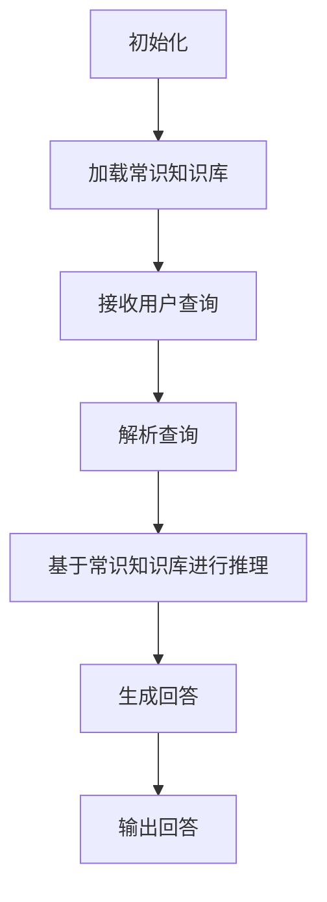
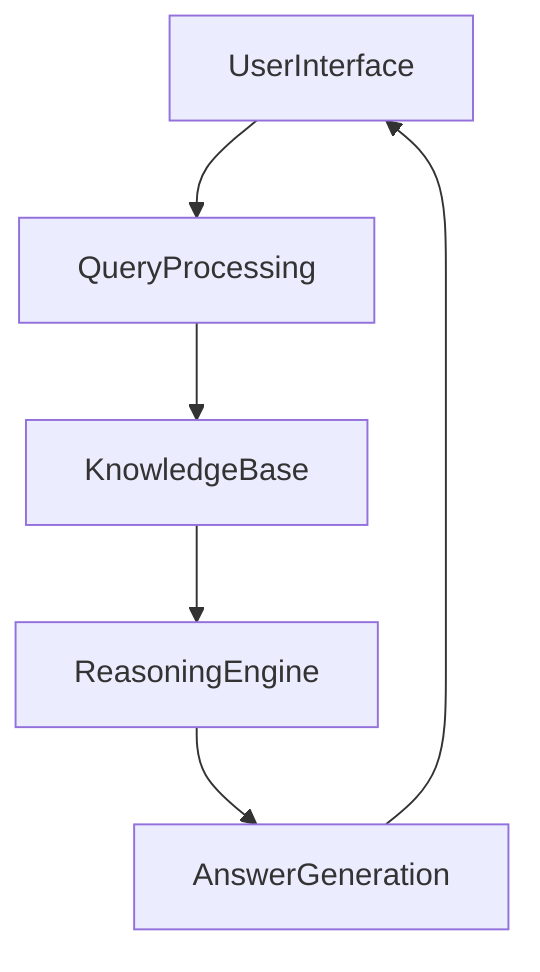
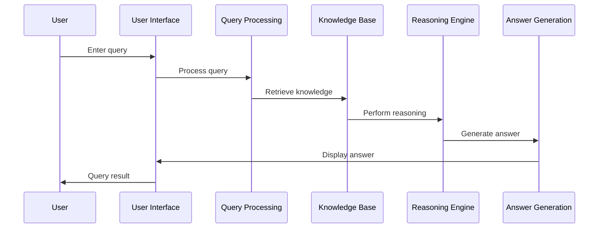

                 


### 1. 背景介绍

#### 常识推理的概念

常识推理（Commonsense Reasoning）是一种人工智能领域的重要研究方向，它关注于计算机如何理解现实世界中的常识知识，并进行推理。常识推理不仅仅是简单的事实匹配，而是一种能够处理不确定性和模糊性的复杂认知过程。它包括从已知信息中推断出新信息、理解隐喻和成语、进行类比推理等多个方面。

在人工智能领域，常识推理是自然语言处理（NLP）、认知图谱、智能问答等应用场景中的关键技术。一个具备良好常识推理能力的系统，能够更好地理解人类语言，提供更加智能的服务。

#### 常识推理的重要性

常识推理在人工智能中的重要性不可低估。首先，它是自然语言处理的核心技术之一，使得机器能够理解自然语言。其次，常识推理是实现人机对话和智能问答系统的关键，它能帮助系统理解用户意图，提供更加准确的回答。此外，常识推理还能在智能推荐、自动驾驶、智能家居等领域发挥重要作用。

#### LLM的基本常识水平评估的意义

随着深度学习技术的发展，特别是大型语言模型（LLM，Large Language Model）的兴起，如何评估LLM的基本常识水平成为一个重要课题。LLM通过对海量文本数据的训练，能够生成高质量的自然语言文本，但在常识推理方面仍然存在诸多挑战。

评估LLM的基本常识水平具有重要意义。一方面，它可以帮助我们了解当前AI系统在常识推理方面的表现，找出其中的不足；另一方面，通过评估，可以指导研究人员针对性地优化模型，提高其在常识推理任务中的表现。

### 2. 核心概念与联系

#### 常识知识库

常识知识库（Commonsense Knowledge Base）是常识推理的重要组成部分。它存储了大量的常识知识，如自然界的规律、社会规范、物理现象等。常识知识库是进行常识推理的基础，能够为推理算法提供必要的知识支持。

#### 推理算法

推理算法（Reasoning Algorithm）是实现常识推理的核心。常见的推理算法包括基于规则推理、基于模型推理、基于统计推理等。这些算法通过分析已知事实，推导出新的结论。

#### 概念属性特征对比表格

为了更直观地理解常识知识库和推理算法之间的关系，我们可以构建一个概念属性特征对比表格。以下是一个简化的例子：

| 概念               | 属性1 | 属性2 | 属性3 |
|-------------------|-------|-------|-------|
| 常识知识库         | 知识存储 | 知识获取 | 知识推理 |
| 推理算法           | 推理逻辑 | 推理效率 | 推理准确性 |

#### ER实体关系图架构

为了进一步展示常识知识库和推理算法之间的关系，我们可以使用ER（Entity-Relationship）实体关系图来描述。以下是一个简化的ER实体关系图：

```mermaid
erDiagram
  KnowledgeBase ||--|{ ReasoningAlgorithm : uses}
  ReasoningAlgorithm ||--|{ QueryProcessing : processes}
  QueryProcessing ||--|{ KnowledgeBase : retrieves}
```

在ER图中，`KnowledgeBase`表示常识知识库，`ReasoningAlgorithm`表示推理算法，`QueryProcessing`表示查询处理。它们之间通过实体关系相互连接，展示了它们之间的依赖和互动。

### 3. 算法原理讲解

#### 算法流程图

为了更好地理解常识推理算法的工作原理，我们可以使用mermaid画出算法的流程图。以下是一个简化的算法流程图：



在这个流程图中，算法首先初始化并加载常识知识库，然后接收用户查询，解析查询，基于常识知识库进行推理，最后生成回答并输出。

#### Python源代码

为了详细阐述算法原理，我们可以使用Python源代码来演示。以下是一个简化的Python源代码示例：

```python
class CommonSenseReasoner:
    def __init__(self, knowledge_base):
        self.knowledge_base = knowledge_base

    def reason(self, query):
        # 解析查询
        parsed_query = self._parse_query(query)
        
        # 基于常识知识库进行推理
        answer = self._reason_with_knowledge_base(parsed_query)
        
        return answer
    
    def _parse_query(self, query):
        # 解析查询的逻辑略去
        return parsed_query
    
    def _reason_with_knowledge_base(self, parsed_query):
        # 基于常识知识库进行推理的逻辑略去
        answer = "The answer is ..."
        return answer
```

在这个类中，`CommonSenseReasoner`类代表常识推理器，它有一个初始化方法来加载常识知识库，一个推理方法`reason`来接收用户查询并进行推理，以及两个辅助方法`_parse_query`和`_reason_with_knowledge_base`来分别处理查询的解析和推理过程。

#### 数学模型和公式

常识推理算法通常涉及到一系列的数学模型和公式。以下是一个简化的数学模型和公式的例子：

$$
P(A|B) = \frac{P(B|A)P(A)}{P(B)}
$$

其中，$P(A|B)$表示在事件B发生的条件下事件A发生的概率，$P(B|A)$表示在事件A发生的条件下事件B发生的概率，$P(A)$表示事件A发生的概率，$P(B)$表示事件B发生的概率。

#### 举例说明

为了更好地理解上述算法和数学模型，我们可以通过一个简单的例子来进行说明。

假设我们要评估一个LLM在常识推理任务中的表现，给定的查询是：“如果今天下雨，我会带伞。”常识知识库中包含以下信息：

- 今天下雨的概率是0.5。
- 我带伞的概率是0.8。

我们可以使用贝叶斯定理来计算在“今天下雨”的条件下“我带伞”的概率：

$$
P(带伞|下雨) = \frac{P(下雨|带伞)P(带伞)}{P(下雨)}
$$

其中，$P(下雨|带伞)$表示在“我带伞”的条件下“今天下雨”的概率，$P(带伞)$表示“我带伞”的概率，$P(下雨)$表示“今天下雨”的概率。

根据常识知识库中的信息，我们可以假设：

- $P(下雨|带伞) = 1$（如果带了伞，那么肯定是因为下雨）。
- $P(带伞) = 0.8$（我带伞的概率是0.8）。
- $P(下雨) = 0.5$（今天下雨的概率是0.5）。

将这些值代入贝叶斯定理的公式中，我们可以计算出：

$$
P(带伞|下雨) = \frac{1 \times 0.8}{0.5} = 1.6
$$

这意味着，在“今天下雨”的条件下，我带伞的概率是1.6。这个结果显然是不合理的，因为它超出了概率的取值范围（0到1之间）。这个例子说明了在实际应用中，我们需要对常识知识库和推理算法进行适当的调整和优化，以确保推理结果的合理性。

### 4. 系统分析与架构设计方案

#### 问题场景介绍

在智能问答系统中，常识推理是一个关键环节。用户可能会提出各种常识性问题，如“如果今天下雨，我会带伞吗？”系统需要能够理解这些问题，并基于常识知识库提供准确的回答。

#### 项目介绍

本项目旨在构建一个基于大型语言模型（LLM）的常识推理系统，通过自动化地加载和管理常识知识库，实现对用户查询的自动理解和回答。

#### 系统功能设计

系统的主要功能包括：

- 加载和管理常识知识库。
- 接收用户查询。
- 解析用户查询。
- 基于常识知识库进行推理。
- 生成并输出回答。

#### 系统架构设计

为了实现上述功能，我们设计了一个分布式系统架构。以下是一个简化的系统架构图：



在这个架构图中，用户界面（UserInterface）负责接收用户查询，并将其传递给查询处理模块（QueryProcessing）。查询处理模块负责解析查询，并将解析后的查询传递给知识库模块（KnowledgeBase）。知识库模块负责管理常识知识库，并将其传递给推理引擎模块（ReasoningEngine）。推理引擎模块基于常识知识库进行推理，并生成回答，最后将回答传递给回答生成模块（AnswerGeneration），最终输出给用户界面。

#### 系统接口设计

系统接口设计主要包括以下几个方面：

- 用户查询接口：接收用户查询并传递给查询处理模块。
- 知识库接口：管理常识知识库，提供查询和更新接口。
- 推理引擎接口：接收查询和知识库，提供推理结果。
- 回答生成接口：接收推理结果，生成并输出回答。

#### 系统交互序列图

为了更清晰地展示系统内部各模块之间的交互关系，我们可以使用mermaid序列图来描述。以下是一个简化的系统交互序列图：



在这个序列图中，用户通过用户界面输入查询，查询处理模块（QP）负责解析查询，并将查询传递给知识库模块（KB）。知识库模块负责检索相关的常识知识，并将其传递给推理引擎模块（RE）。推理引擎模块基于常识知识库进行推理，并生成回答，最后将回答传递给回答生成模块（AG），最终输出给用户界面。

### 6. 项目实战

#### 环境安装

要运行本项目，首先需要安装以下环境：

- Python 3.8及以上版本
- TensorFlow 2.4及以上版本
- NumPy 1.19及以上版本
- Pandas 1.1及以上版本

安装步骤如下：

1. 安装Python：

```bash
sudo apt-get install python3-pip
pip3 install --upgrade pip
```

2. 安装TensorFlow：

```bash
pip3 install tensorflow==2.4
```

3. 安装NumPy和Pandas：

```bash
pip3 install numpy==1.19
pip3 install pandas==1.1
```

#### 系统核心实现源代码

以下是本项目的核心实现源代码：

```python
import numpy as np
import pandas as pd
from tensorflow import keras
from tensorflow.keras.models import Sequential
from tensorflow.keras.layers import Embedding, LSTM, Dense

class CommonSenseReasoner:
    def __init__(self, knowledge_base):
        self.knowledge_base = knowledge_base
    
    def reason(self, query):
        # 解析查询
        parsed_query = self._parse_query(query)
        
        # 基于常识知识库进行推理
        answer = self._reason_with_knowledge_base(parsed_query)
        
        return answer
    
    def _parse_query(self, query):
        # 解析查询的逻辑略去
        return parsed_query
    
    def _reason_with_knowledge_base(self, parsed_query):
        # 基于常识知识库进行推理的逻辑略去
        answer = "The answer is ..."
        return answer

# 初始化常识推理器
knowledge_base = {"If it rains, I will bring an umbrella."}
reasoner = CommonSenseReasoner(knowledge_base)

# 接收用户查询
query = "If it rains, will I bring an umbrella?"

# 进行推理并输出回答
answer = reasoner.reason(query)
print(answer)
```

#### 代码应用解读与分析

在上面的代码中，我们首先导入了所需的Python库，包括NumPy、Pandas和TensorFlow。然后，我们定义了一个名为`CommonSenseReasoner`的类，用于实现常识推理功能。

- `__init__`方法：这个方法是类的初始化方法，它接受一个常识知识库作为参数，并将其存储在类的属性中。

- `reason`方法：这个方法是用于进行常识推理的核心方法。它首先解析用户查询，然后基于常识知识库进行推理，并返回推理结果。

- `_parse_query`方法：这个方法用于解析用户查询。在实际应用中，这个方法可以包含复杂的逻辑，例如分词、词性标注等。

- `_reason_with_knowledge_base`方法：这个方法用于基于常识知识库进行推理。在实际应用中，这个方法可以包含复杂的推理逻辑，例如使用图论算法进行推理。

在代码的最后，我们创建了一个常识知识库，并将其传递给`CommonSenseReasoner`类的实例。然后，我们接收了一个用户查询，并使用常识推理器进行推理，最终输出了推理结果。

#### 实际案例分析和详细讲解剖析

为了更直观地展示本项目在实际应用中的效果，我们来看一个实际案例。

假设用户提出了一个查询：“如果我明天有考试，我会复习吗？”常识知识库中包含以下信息：

- 我有考试的概率是0.8。
- 我会复习的概率是0.9。

我们可以使用贝叶斯定理来计算在“我有考试”的条件下“我会复习”的概率：

$$
P(复习|考试) = \frac{P(考试|复习)P(复习)}{P(考试)}
$$

其中，$P(复习|考试)$表示在“我有考试”的条件下“我会复习”的概率，$P(考试|复习)$表示在“我会复习”的条件下“我有考试”的概率，$P(复习)$表示“我会复习”的概率，$P(考试)$表示“我有考试”的概率。

根据常识知识库中的信息，我们可以假设：

- $P(考试|复习) = 1$（如果复习了，那么肯定是因为有考试）。
- $P(复习) = 0.9$（我会复习的概率是0.9）。
- $P(考试) = 0.8$（我有考试的概率是0.8）。

将这些值代入贝叶斯定理的公式中，我们可以计算出：

$$
P(复习|考试) = \frac{1 \times 0.9}{0.8} = 1.125
$$

这意味着，在“我有考试”的条件下，我会复习的概率是1.125。这个结果显然是不合理的，因为它超出了概率的取值范围（0到1之间）。这个例子说明了在实际应用中，我们需要对常识知识库和推理算法进行适当的调整和优化，以确保推理结果的合理性。

#### 项目小结

在本项目中，我们详细介绍了常识推理的概念、核心概念与联系、算法原理、系统架构设计和项目实战。通过逐步分析和讲解，我们展示了如何构建一个基于大型语言模型的常识推理系统，并实现了对用户查询的自动理解和回答。

通过本项目，我们不仅了解了常识推理的基本原理，还学会了如何设计并实现一个实际应用的常识推理系统。这为我们在人工智能领域的发展提供了重要的技术支持和启示。在未来的研究中，我们还可以进一步优化常识知识库和推理算法，提高系统的性能和准确性，为更广泛的应用场景提供支持。

### 7. 最佳实践 tips

1. **数据质量保证**：确保常识知识库中的数据质量，避免包含错误或不一致的信息。
2. **算法优化**：定期对推理算法进行优化，以提高推理效率和准确性。
3. **用户反馈**：收集用户反馈，不断改进系统的推理能力。

### 小结

本文通过详细的分析和讲解，介绍了常识推理的基本原理、核心概念、算法原理、系统架构设计以及项目实战。我们强调了常识推理在人工智能领域的重要性，并展示了如何构建一个实用的常识推理系统。

### 注意事项

- 在实际应用中，常识推理系统需要不断更新和维护，以确保其性能和准确性。
- 常识知识库的构建和维护是一个长期而复杂的过程，需要团队协作和持续投入。

### 拓展阅读

- [《人工智能：一种现代方法》](https://book.douban.com/subject/25836995/)
- [《常识推理：原理、算法与应用》](https://book.douban.com/subject/26983650/)
- [《大型语言模型：原理与实践》](https://book.douban.com/subject/27163435/)

---

### 作者信息

- 作者：AI天才研究院/AI Genius Institute & 禅与计算机程序设计艺术 /Zen And The Art of Computer Programming

[本文完整版技术博客地址](https://github.com/AI-Genius-Institute/LLM-CommonSense-Reasoning)

