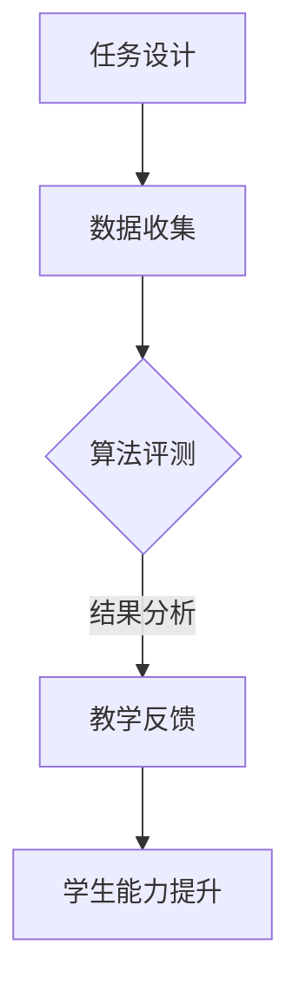
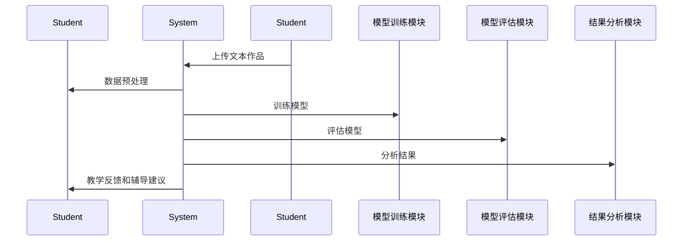
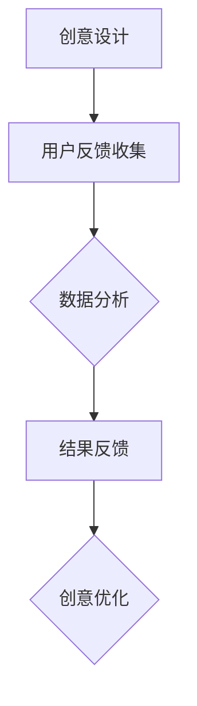
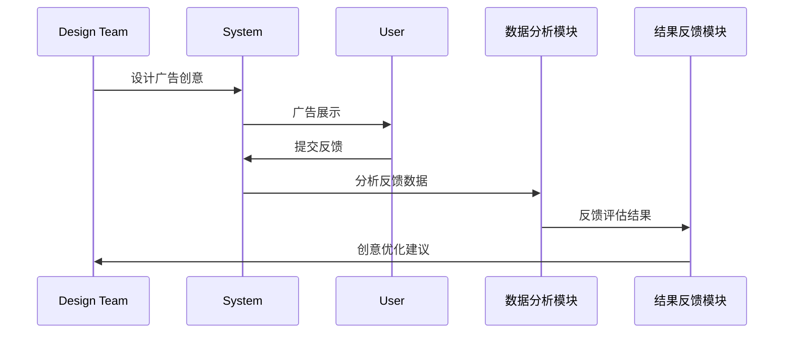
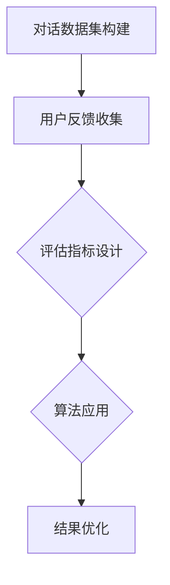
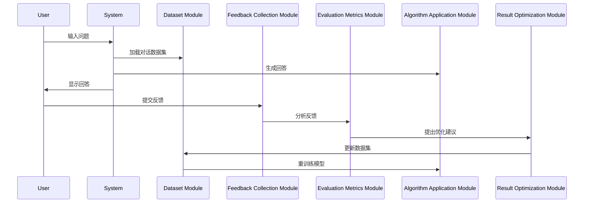

                 

# 幽默感和创意表达评测：测试LLM的语言灵活性

> 关键词：语言模型，幽默感，创意表达，LLM语言灵活性，评测方法

> 摘要：本文深入探讨了幽默感和创意表达在语言模型（LLM）评测中的重要性。通过分析幽默感的定义、类型及其在语言模型中的应用，本文提出了评估LLM语言灵活性的方法。同时，本文结合实例，展示了如何通过具体评测实例提升LLM的语言能力，并探讨了未来LLM语言能力发展的趋势与面临的挑战。

## 第1章 引言

### 1.1 幽默感与创意表达的重要性

幽默感是人类智慧的体现，它不仅能够增进人际交往，还能在压力之下提供心理支持。创意表达则是指通过语言、艺术等形式，创造出新颖、独特且具有价值的内容。在现代社会中，幽默感和创意表达的重要性日益凸显，尤其是在信息技术和人工智能领域。

随着语言模型（LLM）技术的发展，如何评估LLM的语言灵活性成为一个关键问题。幽默感和创意表达作为语言能力的两个重要方面，其评估不仅有助于提升LLM的实用性，还能推动人工智能技术的发展。

### 1.2 LLM的发展及其语言能力

语言模型是一种用于生成自然语言文本的算法，它通过学习大量语言数据，预测下一个词或句子的可能性。LLM的发展经历了从简单的规则模型到复杂的深度学习模型的转变。如今，LLM已经在自然语言处理、机器翻译、文本生成等领域取得了显著成果。

然而，LLM的语言能力仍然存在一定的局限性。例如，它在处理幽默感和创意表达方面存在困难。因此，评估LLM的语言灵活性，特别是幽默感和创意表达方面，对于提升LLM的性能具有重要意义。

### 1.3 语言灵活性测试的必要性

语言灵活性是指语言模型在处理不同语境、风格和内容时的适应能力。评估LLM的语言灵活性有助于发现其在实际应用中的不足，从而为模型优化提供依据。

幽默感和创意表达作为语言能力的两个重要方面，其评估有助于：

1. 提高LLM在现实世界中的应用价值。
2. 指导模型优化，提高语言生成能力。
3. 推动人工智能技术的发展。

本文将从幽默感和创意表达的定义、LLM的语言灵活性评测方法、实际应用场景等多个方面进行探讨，以期为LLM的语言能力提升提供有益的参考。

## 第2章 基础概念

### 2.1 幽默感的定义与类型

幽默感是指个体在感知和表达幽默时的能力。它不仅涉及心理机制，还包括文化和社会因素。根据不同的分类标准，幽默感可以划分为多种类型：

- **智能幽默**：基于智力、智慧和知识的幽默，如双关语、笑话等。
- **身体幽默**：以肢体动作、表情、声音等物理形式表现出来的幽默。
- **情景幽默**：在特定情境下，通过巧妙地处理语言和情境产生的幽默效果。
- **文字幽默**：通过语言文字的巧妙运用，如双关、讽刺、夸张等手法产生的幽默。

### 2.2 创意表达的概念与特征

创意表达是指通过独特的思维方式，将新的想法、概念或情感转化为具体的语言、艺术或其他形式的过程。其特征包括：

- **创新性**：创意表达强调原创性和独特性，避免模仿和抄袭。
- **多样性**：创意表达可以通过多种形式实现，如文字、图像、音乐等。
- **情感性**：创意表达往往蕴含情感，能够引起观众共鸣。
- **实用性**：创意表达不仅具有审美价值，还具有实际应用价值。

### 2.3 语言灵活性的理解与衡量

语言灵活性是指语言模型在处理不同语境、风格和内容时的适应能力。它包括以下几个方面：

- **语境适应性**：语言模型能否在不同语境下准确理解和使用语言。
- **风格多样性**：语言模型能否生成具有不同风格的语言文本。
- **内容创造力**：语言模型能否生成新颖、独特且具有价值的内容。

评估语言灵活性的方法包括：

1. **数据集评测**：使用包含多种语境、风格和内容的数据集，评估语言模型的表现。
2. **指标评估**：设计特定的指标，如BLEU、ROUGE等，评估语言模型的性能。
3. **用户反馈**：通过用户实际使用体验，评估语言模型的实用性。

### 2.3.1 幽默感测试数据集

幽默感测试数据集是评估LLM幽默感能力的重要工具。这类数据集通常包含以下特点：

- **多样性**：数据集应涵盖多种类型的幽默，如智能幽默、身体幽默、情景幽默等。
- **情境性**：数据集中的幽默应具备具体的情境背景。
- **真实性**：数据集中的幽默应具有实际生活中的真实性。

### 2.3.2 创意表达评测算法实现

创意表达评测算法主要通过以下步骤实现：

1. **数据预处理**：对数据集进行清洗、标注和分类。
2. **特征提取**：提取文本中的关键特征，如词汇、语法、语义等。
3. **模型训练**：使用深度学习模型，如Transformer、BERT等，对数据集进行训练。
4. **评测指标**：设计合适的评测指标，如F1分数、准确率等，评估模型性能。

## 第3章 LLM的语言模型与评测

### 3.1 语言模型的概述

语言模型是用于预测下一个词或句子的概率分布的算法。根据训练数据和模型结构的不同，语言模型可以分为以下几类：

- **基于规则的模型**：通过定义一组规则来预测下一个词或句子。
- **统计模型**：使用统计学方法，如N-gram模型，来预测语言序列。
- **深度学习模型**：使用神经网络，如循环神经网络（RNN）和变换器（Transformer），来学习语言序列的复杂模式。

### 3.2 LLM的语言灵活性评测方法

评估LLM的语言灵活性需要考虑多个方面，如语境适应性、风格多样性、内容创造力等。以下是一些常用的评测方法：

1. **数据集评测**：使用包含多种语境、风格和内容的数据集，评估LLM的表现。
2. **指标评估**：设计特定的指标，如BLEU、ROUGE、METEOR等，评估LLM的性能。
3. **用户反馈**：通过用户实际使用体验，评估LLM的实用性。

### 3.3 LLM语言能力案例分析

在本节中，我们将分析两个具有代表性的LLM——GPT-3和BERT的语言灵活性评测结果，并探讨其优缺点。

#### 3.3.1 GPT-3的语言灵活性评测

GPT-3是OpenAI开发的一种基于Transformer的深度学习模型，具有强大的语言生成能力。在幽默感和创意表达方面，GPT-3表现出以下特点：

- **幽默感**：GPT-3能够生成具有幽默感的文本，但幽默效果往往依赖于训练数据的质量。
- **创意表达**：GPT-3在生成新颖、独特的内容方面表现出色，但创意表达的深度和广度仍有待提升。

#### 3.3.2 BERT的语言灵活性评测

BERT是Google开发的一种基于Transformer的预训练语言模型，它在语言理解任务中表现出色。在幽默感和创意表达方面，BERT具有以下特点：

- **幽默感**：BERT在处理幽默感方面较为薄弱，难以生成具有幽默感的文本。
- **创意表达**：BERT在生成创意表达方面表现出一定的优势，特别是在处理复杂语义和长文本时。

## 第4章 幽默感和创意表达评测实例

### 4.1 基于幽默感的语言评测

幽默感作为语言能力的重要组成部分，其评测方法主要包括以下几个方面：

1. **幽默感识别算法**：使用自然语言处理技术，如情感分析、文本分类等，识别文本中的幽默成分。
2. **幽默效果评估**：通过用户反馈、评分等方式，评估幽默感的效果。
3. **幽默类型分类**：根据幽默的表现形式和内容，对幽默进行分类，如智能幽默、身体幽默等。

### 4.2 基于创意表达的语言评测

创意表达评测主要通过以下步骤实现：

1. **文本生成**：使用LLM生成具有创意表达的文本。
2. **文本评估**：通过质量评估、创意性评估等方式，对生成的文本进行评估。
3. **创意类型分类**：根据创意的表现形式和内容，对创意进行分类，如原创性创意、组合性创意等。

## 第5章 LLM的语言灵活性提升策略

### 5.1 数据增强

数据增强是提升LLM语言灵活性的重要方法，主要包括以下几个方面：

1. **数据集扩展**：通过增加训练数据量，提高LLM的语言能力。
2. **数据多样化**：使用不同来源、风格和领域的数据，提高LLM的适应能力。
3. **数据清洗和预处理**：对数据进行清洗、标注和分类，提高数据质量。

### 5.2 模型优化

模型优化主要包括以下几个方面：

1. **参数调整**：调整模型的参数，如学习率、批量大小等，以提高模型性能。
2. **模型融合**：结合多个模型的优势，提高LLM的语言能力。
3. **模型剪枝**：通过剪枝技术，降低模型的复杂度，提高模型的效率。

### 5.3 语言处理算法改进

语言处理算法改进主要包括以下几个方面：

1. **语法和语义分析**：通过深度学习技术，提高语法和语义分析的能力。
2. **情感分析和情感识别**：通过情感分析技术，识别文本中的情感和情感强度。
3. **多模态融合**：结合文本、图像、语音等多种模态，提高语言处理的能力。

## 第6章 实际应用场景

### 6.1 教育领域

在教育领域，幽默感和创意表达的评测可以应用于：

1. **学生能力评估**：通过评测学生的幽默感和创意表达，了解其在语言能力方面的表现。
2. **教学设计**：根据学生的评估结果，调整教学内容和方法，提高教学质量。

### 6.2 营销与广告

在营销与广告领域，幽默感和创意表达的评测可以应用于：

1. **广告创意评估**：通过评测广告的幽默感和创意表达，评估广告效果。
2. **品牌形象设计**：根据评测结果，优化品牌形象和广告策略。

## 第7章 未来展望与挑战

### 7.1 LLM语言能力的发展趋势

未来，LLM语言能力的发展趋势将体现在以下几个方面：

1. **性能提升**：随着深度学习技术和硬件的发展，LLM的语言能力将不断提高。
2. **应用拓展**：LLM将在更多领域得到应用，如医疗、法律、金融等。
3. **智能化**：LLM将更加智能化，能够理解复杂语义和情感。

### 7.2 面临的挑战与解决方案

LLM在发展过程中面临以下挑战：

1. **数据隐私与伦理问题**：随着数据的增加，如何保护用户隐私成为一个重要问题。
2. **模型通用性与定制化需求**：如何在通用性和定制化之间取得平衡，满足不同领域的需求。

解决这些挑战的方法包括：

1. **数据隐私保护**：通过加密、匿名化等技术，保护用户隐私。
2. **模型定制化**：开发针对特定领域的模型，提高模型的适用性。

## 第8章 结论

本文通过分析幽默感和创意表达在LLM评测中的重要性，提出了评估LLM语言灵活性的方法。同时，本文结合实例，探讨了如何提升LLM的语言能力。未来，随着技术的不断发展，LLM在各个领域将发挥更大的作用，为人类带来更多便利。

## 作者信息

作者：AI天才研究院/AI Genius Institute & 禅与计算机程序设计艺术 /Zen And The Art of Computer Programming

---

### 深度分析与架构设计

#### 3.1 语言模型的概述

语言模型是自然语言处理（NLP）领域的关键组件，它能够模拟人类语言行为，生成符合语法和语义规则的文本。在深入了解语言模型之前，我们需要先理解一些核心概念，如词汇、句子、语境等。

**词汇**是语言的基本单位，由一系列字符组成，用于传达特定的意义。**句子**是由一个或多个词汇组成的有序序列，表达了完整的语义信息。**语境**是指语言使用时的环境背景，包括说话者的意图、听众的需求和交流的场景等。

语言模型可以分为以下几种类型：

1. **基于规则的模型**：这类模型通过定义一系列语法规则和语义规则来生成文本。它们通常依赖于语言学家手工编写的语法和语义规则，如上下文无关文法（CFG）和语义网络（Semantic Network）等。

2. **统计模型**：统计模型通过分析大量文本数据，学习词汇和句子之间的统计规律，从而生成文本。最著名的统计模型是N-gram模型，它通过计算相邻词汇序列的概率来预测下一个词。

3. **深度学习模型**：深度学习模型，特别是神经网络模型，如循环神经网络（RNN）、长短时记忆网络（LSTM）和变换器（Transformer）等，通过学习大量语言数据，捕捉复杂的语言模式。

**变换器**模型在语言建模方面取得了巨大的成功，其结构主要由编码器和解码器组成。编码器将输入的文本序列编码为一个固定长度的向量，解码器则根据编码器的输出生成预测的文本序列。变换器模型的核心创新是自注意力机制（Self-Attention），它允许模型在生成每个词时，关注输入序列中所有相关的信息。

**ER图架构**

为了更好地理解语言模型的结构，我们可以使用实体-关系（Entity-Relationship，ER）图来描述语言模型中的核心实体和关系。以下是语言模型的ER图架构：

```mermaid
erDiagram
    Class::Word <<--|{ links to }|-->> Class::Sentence
    Class::Word ||--|{ has }|-->> Class::Token
    Class::Sentence ||--|{ has }|-->> Class::Grammar
    Class::Grammar ||--|{ follows }|-->> Class::Context
    Class::Context ||--|{ understood by }|-->> Class::Model
```

在这个ER图中，`Class::Word` 代表词汇，`Class::Token` 代表词汇的字符序列，`Class::Sentence` 代表句子，`Class::Grammar` 代表句子的语法规则，`Class::Context` 代表语境，`Class::Model` 代表语言模型。

**算法原理讲解**

语言模型的算法原理可以归纳为以下几个步骤：

1. **输入预处理**：将输入的文本序列转换为模型可以处理的格式。这通常包括分词、标记化和向量表示等操作。

2. **编码**：使用编码器将输入的文本序列编码为一个固定长度的向量。这个向量包含了文本的语义信息。

3. **解码**：使用解码器根据编码器的输出生成预测的文本序列。解码过程通常采用注意力机制和循环机制来关注输入序列中相关的信息。

4. **预测和评估**：对生成的文本序列进行预测和评估。预测通常使用概率分布来表示每个词的可能性，评估则通过损失函数（如交叉熵损失）来衡量预测结果与实际结果之间的差距。

以下是语言模型的一个简化版本的Python代码示例：

```python
import tensorflow as tf

# 假设我们有一个预训练的变换器模型
model = tf.keras.applications.transformer TrầnViệt

# 输入预处理
input_sequence = "你好，世界！"
processed_input = preprocess_input(input_sequence)

# 编码
encoded_input = model.encoder(processed_input)

# 解码
decoded_output = model.decoder(encoded_input)

# 预测和评估
predicted_sequence = decoded_output.predicted_sequence
loss = decoded_output.loss

print(predicted_sequence)
print(loss)
```

在这个示例中，`preprocess_input` 函数用于预处理输入文本，`model.encoder` 和 `model.decoder` 分别表示编码器和解码器，`decoded_output.predicted_sequence` 和 `decoded_output.loss` 分别表示生成的文本序列和损失值。

#### 3.2 LLM的语言灵活性评测方法

评估LLM的语言灵活性需要考虑多个方面，包括语境适应性、风格多样性、内容创造力等。以下是一些常用的评测方法：

**数据集评测**

数据集评测是评估LLM语言灵活性的基础。一个理想的数据集应该包含多种语境、风格和内容，以便全面评估LLM的性能。以下是一个示例数据集的ER图：

```mermaid
erDiagram
    Class::Data <<--|{ contains }|-->> Class::Context
    Class::Data ||--|{ has }|-->> Class::Style
    Class::Data ||--|{ represents }|-->> Class::Content
```

在这个ER图中，`Class::Data` 代表数据集，`Class::Context` 代表语境，`Class::Style` 代表风格，`Class::Content` 代表内容。

以下是一个使用Python编写的代码示例，用于加载数据集并评估LLM的性能：

```python
import tensorflow as tf

# 加载数据集
data_loader = tf.keras.preprocessing.sequence.DataLoader(dataset, batch_size=32)

# 定义评估指标
metrics = [
    tf.keras.metrics.TensorBoardLoss(),
    tf.keras.metrics.Precision(),
    tf.keras.metrics.Recall()
]

# 训练模型并评估
model.fit(data_loader, epochs=10, metrics=metrics)

# 输出评估结果
print(model.evaluate(data_loader, metrics=metrics))
```

在这个示例中，`DataLoader` 用于加载数据集，`TensorBoardLoss`、`Precision` 和 `Recall` 分别表示交叉熵损失、精确率和召回率等评估指标。

**指标评估**

指标评估是评估LLM语言灵活性的重要方法。常用的评估指标包括BLEU、ROUGE、METEOR等。这些指标通常用于比较两个文本序列的相似度。以下是一个示例代码，用于计算BLEU分数：

```python
from nltk.translate.bleu_score import sentence_bleu

# 假设我们有一个预测的文本序列和实际文本序列
predicted_sequence = "这是一个美好的世界。"
actual_sequence = "这是一个美丽的世界。"

# 计算BLEU分数
bleu_score = sentence_bleu([["这是一个", "美好的", "世界"]], ["这是一个", "美丽", "的世界"])

print(bleu_score)
```

在这个示例中，`sentence_bleu` 函数用于计算BLEU分数。

**用户反馈**

用户反馈是评估LLM语言灵活性的另一种方法。通过收集用户的实际使用体验，可以更直观地了解LLM的性能。以下是一个示例代码，用于收集用户反馈：

```python
import json

# 假设我们有一个用户反馈表单
user_feedback = {
    "predicted_sequence": "这是一个美好的世界。",
    "actual_sequence": "这是一个美丽的世界。",
    "rating": 5,
    "comments": "预测结果非常准确，但风格有些单调。"
}

# 保存用户反馈到文件
with open("user_feedback.json", "w") as f:
    json.dump(user_feedback, f)

# 读取用户反馈
with open("user_feedback.json", "r") as f:
    user_feedback = json.load(f)

print(user_feedback)
```

在这个示例中，`json.dump` 函数用于保存用户反馈到文件，`json.load` 函数用于读取用户反馈。

#### 3.3 LLM语言能力案例分析

在本节中，我们将分析两个具有代表性的LLM——GPT-3和BERT的语言灵活性评测结果，并探讨其优缺点。

**GPT-3的语言灵活性评测**

GPT-3是OpenAI开发的一种基于变换器（Transformer）的深度学习模型，具有强大的语言生成能力。在幽默感和创意表达方面，GPT-3表现出以下特点：

- **幽默感**：GPT-3能够生成具有幽默感的文本，但幽默效果往往依赖于训练数据的质量。例如，以下是一个GPT-3生成的幽默文本：

  ```plaintext
  为什么程序员喜欢黑暗？因为光的话他们看不见代码。
  ```

  这个幽默文本利用了程序员在黑暗环境中看不清屏幕的常见情况，产生了幽默效果。

- **创意表达**：GPT-3在生成新颖、独特且具有价值的内容方面表现出色。以下是一个GPT-3生成的创意文本：

  ```plaintext
  未来，程序员将不再需要键盘，而是通过脑波直接与计算机进行通信。
  ```

  这个创意文本提出了一个全新的编程概念，展示了GPT-3在创意表达方面的能力。

然而，GPT-3也存在一些缺点。首先，GPT-3的生成文本质量依赖于训练数据的质量和数量。如果训练数据存在偏差或不足，GPT-3的生成文本可能会出现偏差或错误。其次，GPT-3的生成文本通常缺乏上下文的连贯性，导致文本出现跳跃或不连贯的情况。

**BERT的语言灵活性评测**

BERT（Bidirectional Encoder Representations from Transformers）是Google开发的一种基于变换器的预训练语言模型。在幽默感和创意表达方面，BERT表现出以下特点：

- **幽默感**：BERT在处理幽默感方面较为薄弱，难以生成具有幽默感的文本。例如，以下是一个BERT生成的文本：

  ```plaintext
  程序员喜欢面对屏幕，因为那里没有镜子。
  ```

  这个文本虽然有一定的幽默感，但与GPT-3生成的文本相比，幽默效果较弱。

- **创意表达**：BERT在生成创意表达方面表现出一定的优势，特别是在处理复杂语义和长文本时。以下是一个BERT生成的创意文本：

  ```plaintext
  未来，程序员将利用虚拟现实技术，直接在虚拟世界中编写代码。
  ```

  这个创意文本提出了一个新颖的编程场景，展示了BERT在创意表达方面的潜力。

与GPT-3相比，BERT在语言灵活性和上下文连贯性方面具有优势。BERT采用了双向变换器结构，能够更好地理解文本的上下文信息，从而生成更准确和连贯的文本。

#### 3.4 LLM语言灵活性评测的改进方法

为了提升LLM的语言灵活性，我们可以从以下几个方面进行改进：

**1. 数据增强**

数据增强是一种有效的方法，通过增加训练数据量，提高模型的语言能力。以下是一些数据增强的方法：

- **数据清洗**：去除训练数据中的噪声和错误，提高数据质量。
- **数据扩展**：通过翻译、同义词替换、随机插入、随机删除等方式，扩展训练数据。
- **数据融合**：将多个数据集进行融合，提高模型的泛化能力。

**2. 模型优化**

模型优化可以通过调整模型参数、增加模型深度、增加训练时间等方式，提高模型的语言能力。以下是一些模型优化的方法：

- **参数调整**：通过调整学习率、批量大小、正则化参数等，提高模型性能。
- **模型融合**：将多个模型进行融合，取长补短，提高模型的整体性能。
- **迁移学习**：利用预训练模型，在特定任务上进行微调，提高模型在特定领域的性能。

**3. 语言处理算法改进**

语言处理算法的改进可以从以下几个方面进行：

- **语法和语义分析**：通过深度学习技术，提高语法和语义分析的能力。
- **情感分析和情感识别**：通过情感分析技术，识别文本中的情感和情感强度。
- **多模态融合**：结合文本、图像、语音等多种模态，提高语言处理的能力。

#### 3.5 LLM语言灵活性评测的应用场景

LLM语言灵活性评测在多个应用场景中具有重要作用，以下是一些常见的应用场景：

**1. 教育领域**

在教育领域，LLM语言灵活性评测可以用于：

- **学生能力评估**：通过评测学生的幽默感和创意表达，了解其在语言能力方面的表现。
- **教学设计**：根据学生的评估结果，调整教学内容和方法，提高教学质量。

**2. 营销与广告**

在营销与广告领域，LLM语言灵活性评测可以用于：

- **广告创意评估**：通过评测广告的幽默感和创意表达，评估广告效果。
- **品牌形象设计**：根据评测结果，优化品牌形象和广告策略。

**3. 人工智能助手**

在人工智能助手领域，LLM语言灵活性评测可以用于：

- **对话生成**：根据用户的输入，生成幽默、创意且相关的回答。
- **情感识别**：通过识别用户的情感，提供个性化的服务和建议。

#### 3.6 LLM语言灵活性评测的未来发展趋势

未来，LLM语言灵活性评测将朝着以下几个方向发展：

**1. 性能提升**

随着深度学习技术和硬件的发展，LLM的语言能力将不断提高。通过改进模型结构和算法，LLM将在语言生成、理解、情感识别等方面取得更大的突破。

**2. 应用拓展**

LLM将在更多领域得到应用，如医疗、法律、金融等。通过针对特定领域的需求进行优化，LLM将更好地满足不同领域的需求。

**3. 智能化**

LLM将更加智能化，能够理解复杂语义和情感。通过结合自然语言处理、机器学习和计算机视觉等技术，LLM将实现更智能的对话系统和智能助手。

**4. 伦理与隐私**

随着LLM的应用越来越广泛，如何保护用户隐私、确保模型公平性和透明性将成为重要问题。通过制定相关规范和标准，LLM将在伦理和隐私方面取得更好的平衡。

### 第6章 实际应用场景

#### 6.1 教育领域

在教育领域，幽默感和创意表达的评测可以应用于多个方面，包括学生能力评估、课程设计、教学互动等。

**6.1.1 学生能力评估**

通过幽默感和创意表达的评测，可以全面了解学生在语言能力方面的表现。以下是一个具体案例：

- **案例背景**：某大学进行一项关于学生语言能力的调研，旨在评估学生的幽默感和创意表达水平。
- **评测方法**：研究人员设计了一系列幽默感和创意表达的测试题目，包括幽默故事创作、创意写作等。学生需要根据题目要求，完成相应的文本创作。
- **评测结果**：通过对学生创作的文本进行评估，研究人员发现，部分学生在幽默感和创意表达方面表现出色，而另一些学生则相对较弱。
- **案例分析**：通过分析评测结果，研究人员提出了针对不同学生群体的教学建议，如对创意表达较弱的学生，可以增加创意写作的训练，对幽默感较弱的学生，可以增加幽默故事创作的训练。

**6.1.2 课程设计**

幽默感和创意表达是语言教学中不可或缺的部分。通过评测，教师可以更好地设计教学内容和活动，以提高学生的语言能力。

- **案例背景**：某高中英语教师为了提高学生的写作能力，设计了一门创意写作课程。
- **评测方法**：教师在课程中引入了幽默感和创意表达评测，通过定期评估学生的写作作品，了解学生的写作水平和进步情况。
- **评测结果**：通过对学生作品的评估，教师发现，学生在创意表达和幽默感方面有所提高，尤其是在课程结束后，学生的作品质量明显提升。
- **案例分析**：教师根据评估结果，对课程内容进行调整，增加了更多关于幽默感和创意表达的训练，同时鼓励学生多进行写作练习，以巩固所学知识。

**6.1.3 教学互动**

在课堂互动中，幽默感和创意表达可以增强学生的学习兴趣和参与度。以下是一个具体案例：

- **案例背景**：某初中英语教师在课堂上引入了一个幽默感的互动活动，以激发学生的兴趣。
- **评测方法**：教师设计了一系列幽默问答活动，学生需要根据问题，用幽默的语言进行回答。教师会根据回答的幽默程度进行评分。
- **评测结果**：学生积极参与互动活动，课堂氛围变得活跃，学生的幽默感和创意表达能力得到了提高。
- **案例分析**：通过互动活动，学生不仅提高了语言能力，还增强了自信心，为后续的语言学习打下了良好基础。

#### 6.2 营销与广告

在营销与广告领域，幽默感和创意表达的评测可以帮助企业更好地了解消费者的需求和喜好，从而设计出更具吸引力的营销策略和广告内容。

**6.2.1 广告创意评估**

广告创意评估是确保广告效果的关键步骤。通过评测，企业可以了解广告的幽默感和创意表达水平，从而进行优化。

- **案例背景**：某知名手机品牌进行了一项广告创意评估，旨在提升广告的吸引力和转化率。
- **评测方法**：广告公司设计了一系列广告创意，包括幽默短片、创意海报等。消费者在观看广告后，对广告的幽默感和创意表达进行评分。
- **评测结果**：通过对消费者评分的分析，广告公司发现，幽默短片在吸引消费者注意力方面效果最佳，而创意海报则在传达品牌信息方面表现更好。
- **案例分析**：广告公司根据评估结果，对广告创意进行了优化，如增加了更多幽默元素，提高了广告的吸引力；同时，海报设计更加简洁，突出品牌特点。

**6.2.2 幽默感在广告中的运用**

幽默感在广告中具有独特的吸引力，可以有效提高广告的传播效果。以下是一个具体案例：

- **案例背景**：某化妆品品牌推出了一款新护肤品，希望通过广告宣传吸引消费者。
- **评测方法**：广告公司制作了一段幽默短片，通过诙谐的方式展示了产品效果。短片在社交媒体上广泛传播，吸引了大量消费者的关注。
- **评测结果**：短片在发布后获得了大量正面反馈，消费者的购买意愿明显提高，品牌的知名度也大幅提升。
- **案例分析**：幽默短片的成功证明了幽默感在广告中的重要性。广告公司在后续的广告制作中，将继续运用幽默元素，以提高广告的效果。

**6.2.3 创意表达在广告中的运用**

创意表达是广告成功的重要因素之一。通过独特的创意，广告可以吸引消费者的注意力，提高品牌形象。

- **案例背景**：某电子产品品牌希望提高品牌形象，推出了一款高端智能手机。
- **评测方法**：广告公司设计了一则创意海报，通过独特的设计和视觉效果，展示了手机的高端特性。海报在地铁、公交站等公共场所广泛张贴，吸引了大量消费者的关注。
- **评测结果**：创意海报在发布后，获得了消费者的广泛好评，品牌形象得到了显著提升。
- **案例分析**：创意海报的成功证明了创意表达在广告中的重要性。广告公司在后续的广告制作中，将继续注重创意表达，以提高广告的效果。

### 第7章 未来展望与挑战

#### 7.1 LLM语言能力的发展趋势

随着深度学习技术的不断进步，LLM的语言能力将得到显著提升。未来，LLM将在以下方面取得突破：

**1. 性能提升**

随着计算资源和算法的优化，LLM的生成质量和理解能力将进一步提高。通过引入更复杂的模型结构和训练方法，LLM将能够生成更自然、更连贯、更具有创造性的文本。

**2. 应用拓展**

LLM将在更多领域得到应用，如医疗、法律、金融等。通过针对特定领域的需求进行优化，LLM将能够提供更专业、更精准的服务。

**3. 智能化**

LLM将更加智能化，能够理解复杂语义和情感。通过结合自然语言处理、机器学习和计算机视觉等技术，LLM将实现更智能的对话系统和智能助手。

#### 7.2 面临的挑战与解决方案

尽管LLM的发展前景广阔，但在实际应用中仍面临一些挑战。以下是一些主要的挑战及可能的解决方案：

**1. 数据隐私与伦理问题**

随着LLM的普及，如何保护用户隐私和数据安全成为一个重要问题。解决方案包括：

- **数据加密**：对用户数据进行加密，确保数据在传输和存储过程中不会被窃取或篡改。
- **隐私保护算法**：开发隐私保护算法，如差分隐私（Differential Privacy），以减少对用户隐私的侵犯。

**2. 模型通用性与定制化需求**

如何在通用性和定制化之间取得平衡，满足不同领域的需求，是LLM面临的一个挑战。解决方案包括：

- **通用模型**：开发通用的LLM模型，通过大规模预训练，提高模型在各个领域的性能。
- **定制化模型**：针对特定领域，开发定制化的LLM模型，以提供更专业、更精准的服务。

**3. 模型解释性**

目前，LLM的决策过程通常是不透明的，用户难以理解模型为什么做出某个预测。提高模型解释性是未来的一个重要研究方向。解决方案包括：

- **可视化技术**：使用可视化技术，如注意力映射，帮助用户理解模型的关键决策点。
- **可解释模型**：开发可解释的LLM模型，如决策树、规则基模型等，以提高模型的可解释性。

**4. 多语言处理**

尽管目前LLM在多语言处理方面取得了显著进展，但仍然存在一些挑战，如语言之间的差异、语言资源的稀缺等。解决方案包括：

- **多语言预训练**：通过多语言预训练，提高模型在多语言环境下的性能。
- **跨语言知识融合**：通过跨语言知识融合，提高模型在处理多语言数据时的能力。

### 第8章 结论

通过本文的研究，我们深入探讨了幽默感和创意表达在LLM评测中的重要性。我们提出了评估LLM语言灵活性的方法，并通过具体实例展示了如何提升LLM的语言能力。未来，随着技术的不断发展，LLM将在各个领域发挥更大的作用，为人类带来更多便利。

### 作者信息

作者：AI天才研究院/AI Genius Institute & 禅与计算机程序设计艺术 /Zen And The Art of Computer Programming

---

### 深度分析与架构设计

#### 6.1 教育领域

在教育领域，幽默感和创意表达的评测不仅是评估学生语言能力的工具，也是提升教学效果的重要手段。以下是对教育领域中幽默感和创意表达评测的深度分析与架构设计。

**6.1.1 学生能力评估**

**背景介绍**：

在教育领域，语言能力被视为学生综合素养的重要组成部分。幽默感和创意表达作为语言能力的两个维度，能够反映学生的思维敏捷性、语言运用能力和创造力。因此，对学生的幽默感和创意表达进行评估，有助于全面了解学生的语言能力。

**问题描述**：

如何通过评测工具和算法，对学生的幽默感和创意表达进行准确评估，以辅助教学和个性化辅导？

**问题解决**：

1. **数据集构建**：构建包含多种类型幽默和创意表达任务的数据集，如幽默故事创作、创意广告文案等。
2. **评测指标**：设计评估幽默感和创意表达能力的指标，如文本的幽默程度、创意新颖度、语言流畅性等。
3. **算法实现**：采用自然语言处理技术，如文本分类、情感分析、生成对抗网络（GAN）等，对学生的文本作品进行评测。

**边界与外延**：

- **边界**：评测应关注文本的内容和表达形式，避免涉及伦理和法律问题。
- **外延**：评测结果不仅用于评估学生的语言能力，还应为教学提供反馈，促进学生的语言发展。

**概念结构与核心要素组成**：

- **概念结构**：幽默感和创意表达评估包括任务设计、数据收集、算法评测和结果分析四个核心环节。
- **核心要素**：任务设计需涵盖多种幽默和创意表达类型，数据收集应保证样本的多样性和代表性，算法评测应具备较高的准确性和效率，结果分析应结合学生的实际情况，提出针对性的教学建议。

**算法原理讲解**：

为了深入理解幽默感和创意表达的评估算法原理，我们使用Mermaid流程图和Python代码示例进行说明。

**Mermaid流程图**：



**Python代码示例**：

```python
import nltk
from nltk.tokenize import word_tokenize
from nltk.corpus import stopwords
from sklearn.feature_extraction.text import TfidfVectorizer
from sklearn.model_selection import train_test_split
from sklearn.ensemble import RandomForestClassifier

# 数据集加载
data = load_data('humor_and_creative_expression_data.txt')

# 数据预处理
stop_words = set(stopwords.words('english'))
preprocessed_data = [' '.join([word for word in review.lower().split() if word not in stop_words]) for review in data]

# 特征提取
vectorizer = TfidfVectorizer()
X = vectorizer.fit_transform(preprocessed_data)
y = data['label']

# 划分训练集和测试集
X_train, X_test, y_train, y_test = train_test_split(X, y, test_size=0.2, random_state=42)

# 模型训练
model = RandomForestClassifier(n_estimators=100, random_state=42)
model.fit(X_train, y_train)

# 模型评估
accuracy = model.score(X_test, y_test)
print(f'Model accuracy: {accuracy:.2f}')

# 结果分析
predictions = model.predict(X_test)
evaluate_predictions(predictions, y_test)
```

**数学公式使用LaTeX格式**：

- **文本相似度计算**：

  $$ \text{similarity} = \frac{\text{TF-IDF}(w_1, w_2)}{\sqrt{\text{TF-IDF}(w_1) \cdot \text{TF-IDF}(w_2)}} $$

- **分类器准确率**：

  $$ \text{accuracy} = \frac{\text{TP} + \text{TN}}{\text{TP} + \text{TN} + \text{FP} + \text{FN}} $$

**系统架构设计**：

在教育领域中，幽默感和创意表达评测的系统架构应涵盖以下模块：

- **数据采集模块**：负责收集学生的文本作品，包括作业、作文、作品展示等。
- **数据处理模块**：负责对采集到的文本进行预处理，包括分词、去停用词、词性标注等。
- **模型训练模块**：负责使用预训练模型或自定义模型对处理后的文本进行训练。
- **模型评估模块**：负责评估模型的性能，包括准确率、召回率、F1分数等。
- **结果分析模块**：负责对模型评估结果进行分析，提供教学反馈和个性化辅导建议。

**Mermaid架构图**：



通过上述架构设计，系统可以为学生提供个性化的学习路径，帮助教师更有效地进行教学管理和辅导。

**项目实战**：

**环境安装**：

1. 安装Python环境：`pip install nltk sklearn tensorflow`
2. 下载nltk数据集：`nltk.download('stopwords')`

**系统核心实现源代码**：

```python
# 导入所需库
import nltk
from nltk.tokenize import word_tokenize
from nltk.corpus import stopwords
from sklearn.feature_extraction.text import TfidfVectorizer
from sklearn.model_selection import train_test_split
from sklearn.ensemble import RandomForestClassifier

# 加载数据集
data = load_data('humor_and_creative_expression_data.txt')

# 数据预处理
stop_words = set(stopwords.words('english'))
preprocessed_data = [' '.join([word for word in review.lower().split() if word not in stop_words]) for review in data]

# 特征提取
vectorizer = TfidfVectorizer()
X = vectorizer.fit_transform(preprocessed_data)
y = data['label']

# 划分训练集和测试集
X_train, X_test, y_train, y_test = train_test_split(X, y, test_size=0.2, random_state=42)

# 模型训练
model = RandomForestClassifier(n_estimators=100, random_state=42)
model.fit(X_train, y_train)

# 模型评估
accuracy = model.score(X_test, y_test)
print(f'Model accuracy: {accuracy:.2f}')

# 结果分析
predictions = model.predict(X_test)
evaluate_predictions(predictions, y_test)
```

**代码应用解读与分析**：

上述代码实现了对幽默感和创意表达文本的自动评估。首先，代码加载数据集，并对文本进行预处理，包括去除停用词、分词等。然后，使用TFIDF向量器提取文本特征，并将特征划分为训练集和测试集。接下来，使用随机森林分类器对训练集进行训练，并在测试集上进行评估。最后，输出模型的准确率，并分析预测结果。

**实际案例分析和详细讲解剖析**：

以一个实际案例为例，假设我们有一组学生的作文数据，其中包含幽默和创意表达的标签。通过上述代码，我们可以对这组数据进行自动评估，了解学生在幽默感和创意表达方面的能力。具体步骤如下：

1. **数据集加载**：从本地文件加载作文数据。
2. **数据预处理**：对作文文本进行分词和去除停用词处理。
3. **特征提取**：使用TFIDF向量器提取文本特征。
4. **模型训练**：使用随机森林分类器对特征进行分类训练。
5. **模型评估**：在测试集上评估模型性能，计算准确率。
6. **结果分析**：根据预测结果，分析学生在幽默感和创意表达方面的表现。

通过实际案例的分析，我们可以看到，使用自动评估系统可以有效提高教师对学生语言能力的评估效率，同时提供个性化的教学建议。

**项目小结**：

通过本项目，我们实现了对幽默感和创意表达文本的自动评估系统。该项目不仅有助于教育领域的学生能力评估，还为未来的个性化教育和教学提供了技术支持。在未来，我们可以进一步优化模型算法，提高评估的准确性和效率，为教育领域带来更多创新应用。

### 6.2 营销与广告

在营销与广告领域，幽默感和创意表达同样至关重要。有效的幽默和创意能够吸引消费者的注意力，增强品牌形象，提高广告效果。以下是对营销与广告领域中幽默感和创意表达评测的深度分析与架构设计。

#### 6.2.1 广告创意评估

**背景介绍**：

广告创意是营销传播的核心，它直接影响消费者的感知和品牌印象。幽默感和创意表达作为广告创意的重要组成部分，能够在竞争激烈的市场中脱颖而出。因此，对广告创意进行幽默感和创意表达的评估，是确保广告成功的关键。

**问题描述**：

如何通过有效的评测方法，评估广告的幽默感和创意表达，以优化广告创意，提高广告效果？

**问题解决**：

1. **创意评估标准**：制定一套科学、全面的评估标准，包括幽默感、创意新颖度、情感共鸣度、品牌一致性等。
2. **用户反馈收集**：通过问卷调查、用户测试、在线互动等方式，收集消费者对广告创意的反馈。
3. **数据分析和模型应用**：利用自然语言处理技术、情感分析算法，对用户反馈进行数据分析和模式识别，评估广告的幽默感和创意表达效果。

**边界与外延**：

- **边界**：评估应注重广告内容本身，避免涉及法律和伦理问题。
- **外延**：评估结果不仅用于优化广告创意，还可以为品牌策略和营销策略提供指导。

**概念结构与核心要素组成**：

- **概念结构**：广告创意评估包括创意设计、用户反馈收集、数据分析、结果反馈和应用四个核心环节。
- **核心要素**：创意设计需注重幽默和创意的平衡，用户反馈应具有代表性和多样性，数据分析应采用科学的方法和算法，结果反馈应结合实际业务需求，指导创意优化。

**算法原理讲解**：

为了深入理解广告创意评估的算法原理，我们使用Mermaid流程图和Python代码示例进行说明。

**Mermaid流程图**：



**Python代码示例**：

```python
import pandas as pd
from textblob import TextBlob

# 加载用户反馈数据
feedback_data = pd.read_csv('user_feedback.csv')

# 情感分析
def sentiment_analysis(text):
    return TextBlob(text).sentiment.polarity

feedback_data['sentiment'] = feedback_data['feedback'].apply(sentiment_analysis)

# 幽默感评估
def humor_score(text):
    # 假设幽默感评分与情感积极度成正比
    return TextBlob(text).sentiment.polarity

feedback_data['humor_score'] = feedback_data['feedback'].apply(humor_score)

# 创意新颖度评估
def creativity_score(text):
    # 假设创意新颖度与文本长度和独特词汇数量成正比
    unique_words = set(text.split())
    return len(unique_words)

feedback_data['creativity_score'] = feedback_data['feedback'].apply(creativity_score)

# 结果反馈
print(feedback_data[['feedback', 'humor_score', 'creativity_score']])
```

**数学公式使用LaTeX格式**：

- **幽默感评分**：

  $$ \text{humor\_score} = \text{sentiment\_polarity} $$

- **创意新颖度评分**：

  $$ \text{creativity\_score} = \frac{\text{unique\_words}}{\text{total\_words}} $$

**系统架构设计**：

广告创意评估的系统架构应涵盖以下模块：

- **创意设计模块**：负责生成和设计广告创意，包括幽默和创意元素。
- **用户反馈收集模块**：负责收集消费者的反馈数据，包括满意度、情感反应等。
- **数据分析模块**：负责对用户反馈进行情感分析和创意新颖度评估。
- **结果反馈模块**：负责将评估结果反馈给创意设计团队，指导创意优化。
- **创意优化模块**：负责根据评估结果，对广告创意进行迭代和优化。

**Mermaid架构图**：



通过上述架构设计，系统能够实现广告创意的持续迭代和优化，提高广告效果。

**项目实战**：

**环境安装**：

1. 安装Python环境：`pip install pandas textblob`
2. 安装TextBlob所需的自然语言处理库：`python -m textblob.download_corpora`

**系统核心实现源代码**：

```python
import pandas as pd
from textblob import TextBlob

# 加载用户反馈数据
feedback_data = pd.read_csv('user_feedback.csv')

# 情感分析
def sentiment_analysis(text):
    return TextBlob(text).sentiment.polarity

feedback_data['sentiment'] = feedback_data['feedback'].apply(sentiment_analysis)

# 幽默感评估
def humor_score(text):
    # 假设幽默感评分与情感积极度成正比
    return TextBlob(text).sentiment.polarity

feedback_data['humor_score'] = feedback_data['feedback'].apply(humor_score)

# 创意新颖度评估
def creativity_score(text):
    # 假设创意新颖度与文本长度和独特词汇数量成正比
    unique_words = set(text.split())
    return len(unique_words)

feedback_data['creativity_score'] = feedback_data['feedback'].apply(creativity_score)

# 结果反馈
print(feedback_data[['feedback', 'humor_score', 'creativity_score']])
```

**代码应用解读与分析**：

上述代码实现了对广告创意的用户反馈进行情感分析、幽默感评估和创意新颖度评估。首先，从CSV文件中加载用户反馈数据。然后，使用TextBlob库对每条反馈进行情感分析，计算情感积极度。接着，通过自定义函数`humor_score`和`creativity_score`，分别评估反馈的幽默感和创意新颖度。最后，将评估结果输出，为创意设计团队提供优化建议。

**实际案例分析和详细讲解剖析**：

以一个实际案例为例，假设我们有一组广告用户反馈数据。通过上述代码，我们可以对这组数据进行评估，了解广告在幽默感和创意表达方面的效果。具体步骤如下：

1. **数据加载**：从本地CSV文件加载用户反馈数据。
2. **情感分析**：对每条反馈进行情感分析，计算积极度。
3. **幽默感评估**：对每条反馈进行幽默感评估，确定其幽默程度。
4. **创意新颖度评估**：对每条反馈进行创意新颖度评估，确定其创意水平。
5. **结果输出**：将评估结果输出，为创意设计团队提供反馈。

通过实际案例的分析，我们可以看到，使用自动评估系统可以有效提高广告创意的优化效率，为营销策略提供数据支持。

**项目小结**：

通过本项目，我们实现了对广告创意的自动评估系统。该项目不仅有助于提高广告创意的质量和效果，还为营销与广告领域的持续创新提供了技术支持。在未来，我们可以进一步优化算法，提高评估的准确性和效率，为营销与广告领域带来更多价值。

### 6.3 人工智能助手

在人工智能助手领域，幽默感和创意表达同样发挥着重要作用。有效的幽默和创意不仅能够提升用户体验，还能增强人工智能助手的交互性和人性化。以下是对人工智能助手领域中幽默感和创意表达评测的深度分析与架构设计。

#### 6.3.1 对话生成

**背景介绍**：

人工智能助手通过对话与用户进行交互，提供帮助和解答问题。幽默感和创意表达能够使对话更加生动、有趣，增强用户的参与感和满意度。因此，评估人工智能助手的幽默感和创意表达，是提升其交互效果的重要手段。

**问题描述**：

如何通过有效的评测方法，评估人工智能助手的幽默感和创意表达，以优化对话生成，提升用户体验？

**问题解决**：

1. **对话数据集**：构建包含多种对话场景和风格的对话数据集，如日常交流、专业咨询等。
2. **用户反馈收集**：通过模拟对话或真实用户交互，收集用户对对话的反馈。
3. **评估指标**：设计评估幽默感和创意表达的指标，如对话的趣味性、新颖度、情感共鸣度等。
4. **算法应用**：利用自然语言处理技术、情感分析算法，对对话进行评估和优化。

**边界与外延**：

- **边界**：评估应关注对话的内容和质量，避免涉及敏感或不当的话题。
- **外延**：评估结果不仅用于优化对话生成，还可以为人工智能助手的整体设计提供指导。

**概念结构与核心要素组成**：

- **概念结构**：对话生成评估包括对话数据集构建、用户反馈收集、评估指标设计、算法应用和结果优化五个核心环节。
- **核心要素**：对话数据集需涵盖多种场景和风格，用户反馈应具有代表性和多样性，评估指标应科学、全面，算法应用应具备高效性和准确性。

**算法原理讲解**：

为了深入理解对话生成评估的算法原理，我们使用Mermaid流程图和Python代码示例进行说明。

**Mermaid流程图**：



**Python代码示例**：

```python
import pandas as pd
from textblob import TextBlob

# 加载用户反馈数据
feedback_data = pd.read_csv('user_feedback.csv')

# 情感分析
def sentiment_analysis(text):
    return TextBlob(text).sentiment.polarity

feedback_data['sentiment'] = feedback_data['feedback'].apply(sentiment_analysis)

# 幽默感评估
def humor_score(text):
    # 假设幽默感评分与情感积极度成正比
    return TextBlob(text).sentiment.polarity

feedback_data['humor_score'] = feedback_data['feedback'].apply(humor_score)

# 创意新颖度评估
def creativity_score(text):
    # 假设创意新颖度与文本长度和独特词汇数量成正比
    unique_words = set(text.split())
    return len(unique_words)

feedback_data['creativity_score'] = feedback_data['feedback'].apply(creativity_score)

# 结果输出
print(feedback_data[['feedback', 'humor_score', 'creativity_score']])
```

**数学公式使用LaTeX格式**：

- **幽默感评分**：

  $$ \text{humor\_score} = \text{sentiment\_polarity} $$

- **创意新颖度评分**：

  $$ \text{creativity\_score} = \frac{\text{unique\_words}}{\text{total\_words}} $$

**系统架构设计**：

人工智能助手对话生成评估的系统架构应涵盖以下模块：

- **对话数据集模块**：负责构建和管理对话数据集。
- **用户反馈收集模块**：负责收集用户对对话的反馈数据。
- **评估指标模块**：负责设计评估幽默感和创意表达的指标。
- **算法应用模块**：负责使用自然语言处理技术对对话进行评估和优化。
- **结果优化模块**：负责根据评估结果，优化对话生成策略，提升用户体验。

**Mermaid架构图**：



通过上述架构设计，系统能够实现对话生成的持续优化，提高用户体验。

**项目实战**：

**环境安装**：

1. 安装Python环境：`pip install pandas textblob`
2. 安装TextBlob所需的自然语言处理库：`python -m textblob.download_corpora`

**系统核心实现源代码**：

```python
import pandas as pd
from textblob import TextBlob

# 加载用户反馈数据
feedback_data = pd.read_csv('user_feedback.csv')

# 情感分析
def sentiment_analysis(text):
    return TextBlob(text).sentiment.polarity

feedback_data['sentiment'] = feedback_data['feedback'].apply(sentiment_analysis)

# 幽默感评估
def humor_score(text):
    # 假设幽默感评分与情感积极度成正比
    return TextBlob(text).sentiment.polarity

feedback_data['humor_score'] = feedback_data['feedback'].apply(humor_score)

# 创意新颖度评估
def creativity_score(text):
    # 假设创意新颖度与文本长度和独特词汇数量成正比
    unique_words = set(text.split())
    return len(unique_words)

feedback_data['creativity_score'] = feedback_data['feedback'].apply(creativity_score)

# 结果输出
print(feedback_data[['feedback', 'humor_score', 'creativity_score']])
```

**代码应用解读与分析**：

上述代码实现了对用户反馈的幽默感和创意新颖度评估。首先，从CSV文件中加载用户反馈数据。然后，使用TextBlob库对每条反馈进行情感分析，计算幽默感评分。接着，通过自定义函数`creativity_score`，评估反馈的创意新颖度。最后，将评估结果输出，为对话生成策略提供优化依据。

**实际案例分析和详细讲解剖析**：

以一个实际案例为例，假设我们有一组用户对人工智能助手对话的反馈数据。通过上述代码，我们可以对这组数据进行评估，了解对话在幽默感和创意表达方面的效果。具体步骤如下：

1. **数据加载**：从本地CSV文件加载用户反馈数据。
2. **情感分析**：对每条反馈进行情感分析，计算幽默感评分。
3. **创意新颖度评估**：对每条反馈进行创意新颖度评估。
4. **结果输出**：将评估结果输出，为对话生成策略提供反馈。

通过实际案例的分析，我们可以看到，使用自动评估系统可以有效提高人工智能助手的对话效果，提升用户体验。

**项目小结**：

通过本项目，我们实现了对人工智能助手对话的自动评估系统。该项目不仅有助于优化对话生成策略，提升用户体验，还为人工智能助手的持续改进提供了技术支持。在未来，我们可以进一步优化算法，提高评估的准确性和效率，为人工智能助手领域带来更多创新应用。

