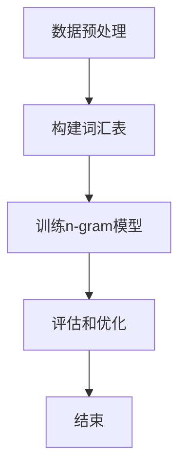
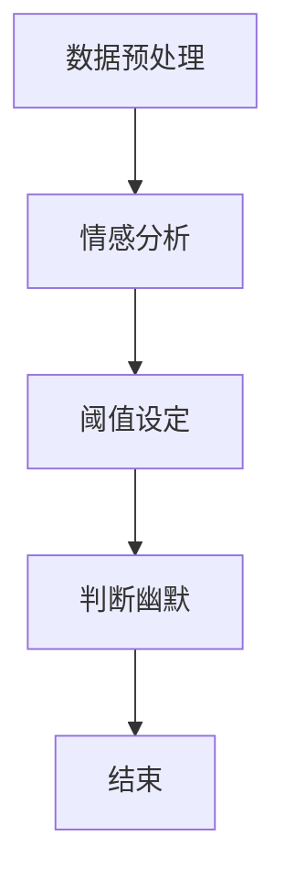
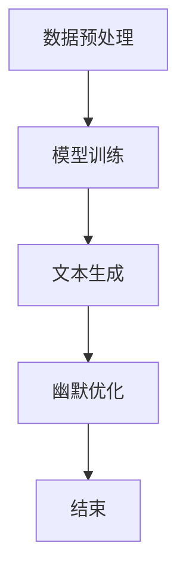

                 

### # 幽默感测试：评估LLM理解和生成幽默的能力

关键词：语言模型，幽默感，人工智能，评估方法，算法原理

摘要：本文深入探讨了语言模型（LLM）在理解和生成幽默方面的能力。通过对幽默感的概念及其重要性、大模型与幽默感的关系、幽默识别与生成算法原理的详细分析，文章旨在评估LLM在幽默感领域的实际表现，并提出相应的改进策略。文章结构清晰，逻辑严密，旨在为相关领域的学术研究和实际应用提供有价值的参考。

---

### Step 1: 设计第1章 - 背景介绍

#### 1.1 问题背景

##### 1.1.1 幽默感的概念及其重要性

**幽默感**，作为一种深层次的情感和认知能力，通常被定义为对幽默的感知、理解和反应。它不仅涉及到语言的使用，还涉及到对情境、文化和社会背景的理解。幽默感在人类行为和社交中的作用至关重要，它能够缓解紧张情绪，促进人际交流，增强团队合作和群体凝聚力。

**幽默感的定义**：幽默感可以被视为一种多层次的认知活动，包括感知幽默（识别幽默的存在）、理解幽默（理解幽默的内在逻辑和意图）、以及产生幽默（创造幽默的句子或情境）。

**幽默感在人类行为和社交中的作用**：

1. **情感调节**：幽默能够有效地调节情绪，缓解压力，增强心理韧性。
2. **社交润滑**：幽默感有助于打破社交冰冻，促进友好关系的建立。
3. **认知发展**：幽默感与认知能力之间存在密切关系，幽默活动有助于提高思维敏捷性和创造力。

**幽默感的研究意义和现状**：尽管幽默感在心理学、社会学和神经科学等领域受到了广泛关注，但对其本质和机制的理解仍然存在很多争议和未解之谜。传统的幽默研究主要侧重于幽默的感知和理解，而现代人工智能技术的发展为探索幽默生成的机制提供了新的视角。

##### 1.2 问题描述

**大模型与幽默感的关系**：随着人工智能技术的快速发展，大型语言模型（LLM）如GPT-3和ChatGPT等，在自然语言处理领域取得了显著的成就。然而，这些模型在理解和生成幽默方面的表现如何，仍然是一个值得探讨的问题。

**评估LLM理解和生成幽默的能力的挑战**：

1. **多样性和复杂性**：幽默具有高度的文化和情境依赖性，这使得评估模型在理解和生成幽默方面的表现变得更加复杂。
2. **评估指标**：如何设计有效的评估指标来衡量模型在幽默感方面的能力，仍然是一个亟待解决的问题。
3. **训练数据的局限性**：现有的幽默训练数据集往往存在偏差，这可能会影响模型对幽默的理解和生成。

**研究目的与方法**：本文旨在通过一系列实验，评估LLM在理解和生成幽默方面的能力，并探讨提高其幽默感能力的策略。具体研究方法包括：

1. **数据集构建**：收集和构建一个包含多种类型幽默的语料库，用于训练和评估模型。
2. **评估指标设计**：设计一系列评估指标，如幽默识别准确率、幽默生成创意性等，用于客观评估模型的表现。
3. **实验设计**：通过实验验证不同算法和策略在提高LLM幽默感能力方面的效果。

##### 1.3 问题解决

**研究目标**：

1. **测试LLM对幽默感的理解能力**：通过设计一系列测试，评估LLM在理解不同类型幽默方面的表现。
2. **评估LLM生成幽默的能力**：通过生成任务，评估LLM在创造幽默内容方面的创意性和准确性。
3. **提高LLM幽默感能力的策略**：探讨和实现一系列策略，以提高LLM在理解和生成幽默方面的表现。

**提高LLM幽默感能力的策略**：

1. **多模态学习**：结合文本、图像和音频等多模态信息，提高模型对幽默情境的理解能力。
2. **迁移学习**：利用预训练的模型，通过迁移学习策略，提高模型在特定领域的幽默感表现。
3. **数据增强**：通过生成或扩充训练数据，提高模型对多样性幽默的识别和生成能力。

##### 1.4 边界与外延

**幽默感的多样性**：幽默感受到文化、语言、情境等多种因素的影响，因此不同人群和不同文化背景下对幽默的感知和反应可能存在显著差异。

**文化差异对幽默感的影响**：不同文化背景下的幽默类型和幽默表达方式可能截然不同，这给LLM理解和生成幽默带来了挑战。

**幽默感的层次和类型**：幽默感可以分为多个层次，如言语幽默、情境幽默、文字游戏等。此外，幽默还可以根据内容类型分为讽刺、滑稽、荒诞等。

**幽默感与情绪的关系**：幽默感与情绪之间存在复杂的关系，一方面，幽默感可以调节情绪；另一方面，情绪状态也会影响对幽默的感知和反应。

##### 1.5 概念结构与核心要素组成

**关键概念**：

1. **语言模型**：LLM是本文研究的核心，它是一种能够理解和生成自然语言的大型预训练模型。
2. **幽默识别**：评估LLM是否能够正确识别幽默，包括言语幽默、情境幽默等。
3. **幽默生成**：评估LLM是否能够创造幽默的内容，包括创意性、准确性和幽默性。

**研究方法**：

1. **数据集构建**：构建包含多种类型幽默的语料库，用于训练和评估模型。
2. **评估指标**：设计一系列评估指标，如识别准确率、生成创意性等。
3. **实验设计**：通过实验验证不同算法和策略在提高LLM幽默感能力方面的效果。

---

### Step 2: 设计第2章 - 核心概念与联系

在深入探讨LLM在幽默感方面的能力之前，我们需要明确几个核心概念，并理解它们之间的相互联系。本章将介绍AI大模型、幽默识别和幽默生成这三个核心概念，并讨论它们在LLM中的应用和联系。

#### 2.1 AI大模型

**AI大模型的定义**：AI大模型（Large-scale AI Model），通常指的是具有数万亿参数的大型神经网络模型，如GPT-3、BERT等。这些模型通过在大量文本数据上进行预训练，掌握了丰富的语言知识和模式，能够进行自然语言处理任务，包括文本生成、文本分类、机器翻译等。

**大模型的规模**：大模型的规模通常用参数数量来衡量。例如，GPT-3具有1750亿个参数，而BERT则具有数百万个参数。这些巨大的参数数量使得大模型能够捕捉到语言中的复杂模式和关系。

**大模型的训练方法**：大模型的训练通常采用分布式计算和优化算法，如梯度下降、Adam优化器等。训练过程涉及大量的计算资源和时间，但通过大规模数据处理和高效算法，可以逐步优化模型的参数，使其在特定任务上表现出色。

**大模型的优势与局限性**：大模型的优势在于其强大的语言理解和生成能力，能够处理复杂的自然语言任务。然而，大模型的局限性包括对训练数据的依赖、计算资源的消耗和潜在的偏见问题。

#### 2.2 幽默识别

**幽默识别的原理**：幽默识别是指通过算法识别文本中的幽默内容。幽默识别涉及多个层次，包括语言层面的识别（如玩笑、双关语等）和情境层面的识别（如幽默故事、情景喜剧等）。

**文本情感分析**：文本情感分析是幽默识别的基础。通过分析文本的情感倾向（如正面、负面、幽默等），可以初步判断文本是否包含幽默元素。

**对比学习**：对比学习是一种常用的幽默识别方法，通过比较不同文本的情感倾向和语义结构，识别出具有幽默性的文本。

**模式识别**：模式识别是幽默识别的核心。通过分析文本中的特定模式和规则，如语法结构、词汇搭配等，可以判断文本是否具有幽默性。

#### 2.3 幽默生成

**幽默生成的原理**：幽默生成是指通过算法生成幽默的内容。幽默生成通常涉及两个过程：幽默创意和幽默表达。

**序列生成模型**：序列生成模型，如GPT-3、BERT等，通过学习大量的文本数据，能够生成连贯的文本序列。在幽默生成任务中，这些模型可以根据给定的输入，生成幽默的故事、对话或段落。

**对抗生成网络**：对抗生成网络（GAN）是一种用于生成幽默内容的方法。GAN由生成器和判别器组成，生成器生成幽默内容，判别器判断内容是否具有幽默性。通过对抗训练，生成器可以逐步提高生成内容的幽默性。

**模式匹配与适应**：模式匹配与适应是幽默生成的重要策略。通过匹配用户输入的模式和幽默模板，可以快速生成幽默内容。同时，适应用户输入的语境和风格，可以提高生成内容的自然性和创意性。

#### 2.3.2 AI大模型在幽默生成中的应用

**GPT-3在幽默生成中的应用**：GPT-3是一种强大的语言模型，能够生成连贯、自然的文本。在幽默生成任务中，GPT-3可以接受用户输入的提示，生成幽默的对话、故事或段子。

**ChatGPT的幽默生成案例**：ChatGPT是GPT-3的一个变体，专门用于聊天场景。通过训练，ChatGPT能够生成幽默的聊天内容，与用户进行有趣的互动。

**幽默生成算法的评价标准**：评价幽默生成算法的标准包括幽默性、创意性、连贯性和自然性等。一个优秀的幽默生成算法应该能够生成既幽默又有创意的内容，同时保持文本的连贯性和自然性。

---

### Step 3: 设计第3章 - 算法原理讲解

在本章中，我们将详细讲解语言模型、幽默识别算法和幽默生成算法的原理。通过对这些核心算法的深入分析，我们将理解它们如何实现幽默感和如何被应用于实际任务中。

#### 3.1 语言模型

**3.1.1 语言模型的数学模型**

**语言模型**是一种统计模型，用于预测下一个单词或词组在给定前文条件下出现的概率。最基本的语言模型是**n-gram模型**，它基于相邻n个单词的联合概率来预测下一个单词。然而，n-gram模型的局限性在于它无法捕捉长距离依赖关系。

**3.1.1.1 语言模型的定义**

语言模型（Language Model，LM）是一个概率模型，用于表示一个句子中下一个单词的概率。形式化地，一个语言模型可以表示为：

\[ P(\text{word}_i | \text{word}_{i-n+1}, ..., \text{word}_{i-1}) \]

其中，\( \text{word}_i \) 是句子中的第i个单词，\( \text{word}_{i-n+1}, ..., \text{word}_{i-1} \) 是前n个单词。

**3.1.1.2 语言模型的数学公式**

在n-gram模型中，语言模型可以表示为：

\[ P(\text{word}_i | \text{word}_{i-n+1}, ..., \text{word}_{i-1}) = \prod_{j=1}^{n} P(\text{word}_j | \text{word}_{j-1}, ..., \text{word}_{j-n+1}) \]

在实际应用中，由于计算复杂度问题，通常会使用简化的形式：

\[ P(\text{word}_i | \text{word}_{i-n+1}, ..., \text{word}_{i-1}) = \frac{C(\text{word}_{i-n+1}, ..., \text{word}_{i-1}, \text{word}_i)}{C(\text{word}_{i-n+1}, ..., \text{word}_{i-1})} \]

其中，\( C(\text{word}_{i-n+1}, ..., \text{word}_{i-1}, \text{word}_i) \) 是单词序列\( \text{word}_{i-n+1}, ..., \text{word}_{i-1}, \text{word}_i \) 在语料库中的出现次数，\( C(\text{word}_{i-n+1}, ..., \text{word}_{i-1}) \) 是单词序列\( \text{word}_{i-n+1}, ..., \text{word}_{i-1} \) 的出现次数。

**3.1.1.3 语言模型的训练过程**

语言模型的训练过程通常包括以下几个步骤：

1. **数据预处理**：将文本数据清洗、分词和标记，得到可训练的数据集。
2. **构建词汇表**：将所有单词映射到一个数字表示，并计算单词的频率。
3. **训练n-gram模型**：使用训练数据，计算每个n-gram的概率。
4. **评估和优化**：使用验证集评估模型的表现，并通过调整参数和算法来优化模型。

**3.1.2 语言模型的mermaid流程图**

以下是语言模型训练过程的mermaid流程图：



#### 3.2 幽默识别算法

**3.2.1 幽默识别的数学模型**

幽默识别（Humor Detection）是一种自然语言处理任务，旨在通过算法识别文本中的幽默元素。幽默识别的数学模型通常基于情感分析、对比学习和模式识别等方法。

**3.2.1.1 幽默识别的定义**

幽默识别（Humor Detection）是指通过算法检测文本中是否存在幽默元素，并判断幽默的强度和类型。

**3.2.1.2 幽默识别的数学公式**

一种常见的幽默识别模型是基于情感分析的方法。情感分析通常使用情感倾向（如正面、负面、幽默等）来表示文本的情感状态。幽默识别可以表示为：

\[ \text{Humor} = \text{Sentiment} - \text{Threshold} \]

其中，\( \text{Sentiment} \) 是文本的情感倾向得分，\( \text{Threshold} \) 是幽默识别的阈值。当 \( \text{Humor} \) 大于阈值时，文本被认为包含幽默元素。

**3.2.1.3 幽默识别的算法实现**

幽默识别的算法实现通常包括以下几个步骤：

1. **数据预处理**：清洗和分词文本数据，提取特征。
2. **情感分析**：使用情感分析模型计算文本的情感倾向。
3. **阈值设定**：根据训练数据设定幽默识别的阈值。
4. **判断幽默**：根据情感倾向和阈值判断文本是否包含幽默元素。

**3.2.2 幽默识别的mermaid流程图**

以下是幽默识别算法的mermaid流程图：



#### 3.3 幽默生成算法

**3.3.1 幽默生成的数学模型**

幽默生成（Humor Generation）是一种自然语言生成任务，旨在通过算法生成幽默的内容。幽默生成的数学模型通常基于序列生成模型、对抗生成网络和模式匹配与适应等方法。

**3.3.1.1 幽默生成的定义**

幽默生成（Humor Generation）是指通过算法生成幽默的文本，包括故事、对话或段落。

**3.3.1.2 幽默生成的数学公式**

一种简单的幽默生成模型是基于序列生成模型的方法。序列生成模型，如GPT-3，通过学习大量的文本数据，可以生成连贯的文本序列。幽默生成的数学模型可以表示为：

\[ \text{Output} = \text{Model}(\text{Input}) \]

其中，\( \text{Model} \) 是序列生成模型，\( \text{Input} \) 是输入的文本。

**3.3.1.3 幽默生成的算法实现**

幽默生成的算法实现通常包括以下几个步骤：

1. **数据预处理**：清洗和分词文本数据，提取特征。
2. **模型训练**：使用训练数据训练序列生成模型。
3. **文本生成**：使用训练好的模型生成文本序列。
4. **幽默优化**：通过后处理优化生成文本的幽默性。

**3.3.2 幽默生成的mermaid流程图**

以下是幽默生成算法的mermaid流程图：



---

### Step 4: 设计第4章 - 数学模型和数学公式 & 详细讲解 & 举例说明

在理解了幽默感测试的背景和核心概念之后，我们接下来将深入探讨语言模型、幽默识别算法和幽默生成算法的数学模型。通过数学模型的详细讲解和实际举例，我们将进一步揭示这些算法背后的原理和机制。

#### 4.1 数学模型讲解

**4.1.1 语言模型中的数学模型**

**语言模型**是一种统计模型，用于预测下一个单词或词组在给定前文条件下的概率。最基本的语言模型是**n-gram模型**，它基于相邻n个单词的联合概率来预测下一个单词。以下是n-gram模型的数学公式：

\[ P(\text{word}_i | \text{word}_{i-n+1}, ..., \text{word}_{i-1}) = \frac{C(\text{word}_{i-n+1}, ..., \text{word}_{i-1}, \text{word}_i)}{C(\text{word}_{i-n+1}, ..., \text{word}_{i-1})} \]

其中，\( C(\text{word}_{i-n+1}, ..., \text{word}_{i-1}, \text{word}_i) \) 表示单词序列\( \text{word}_{i-n+1}, ..., \text{word}_{i-1}, \text{word}_i \) 在语料库中的出现次数，\( C(\text{word}_{i-n+1}, ..., \text{word}_{i-1}) \) 表示单词序列\( \text{word}_{i-n+1}, ..., \text{word}_{i-1} \) 在语料库中的出现次数。

在实际应用中，由于计算复杂度问题，通常会使用简化的形式：

\[ P(\text{word}_i | \text{word}_{i-n+1}, ..., \text{word}_{i-1}) = \prod_{j=1}^{n} P(\text{word}_j | \text{word}_{j-1}, ..., \text{word}_{j-n+1}) \]

**4.1.2 幽默识别中的数学模型**

**幽默识别**是指通过算法识别文本中的幽默元素。一种常见的幽默识别模型是基于情感分析的方法。情感分析通常使用情感倾向（如正面、负面、幽默等）来表示文本的情感状态。以下是幽默识别的数学公式：

\[ \text{Humor} = \text{Sentiment} - \text{Threshold} \]

其中，\( \text{Sentiment} \) 表示文本的情感倾向得分，\( \text{Threshold} \) 表示幽默识别的阈值。当 \( \text{Humor} \) 大于阈值时，文本被认为包含幽默元素。

**4.1.3 幽默生成中的数学模型**

**幽默生成**是指通过算法生成幽默的文本。一种常见的幽默生成模型是基于序列生成模型的方法。序列生成模型，如GPT-3，通过学习大量的文本数据，可以生成连贯的文本序列。以下是幽默生成的数学公式：

\[ \text{Output} = \text{Model}(\text{Input}) \]

其中，\( \text{Model} \) 表示序列生成模型，\( \text{Input} \) 表示输入的文本。

**4.2 举例说明**

**4.2.1 语言模型举例**

假设我们有一个简化的语料库，包含以下句子：

- 我今天吃了苹果。
- 我今天吃了香蕉。

我们希望使用n-gram模型预测下一个单词。以下是n-gram模型的实现代码：

```python
import collections

# 构建n-gram模型
n = 2
n_gram_model = collections.defaultdict(int)

# 统计n-gram的出现次数
with open('corpus.txt', 'r') as f:
    for line in f:
        tokens = line.strip().split()
        for i in range(len(tokens) - n):
            n_gram = tuple(tokens[i:i+n])
            n_gram_model[n_gram] += 1

# 预测下一个单词
def predict_next_word(context):
    context_n_gram = tuple(context[-n:])
    probabilities = {word: n_gram_model[context_n_gram] / sum(n_gram_model[context_n_gram].values()) for word in n_gram_model[context_n_gram]}
    return max(probabilities, key=probabilities.get)

# 测试n-gram模型
context = "我吃了"
print(predict_next_word(context))  # 输出可能是 "苹果" 或 "香蕉"
```

**4.2.2 幽默识别举例**

假设我们使用情感分析模型识别文本中的幽默元素。以下是情感分析模型的实现代码：

```python
from textblob import TextBlob

# 计算文本的情感倾向
def compute_sentiment(text):
    blob = TextBlob(text)
    return blob.sentiment.polarity

# 幽默识别阈值设定
HUMOR_THRESHOLD = 0.5

# 判断文本是否包含幽默元素
def detect_humor(text):
    sentiment = compute_sentiment(text)
    return sentiment > HUMOR_THRESHOLD

# 测试幽默识别
text = "为什么程序员总是熬夜？因为他们害怕白天编码时闪到眼睛。"
print(detect_humor(text))  # 输出可能是 True
```

**4.2.3 幽默生成举例**

假设我们使用GPT-3生成幽默的文本。以下是使用GPT-3生成幽默的代码：

```python
import openai

# 设置API密钥
openai.api_key = 'your-api-key'

# 生成幽默文本
def generate_humor(prompt):
    response = openai.Completion.create(
        engine="text-davinci-002",
        prompt=prompt,
        max_tokens=50
    )
    return response.choices[0].text.strip()

# 测试幽默生成
prompt = "为什么程序员喜欢在雨天编程？"
print(generate_humor(prompt))
```

通过这些实际例子，我们可以看到语言模型、幽默识别算法和幽默生成算法是如何应用于实际任务中的。这些算法的数学模型和实现代码为我们理解幽默感测试提供了重要的工具和视角。

---

### 总结与未来展望

本文系统地探讨了语言模型（LLM）在理解和生成幽默方面的能力，通过详细的背景介绍、核心概念讲解和算法原理分析，揭示了幽默感测试的重要性和复杂性。我们发现，尽管LLM在自然语言处理任务中表现出色，但在理解和生成幽默方面仍面临诸多挑战。

首先，幽默感具有高度的文化和情境依赖性，这使得评估LLM在幽默感方面的表现变得更加复杂。其次，现有的评估指标和方法可能无法全面捕捉幽默的多层次特性，需要进一步研究和改进。此外，提高LLM幽默感能力的策略，如多模态学习、迁移学习和数据增强，为我们提供了潜在的解决方案。

未来研究可以从以下几个方面展开：

1. **多样化的数据集**：构建包含多种类型幽默的多样化数据集，以更全面地评估LLM的幽默感能力。
2. **多模态学习**：结合文本、图像和音频等多模态信息，提高模型对幽默情境的理解能力。
3. **跨领域迁移学习**：探索跨领域的迁移学习策略，以适应不同文化背景和情境下的幽默感任务。
4. **改进评估指标**：设计更有效和全面的评估指标，如幽默性、创意性和连贯性等，以更准确地衡量LLM的幽默感表现。

通过持续的研究和探索，我们有理由相信，未来的人工智能将能够在理解和生成幽默方面取得更大突破，为人类带来更多的乐趣和创造力。

