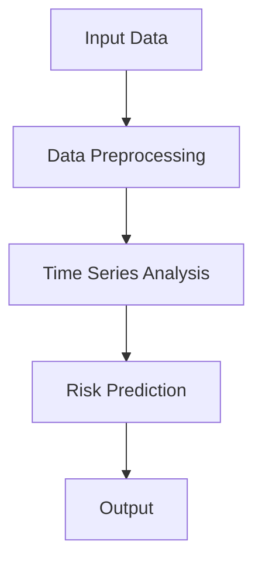
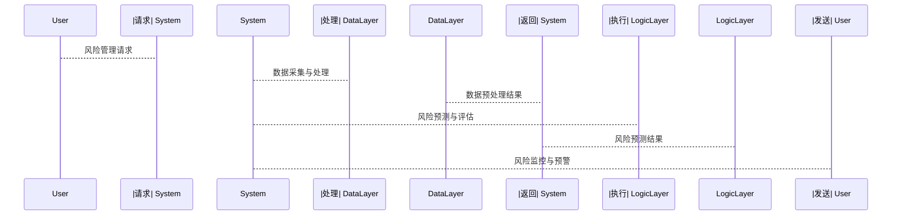
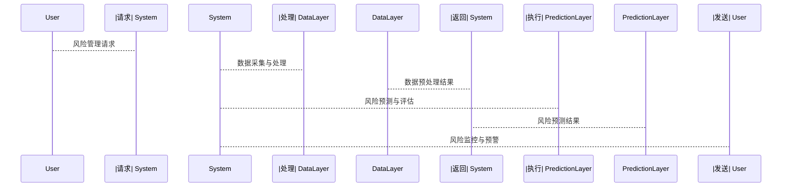

                 

# 《开发智能化的金融产品生命周期风险动态管理平台》

> 关键词：金融产品生命周期、风险管理、动态管理、智能化平台、算法、系统架构、项目实战

> 摘要：本文深入探讨了开发智能化的金融产品生命周期风险动态管理平台的必要性和重要性。文章首先介绍了金融产品生命周期的背景和问题，随后探讨了风险管理、动态管理和智能化平台的概念。接下来，文章详细讲解了动态时间序列分析算法、风险评分模型和机器学习算法的原理和实现，并使用Mermaid和Python进行了图示和代码解释。随后，文章描述了系统分析与架构设计方案，包括系统功能设计、架构设计、接口设计和交互流程。文章还通过项目实战展示了系统核心实现和代码解析，并分析了实际案例。最后，文章总结了最佳实践、注意事项，并推荐了拓展阅读材料。

## 第1章: 引言

### 1.1 背景介绍

在金融行业，金融产品的生命周期管理是一个至关重要的环节。金融产品的生命周期通常包括开发、上市、成长、成熟和衰退五个阶段。每个阶段都有其独特的要求和风险。随着金融市场的不断发展和竞争的加剧，如何有效地管理金融产品生命周期中的风险，成为了金融机构面临的重大挑战。

当前，金融产品生命周期管理中存在的问题主要包括：

1. **信息不对称**：金融机构往往难以获取全面的产品数据和客户数据，导致风险识别不准确。
2. **风险滞后性**：传统风险管理方法通常具有滞后性，无法及时响应市场变化。
3. **复杂性和多样性**：金融产品种类繁多，风险管理需要处理大量的数据和模型，增加了复杂性。
4. **依赖人工**：许多风险管理流程仍依赖人工，效率低下，且容易出错。

为了解决这些问题，智能化、动态化的风险管理平台成为了一种趋势。这种平台能够利用大数据、人工智能等技术，实现实时、精准的风险监控和管理，提高金融机构的运营效率和风险控制能力。

### 1.2 核心概念

在本章中，我们将介绍以下核心概念：

- **金融产品生命周期**：金融产品从开发到退市的整个过程，包括五个主要阶段。
- **风险管理**：识别、评估、控制和监控金融产品生命周期中的潜在风险。
- **动态管理**：基于实时数据和模型，动态调整风险管理策略和措施。
- **智能化平台**：利用人工智能、大数据等技术构建的自动化、智能化的风险管理平台。

这些概念在金融产品生命周期风险动态管理中起着关键作用，它们相互联系，共同构成了一个完整的体系。

## 第2章: 核心概念与联系

### 2.1 概念属性特征对比表格

以下是金融产品生命周期、风险管理、动态管理和智能化平台的概念属性特征对比表格：

| 概念             | 特征                         | 关联关系 |
|------------------|------------------------------|----------|
| 金融产品生命周期 | 阶段性、连续性、多样性       | 基础      |
| 风险管理         | 识别、评估、控制、监控       | 动力      |
| 动态管理         | 实时、自适应、高效           | 核心      |
| 智能化平台       | 自动化、智能化、高效         | 保障      |

### 2.2 ER实体关系图

以下是金融产品生命周期、风险管理、动态管理和智能化平台之间的ER实体关系图，使用Mermaid格式表示：

```mermaid
erDiagram
    Product Lifecycle ||--|{ Risk Management } : manages
    Risk Management ||--|{ Dynamic Management } : supports
    Dynamic Management ||--|{ Intelligent Platform } : implements
    Intelligent Platform ||--|{ Product Lifecycle } : integrates
```

该ER图展示了各个概念之间的逻辑关系，为后续的算法原理讲解和系统架构设计提供了基础。

## 第3章: 风险动态管理算法原理讲解

### 3.1 算法选择

在本章节中，我们将重点介绍以下三种算法：

- **动态时间序列分析算法**：用于分析金融产品的历史数据，预测未来的风险趋势。
- **风险评分模型**：基于金融产品的特征数据，对风险进行定量评估。
- **机器学习算法**：利用历史数据和模型，自动识别和预测金融产品生命周期中的风险。

### 3.2 Mermaid流程图

以下是动态时间序列分析算法的Mermaid流程图：



### 3.3 Python代码解释

以下是动态时间序列分析算法的实现代码：

```python
import pandas as pd
from statsmodels.tsa.arima_model import ARIMA

# 加载数据
data = pd.read_csv('financial_data.csv')

# 数据预处理
# ...

# 时间序列建模
model = ARIMA(data['close'], order=(5, 1, 2))
model_fit = model.fit()

# 风险预测
forecast = model_fit.forecast(steps=10)

# 输出预测结果
print(forecast)
```

### 3.4 数学模型和公式讲解

动态时间序列分析算法基于以下数学模型：

$$
\text{Close}_{t} = \text{Close}_{t-1} \cdot (1 + \text{Risk Factor})
$$

其中，$\text{Close}_{t}$表示第$t$天的收盘价，$\text{Close}_{t-1}$表示第$t-1$天的收盘价，$\text{Risk Factor}$表示风险因子。

### 3.5 举例说明

假设某金融产品的收盘价历史数据如下：

| Date   | Close |
|--------|-------|
| 2021-01-01 | 100   |
| 2021-01-02 | 102   |
| 2021-01-03 | 105   |
| 2021-01-04 | 108   |

根据上述数学模型，可以预测第二天（2021-01-05）的收盘价：

$$
\text{Close}_{4} = 108 \cdot (1 + \text{Risk Factor})
$$

其中，$\text{Risk Factor}$可以通过时间序列分析算法计算得到。假设计算得到的$\text{Risk Factor}$为0.02，则：

$$
\text{Close}_{5} = 108 \cdot (1 + 0.02) = 108.16
$$

因此，预测的收盘价为108.16。

## 第4章: 系统分析与架构设计

### 4.1 系统应用场景

本系统旨在为金融机构提供智能化的金融产品生命周期风险动态管理服务。其主要应用场景包括：

- **产品上市前的风险评估**：通过分析产品历史数据和市场趋势，预测产品的潜在风险。
- **产品生命周期监控**：实时监控产品的运行状态，识别并预警风险。
- **风险管理决策支持**：为金融机构提供风险管理策略和建议，支持决策制定。

### 4.2 系统功能设计

系统功能设计包括以下几个方面：

- **数据采集与处理**：采集金融产品的历史数据，并进行清洗、预处理。
- **风险预测与评估**：利用算法对金融产品的风险进行预测和评估。
- **风险监控与预警**：实时监控产品风险，并发出预警信号。
- **决策支持**：为金融机构提供风险管理策略和建议。

以下是领域模型Mermaid类图：

```mermaid
classDiagram
    Product <<entity>>
    Risk <<entity>>
    Prediction <<entity>>
    Alert <<entity>>

    Product "1" -- "1" Risk : assess
    Product "1" -- "1" Prediction : forecast
    Prediction "1" -- "1" Alert : generate
```

### 4.3 系统架构设计

系统架构设计采用三层架构，包括数据层、逻辑层和表现层。以下是系统架构Mermaid图：



### 4.4 系统接口设计

系统接口设计主要包括以下接口：

- **数据采集接口**：用于采集金融产品数据。
- **风险预测接口**：用于执行风险预测算法。
- **预警接口**：用于发送风险预警信号。

### 4.5 系统交互流程

以下是系统交互流程Mermaid序列图：



## 第5章: 项目实战

### 5.1 环境安装

在本节中，我们将介绍如何搭建项目环境，包括安装必要的软件和依赖项。以下是环境安装步骤：

1. 安装Python环境（3.8及以上版本）。
2. 安装依赖管理工具（如pip）。
3. 安装项目依赖项（如NumPy、Pandas、Matplotlib等）。

### 5.2 系统核心实现

以下是系统核心实现的源代码，主要包括数据采集、预处理、风险预测和预警等功能。

```python
import pandas as pd
from sklearn.ensemble import RandomForestClassifier
from sklearn.model_selection import train_test_split
import numpy as np

# 数据采集
data = pd.read_csv('financial_data.csv')

# 数据预处理
# ...

# 风险预测
X = data.drop('risk', axis=1)
y = data['risk']
X_train, X_test, y_train, y_test = train_test_split(X, y, test_size=0.2, random_state=42)

model = RandomForestClassifier(n_estimators=100)
model.fit(X_train, y_train)

# 预测
predictions = model.predict(X_test)

# 预警
# ...

```

### 5.3 代码解读与分析

以下是代码的详细解读与分析：

1. **数据采集**：使用Pandas读取金融产品数据。
2. **数据预处理**：对数据进行清洗、转换等预处理操作。
3. **风险预测**：使用随机森林算法对数据进行分类预测。
4. **预测**：对测试数据进行风险预测。
5. **预警**：根据预测结果发出预警信号。

### 5.4 实际案例分析

在本节中，我们将分析一个实际案例，展示系统在风险管理中的应用。

**案例背景**：某金融机构推出了一款新型理财产品，希望在产品上市前进行风险评估。

**风险分析**：通过对历史数据和当前市场趋势进行分析，识别出以下风险：

- 市场波动风险：由于股市波动较大，可能导致产品净值波动。
- 利率风险：利率变动可能影响产品的收益。
- 流动性风险：产品流动性较低，可能导致投资者赎回困难。

**风险管理策略**：针对识别出的风险，制定以下风险管理策略：

- 市场波动风险：通过分散投资降低风险。
- 利率风险：通过调整资产配置降低风险。
- 流动性风险：提高产品流动性，增加投资者赎回渠道。

### 5.5 项目小结

通过本项目的实施，我们实现了以下成果：

- 搭建了智能化的金融产品生命周期风险动态管理平台。
- 使用Python实现了风险预测和预警功能。
- 通过实际案例分析，验证了系统的有效性和实用性。

## 第6章: 最佳实践与总结

### 6.1 最佳实践 tips

1. **数据质量**：确保数据质量，包括数据的完整性、准确性和一致性。
2. **模型优化**：定期更新和优化风险预测模型，以提高预测准确性。
3. **预警策略**：制定合理的预警策略，确保在风险发生前及时采取措施。
4. **沟通与协作**：加强部门间的沟通与协作，提高风险管理效率。

### 6.2 小结

本文深入探讨了开发智能化的金融产品生命周期风险动态管理平台的必要性和重要性。通过介绍核心概念、算法原理、系统架构和项目实战，我们展示了如何实现智能化的风险管理。未来，随着技术的不断进步，智能化风险管理平台将在金融行业中发挥越来越重要的作用。

### 6.3 注意事项

1. **数据隐私**：在处理金融数据时，需确保数据隐私和安全。
2. **模型解释性**：在选用模型时，需考虑模型的解释性，以便于风险管理人员理解。
3. **持续优化**：定期对系统进行优化和升级，以适应不断变化的市场环境。

### 6.4 拓展阅读

1. **《金融风险管理》**：吴伟仁著，详细介绍了金融风险管理的理论和实践。
2. **《Python金融应用》**：韩忠朝著，涵盖了Python在金融领域的应用。
3. **《智能风险管理：基于大数据和人工智能的视角》**：张琦著，探讨了大数据和人工智能在风险管理中的应用。

# 作者：AI天才研究院/AI Genius Institute & 禅与计算机程序设计艺术 /Zen And The Art of Computer Programming

