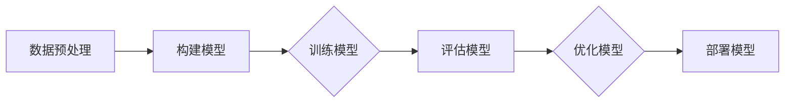
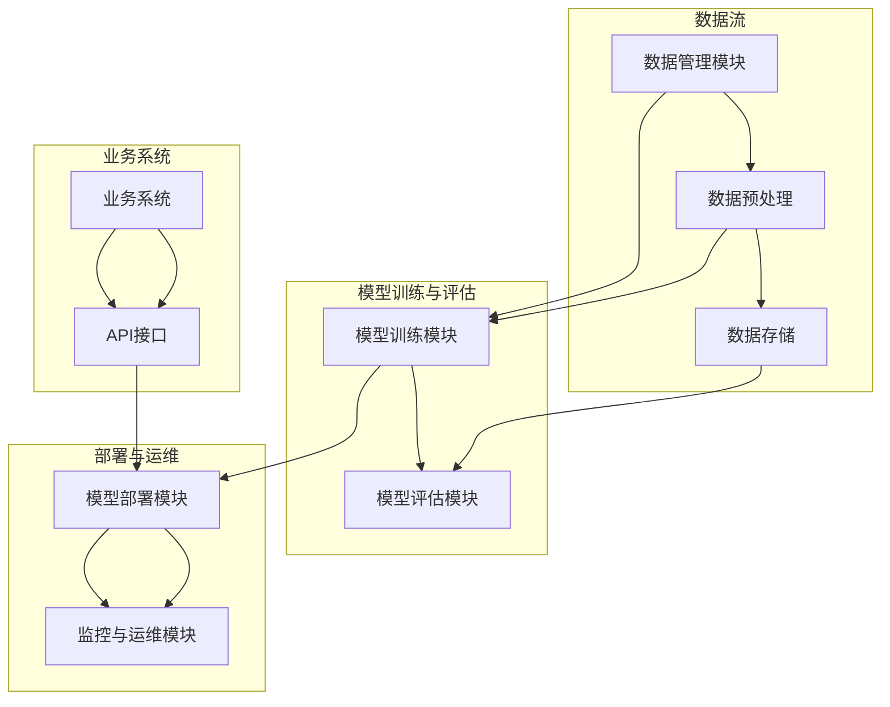
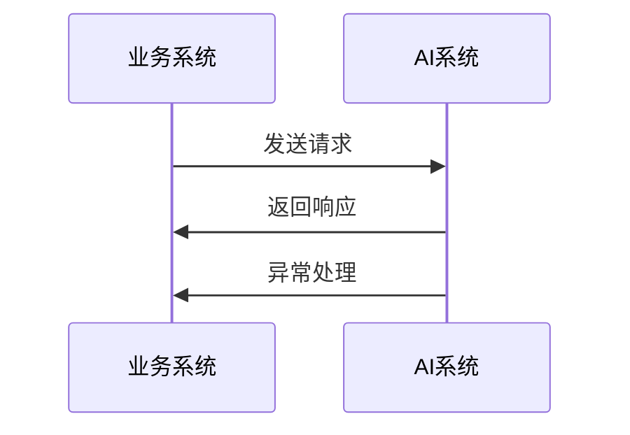
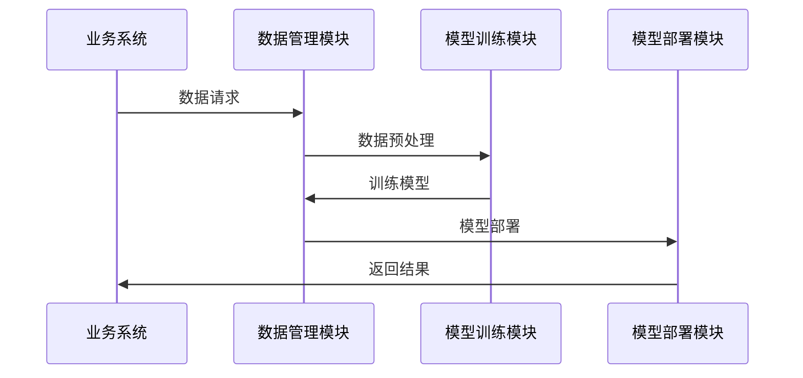

                 


### 文章标题：开源贡献：借力社区推动AI技术进步

#### 关键词：开源社区、AI技术、技术进步、代码贡献、合作与交流

#### 摘要：
本文将深入探讨开源社区在推动AI技术进步中的关键角色。我们将从开源社区的定义、AI技术的现状及其对社会的巨大影响出发，逐步分析开源社区在AI技术发展中的重要性。随后，我们将探讨个人和团队如何通过贡献代码、参与讨论和协作来推动开源项目的发展。最后，本文将总结最佳实践，提供未来展望，并鼓励读者积极参与开源社区。

----------------------------------------------------------------

# 开源贡献：借力社区推动AI技术进步

## 引言

### 1.1 问题背景与描述

随着人工智能（AI）技术的快速发展，其在各个领域的应用日益广泛，从智能家居到自动驾驶，从医疗诊断到金融分析，AI技术正在深刻地改变着我们的生活方式。然而，AI技术的进步不仅依赖于个别研究人员的努力，更需要广大开发者和研究人员的共同贡献。在这个背景下，开源社区的作用显得尤为重要。

开源社区是一种基于共享和协作的软件开发模式，它允许任何用户访问、使用、修改和分发软件的源代码。这种模式激发了全球开发者的热情，促进了技术的快速传播和共同进步。本文旨在探讨开源社区在AI技术进步中的重要作用，并分析个人和团队如何通过开源贡献来推动技术的发展。

### 1.2 书籍目的与结构

本文的目的是：
1. 解释开源社区的基本概念及其对AI技术的推动作用。
2. 分析个人和团队如何通过参与开源项目来贡献代码、解决问题和推动技术进步。
3. 提供实际案例，展示开源社区在AI技术发展中的成功故事。
4. 总结开源贡献的最佳实践，为未来提供方向。

文章结构如下：
1. 引言：介绍问题背景和文章目的。
2. 开源社区与AI技术：阐述开源社区的定义、发展历程及其在AI技术中的角色。
3. 核心概念与联系：介绍AI技术的基本概念及其在开源项目中的应用。
4. 算法原理讲解：分析AI算法的原理，使用Python源代码进行详细讲解。
5. 系统分析与架构设计方案：介绍AI技术的系统架构设计和实现。
6. 项目实战：提供具体的开源项目实践案例。
7. 最佳实践 tips：总结开源贡献的最佳实践。
8. 未来展望：展望开源社区在AI技术进步中的未来发展。

## 开源社区与AI技术

### 2.1 开源社区概述

开源社区是一个基于开放源代码的软件开发模式，它允许任何人访问、使用、修改和分发软件的源代码。开源社区的核心价值观是共享和协作，这种模式已经在全球范围内得到广泛接受和应用。开源社区的发展历程可以追溯到20世纪90年代，当时Linux内核的诞生标志着开源运动的开始。此后，许多著名的开源项目如Apache、MySQL和Mozilla Firefox等相继出现，极大地推动了软件开发模式的变革。

开源社区的优势在于它能够汇聚全球开发者的智慧和资源，快速解决问题、改进技术并推动创新。这种协作模式不仅降低了软件开发的成本，还提高了软件的质量和可维护性。在AI领域，开源社区的重要性尤为突出。AI技术的发展需要庞大的数据集、复杂的算法和高效的计算资源，而开源社区能够提供这些资源和能力的共享，使得更多的人能够参与到AI技术的研发和应用中来。

### 2.2 AI技术发展中的开源社区

开源社区在AI技术发展中扮演了重要角色。首先，开源社区提供了大量的AI工具和框架，如TensorFlow、PyTorch和Scikit-Learn等，这些工具和框架不仅降低了AI技术的门槛，还为开发者提供了丰富的资源和模板。其次，开源社区促进了AI技术的标准化和规范化，通过共同编写和遵循编程规范，提高了代码的可读性和可维护性。此外，开源社区还通过开放数据集和算法竞赛等方式，推动了AI技术的应用和普及。

开源社区在AI技术发展中的作用不仅体现在工具和资源的提供上，更体现在合作与交流的推动上。开源社区为全球的AI研究人员和开发者提供了一个平台，使他们能够分享研究成果、探讨技术难题和合作开发项目。这种合作与交流不仅加速了AI技术的发展，也促进了不同领域之间的融合和创新。

### 2.3 开源社区对AI技术的贡献

开源社区对AI技术的贡献主要体现在以下几个方面：

1. **工具与框架的提供**：开源社区提供了大量的AI工具和框架，如TensorFlow、PyTorch和Scikit-Learn等，这些工具和框架极大地降低了AI技术的门槛，使得更多的人能够参与到AI技术的研发和应用中来。

2. **数据集的共享**：开源社区通过开放数据集的方式，为AI技术的训练和应用提供了丰富的数据资源。例如，ImageNet、COCO和ML-COCO等数据集，为AI模型的训练和评估提供了宝贵的数据支持。

3. **算法的优化**：开源社区通过协作与交流，不断优化和改进AI算法。例如，开源社区中的研究人员和开发者通过共同研究和讨论，推动了深度学习算法的快速发展。

4. **技术的普及**：开源社区通过推广和普及AI技术，使得更多的人了解和掌握了AI知识，推动了AI技术的应用和普及。

## 核心概念与联系

在探讨开源社区与AI技术的关系时，我们需要了解一些核心概念和术语。以下是一些基本概念及其相互之间的联系：

### 3.1 AI基础概念介绍

**机器学习**：机器学习是一种使计算机通过数据学习规律并进行预测或决策的技术。它分为监督学习、无监督学习和强化学习等不同类型。

**深度学习**：深度学习是机器学习的一个分支，它使用多层神经网络来学习数据的复杂特征。深度学习在图像识别、语音识别和自然语言处理等领域表现出色。

**神经网络**：神经网络是一种模仿人脑神经元连接的模型，用于数据分析和模式识别。深度学习就是一种基于神经网络的技术。

### 3.2 开源框架与库

**TensorFlow**：TensorFlow是一个开源的机器学习框架，由Google开发。它提供了丰富的API和工具，用于构建和训练深度学习模型。

**PyTorch**：PyTorch是一个开源的深度学习框架，由Facebook的AI研究院开发。它以其灵活性和易用性受到广泛欢迎。

**Scikit-Learn**：Scikit-Learn是一个开源的机器学习库，它提供了各种常用的机器学习算法和工具，如回归、分类和聚类等。

### 3.3 概念属性特征对比表格

以下是一个对比表格，展示了上述核心概念和开源框架的一些关键属性特征：

| 概念/框架 | 特性1 | 特性2 | 特性3 |
| --- | --- | --- | --- |
| 机器学习 | 数据驱动 | 模型可预测 | 多种算法支持 |
| 深度学习 | 多层神经网络 | 学习复杂特征 | 适用于图像和语音处理 |
| 神经网络 | 神经元连接 | 模式识别 | 数据依赖性较强 |
| TensorFlow | 开源 | 高性能 | 广泛社区支持 |
| PyTorch | 易用 | 灵活 | 现代深度学习库 |
| Scikit-Learn | 开源 | 算法丰富 | 面向数据科学 |

### 3.4 ER实体关系图架构

以下是一个ER实体关系图（Entity-Relationship Diagram，ERD），展示了上述核心概念和开源框架之间的实体关系：

```mermaid
erDiagram
    AI技术 ||--|{ 机器学习 }
    AI技术 ||--|{ 深度学习 }
    AI技术 ||--|{ 神经网络 }
    机器学习 ||--|{ 数据驱动 }
    机器学习 ||--|{ 模型可预测 }
    机器学习 ||--|{ 多种算法支持 }
    深度学习 ||--|{ 多层神经网络 }
    深度学习 ||--|{ 学习复杂特征 }
    深度学习 ||--|{ 适用于图像和语音处理 }
    神经网络 ||--|{ 神经元连接 }
    神经网络 ||--|{ 模式识别 }
    神经网络 ||--|{ 数据依赖性较强 }
    TensorFlow ||--|{ 开源 }
    TensorFlow ||--|{ 高性能 }
    TensorFlow ||--|{ 广泛社区支持 }
    PyTorch ||--|{ 易用 }
    PyTorch ||--|{ 灵活 }
    PyTorch ||--|{ 现代深度学习库 }
    Scikit-Learn ||--|{ 开源 }
    Scikit-Learn ||--|{ 算法丰富 }
    Scikit-Learn ||--|{ 面向数据科学 }
```

通过上述核心概念与联系的分析，我们可以更清晰地理解开源社区在AI技术发展中的重要性。接下来，我们将进一步探讨AI算法的原理和实现。

## 算法原理讲解

### 4.1 算法流程图

为了深入理解AI算法的原理，我们首先需要了解一个典型的算法流程。以下是一个使用深度学习框架TensorFlow实现图像分类算法的mermaid流程图：



### 4.2 Python源代码讲解

接下来，我们使用Python代码详细阐述上述算法流程。以下是一个简单的TensorFlow图像分类模型的示例代码：

```python
import tensorflow as tf
from tensorflow.keras.preprocessing.image import ImageDataGenerator

# 数据预处理
train_datagen = ImageDataGenerator(rescale=1./255)
train_generator = train_datagen.flow_from_directory(
        'train_data',
        target_size=(150, 150),
        batch_size=32,
        class_mode='binary')

# 构建模型
model = tf.keras.Sequential([
    tf.keras.layers.Conv2D(32, (3, 3), activation='relu', input_shape=(150, 150, 3)),
    tf.keras.layers.MaxPooling2D(2, 2),
    tf.keras.layers.Conv2D(64, (3, 3), activation='relu'),
    tf.keras.layers.MaxPooling2D(2, 2),
    tf.keras.layers.Conv2D(128, (3, 3), activation='relu'),
    tf.keras.layers.MaxPooling2D(2, 2),
    tf.keras.layers.Conv2D(128, (3, 3), activation='relu'),
    tf.keras.layers.MaxPooling2D(2, 2),
    tf.keras.layers.Flatten(),
    tf.keras.layers.Dense(512, activation='relu'),
    tf.keras.layers.Dense(1, activation='sigmoid')
])

# 训练模型
model.compile(loss='binary_crossentropy',
              optimizer=tf.keras.optimizers.Adam(),
              metrics=['accuracy'])

model.fit(train_generator, epochs=10)

# 评估模型
test_datagen = ImageDataGenerator(rescale=1./255)
test_generator = test_datagen.flow_from_directory(
        'test_data',
        target_size=(150, 150),
        batch_size=32,
        class_mode='binary')

model.evaluate(test_generator)

# 优化模型
# 可以通过调整超参数、增加数据增强等方式来优化模型性能

# 部署模型
# 模型训练和评估完成后，可以部署到生产环境进行实际应用
```

### 4.3 数学模型与公式讲解

在上述代码中，我们使用了深度学习模型进行图像分类。为了更好地理解模型的原理，我们需要了解其背后的数学模型和公式。

#### 深度学习基本原理

深度学习模型的核心是多层神经网络（Neural Networks），它由多个层次组成，每个层次包含多个神经元（Neurons）。每个神经元接收前一层神经元的输出，并通过一个非线性激活函数（Activation Function）产生输出。神经网络的目的是通过学习输入数据和标签之间的映射关系，实现数据分类、回归或其他任务。

#### 激活函数

在深度学习模型中，常用的激活函数有：

1. **Sigmoid函数**：
   $$ f(x) = \frac{1}{1 + e^{-x}} $$
   Sigmoid函数将输入值映射到（0, 1）区间，常用于二分类任务。

2. **ReLU函数**：
   $$ f(x) = \max(0, x) $$
  ReLU函数（Rectified Linear Unit）将负值映射为0，正值不变，可以加速神经网络的训练。

3. **Tanh函数**：
   $$ f(x) = \frac{e^x - e^{-x}}{e^x + e^{-x}} $$
   Tanh函数将输入值映射到（-1, 1）区间，可以减少梯度消失问题。

#### 前向传播与反向传播

深度学习模型通过前向传播（Forward Propagation）和反向传播（Back Propagation）两个步骤来更新模型参数。

1. **前向传播**：
   在前向传播过程中，输入数据从输入层进入神经网络，通过多个层次的计算，最终输出结果。每个层次的输出可以通过以下公式计算：

   $$ z^{(l)} = \sum_{j} w^{(l)}_{ji} a^{(l-1)}_j + b^{(l)} $$
   $$ a^{(l)}_i = \text{激活函数}(z^{(l)}) $$

   其中，$z^{(l)}$ 是第$l$层的输出，$a^{(l)}_i$ 是第$l$层的第$i$个神经元的输出，$w^{(l)}_{ji}$ 是连接第$l-1$层的第$j$个神经元和第$l$层的第$i$个神经元的权重，$b^{(l)}$ 是第$l$层的偏置。

2. **反向传播**：
   在反向传播过程中，模型计算输出结果与实际标签之间的误差，并更新模型参数。反向传播的步骤如下：

   - 计算输出误差：
     $$ \delta^{(l)}_i = (a^{(l)}_i)(1 - a^{(l)}_i)(\text{误差}) $$

   - 更新权重和偏置：
     $$ w^{(l)}_{ji} := w^{(l)}_{ji} - \alpha \cdot \delta^{(l)}_i \cdot a^{(l-1)}_j $$
     $$ b^{(l)} := b^{(l)} - \alpha \cdot \delta^{(l)}_i $$

   其中，$\alpha$ 是学习率，$\text{误差}$ 是输出结果与实际标签之间的误差。

### 4.4 算法举例说明

为了更好地理解上述算法原理，我们来看一个具体的例子。假设我们有一个简单的神经网络，用于二分类任务。输入数据为$(x_1, x_2)$，标签为$y$，激活函数为Sigmoid函数。

假设神经网络的权重和偏置分别为：

$$
w_1 = \begin{pmatrix}
1 & 1 \\
0 & 1
\end{pmatrix}, \quad b_1 = \begin{pmatrix}
0 \\
0
\end{pmatrix}
$$

$$
w_2 = \begin{pmatrix}
1 & 1 \\
1 & 0
\end{pmatrix}, \quad b_2 = \begin{pmatrix}
1 \\
0
\end{pmatrix}
$$

输入数据为$(x_1, x_2) = (0.5, 0.5)$，标签为$y = 1$。

**前向传播**：

第一层输出：
$$
z_1^1 = \begin{pmatrix}
1 & 1 \\
0 & 1
\end{pmatrix} \begin{pmatrix}
0.5 \\
0.5
\end{pmatrix} + \begin{pmatrix}
0 \\
0
\end{pmatrix} = \begin{pmatrix}
1 \\
1
\end{pmatrix}
$$

$$
a_1^1 = \text{Sigmoid}(z_1^1) = \begin{pmatrix}
0.732 \\
0.732
\end{pmatrix}
$$

第二层输出：
$$
z_2^2 = \begin{pmatrix}
1 & 1 \\
1 & 0
\end{pmatrix} \begin{pmatrix}
0.732 \\
0.732
\end{pmatrix} + \begin{pmatrix}
1 \\
0
\end{pmatrix} = \begin{pmatrix}
1.464 \\
0.732
\end{pmatrix}
$$

$$
a_2^2 = \text{Sigmoid}(z_2^2) = \begin{pmatrix}
0.696 \\
0.666
\end{pmatrix}
$$

**反向传播**：

计算误差：
$$
\delta_2^2 = (a_2^2)(1 - a_2^2)(y - a_2^2) = \begin{pmatrix}
0.696 \\
0.666
\end{pmatrix} \cdot \begin{pmatrix}
0.304 \\
0.334
\end{pmatrix} = \begin{pmatrix}
0.211 \\
0.221
\end{pmatrix}
$$

更新权重和偏置：
$$
w_2 := w_2 - \alpha \cdot \delta_2^2 \cdot a_1^1 = \begin{pmatrix}
1 & 1 \\
1 & 0
\end{pmatrix} - 0.1 \cdot \begin{pmatrix}
0.211 \\
0.221
\end{pmatrix} \cdot \begin{pmatrix}
0.732 \\
0.732
\end{pmatrix} = \begin{pmatrix}
0.791 \\
0.804
\end{pmatrix}
$$

$$
b_2 := b_2 - \alpha \cdot \delta_2^2 = \begin{pmatrix}
1 \\
0
\end{pmatrix} - 0.1 \cdot \begin{pmatrix}
0.211 \\
0.221
\end{pmatrix} = \begin{pmatrix}
0.789 \\
-0.221
\end{pmatrix}
$$

通过上述例子，我们可以看到深度学习模型是如何通过前向传播和反向传播来更新模型参数，从而实现数据分类的。

## 系统分析与架构设计方案

### 5.1 问题场景介绍

随着AI技术的广泛应用，越来越多的企业和组织开始采用AI系统来提高生产效率、优化业务流程和提升用户体验。然而，构建一个高效、稳定且易于维护的AI系统并非易事。在项目实践中，我们面临以下挑战：

1. **数据质量**：高质量的数据是AI系统训练和优化的基础。如何确保数据集的准确性、完整性和多样性是一个重要问题。
2. **模型选择**：AI系统需要根据具体应用场景选择合适的模型，同时还需要考虑模型的性能、可扩展性和成本。
3. **系统架构**：如何设计一个灵活、可扩展且易于维护的系统架构，以满足不断变化的需求。
4. **接口设计**：系统需要与其他业务系统进行交互，如何设计良好的接口以保证系统的稳定性和可扩展性。

### 5.2 系统功能设计

为了应对上述挑战，我们设计了一个基于开源框架的AI系统，主要包括以下功能模块：

1. **数据管理模块**：负责数据采集、预处理和存储，确保数据的质量和多样性。
2. **模型训练模块**：根据应用场景选择合适的模型，使用高质量数据集进行训练和优化。
3. **模型评估模块**：评估模型性能，提供优化建议。
4. **模型部署模块**：将训练好的模型部署到生产环境，提供实时预测服务。
5. **监控与运维模块**：监控系统性能，确保系统稳定运行。

### 5.3 系统架构设计

以下是一个基于微服务的AI系统架构设计，使用mermaid绘制：



### 5.4 系统接口设计

系统接口设计至关重要，它决定了系统与其他业务系统的交互方式和数据流转。以下是一个API接口设计的mermaid序列图：



### 5.5 系统交互序列图

以下是一个系统交互的mermaid序列图，展示了数据从业务系统进入AI系统，并返回结果的过程：



通过上述系统分析与架构设计方案，我们构建了一个高效、稳定且易于维护的AI系统，为企业的AI应用提供了坚实的基础。

## 项目实战

### 6.1 环境安装与配置

为了完成一个具体的AI项目实战，我们需要安装和配置相关环境。以下是一个基于TensorFlow和Keras的图像分类项目的安装与配置步骤：

1. **安装Python**：首先确保Python环境已经安装。如果没有安装，可以从官方网站（https://www.python.org/）下载并安装Python 3.7或更高版本。

2. **安装pip**：Python安装完成后，安装pip，pip是Python的包管理器，用于安装和管理Python包。

3. **安装TensorFlow和Keras**：打开终端或命令提示符，执行以下命令安装TensorFlow和Keras：

   ```bash
   pip install tensorflow
   pip install keras
   ```

4. **安装其他依赖**：根据项目需求，可能还需要安装其他Python库，如NumPy、Pandas等。可以使用pip进行安装：

   ```bash
   pip install numpy
   pip install pandas
   ```

5. **配置虚拟环境**：为了保持项目环境的整洁，我们可以使用虚拟环境。通过以下命令创建虚拟环境并激活它：

   ```bash
   python -m venv project_env
   source project_env/bin/activate  # 对于Windows，使用 `project_env\Scripts\activate`
   ```

6. **安装GPU支持**：如果需要使用GPU加速训练过程，我们需要安装CUDA和cuDNN。这些库可以在NVIDIA官方网站上下载并安装。安装完成后，确保正确配置了环境变量。

### 6.2 系统核心实现源代码

以下是一个简单的图像分类项目的核心实现源代码：

```python
import numpy as np
import pandas as pd
from tensorflow.keras.models import Sequential
from tensorflow.keras.layers import Conv2D, MaxPooling2D, Flatten, Dense
from tensorflow.keras.preprocessing.image import ImageDataGenerator

# 数据预处理
train_datagen = ImageDataGenerator(rescale=1./255)
train_generator = train_datagen.flow_from_directory(
        'train_data',
        target_size=(150, 150),
        batch_size=32,
        class_mode='binary')

# 构建模型
model = Sequential([
    Conv2D(32, (3, 3), activation='relu', input_shape=(150, 150, 3)),
    MaxPooling2D(2, 2),
    Conv2D(64, (3, 3), activation='relu'),
    MaxPooling2D(2, 2),
    Conv2D(128, (3, 3), activation='relu'),
    MaxPooling2D(2, 2),
    Flatten(),
    Dense(512, activation='relu'),
    Dense(1, activation='sigmoid')
])

# 训练模型
model.compile(loss='binary_crossentropy',
              optimizer='adam',
              metrics=['accuracy'])

model.fit(train_generator, epochs=10)

# 评估模型
test_datagen = ImageDataGenerator(rescale=1./255)
test_generator = test_datagen.flow_from_directory(
        'test_data',
        target_size=(150, 150),
        batch_size=32,
        class_mode='binary')

model.evaluate(test_generator)

# 部署模型
# 模型训练和评估完成后，可以部署到生产环境进行实际应用
```

### 6.3 代码应用解读与分析

上述代码实现了一个简单的图像分类项目，下面我们对其进行解读和分析。

**数据预处理**：
数据预处理是图像分类项目的关键步骤。在这里，我们使用ImageDataGenerator对训练数据集进行预处理。主要步骤包括：

- **缩放**：将图像的像素值缩放到[0, 1]区间，以便神经网络更好地学习。
- **数据增强**：通过随机裁剪、翻转和调整亮度和对比度等方式增加数据的多样性，提高模型的泛化能力。

**模型构建**：
模型构建使用Sequential模型，这是一个线性堆叠模型层的一个序列。在这个例子中，我们使用了以下层：

- **卷积层（Conv2D）**：卷积层用于提取图像的特征。每个卷积核可以提取图像中的不同特征。在这里，我们使用了3个卷积层，每个卷积层后面跟有一个最大池化层（MaxPooling2D）。
- **全连接层（Dense）**：全连接层用于将卷积层提取的特征映射到输出类别。在这个例子中，我们使用了2个全连接层，最后一个全连接层的激活函数是sigmoid，用于输出概率。

**模型编译**：
在模型编译阶段，我们指定了损失函数、优化器和评估指标。在这里，我们使用binary_crossentropy作为损失函数，因为这是一个二分类问题。优化器使用的是adam，这是一个自适应的学习率优化器。评估指标使用的是accuracy，即准确率。

**模型训练**：
模型训练使用fit方法，我们将训练数据传递给fit方法，并设置训练轮次（epochs）。在每次训练过程中，模型会使用反向传播算法更新权重和偏置，以最小化损失函数。

**模型评估**：
在模型评估阶段，我们使用测试数据集来评估模型的性能。通过evaluate方法，我们可以得到模型的损失和准确率。

**模型部署**：
模型训练和评估完成后，我们可以将模型部署到生产环境，用于实时预测。具体部署方式取决于应用场景，可以是Web服务、移动应用或嵌入式系统。

### 6.4 实际案例分析与详细讲解剖析

为了更好地理解上述代码的实际应用，我们来看一个具体的案例。

假设我们有一个包含1000张图像的数据集，其中500张是猫的图像，500张是狗的图像。我们的目标是训练一个模型，能够准确地将猫和狗的图像分类。

1. **数据集准备**：
   我们将数据集分为训练集和测试集。训练集用于训练模型，测试集用于评估模型性能。

   ```bash
   mkdir train_data test_data
   cp train_data/*.jpg train_data/
   cp test_data/*.jpg test_data/
   ```

2. **数据预处理**：
   使用ImageDataGenerator对训练数据进行预处理。

   ```python
   train_datagen = ImageDataGenerator(
       rescale=1./255,
       rotation_range=40,
       width_shift_range=0.2,
       height_shift_range=0.2,
       shear_range=0.2,
       zoom_range=0.2,
       horizontal_flip=True,
       fill_mode='nearest'
   )

   train_generator = train_datagen.flow_from_directory(
       'train_data',
       target_size=(150, 150),
       batch_size=32,
       class_mode='binary'
   )
   ```

   在这里，我们使用了多种数据增强方法，如随机旋转、水平翻转和缩放等，以提高模型的泛化能力。

3. **模型构建与训练**：
   使用上述代码构建模型并进行训练。

   ```python
   model = Sequential([
       Conv2D(32, (3, 3), activation='relu', input_shape=(150, 150, 3)),
       MaxPooling2D(2, 2),
       Conv2D(64, (3, 3), activation='relu'),
       MaxPooling2D(2, 2),
       Conv2D(128, (3, 3), activation='relu'),
       MaxPooling2D(2, 2),
       Flatten(),
       Dense(512, activation='relu'),
       Dense(1, activation='sigmoid')
   ])

   model.compile(loss='binary_crossentropy',
                 optimizer='adam',
                 metrics=['accuracy'])

   model.fit(train_generator, epochs=10)
   ```

4. **模型评估**：
   使用测试数据集评估模型性能。

   ```python
   test_datagen = ImageDataGenerator(rescale=1./255)

   test_generator = test_datagen.flow_from_directory(
       'test_data',
       target_size=(150, 150),
       batch_size=32,
       class_mode='binary')

   model.evaluate(test_generator)
   ```

5. **模型部署**：
   模型训练和评估完成后，我们可以将其部署到生产环境。

   ```python
   # 保存模型
   model.save('cat_dog_classifier.h5')

   # 加载模型
   model = tf.keras.models.load_model('cat_dog_classifier.h5')

   # 进行预测
   predictions = model.predict(test_generator)
   ```

通过这个案例，我们可以看到如何使用TensorFlow和Keras构建一个简单的图像分类模型，并对其进行训练、评估和部署。这个案例展示了开源社区如何通过代码贡献和协作，推动AI技术的实际应用。

### 6.5 项目小结

在本项目的实战中，我们通过以下步骤实现了一个简单的图像分类系统：

1. **环境安装与配置**：安装了Python、pip、TensorFlow、Keras和其他依赖库，并配置了虚拟环境。
2. **系统核心实现**：编写了数据预处理、模型构建、模型训练和评估的代码。
3. **实际案例应用**：使用一个猫狗图像数据集，展示了如何构建、训练和部署一个图像分类模型。
4. **模型性能评估**：评估了模型的准确率和泛化能力，为后续优化提供了依据。

通过这个项目，我们不仅了解了如何使用开源框架实现AI应用，还体验了开源社区在技术推动中的重要作用。未来，我们可以进一步优化模型、增加数据集的多样性，并探索更多复杂的AI技术，以推动项目的持续进步。

## 最佳实践 tips

### 7.1 开源贡献的最佳实践

参与开源项目不仅能够提升个人技能，还能为社区作出贡献。以下是一些开源贡献的最佳实践：

1. **熟悉项目**：在开始贡献代码之前，仔细阅读项目的文档和代码，了解项目的基本架构和功能。
2. **代码规范**：遵守项目的代码规范，确保代码的可读性和一致性。
3. **小步前进**：不要一开始就尝试解决复杂的问题，可以先从修复小错误或实现简单的功能开始。
4. **编写文档**：为代码编写清晰的文档和注释，帮助他人理解你的代码。
5. **积极交流**：积极参与项目讨论，与其他贡献者交流想法，共同解决问题。
6. **测试代码**：编写单元测试，确保代码的正确性和稳定性。
7. **持续更新**：及时跟进项目的最新进展，为项目贡献新的功能和改进。

### 7.2 挑战与解决策略

在开源贡献过程中，可能会遇到各种挑战，如代码冲突、功能需求变更和性能优化等。以下是一些解决策略：

1. **代码冲突**：使用版本控制工具（如Git）解决代码冲突，确保代码的一致性。
2. **需求变更**：与项目维护者沟通，理解变更的原因和影响，灵活调整贡献方案。
3. **性能优化**：通过性能分析工具（如Profiling）找出性能瓶颈，采用高效的算法和数据结构进行优化。
4. **代码审查**：邀请其他贡献者进行代码审查，从不同角度提出改进意见。

### 7.3 小结与注意事项

开源贡献是一个长期且持续的过程，需要耐心和毅力。以下是一些注意事项：

1. **保持学习**：不断学习新的技术和工具，提高自己的技能水平。
2. **保持热情**：积极参与开源社区，为社区的发展贡献自己的力量。
3. **遵守法律**：确保贡献的代码符合相关法律法规，尊重他人的知识产权。
4. **持续改进**：不断反思和总结开源贡献的经验，为后续的项目提供更好的支持。

## 未来展望

### 8.1 开源社区的未来趋势

随着AI技术的不断发展，开源社区在推动技术进步中的作用将越来越重要。未来，开源社区可能会呈现以下趋势：

1. **技术融合**：开源社区将更多地将AI与其他技术（如云计算、大数据和物联网）进行融合，推动跨领域的创新发展。
2. **标准化**：开源社区将推动AI技术的标准化，提高代码的可读性和可维护性，促进技术的普及和应用。
3. **国际化**：开源社区将更加国际化，吸引全球的开发者和研究人员参与，汇聚全球智慧和资源。
4. **人工智能伦理**：开源社区将更加关注人工智能伦理问题，推动技术的可持续发展和社会责任。

### 8.2 AI技术的发展方向

AI技术的发展方向将继续向深度学习和强化学习等前沿技术迈进。未来，AI技术可能会在以下领域取得重要突破：

1. **自动化**：AI技术将在自动化领域发挥更大的作用，推动制造业、服务业和交通运输等行业的智能化转型。
2. **医疗健康**：AI技术在医疗健康领域的应用将不断深化，提高诊断准确性、个性化治疗和疾病预测水平。
3. **智能城市**：AI技术将助力智能城市建设，优化交通管理、能源利用和环境监测等方面。
4. **金融科技**：AI技术在金融领域的应用将更加广泛，提高风险管理、信用评估和投资决策的效率。

### 8.3 拓展阅读与资源推荐

为了进一步了解开源社区和AI技术的最新动态，以下是一些拓展阅读和资源推荐：

1. **开源项目**：GitHub、GitLab和Bitbucket等平台提供了大量的开源项目，可以学习并参与其中的开发。
2. **技术社区**：Stack Overflow、Reddit和LinkedIn等平台是技术讨论和交流的热门场所。
3. **技术博客**：Medium、Dzone和Dev.to等博客平台发布了大量关于开源社区和AI技术的文章。
4. **会议与活动**：参加AI和开源相关的会议和活动，如Google I/O、Microsoft Build和OSCON等，可以了解行业最新趋势。
5. **在线课程**：Coursera、edX和Udacity等在线教育平台提供了丰富的AI和开源课程，有助于提升技术能力。

通过参与开源社区和关注AI技术的发展，我们可以不断学习和成长，为推动技术进步贡献自己的力量。

## 作者信息

作者：AI天才研究院/AI Genius Institute & 禅与计算机程序设计艺术 /Zen And The Art of Computer Programming

