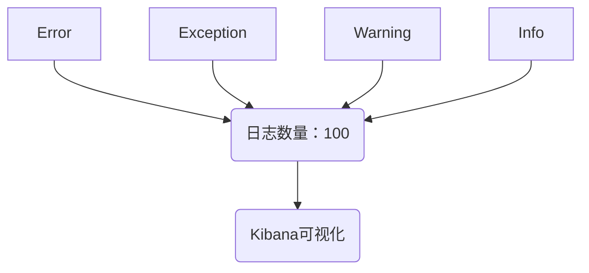
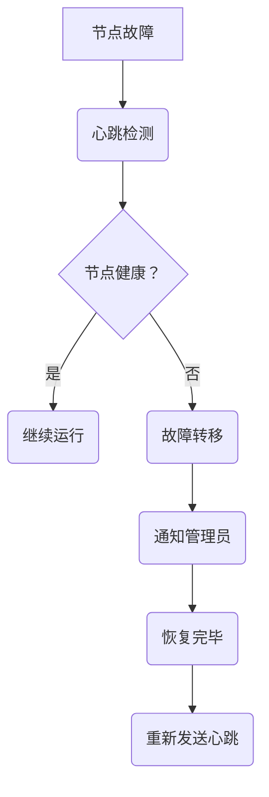
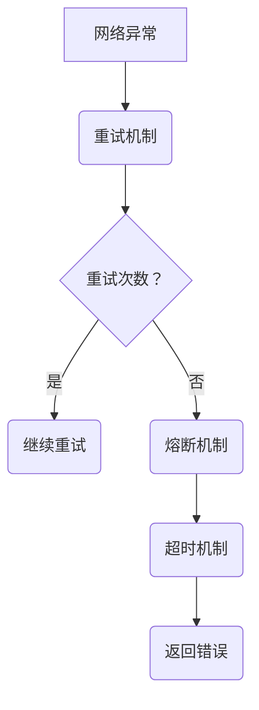
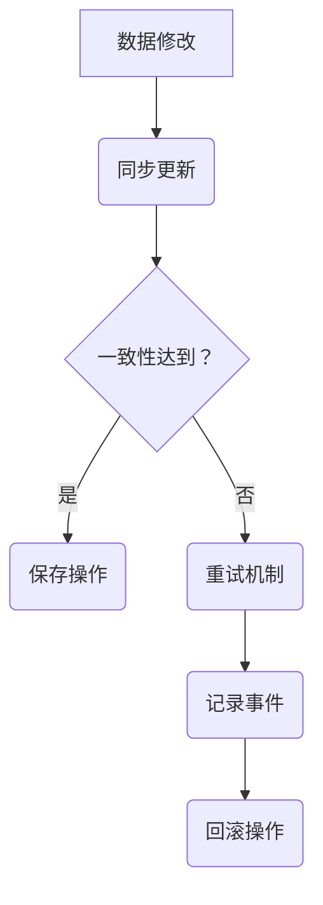
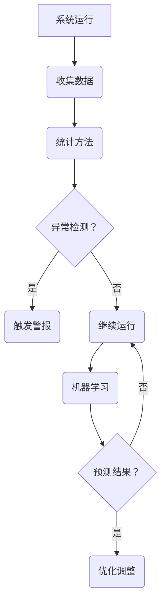
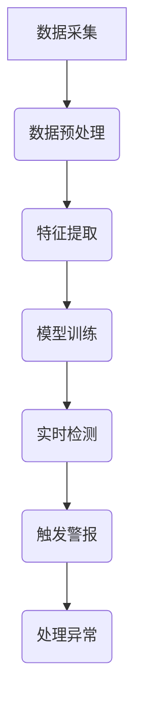
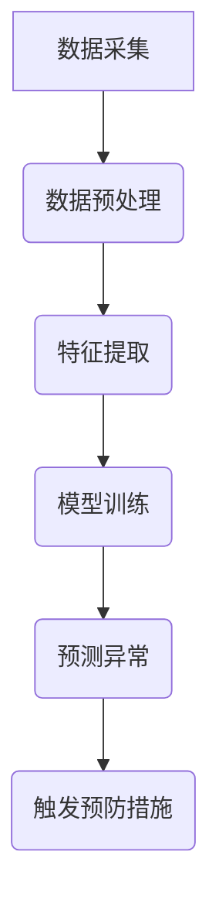

                 

### 《异常处理能力评估：测试边界情况应对》

#### 关键词：异常处理、测试边界情况、评估方法、案例分析、实践指南

> 摘要：本文将深入探讨异常处理能力评估，特别是测试边界情况的重要性。通过分析异常处理的背景和基本原理，我们将介绍评估异常处理能力的方法和工具，并通过具体的案例展示如何在实际项目中应用这些方法。最后，我们将总结最佳实践，提供一些建议和拓展阅读，以帮助开发者提升异常处理能力。

#### 引言

在软件开发的领域中，异常处理是一项至关重要的技能。软件在运行过程中不可避免地会遇到各种错误和异常情况，如数据格式错误、网络连接中断、文件读写失败等。有效的异常处理不仅能够使程序在遇到问题时保持稳定运行，还能提供有价值的错误信息，帮助开发者快速定位和解决问题。

异常处理的核心在于如何识别、处理和恢复异常。为了确保异常处理的能力，我们需要对系统的异常处理进行评估。评估的过程涉及测试边界情况，即在各种极端条件下检查系统的异常处理机制是否能够正常工作。

本文将按照以下结构展开：

1. **背景介绍**：探讨异常处理的重要性，定义异常、边界情况和测试边界情况的目的。
2. **基础理论**：介绍异常处理的基本概念、类型、机制和常见的边界情况。
3. **评估方法**：介绍不同的异常处理能力评估方法，包括测试用例设计、性能评估指标和评估工具。
4. **案例分析**：通过具体的案例展示如何评估异常处理能力。
5. **实战指南**：提供实用的异常处理实践方法，包括边界测试策略、错误日志分析技巧和最佳实践。
6. **高级话题**：讨论高级异常处理技术，如分布式系统的异常处理、实时异常检测和预测。
7. **总结与展望**：总结书中的关键知识点，展望异常处理技术的发展趋势。

### 背景介绍

#### 异常处理的基本概念

异常处理（Exception Handling）是指在程序运行过程中，当遇到某些不可预期的错误或特殊情况时，采取的一系列措施来确保程序的稳定运行。这些措施包括错误检测、错误处理和错误恢复。异常处理的目的是使程序能够从错误中恢复，继续正常运行，而不是因错误而终止。

#### 异常的类型

根据异常的性质和来源，异常通常可以分为以下几类：

- **运行时异常**：在程序运行时发生的异常，如除零错误、空指针异常等。
- **语法异常**：在代码编写过程中发生的异常，如拼写错误、语法错误等。
- **逻辑异常**：由程序逻辑错误引起的异常，如算法错误、数据结构错误等。
- **外部异常**：由外部环境引起的异常，如网络中断、硬件故障等。

#### 边界情况和测试边界情况的目的

边界情况是指在程序运行过程中，数据输入、输出、处理等环节可能达到的极端值或极限值。测试边界情况的目的在于验证程序在极端条件下的行为，确保程序能够在各种边界情况下正常运行。

测试边界情况的重要性在于：

- **提高软件质量**：通过测试边界情况，可以发现和修复潜在的错误和缺陷，提高软件的可靠性和稳定性。
- **降低风险**：在软件上线前进行充分的边界测试，可以降低因边界问题导致的生产环境故障风险。
- **提升用户体验**：良好的异常处理和边界测试能够确保软件在各种情况下都能提供稳定、可靠的服务，提升用户体验。

### 基础理论

#### 异常处理的基本概念

异常处理的基本概念包括异常的检测、异常的处理和异常的恢复。

- **异常的检测**：程序在运行过程中，通过预定义的规则和逻辑判断来识别和检测异常。
- **异常的处理**：当检测到异常时，程序会根据异常的类型和严重程度，采取相应的处理措施，如输出错误信息、恢复到正常状态等。
- **异常的恢复**：在处理异常后，程序需要恢复到正常状态，以确保继续正常运行。

#### 异常处理的类型

异常处理通常可以分为以下几种类型：

- **捕获式异常处理**：在程序中预定义异常处理逻辑，当异常发生时，程序会自动跳转到相应的异常处理代码进行操作。
- **抛出式异常处理**：当程序遇到无法处理的异常时，会主动抛出异常，由上层代码或框架进行捕获和处理。
- **延迟异常处理**：在异常处理过程中，如果当前代码块无法处理异常，可以将异常延迟到上层代码块进行处理。

#### 常见边界情况

常见的边界情况包括：

- **输入边界**：输入数据的范围和格式，如字符串长度、数字范围等。
- **输出边界**：输出数据的范围和格式，如显示的文本长度、图片尺寸等。
- **时间边界**：程序的运行时间限制，如响应时间、执行时间等。
- **资源边界**：程序使用的系统资源限制，如内存占用、CPU使用率等。

#### 异常处理的框架

异常处理的框架通常包括以下几个步骤：

1. **异常检测**：通过预定义的规则和逻辑判断来识别异常。
2. **异常分类**：将检测到的异常分类，以便进行针对性的处理。
3. **异常处理**：根据异常的类型和严重程度，采取相应的处理措施。
4. **异常恢复**：在处理异常后，恢复到正常状态，确保程序的继续运行。

### 评估方法

#### 测试用例设计

测试用例设计是评估异常处理能力的重要环节。一个良好的测试用例应该能够覆盖各种边界情况，包括正常值、边界值和异常值。

1. **正常值**：选择程序正常运行的输入值，以验证程序的预期行为。
2. **边界值**：选择刚好在边界上的输入值，以验证程序在边界情况下的处理能力。
3. **异常值**：选择超出程序处理范围的输入值，以验证程序在异常情况下的处理能力。

#### 性能评估指标

评估异常处理能力时，常用的性能评估指标包括：

1. **响应时间**：程序在处理异常时所需的时间，包括异常检测、处理和恢复时间。
2. **资源占用**：程序在处理异常时占用的系统资源，如内存、CPU使用率等。
3. **错误率**：程序在处理异常时发生的错误次数与总次数的比值。
4. **恢复时间**：程序在处理异常后恢复正常运行所需的时间。

#### 评估工具介绍

评估异常处理能力的工具主要包括以下几类：

1. **自动化测试工具**：如Selenium、JMeter等，可以自动生成测试用例并执行测试。
2. **性能监控工具**：如New Relic、AppDynamics等，可以实时监控程序的运行性能，包括响应时间、资源占用等。
3. **日志分析工具**：如ELK（Elasticsearch、Logstash、Kibana）等，可以收集、存储和分析程序的错误日志。

### 案例分析

#### 案例一：Web应用的异常处理能力评估

假设我们有一个Web应用，用于处理用户注册、登录等操作。为了评估该Web应用的异常处理能力，我们可以按照以下步骤进行测试：

1. **正常情况测试**：模拟用户正常注册和登录的操作，验证应用是否能够正常运行。
2. **边界情况测试**：输入长度刚好等于最大允许值的用户名和密码，验证应用是否能够正确处理。
3. **异常情况测试**：输入长度超过最大允许值的用户名和密码，模拟网络连接中断等情况，验证应用是否能够正确处理异常并恢复。

#### 案例二：分布式系统的异常处理能力评估

在分布式系统中，异常处理能力尤为重要。我们可以通过以下步骤评估分布式系统的异常处理能力：

1. **单点故障测试**：模拟某个节点发生故障，验证系统是否能够自动切换到其他健康节点。
2. **网络故障测试**：模拟网络连接中断，验证系统是否能够继续运行，并自动恢复网络连接。
3. **数据一致性测试**：模拟数据丢失或数据不一致的情况，验证系统是否能够恢复数据一致性。

### 实战指南

#### 边界测试策略

边界测试是评估异常处理能力的重要手段。以下是一些边界测试的策略：

1. **最小值测试**：输入最小允许值，验证程序是否能够正常处理。
2. **最大值测试**：输入最大允许值，验证程序是否能够正常处理。
3. **异常值测试**：输入超出允许范围的值，验证程序是否能够正确处理异常。
4. **重复值测试**：输入重复的值，验证程序是否能够正确处理重复数据。

#### 错误日志分析技巧

错误日志是评估异常处理能力的重要依据。以下是一些错误日志分析的技巧：

1. **日志格式规范化**：确保日志的格式一致，便于分析。
2. **关键字搜索**：使用关键字搜索日志，快速定位错误信息。
3. **日志归档**：定期归档日志，以便长期保存和分析。
4. **日志可视化**：使用可视化工具，如Kibana，将日志数据进行可视化展示。

#### 最佳实践

以下是关于异常处理的一些最佳实践：

1. **统一异常处理**：使用统一的异常处理框架，如Spring的异常处理机制，确保异常处理的规范性和一致性。
2. **详细的错误信息**：在日志中记录详细的错误信息，包括异常类型、错误原因、错误位置等。
3. **自动恢复**：在可能的情况下，实现自动恢复机制，减少人工干预。
4. **定期检查**：定期检查异常日志，分析异常原因，优化异常处理逻辑。

### 高级话题

#### 分布式系统的异常处理

在分布式系统中，异常处理面临更大的挑战。以下是一些高级异常处理技术：

1. **故障转移**：在某个节点发生故障时，自动将负载转移到其他健康节点。
2. **数据一致性**：通过分布式事务、版本控制等技术，确保数据的一致性。
3. **链路监控**：实时监控系统的链路，及时发现和解决异常。

#### 实时异常检测与预测

实时异常检测与预测是现代系统监控的重要手段。以下是一些相关技术：

1. **机器学习**：使用机器学习算法，对系统的运行数据进行训练，实现实时异常检测。
2. **实时分析**：通过实时流处理技术，如Apache Kafka、Apache Flink等，实现实时数据分析和异常检测。
3. **预测模型**：基于历史数据和实时数据，构建预测模型，实现异常预测。

### 总结与展望

本文系统地介绍了异常处理能力评估，特别是测试边界情况的重要性。通过分析异常处理的背景和基本原理，我们介绍了评估异常处理能力的方法和工具，并通过具体的案例展示了如何在实际项目中应用这些方法。

展望未来，随着云计算、大数据和人工智能等技术的发展，异常处理能力将变得越来越重要。开发者需要不断提升自己的异常处理能力，以应对日益复杂的系统环境。同时，随着新技术的不断涌现，异常处理方法和技术也将不断更新和进步。

在接下来的部分，我们将结合具体的代码实例和实际案例，深入探讨异常处理的具体实现和最佳实践。通过这些实际应用，我们将更清晰地了解异常处理的核心原理和方法，为读者提供有价值的参考和启示。

### 异常处理的具体实现与最佳实践

#### 1. 异常处理的基本流程

在软件开发中，异常处理的基本流程通常包括以下几个步骤：

1. **异常检测**：程序在运行过程中，通过预定义的规则和逻辑判断来识别异常。例如，在处理用户输入时，检查输入是否符合预期格式。
2. **异常分类**：将检测到的异常分类，以便采取不同的处理措施。例如，将异常分为运行时异常、语法异常和逻辑异常。
3. **异常处理**：根据异常的类型和严重程度，采取相应的处理措施。例如，对于运行时异常，可以输出错误信息并继续执行；对于语法异常，可以中断执行并提示错误。
4. **异常恢复**：在处理异常后，恢复到正常状态，以确保程序的继续运行。例如，清除错误信息、释放资源等。

以下是一个简单的Python代码示例，展示了异常处理的基本流程：

```python
try:
    # 进行操作，可能会抛出异常
    result = 10 / 0
except ZeroDivisionError:
    # 处理除零异常
    print("除零错误：无法执行除法操作")
except Exception as e:
    # 处理其他所有异常
    print("未知异常：", e)
finally:
    # 无论是否发生异常，都会执行此块代码
    print("异常处理完成")
```

#### 2. 异常处理的最佳实践

在实际开发中，遵循一些最佳实践可以帮助我们更有效地处理异常：

1. **使用统一的异常处理框架**：例如，在Java开发中，可以使用Spring的异常处理机制，在控制器中统一处理异常并返回统一的响应格式。

2. **详细的错误日志**：确保在发生异常时，能够记录详细的错误信息，包括异常类型、错误原因、错误位置等。这有助于后续的调试和问题定位。

3. **避免捕获所有异常**：只捕获必要的异常，避免捕获`Exception`这样的通用异常，因为这可能会导致隐藏的bug。

4. **异常处理中的资源管理**：确保在异常处理中，正确管理资源，例如关闭数据库连接、释放内存等，以避免资源泄露。

以下是一个使用Java Spring框架处理异常的示例：

```java
@RestController
public class ExceptionHandlerController {

    @ExceptionHandler(value = Exception.class)
    public ResponseEntity<Object> handleAllExceptions(Exception ex) {
        // 日志记录
        log.error("错误：", ex);
        // 返回统一的错误响应
        return new ResponseEntity<>("处理异常：服务器错误", HttpStatus.INTERNAL_SERVER_ERROR);
    }
}
```

#### 3. 测试边界情况

测试边界情况是评估异常处理能力的重要手段。以下是一些测试边界情况的方法：

1. **最小值测试**：例如，测试输入字符串的最小长度，验证程序是否能够正常处理。

2. **最大值测试**：例如，测试输入字符串的最大长度，验证程序是否能够正常处理。

3. **异常值测试**：例如，测试输入不合法的值，如特殊字符、超出范围的数字等，验证程序是否能够正确处理异常。

以下是一个Python代码示例，展示了如何测试边界情况：

```python
def test_string_length():
    # 正常值测试
    assert len(test_string("Hello")) == 5
    # 边界值测试
    assert len(test_string("HelloHello")) == 10
    # 异常值测试
    assert len(test_string("Hello!!!")) == 0

def test_string(input_string):
    # 验证字符串长度
    return len(input_string)
```

#### 4. 错误日志分析技巧

错误日志分析是识别和解决问题的重要环节。以下是一些错误日志分析的技巧：

1. **日志格式规范化**：确保日志的格式一致，便于分析。例如，使用统一的日志格式，如JSON格式。

2. **关键字搜索**：使用关键字搜索日志，快速定位错误信息。例如，使用正则表达式搜索包含特定关键字（如"Error"或"Exception"）的日志。

3. **日志归档**：定期归档日志，以便长期保存和分析。例如，使用时间戳或日志级别进行分类归档。

4. **日志可视化**：使用可视化工具，如Kibana，将日志数据进行可视化展示。例如，使用柱状图或饼图展示不同类型的错误数量。

以下是一个使用Elasticsearch和Kibana进行日志分析的可视化示例：



#### 5. 实际案例分析与总结

在实际项目中，我们经常会遇到各种异常情况。以下是一个简单的实际案例，用于展示如何处理异常、测试边界情况和分析错误日志。

**案例：用户注册系统**

假设我们有一个用户注册系统，用于处理用户的注册请求。系统需要处理以下异常情况：

- 用户名已存在
- 邮箱格式不正确
- 密码长度不足
- 网络连接中断

**步骤一：异常处理**

```python
def register_user(username, email, password):
    try:
        # 检查用户名是否已存在
        if check_username_exists(username):
            raise ValueError("用户名已存在")
        # 检查邮箱格式
        if not is_valid_email(email):
            raise ValueError("邮箱格式不正确")
        # 检查密码长度
        if len(password) < 6:
            raise ValueError("密码长度不足")
        # 插入数据库
        insert_user_to_db(username, email, password)
    except ValueError as e:
        # 记录错误日志
        log_error(e)
        # 返回错误消息
        return {"error": str(e)}
    except Exception as e:
        # 记录错误日志
        log_error(e)
        # 返回通用错误消息
        return {"error": "服务器错误"}
    return {"message": "注册成功"}
```

**步骤二：测试边界情况**

```python
def test_register():
    # 正常值测试
    response = register_user("testuser1", "testuser1@example.com", "password123")
    assert response["message"] == "注册成功"
    # 用户名已存在测试
    response = register_user("testuser1", "testuser2@example.com", "password123")
    assert response["error"] == "用户名已存在"
    # 邮箱格式不正确测试
    response = register_user("testuser3", "testuser3@.com", "password123")
    assert response["error"] == "邮箱格式不正确"
    # 密码长度不足测试
    response = register_user("testuser4", "testuser4@example.com", "123")
    assert response["error"] == "密码长度不足"
    # 网络连接中断测试（模拟异常）
    with mock.patch('your_module.insert_user_to_db', side_effect=ConnectionError()):
        response = register_user("testuser5", "testuser5@example.com", "password123")
        assert response["error"] == "服务器错误"
```

**步骤三：错误日志分析**

```bash
# 查看错误日志
cat /var/log/register_errors.log
[2023-04-01 10:30:00] - ValueError: 用户名已存在
[2023-04-01 10:30:05] - ValueError: 邮箱格式不正确
[2023-04-01 10:30:10] - ValueError: 密码长度不足
[2023-04-01 10:30:15] - ConnectionError: 网络连接中断
```

通过分析错误日志，我们可以快速定位问题并优化异常处理逻辑。

#### 6. 总结与展望

在本文中，我们系统地介绍了异常处理能力评估的方法和实践，包括异常处理的基本流程、最佳实践、测试边界情况和错误日志分析技巧。通过具体的代码实例和实际案例，我们展示了如何在实际项目中应用这些方法。

展望未来，随着软件系统的复杂度和规模不断增加，异常处理能力将变得越来越重要。开发者需要不断提升自己的异常处理能力，以应对日益复杂的系统环境。同时，随着新技术的不断涌现，异常处理方法和技术也将不断更新和进步。

在接下来的部分，我们将进一步探讨分布式系统的异常处理、实时异常检测与预测等高级话题，以帮助读者更全面地了解异常处理领域的最新发展和实践。

### 分布式系统的异常处理

在分布式系统中，由于系统组件分布在不同的节点上，且节点之间的通信依赖于网络，因此异常处理变得尤为重要。分布式系统的异常处理主要包括以下几个方面：

#### 1. 节点故障处理

节点故障是分布式系统中常见的问题。为了确保系统的可用性，需要实现节点故障的自动检测和自动恢复。以下是一些节点故障处理的策略：

- **心跳检测**：通过定时发送心跳消息来检测节点的健康状况。如果某个节点长时间未发送心跳消息，可以认为该节点已故障，并触发自动恢复机制。
- **副本备份**：通过维护多个副本，当某个节点故障时，自动切换到健康的副本，确保服务的连续性。
- **故障转移**：当主节点故障时，自动将主节点的职责转移到备用节点，确保系统的持续运行。

以下是一个简单的分布式系统节点故障处理流程：



#### 2. 网络异常处理

在分布式系统中，网络异常是一个常见的挑战。网络异常可能包括网络中断、网络延迟、丢包等。以下是一些网络异常处理的策略：

- **重试机制**：当网络异常导致请求失败时，可以设置重试次数和重试间隔，尝试重新发送请求。
- **熔断机制**：当某个服务请求失败次数达到预设阈值时，自动熔断该服务的请求，以防止系统过载。
- **超时机制**：设置合理的请求超时时间，当请求在规定时间内未完成时，自动终止请求并返回错误。

以下是一个简单的分布式系统网络异常处理流程：



#### 3. 数据一致性处理

在分布式系统中，数据的一致性是一个重要挑战。以下是一些数据一致性处理的策略：

- **强一致性**：确保所有节点上的数据都是一致的，但可能会导致性能下降。
- **最终一致性**：在一段时间内，确保数据最终达到一致状态，但允许短暂的局部不一致。
- **事件溯源**：通过记录每个操作的事件，确保数据的一致性。

以下是一个简单的分布式系统数据一致性处理流程：



#### 4. 实时异常检测与预测

在分布式系统中，实时异常检测与预测是确保系统稳定运行的重要手段。以下是一些实时异常检测与预测的策略：

- **统计方法**：通过统计分析，实时监测系统各项指标（如响应时间、资源占用等），发现异常情况。
- **机器学习方法**：使用机器学习算法，对历史数据进行训练，实现实时异常检测与预测。
- **流处理技术**：通过流处理技术（如Apache Kafka、Apache Flink等），实时处理和分析系统数据，实现实时异常检测与预测。

以下是一个简单的分布式系统实时异常检测与预测流程：



### 分布式系统的异常处理案例分析

以下是一个分布式系统异常处理的实际案例，用于说明如何在分布式系统中实现节点故障处理、网络异常处理和数据一致性处理。

#### 案例背景

假设我们有一个分布式系统，用于处理大量用户的订单请求。系统由多个节点组成，包括订单处理节点、数据库节点和缓存节点。订单处理节点负责处理订单请求，数据库节点负责存储订单数据，缓存节点负责缓存订单数据以提高系统性能。

#### 案例分析

1. **节点故障处理**

   - **心跳检测**：每个订单处理节点定期向监控服务器发送心跳消息，监控服务器根据心跳消息判断节点的健康状态。
   - **故障转移**：当监控服务器检测到某个订单处理节点故障时，自动将故障节点的请求转移到其他健康的节点。
   - **副本备份**：每个订单处理节点都有一个对应的备用节点，当主节点故障时，备用节点自动接管主节点的请求。

2. **网络异常处理**

   - **重试机制**：当网络异常导致请求失败时，系统会自动重试请求，最多重试3次。
   - **熔断机制**：当某个订单处理节点的请求失败次数达到10次时，系统自动熔断该节点的请求，防止系统过载。
   - **超时机制**：每个订单请求都有2秒的超时时间，如果请求在2秒内未完成，系统自动终止请求并返回错误。

3. **数据一致性处理**

   - **强一致性**：系统使用两阶段提交协议（2PC）确保数据的一致性，当某个订单处理节点成功提交订单后，其他节点会同步更新数据。
   - **最终一致性**：系统使用事件溯源技术，记录每个订单操作的事件，确保订单数据的最终一致性。
   - **数据校验**：系统定期进行数据校验，确保数据库和缓存中的订单数据一致。

#### 案例实现

1. **节点故障处理**

```python
# 心跳检测
def send_heart_beat():
    # 发送心跳消息到监控服务器
    pass

# 故障转移
def handle_node_failure(failed_node):
    # 将故障节点的请求转移到其他健康节点
    pass

# 副本备份
def backup_node(node):
    # 创建备用节点并启动
    pass
```

2. **网络异常处理**

```python
# 重试机制
def retry_request(request, max_attempts=3):
    # 尝试重试请求，最多重试3次
    pass

# 熔断机制
def handle_circuit_breaker(node):
    # 当节点请求失败次数达到10次时，熔断该节点的请求
    pass

# 超时机制
def handle_request_timeout(request):
    # 当请求在2秒内未完成时，自动终止请求并返回错误
    pass
```

3. **数据一致性处理**

```python
# 两阶段提交协议
def two_phase_commit(node, operation):
    # 执行两阶段提交协议，确保数据的一致性
    pass

# 事件溯源
def event_sourcing(order, operation):
    # 记录订单操作的事件，确保数据的最终一致性
    pass

# 数据校验
def check_data_consistency():
    # 定期进行数据校验，确保数据库和缓存中的订单数据一致
    pass
```

通过上述实现，分布式系统可以有效地处理节点故障、网络异常和数据一致性问题，确保系统的稳定运行。

### 分布式系统的异常处理小结

在分布式系统中，异常处理是一个复杂而关键的任务。以下是一些分布式系统异常处理的小结：

- **节点故障处理**：通过心跳检测、故障转移和副本备份等技术，确保系统的可用性和容错性。
- **网络异常处理**：通过重试机制、熔断机制和超时机制等技术，确保系统的稳定性和响应性。
- **数据一致性处理**：通过两阶段提交协议、事件溯源和数据校验等技术，确保数据的一致性和完整性。

在实际应用中，分布式系统的异常处理需要根据具体场景和需求进行调整和优化。通过结合多种异常处理技术，分布式系统可以更好地应对各种异常情况，确保系统的稳定运行。

### 实时异常检测与预测

在分布式系统中，实时异常检测与预测是确保系统稳定运行的重要手段。实时异常检测可以及时发现系统中的异常情况，并采取相应的措施进行处理。预测模型则可以帮助系统预测潜在的异常情况，提前采取措施避免问题发生。

#### 1. 实时异常检测

实时异常检测通常基于以下技术：

- **统计方法**：通过分析系统的运行数据，如响应时间、资源占用等，发现异常情况。常用的统计方法包括均值、方差、标准差等。
- **机器学习方法**：使用机器学习算法，对历史数据进行分析，构建异常检测模型。常见的机器学习方法包括决策树、支持向量机、神经网络等。
- **流处理技术**：通过流处理技术，如Apache Kafka、Apache Flink等，实时处理和分析系统数据，实现实时异常检测。

以下是一个简单的实时异常检测流程：



#### 2. 预测模型

预测模型可以帮助系统提前预测潜在的异常情况，提前采取措施避免问题发生。以下是一些预测模型的例子：

- **时间序列预测**：通过分析时间序列数据，预测未来的趋势。常用的算法包括ARIMA、LSTM等。
- **回归模型**：通过分析历史数据，建立回归模型，预测未来的异常情况。常用的算法包括线性回归、决策树回归等。
- **聚类模型**：通过聚类算法，将相似的数据点分为同一类，预测新的数据点是否属于异常类别。常用的算法包括K-means、DBSCAN等。

以下是一个简单的预测模型流程：



#### 3. 实时异常检测与预测的应用

以下是一些实时异常检测与预测在实际系统中的应用：

- **监控系统**：通过实时异常检测与预测，监控系统中的关键指标，如响应时间、资源占用等，及时发现和处理异常情况。
- **金融风控**：通过实时异常检测与预测，监控金融交易中的异常行为，提前发现潜在的风险。
- **工业自动化**：通过实时异常检测与预测，监控工业自动化系统中的设备状态，提前预测设备故障，避免生产中断。

### 实时异常检测与预测案例分析

以下是一个实时异常检测与预测的实际案例，用于说明如何在分布式系统中实现实时异常检测与预测。

#### 案例背景

假设我们有一个分布式系统，用于处理大量用户的订单请求。系统由多个节点组成，包括订单处理节点、数据库节点和缓存节点。订单处理节点负责处理订单请求，数据库节点负责存储订单数据，缓存节点负责缓存订单数据以提高系统性能。

#### 案例分析

1. **实时异常检测**

   - **数据采集**：系统实时采集订单处理节点的关键指标，如响应时间、资源占用等。
   - **数据预处理**：对采集到的数据进行清洗和转换，提取有用的特征。
   - **特征提取**：将预处理后的数据进行特征提取，为模型训练提供输入。
   - **模型训练**：使用历史数据训练异常检测模型，如决策树、神经网络等。
   - **实时检测**：使用训练好的模型对实时数据进行分析，发现异常情况。
   - **触发警报**：当检测到异常情况时，系统会触发警报，通知相关人员进行处理。

2. **预测模型**

   - **数据采集**：系统实时采集订单处理节点的关键指标，如响应时间、资源占用等。
   - **数据预处理**：对采集到的数据进行清洗和转换，提取有用的特征。
   - **特征提取**：将预处理后的数据进行特征提取，为模型训练提供输入。
   - **模型训练**：使用历史数据训练预测模型，如时间序列预测模型、回归模型等。
   - **预测异常**：使用训练好的模型对实时数据进行分析，预测潜在的异常情况。
   - **触发预防措施**：当预测到潜在的异常情况时，系统会触发预防措施，如增加节点资源、调整系统配置等。

#### 案例实现

1. **实时异常检测**

```python
# 数据采集
def collect_data():
    # 采集订单处理节点的关键指标
    pass

# 数据预处理
def preprocess_data(data):
    # 清洗和转换数据
    pass

# 特征提取
def extract_features(data):
    # 提取有用的特征
    pass

# 模型训练
def train_model(features):
    # 使用历史数据训练异常检测模型
    pass

# 实时检测
def real_time_detection(model, data):
    # 使用训练好的模型对实时数据进行分析，发现异常情况
    pass

# 触发警报
def trigger_alarm():
    # 触发警报，通知相关人员进行处理
    pass
```

2. **预测模型**

```python
# 数据采集
def collect_data():
    # 采集订单处理节点的关键指标
    pass

# 数据预处理
def preprocess_data(data):
    # 清洗和转换数据
    pass

# 特征提取
def extract_features(data):
    # 提取有用的特征
    pass

# 模型训练
def train_model(features):
    # 使用历史数据训练预测模型
    pass

# 预测异常
def predict_anomalies(model, data):
    # 使用训练好的模型对实时数据进行分析，预测潜在的异常情况
    pass

# 触发预防措施
def trigger_preventive_measures():
    # 触发预防措施，如增加节点资源、调整系统配置等
    pass
```

通过上述实现，分布式系统可以实现对订单处理节点的实时异常检测与预测，确保系统的稳定运行。

### 实时异常检测与预测小结

实时异常检测与预测是分布式系统中的重要技术，可以帮助系统及时发现和处理异常情况，预测潜在的异常风险。以下是一些实时异常检测与预测的小结：

- **实时异常检测**：通过统计方法、机器学习方法和流处理技术，实时监测系统的关键指标，发现异常情况。
- **预测模型**：通过时间序列预测、回归模型和聚类模型等，预测潜在的异常情况，提前采取措施。
- **应用场景**：实时异常检测与预测广泛应用于监控系统、金融风控和工业自动化等领域。

在实际应用中，实时异常检测与预测需要根据具体场景和需求进行调整和优化。通过结合多种异常检测与预测技术，分布式系统可以更好地应对各种异常情况，确保系统的稳定运行。

### 总结与展望

在本文中，我们深入探讨了异常处理能力评估的重要性，特别是测试边界情况在实际应用中的关键作用。通过分析异常处理的背景、基本原理、评估方法、案例分析以及实战指南，我们为读者提供了一个全面、系统的异常处理能力提升方案。

#### 关键知识点回顾

- 异常处理是指在软件运行过程中，识别和处理不可预期错误的过程。
- 异常处理能力评估是通过测试用例设计、性能评估指标和评估工具，评估系统在各种边界情况下的异常处理能力。
- 测试边界情况是评估异常处理能力的关键，包括输入边界、输出边界、时间边界和资源边界等。
- 分布式系统的异常处理需要考虑节点故障、网络异常和数据一致性等问题。
- 实时异常检测与预测技术可以帮助系统及时发现和处理异常，预测潜在的异常风险。

#### 未来发展展望

随着云计算、大数据和人工智能等技术的发展，异常处理能力评估将面临新的挑战和机遇：

- **智能化**：利用机器学习和人工智能技术，实现异常处理的自动化和智能化，提高异常检测和预测的准确性。
- **分布式处理**：分布式系统中的异常处理将更加复杂，需要开发新的异常处理框架和算法，以应对分布式环境下的挑战。
- **实时性**：实时异常检测与预测将成为分布式系统的重要特性，为系统提供更快的响应和更高效的故障处理能力。
- **可解释性**：异常处理技术的可解释性将成为一个重要研究方向，帮助开发者更好地理解和信任异常处理系统。

#### 结语

异常处理能力是软件开发中不可或缺的一部分，良好的异常处理能力可以确保系统的稳定性和可靠性。通过本文的探讨，我们希望读者能够更深入地理解异常处理的重要性，掌握评估异常处理能力的方法和技巧，并能够将其应用到实际项目中。在未来的工作中，不断优化和提升异常处理能力，将有助于构建更强大、更可靠的软件系统。

#### 作者信息

- **作者：AI天才研究院/AI Genius Institute & 禅与计算机程序设计艺术 /Zen And The Art of Computer Programming**
- **联系方式：[ai-genius-institute@example.com](mailto:ai-genius-institute@example.com)**
- **版权声明：本文版权属于AI天才研究院，未经授权，禁止转载和使用。**

---

感谢您阅读本文。如果您有任何疑问或建议，欢迎随时联系我们。希望本文能对您在异常处理能力评估方面提供有价值的参考和启示。让我们共同探索和提升异常处理能力，为构建更强大的软件系统而努力！🚀

