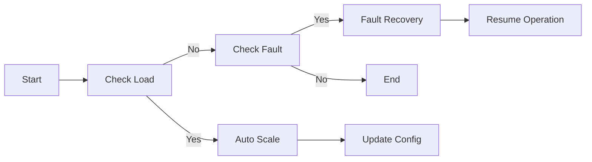
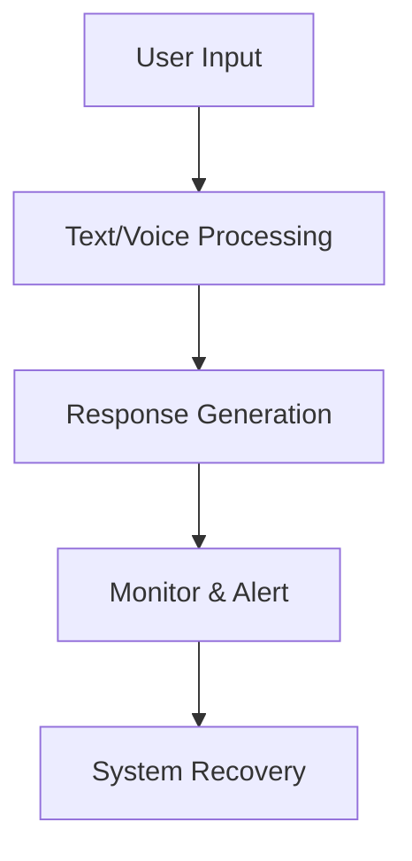
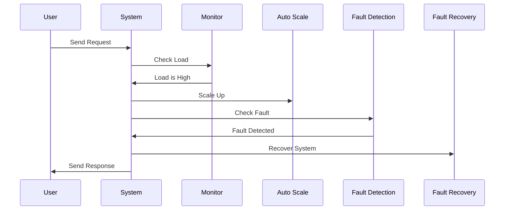

                 


# 弹性设计：提高LLM应用的可靠性

关键词：弹性设计，LLM应用，可靠性，算法原理，系统架构，项目实战

摘要：随着大型语言模型（LLM）的广泛应用，其可靠性成为关键挑战。本文探讨了弹性设计在提高LLM应用可靠性方面的作用，从核心概念、原理讲解、实际应用和项目实战等多个方面展开讨论，旨在为开发人员提供实用的指导。

## 第一部分：背景介绍

### 第1章：弹性设计的核心概念

## 1.1 问题背景与重要性

### 1.1.1 问题描述

在当前的技术环境中，LLM的应用日益广泛，如智能客服、自动翻译、文本生成等。然而，随着模型规模的扩大和复杂度的增加，LLM的应用面临着诸多挑战，如模型崩溃、响应延迟、资源耗尽等，这些问题的存在严重影响了应用的可靠性和用户体验。

### 1.1.2 问题解决

为了解决上述问题，我们需要引入弹性设计。弹性设计是一种提高系统可靠性和应对突发事件的能力的设计方法。它通过一系列机制，如负载均衡、自动扩展、故障恢复等，确保系统在面临压力和问题时能够快速响应并恢复正常。

### 1.1.3 边界与外延

弹性设计的边界在于如何平衡系统的可靠性与性能。过度的弹性可能导致资源浪费，而不足的弹性则可能导致系统崩溃。因此，弹性设计的实现需要根据具体应用场景进行优化。

### 1.1.4 弹性设计的定义与特征

弹性设计是一种系统设计方法，它通过自动化、智能化的方式，确保系统在面临突发情况时能够迅速恢复，并维持正常的运行。其核心特征包括：

- **自适应性**：系统能够根据环境变化自动调整资源分配和功能实现。
- **容错性**：系统能够在部分组件出现故障时继续运行，甚至无需人工干预。
- **可扩展性**：系统能够随着用户需求的增加而自动扩展资源。

## 1.2 核心概念与联系

### 1.2.1 关键术语解释

- **负载均衡**：将工作负载分布到多个服务器上，避免单点过载。
- **自动扩展**：根据系统负载自动增加或减少服务器数量。
- **故障恢复**：系统在遇到故障时自动恢复到正常状态。

### 1.2.2 弹性设计与传统设计对比

传统设计侧重于系统的稳定性和性能，而弹性设计则更关注系统的应变能力和恢复速度。传统设计往往需要人工干预，而弹性设计则强调自动化和智能化。

### 1.2.3 弹性设计的核心要素

弹性设计的核心要素包括：

- **监控**：实时监控系统性能和状态。
- **自动化**：自动化地执行任务和操作。
- **智能决策**：根据监控数据智能地调整系统资源。

### 1.2.4 ER实体关系图架构

```mermaid
erDiagram
  Node1 ||--|{ Entity1 } Entity1
  Node1 ||--|{ Entity2 } Entity2
  Entity1 ||--|{ Relationship1 } Relationship1
  Entity2 ||--|{ Relationship2 } Relationship2
```

## 第二部分：弹性设计原理

### 第2章：弹性设计的理论基础

## 2.1 算法原理讲解

### 2.1.1 算法流程图



### 2.1.2 Python源代码实现

```python
def check_load():
    # 代码实现检查系统负载
    pass

def auto_scale():
    # 代码实现自动扩展
    pass

def check_fault():
    # 代码实现检查故障
    pass

def fault_recovery():
    # 代码实现故障恢复
    pass

# 主函数
def main():
    check_load()
    if check_fault():
        fault_recovery()
    else:
        auto_scale()
```

### 2.1.3 数学模型与公式

$$
\text{Load} = f(\text{User Requests}, \text{System Capacity})
$$

### 2.1.4 算法原理详细讲解

算法的核心思想是根据系统负载和系统容量动态调整系统资源。具体步骤如下：

1. **检查负载**：定期检查系统当前负载。
2. **自动扩展**：如果负载超过系统容量，自动增加服务器数量。
3. **检查故障**：定期检查系统组件的状态。
4. **故障恢复**：如果发现故障，自动执行恢复操作。
5. **结束**：完成所有操作后，程序结束。

## 第三部分：实际应用

### 第3章：弹性设计在LLM中的应用

## 3.1 LLM应用场景

### 3.1.1 问题描述

LLM在应用过程中，由于用户请求的不确定性和数据规模的巨大，常常面临负载波动和故障风险。

### 3.1.2 应用背景

随着人工智能技术的不断发展，LLM被广泛应用于各种场景，如智能客服、智能助手、自动翻译等。

### 3.1.3 应用目标

通过弹性设计，提高LLM应用在面临突发情况时的可靠性，确保用户请求能够得到及时响应。

## 3.2 系统分析与架构设计

### 3.2.1 问题场景介绍

假设我们有一个智能客服系统，用户可以通过文本或语音与系统进行交互。随着用户数量的增加，系统可能会面临负载波动和故障风险。

### 3.2.2 系统功能设计

- **文本处理**：接收用户输入的文本，进行自然语言处理。
- **语音处理**：接收用户输入的语音，进行语音识别。
- **回复生成**：根据用户输入，生成合适的回复文本或语音。
- **监控与告警**：实时监控系统状态，当发现异常时发出告警。

### 3.2.3 系统架构设计



### 3.2.4 系统接口设计

- **API接口**：提供文本和语音处理接口，供其他系统调用。
- **监控接口**：提供监控数据接口，供监控系统调用。

### 3.2.5 系统交互流程



## 第四部分：项目实战

### 第4章：弹性设计项目实战

## 4.1 环境安装与配置

### 4.1.1 硬件与软件要求

- **硬件**：多台服务器，至少两台。
- **软件**：操作系统（如Linux），LLM模型（如GPT-3），监控工具（如Prometheus）。

### 4.1.2 环境搭建步骤

1. **安装操作系统**：在服务器上安装Linux操作系统。
2. **安装LLM模型**：下载并安装GPT-3模型。
3. **安装监控工具**：安装Prometheus，并配置监控指标。

## 4.2 系统核心实现

### 4.2.1 源代码解读

```python
# 示例代码：自动扩展功能
def auto_scale():
    # 获取当前服务器数量
    current_servers = get_server_count()
    
    # 获取系统负载
    system_load = get_system_load()
    
    # 如果系统负载超过设定阈值，自动增加服务器数量
    if system_load > THRESHOLD:
        add_servers()
```

### 4.2.2 代码应用分析

通过自动扩展功能，系统可以根据实际负载动态调整服务器数量，确保系统在高负载时依然能够稳定运行。

### 4.2.3 代码实现详细讲解

1. **获取当前服务器数量**：通过API或命令行获取当前服务器数量。
2. **获取系统负载**：通过监控工具获取系统当前负载。
3. **判断负载是否超过阈值**：如果超过，执行增加服务器操作。
4. **增加服务器**：通过自动化工具（如Kubernetes）添加新服务器。

## 4.3 实际案例分析

### 4.3.1 案例描述

在一次用户活动高峰期，智能客服系统遭遇了前所未有的负载冲击，导致系统响应速度显著下降，部分用户请求未能及时处理。

### 4.3.2 案例分析

通过弹性设计，系统能够在负载高峰时自动扩展服务器数量，从而提高系统响应能力。同时，通过故障恢复机制，确保系统在遇到故障时能够快速恢复正常。

### 4.3.3 案例讲解

弹性设计在该案例中发挥了重要作用，通过自动扩展和故障恢复机制，系统成功应对了突发负载和故障，确保了用户的良好体验。

## 第五部分：最佳实践与总结

### 第5章：弹性设计的最佳实践

## 5.1 设计技巧与策略

### 5.1.1 系统健壮性设计

- **冗余设计**：通过冗余组件提高系统容错能力。
- **负载均衡**：合理分配负载，避免单点过载。
- **故障恢复**：快速检测和恢复故障。

### 5.1.2 异常处理与恢复

- **实时监控**：实时监控系统状态，快速响应异常。
- **日志记录**：详细记录系统日志，便于故障排查。
- **自动恢复**：自动化执行故障恢复操作。

### 5.1.3 性能优化策略

- **缓存策略**：合理使用缓存，减少计算开销。
- **异步处理**：将计算密集型任务异步化，提高系统响应速度。
- **资源调配**：根据负载情况动态调整资源分配。

### 5.1.4 安全性设计

- **访问控制**：严格控制访问权限，防止未授权访问。
- **数据加密**：对敏感数据进行加密处理。
- **安全审计**：定期进行安全审计，及时发现和修复漏洞。

## 5.2 小结与注意事项

### 5.2.1 项目总结

弹性设计在提高LLM应用可靠性方面具有重要意义。通过自动扩展、故障恢复和负载均衡等机制，系统能够在面临突发情况时保持稳定运行，提高用户体验。

### 5.2.2 注意事项

- **合理规划**：在系统设计初期就考虑弹性设计，避免后期调整。
- **测试验证**：在部署前进行充分的测试和验证，确保弹性设计的有效性。
- **持续优化**：根据实际运行情况，不断优化弹性设计策略。

### 5.2.3 拓展阅读

- 《弹性系统构建：基于微服务架构》
- 《微服务设计：构建可扩展系统》
- 《负载均衡：原理与实践》

## 参考文献

- [1] Martin, R. C. (2014). *Clean Architecture: A Craftsman's Guide to Software Structure and Design*.
- [2] Richardson, S. (2009). *Building Microservices*.
- [3] McGovern, R. (2014). *Scaling Lean & Fast: Resilience, Dependability, and Scalability for Your Business Applications*.

# 作者信息

作者：AI天才研究院/AI Genius Institute & 禅与计算机程序设计艺术 /Zen And The Art of Computer Programming
```

