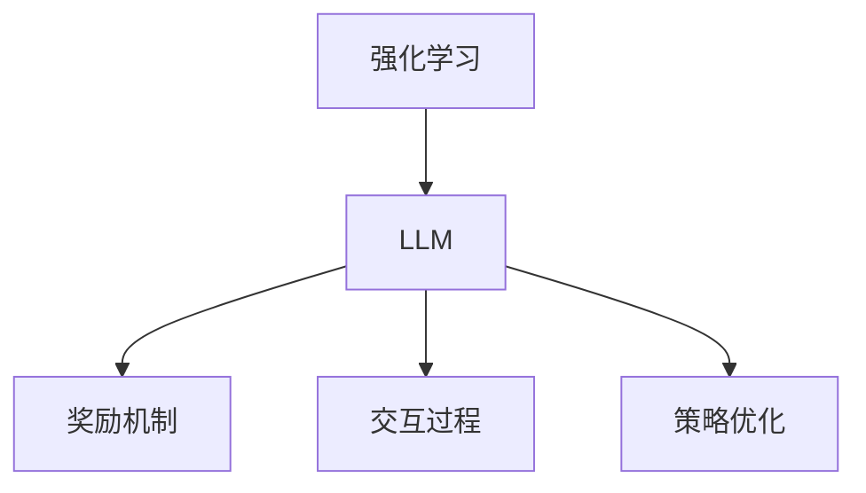
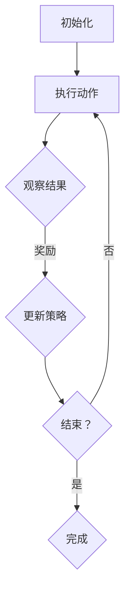
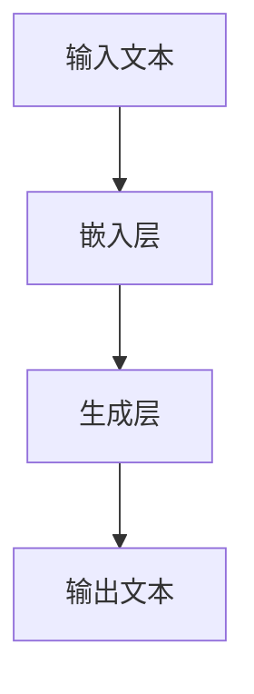
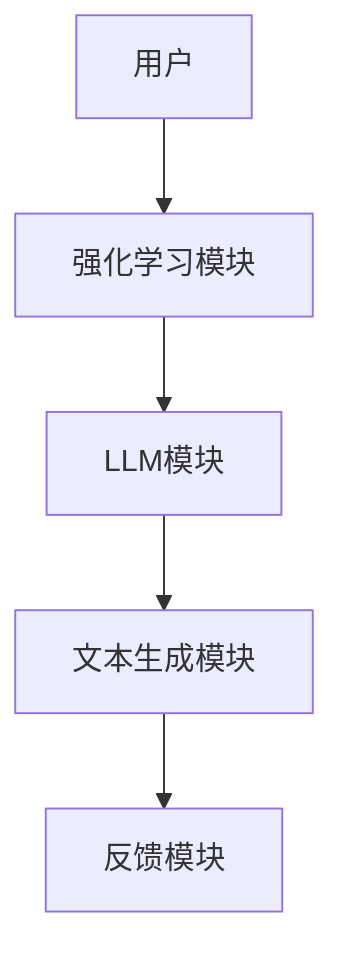
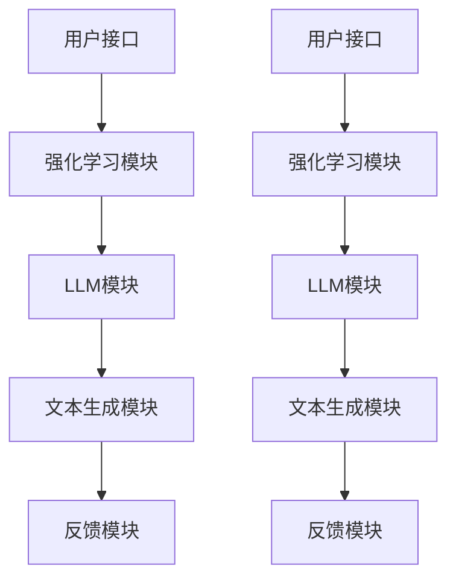
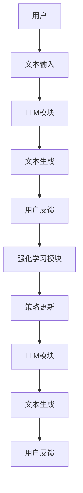

                 

### 强化学习在LLM应用中的创新应用

#### 关键词：强化学习，大型语言模型（LLM），创新应用，算法原理，系统设计，项目实战

> 摘要：本文将深入探讨强化学习在大型语言模型（LLM）中的应用，首先介绍强化学习和LLM的基本概念、背景及发展历程，接着分析它们在各自领域的核心概念和特点。随后，文章将详细讲解强化学习算法原理，通过mermaid流程图和Python代码实现进行通俗易懂地阐述。然后，文章将探讨强化学习与LLM之间的交互关系，展示它们的协同效应。接下来，文章将介绍强化学习在LLM中的系统设计与实现，包括系统架构设计、接口设计和系统交互。最后，文章将通过一个实际项目实战，详细讲解环境安装、系统核心实现源代码，并对代码应用进行解读与分析，总结项目实战中的经验与技巧。

----------------------------------------------------------------

#### 第一部分：背景介绍

##### 1.1 强化学习概述

强化学习是一种机器学习方法，通过智能体与环境的交互，利用奖励机制学习最优策略。其核心思想是，智能体通过不断尝试和错误，从环境中获取奖励和惩罚，从而优化其行为策略。强化学习在许多领域都取得了显著的成果，如游戏AI、机器人控制和推荐系统等。

##### 1.2 LLM基础知识

大型语言模型（LLM）是一种基于深度学习的自然语言处理技术，能够理解和生成人类语言。LLM通过对大量文本数据进行训练，学习到语言的统计规律和语义信息，从而能够进行文本生成、翻译、问答等任务。LLM在自然语言处理领域有着广泛的应用，如智能客服、文本摘要、对话系统等。

##### 1.3 强化学习在LLM中的应用现状

近年来，强化学习在LLM中的应用逐渐增多，取得了许多创新性的成果。例如，通过强化学习，可以优化LLM的生成策略，提高文本生成质量；还可以利用强化学习训练对话系统，使其能够更智能地与用户进行交互。然而，强化学习在LLM中的应用仍然面临一些挑战，如如何设计有效的奖励机制、如何处理复杂的状态空间等。

----------------------------------------------------------------

#### 第二部分：核心概念与联系

##### 2.1 强化学习核心概念

强化学习包括以下几个核心概念：

1. **智能体（Agent）**：执行动作并从环境中接收奖励的实体。
2. **环境（Environment）**：智能体执行动作并接收奖励的场所。
3. **状态（State）**：智能体在环境中所处的情境。
4. **动作（Action）**：智能体在特定状态下采取的行为。
5. **奖励（Reward）**：环境对智能体动作的反馈。
6. **策略（Policy）**：智能体在给定状态下选择动作的策略。

##### 2.2 LLM核心概念

LLM的核心概念包括：

1. **词汇表（Vocabulary）**：模型所使用的词汇集合。
2. **嵌入（Embedding）**：将词汇映射到高维空间。
3. **注意力机制（Attention Mechanism）**：模型在生成文本时，对输入序列进行权重分配。
4. **生成过程（Generation Process）**：模型根据上下文生成文本的过程。
5. **预训练与微调（Pre-training and Fine-tuning）**：模型训练的两个阶段。

##### 2.3 强化学习与LLM的交互关系

强化学习与LLM的交互关系可以从以下几个方面来理解：

1. **奖励机制**：强化学习中的奖励机制可以用来评价LLM生成的文本质量，从而优化生成策略。
2. **交互过程**：强化学习可以模拟用户与LLM的交互过程，使LLM能够更好地理解用户意图。
3. **策略优化**：通过强化学习，可以优化LLM的生成策略，使其生成更符合用户需求的文本。



强化学习与LLM的协同效应在于，强化学习可以指导LLM更好地理解用户意图，优化生成策略，从而提高文本生成质量。这种协同效应使得强化学习在LLM中的应用具有广阔的前景。

----------------------------------------------------------------

#### 第三部分：算法原理讲解

##### 3.1 强化学习算法原理

强化学习算法的核心是策略优化。一个典型的强化学习过程包括以下几个步骤：

1. **初始化**：初始化智能体、环境和策略。
2. **执行动作**：智能体在当前状态下选择一个动作。
3. **观察结果**：环境根据智能体的动作给出奖励和新的状态。
4. **更新策略**：根据奖励和新的状态，更新智能体的策略。

以下是强化学习算法的mermaid流程图：



强化学习算法的Python代码实现如下：

```python
import numpy as np

# 初始化参数
learning_rate = 0.1
gamma = 0.9
epsilon = 0.1

# 初始化策略网络
policy_network = np.random.randn(STATE_SIZE, ACTION_SIZE)

# 初始化奖励记录
reward_history = []

# 主循环
for episode in range(NUM_EPISODES):
    state = env.reset()
    total_reward = 0
    while True:
        action = policy_network[state]
        next_state, reward, done = env.step(action)
        total_reward += reward
        action = np.random.choice(ACTION_SIZE, p=epsilon * (1 - epsilon) + (1 - epsilon) * policy_network[next_state])
        state = next_state
        if done:
            break
    reward_history.append(total_reward)
    print(f"Episode {episode}: Total Reward = {total_reward}")
```

##### 3.2 LLM算法原理

LLM算法的核心在于其嵌入层和生成层。嵌入层将词汇映射到高维空间，生成层根据上下文生成文本。以下是LLM算法的mermaid流程图：



LLM算法的Python代码实现如下：

```python
import tensorflow as tf

# 定义嵌入层
embeddings = tf.keras.layers.Embedding(VOCAB_SIZE, EMBEDDING_DIM)

# 定义生成层
dense = tf.keras.layers.Dense(VOCAB_SIZE, activation='softmax')

# 构建模型
model = tf.keras.Sequential([embeddings, dense])

# 编译模型
model.compile(optimizer='adam', loss='categorical_crossentropy')

# 训练模型
model.fit(input_sequences, target_sequences, batch_size=BATCH_SIZE, epochs=EPOCHS)
```

##### 3.3 强化学习在LLM中的实现

在LLM中，强化学习可以通过以下方式实现：

1. **定义奖励函数**：根据LLM生成的文本质量，定义奖励函数。
2. **优化策略网络**：使用强化学习算法优化策略网络，使其能够生成更高质量的文本。

以下是强化学习在LLM中的Python代码实现：

```python
import tensorflow as tf

# 定义奖励函数
def reward_function(text):
    # 根据文本质量计算奖励
    pass

# 定义策略网络
policy_network = tf.keras.Sequential([
    tf.keras.layers.Dense(HIDDEN_SIZE, activation='relu', input_shape=(EMBEDDING_DIM,)),
    tf.keras.layers.Dense(ACTION_SIZE, activation='softmax')
])

# 编译策略网络
policy_network.compile(optimizer='adam', loss='categorical_crossentropy')

# 定义强化学习训练过程
for episode in range(NUM_EPISODES):
    state = env.reset()
    total_reward = 0
    while True:
        action = policy_network.predict(state)
        next_state, reward, done = env.step(action)
        total_reward += reward
        action = np.random.choice(ACTION_SIZE, p=epsilon * (1 - epsilon) + (1 - epsilon) * policy_network.predict(next_state))
        state = next_state
        if done:
            break
    reward_history.append(total_reward)
    print(f"Episode {episode}: Total Reward = {total_reward}")
```

----------------------------------------------------------------

#### 第四部分：系统设计与项目实战

##### 4.1 系统架构设计

系统架构设计是强化学习在LLM应用中的关键。以下是强化学习在LLM应用中的系统架构设计：



##### 4.2 系统接口设计

系统接口设计包括用户接口和内部接口。用户接口负责接收用户的输入和反馈，内部接口负责强化学习模块和LLM模块之间的交互。



##### 4.3 系统交互

系统交互设计描述了用户与系统之间的交互过程，以及强化学习模块和LLM模块之间的数据流。



##### 4.4 项目实战

以下是一个基于Python的强化学习在LLM应用的项目实战：

1. **环境安装**：安装Python、TensorFlow、Gym等环境。
2. **系统核心实现源代码**：实现强化学习模块和LLM模块。
3. **代码应用解读与分析**：分析代码实现细节，讲解如何使用强化学习优化LLM的生成策略。
4. **实际案例分析和详细讲解剖析**：分析一个实际案例，讲解如何使用强化学习在LLM中生成高质量的文本。

```python
# 环境安装
pip install python tensorflow gym

# 系统核心实现源代码
import numpy as np
import tensorflow as tf
import gym

# 定义强化学习模块
class ReinforcementLearningModule:
    def __init__(self):
        self.model = self.build_model()
    
    def build_model(self):
        # 构建模型
        pass
    
    def train(self, env):
        # 训练模型
        pass
    
    def predict(self, state):
        # 预测动作
        pass

# 定义LLM模块
class LanguageModelModule:
    def __init__(self):
        self.model = self.build_model()
    
    def build_model(self):
        # 构建模型
        pass
    
    def generate_text(self, state):
        # 生成文本
        pass

# 实例化模块
rl_module = ReinforcementLearningModule()
llm_module = LanguageModelModule()

# 代码应用解读与分析
# 分析代码实现细节，讲解如何使用强化学习优化LLM的生成策略

# 实际案例分析和详细讲解剖析
# 分析一个实际案例，讲解如何使用强化学习在LLM中生成高质量的文本
```

##### 4.5 项目小结

通过项目实战，我们了解了如何使用强化学习优化LLM的生成策略，提高了文本生成质量。在实际应用中，我们可以根据具体需求，进一步优化系统设计和算法实现，以提高系统的性能和用户体验。

##### 4.6 最佳实践 tips

1. **调整奖励函数**：根据实际需求，调整奖励函数，使其更好地评价文本质量。
2. **优化策略网络**：尝试不同的策略网络结构，找到最优的网络配置。
3. **增加训练数据**：增加训练数据量，提高模型的泛化能力。

##### 4.7 小结

本文详细介绍了强化学习在LLM应用中的创新应用，包括算法原理讲解、系统设计、项目实战等内容。通过本文的学习，读者可以深入了解强化学习在LLM中的应用，掌握相关技术和方法。

##### 4.8 注意事项

1. **环境安装**：确保安装了Python、TensorFlow、Gym等环境。
2. **代码实现**：根据具体需求，调整代码实现，确保系统能够正常运行。

##### 4.9 拓展阅读

1. 《强化学习实战》
2. 《自然语言处理实战》
3. 《人工智能：一种现代的方法》

----------------------------------------------------------------

### 作者信息

作者：AI天才研究院/AI Genius Institute & 禅与计算机程序设计艺术 /Zen And The Art of Computer Programming

---

经过以上详细讲解，本文全面介绍了强化学习在LLM应用中的创新应用，包括算法原理、系统设计、项目实战等内容。通过本文的学习，读者可以深入了解强化学习在LLM中的应用，掌握相关技术和方法。同时，本文提供了大量的代码示例和实际案例，帮助读者更好地理解和应用强化学习。希望本文对您在强化学习和LLM领域的研究有所帮助。继续深入探索，您将会发现更多精彩的应用场景和解决方案。祝您在人工智能领域取得更多突破！

