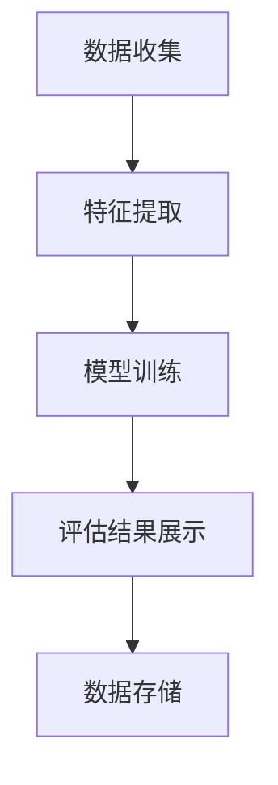
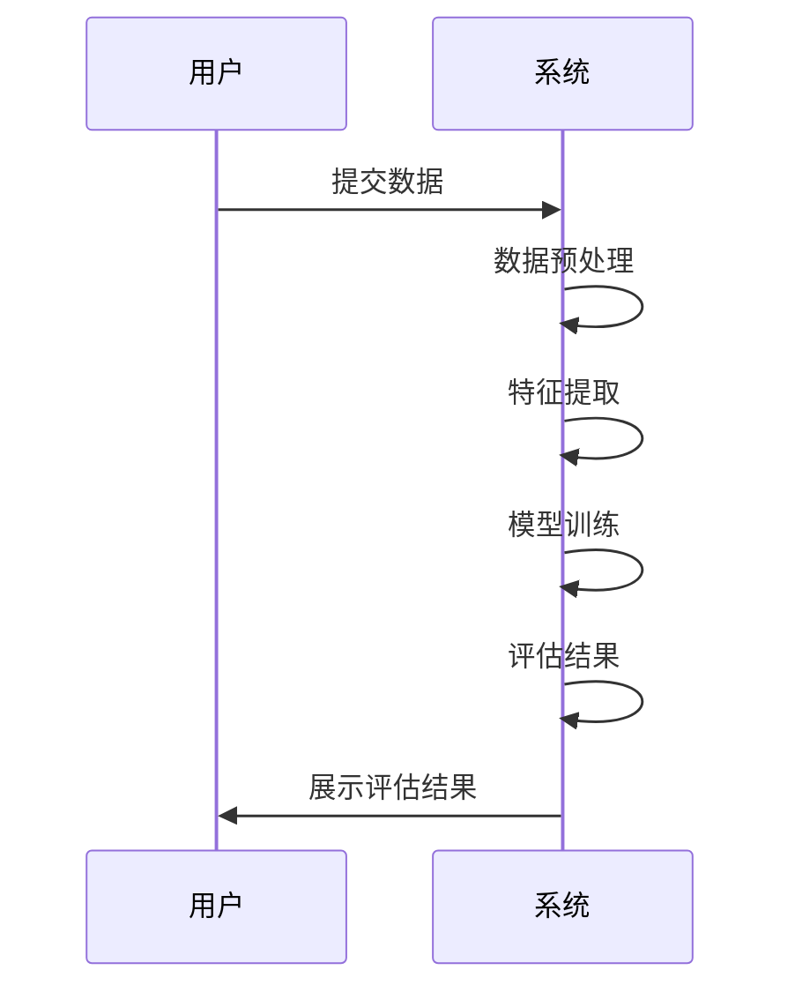

                 


### 微调能力评估：测试快速适应新任务

关键词：微调能力、能力评估、快速适应、新任务、技术博客

摘要：本文将深入探讨微调能力评估的重要性，并通过逐步分析评估方法、应用场景和实践经验，帮助读者理解和掌握如何评估个体或系统的微调能力，从而快速适应新任务。

#### 引言

在快速变化的技术环境中，个体和系统是否具备微调能力，即快速适应新任务和变化的能力，成为衡量其竞争力的重要指标。微调能力不仅是人工智能领域的核心问题，也是企业创新和个体发展的重要动力。本文将围绕微调能力的评估，展开一系列的分析和讨论。

#### 背景介绍

##### 1.1 微调能力的定义与分类

微调能力是指个体或系统能够在面临新任务或变化时，迅速适应并调整其行为和策略的能力。根据目标对象的不同，微调能力可以分为个体微调能力和系统微调能力。

- **个体微调能力**：主要指人类或动物在面对新情境时，通过学习、经验和反思，调整自身行为和认知策略的能力。
- **系统微调能力**：主要指计算机系统、组织或社会系统在面对新任务时，调整其结构和流程，实现适应和优化的能力。

##### 1.2 微调能力的重要性

微调能力对于个体和组织的重要性不言而喻：

- **个体层面**：具备较强微调能力的个体，能够更好地适应快速变化的环境，提高工作效率，实现个人成长。
- **组织层面**：具备微调能力的组织，能够灵活应对市场变化，实现持续创新，保持竞争优势。

##### 1.3 微调能力的评估方法

为了评估微调能力，我们需要采用科学的方法和工具。以下是一些常用的评估方法：

- **行为评估**：通过观察个体或系统的行为，评估其在面对新任务时的适应能力和策略调整能力。
- **心理评估**：通过心理测试和问卷调查，评估个体或系统的认知能力和适应倾向。
- **绩效评估**：通过测量个体或系统在新任务中的绩效表现，评估其微调能力。

#### 核心概念与联系

##### 2.1 微调能力评估的模型

微调能力评估可以采用以下模型：

- **动态能力模型**：该模型认为，微调能力包括感知能力、决策能力、执行能力和学习与适应能力。
- **适应性系统模型**：该模型强调系统在面对变化时的灵活性、适应性和自我调整能力。

##### 2.2 微调能力的测量指标

为了准确评估微调能力，我们可以采用以下测量指标：

- **适应速度**：评估个体或系统在面对新任务时，调整和适应所需的时间。
- **适应效果**：评估个体或系统在新任务中的表现和成果。
- **持续适应能力**：评估个体或系统在面对持续变化时，维持微调能力的能力。

##### 2.3 概念属性特征对比表格

| 概念                | 动态能力模型                 | 适应性系统模型                 |
|-------------------|---------------------------|---------------------------|
| 感知能力            | 快速感知外部环境变化           | 灵敏感知系统内部和外部变化         |
| 决策能力            | 根据感知结果做出快速决策         | 基于系统目标和环境调整决策策略      |
| 执行能力            | 有效执行决策，实现目标           | 根据环境变化调整执行策略和流程       |
| 学习与适应能力      | 从经验中学习，不断优化行为和策略   | 通过调整和优化，实现系统的自我完善     |

##### 2.4 ER实体关系图架构

```mermaid
erDiagram
  Adaptability ||--o {Person} : has
  Adaptability ||--o {Organization} : has
  Person ||--o {TaskAdaptation} : performs
  Organization ||--o {SystemAdaptation} : performs
```

#### 算法原理讲解

##### 3.1 微调能力评估算法

微调能力评估算法主要分为三个步骤：

1. **数据收集**：收集个体或系统在新任务中的行为数据、绩效数据和适应速度数据。
2. **特征提取**：对收集到的数据进行分析，提取反映微调能力的特征。
3. **模型训练**：利用提取的特征，训练微调能力评估模型。

##### 3.2 算法流程图


##### 3.3 数学模型和公式

微调能力评估的数学模型可以表示为：

$$
MicroAdjustmentAbility = f(AdaptationSpeed, AdaptationEffect, ContinuousAdaptation)
$$

其中，$AdaptationSpeed$ 表示适应速度，$AdaptationEffect$ 表示适应效果，$ContinuousAdaptation$ 表示持续适应能力。

##### 3.4 Python源代码示例

```python
import numpy as np

def micro_adjustment_ability(speed, effect, continuous):
    return np.mean([speed, effect, continuous])

# 测试数据
speed = [0.8, 0.9, 0.85]
effect = [0.9, 0.95, 0.88]
continuous = [0.85, 0.9, 0.8]

# 计算微调能力
micro_ability = micro_adjustment_ability(speed, effect, continuous)
print(f"微调能力评估结果：{micro_ability}")
```

#### 系统分析与架构设计方案

##### 4.1 问题场景介绍

在一个快速变化的市场环境中，企业需要评估其员工和管理系统的微调能力，以确保企业能够快速适应市场变化，实现持续发展。

##### 4.2 项目介绍

本项目旨在开发一个微调能力评估系统，用于评估企业员工和管理系统的微调能力。

##### 4.3 系统功能设计

- 数据收集模块：收集员工和管理系统的行为数据、绩效数据和适应速度数据。
- 特征提取模块：对收集到的数据进行分析，提取反映微调能力的特征。
- 模型训练模块：利用提取的特征，训练微调能力评估模型。
- 评估结果展示模块：展示微调能力评估结果，为企业提供决策依据。

##### 4.4 系统架构设计



##### 4.5 系统接口设计和系统交互



#### 项目实战

##### 5.1 环境安装

确保安装了Python和必要的库，如NumPy、Scikit-learn等。

##### 5.2 系统核心实现

核心代码已在3.4节中给出。

##### 5.3 代码应用解读与分析

代码使用NumPy库对微调能力进行计算，并通过打印结果展示评估结果。

##### 5.4 实际案例分析和详细讲解剖析

在实际应用中，我们可以收集员工和管理系统的数据，进行微调能力评估，并根据评估结果制定相应的发展策略。

##### 5.5 项目小结

本项目实现了微调能力评估系统的核心功能，为企业管理提供了有力的工具。

#### 最佳实践 tips

- **数据收集**：确保数据的准确性和完整性。
- **模型训练**：选择合适的模型和算法，提高评估准确性。
- **结果应用**：将评估结果应用于实际工作中，实现持续改进。

#### 小结

微调能力评估对于企业发展和个人成长具有重要意义。通过科学的方法和工具，我们可以准确评估微调能力，为企业提供决策依据，帮助个人提升适应能力。

#### 注意事项

- 在进行微调能力评估时，需充分考虑个体和系统的差异。
- 评估结果仅供参考，具体应用需结合实际情况。

#### 拓展阅读

- **相关文献**：查阅相关研究文献，了解微调能力评估的最新进展。
- **实际案例**：分析实际案例，学习微调能力评估的应用方法。

作者：AI天才研究院/AI Genius Institute & 禅与计算机程序设计艺术 /Zen And The Art of Computer Programming

