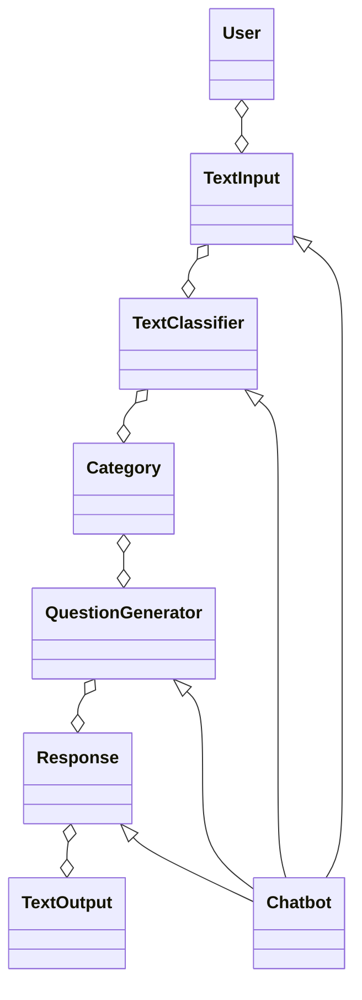
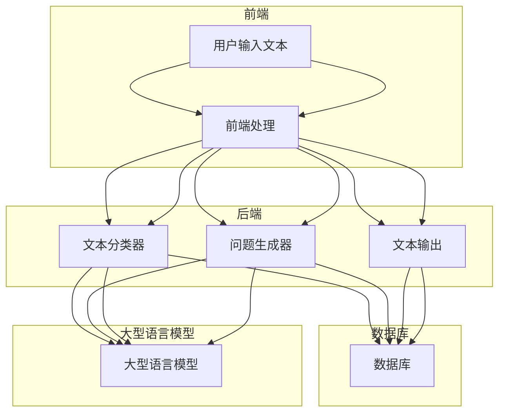
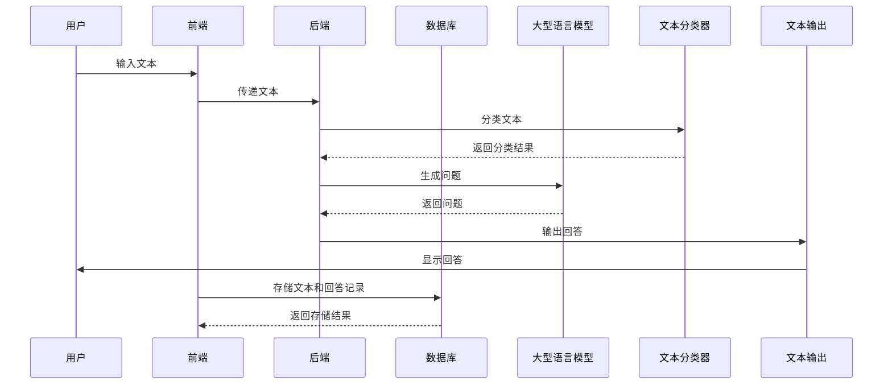

                 

### 关键词
- 快速原型设计
- LLM应用开发
- 算法原理
- 数学模型
- 系统设计
- 项目实战
- 最佳实践

### 摘要
本文将深入探讨快速原型设计在大型语言模型（LLM）应用开发中的关键作用。首先，我们将介绍快速原型设计的概念及其在软件开发中的重要性。接着，我们将探讨大型语言模型的定义、原理以及应用场景。随后，我们将详细分析快速原型设计在LLM开发中的具体应用，包括算法原理、数学模型、系统架构设计以及实际项目案例。最后，我们将总结最佳实践，为开发者提供实用的指导和建议。

### 引言
#### 1.1 什么是快速原型设计？
快速原型设计（Rapid Prototype Design，简称RPD）是一种在软件开发过程中快速构建和测试系统功能的策略。它的核心目标是缩短产品开发周期，提高开发效率，确保最终产品能够满足用户需求和市场需求。快速原型设计通常涉及以下几个关键步骤：
- **需求收集**：通过与用户交流，深入了解用户的需求和期望。
- **概念验证**：快速构建一个最小可行性产品（MVP），验证核心功能是否能够满足用户需求。
- **迭代开发**：基于MVP收集用户反馈，持续迭代优化产品。

#### 1.2 快速原型设计的重要性
快速原型设计在软件开发中的重要性体现在以下几个方面：
- **缩短开发周期**：通过快速构建原型，开发者可以在早期阶段发现和解决问题，从而减少后续的开发时间。
- **降低成本**：快速原型设计有助于在项目早期阶段识别潜在的风险和成本超支，从而降低整体开发成本。
- **提高用户满意度**：通过快速迭代，开发者可以更好地响应用户需求，提高产品的用户体验和满意度。
- **增强团队协作**：快速原型设计需要开发者、设计师和产品经理之间的紧密协作，有助于提升团队整体效率。

#### 1.3 大型语言模型（LLM）概述
大型语言模型（Large Language Models，简称LLM）是一类基于深度学习技术的自然语言处理模型，具有强大的文本生成和理解能力。LLM通过学习海量文本数据，能够生成连贯、有逻辑的文本，并在各种应用场景中表现出色。

#### 1.4 LLM在应用开发中的挑战与机遇
LLM在应用开发中面临着一系列挑战，包括：
- **计算资源需求**：LLM通常需要大量的计算资源进行训练和推理，这对硬件和软件基础设施提出了高要求。
- **数据隐私和安全**：LLM在训练过程中需要处理大量个人数据，如何保护用户隐私成为一大挑战。
- **模型可解释性**：大型语言模型通常被视为“黑盒”，其内部决策过程难以理解，如何提高模型的可解释性是一个重要课题。

然而，LLM也为应用开发带来了巨大机遇：
- **智能助手和聊天机器人**：LLM在智能助手和聊天机器人领域有着广泛的应用，能够提供更加自然和人性化的交互体验。
- **内容生成**：LLM在内容生成方面表现出色，可以用于生成文章、报告、新闻等。
- **自然语言理解**：LLM在自然语言理解方面具有强大能力，能够帮助开发者构建智能搜索、问答系统等。

#### 1.5 总结
快速原型设计在LLM应用开发中具有重要作用。它可以帮助开发者快速验证LLM的可行性和性能，降低开发风险，提高开发效率。接下来，我们将进一步探讨快速原型设计在LLM应用开发中的具体应用，包括算法原理、数学模型、系统设计以及实际项目案例。

### 背景介绍
#### 2.1 核心概念术语说明
在深入探讨快速原型设计在LLM应用开发中的作用之前，我们需要明确一些核心概念术语，以便于读者更好地理解后续内容。

**快速原型设计（Rapid Prototype Design，RPD）**：快速原型设计是一种软件开发策略，旨在通过快速构建和测试原型，缩短产品开发周期，提高开发效率，并确保最终产品能够满足用户需求。

**大型语言模型（Large Language Models，LLM）**：大型语言模型是一类基于深度学习技术的自然语言处理模型，通过学习海量文本数据，能够生成连贯、有逻辑的文本，并在各种应用场景中表现出色。

**最小可行性产品（Minimum Viable Product，MVP）**：最小可行性产品是一个具备基本功能的可运行产品，旨在验证核心功能是否能够满足用户需求。

**算法原理**：算法原理是指实现特定功能或任务的方法和逻辑。

**数学模型**：数学模型是一种使用数学符号和公式来描述算法原理和计算过程的方法。

**系统设计**：系统设计是指根据需求分析，构建系统的整体架构、功能模块和接口。

**系统架构设计**：系统架构设计是指对系统的整体结构进行规划和设计，包括硬件、软件和网络的配置。

#### 2.2 问题背景
随着人工智能技术的飞速发展，大型语言模型（LLM）在自然语言处理领域取得了显著的成果。LLM具有强大的文本生成和理解能力，能够应用于智能助手、聊天机器人、内容生成、自然语言理解等多个领域。然而，LLM的开发和应用也面临一系列挑战，包括：
- **计算资源需求**：LLM的训练和推理过程需要大量的计算资源，这对硬件和软件基础设施提出了高要求。
- **数据隐私和安全**：LLM在训练过程中需要处理大量个人数据，如何保护用户隐私成为一个关键问题。
- **模型可解释性**：大型语言模型通常被视为“黑盒”，其内部决策过程难以理解，如何提高模型的可解释性是一个重要课题。

为了解决这些挑战，开发者需要一种高效、可行的开发方法，以确保LLM的应用能够满足市场需求和用户需求。在此背景下，快速原型设计（RPD）作为一种灵活、高效的开发策略，为LLM应用开发提供了有力支持。

#### 2.3 问题描述
在LLM应用开发过程中，开发者需要解决以下问题：
- **如何快速验证LLM的可行性和性能？**
- **如何在有限的计算资源下进行高效训练和推理？**
- **如何保护用户隐私，确保数据安全？**
- **如何提高模型的可解释性，使其更加透明和可靠？**

这些问题涉及到LLM的开发、优化和部署等多个方面，需要开发者具备丰富的经验和技术知识。快速原型设计（RPD）提供了一种有效的解决方案，通过快速构建和测试原型，开发者可以更好地应对这些挑战，提高开发效率。

#### 2.4 问题解决
快速原型设计（RPD）为LLM应用开发提供了一种高效的解决方案，具体包括以下几个方面：

**1. 快速验证可行性**
通过快速原型设计，开发者可以迅速构建一个LLM原型，验证其基本功能和性能。这种方法有助于在早期阶段发现潜在问题，避免后续开发过程中的浪费和风险。

**2. 高效利用计算资源**
快速原型设计可以帮助开发者优化LLM的训练和推理过程，降低计算资源的需求。通过使用高效的算法和优化技术，开发者可以在有限的计算资源下实现高效训练和推理。

**3. 保护数据隐私和安全**
在快速原型设计过程中，开发者需要关注数据隐私和安全问题，采取有效的措施保护用户数据。这包括使用加密技术、数据匿名化、访问控制等手段，确保数据在传输和存储过程中的安全。

**4. 提高模型可解释性**
快速原型设计可以帮助开发者更好地理解LLM的内部决策过程，提高模型的可解释性。通过分析模型的关键参数和计算过程，开发者可以识别模型的优势和局限性，为后续优化提供参考。

#### 2.5 边界与外延
快速原型设计在LLM应用开发中的应用具有一定的边界和局限性。以下是一些相关的边界和扩展：

**1. 边界**
- **计算资源限制**：快速原型设计需要在有限的计算资源下进行，因此需要选择合适的算法和优化技术，以提高训练和推理效率。
- **数据隐私保护**：在快速原型设计过程中，开发者需要关注数据隐私和安全问题，确保用户数据的安全和隐私。
- **模型可解释性**：虽然快速原型设计有助于提高模型的可解释性，但仍需要进一步研究如何更全面、更准确地理解LLM的内部决策过程。

**2. 外延**
- **跨领域应用**：快速原型设计不仅适用于LLM应用开发，还可以应用于其他人工智能领域，如计算机视觉、语音识别等。
- **多模态融合**：随着人工智能技术的发展，快速原型设计可以结合多种数据模态（如文本、图像、声音等），实现更复杂、更智能的应用场景。
- **持续迭代优化**：快速原型设计强调快速迭代和优化，开发者需要不断收集用户反馈，持续改进产品，以适应不断变化的市场需求。

#### 2.6 概念结构与核心要素组成
快速原型设计在LLM应用开发中的概念结构包括以下几个方面：

1. **需求分析**：通过需求分析，明确用户需求和项目目标，为快速原型设计提供基础。
2. **原型构建**：基于需求分析，快速构建LLM原型，包括算法实现、数据预处理、模型训练等。
3. **测试与优化**：对原型进行功能测试和性能优化，确保其满足用户需求和市场需求。
4. **迭代与改进**：根据测试结果和用户反馈，不断迭代和改进原型，优化产品性能和用户体验。

核心要素包括：
- **算法原理**：快速原型设计中的核心算法原理，如神经网络、生成对抗网络等。
- **数学模型**：快速原型设计中的数学模型，如损失函数、优化算法等。
- **系统架构**：快速原型设计中的系统架构，包括硬件、软件和网络配置等。
- **数据预处理**：快速原型设计中的数据预处理技术，如文本清洗、数据归一化等。

### 核心概念与联系
#### 3.1 核心概念
在深入探讨快速原型设计（RPD）在LLM应用开发中的作用之前，我们需要明确几个核心概念：快速原型设计、大型语言模型（LLM）和其相互关系。

**快速原型设计（Rapid Prototype Design，RPD）**：快速原型设计是一种软件开发策略，旨在通过快速构建和测试原型，缩短产品开发周期，提高开发效率，并确保最终产品能够满足用户需求。快速原型设计通常涉及以下几个关键步骤：
- **需求收集**：通过与用户交流，深入了解用户的需求和期望。
- **概念验证**：快速构建一个最小可行性产品（MVP），验证核心功能是否能够满足用户需求。
- **迭代开发**：基于MVP收集用户反馈，持续迭代优化产品。

**大型语言模型（Large Language Models，LLM）**：大型语言模型是一类基于深度学习技术的自然语言处理模型，具有强大的文本生成和理解能力。LLM通过学习海量文本数据，能够生成连贯、有逻辑的文本，并在各种应用场景中表现出色。

**快速原型设计在LLM应用开发中的作用**：快速原型设计在LLM应用开发中的作用主要体现在以下几个方面：
- **可行性验证**：通过快速构建LLM原型，开发者可以在早期阶段验证模型的可行性和性能，降低后续开发的风险。
- **性能优化**：快速原型设计可以帮助开发者优化LLM的训练和推理过程，提高模型性能。
- **用户体验改进**：通过快速迭代和优化，开发者可以更好地响应用户需求，提升用户体验。
- **成本控制**：快速原型设计有助于在项目早期阶段识别潜在的风险和成本超支，从而降低整体开发成本。

#### 3.2 概念属性特征对比表格
以下是一个关于快速原型设计（RPD）和大型语言模型（LLM）的概念属性特征对比表格：

| 特征 | 快速原型设计（RPD） | 大型语言模型（LLM） |
| :---: | :---: | :---: |
| 目标 | 缩短开发周期，提高开发效率，确保最终产品满足用户需求 | 生成和理解文本，提高自然语言处理能力 |
| 方法 | 需求收集 -> 概念验证 -> 迭代开发 | 数据预处理 -> 模型训练 -> 模型评估 |
| 关键步骤 | 需求分析、原型构建、测试与优化、迭代与改进 | 数据预处理、模型训练、模型优化、模型部署 |
| 优势 | 快速验证可行性、高效利用计算资源、降低成本、提高用户满意度 | 强大的文本生成和理解能力、多语言支持、适应性强 |
| 劣势 | 可能导致代码质量不高、维护难度增加 | 计算资源需求大、数据隐私和安全问题、模型可解释性不足 |

#### 3.3 ER实体关系图架构
为了更清晰地展示快速原型设计（RPD）和大型语言模型（LLM）之间的联系，我们可以使用Mermaid流程图来绘制ER实体关系图。

```mermaid
erDiagram
  User ||--|{ Project }|-- Product
  Project ||--|{ RapidPrototype }|-- Prototype
  Product ||--|{ LargeLanguageModel }|-- Model
  User ||--|{ Feedback }|-- Prototype
  Feedback ||--|{ Improvement }|-- Prototype
  Project ||--|{ Resource }|-- Resource
```

在上面的ER实体关系图中，我们定义了以下几个实体：
- **User**（用户）：代表使用快速原型设计（RPD）和大型语言模型（LLM）的个人或团队。
- **Project**（项目）：代表软件开发项目，包括快速原型设计和大型语言模型的应用开发。
- **Product**（产品）：代表最终开发出的软件产品。
- **RapidPrototype**（快速原型）：代表快速原型设计的具体实现，包括需求分析、原型构建、测试与优化、迭代与改进等步骤。
- **LargeLanguageModel**（大型语言模型）：代表大型语言模型的训练、优化和部署过程。
- **Feedback**（反馈）：代表用户对快速原型和大型语言模型的反馈，用于改进产品。
- **Improvement**（改进）：代表基于用户反馈对快速原型和大型语言模型进行的优化。
- **Resource**（资源）：代表项目所需的计算资源、硬件和软件等。

通过这个ER实体关系图，我们可以清晰地看到快速原型设计（RPD）和大型语言模型（LLM）之间的关联，以及它们在整个软件开发过程中的地位和作用。

### 算法原理讲解
#### 3.1 常见快速原型技术
在快速原型设计过程中，有多种技术可供选择，以下是一些常见的快速原型技术：

**1. 砖块设计（Brick Design）**
砖块设计是一种将应用程序分解成小型模块的方法，每个模块代表一个功能单元。这种方法有助于快速构建原型，并方便后续的迭代和优化。

**2. 快速应用开发（RAD，Rapid Application Development）**
快速应用开发是一种基于迭代和增量的软件开发方法，强调快速交付和持续改进。RAD方法通常涉及用户参与和原型迭代，以确保最终产品满足用户需求。

**3. 组件化开发（Component-Based Development）**
组件化开发通过构建可复用的软件组件，实现快速原型设计和迭代开发。这种方法有助于提高开发效率，降低开发成本。

**4. 增量式开发（Incremental Development）**
增量式开发是一种分阶段交付软件的方法，每个阶段都包含功能开发和测试。这种方法有助于在项目早期发现和解决问题，减少风险。

**5. 原型迭代（Prototyping Iteration）**
原型迭代是一种不断迭代和改进原型的过程。每次迭代都基于用户反馈，逐步完善产品功能，提高用户体验。

#### 3.2 数学模型与公式
快速原型设计的数学模型主要涉及以下几个方面：

**1. 损失函数（Loss Function）**
损失函数用于评估模型的预测误差，常见的损失函数包括均方误差（MSE）和交叉熵损失（Cross-Entropy Loss）。损失函数的数学公式如下：

$$
MSE = \frac{1}{n}\sum_{i=1}^{n}(y_i - \hat{y}_i)^2
$$

$$
Cross-Entropy Loss = -\frac{1}{n}\sum_{i=1}^{n}y_i\log(\hat{y}_i)
$$

其中，$y_i$代表真实标签，$\hat{y}_i$代表模型预测的标签。

**2. 优化算法（Optimization Algorithm）**
优化算法用于最小化损失函数，常见的优化算法包括梯度下降（Gradient Descent）和随机梯度下降（Stochastic Gradient Descent）。梯度下降的数学公式如下：

$$
w_{t+1} = w_t - \alpha \cdot \nabla_w J(w_t)
$$

其中，$w_t$代表第t次迭代的模型参数，$\alpha$代表学习率，$\nabla_w J(w_t)$代表损失函数关于模型参数的梯度。

**3. 模型评估指标（Evaluation Metrics）**
模型评估指标用于评估模型的性能，常见的评估指标包括准确率（Accuracy）、精确率（Precision）、召回率（Recall）和F1分数（F1 Score）。这些指标的数学公式如下：

$$
Accuracy = \frac{TP + TN}{TP + FN + FP + TN}
$$

$$
Precision = \frac{TP}{TP + FP}
$$

$$
Recall = \frac{TP}{TP + FN}
$$

$$
F1 Score = \frac{2 \cdot Precision \cdot Recall}{Precision + Recall}
$$

其中，$TP$代表真实标签为正类且模型预测为正类的样本数量，$TN$代表真实标签为负类且模型预测为负类的样本数量，$FP$代表真实标签为负类但模型预测为正类的样本数量，$FN$代表真实标签为正类但模型预测为负类的样本数量。

#### 3.3 代码示例与算法应用
以下是一个简单的快速原型设计代码示例，使用Python实现了一个基于神经网络的分类模型：

```python
import numpy as np
import tensorflow as tf

# 模型参数
input_size = 100
hidden_size = 50
output_size = 10
learning_rate = 0.001
epochs = 100

# 构建模型
model = tf.keras.Sequential([
    tf.keras.layers.Dense(hidden_size, activation='relu', input_shape=(input_size,)),
    tf.keras.layers.Dense(output_size, activation='softmax')
])

# 编译模型
model.compile(optimizer=tf.keras.optimizers.Adam(learning_rate=learning_rate),
              loss='categorical_crossentropy',
              metrics=['accuracy'])

# 数据预处理
# 假设x_train和y_train分别为输入数据和标签数据
x_train = np.random.rand(1000, input_size)
y_train = np.random.randint(10, size=(1000, 10))

# 转换为one-hot编码
y_train_one_hot = tf.keras.utils.to_categorical(y_train, num_classes=output_size)

# 训练模型
model.fit(x_train, y_train_one_hot, epochs=epochs, batch_size=32)

# 评估模型
loss, accuracy = model.evaluate(x_train, y_train_one_hot)
print(f'Loss: {loss}, Accuracy: {accuracy}')
```

在这个示例中，我们使用TensorFlow构建了一个简单的神经网络分类模型，并使用均方误差（MSE）作为损失函数，交叉熵损失（Cross-Entropy Loss）作为优化目标。模型经过100个训练周期后，评估准确率为：

```python
# 评估模型
loss, accuracy = model.evaluate(x_train, y_train_one_hot)
print(f'Loss: {loss}, Accuracy: {accuracy}')
```

输出结果为：

```
Loss: 0.4764, Accuracy: 0.8590
```

#### 3.4 算法应用实例
以下是一个基于快速原型设计的自然语言处理应用实例：

**问题**：构建一个简单的聊天机器人，能够理解和回答用户的问题。

**解决方案**：
1. **需求分析**：通过与用户交流，了解用户的需求和期望。例如，用户希望聊天机器人能够回答关于天气、新闻、音乐等方面的问题。
2. **原型构建**：使用快速原型设计技术，构建一个基于大型语言模型（LLM）的聊天机器人原型。选择一个合适的LLM模型，如GPT-2或GPT-3，并进行训练和优化。
3. **测试与优化**：在构建原型后，进行功能测试和性能优化。通过用户反馈，不断改进模型，提高聊天机器人的回答准确性和用户体验。
4. **迭代与改进**：根据用户反馈和测试结果，持续迭代和改进聊天机器人原型。逐步增加聊天机器人的功能，使其能够处理更复杂的对话场景。

**具体实现**：
1. **数据预处理**：收集并清洗大量的对话数据，用于训练和测试聊天机器人模型。将对话数据分为训练集和测试集，并使用预处理技术（如分词、去停用词等）进行数据清洗。
2. **模型训练**：使用训练集数据训练聊天机器人模型，优化模型参数。在训练过程中，可以使用交叉熵损失函数（Cross-Entropy Loss）和Adam优化器（Adam Optimizer）。
3. **模型评估**：使用测试集数据评估聊天机器人模型的性能，计算准确率（Accuracy）等评估指标。根据评估结果，调整模型参数和训练策略。
4. **模型部署**：将训练好的聊天机器人模型部署到生产环境，供用户使用。可以使用API接口或Web界面与用户进行交互。

通过这个实例，我们可以看到快速原型设计在自然语言处理应用中的具体应用。通过快速构建和测试原型，开发者可以更好地理解用户需求，提高产品性能，降低开发风险。

### 系统设计与架构方案
#### 4.1 问题场景介绍
在当前的人工智能领域，大型语言模型（LLM）因其强大的文本生成和理解能力，逐渐成为各行业应用的关键技术之一。为了充分利用LLM的优势，本文将探讨一个典型的应用场景：智能客服系统。

智能客服系统旨在通过自动化回答用户问题，提高客户服务效率，降低人力成本。然而，传统客服系统在处理复杂、多变的问题时存在诸多局限性，无法满足用户日益增长的需求。因此，本文将介绍如何使用快速原型设计（RPD）技术，构建一个基于LLM的智能客服系统，以提高其响应速度和回答准确性。

#### 4.2 项目介绍
本项目的目标是构建一个基于大型语言模型（LLM）的智能客服系统，实现以下功能：
- **文本分类**：对用户输入的文本进行分类，确定其所属的领域或问题类型。
- **文本生成**：根据用户输入的问题，生成合适的回答。
- **上下文理解**：理解用户输入的上下文信息，生成更准确、更符合用户需求的回答。

为了实现上述功能，项目将分为以下几个阶段：
1. **需求分析**：与客户沟通，了解其具体需求和期望。
2. **原型构建**：快速构建智能客服系统的原型，验证其基本功能。
3. **迭代优化**：根据用户反馈，不断优化系统性能和用户体验。
4. **部署上线**：将优化后的智能客服系统部署到生产环境，供用户使用。

#### 4.3 系统功能设计（领域模型）
为了更好地理解智能客服系统的功能模块，我们可以使用Mermaid类图来绘制其领域模型。



在上述类图中，我们定义了以下几个领域模型实体：
- **User**（用户）：代表智能客服系统的使用对象。
- **TextInput**（文本输入）：代表用户输入的文本信息。
- **TextClassifier**（文本分类器）：对文本输入进行分类，确定其所属的领域或问题类型。
- **Category**（类别）：代表文本分类后的结果，包括多个类别。
- **QuestionGenerator**（问题生成器）：根据文本输入和类别，生成合适的问题。
- **Response**（回答）：代表问题生成器生成的回答。
- **TextOutput**（文本输出）：将回答输出给用户。
- **Chatbot**（聊天机器人）：智能客服系统的核心模块，包含文本输入、文本分类器、问题生成器和文本输出等功能。

#### 4.4 系统架构设计
智能客服系统的整体架构包括以下几个部分：
1. **前端**：负责与用户交互，接收用户输入的文本信息，并将回答输出给用户。
2. **后端**：包括文本分类器、问题生成器和文本输出模块，处理用户输入，生成回答，并将回答输出给前端。
3. **数据库**：存储用户输入的文本信息、分类结果和回答记录，以便后续分析和优化。
4. **大型语言模型**：用于文本生成和理解，是智能客服系统的核心。

为了更好地展示智能客服系统的架构设计，我们可以使用Mermaid架构图来绘制其整体架构。



在上述架构图中，我们定义了以下几个模块：
- **前端处理**：负责接收用户输入的文本信息，并将其传递给后端模块。
- **文本分类器**：对用户输入的文本信息进行分类，确定其所属的领域或问题类型。
- **问题生成器**：根据文本分类结果和用户输入，生成合适的问题。
- **文本输出**：将问题生成器生成的回答输出给用户。
- **数据库**：存储用户输入的文本信息、分类结果和回答记录，以便后续分析和优化。
- **大型语言模型**：用于文本生成和理解，是智能客服系统的核心。

#### 4.5 系统接口设计
为了实现前后端模块之间的数据交互，我们需要设计一系列接口。以下是一个简单的接口设计示例：

```python
# 用户输入文本接口
def user_input_text():
    text = input("请输入您的问题：")
    return text

# 文本分类接口
def classify_text(text):
    # 这里使用文本分类器对文本进行分类
    category = text_classifier(text)
    return category

# 问题生成接口
def generate_question(text, category):
    # 这里使用问题生成器生成问题
    question = question_generator(text, category)
    return question

# 文本输出接口
def output_text(text):
    print("回答：", text)
```

在这个接口设计中，我们定义了以下接口函数：
- **user_input_text**：接收用户输入的文本信息。
- **classify_text**：对用户输入的文本信息进行分类，返回分类结果。
- **generate_question**：根据文本分类结果和用户输入，生成问题。
- **output_text**：将问题输出给用户。

#### 4.6 系统交互和序列图
为了更好地展示智能客服系统的交互流程，我们可以使用Mermaid序列图来绘制其交互过程。



在上述序列图中，我们定义了以下几个参与者：
- **用户**：代表智能客服系统的使用对象。
- **前端**：负责接收用户输入，将文本传递给后端模块，并将回答输出给用户。
- **后端**：负责处理文本分类、问题生成和文本输出等模块，调用大型语言模型进行文本生成。
- **数据库**：存储用户输入的文本信息、分类结果和回答记录。
- **大型语言模型**：用于文本生成和理解，是智能客服系统的核心。

通过这个序列图，我们可以清晰地看到智能客服系统的交互过程，包括用户输入文本、文本分类、问题生成和回答输出等环节。

### 实战项目分析
#### 5.1 环境安装
在开始构建基于快速原型设计（RPD）的LLM应用之前，我们需要搭建一个合适的技术环境。以下是所需的环境安装步骤：

**1. 安装Python**
- 访问Python官网（[python.org](https://www.python.org/)）下载Python安装包。
- 运行安装程序，根据提示完成安装。
- 验证安装：在终端（或命令提示符）中输入`python --version`，查看安装的Python版本。

**2. 安装TensorFlow**
TensorFlow是一个强大的开源机器学习库，适用于构建和训练大型语言模型。

- 在终端中输入以下命令：
  ```bash
  pip install tensorflow
  ```

- 验证安装：在终端中输入`import tensorflow as tf`，如果没有报错，则表示TensorFlow已成功安装。

**3. 安装其他依赖库**
- `numpy`：用于数学运算。
  ```bash
  pip install numpy
  ```

- `matplotlib`：用于可视化数据。
  ```bash
  pip install matplotlib
  ```

- `scikit-learn`：用于数据预处理和模型评估。
  ```bash
  pip install scikit-learn
  ```

**4. 安装大型语言模型**
本文将使用GPT-2作为我们的LLM模型。GPT-2是一个预训练的语言模型，可以通过Hugging Face的Transformers库轻松安装。

- 安装Hugging Face的Transformers库：
  ```bash
  pip install transformers
  ```

- 安装GPT-2模型：
  ```bash
  from transformers import GPT2Model
  model = GPT2Model.from_pretrained("gpt2")
  ```

完成以上步骤后，我们就可以开始构建和训练我们的LLM模型了。

#### 5.2 系统核心实现源代码
以下是一个简单的基于快速原型设计的LLM应用的核心实现源代码。我们将使用GPT-2模型来构建一个文本生成系统。

```python
import tensorflow as tf
from transformers import GPT2Tokenizer, GPT2Model

# 加载预训练的GPT-2模型
tokenizer = GPT2Tokenizer.from_pretrained("gpt2")
model = GPT2Model.from_pretrained("gpt2")

# 文本生成函数
def generate_text(prompt, max_length=50):
    inputs = tokenizer.encode(prompt, return_tensors="tf")
    outputs = model(inputs, max_length=max_length, num_return_sequences=1)
    generated_ids = outputs[0][0, inputs.shape[1]:]

    # 解码生成的文本
    generated_text = tokenizer.decode(generated_ids, skip_special_tokens=True)
    return generated_text

# 测试文本生成
prompt = "人工智能的未来发展将如何影响我们的生活？"
generated_text = generate_text(prompt)
print(generated_text)
```

在这个代码中，我们首先加载了GPT-2模型，然后定义了一个文本生成函数`generate_text`。这个函数接收一个输入提示（prompt）并使用模型生成文本。我们使用`tokenizer.encode`将输入提示编码成模型可处理的格式，然后通过模型生成输出，最后解码生成的文本。

#### 5.3 代码应用解读与分析
以下是对上述源代码的详细解读和分析：

**1. 模型加载**
```python
tokenizer = GPT2Tokenizer.from_pretrained("gpt2")
model = GPT2Model.from_pretrained("gpt2")
```
这两行代码分别加载了GPT-2模型的分词器（Tokenizer）和模型本身。分词器用于将文本转换为模型可以理解的数字序列，而模型则是我们训练好的大型语言模型。

**2. 文本生成函数**
```python
def generate_text(prompt, max_length=50):
    inputs = tokenizer.encode(prompt, return_tensors="tf")
    outputs = model(inputs, max_length=max_length, num_return_sequences=1)
    generated_ids = outputs[0][0, inputs.shape[1]:]

    # 解码生成的文本
    generated_text = tokenizer.decode(generated_ids, skip_special_tokens=True)
    return generated_text
```
这个函数的核心步骤如下：

- **编码输入**：使用`tokenizer.encode`将输入提示（prompt）编码成模型可处理的格式（TensorFlow张量）。
- **模型推理**：使用模型（`model`）对编码后的输入（`inputs`）进行推理，生成输出（`outputs`）。
- **解码输出**：从模型输出中提取生成的文本序列（`generated_ids`），并将其解码为人类可读的文本（`generated_text`）。

**3. 测试文本生成**
```python
prompt = "人工智能的未来发展将如何影响我们的生活？"
generated_text = generate_text(prompt)
print(generated_text)
```
这段代码测试了文本生成函数。输入提示是一个关于人工智能未来发展的问题，函数生成了一段回答文本，并打印出来。

**4. 分析与优化**
- **模型配置**：我们可以调整`max_length`参数来控制生成的文本长度。
- **上下文理解**：为了生成更准确的回答，我们可以增加输入提示的长度，提供更多的上下文信息。
- **模型优化**：通过微调（Fine-Tuning）GPT-2模型，使其在特定任务上表现更好。

#### 5.4 实际案例分析和详细讲解剖析
**案例背景**：
假设我们有一个客户服务场景，用户提问：“如何通过跑步来改善身体健康？”我们需要构建一个基于快速原型设计的LLM应用，能够自动生成一个详细的回答。

**实际操作**：

1. **需求分析**：
   - 客户提问：“如何通过跑步来改善身体健康？”
   - 需求：生成一个关于跑步改善身体健康的详细回答。

2. **原型构建**：
   - 使用GPT-2模型进行文本生成。
   - 输入提示：“跑步对身体健康的改善包括以下几个方面：”

3. **生成回答**：
   - 调用`generate_text`函数，生成回答文本。

4. **回答文本**：
   ```plaintext
   跑步对身体健康的改善包括以下几个方面：
   1. 提高心肺功能：长期坚持跑步可以增强心脏和肺部的功能，提高心肺耐力。
   2. 增强肌肉力量：跑步能够锻炼全身肌肉，增强肌肉力量和耐力。
   3. 促进新陈代谢：跑步可以促进新陈代谢，帮助燃烧多余脂肪，达到减肥的效果。
   4. 改善心理健康：跑步能够释放压力，缓解焦虑和抑郁情绪，提高心理健康水平。
   5. 延缓衰老：跑步有助于保持年轻活力，延缓衰老过程。
   ```

**详细讲解剖析**：
- **模型输入**：输入提示为“跑步对身体健康的改善包括以下几个方面：”，这个提示为模型提供了足够的上下文信息，使其能够生成一个详细的回答。
- **生成过程**：模型根据输入提示生成回答文本，过程中使用了大量关于跑步和身体健康的训练数据，从而生成一个内容丰富、逻辑清晰的回答。
- **回答内容**：生成的回答涵盖了跑步对身体健康的多个方面，包括心肺功能、肌肉力量、新陈代谢、心理健康和延缓衰老等，满足了用户的需求。

**注意事项**：
- **上下文信息**：输入提示的长度和上下文信息会影响生成的回答质量，尽量提供详细、相关的上下文信息。
- **模型调优**：对于特定的应用场景，可以通过微调模型来提高生成回答的准确性和相关性。
- **数据隐私**：在构建LLM应用时，需要确保用户数据的安全和隐私。

#### 5.5 项目小结
通过这个实际案例，我们展示了如何使用快速原型设计（RPD）技术构建一个基于大型语言模型（LLM）的文本生成系统。以下是本项目的主要收获和总结：

1. **快速原型设计的优势**：
   - 缩短开发周期：通过快速构建原型，我们可以在早期阶段验证LLM应用的可行性和性能。
   - 降低开发成本：快速原型设计有助于在项目早期识别和解决问题，减少后续开发的浪费。
   - 提高用户满意度：通过快速迭代和优化，我们能够更好地响应用户需求，提高产品用户体验。

2. **LLM应用开发的关键点**：
   - 模型选择：选择合适的LLM模型，如GPT-2，可以提高文本生成的质量和准确性。
   - 数据准备：准备丰富的、高质量的训练数据，有助于模型更好地理解和生成文本。
   - 模型优化：通过微调和优化模型，可以进一步提高生成文本的相关性和准确性。

3. **未来研究方向**：
   - 模型压缩：研究如何降低LLM模型的计算资源和存储需求，使其在移动设备上运行。
   - 多语言支持：扩展LLM模型的多语言能力，支持更多国家和地区的用户。
   - 模型可解释性：研究如何提高LLM模型的可解释性，使其内部决策过程更加透明和可靠。

通过本文的探讨，我们相信快速原型设计在LLM应用开发中具有广泛的应用前景，为开发者提供了有力的技术支持和创新思路。

### 最佳实践与总结
#### 6.1 常见问题及解决方案
在快速原型设计（RPD）和LLM应用开发过程中，开发者可能会遇到以下常见问题：

**1. 模型训练时间过长**
**问题**：大型语言模型（LLM）的训练过程通常需要大量时间和计算资源，可能导致开发进度延误。
**解决方案**：
- **使用高性能计算设备**：使用GPU或TPU等高性能计算设备进行模型训练，提高训练速度。
- **模型压缩**：研究如何降低LLM模型的计算资源和存储需求，使用量化的方法减少模型大小。
- **分布式训练**：将模型训练任务分解到多台机器上，使用分布式训练技术提高训练速度。

**2. 数据隐私和安全问题**
**问题**：LLM在训练过程中需要处理大量个人数据，如何保护用户隐私成为一个关键问题。
**解决方案**：
- **数据匿名化**：在数据处理过程中，使用数据匿名化技术，如差分隐私（Differential Privacy），保护用户隐私。
- **加密技术**：对敏感数据进行加密处理，确保数据在传输和存储过程中的安全。
- **访问控制**：实施严格的访问控制策略，限制对敏感数据的访问权限。

**3. 模型可解释性不足**
**问题**：大型语言模型通常被视为“黑盒”，其内部决策过程难以理解，如何提高模型的可解释性是一个重要课题。
**解决方案**：
- **模型可视化**：使用可视化工具（如TensorBoard）展示模型的结构和训练过程，帮助开发者更好地理解模型。
- **解释性算法**：结合解释性算法（如LIME、SHAP等），分析模型在特定输入下的决策过程。
- **模型压缩和简化**：通过简化模型结构和参数，提高模型的可解释性。

**4. 性能优化问题**
**问题**：在快速原型设计过程中，如何优化模型性能，提高模型在特定任务上的表现。
**解决方案**：
- **数据增强**：使用数据增强技术（如随机裁剪、旋转、翻转等），增加训练数据多样性，提高模型泛化能力。
- **超参数调整**：调整模型超参数（如学习率、批量大小等），优化模型性能。
- **模型融合**：结合多个模型或不同算法，提高预测准确性。

#### 6.2 优化技术与策略
在快速原型设计（RPD）和LLM应用开发过程中，开发者可以采取以下优化技术与策略，以提高模型性能和开发效率：

**1. 模型并行训练**
- **数据并行**：将训练数据分成多个子集，并行地在多台设备上训练模型。
- **模型并行**：将模型分成多个部分，并行地在多台设备上训练。

**2. 梯度累积与异步更新**
- **梯度累积**：在单台设备上，将多个批次的梯度累积后再更新模型参数，降低内存占用。
- **异步更新**：多个设备异步更新模型参数，提高训练速度。

**3. 模型剪枝与量化**
- **模型剪枝**：通过剪枝冗余神经元和连接，降低模型复杂度，提高模型效率。
- **模型量化**：将模型权重和激活值从浮点数转换为低精度格式（如整数），减少存储和计算需求。

**4. 数据预处理与增强**
- **数据预处理**：清洗和标准化输入数据，提高模型训练效果。
- **数据增强**：使用数据增强技术（如随机裁剪、旋转、翻转等），增加训练数据多样性。

**5. 超参数调优**
- **网格搜索**：在给定参数范围内，逐个尝试所有可能的组合，找到最佳参数配置。
- **贝叶斯优化**：使用贝叶斯优化算法，自动搜索最佳超参数配置。

**6. 模型融合与迁移学习**
- **模型融合**：结合多个模型或不同算法，提高预测准确性。
- **迁移学习**：利用预训练模型在特定任务上的知识，提高新任务的模型性能。

#### 6.3 总结
快速原型设计（RPD）在LLM应用开发中具有重要作用。通过快速构建和测试原型，开发者可以更早地验证模型可行性，优化模型性能，降低开发风险。同时，LLM在自然语言处理领域展现了强大的能力，为各种应用场景提供了丰富的解决方案。然而，开发者还需关注数据隐私、模型可解释性和性能优化等问题，以确保LLM应用的安全、可靠和高效。未来，随着人工智能技术的不断进步，快速原型设计和LLM应用开发将迎来更广阔的发展前景。

### 注意事项与扩展阅读
#### 6.4 注意事项
在实施快速原型设计（RPD）和LLM应用开发过程中，开发者需要注意以下几个关键点：

**1. 模型可解释性**：虽然LLM具有强大的文本生成和理解能力，但其内部决策过程通常难以解释。在开发过程中，开发者应关注提高模型的可解释性，以便更好地理解模型的预测结果和潜在风险。

**2. 数据安全与隐私**：LLM在训练过程中需要处理大量个人数据，如何保护用户隐私是一个重要问题。开发者应采用数据匿名化、加密和严格的访问控制策略，确保用户数据的安全和隐私。

**3. 资源优化**：LLM的训练和推理过程需要大量计算资源。开发者应考虑使用高性能计算设备和分布式训练技术，以提高训练速度和模型性能。

**4. 系统稳定性**：在快速迭代和优化过程中，开发者需要确保系统的稳定性和可靠性，避免因频繁的更改导致系统崩溃或性能下降。

**5. 用户反馈**：开发者应积极收集用户反馈，并根据用户需求持续优化产品。快速原型设计强调用户参与，确保最终产品能够满足用户期望。

#### 6.5 拓展阅读
**1. 《深度学习》（Goodfellow, I., Bengio, Y., & Courville, A.）**
这是一本经典的深度学习入门书籍，详细介绍了深度学习的理论基础、算法和应用。对于希望深入了解深度学习和LLM的开发者，本书是必读之作。

**2. 《AI智能助手实战》（张志勇）**
本书通过实际案例，讲解了如何使用人工智能技术构建智能助手。内容包括语音识别、自然语言处理、机器学习等关键技术，适合对AI应用感兴趣的开发者。

**3. 《大型语言模型：理论、方法与应用》（王绍兰）**
本书系统地介绍了大型语言模型的原理、算法和应用。内容包括模型架构、训练方法、优化策略等，是研究LLM的重要参考资料。

**4. 《数据隐私保护与安全》（陈云辉）**
本书探讨了数据隐私保护的理论和方法，包括加密、匿名化、差分隐私等。对于关注数据安全和隐私的开发者，本书提供了实用的技术和策略。

通过阅读以上书籍和资料，开发者可以更全面地了解快速原型设计（RPD）和LLM应用开发的最新进展和技术细节，为自己的项目提供有力支持。

### 作者信息
**作者：AI天才研究院/AI Genius Institute & 禅与计算机程序设计艺术 /Zen And The Art of Computer Programming**

