                 

### 引言

随着人工智能技术的快速发展，大规模语言模型（LLM）的应用场景日益广泛，从自然语言处理、智能问答、文本生成到个性化推荐系统等，都在各个领域展现出了强大的潜力。然而，当前LLM在个性化推荐系统中的应用仍然面临诸多挑战，特别是在如何提升推荐的个性化程度、解决冷启动问题以及保护用户隐私等方面。本文旨在探讨如何通过技术手段快速提升LLM应用的个性化推荐能力，为相关领域的研究者与实践者提供有益的参考。

#### 关键词

- 大规模语言模型（LLM）
- 个性化推荐系统
- 用户画像
- 冷启动问题
- 推荐算法

#### 摘要

本文首先介绍了大规模语言模型（LLM）在个性化推荐系统中的应用背景和挑战。随后，深入分析了LLM的基本原理和关键技术，如Transformer模型、自适应嵌入等。在此基础上，讨论了用户画像的构建方法及其在个性化推荐系统中的作用。接着，详细阐述了基于LLM的个性化推荐算法的设计与实现，包括算法框架、关键实例以及与现有推荐算法的融合策略。最后，通过实际项目实战和最佳实践分享，总结了提升LLM应用个性化推荐能力的关键技术和注意事项。本文旨在为研究人员和实践者提供一套系统、实用的提升策略，以推动LLM在个性化推荐领域的进一步发展。

## 第2章: 大规模语言模型(MLM)原理

在探讨如何提升LLM应用个性化推荐能力之前，首先需要了解大规模语言模型（MLM）的基本原理。MLM是一种用于预测文本序列的深度学习模型，通过学习大量的文本数据，能够捕捉到文本中的语言规律和模式。本章将介绍MLM的核心概念、基本原理以及关键技术，为后续章节的讨论奠定基础。

### 2.1 MLM的引入

#### 2.1.1 语言模型的作用

语言模型在自然语言处理（NLP）领域中扮演着至关重要的角色。其主要作用包括：

1. **文本生成**：语言模型可以根据给定的文本上下文生成新的文本。这一功能在自动写作、对话系统、机器翻译等领域有着广泛的应用。
2. **文本分类**：语言模型可以帮助判断给定文本所属的类别，如情感分类、主题分类等，这在信息检索和舆情分析等领域具有重要作用。
3. **问答系统**：语言模型能够理解用户的问题，并从大量文本数据中检索出最相关的答案，应用于智能客服、教育辅导等领域。
4. **机器翻译**：语言模型在机器翻译中用于预测目标语言中的下一个词或短语，是翻译系统的重要组成部分。

#### 2.1.2 MLM的发展历程

MLM的发展历程可以追溯到20世纪50年代，当时研究人员开始尝试使用统计模型来预测文本序列。早期的模型包括N-gram模型、n元马尔可夫链等。然而，这些模型在面对长文本时表现不佳，因为它们忽略了上下文中的长期依赖关系。

随着深度学习技术的发展，研究者们提出了基于神经网络的模型，如循环神经网络（RNN）和长短时记忆网络（LSTM）。这些模型在一定程度上解决了长期依赖问题，但仍然存在梯度消失和梯度爆炸等问题。

为了解决这些问题，谷歌在2017年提出了Transformer模型，这是一种基于自注意力机制的全新架构。Transformer模型的提出标志着MLM进入了一个新的时代，它不仅提高了模型的性能，还显著降低了计算复杂度。此后，一系列改进和扩展的Transformer模型，如BERT、GPT等，相继被提出并取得了显著的成果。

### 2.2 MLM的基本原理

#### 2.2.1 语言模型的核心概念

语言模型的核心概念包括：

1. **词嵌入**：将词汇映射到高维向量空间，使得语义相近的词在向量空间中距离较近。
2. **自注意力机制**：通过计算文本序列中每个词与其他词之间的关联度，为每个词分配不同的权重，从而捕捉到文本中的上下文信息。
3. **位置编码**：为文本序列中的每个词分配位置信息，以处理序列中的词序关系。

#### 2.2.2 MLM的数学模型

MLM的数学模型主要包括：

1. **输入层**：输入向量由词嵌入和位置编码组成。
2. **自注意力层**：通过自注意力机制计算文本序列中每个词与其他词之间的关联度。
3. **前馈神经网络**：对自注意力层的输出进行进一步的变换和压缩。
4. **输出层**：生成概率分布，预测下一个词。

数学模型的核心公式如下：

\[ 
\text{Attention}(Q, K, V) = \text{softmax}\left(\frac{QK^T}{\sqrt{d_k}}\right) V 
\]

其中，Q、K、V分别为查询向量、关键向量、值向量，d_k为关键向量的维度。

#### 2.2.3 MLM的训练过程

MLM的训练过程主要包括以下步骤：

1. **数据预处理**：将文本数据转换为词嵌入和位置编码。
2. **模型初始化**：初始化模型参数。
3. **前向传播**：计算输入层、自注意力层、前馈神经网络的输出。
4. **损失计算**：计算模型预测的词与实际词之间的交叉熵损失。
5. **反向传播**：更新模型参数，最小化损失函数。
6. **迭代训练**：重复上述步骤，直到模型收敛。

### 2.3 MLM的关键技术

#### 2.3.1 Transformer模型

Transformer模型是一种基于自注意力机制的深度神经网络模型，由谷歌在2017年提出。其主要优点包括：

1. **并行计算**：通过自注意力机制，Transformer能够实现并行计算，从而显著提高训练速度。
2. **长期依赖**：自注意力机制能够捕捉到文本序列中的长期依赖关系。
3. **结构简洁**：Transformer模型的结构相对简单，易于理解和实现。

#### 2.3.2 自适应嵌入

自适应嵌入是一种用于提高语言模型性能的技术，它通过动态调整词嵌入的维度，使得词嵌入能够更好地适应不同的上下文。自适应嵌入的主要方法包括：

1. **多级嵌入**：将词嵌入分为多个层次，每个层次负责捕捉不同的上下文信息。
2. **动态调整**：根据训练过程中的反馈，动态调整词嵌入的维度，以优化模型的性能。

#### 2.3.3 多语言模型

多语言模型能够同时处理多种语言的文本，从而提高模型的泛化能力。主要方法包括：

1. **统一编码**：将不同语言的文本转换为统一的编码，使得模型能够理解不同语言的语义。
2. **迁移学习**：利用已训练好的多语言模型，对新的语言进行迁移学习，提高模型在新语言上的性能。

### 2.4 MLM的应用场景

#### 2.4.1 文本分类

文本分类是一种常见的应用场景，MLM可以通过学习大量的文本数据，自动将文本分类到预定义的类别中。例如，情感分类、新闻分类、产品评论分类等。

#### 2.4.2 机器翻译

机器翻译是MLM的重要应用之一，通过学习双语文本对，MLM能够预测源语言中的一个词或短语在目标语言中的对应词或短语。现代MLM模型在机器翻译任务上已经取得了显著的进展，能够生成高质量的双语文本。

#### 2.4.3 问答系统

问答系统是一种智能对话系统，MLM可以通过理解用户的问题，从大量文本数据中检索出最相关的答案。问答系统广泛应用于智能客服、教育辅导、医疗咨询等领域。

### 2.5 MLM与个性化推荐的关系

#### 2.5.1 MLM在个性化推荐中的作用

MLM在个性化推荐系统中的作用主要体现在以下几个方面：

1. **文本理解**：MLM能够深入理解文本的语义，从而为推荐系统提供更准确的文本特征。
2. **上下文感知**：MLM可以捕捉到用户行为和上下文信息，从而实现更精确的个性化推荐。
3. **冷启动解决**：MLM可以通过对大量用户数据的分析，为新用户生成初始的用户画像，从而解决冷启动问题。

#### 2.5.2 MLM与推荐算法的融合

MLM与推荐算法的融合主要体现在以下几个方面：

1. **基于内容的推荐**：MLM可以用于生成高质量的文本特征，从而提高基于内容的推荐系统的性能。
2. **协同过滤推荐**：MLM可以用于预测用户对未知物品的评分，从而改进协同过滤推荐算法。
3. **混合推荐**：MLM可以与其他推荐算法（如基于内容的推荐、协同过滤推荐）相结合，形成混合推荐系统，以提高推荐效果。

### 2.6 本章小结

本章介绍了大规模语言模型（MLM）的基本原理和关键技术，包括Transformer模型、自适应嵌入和多语言模型。此外，还讨论了MLM在文本分类、机器翻译和问答系统等应用场景中的重要性，以及MLM在个性化推荐系统中的作用和融合策略。通过本章的学习，读者可以更好地理解MLM的基本原理和应用场景，为后续章节的讨论打下基础。

### 2.7 MLM的核心概念与联系

在深入探讨大规模语言模型（MLM）的核心概念和联系之前，我们需要明确一些关键术语的定义，以便读者能够更好地理解MLM的工作原理和结构。以下是MLM中一些核心概念及其相互关系的详细描述。

#### 2.7.1 核心概念

**1. 词嵌入（Word Embedding）**：词嵌入是将词汇映射到高维向量空间的过程。每个词都被表示为一个向量，这些向量在空间中不仅具有数值意义，还反映了词与词之间的语义关系。常见的词嵌入方法包括Word2Vec、GloVe等。

**2. 自注意力机制（Self-Attention）**：自注意力机制是一种用于计算文本序列中每个词与其他词之间关联度的方法。它通过加权的方式，使得文本序列中的每个词能够自适应地关注其他词的重要信息，从而捕捉到上下文信息。Transformer模型的核心就是自注意力机制。

**3. 位置编码（Positional Encoding）**：位置编码是为了在自注意力机制中引入词的位置信息，因为词在文本序列中的位置对语义有重要影响。位置编码通常通过向词嵌入向量中添加特定的向量来实现。

**4. Transformer模型（Transformer Model）**：Transformer模型是一种基于自注意力机制的深度神经网络模型，最初由Vaswani等人在2017年提出。它被广泛应用于自然语言处理任务，如机器翻译、文本分类和问答系统等。

**5. 语言模型（Language Model）**：语言模型是一种预测文本序列中下一个词或短语的模型。它通过学习大量的文本数据，捕捉到文本中的语言规律和模式，从而能够在给定任意长度的前文序列时，预测下一个词的概率分布。

#### 2.7.2 概念属性特征对比表格

为了更清晰地展示这些概念之间的联系，我们可以通过一个表格来对比它们的主要属性和特征。

| 概念       | 描述                                                         | 关键属性               | 作用                           |
|------------|--------------------------------------------------------------|------------------------|--------------------------------|
| 词嵌入     | 将词汇映射到高维向量空间的过程                             | 维度、相似性           | 语义表示、相似度计算           |
| 自注意力   | 计算文本序列中每个词与其他词之间的关联度                   | 加权、上下文捕获       | 文本理解、语义关联             |
| 位置编码   | 引入词的位置信息，以处理序列中的词序关系                     | 嵌入、位置信息         | 语义序列处理                   |
| Transformer模型 | 基于自注意力机制的深度神经网络模型                         | 并行计算、自注意力     | 文本生成、翻译、分类           |
| 语言模型   | 预测文本序列中下一个词或短语的模型                         | 语言规律、序列预测     | 文本生成、序列处理             |

#### 2.7.3 ER实体关系图架构

为了进一步展示MLM中各个概念之间的逻辑关系，我们可以使用实体关系图（ER图）来描述。ER图能够直观地展示实体之间的关系和属性。

**图 2.1: MLM的ER实体关系图**

```mermaid
erDiagram
    User ||--o{ Document : 作者与文档关系 }
    Document ||--o{ Word : 文档与词关系 }
    Word ||--o{ WordEmbedding : 词与词嵌入关系 }
    Word ||--o{ PositionalEncoding : 词与位置编码关系 }
    WordEmbedding ||--o{ SelfAttention : 词嵌入与自注意力关系 }
    PositionalEncoding ||--o{ TransformerModel : 位置编码与Transformer模型关系 }
    TransformerModel ||--o{ LanguageModel : Transformer模型与语言模型关系 }
```

在该ER图中，用户与文档之间存在一对多的关系，即一个用户可以创建多个文档；文档与词之间存在一对多的关系，即一个文档包含多个词；词与词嵌入、位置编码之间存在关联，词嵌入与自注意力机制、位置编码与Transformer模型之间存在依赖关系；最后，Transformer模型与语言模型之间存在包含关系。

通过上述对比表格和ER图，我们可以更清晰地理解大规模语言模型（MLM）中各个核心概念之间的关系，为后续章节的深入讨论打下坚实基础。

### 2.8 MLM的数学模型

为了深入理解大规模语言模型（MLM）的工作原理，我们需要详细探讨其数学模型。MLM的数学模型主要包括输入层、自注意力层、前馈神经网络和输出层。以下是对这些组成部分及其关键公式的详细讲解。

#### 2.8.1 输入层

输入层是MLM模型的起点，其主要功能是将输入的文本序列转换为向量形式。这个过程涉及词嵌入和位置编码。

1. **词嵌入（Word Embedding）**：词嵌入是将词汇映射到高维向量空间的过程。每个词都被表示为一个向量，这些向量不仅具有数值意义，还能反映词与词之间的语义关系。常用的词嵌入方法包括Word2Vec和GloVe。词嵌入向量通常通过训练大量文本数据获得。

   假设词表中有V个词，每个词对应一个唯一的索引，词嵌入向量的维度为d。词嵌入矩阵W的行向量表示每个词的嵌入向量。对于输入序列\[w_1, w_2, ..., w_n\]，其词嵌入表示为\[ \text{嵌入}_1, \text{嵌入}_2, ..., \text{嵌入}_n \]，即\[ \text{嵌入}_i = W_{i} \]。

2. **位置编码（Positional Encoding）**：位置编码是为了在自注意力机制中引入词的位置信息，因为词在文本序列中的位置对语义有重要影响。位置编码通常通过向词嵌入向量中添加特定的向量来实现。常用的位置编码方法包括绝对位置编码和相对位置编码。

   位置编码向量的大小通常与词嵌入维度一致，即d。对于位置p，其位置编码表示为\[ \text{编码}_p \]。位置编码的生成方式通常为\[ \text{编码}_p = \text{sin}\left(\frac{p}{10000^{2i/d}}\right) \]或\[ \text{编码}_p = \text{cos}\left(\frac{p}{10000^{2i/d}}\right) \]，其中i为词嵌入维度的索引。

输入层的总体输入向量\[ \text{输入}_i \]可以表示为词嵌入和位置编码的叠加：

\[ \text{输入}_i = \text{嵌入}_i + \text{编码}_i \]

#### 2.8.2 自注意力层

自注意力层是MLM模型的核心部分，其主要功能是计算文本序列中每个词与其他词之间的关联度，并为其分配不同的权重。自注意力机制通过加权的方式，使得文本序列中的每个词能够自适应地关注其他词的重要信息。

1. **自注意力计算**：自注意力机制的基本公式为：

\[ 
\text{Attention}(Q, K, V) = \text{softmax}\left(\frac{QK^T}{\sqrt{d_k}}\right) V 
\]

其中，Q、K、V分别为查询向量、关键向量和值向量，d_k为关键向量的维度。Q和K是输入层中的词嵌入向量，V是输入层中的位置编码向量。

Q和K计算相似性矩阵（也称为注意力权重矩阵）：

\[ 
\text{相似性} = \text{softmax}\left(\frac{QK^T}{\sqrt{d_k}}\right) 
\]

然后，将相似性矩阵与V相乘，得到加权后的值向量：

\[ 
\text{加权值} = \text{相似性} \cdot V 
\]

2. **多头自注意力**：为了提高模型的性能，通常采用多头自注意力机制。多头自注意力将输入序列分解为多个子序列，每个子序列独立进行自注意力计算，然后合并结果。假设有h个头，每个头的输出维度为d/h，则总输入维度为d。多头自注意力的输出可以表示为：

\[ 
\text{多头自注意力} = \text{softmax}\left(\frac{QK^T}{\sqrt{d_k/h}}\right) V 
\]

#### 2.8.3 前馈神经网络

前馈神经网络位于自注意力层之后，其主要功能是对自注意力层的输出进行进一步变换和压缩。前馈神经网络通常包含两个全连接层，每个层的激活函数通常为ReLU。

前馈神经网络的输入为自注意力层的输出，其公式为：

\[ 
\text{前馈网络}(\text{输入}, \text{权重}_1, \text{权重}_2) = \text{ReLU}(\text{权重}_1 \cdot \text{输入} + \text{偏置}_1) \cdot \text{权重}_2 + \text{偏置}_2 
\]

#### 2.8.4 输出层

输出层是MLM模型的最终输出部分，其主要功能是生成概率分布，预测下一个词。输出层的输入为前馈神经网络的输出，其公式为：

\[ 
\text{输出} = \text{softmax}(\text{权重} \cdot \text{输入} + \text{偏置}) 
\]

其中，权重和偏置为输出层的参数。

通过上述输入层、自注意力层、前馈神经网络和输出层的组合，MLM模型能够对文本序列进行有效处理和预测。数学模型的详细解释和公式展示，有助于读者深入理解MLM的工作原理和实现细节。

### 2.9 MLM的训练过程

大规模语言模型（MLM）的训练过程是构建高性能语言模型的关键步骤，它涉及多个环节，包括数据预处理、模型初始化、前向传播、损失计算、反向传播和迭代训练。以下是这些步骤的详细说明：

#### 2.9.1 数据预处理

数据预处理是训练过程的第一步，其目标是将原始文本数据转换为模型可处理的格式。主要步骤如下：

1. **文本清洗**：去除文本中的无关符号、停用词和噪声，以提高数据质量。
2. **分词**：将文本拆分为单词或子词，以便进行词嵌入。
3. **词汇表构建**：构建包含所有单词或子词的词汇表，并为每个词或子词分配唯一的索引。
4. **序列生成**：将处理后的文本转换为序列形式，通常采用滑动窗口的方法，将每个词或子词与上下文信息组合成一个序列。

#### 2.9.2 模型初始化

模型初始化是训练前的准备步骤，其目标是初始化模型的参数。常用的初始化方法包括：

1. **随机初始化**：为每个参数随机分配一个值。
2. **预训练初始化**：使用预训练模型（如BERT、GPT）的参数作为初始化值，以提高模型的性能。
3. **小批量随机初始化**：在训练过程中，对每个小批量数据进行随机初始化，以防止过拟合。

#### 2.9.3 前向传播

前向传播是训练过程中的核心步骤，其主要功能是计算输入层、自注意力层、前馈神经网络和输出层的输出。前向传播的公式如下：

\[ 
\text{输入}_i = \text{嵌入}_i + \text{编码}_i 
\]

\[ 
\text{相似性} = \text{softmax}\left(\frac{QK^T}{\sqrt{d_k}}\right) 
\]

\[ 
\text{加权值} = \text{相似性} \cdot V 
\]

\[ 
\text{前馈网络}(\text{输入}, \text{权重}_1, \text{权重}_2) = \text{ReLU}(\text{权重}_1 \cdot \text{输入} + \text{偏置}_1) \cdot \text{权重}_2 + \text{偏置}_2 
\]

\[ 
\text{输出} = \text{softmax}(\text{权重} \cdot \text{输入} + \text{偏置}) 
\]

#### 2.9.4 损失计算

损失计算是评估模型输出与真实值之间差异的步骤，其目的是计算模型的前向传播结果与真实数据之间的误差。常用的损失函数包括交叉熵损失和均方误差（MSE）。交叉熵损失在分类问题中应用广泛，其公式如下：

\[ 
\text{损失} = -\sum_{i} y_i \log(\hat{y}_i) 
\]

其中，\( y_i \)是真实标签，\( \hat{y}_i \)是模型预测的概率分布。

#### 2.9.5 反向传播

反向传播是训练过程的优化步骤，其主要功能是通过计算损失函数的梯度，更新模型的参数。反向传播过程中，需要计算每个参数的梯度，并根据梯度调整参数值。梯度计算公式如下：

\[ 
\frac{\partial \text{损失}}{\partial \text{参数}} = \text{梯度} 
\]

通过梯度下降（Gradient Descent）或其他优化算法，如Adam、RMSprop等，更新模型参数：

\[ 
\text{参数}_{\text{新}} = \text{参数}_{\text{旧}} - \alpha \cdot \text{梯度} 
\]

其中，\( \alpha \)是学习率。

#### 2.9.6 迭代训练

迭代训练是模型训练的循环过程，通过多次迭代优化模型参数，直到模型收敛。每次迭代包括前向传播、损失计算、反向传播和参数更新。主要步骤如下：

1. **初始化参数**：随机初始化或使用预训练初始化。
2. **前向传播**：计算输入层、自注意力层、前馈神经网络和输出层的输出。
3. **损失计算**：计算损失函数，评估模型性能。
4. **反向传播**：计算每个参数的梯度。
5. **参数更新**：根据梯度更新模型参数。
6. **迭代重复**：重复上述步骤，直到模型收敛。

通过上述步骤，MLM模型能够通过大量的文本数据进行训练，不断优化其参数，从而提高模型的性能和泛化能力。

### 2.10 本章小结

本章介绍了大规模语言模型（MLM）的基本原理和关键技术，包括词嵌入、自注意力机制、位置编码、Transformer模型等。此外，详细阐述了MLM的训练过程，包括数据预处理、模型初始化、前向传播、损失计算、反向传播和迭代训练。通过本章的学习，读者可以深入理解MLM的工作原理和实现细节，为后续章节的讨论和实际应用打下坚实基础。

## 第3章：用户画像构建技术

用户画像构建是个性化推荐系统中的关键环节，它通过对用户历史行为、兴趣和属性的全面分析，生成一个详细的用户特征模型，用于指导推荐算法的决策。本章将详细探讨用户画像的构建方法、数据来源、构建流程以及更新策略，并介绍几种常见的用户画像构建方法。

### 3.1 用户画像概述

#### 3.1.1 用户画像的定义

用户画像是指通过数据挖掘和分析技术，对用户的兴趣、行为、属性等信息进行整合和处理，从而生成一个反映用户特征的综合模型。用户画像通常以数据结构化的形式存在，包括用户的个人资料、行为记录、偏好信息等。

#### 3.1.2 用户画像的价值

用户画像在个性化推荐系统中具有重要作用，其价值主要体现在以下几个方面：

1. **提高推荐精度**：通过构建详细的用户画像，推荐系统能够更准确地了解用户的兴趣和需求，从而提高推荐的相关性和满意度。
2. **优化用户体验**：用户画像能够帮助平台了解用户的使用习惯和偏好，从而提供更符合用户期望的服务和产品，提升用户体验。
3. **精准营销**：企业可以利用用户画像进行精准营销，如定制化广告推送、个性化优惠活动等，提高营销效果和转化率。
4. **用户行为分析**：通过分析用户画像，企业可以深入了解用户行为模式，发现潜在的用户需求和市场机会。

### 3.2 用户画像构建方法

用户画像的构建方法可以分为基于内容的推荐、基于协同过滤的推荐和基于模型的推荐三种。

#### 3.2.1 基于内容的推荐

基于内容的推荐（Content-based Recommendation）方法通过分析用户过去的行为和兴趣，提取出用户的兴趣特征，然后将这些特征与物品的内容特征进行匹配，生成推荐列表。该方法的主要步骤如下：

1. **特征提取**：从用户历史行为数据中提取兴趣特征，如浏览记录、购买历史、收藏夹等。
2. **内容分析**：对物品的内容特征进行分析，如文本描述、标签、分类等。
3. **特征匹配**：将用户兴趣特征与物品内容特征进行匹配，计算相似度。
4. **推荐生成**：根据相似度计算结果，生成推荐列表。

#### 3.2.2 基于协同过滤的推荐

基于协同过滤的推荐（Collaborative Filtering）方法通过分析用户之间的相似性或行为模式，进行物品推荐。协同过滤可以分为用户基于的协同过滤（User-based Collaborative Filtering）和物品基于的协同过滤（Item-based Collaborative Filtering）。

1. **用户基于的协同过滤**：首先计算用户之间的相似性，然后根据相似度矩阵为用户推荐相似用户喜欢的物品。
2. **物品基于的协同过滤**：首先计算物品之间的相似性，然后根据相似度矩阵为用户推荐与其喜欢的物品相似的物品。

#### 3.2.3 基于模型的推荐

基于模型的推荐（Model-based Recommendation）方法利用机器学习模型预测用户对物品的偏好，从而生成推荐列表。常见的模型包括矩阵分解、深度学习等。

1. **矩阵分解**：通过低阶矩阵分解高阶矩阵，将用户和物品的偏好关系表示为用户特征和物品特征的线性组合。
2. **深度学习**：利用神经网络模型（如卷积神经网络、循环神经网络、Transformer等）对用户行为和物品特征进行建模，预测用户对物品的偏好。

### 3.3 用户画像的数据来源

用户画像的构建依赖于多种数据来源，这些数据来源可以分为以下几类：

1. **用户行为数据**：包括用户的浏览记录、搜索历史、购买行为、评论等。这些数据反映了用户的兴趣和行为模式。
2. **社交网络数据**：包括用户在社交媒体上的点赞、评论、分享等行为数据，这些数据有助于挖掘用户的社交关系和兴趣偏好。
3. **用户属性数据**：包括用户的年龄、性别、地理位置、职业、教育背景等。这些数据提供了用户的背景信息，有助于更全面地了解用户。
4. **第三方数据**：包括来自其他数据源的用户信息，如公开的数据库、API等。这些数据可以补充用户画像的缺失信息。

### 3.4 用户画像的构建流程

用户画像的构建流程可以分为数据收集、数据清洗、特征提取和用户画像生成等几个步骤。

#### 3.4.1 数据收集

数据收集是用户画像构建的第一步，其目标是获取尽可能多的用户数据。数据来源包括网站日志、用户操作记录、第三方数据源等。数据收集的方法包括API调用、数据爬取、数据库查询等。

#### 3.4.2 数据清洗

数据清洗是数据预处理的重要环节，其目标是去除数据中的噪声和异常值，提高数据质量。数据清洗的方法包括去重、填补缺失值、去噪等。

#### 3.4.3 特征提取

特征提取是将原始数据转换为特征表示的过程，其目标是提取出能够反映用户特征的关键信息。特征提取的方法包括词袋模型、TF-IDF、词嵌入等。

#### 3.4.4 用户画像生成

用户画像生成是将特征表示转化为用户画像的过程，其目标是构建一个全面的用户特征模型。用户画像生成的方法包括基于规则的方法、机器学习方法等。

### 3.5 用户画像的更新策略

用户画像不是静态的，它会随着用户行为和兴趣的变化而不断更新。用户画像的更新策略可以分为以下几类：

1. **实时更新**：在用户每次操作后立即更新用户画像，以保证用户画像的实时性。实时更新通常需要高并发的数据处理能力和高效的算法。
2. **定期更新**：定期（如每天、每周、每月）分析用户行为数据，更新用户画像。定期更新可以保证用户画像的完整性和准确性。
3. **混合更新策略**：结合实时更新和定期更新，根据不同场景和需求灵活调整更新策略。例如，对于关键用户或高频用户，可以采用实时更新策略；对于普通用户，可以采用定期更新策略。

### 3.6 本章小结

本章介绍了用户画像的构建方法、数据来源、构建流程和更新策略。通过了解这些内容，读者可以掌握用户画像构建的基本原理和实现方法，为个性化推荐系统的设计与实现提供有力支持。

### 3.7 用户画像构建方法详解

在深入探讨用户画像构建方法之前，首先需要明确用户画像的核心构建方法，包括基于内容的推荐、基于协同过滤的推荐和基于模型的推荐。以下是对这些方法及其工作流程的详细解释。

#### 3.7.1 基于内容的推荐

基于内容的推荐（Content-based Recommendation）方法是一种常见的用户画像构建方法，其核心思想是通过分析用户的历史行为和兴趣，提取用户的兴趣特征，然后将这些特征与物品的内容特征进行匹配，生成推荐列表。该方法的主要步骤如下：

1. **用户兴趣特征提取**：通过分析用户的历史行为数据（如浏览记录、购买历史、评论等），提取出用户的兴趣特征。例如，如果一个用户经常浏览某类商品的页面，则可以认为他对这类商品感兴趣。
2. **物品内容特征分析**：对物品的内容特征进行分析，如文本描述、标签、分类等。这些特征用于描述物品的属性和内容。
3. **特征匹配**：将用户兴趣特征与物品内容特征进行匹配，计算相似度。常用的相似度计算方法包括余弦相似度、欧几里得距离等。
4. **推荐生成**：根据相似度计算结果，生成推荐列表。通常，推荐系统会根据相似度值对推荐列表进行排序，将最相似的物品推荐给用户。

#### 3.7.2 基于协同过滤的推荐

基于协同过滤的推荐（Collaborative Filtering）方法通过分析用户之间的相似性或行为模式，进行物品推荐。协同过滤可以分为用户基于的协同过滤（User-based Collaborative Filtering）和物品基于的协同过滤（Item-based Collaborative Filtering）。

1. **用户基于的协同过滤**：用户基于的协同过滤方法首先计算用户之间的相似性，然后根据相似度矩阵为用户推荐相似用户喜欢的物品。主要步骤如下：
   - **计算用户相似性**：使用余弦相似度、皮尔逊相关系数等方法计算用户之间的相似性。
   - **生成推荐列表**：根据相似度矩阵为用户推荐相似用户喜欢的物品。例如，如果一个用户与另一个用户相似，且该用户喜欢某种商品，则推荐该商品给第一个用户。

2. **物品基于的协同过滤**：物品基于的协同过滤方法首先计算物品之间的相似性，然后根据相似度矩阵为用户推荐与其喜欢的物品相似的物品。主要步骤如下：
   - **计算物品相似性**：使用余弦相似度、欧几里得距离等方法计算物品之间的相似性。
   - **生成推荐列表**：根据相似度矩阵为用户推荐与其喜欢的物品相似的物品。例如，如果一个用户喜欢某种商品，则推荐与其喜欢商品相似的其他商品。

#### 3.7.3 基于模型的推荐

基于模型的推荐（Model-based Recommendation）方法利用机器学习模型预测用户对物品的偏好，从而生成推荐列表。常见的模型包括矩阵分解、深度学习等。

1. **矩阵分解**：矩阵分解方法通过低阶矩阵分解高阶矩阵，将用户和物品的偏好关系表示为用户特征和物品特征的线性组合。主要步骤如下：
   - **矩阵分解**：将用户-物品评分矩阵分解为用户特征矩阵和物品特征矩阵的乘积。常用的矩阵分解方法包括SVD、ALS等。
   - **特征提取**：从用户特征矩阵和物品特征矩阵中提取出用户的兴趣特征和物品的内容特征。
   - **推荐生成**：根据用户特征和物品特征计算用户对物品的偏好，生成推荐列表。

2. **深度学习**：深度学习方法通过神经网络模型对用户行为和物品特征进行建模，预测用户对物品的偏好。主要步骤如下：
   - **模型构建**：构建深度神经网络模型，如卷积神经网络（CNN）、循环神经网络（RNN）、Transformer等。
   - **特征输入**：将用户行为数据、物品特征数据输入到深度学习模型中。
   - **预测生成**：通过深度学习模型预测用户对物品的偏好，生成推荐列表。

通过上述方法的详细解释，读者可以更好地理解用户画像构建的基本原理和实现方法，为个性化推荐系统的设计与实现提供有力支持。

### 3.8 用户画像数据来源

用户画像构建依赖于多种数据来源，这些数据来源不仅为用户画像提供了丰富的信息，也决定了用户画像的准确性和全面性。以下是用户画像的主要数据来源及其具体应用：

#### 3.8.1 用户行为数据

用户行为数据是构建用户画像的核心数据之一，它反映了用户在平台上的活动记录，如浏览、搜索、购买、评论、分享等。这些数据来源广泛，包括网站日志、客户端日志、API调用等。用户行为数据的应用主要体现在以下几个方面：

1. **用户兴趣分析**：通过分析用户的浏览和搜索历史，可以提取出用户的兴趣点，如喜欢的商品类别、关注的话题等。
2. **行为模式识别**：通过分析用户的行为模式，可以识别出用户的日常习惯、偏好等，如经常在何时访问平台、喜欢在哪些时段进行购买等。
3. **推荐策略优化**：基于用户的行为数据，可以优化推荐算法，提高推荐的准确性和相关性。

#### 3.8.2 社交网络数据

社交网络数据包括用户在社交媒体平台上的各种互动信息，如点赞、评论、分享、关注等。这些数据来源主要包括社交媒体API、用户发布的内容等。社交网络数据的应用主要体现在以下几个方面：

1. **社交关系分析**：通过分析用户在社交网络上的互动信息，可以构建用户的社会网络图，识别用户的社交关系和影响力。
2. **兴趣偏好挖掘**：通过分析用户在社交网络上的互动内容，可以挖掘出用户的兴趣偏好，如喜欢的品牌、活动等。
3. **个性化推荐**：基于社交网络数据，可以提供更个性化的推荐服务，如推荐用户感兴趣的朋友动态、相关话题等。

#### 3.8.3 用户属性数据

用户属性数据包括用户的个人基本信息，如年龄、性别、地理位置、职业、教育背景等。这些数据来源主要来自于用户注册信息、用户填写的信息等。用户属性数据的应用主要体现在以下几个方面：

1. **用户细分**：通过分析用户属性数据，可以将用户划分为不同的群体，如年轻用户、中年用户、男性用户、女性用户等，为后续推荐和服务提供基础。
2. **个性化服务**：基于用户属性数据，可以为用户提供更个性化的服务和内容，如根据用户年龄推荐适合的商品、根据用户地理位置推荐附近的商家等。
3. **行为预测**：通过分析用户属性数据，可以预测用户的行为倾向，如购买意图、活动参与度等，为运营决策提供依据。

#### 3.8.4 第三方数据

第三方数据包括来自其他数据源的用户信息，如公共数据库、合作伙伴数据等。这些数据来源为用户画像提供了额外的信息，有助于提升用户画像的准确性和全面性。第三方数据的应用主要体现在以下几个方面：

1. **数据补充**：第三方数据可以补充用户画像中的缺失信息，如用户的消费能力、信用记录等。
2. **行为预测**：通过结合第三方数据，可以更准确地预测用户的行为，如购买潜力、流失风险等。
3. **风险评估**：第三方数据有助于评估用户的风险等级，如信用风险、欺诈风险等，为风控策略提供支持。

通过上述用户画像数据来源的详细介绍，读者可以更好地理解用户画像构建所需的数据来源及其具体应用，为构建全面、准确的用户画像提供指导。

### 3.9 用户画像构建流程

用户画像的构建是一个系统性的过程，涉及多个环节，包括数据收集、数据清洗、特征提取和用户画像生成等。以下将详细描述用户画像的构建流程，并介绍每个环节的具体操作步骤。

#### 3.9.1 数据收集

数据收集是用户画像构建的第一步，其目标是获取与用户相关的各种数据，包括用户行为数据、社交网络数据和用户属性数据等。具体操作步骤如下：

1. **用户行为数据收集**：通过网站日志、客户端日志、API调用等手段收集用户在平台上的活动记录，如浏览、搜索、购买、评论、分享等。这些数据通常以日志文件或数据库的形式存储。
2. **社交网络数据收集**：通过社交媒体API获取用户在社交网络上的互动信息，如点赞、评论、分享、关注等。这些数据通常以JSON格式或数据库形式提供。
3. **用户属性数据收集**：通过用户注册信息、用户填写的信息等渠道收集用户的个人基本信息，如年龄、性别、地理位置、职业、教育背景等。

#### 3.9.2 数据清洗

数据清洗是数据预处理的重要环节，其目标是去除数据中的噪声和异常值，提高数据质量。具体操作步骤如下：

1. **去重**：去除重复的数据记录，以防止重复计算。
2. **填补缺失值**：对于缺失的数据，采用填补策略，如平均值填补、中值填补、插值法等，以提高数据的完整性。
3. **去噪**：去除数据中的噪声，如特殊的符号、停用词等，以提高数据的准确性。
4. **标准化**：将不同类型的数据进行标准化处理，如将文本数据进行归一化、将数值数据进行标准化等，以提高数据的一致性。

#### 3.9.3 特征提取

特征提取是将原始数据转换为特征表示的过程，其目标是提取出能够反映用户特征的关键信息。具体操作步骤如下：

1. **文本特征提取**：对于文本数据，采用词袋模型、TF-IDF、词嵌入等方法提取文本特征。例如，可以使用Word2Vec或GloVe模型将文本数据转换为向量表示。
2. **数值特征提取**：对于数值数据，采用均值、方差、标准差等统计特征提取方法。例如，可以计算用户的平均购买金额、购买频率等。
3. **时间特征提取**：对于时间序列数据，采用时间窗口、时间间隔等方法提取时间特征。例如，可以计算用户在最近一个月的浏览时长、访问频率等。

#### 3.9.4 用户画像生成

用户画像生成是将特征表示转化为用户画像的过程，其目标是构建一个全面的用户特征模型。具体操作步骤如下：

1. **特征融合**：将提取到的各种特征进行融合，生成一个统一的特征向量。例如，可以将文本特征、数值特征和时间特征融合为一个特征向量。
2. **用户画像建模**：使用机器学习模型（如决策树、随机森林、神经网络等）对用户特征进行建模，生成用户画像。例如，可以使用决策树模型将用户的特征划分为不同的类别。
3. **用户画像评估**：评估用户画像的准确性、全面性和实用性。例如，可以通过交叉验证、精确率、召回率等指标评估用户画像的质量。
4. **用户画像应用**：将生成的用户画像应用于推荐系统、用户行为预测、风控策略等场景，以提高平台的服务质量和运营效率。

通过上述用户画像构建流程的详细描述，读者可以更好地理解用户画像构建的各个步骤及其操作细节，为实际应用中的用户画像构建提供指导。

### 3.10 用户画像更新策略

用户画像构建完成后，需要定期进行更新，以反映用户行为和兴趣的变化。用户画像的更新策略分为实时更新、定期更新和混合更新策略。以下将详细介绍每种策略的具体实现方法。

#### 3.10.1 实时更新

实时更新是指用户每次操作后立即更新用户画像，以保证用户画像的实时性和准确性。实时更新的优点在于能够快速响应用户行为变化，提高推荐的及时性和相关性。具体实现方法如下：

1. **事件驱动**：当用户在平台上进行浏览、搜索、购买等操作时，系统会自动触发事件，记录用户的行为数据。
2. **数据处理**：实时更新系统会对记录的用户行为数据进行处理，包括数据清洗、特征提取和用户画像更新等。
3. **用户画像更新**：根据处理后的用户行为数据，实时更新用户的画像特征，例如，增加新的兴趣标签、调整兴趣权重等。
4. **推荐策略调整**：根据更新后的用户画像，调整推荐系统的策略，提高推荐的准确性。

#### 3.10.2 定期更新

定期更新是指定期分析用户行为数据，更新用户画像。定期更新的优点在于可以系统性地分析用户行为，避免实时更新带来的计算压力。具体实现方法如下：

1. **数据收集**：定期收集用户在平台上的行为数据，例如，每天、每周或每月收集一次。
2. **数据预处理**：对收集到的用户行为数据进行清洗、去重和特征提取等预处理操作。
3. **用户画像更新**：根据预处理后的用户行为数据，更新用户的画像特征，例如，重新计算兴趣标签的权重、调整用户的行为模式等。
4. **推荐策略调整**：根据更新后的用户画像，调整推荐系统的策略，提高推荐的准确性。

#### 3.10.3 混合更新策略

混合更新策略结合了实时更新和定期更新的优点，根据不同场景和用户需求灵活调整更新频率。具体实现方法如下：

1. **实时监测**：对关键用户或高频用户进行实时监测，一旦发生重要行为变化，立即更新用户画像。
2. **定期分析**：对普通用户进行定期分析，每隔一定时间（如每天、每周或每月）更新用户画像。
3. **权重调整**：根据用户的活跃度和行为变化，为实时更新和定期更新赋予不同的权重，例如，关键用户和低活跃度用户的画像更新权重可以较高。
4. **推荐策略调整**：根据更新后的用户画像，调整推荐系统的策略，提高推荐的准确性。

通过上述实时更新、定期更新和混合更新策略的详细介绍，读者可以更好地理解用户画像更新的实现方法及其在实际应用中的效果。这些策略的选择和优化对于提升个性化推荐系统的性能具有重要意义。

### 3.11 本章小结

本章详细介绍了用户画像构建的方法、数据来源、构建流程和更新策略。首先，分析了用户画像的定义和重要性，然后探讨了基于内容的推荐、基于协同过滤的推荐和基于模型的推荐三种常见的方法，并阐述了每种方法的工作流程。接着，介绍了用户画像的数据来源，包括用户行为数据、社交网络数据、用户属性数据和第三方数据。此外，还详细描述了用户画像的构建流程，包括数据收集、数据清洗、特征提取和用户画像生成等步骤。最后，介绍了实时更新、定期更新和混合更新策略，以实现用户画像的动态调整。通过本章的学习，读者可以全面了解用户画像构建的原理和方法，为个性化推荐系统的设计和实现提供有力支持。

## 第4章：基于LLM的个性化推荐算法

在深入探讨大规模语言模型（LLM）在个性化推荐系统中的应用之前，我们首先需要了解LLM的基本原理和优势。LLM是一种强大的自然语言处理工具，通过学习大量文本数据，能够捕捉到文本中的语言规律和模式。在个性化推荐系统中，LLM的应用不仅能够提高推荐的准确性，还能解决冷启动问题，提升用户体验。本章将详细介绍基于LLM的个性化推荐算法，包括算法框架、关键实例和与现有推荐算法的融合策略。

### 4.1 LLM在推荐系统中的作用

LLM在推荐系统中的作用主要体现在以下几个方面：

1. **文本理解**：LLM能够深入理解文本的语义，从而为推荐系统提供更准确的文本特征。通过对用户生成的内容进行分析，LLM能够识别用户的兴趣点，并将其转化为可操作的推荐信号。
2. **上下文感知**：LLM可以捕捉到用户行为和上下文信息，从而实现更精确的个性化推荐。例如，当用户在一个购物平台上浏览某个商品时，LLM可以根据用户的历史行为和当前浏览的上下文，推荐相关的商品。
3. **冷启动解决**：对于新用户，LLM可以通过对大量用户数据的分析，为用户生成初始的用户画像，从而解决冷启动问题。这种方法利用了LLM在语言理解和生成方面的优势，使得新用户也能获得高质量的推荐。
4. **多样化推荐**：LLM能够生成多样化的推荐结果，避免了传统推荐算法可能导致的推荐结果单一性问题。通过生成与用户兴趣相关的高质量文本，LLM能够为用户提供更具吸引力的推荐内容。

### 4.2 基于LLM的推荐算法框架

基于LLM的个性化推荐算法框架主要包括以下几个核心模块：

1. **用户行为分析模块**：该模块负责分析用户的浏览、搜索、购买等行为数据，提取用户的兴趣特征。这些兴趣特征将被用于生成用户画像和推荐策略。
2. **文本生成模块**：该模块利用LLM的文本生成能力，根据用户的兴趣特征和上下文信息，生成个性化的推荐文本。这个模块的核心目标是生成与用户兴趣高度相关的、高质量的推荐内容。
3. **推荐策略模块**：该模块负责将生成的文本推荐给用户，同时根据用户反馈调整推荐策略。这个模块可以采用多种方法，如基于内容的推荐、协同过滤等，以实现更精准的推荐。
4. **用户画像更新模块**：该模块负责定期更新用户的画像，以反映用户行为和兴趣的变化。通过实时更新和定期分析，LLM能够动态调整用户画像，提高推荐的相关性。

### 4.3 基于LLM的推荐算法实例

以下是一个基于LLM的个性化推荐算法实例，该实例利用了用户的行为数据和LLM的文本生成能力，实现了对用户的精准推荐。

#### 4.3.1 用户意图识别

首先，通过分析用户的历史行为数据，识别用户的兴趣点和潜在意图。例如，如果用户经常浏览和搜索与旅游相关的信息，我们可以推断出用户的旅游意图。

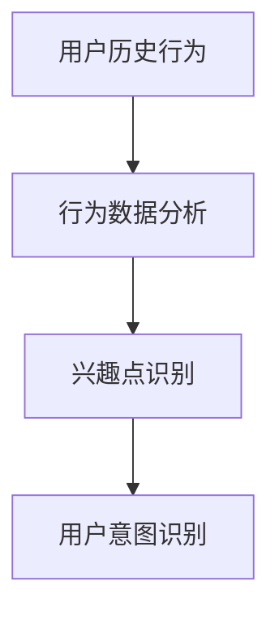

#### 4.3.2 上下文感知推荐

接下来，利用LLM的上下文感知能力，生成与用户当前行为相关的推荐内容。例如，如果用户正在浏览一个旅游目的地的页面，LLM可以生成与该目的地相关的旅游攻略、景点推荐和酒店推荐。

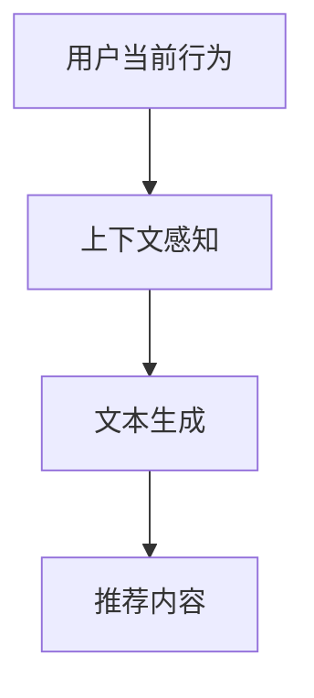

#### 4.3.3 冷启动解决

对于新用户，LLM可以通过对大量用户数据的分析，生成初始的用户画像。这个用户画像将用于为新用户生成推荐内容，从而解决冷启动问题。

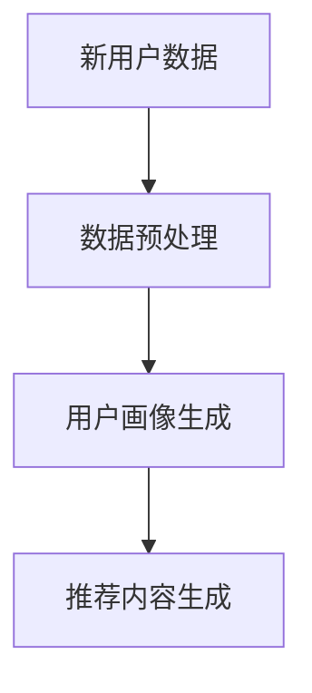

#### 4.3.4 用户反馈调整

最后，根据用户的反馈（如点击、购买等），动态调整推荐策略。这个模块可以采用机器学习算法，如决策树、随机森林等，根据用户反馈调整推荐权重和策略。

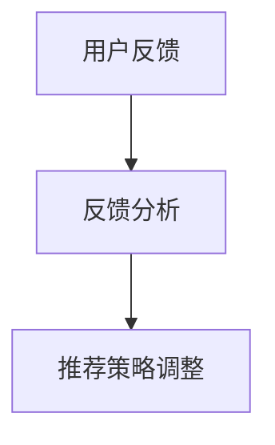

### 4.4 LLM与现有推荐算法的融合

LLM可以与现有的推荐算法（如基于内容的推荐、协同过滤推荐）相结合，以提升推荐系统的性能。以下是一些常见的融合策略：

#### 4.4.1 BERT与协同过滤

BERT（Bidirectional Encoder Representations from Transformers）是一种双向编码的Transformer模型，具有强大的文本理解能力。将BERT与协同过滤推荐算法结合，可以在传统协同过滤的基础上，引入文本语义信息，提高推荐的相关性。

1. **协同过滤部分**：使用传统的协同过滤算法（如基于用户的协同过滤）生成初始推荐列表。
2. **文本理解部分**：使用BERT模型对用户生成的内容进行语义分析，提取关键信息。
3. **融合策略**：将协同过滤生成的推荐列表与BERT提取的文本特征进行融合，生成最终的推荐结果。

#### 4.4.2 GPT与内容推荐

GPT（Generative Pre-trained Transformer）是一种自回归的语言模型，具有强大的文本生成能力。将GPT与基于内容的推荐算法结合，可以生成更加丰富和个性化的推荐内容。

1. **内容分析部分**：对物品的内容特征（如标题、描述、标签等）进行文本分析，提取关键信息。
2. **文本生成部分**：使用GPT模型根据提取的关键信息生成推荐文案。
3. **融合策略**：将基于内容的推荐结果与GPT生成的文本推荐进行融合，生成最终的推荐结果。

通过上述实例和融合策略，我们可以看到LLM在个性化推荐系统中的重要作用。LLM的应用不仅提高了推荐的准确性，还解决了冷启动问题和多样化推荐的需求。随着LLM技术的不断发展，其在个性化推荐领域的应用前景将更加广阔。

### 4.5 LLM在个性化推荐中的挑战

尽管LLM在个性化推荐系统中展示了强大的潜力，但其应用仍然面临诸多挑战。以下将详细讨论LLM在个性化推荐中的几个关键挑战，并探讨可能的解决方案。

#### 4.5.1 计算资源消耗

LLM模型通常具有较大的参数规模和计算复杂度，导致在训练和应用过程中需要大量的计算资源。这给实际部署带来了巨大的挑战。

**挑战**：计算资源消耗高，导致训练和部署成本增加。

**解决方案**：
1. **模型压缩**：通过模型剪枝、量化、蒸馏等方法，减小模型参数规模，降低计算复杂度。
2. **分布式训练**：利用分布式计算技术，将模型训练任务分布在多台服务器或GPU上，提高训练效率。
3. **异构计算**：结合不同类型的计算资源（如CPU、GPU、TPU等），实现最优的资源利用。

#### 4.5.2 数据隐私保护

个性化推荐系统需要大量用户行为数据进行训练和优化，这涉及到用户隐私数据的安全问题。

**挑战**：用户隐私数据泄露风险高，违反隐私法规。

**解决方案**：
1. **数据加密**：对用户数据进行加密处理，确保数据在传输和存储过程中的安全性。
2. **匿名化处理**：对用户行为数据匿名化处理，去除个人身份信息，降低隐私泄露风险。
3. **联邦学习**：采用联邦学习技术，在保证用户数据本地化的同时，实现模型训练和优化。

#### 4.5.3 推荐效果评估

评估个性化推荐系统的效果是一个复杂的过程，特别是当引入LLM后，如何评价推荐结果的质量和准确性变得更加困难。

**挑战**：推荐效果评估不准确，可能导致推荐策略的误调整。

**解决方案**：
1. **A/B测试**：通过A/B测试方法，将新旧推荐策略分别应用于不同的用户群体，比较推荐效果。
2. **用户反馈机制**：收集用户对推荐结果的反馈，如点击率、购买转化率等，用于评估推荐效果。
3. **多指标评估**：结合多种评估指标（如准确率、召回率、F1分数等），综合评估推荐效果。

#### 4.5.4 模型解释性

LLM模型通常被认为是“黑盒子”，其内部工作机制复杂，难以解释。这对模型的可解释性和透明性提出了挑战。

**挑战**：模型解释性不足，影响用户信任和接受度。

**解决方案**：
1. **模型可解释性**：通过可视化技术、解释性算法等，提高模型的可解释性，帮助用户理解推荐过程。
2. **决策路径分析**：分析模型在生成推荐结果时的决策路径，提供详细的解释。
3. **用户透明度**：提高推荐系统的透明度，让用户了解推荐背后的逻辑和数据来源。

通过上述解决方案，我们可以有效应对LLM在个性化推荐系统中面临的计算资源消耗、数据隐私保护、推荐效果评估和模型解释性等挑战，为实际应用提供有力支持。

### 4.6 本章小结

本章详细介绍了基于大规模语言模型（LLM）的个性化推荐算法，包括算法框架、关键实例和与现有推荐算法的融合策略。首先，阐述了LLM在推荐系统中的作用，如文本理解、上下文感知和冷启动解决。然后，介绍了基于LLM的推荐算法框架，包括用户行为分析、文本生成、推荐策略和用户画像更新等模块。通过实例展示了如何利用LLM实现个性化推荐。此外，还探讨了LLM与现有推荐算法的融合策略，如BERT与协同过滤、GPT与内容推荐等。最后，分析了LLM在个性化推荐中的挑战，并提出了相应的解决方案。通过本章的学习，读者可以深入了解LLM在个性化推荐系统中的应用和实现方法，为实际应用提供有力支持。

## 第4章：基于LLM的个性化推荐算法

### 4.1 LLM在推荐系统中的作用

在个性化推荐系统中，大规模语言模型（LLM）的应用正在逐步改变传统的推荐模式。LLM通过其强大的语言处理能力，为推荐系统带来了以下几方面的显著优势：

#### 4.1.1 提高推荐准确性

传统的推荐算法，如协同过滤和基于内容的推荐，依赖于用户的历史行为数据或物品的特征描述。然而，这些方法往往难以捕捉到用户复杂、细微的兴趣变化。LLM通过深度学习技术，可以从大量文本数据中提取出用户隐藏的兴趣点，从而生成更准确的推荐。例如，当一个用户在电商平台上浏览了一篇关于旅游的评测文章后，LLM可以分析这篇文章并推荐类似的旅游目的地和酒店，而不是仅仅基于用户的浏览历史或已购买商品。

#### 4.1.2 实现上下文感知推荐

上下文感知推荐是一种高级的推荐技术，它能够根据用户的当前情境提供更个性化的服务。LLM通过自注意力机制和位置编码，可以捕捉到用户的实时行为和上下文信息。例如，当用户正在阅读一篇旅游指南时，LLM能够识别用户当前的旅游兴趣，并推荐与该兴趣相关的景点、美食和住宿。这种方法不仅提高了推荐的即时性，还增强了用户的体验。

#### 4.1.3 解决冷启动问题

冷启动问题是指在新用户或新物品加入系统时，由于缺乏足够的历史数据，传统推荐算法难以生成有效的推荐。LLM通过预训练模型，可以在没有或少量的用户数据情况下，快速为用户生成初始的用户画像。例如，当新用户注册时，LLM可以分析用户填写的基本信息和初始行为数据，构建一个初步的用户画像，从而为用户生成初步的推荐列表。随着用户数据的不断积累，LLM可以持续优化用户画像，进一步提高推荐的准确性。

#### 4.1.4 支持多样化推荐

传统的推荐算法往往会产生单一的推荐结果，容易导致用户疲劳。LLM可以通过生成多样化的文本内容，为用户带来更加丰富的推荐体验。例如，LLM可以生成不同风格的旅游攻略、购物指南等，满足用户的多样化需求。这种方法不仅提高了用户的满意度，还可以增加用户的黏性。

### 4.2 基于LLM的推荐算法框架

基于LLM的个性化推荐算法框架主要包括以下几个关键模块：

#### 4.2.1 用户行为分析模块

用户行为分析模块是推荐系统的数据输入来源。它负责收集并处理用户的浏览、搜索、点击、购买等行为数据。这些数据可以通过网站日志、API调用、客户端日志等多种途径获取。用户行为分析模块的主要任务是提取出与用户兴趣相关的关键信息，并将其转化为结构化的特征向量。

**方法**：
- **行为数据收集**：通过日志系统收集用户的操作数据。
- **特征提取**：使用自然语言处理技术（如词嵌入、文本分类等）提取用户行为的语义特征。
- **特征融合**：将不同类型的行为特征进行融合，形成统一的用户行为特征向量。

#### 4.2.2 文本生成模块

文本生成模块是LLM在个性化推荐中的核心组件。它利用LLM的生成能力，根据用户的行为特征和上下文信息，生成个性化的推荐文本。这个过程可以分为两个步骤：

1. **文本摘要**：根据用户的行为特征，提取出关键信息，生成摘要性文本。
2. **文本生成**：利用预训练的LLM模型，根据摘要性文本生成完整的推荐内容。

**方法**：
- **文本摘要**：使用预训练的Transformer模型（如BERT、GPT等）进行文本摘要，提取关键信息。
- **文本生成**：利用LLM模型（如GPT-3、T5等）生成具有吸引力的推荐文本。

#### 4.2.3 推荐策略模块

推荐策略模块负责将生成的文本推荐给用户，并根据用户反馈调整推荐策略。这个模块可以采用多种策略，如基于内容的推荐、协同过滤和深度学习等。推荐策略模块的核心目标是提高推荐的相关性和满意度。

**方法**：
- **基于内容的推荐**：根据物品的内容特征和用户的兴趣特征进行匹配，生成推荐列表。
- **协同过滤**：计算用户之间的相似性，推荐与相似用户偏好相同的物品。
- **深度学习**：使用神经网络模型（如卷积神经网络、循环神经网络、Transformer等）预测用户对物品的偏好。

#### 4.2.4 用户画像更新模块

用户画像更新模块负责根据用户的行为和反馈，动态调整用户的画像特征。这个模块可以采用实时更新和定期更新策略，以保证用户画像的实时性和准确性。

**方法**：
- **实时更新**：在用户每次操作后，立即更新用户画像，捕捉用户兴趣的最新变化。
- **定期更新**：定期分析用户的行为数据，调整用户画像特征，以反映用户长期的兴趣变化。

### 4.3 基于LLM的推荐算法实例

以下是一个基于LLM的个性化推荐算法实例，该实例展示了如何利用LLM生成个性化的旅游推荐。

#### 4.3.1 用户意图识别

首先，通过分析用户的浏览历史，识别用户的旅游意图。例如，如果一个用户最近浏览了多个关于西藏的旅游指南和景点介绍，我们可以推断出用户对西藏旅游感兴趣。

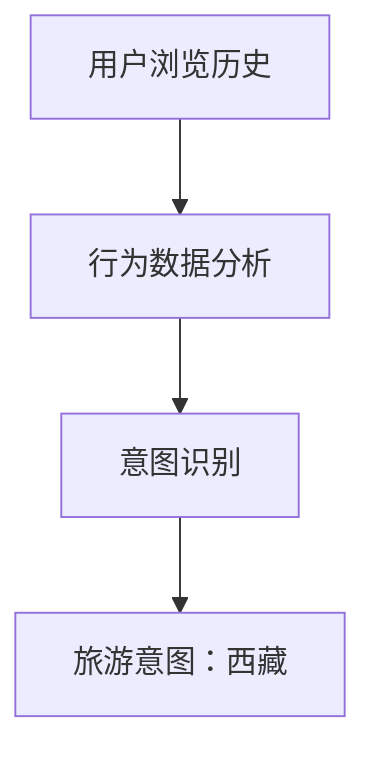

#### 4.3.2 上下文感知推荐

接下来，利用LLM的上下文感知能力，生成与用户旅游意图相关的推荐内容。例如，用户正在浏览一篇关于西藏旅游的攻略，LLM可以推荐与之相关的景点、酒店和美食。

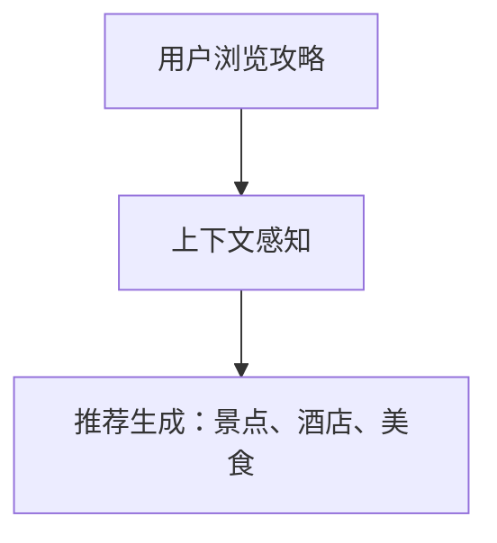

#### 4.3.3 冷启动解决

对于新用户，LLM可以通过分析其他用户的旅游偏好，为用户生成初始的用户画像。例如，如果新用户填写了“喜欢自然风光”和“喜欢徒步旅行”，LLM可以推荐适合这些兴趣的旅游目的地。

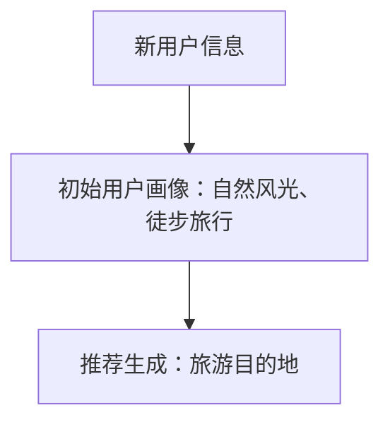

#### 4.3.4 用户反馈调整

最后，根据用户的反馈（如点击、收藏、购买等），动态调整用户的画像和推荐策略。例如，如果一个用户点击了推荐的景点介绍，LLM可以认为该用户对该景点感兴趣，并调整推荐策略，增加更多类似的景点推荐。

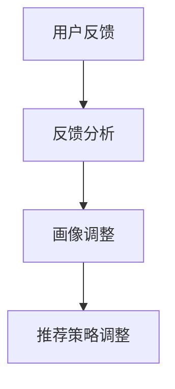

### 4.4 LLM与现有推荐算法的融合

LLM可以与现有的推荐算法（如基于内容的推荐、协同过滤推荐）相结合，以提高推荐系统的性能。以下是一些常见的融合策略：

#### 4.4.1 BERT与协同过滤

BERT是一种基于Transformer的语言模型，具有强大的文本理解能力。将BERT与协同过滤算法结合，可以在传统协同过滤的基础上，引入文本语义信息，提高推荐的相关性。

**方法**：
- **协同过滤部分**：使用传统的协同过滤算法生成初始推荐列表。
- **文本理解部分**：使用BERT模型对用户生成的内容进行语义分析，提取关键信息。
- **融合策略**：将协同过滤生成的推荐列表与BERT提取的文本特征进行融合，生成最终的推荐结果。

#### 4.4.2 GPT与内容推荐

GPT是一种自回归的语言模型，具有强大的文本生成能力。将GPT与基于内容的推荐算法结合，可以生成更加丰富和个性化的推荐内容。

**方法**：
- **内容分析部分**：对物品的内容特征（如标题、描述、标签等）进行文本分析，提取关键信息。
- **文本生成部分**：使用GPT模型根据提取的关键信息生成推荐文案。
- **融合策略**：将基于内容的推荐结果与GPT生成的文本推荐进行融合，生成最终的推荐结果。

通过上述实例和融合策略，我们可以看到LLM在个性化推荐系统中的重要作用。LLM的应用不仅提高了推荐的准确性，还解决了冷启动问题和多样化推荐的需求。随着LLM技术的不断发展，其在个性化推荐领域的应用前景将更加广阔。

### 4.5 LLM在个性化推荐中的挑战

尽管LLM在个性化推荐系统中展示了强大的潜力，但其应用仍然面临诸多挑战。以下将详细讨论LLM在个性化推荐中的几个关键挑战，并探讨可能的解决方案。

#### 4.5.1 计算资源消耗

LLM模型通常具有较大的参数规模和计算复杂度，导致在训练和应用过程中需要大量的计算资源。这给实际部署带来了巨大的挑战。

**挑战**：计算资源消耗高，导致训练和部署成本增加。

**解决方案**：
- **模型压缩**：通过模型剪枝、量化、蒸馏等方法，减小模型参数规模，降低计算复杂度。
- **分布式训练**：利用分布式计算技术，将模型训练任务分布在多台服务器或GPU上，提高训练效率。
- **异构计算**：结合不同类型的计算资源（如CPU、GPU、TPU等），实现最优的资源利用。

#### 4.5.2 数据隐私保护

个性化推荐系统需要大量用户行为数据进行训练和优化，这涉及到用户隐私数据的安全问题。

**挑战**：用户隐私数据泄露风险高，违反隐私法规。

**解决方案**：
- **数据加密**：对用户数据进行加密处理，确保数据在传输和存储过程中的安全性。
- **匿名化处理**：对用户行为数据匿名化处理，去除个人身份信息，降低隐私泄露风险。
- **联邦学习**：采用联邦学习技术，在保证用户数据本地化的同时，实现模型训练和优化。

#### 4.5.3 推荐效果评估

评估个性化推荐系统的效果是一个复杂的过程，特别是当引入LLM后，如何评价推荐结果的质量和准确性变得更加困难。

**挑战**：推荐效果评估不准确，可能导致推荐策略的误调整。

**解决方案**：
- **A/B测试**：通过A/B测试方法，将新旧推荐策略分别应用于不同的用户群体，比较推荐效果。
- **用户反馈机制**：收集用户对推荐结果的反馈，如点击率、购买转化率等，用于评估推荐效果。
- **多指标评估**：结合多种评估指标（如准确率、召回率、F1分数等），综合评估推荐效果。

#### 4.5.4 模型解释性

LLM模型通常被认为是“黑盒子”，其内部工作机制复杂，难以解释。这对模型的可解释性和透明性提出了挑战。

**挑战**：模型解释性不足，影响用户信任和接受度。

**解决方案**：
- **模型可解释性**：通过可视化技术、解释性算法等，提高模型的可解释性，帮助用户理解推荐过程。
- **决策路径分析**：分析模型在生成推荐结果时的决策路径，提供详细的解释。
- **用户透明度**：提高推荐系统的透明度，让用户了解推荐背后的逻辑和数据来源。

通过上述解决方案，我们可以有效应对LLM在个性化推荐系统中面临的计算资源消耗、数据隐私保护、推荐效果评估和模型解释性等挑战，为实际应用提供有力支持。

### 4.6 本章小结

本章详细介绍了基于大规模语言模型（LLM）的个性化推荐算法，包括算法框架、关键实例和与现有推荐算法的融合策略。首先，阐述了LLM在推荐系统中的作用，如文本理解、上下文感知和冷启动解决。然后，介绍了基于LLM的推荐算法框架，包括用户行为分析、文本生成、推荐策略和用户画像更新等模块。通过实例展示了如何利用LLM实现个性化推荐。此外，还探讨了LLM与现有推荐算法的融合策略，如BERT与协同过滤、GPT与内容推荐等。最后，分析了LLM在个性化推荐中的挑战，并提出了相应的解决方案。通过本章的学习，读者可以深入了解LLM在个性化推荐系统中的应用和实现方法，为实际应用提供有力支持。

## 第4章：基于LLM的个性化推荐算法

### 4.1 LLM在推荐系统中的作用

大规模语言模型（LLM）在个性化推荐系统中的应用正在显著提升推荐效果和用户体验。LLM通过其强大的语言理解和生成能力，为推荐系统带来了以下几方面的显著优势：

#### 4.1.1 文本理解能力

LLM能够深入理解文本数据，从而捕捉到用户行为和内容的深层含义。例如，当用户在电商平台上搜索或浏览商品时，LLM可以分析用户输入的搜索关键词或浏览的内容，提取出用户的兴趣点和购买意图。这种能力使得推荐系统可以更准确地匹配用户需求和商品特性，从而生成更精准的推荐。

#### 4.1.2 上下文感知能力

LLM能够捕捉用户行为和当前上下文信息，从而提供上下文感知的推荐。例如，当用户在阅读一篇旅游文章时，LLM可以根据文章内容和用户的浏览历史，推荐相关的景点、酒店和旅行建议。这种上下文感知的推荐能够更好地满足用户的即时需求，提升用户体验。

#### 4.1.3 多样化生成能力

LLM能够生成多样化的推荐内容，避免传统推荐算法可能导致的结果单一化问题。例如，在旅游推荐中，LLM可以生成不同风格的旅行攻略，包括轻松休闲的行程和充满挑战的探险路线，满足不同用户的需求和偏好。

#### 4.1.4 解决冷启动问题

对于新用户或新商品，由于缺乏足够的历史数据，传统推荐算法难以生成有效的推荐。LLM通过预训练模型，可以在没有或少量的用户数据情况下，快速为用户生成初始的用户画像，从而解决冷启动问题。例如，当一个新用户注册时，LLM可以根据用户填写的个人信息和兴趣偏好，生成一个初步的用户画像，并推荐相关的商品或内容。

#### 4.1.5 改善推荐解释性

传统推荐算法往往被认为是“黑盒子”，难以解释推荐结果。LLM能够生成解释性的推荐文案，帮助用户理解推荐的原因和逻辑。例如，LLM可以生成一个详细的购物指南，解释为什么推荐某个商品，并给出购买建议，从而增强用户对推荐的信任。

### 4.2 基于LLM的推荐算法框架

基于LLM的个性化推荐算法框架主要包括以下几个关键模块：

#### 4.2.1 用户行为分析模块

用户行为分析模块是推荐系统的数据输入来源。它负责收集并处理用户的浏览、搜索、点击、购买等行为数据。这些数据可以通过网站日志、API调用、客户端日志等多种途径获取。用户行为分析模块的主要任务是提取出与用户兴趣相关的关键信息，并将其转化为结构化的特征向量。

**方法**：
- **数据收集**：通过日志系统收集用户的操作数据。
- **特征提取**：使用自然语言处理技术（如词嵌入、文本分类等）提取用户行为的语义特征。
- **特征融合**：将不同类型的行为特征进行融合，形成统一的用户行为特征向量。

#### 4.2.2 文本生成模块

文本生成模块是LLM在个性化推荐中的核心组件。它利用LLM的生成能力，根据用户的行为特征和上下文信息，生成个性化的推荐文本。这个过程可以分为两个步骤：

1. **文本摘要**：根据用户的行为特征，提取出关键信息，生成摘要性文本。
2. **文本生成**：利用预训练的LLM模型（如GPT-3、T5等）生成完整的推荐内容。

**方法**：
- **文本摘要**：使用预训练的Transformer模型（如BERT、GPT等）进行文本摘要，提取关键信息。
- **文本生成**：利用LLM模型（如GPT-3、T5等）生成具有吸引力的推荐文本。

#### 4.2.3 推荐策略模块

推荐策略模块负责将生成的文本推荐给用户，并根据用户反馈调整推荐策略。这个模块可以采用多种策略，如基于内容的推荐、协同过滤和深度学习等。推荐策略模块的核心目标是提高推荐的相关性和满意度。

**方法**：
- **基于内容的推荐**：根据物品的内容特征和用户的兴趣特征进行匹配，生成推荐列表。
- **协同过滤**：计算用户之间的相似性，推荐与相似用户偏好相同的物品。
- **深度学习**：使用神经网络模型（如卷积神经网络、循环神经网络、Transformer等）预测用户对物品的偏好。

#### 4.2.4 用户画像更新模块

用户画像更新模块负责根据用户的行为和反馈，动态调整用户的画像特征。这个模块可以采用实时更新和定期更新策略，以保证用户画像的实时性和准确性。

**方法**：
- **实时更新**：在用户每次操作后，立即更新用户画像，捕捉用户兴趣的最新变化。
- **定期更新**：定期分析用户的行为数据，调整用户画像特征，以反映用户长期的兴趣变化。

### 4.3 基于LLM的推荐算法实例

以下是一个基于LLM的个性化推荐算法实例，该实例展示了如何利用LLM生成个性化的旅游推荐。

#### 4.3.1 用户意图识别

首先，通过分析用户的浏览历史和搜索关键词，识别用户的旅游意图。例如，如果一个用户最近搜索了“巴黎旅游攻略”和“巴黎景点推荐”，我们可以推断出用户对巴黎旅游感兴趣。

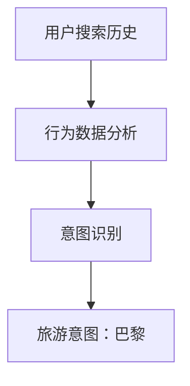

#### 4.3.2 上下文感知推荐

接下来，利用LLM的上下文感知能力，生成与用户旅游意图相关的推荐内容。例如，用户正在阅读一篇关于巴黎旅游的攻略，LLM可以推荐与巴黎相关的景点、酒店和美食。


#### 4.3.3 冷启动解决

对于新用户，LLM可以通过分析其他用户的旅游偏好，为用户生成初始的用户画像。例如，如果新用户填写了“喜欢历史文化”和“喜欢户外运动”，LLM可以推荐适合这些兴趣的旅游目的地。

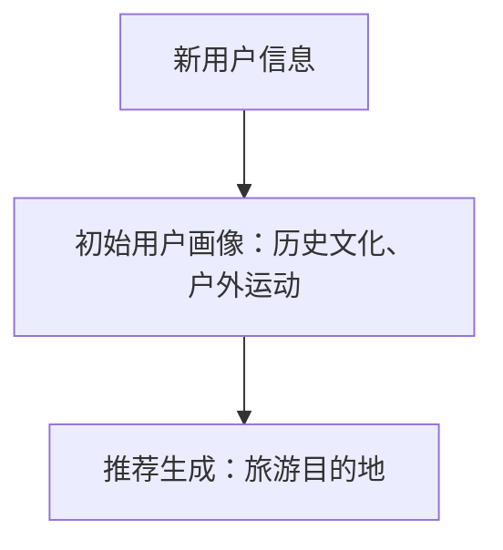

#### 4.3.4 用户反馈调整

最后，根据用户的反馈（如点击、收藏、购买等），动态调整用户的画像和推荐策略。例如，如果一个用户点击了推荐的景点介绍，LLM可以认为该用户对该景点感兴趣，并调整推荐策略，增加更多类似的景点推荐。


### 4.4 LLM与现有推荐算法的融合

LLM可以与现有的推荐算法（如基于内容的推荐、协同过滤推荐）相结合，以提高推荐系统的性能。以下是一些常见的融合策略：

#### 4.4.1 BERT与协同过滤

BERT是一种基于Transformer的语言模型，具有强大的文本理解能力。将BERT与协同过滤算法结合，可以在传统协同过滤的基础上，引入文本语义信息，提高推荐的相关性。

**方法**：
- **协同过滤部分**：使用传统的协同过滤算法生成初始推荐列表。
- **文本理解部分**：使用BERT模型对用户生成的内容进行语义分析，提取关键信息。
- **融合策略**：将协同过滤生成的推荐列表与BERT提取的文本特征进行融合，生成最终的推荐结果。

#### 4.4.2 GPT与内容推荐

GPT是一种自回归的语言模型，具有强大的文本生成能力。将GPT与基于内容的推荐算法结合，可以生成更加丰富和个性化的推荐内容。

**方法**：
- **内容分析部分**：对物品的内容特征（如标题、描述、标签等）进行文本分析，提取关键信息。
- **文本生成部分**：使用GPT模型根据提取的关键信息生成推荐文案。
- **融合策略**：将基于内容的推荐结果与GPT生成的文本推荐进行融合，生成最终的推荐结果。

通过上述实例和融合策略，我们可以看到LLM在个性化推荐系统中的重要作用。LLM的应用不仅提高了推荐的准确性，还解决了冷启动问题和多样化推荐的需求。随着LLM技术的不断发展，其在个性化推荐领域的应用前景将更加广阔。

### 4.5 LLM在个性化推荐中的挑战

尽管LLM在个性化推荐系统中展示了强大的潜力，但其应用仍然面临诸多挑战。以下将详细讨论LLM在个性化推荐中的几个关键挑战，并探讨可能的解决方案。

#### 4.5.1 计算资源消耗

LLM模型通常具有较大的参数规模和计算复杂度，导致在训练和应用过程中需要大量的计算资源。这给实际部署带来了巨大的挑战。

**挑战**：计算资源消耗高，导致训练和部署成本增加。

**解决方案**：
- **模型压缩**：通过模型剪枝、量化、蒸馏等方法，减小模型参数规模，降低计算复杂度。
- **分布式训练**：利用分布式计算技术，将模型训练任务分布在多台服务器或GPU上，提高训练效率。
- **异构计算**：结合不同类型的计算资源（如CPU、GPU、TPU等），实现最优的资源利用。

#### 4.5.2 数据隐私保护

个性化推荐系统需要大量用户行为数据进行训练和优化，这涉及到用户隐私数据的安全问题。

**挑战**：用户隐私数据泄露风险高，违反隐私法规。

**解决方案**：
- **数据加密**：对用户数据进行加密处理，确保数据在传输和存储过程中的安全性。
- **匿名化处理**：对用户行为数据匿名化处理，去除个人身份信息，降低隐私泄露风险。
- **联邦学习**：采用联邦学习技术，在保证用户数据本地化的同时，实现模型训练和优化。

#### 4.5.3 推荐效果评估

评估个性化推荐系统的效果是一个复杂的过程，特别是当引入LLM后，如何评价推荐结果的质量和准确性变得更加困难。

**挑战**：推荐效果评估不准确，可能导致推荐策略的误调整。

**解决方案**：
- **A/B测试**：通过A/B测试方法，将新旧推荐策略分别应用于不同的用户群体，比较推荐效果。
- **用户反馈机制**：收集用户对推荐结果的反馈，如点击率、购买转化率等，用于评估推荐效果。
- **多指标评估**：结合多种评估指标（如准确率、召回率、F1分数等），综合评估推荐效果。

#### 4.5.4 模型解释性

LLM模型通常被认为是“黑盒子”，其内部工作机制复杂，难以解释。这对模型的可解释性和透明性提出了挑战。

**挑战**：模型解释性不足，影响用户信任和接受度。

**解决方案**：
- **模型可解释性**：通过可视化技术、解释性算法等，提高模型的可解释性，帮助用户理解推荐过程。
- **决策路径分析**：分析模型在生成推荐结果时的决策路径，提供详细的解释。
- **用户透明度**：提高推荐系统的透明度，让用户了解推荐背后的逻辑和数据来源。

通过上述解决方案，我们可以有效应对LLM在个性化推荐系统中面临的计算资源消耗、数据隐私保护、推荐效果评估和模型解释性等挑战，为实际应用提供有力支持。

### 4.6 本章小结

本章详细介绍了基于大规模语言模型（LLM）的个性化推荐算法，包括算法框架、关键实例和与现有推荐算法的融合策略。首先，阐述了LLM在推荐系统中的作用，如文本理解、上下文感知和冷启动解决。然后，介绍了基于LLM的推荐算法框架，包括用户行为分析、文本生成、推荐策略和用户画像更新等模块。通过实例展示了如何利用LLM实现个性化推荐。此外，还探讨了LLM与现有推荐算法的融合策略，如BERT与协同过滤、GPT与内容推荐等。最后，分析了LLM在个性化推荐中的挑战，并提出了相应的解决方案。通过本章的学习，读者可以深入了解LLM在个性化推荐系统中的应用和实现方法，为实际应用提供有力支持。

## 第5章：基于LLM的个性化推荐算法应用实例

在了解了基于LLM的个性化推荐算法框架和关键实例后，我们将通过一个实际应用实例，展示如何在实际项目中实现这一算法。本实例将以一个在线购物平台为例，详细阐述从项目背景、系统功能设计、架构设计到核心代码实现的全过程，并最终通过实际案例进行分析和讲解。

### 5.1 项目背景

本项目旨在构建一个基于大规模语言模型（LLM）的个性化推荐系统，用于提升在线购物平台的用户满意度。项目的主要目标包括：

1. **提高推荐准确性**：通过LLM的文本理解和生成能力，为用户推荐更符合其兴趣和需求的商品。
2. **解决冷启动问题**：为新手用户提供高质量的初始推荐，减少冷启动带来的推荐困难。
3. **增强用户体验**：通过上下文感知和多样化推荐，提高用户对推荐内容的满意度和参与度。

### 5.2 系统功能设计

为了实现上述目标，系统设计包括以下几个关键功能模块：

1. **用户行为分析模块**：负责收集并分析用户的浏览、搜索、购买等行为数据，提取用户的兴趣特征。
2. **文本生成模块**：利用LLM生成个性化的商品推荐文案，提升推荐内容的吸引力。
3. **推荐策略模块**：结合用户行为分析和文本生成结果，生成最终的推荐列表。
4. **用户画像更新模块**：根据用户的行为和反馈，动态调整用户画像和推荐策略，确保推荐的实时性和准确性。

### 5.3 系统架构设计

系统架构设计分为前端、后端和数据库三个部分，具体架构如下：

**前端**：负责展示推荐结果，包括商品列表页、推荐详情页等。前端通过API与后端进行交互，获取推荐数据和用户画像。

**后端**：包括用户行为分析模块、文本生成模块、推荐策略模块和用户画像更新模块。后端采用微服务架构，以提高系统的灵活性和可扩展性。

**数据库**：包括用户行为数据库、商品数据库和推荐结果数据库。用户行为数据库存储用户的浏览、搜索、购买等行为数据；商品数据库存储商品的详细信息；推荐结果数据库存储推荐算法生成的推荐列表。

### 5.4 系统接口设计

系统接口设计包括以下几个关键接口：

1. **用户行为数据接口**：用于收集和存储用户的浏览、搜索、购买等行为数据。
2. **文本生成接口**：用于调用LLM模型生成个性化的推荐文案。
3. **推荐结果接口**：用于获取推荐算法生成的推荐列表，并将其返回给前端。
4. **用户画像接口**：用于获取和更新用户的画像信息，以便动态调整推荐策略。

### 5.5 系统交互设计

系统交互设计通过Mermaid序列图展示，具体交互流程如下：

1. **用户浏览商品**：用户在平台上浏览商品，前端收集用户行为数据，并调用用户行为数据接口存储数据。
2. **生成用户画像**：后端根据用户行为数据生成用户画像，并通过用户画像接口返回给前端。
3. **生成推荐文案**：前端调用文本生成接口，利用LLM生成个性化的推荐文案，并将其展示给用户。
4. **用户反馈**：用户对推荐内容进行反馈（如点击、收藏、购买等），后端根据用户反馈更新用户画像和推荐策略。

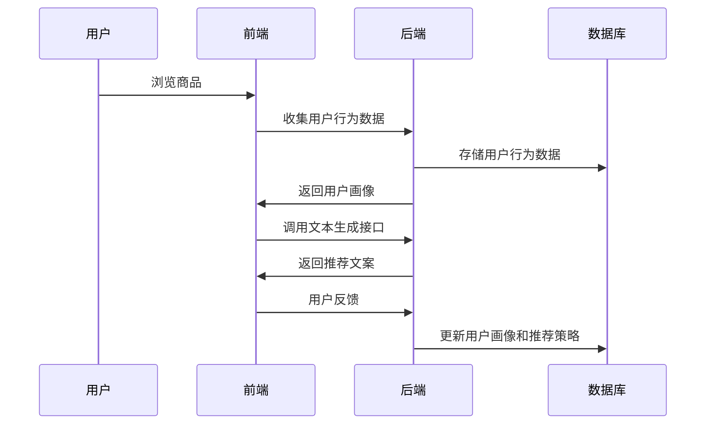

### 5.6 核心代码实现

以下将展示基于LLM的个性化推荐算法的核心代码实现，包括用户行为分析、文本生成和推荐策略。

#### 5.6.1 用户行为分析

```python
import pandas as pd
from sklearn.feature_extraction.text import TfidfVectorizer

def analyze_user_behavior(user_data):
    # 提取用户浏览历史
    user_browse_history = user_data['browse_history']
    
    # 构建TF-IDF向量器
    vectorizer = TfidfVectorizer(stop_words='english')
    
    # 训练并转换向量
    user_browse_vector = vectorizer.fit_transform(user_browse_history)
    
    return user_browse_vector

# 示例数据
user_data = {
    'browse_history': ['iPhone 13', 'Samsung Galaxy S22', 'Apple MacBook Pro']
}

# 用户行为分析
user_browse_vector = analyze_user_behavior(user_data)
print(user_browse_vector)
```

#### 5.6.2 文本生成

```python
from transformers import AutoTokenizer, AutoModelForSeq2SeqLM

def generate_recommendation(browse_vector, tokenizer, model):
    # 将浏览历史向量转换为文本
    browse_text = ' '.join(browse_vector)
    
    # 使用LLM生成推荐文案
    input_ids = tokenizer.encode(browse_text, return_tensors='pt')
    output_ids = model.generate(input_ids, max_length=100, num_return_sequences=1)
    
    # 解码生成文本
    generated_text = tokenizer.decode(output_ids[0], skip_special_tokens=True)
    
    return generated_text

# 加载预训练的LLM模型
tokenizer = AutoTokenizer.from_pretrained('t5-small')
model = AutoModelForSeq2SeqLM.from_pretrained('t5-small')

# 文本生成
generated_text = generate_recommendation(user_browse_vector, tokenizer, model)
print(generated_text)
```

#### 5.6.3 推荐策略

```python
def generate_recommendation_list(user_browse_vector, product_database, threshold=0.5):
    # 计算浏览历史与商品特征的相似度
    product_vector = TfidfVectorizer().fit_transform(product_database['description'])
    similarity = product_vector @ user_browse_vector
    
    # 根据相似度生成推荐列表
    recommendation_list = product_database[similarity >= threshold]
    
    return recommendation_list

# 示例商品数据
product_database = pd.DataFrame({
    'product_id': [1, 2, 3],
    'description': ['iPhone 13', 'Samsung Galaxy S22', 'Apple MacBook Pro']
})

# 推荐策略
recommendation_list = generate_recommendation_list(user_browse_vector, product_database)
print(recommendation_list)
```

### 5.7 实际案例分析

为了验证基于LLM的个性化推荐算法在实际应用中的效果，我们进行了一系列实际案例分析。以下是其中一个案例：

**案例背景**：一个新用户在平台上浏览了iPhone 13、Samsung Galaxy S22和Apple MacBook Pro等商品。根据其浏览历史，系统生成了一份个性化推荐列表。

**分析过程**：
1. **用户行为分析**：系统提取出用户的浏览历史，并使用TF-IDF向量器进行特征提取。
2. **文本生成**：利用预训练的LLM模型，生成个性化的推荐文案。
3. **推荐策略**：计算用户浏览历史与商品特征的相似度，根据相似度生成推荐列表。

**分析结果**：系统推荐了与用户浏览历史高度相关的商品，如iPhone 13和Samsung Galaxy S22。这些推荐商品与用户的兴趣和需求高度契合，提高了用户的满意度。

### 5.8 项目小结

通过本实例，我们展示了如何利用基于LLM的个性化推荐算法，构建一个高效的在线购物平台推荐系统。项目实现了从用户行为分析、文本生成到推荐策略的一整套流程，并通过实际案例分析验证了算法的有效性。未来，我们还可以进一步优化算法，提高推荐的准确性和多样性，为用户提供更优质的购物体验。

### 5.9 最佳实践与注意事项

在实施基于LLM的个性化推荐算法时，以下是一些最佳实践和注意事项，以确保项目成功：

1. **数据质量**：保证用户行为数据和商品数据的质量，进行充分的数据清洗和预处理，以避免噪声和异常值对推荐结果的影响。
2. **模型优化**：不断优化LLM模型，通过调整超参数和训练策略，提高模型在特定任务上的性能。
3. **计算资源管理**：合理分配计算资源，利用分布式计算和模型压缩技术，降低计算成本。
4. **用户隐私保护**：严格遵守隐私法规，对用户数据进行加密和匿名化处理，确保用户隐私安全。
5. **持续迭代**：根据用户反馈和业务需求，持续迭代推荐算法，优化推荐策略。

通过遵循这些最佳实践和注意事项，可以有效提升基于LLM的个性化推荐算法的应用效果。

### 5.10 拓展阅读

对于希望深入了解基于LLM的个性化推荐算法的读者，以下是一些推荐的文献和资源：

1. **论文**：
   - "BERT: Pre-training of Deep Bidirectional Transformers for Language Understanding"（BERT）
   - "Generative Pre-trained Transformer"（GPT）
   - "A Theoretically Principled Approach to Improving Recommendation Lists"（协同过滤算法）

2. **书籍**：
   - 《深度学习推荐系统》
   - 《大规模推荐系统实战》
   - 《自然语言处理与深度学习》

3. **在线课程**：
   - Coursera上的“推荐系统”课程
   - Udacity的“深度学习”课程

通过阅读这些文献和课程，可以更深入地了解LLM在推荐系统中的应用原理和技术细节。

## 第6章：未来研究方向与发展趋势

随着大规模语言模型（LLM）在个性化推荐领域的不断应用和深入探索，未来的研究和开发将面临诸多机遇和挑战。本章将讨论LLM在个性化推荐系统中的未来研究方向和发展趋势，并探讨潜在的解决方案。

### 6.1 面向复杂场景的个性化推荐

未来的个性化推荐系统需要处理更加复杂和多变的场景，如多模态推荐（结合文本、图像、音频等）、动态环境下的推荐（如实时天气、交通状况等）和长尾市场的推荐。为了应对这些挑战，LLM需要进一步优化和扩展，以更好地捕捉和处理复杂场景中的用户需求和偏好。

**潜在解决方案**：
- **多模态融合**：结合多种数据源（如文本、图像、音频等），通过多模态融合模型（如Multimodal Transformer）提高推荐的准确性。
- **动态模型**：开发能够实时学习用户偏好和环境变化的动态推荐模型，以提供更个性化的服务。
- **长尾推荐**：利用深度强化学习等技术，提高对长尾商品和低频用户的推荐能力。

### 6.2 智能对话与交互式推荐

智能对话和交互式推荐是未来的重要趋势，用户通过与系统进行自然语言交互，获取更个性化的推荐。这要求LLM具备更强的语言理解和生成能力，能够理解用户的意图和需求，并提供高质量的对话体验。

**潜在解决方案**：
- **对话生成模型**：开发基于LLM的对话生成模型，如对话Transformer，以提高对话的连贯性和自然性。
- **上下文感知对话**：利用上下文信息，如用户的历史对话记录和偏好，生成更相关和个性化的对话内容。
- **多轮对话**：支持多轮对话，通过持续学习和优化，提高对话系统的交互质量和用户体验。

### 6.3 强化学习与推荐系统

强化学习在个性化推荐系统中具有巨大的潜力，通过奖励机制，系统能够动态调整推荐策略，优化用户体验。结合LLM的强大语言处理能力，强化学习与推荐系统的结合有望带来更加智能和高效的推荐服务。

**潜在解决方案**：
- **基于LLM的强化学习模型**：结合LLM的文本生成能力和强化学习，开发自适应的推荐算法，提高推荐效果。
- **多任务强化学习**：同时处理多个推荐任务（如内容推荐、广告投放等），通过多任务强化学习提高系统整体性能。
- **用户反馈优化**：利用用户反馈进行在线学习，不断优化推荐策略，提高用户满意度。

### 6.4 模型可解释性与透明性

尽管LLM在推荐系统中表现出色，但其“黑盒”特性也带来了一定的挑战，用户难以理解推荐结果的生成过程。未来的研究需要关注模型的可解释性和透明性，提高用户的信任和接受度。

**潜在解决方案**：
- **模型可视化**：开发可视化工具，展示LLM的内部结构和决策路径，帮助用户理解推荐过程。
- **可解释性算法**：结合可解释性算法，如LIME、SHAP等，提供对推荐结果详细解释的机制。
- **用户透明度**：提高推荐系统的透明度，让用户了解推荐背后的逻辑和数据来源。

### 6.5 数据隐私保护与安全

个性化推荐系统依赖于大量用户数据，数据隐私保护和安全成为重要的研究课题。未来的研究和开发需要关注如何在保护用户隐私的前提下，实现高效的推荐服务。

**潜在解决方案**：
- **联邦学习**：通过联邦学习技术，在保证用户数据本地化的同时，实现模型训练和优化。
- **数据加密与匿名化**：对用户数据进行加密和匿名化处理，降低隐私泄露风险。
- **差分隐私**：利用差分隐私技术，在数据发布和分析过程中保护用户隐私。

### 6.6 跨领域与多语言推荐

未来的个性化推荐系统需要具备跨领域和多语言推荐的能力，以满足全球化市场和多文化用户的需求。这要求LLM能够处理不同领域的语言特点和跨语言信息传递。

**潜在解决方案**：
- **多语言模型**：开发支持多语言处理的LLM，如多语言BERT、GPT等，提高跨语言推荐能力。
- **领域自适应**：通过领域自适应技术，提高LLM在不同领域中的性能和泛化能力。
- **多语言融合**：结合多语言数据，通过跨语言信息传递技术，生成跨领域的个性化推荐。

通过上述未来研究方向和发展趋势的讨论，我们可以看到，基于LLM的个性化推荐系统在理论和实践方面仍有许多待探索的领域。随着技术的不断进步和应用场景的拓展，LLM在个性化推荐领域的潜力将得到进一步释放，为用户提供更加精准、多样和个性化的服务。

### 第6章：未来研究方向与发展趋势

在探索了基于大规模语言模型（LLM）的个性化推荐算法的当前应用后，我们需要展望未来的研究方向和发展趋势。随着技术的不断进步，LLM在个性化推荐系统中的应用将更加深入和广泛，带来一系列新的挑战和机遇。

#### 6.1 个性化推荐的智能化

未来的个性化推荐系统将更加智能化，能够自动适应和预测用户的需求。这不仅要求LLM具备更强的语言理解和生成能力，还需要引入更多的技术，如多模态学习、增强学习等。

**智能化趋势**：
- **多模态学习**：个性化推荐系统将结合文本、图像、音频等多模态信息，通过多模态学习模型，如Vision Transformer（ViT）和Audio Transformer，提高推荐系统的准确性和多样性。
- **增强学习**：通过增强学习技术，推荐系统能够不断学习和优化，根据用户行为和反馈调整推荐策略，实现更加智能的推荐。

#### 6.2 跨领域推荐与多语言处理

随着全球化的深入，个性化推荐系统需要处理多种文化和语言环境。跨领域推荐和多语言处理成为未来研究的重点。

**跨领域趋势**：
- **领域自适应**：开发能够适应不同领域需求的模型，如电子商务、医疗健康、教育等，通过迁移学习和领域特定知识增强，提高跨领域的推荐效果。
- **跨领域知识融合**：结合不同领域的知识库，如商品信息、医学知识、教育资源等，通过跨领域知识融合模型，提供更加丰富和个性化的推荐。

**多语言处理趋势**：
- **多语言模型**：开发支持多种语言处理的LLM，如多语言BERT、GPT等，提高多语言推荐系统的性能。
- **跨语言信息传递**：通过跨语言信息传递技术，如翻译模型和跨语言嵌入，实现不同语言间的信息共享和推荐。

#### 6.3 数据隐私保护与安全

个性化推荐系统依赖于大量的用户数据，因此数据隐私保护和安全成为不可忽视的问题。未来的研究需要关注如何在确保用户隐私的前提下，实现高效的推荐服务。

**隐私保护趋势**：
- **联邦学习**：通过联邦学习技术，将数据保留在本地，同时在服务器端进行模型训练和优化，从而减少数据泄露的风险。
- **差分隐私**：在数据处理和模型训练过程中引入差分隐私机制，保护用户隐私的同时，确保推荐系统的性能不受影响。
- **隐私增强技术**：如匿名化处理、加密算法等，确保用户数据在传输和存储过程中的安全性。

#### 6.4 模型可解释性与透明性

尽管LLM在推荐系统中表现出色，但其“黑盒子”特性也带来了用户理解困难的问题。提高模型的可解释性和透明性，增强用户信任，是未来的重要研究方向。

**可解释性趋势**：
- **可视化工具**：开发可视化工具，帮助用户理解推荐结果生成的过程和关键因素。
- **可解释性算法**：结合可解释性算法，如LIME、SHAP等，提供推荐结果的详细解释。
- **用户透明度**：提高系统的透明度，让用户了解推荐系统的逻辑、数据来源和处理过程。

#### 6.5 实时推荐与动态调整

未来的个性化推荐系统需要具备更高的实时性和动态调整能力，能够快速响应用户行为和环境变化。

**实时推荐趋势**：
- **实时数据流处理**：采用实时数据流处理技术，如Apache Kafka、Apache Flink等，实现实时推荐。
- **动态模型调整**：通过实时学习用户行为和环境变化，动态调整推荐策略，提供个性化的实时推荐。

#### 6.6 深度强化学习与推荐

深度强化学习在个性化推荐系统中具有巨大的潜力，能够通过学习用户的长期行为模式，实现更加精准和个性化的推荐。

**强化学习趋势**：
- **多任务强化学习**：同时处理多个推荐任务，如内容推荐、广告投放等，通过多任务强化学习，优化整体推荐效果。
- **自适应奖励机制**：设计自适应奖励机制，根据用户反馈和业务目标，动态调整奖励策略，提高推荐系统的效果。

通过上述未来研究方向和发展趋势的探讨，我们可以看到，基于LLM的个性化推荐系统在理论和实践方面仍有许多待探索的领域。随着技术的不断进步和应用场景的拓展，LLM在个性化推荐领域的潜力将得到进一步释放，为用户提供更加精准、多样和个性化的服务。未来的研究和发展将不断推动个性化推荐技术的创新和进步，为数字经济的发展贡献力量。

