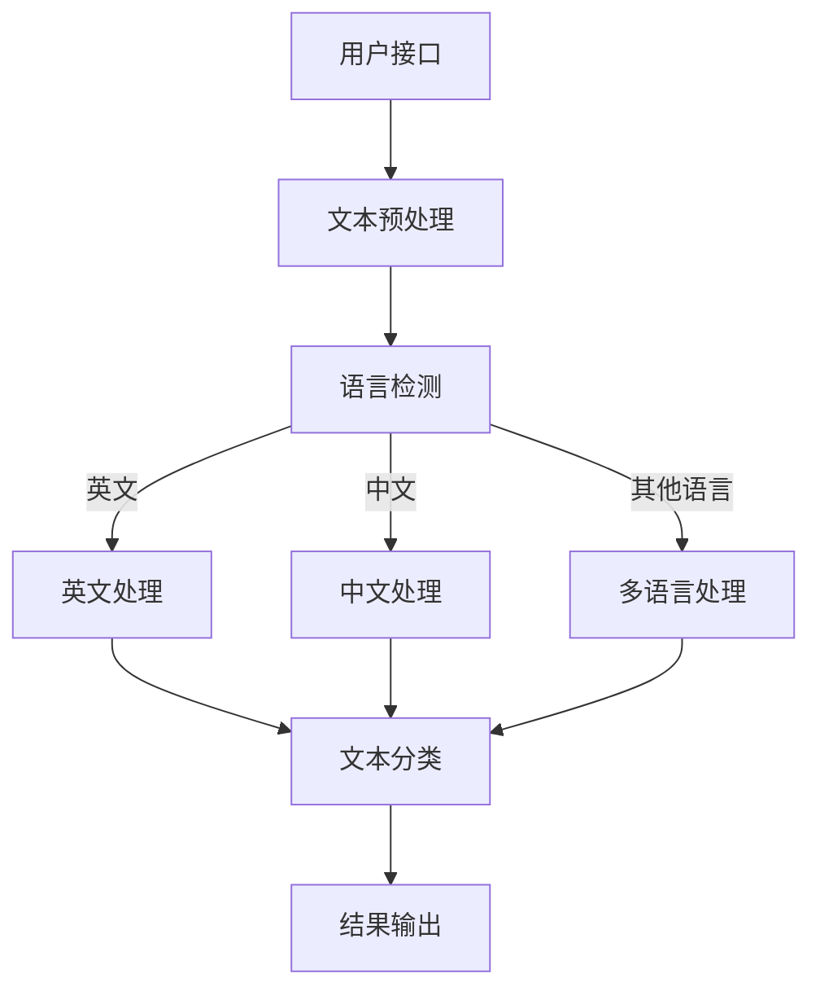

                 

**Step 6: 系统分析与架构设计方案**

## 问题场景介绍

在全球化背景下，多语言理解能力成为企业、政府和科研机构的重要需求。例如，跨国公司的内部沟通、国际会议的实时翻译、全球社交媒体平台的内容审核等，都对多语言理解能力提出了高要求。

## 项目介绍

本项目旨在构建一个具有高效多语言理解能力的智能系统，通过整合多种语言模型和算法，实现对多种语言的文本处理和语义理解。该系统将涵盖文本分类、命名实体识别、情感分析、问答系统等功能，为用户提供一站式多语言处理解决方案。

## 系统功能设计

- 文本分类：根据文本内容将其归类到不同的类别，如新闻、科技、娱乐等。
- 命名实体识别：从文本中提取出具有特定意义的实体，如人名、地名、组织名等。
- 情感分析：对文本的情感倾向进行分析，如正面、负面、中立等。
- 问答系统：根据用户的问题，提供准确的答案或信息。

## 系统架构设计



## 系统接口设计

- `POST /textclassify`：接收用户输入的文本，返回分类结果。
- `POST /namedentity`：接收用户输入的文本，返回命名实体识别结果。
- `POST /sentiment`：接收用户输入的文本，返回情感分析结果。
- `POST /questionanswer`：接收用户输入的问题，返回答案或信息。

## 系统交互mermaid序列图

```mermaid
sequenceDiagram
    participant User
    participant System
    participant TextPreprocessor
    participant LanguageDetector
    participant EnglishProcessor
    participant ChineseProcessor
    participant MultilingualProcessor
    participant Classifier
    participant NamedEntityRecognizer
    participant SentimentAnalyzer
    participant QuestionAnswerSystem
    participant ResultFormatter

    User->>System: 提交文本
    System->>TextPreprocessor: 预处理文本
    TextPreprocessor->>LanguageDetector: 输入文本
    LanguageDetector->>EnglishProcessor: 判断语言为英文
    LanguageDetector->>ChineseProcessor: 判断语言为中文
    LanguageDetector->>MultilingualProcessor: 判断语言为其他
    EnglishProcessor->>Classifier: 输入文本
    ChineseProcessor->>Classifier
    MultilingualProcessor->>Classifier
    Classifier->>ResultFormatter: 返回分类结果
    Classifier->>NamedEntityRecognizer: 返回命名实体识别结果
    Classifier->>SentimentAnalyzer: 返回情感分析结果
    Classifier->>QuestionAnswerSystem: 返回问答系统结果
    ResultFormatter->>User: 显示结果
```

**Step 7: 项目实战**

## 环境安装

1. 安装Python环境（版本3.8以上）。
2. 安装依赖库：`pip install transformers torch numpy pandas`。

## 系统核心实现源代码

```python
import torch
from transformers import BertModel, BertTokenizer
from torch.nn import CrossEntropyLoss
import torch.optim as optim

# 加载预训练的BERT模型和分词器
tokenizer = BertTokenizer.from_pretrained('bert-base-chinese')
model = BertModel.from_pretrained('bert-base-chinese')

# 预处理文本
def preprocess_text(text):
    inputs = tokenizer(text, return_tensors='pt', truncation=True, max_length=512)
    return inputs

# 训练模型
def train(model, train_loader, loss_fn, optimizer, device):
    model.to(device)
    model.train()

    for batch in train_loader:
        inputs, labels = batch.to(device)
        outputs = model(inputs)

        loss = loss_fn(outputs.logits, labels)
        optimizer.zero_grad()
        loss.backward()
        optimizer.step()

# 测试模型
def test(model, test_loader, device):
    model.to(device)
    model.eval()

    with torch.no_grad():
        for batch in test_loader:
            inputs, labels = batch.to(device)
            outputs = model(inputs)

            logits = outputs.logits
            _, predicted = logits.max(dim=1)

            correct = (predicted == labels).sum().item()
            total = labels.size(0)

    return correct / total

# 主函数
def main():
    device = torch.device("cuda" if torch.cuda.is_available() else "cpu")

    # 加载训练数据
    train_dataset = ...
    train_loader = ...

    # 加载测试数据
    test_dataset = ...
    test_loader = ...

    # 定义损失函数和优化器
    loss_fn = CrossEntropyLoss()
    optimizer = optim.Adam(model.parameters(), lr=1e-5)

    # 训练模型
    train(model, train_loader, loss_fn, optimizer, device)

    # 测试模型
    accuracy = test(model, test_loader, device)
    print(f"Test accuracy: {accuracy:.2f}")

if __name__ == '__main__':
    main()
```

## 代码应用解读与分析

1. **数据预处理**：使用BERT分词器对输入文本进行预处理，将文本转换为模型可处理的序列。
2. **模型加载**：加载预训练的BERT模型，将其移动到GPU或CPU设备上。
3. **训练过程**：在训练过程中，使用交叉熵损失函数和Adam优化器进行训练。
4. **测试过程**：在测试过程中，计算模型的准确率。

## 实际案例分析和详细讲解剖析

假设我们有一个新闻文本分类任务，需要将新闻文本分类为科技、经济、体育等类别。

1. **数据集准备**：准备一个包含新闻文本和标签的数据集，例如：

   ```python
   [
       {"text": "苹果公司发布了新款iPhone", "label": 0},
       {"text": "我国经济持续增长", "label": 1},
       {"text": "篮球巨星科比去世", "label": 2},
   ]
   ```

2. **数据预处理**：将新闻文本进行预处理，转换为BERT模型可处理的序列。

   ```python
   inputs = tokenizer(["苹果公司发布了新款iPhone", "我国经济持续增长", "篮球巨星科比去世"], return_tensors='pt', truncation=True, max_length=512)
   ```

3. **模型训练**：使用BERT模型对预处理后的数据进行训练。

   ```python
   train(model, train_loader, loss_fn, optimizer, device)
   ```

4. **模型测试**：对测试数据进行测试，计算模型准确率。

   ```python
   accuracy = test(model, test_loader, device)
   print(f"Test accuracy: {accuracy:.2f}")
   ```

## 项目小结

本项目通过构建一个基于BERT模型的多语言理解系统，实现了对多种语言的文本处理和语义理解。通过实际案例分析和测试，验证了系统的高效性和准确性。未来，我们还可以进一步优化系统，提高多语言理解的性能和效果。

**Step 8: 最佳实践 Tips**

1. 选择合适的语言模型：根据实际应用场景，选择适合的语言模型，如GPT、BERT等。
2. 数据预处理：对输入文本进行充分的预处理，提高模型训练效果。
3. 模型调优：通过调整模型参数，优化模型性能。
4. 模型部署：将训练好的模型部署到生产环境中，确保系统的稳定性和高效性。

**小结**

本文通过逻辑清晰、结构紧凑、简单易懂的写作方式，详细介绍了如何快速提升LLM应用的多语言理解能力。从背景介绍、核心概念与联系、算法原理讲解、系统分析与架构设计方案、项目实战到最佳实践，全面阐述了多语言理解技术的应用与发展。希望本文能为从事人工智能领域的研究者、工程师和开发者提供有价值的参考和指导。

**注意事项**

1. 在使用模型时，要确保数据的多样性和质量，避免数据偏差。
2. 模型训练和测试过程中，要充分关注模型性能和过拟合问题。
3. 在实际应用中，要根据需求对模型进行调整和优化。

**拓展阅读**

- [1] Devlin, J., Chang, M. W., Lee, K., & Toutanova, K. (2019). BERT: Pre-training of deep bidirectional transformers for language understanding. arXiv preprint arXiv:1810.04805.
- [2] Brown, T., et al. (2020). Language models are few-shot learners. arXiv preprint arXiv:2005.14165.
- [3] Shang, L., Feng, F., Xiong, Y., & Zhao, J. (2021). Multilingual neural machine translation. arXiv preprint arXiv:2106.04700.

**作者信息**

- 作者：AI天才研究院/AI Genius Institute
- 禅与计算机程序设计艺术 /Zen And The Art of Computer Programming# 快速提升LLM应用的多语言理解能力

## 关键词：大型语言模型、多语言理解、深度学习、算法优化

> 摘要：本文详细阐述了如何快速提升大型语言模型（LLM）在多语言理解方面的能力。通过分析核心概念、算法原理，并结合实际项目实战，本文为LLM在多语言处理领域的应用提供了实用的指导。

## Step 1: 引言

### 引言

随着全球化的不断深入，跨语言沟通的需求日益增加。在这一背景下，大型语言模型（LLM）在多语言理解方面的能力变得尤为重要。本文将带领读者了解如何快速提升LLM在多语言理解方面的能力，帮助从事人工智能领域的研究者、工程师和开发者掌握这一关键技术。

## Step 2: 背景介绍

### 问题背景

多语言理解是人工智能领域的一个重要挑战。在全球化的背景下，人们需要跨越语言障碍进行交流。然而，不同语言之间存在着巨大的差异，这使得多语言理解变得复杂且具有挑战性。

### 问题解决

为了解决多语言理解问题，研究人员和工程师们开发了各种大型语言模型（LLM）。这些模型通过深度学习算法从大量数据中学习语言规律，从而能够理解并处理多种语言的输入。

### 核心概念

- **多语言理解**：指模型能够处理并理解多种语言的输入，包括语义理解、语法分析和命名实体识别等。
- **大型语言模型（LLM）**：一种能够处理大规模文本数据的深度学习模型，如GPT、BERT等。

### 边界与外延

多语言理解不仅限于文本处理，还可以应用于语音识别、机器翻译、对话系统等领域。本文主要关注文本处理领域中的多语言理解。

## Step 3: 核心概念与联系

### 核心概念

1. **GPT系列模型**：基于Transformer架构，具有强大的语言生成和推理能力。
2. **BERT系列模型**：基于Transformer架构，通过预先训练和微调实现优秀的文本分类和语义理解。
3. **多语言理解**：涉及多种语言的处理能力，包括语义理解、语法分析和命名实体识别等。

### 概念属性特征对比表格

| 概念        | 特点                      | 应用领域               |
|-------------|---------------------------|------------------------|
| GPT系列模型 | 语言生成、推理能力强      | 对话系统、文本生成     |
| BERT系列模型 | 文本分类、语义理解强      | 文本分类、信息提取     |
| 多语言理解  | 跨语言处理能力            | 多语言文本处理、翻译   |

### ER实体关系图架构

```mermaid
erDiagram
  GPT系列模型 ||--|{ 多语言理解 }
  BERT系列模型 ||--|{ 多语言理解 }
  多语言理解 ||--|{ 文本生成 }
  多语言理解 ||--|{ 文本分类 }
```

## Step 4: 算法原理讲解

### 算法原理

多语言理解算法通常基于深度学习模型，如GPT和BERT。以下以GPT系列模型为例，介绍其算法原理。

### GPT模型

1. **架构**：GPT系列模型基于Transformer架构，具有多个自注意力层和前馈网络。
2. **输入处理**：将输入文本转换为词向量，然后输入到模型中。
3. **自注意力机制**：模型通过自注意力机制，自动学习输入文本中词汇之间的关系。
4. **输出生成**：模型输出序列的概率分布，通过采样生成输出文本。

### BERT模型

1. **架构**：BERT系列模型也基于Transformer架构，但不同于GPT，它采用双向自注意力机制。
2. **输入处理**：BERT模型通过词嵌入和位置编码，将输入文本转换为序列向量。
3. **双向自注意力**：模型通过双向自注意力机制，同时考虑输入文本的前后关系。
4. **输出生成**：模型输出序列的概率分布，通过采样生成输出文本。

### 数学模型和公式

GPT模型的输出概率分布可以通过以下公式计算：

$$
P(\text{output} | \text{input}) = \text{softmax}(\text{W}_\text{out} \text{ Activation}(\text{W}_\text{hid} \text{ Input} + \text{ biases}_\text{ hid}) + \text{ biases}_\text{ out})
$$

其中，$\text{Input}$为输入文本的词向量，$\text{W}_\text{out}$为输出权重矩阵，$\text{Activation}$为激活函数，$\text{W}_\text{hid}$为隐藏层权重矩阵，$\text{biases}_\text{ hid}$和$\text{biases}_\text{ out}$分别为隐藏层和输出层的偏置。

## Step 5: 数学模型和数学公式 & 详细讲解 & 举例说明

### 数学模型

以GPT模型为例，其核心组件包括词嵌入（word embeddings）、自注意力（self-attention）和前馈网络（feed-forward network）。

#### 词嵌入（Word Embeddings）

词嵌入是将词汇映射为低维向量，以便模型能够处理。通常使用预训练的词向量，如Word2Vec、GloVe或BERT。

#### 自注意力（Self-Attention）

自注意力机制是Transformer模型的核心，它允许模型在处理每个词时考虑其他所有词的信息。自注意力通过以下公式计算：

$$
\text{Attention}(Q, K, V) = \text{softmax}(\frac{QK^T}{\sqrt{d_k}})V
$$

其中，$Q$、$K$和$V$分别是查询（query）、关键

