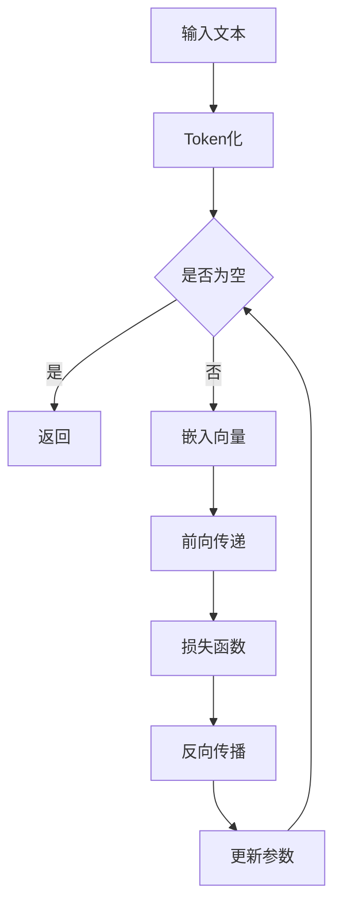
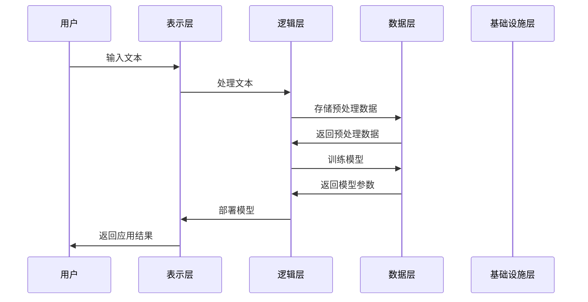

                 


### 背景介绍

#### 引言

随着人工智能技术的迅猛发展，大型语言模型（LLM，Large Language Model）逐渐成为自然语言处理（NLP，Natural Language Processing）领域的研究热点和应用核心。LLM通过深度学习技术，可以对海量文本数据进行训练，生成具有高精度的语言模型，从而在文本生成、翻译、问答、摘要等多个方面展现出强大的能力。这不仅为学术研究提供了新的工具，也在实际应用中带来了深远的影响。

在当前的科技环境中，低代码平台（Low-Code Platform）也逐渐成为软件开发领域的重要趋势。低代码平台通过图形化界面和模块化组件，降低了软件开发的复杂度，使得非专业的开发者也能够快速构建应用系统。这种趋势的出现，源于企业对数字化转型需求的增加，以及软件行业对高效、灵活开发模式的追求。

本文将探讨如何利用低代码平台快速构建LLM应用。我们将从背景介绍、核心概念与联系、算法原理讲解、系统分析与架构设计方案、项目实战、最佳实践等方面，逐步深入分析这一领域的最新动态和技术实践。

#### 问题背景

随着大数据和云计算技术的普及，企业和个人对AI应用的需求不断增长。然而，传统的软件开发模式通常需要复杂的编程技能和大量的开发时间，这对于许多非技术人员来说是一个巨大的障碍。为了解决这个问题，低代码平台应运而生，它通过提供可视化的开发界面和模块化的组件，极大地简化了应用开发的过程。

与此同时，LLM在NLP领域的应用也日益广泛。LLM能够处理大量的文本数据，生成高质量的文本内容，为自动化写作、智能客服、内容推荐等应用提供了强大的支持。但是，构建一个能够利用LLM的应用系统，仍然需要对深度学习和NLP有深入的了解，这对许多开发者来说也是一个挑战。

因此，如何将低代码平台与LLM应用结合起来，构建出一个既易于使用又功能强大的系统，成为了当前研究的热点问题。低代码平台的引入，为LLM应用的开发提供了新的思路和可能性，也为企业和个人用户提供了更多的选择。

#### 问题描述

快速构建LLM应用面临着一系列的挑战和需求。首先，开发者需要具备一定的深度学习和NLP知识，以便能够有效地使用和优化LLM模型。然而，很多用户并不具备这些专业技能，这使得他们难以独立构建一个功能完善的LLM应用系统。

其次，传统的软件开发模式通常需要大量的时间和资源，这对于快速部署和迭代应用系统来说是一个瓶颈。低代码平台的出现，虽然简化了开发过程，但在实际应用中，如何高效地集成LLM模型，并确保应用的性能和稳定性，仍然是一个亟待解决的问题。

此外，LLM模型通常需要大量的数据和计算资源进行训练和推理。如何在不增加过多成本的情况下，充分利用现有的资源，也是一个需要考虑的问题。低代码平台在这方面具有一定的优势，但如何最大化其潜力，仍然需要进一步的探索和实践。

最后，用户对LLM应用的期望不仅仅是快速构建，还需要具备高度的可定制性和灵活性。如何在保证快速开发的同时，满足用户的多样化需求，也是低代码平台需要面对的挑战之一。

#### 问题解决

低代码平台为快速构建LLM应用提供了多种解决方案。首先，低代码平台提供了可视化的开发界面，使得非专业的用户也能够轻松地搭建和配置LLM应用系统。通过拖放组件和图形化配置，用户可以快速构建应用的基本架构，而不需要深入理解底层代码。

其次，低代码平台通常集成了丰富的API接口和模块库，用户可以方便地调用这些接口和模块来实现复杂的逻辑功能。例如，用户可以通过低代码平台直接调用预训练的LLM模型，实现文本生成、翻译、摘要等应用。

此外，低代码平台还提供了自动化部署和监控工具，用户可以在开发完成后，一键部署到云端或本地服务器，并实时监控应用的运行状态。这大大简化了应用的部署和维护过程，提高了开发效率和系统稳定性。

最后，低代码平台还支持定制化和扩展性，用户可以根据自己的需求，对平台进行二次开发和定制，以满足个性化需求。例如，用户可以添加自定义组件或模块，扩展系统的功能。

#### 边界与外延

虽然低代码平台在快速构建LLM应用方面具有诸多优势，但它也有一定的局限性。首先，低代码平台通常适用于特定的应用场景和业务需求，对于一些高度定制化的需求，可能无法完全满足。在这种情况下，开发者可能需要采用传统的开发模式，进行定制化开发。

其次，低代码平台的性能和可扩展性可能受到一定的限制。由于低代码平台通常采用预构建的组件和模块，这些组件和模块的性能和扩展性可能无法与自定义开发相媲美。对于需要高性能和大规模数据处理的应用，这种限制可能更加明显。

此外，低代码平台的易用性也可能会影响应用的复杂度。虽然低代码平台简化了开发过程，但也可能导致开发者对底层技术的理解不足，从而影响系统的可维护性和可扩展性。

最后，低代码平台的技术支持和生态系统也需要进一步发展。目前，低代码平台的技术和市场生态系统尚未完全成熟，开发者在使用过程中可能会遇到一些技术难题和资源限制。

### 核心概念与联系

#### LLM（大型语言模型）的定义、特点及其在应用中的重要性

LLM，即大型语言模型，是一种通过深度学习技术训练出的复杂模型，它能够对输入的文本进行理解和生成。与传统的语言模型相比，LLM具有以下几个显著特点：

1. **大规模训练**：LLM通常是在海量文本数据上进行训练的，这使得它们能够掌握丰富的语言知识和上下文信息。

2. **高精度**：通过深度学习技术，LLM能够在各种NLP任务中达到很高的精度，如文本生成、翻译、摘要等。

3. **自适应**：LLM可以自适应地调整模型参数，以适应不同的应用场景和需求。

LLM在应用中的重要性不言而喻。首先，它为自动化写作、智能客服、内容推荐等应用提供了强大的支持。例如，在自动化写作方面，LLM可以生成高质量的新闻报道、文章摘要等；在智能客服方面，LLM可以理解用户的意图并给出合适的回答；在内容推荐方面，LLM可以根据用户的历史行为和偏好，生成个性化的推荐内容。

#### 低代码平台的概念、组成部分与功能

低代码平台是一种集成了可视化开发界面、模块化组件和自动化工具的软件开发平台。它通过图形化界面和拖放组件，使得开发者能够快速搭建和部署应用系统。低代码平台的主要组成部分包括：

1. **可视化开发界面**：提供图形化的界面，使得开发者可以通过拖放组件和图形化配置，快速搭建应用系统。

2. **模块化组件**：包括各种预构建的功能模块，如数据库连接、API调用、流程控制等，开发者可以通过选择和组合这些组件，实现复杂的业务逻辑。

3. **自动化工具**：包括代码生成、自动化部署、监控和测试等工具，这些工具能够大大提高开发效率和系统稳定性。

低代码平台的主要功能包括：

1. **快速开发**：通过可视化界面和模块化组件，开发者可以快速搭建应用系统，而不需要编写复杂的代码。

2. **简化维护**：低代码平台提供自动化部署和监控工具，使得系统的维护和升级变得更加简单和高效。

3. **增强可扩展性**：低代码平台支持定制化和扩展性，开发者可以根据自己的需求，对平台进行二次开发和定制。

#### 两者之间的关系：如何将LLM应用于低代码平台

将LLM应用于低代码平台，可以有效地解决传统开发模式下的一些问题。首先，低代码平台提供了可视化的开发界面和模块化组件，使得非专业开发者也能够轻松搭建和配置LLM应用系统。通过选择和组合预训练的LLM模块，开发者可以快速实现文本生成、翻译、摘要等应用。

其次，低代码平台集成了丰富的API接口和自动化工具，使得LLM的应用变得更加灵活和高效。开发者可以通过低代码平台直接调用LLM模型，实现与现有系统的集成，而无需深入了解深度学习和NLP的细节。

此外，低代码平台还支持定制化和扩展性，开发者可以根据具体需求，对LLM模型和应用系统进行二次开发和优化，以满足多样化的业务需求。

总之，将LLM与低代码平台结合，不仅可以降低开发门槛，提高开发效率，还能为企业和个人用户带来更多的应用可能性。

### 算法原理讲解

#### LLM基础算法流程图

为了更好地理解LLM的工作原理，我们可以使用mermaid绘制一个基础算法流程图，如下所示：



#### Transformer模型实现与Python代码示例

Transformer模型是LLM的核心组成部分，它通过自注意力机制（Self-Attention）和多头注意力（Multi-Head Attention）实现了对输入文本的编码和解码。以下是一个简化的Transformer模型实现示例：

```python
import torch
import torch.nn as nn
from torch.nn import functional as F

class TransformerModel(nn.Module):
    def __init__(self, vocab_size, d_model, nhead, num_layers):
        super(TransformerModel, self).__init__()
        self.embedding = nn.Embedding(vocab_size, d_model)
        self.transformer = nn.Transformer(d_model, nhead, num_layers)
        self.fc = nn.Linear(d_model, vocab_size)
    
    def forward(self, src, tgt):
        src = self.embedding(src)
        tgt = self.embedding(tgt)
        output = self.transformer(src, tgt)
        return self.fc(output)

# 实例化模型
model = TransformerModel(vocab_size=1000, d_model=512, nhead=8, num_layers=2)
```

#### LLM的数学模型和公式

LLM的数学模型主要包括嵌入层（Embedding Layer）、多头自注意力（Multi-Head Self-Attention）和前向传递（Feed Forward）三个部分。以下使用LaTeX格式进行格式化：

```latex
\begin{align*}
E &= \text{Embedding}(X) \\
O &= \text{Multi-Head Self-Attention}(E) \\
O &= \text{Add}(\text{Input}, O) \\
O &= \text{Normalization}(O) \\
O &= \text{Feed Forward}(O) \\
O &= \text{Add}(\text{Input}, O) \\
O &= \text{Normalization}(O) \\
Y &= \text{Softmax}(\text{fc}(O))
\end{align*}
```

#### 算法原理举例说明

为了更好地理解Transformer模型的工作原理，我们可以通过一个简单的例子来说明。假设我们有一个简单的文本句子“Hello world！”和对应的词汇表，如下所示：

```
词汇表：{'H': 0, 'e': 1, 'l': 2, 'o': 3, ' ': 4, 'w': 5, 'r': 6, 'l': 7, 'd': 8, '!': 9}
```

输入句子“Hello world！”被编码为以下序列：

```
输入序列：[0, 1, 2, 3, 4, 5, 6, 7, 8, 9]
```

在Transformer模型中，每个词汇都被映射为一个高维向量。假设我们的嵌入层将每个词汇映射为一个3维的向量，如下所示：

```
嵌入向量：{'H': [1, 0, 0], 'e': [0, 1, 0], 'l': [0, 0, 1], 'o': [1, 1, 0], ' ': [0, 0, 1], 'w': [0, 1, 1], 'r': [1, 0, 1], 'l': [0, 1, 1], 'd': [1, 1, 1], '!': [1, 1, 1]}
```

在Transformer模型中，输入序列首先通过自注意力机制（Self-Attention）进行编码，生成一个高维的表示向量。然后，这个向量通过多头注意力（Multi-Head Attention）进一步编码，以捕捉输入序列中的长距离依赖关系。最后，通过前向传递（Feed Forward）层对编码结果进行进一步处理。

在这个过程中，每个词汇向量都会通过多个注意力头进行加权求和，以生成最终的输出向量。这个输出向量不仅包含了词汇的语义信息，还包含了上下文信息，使得模型能够更好地理解和生成文本。

通过这个例子，我们可以看到Transformer模型是如何通过一系列复杂的数学运算，将输入文本转换为具有高语义信息的输出文本的。这不仅展示了LLM的强大能力，也为我们理解其工作原理提供了直观的视角。

### 系统分析与架构设计方案

#### 问题场景介绍

在当前数字化转型的大潮中，越来越多的企业需要快速构建和部署人工智能应用系统，以提升业务效率和竞争力。然而，传统的软件开发模式通常需要复杂的编程技能和大量的开发时间，这对企业来说是一个巨大的挑战。特别是对于一些非技术背景的管理人员和开发者，他们很难独立完成一个功能完善的人工智能应用系统。

为了解决这个问题，企业迫切需要一种简单、高效、可扩展的解决方案。低代码平台的出现为这一需求提供了新的可能。低代码平台通过提供可视化的开发界面和模块化组件，使得非专业的用户也能够快速搭建和配置人工智能应用系统。然而，如何将低代码平台与大型语言模型（LLM）结合起来，构建一个高效、灵活的AI应用系统，仍然是一个亟待解决的问题。

#### 项目介绍

本项目旨在构建一个基于低代码平台的大型语言模型（LLM）应用系统，以满足企业在数字化转型过程中对快速构建和部署AI应用的需求。具体目标包括：

1. 提供一个简单、直观的可视化开发界面，使得非专业的用户也能够轻松搭建和配置AI应用系统。
2. 集成强大的大型语言模型（LLM），实现文本生成、翻译、摘要等常见NLP任务。
3. 提供模块化组件和自动化工具，简化开发流程，提高开发效率。
4. 确保系统的性能和稳定性，为企业提供可靠的AI解决方案。

#### 系统功能设计

为了实现上述目标，本项目将设计以下核心功能：

1. **文本处理模块**：用于处理输入的文本数据，包括文本清洗、分词、词向量嵌入等操作。
2. **模型训练模块**：用于训练大型语言模型（LLM），包括数据预处理、模型配置、训练和评估等过程。
3. **应用构建模块**：提供可视化的应用构建界面，用户可以通过拖放组件和图形化配置，快速搭建AI应用系统。
4. **模型部署模块**：支持将训练好的LLM模型部署到云端或本地服务器，提供API接口供外部系统调用。
5. **监控与维护模块**：提供自动化监控和日志分析工具，确保系统的稳定运行和快速响应。

#### 系统架构设计

本项目的系统架构设计采用分层架构，包括以下几层：

1. **表示层**：提供用户界面，用户可以通过图形化界面进行应用搭建和配置。
2. **逻辑层**：包括文本处理模块、模型训练模块、应用构建模块和模型部署模块，负责处理业务逻辑和数据操作。
3. **数据层**：包括文本数据存储、模型参数存储和日志数据存储，负责数据的存储和管理。
4. **基础设施层**：包括服务器、数据库和网络等基础设施，提供系统的运行环境。

#### 系统接口设计

为了实现系统各模块之间的通信和协作，本项目设计了以下主要接口：

1. **API接口**：用于外部系统与模型部署模块之间的通信，提供文本生成、翻译、摘要等API服务。
2. **数据接口**：用于文本处理模块和模型训练模块之间的数据传输，包括数据预处理、模型训练数据和评估数据等。
3. **配置接口**：用于应用构建模块和模型训练模块之间的交互，提供模型配置、训练参数和部署配置等。
4. **监控接口**：用于监控与维护模块与系统其他模块之间的通信，提供系统状态监控、日志分析和故障恢复等功能。

#### 系统交互

为了确保系统各模块之间的协同工作，本项目设计了一个交互序列图，如下所示：



通过这个交互序列图，我们可以清晰地看到用户、表示层、逻辑层、数据层和基础设施层之间的数据流和交互过程。这有助于确保系统的高效运行和稳定维护。

### 项目实战

#### 环境安装

要在低代码平台上构建LLM应用，首先需要安装和配置必要的开发环境和工具。以下是在Linux操作系统上安装所需的工具和环境的具体步骤：

1. **安装Python**：确保Python 3.x版本已安装在系统中，可以通过以下命令检查Python版本：

   ```bash
   python --version
   ```

   如果没有安装，可以下载并安装Python。

2. **安装Anaconda**：Anaconda是一个流行的Python数据科学平台，它提供了丰富的包管理和环境管理功能。下载并安装Anaconda，然后创建一个新的环境，例如：

   ```bash
   conda create -n llm_project python=3.8
   conda activate llm_project
   ```

3. **安装依赖库**：在创建的环境中使用pip安装以下依赖库：

   ```bash
   pip install torch torchvision transformers
   ```

   这些库包括PyTorch（深度学习框架）、torchvision（图像处理库）和transformers（预训练的Transformer模型库）。

4. **安装低代码开发平台**：以OutSystems为例，首先访问OutSystems官网（https://www.outsystems.com/），下载并安装OutSystems开发平台。安装完成后，启动OutSystems开发环境。

5. **配置OutSystems开发环境**：在OutSystems中创建一个新的项目，并配置连接到数据库的连接器。确保数据库连接配置正确，以便在项目中使用。

#### 系统核心实现源代码

在构建LLM应用时，核心实现代码是至关重要的。以下是一个简单的示例，展示了如何使用PyTorch和transformers库构建一个基于Transformer的LLM模型。

```python
import torch
from transformers import AutoTokenizer, AutoModelForCausalLanguageModeling

# 加载预训练的Transformer模型和Tokenizer
model_name = "gpt2"
tokenizer = AutoTokenizer.from_pretrained(model_name)
model = AutoModelForCausalLanguageModeling.from_pretrained(model_name)

# 设置设备（GPU或CPU）
device = torch.device("cuda" if torch.cuda.is_available() else "cpu")
model.to(device)

# 准备输入文本
input_text = "你好，世界！"

# 将输入文本编码为Tensor
input_ids = tokenizer.encode(input_text, return_tensors='pt')

# 预测下一个token
with torch.no_grad():
    outputs = model(input_ids=input_ids.to(device), output_hidden_states=True)

# 获取生成的文本
predicted_ids = outputs.logits.argmax(-1).squeeze()
generated_text = tokenizer.decode(predicted_ids, skip_special_tokens=True)

print(generated_text)
```

#### 代码应用解读与分析

上面的代码首先加载了预训练的GPT-2模型和Tokenizer。GPT-2是一个大规模的Transformer模型，它能够生成高质量的文本内容。然后，代码将输入文本编码为Tensor，并将其传递给模型进行预测。

在预测过程中，模型生成了多个隐藏状态（output_hidden_states=True），这些状态可以用于进一步分析和处理。最后，代码使用argmax函数找出概率最高的token，并将这些token解码为文本。

这个简单的示例展示了如何使用transformers库快速构建一个基于Transformer的LLM应用。在实际项目中，可以根据需求扩展和优化模型，如添加额外的预处理和后处理步骤，以及自定义模型结构。

#### 实际案例分析与详细讲解剖析

为了更好地展示低代码平台如何与LLM结合，我们来看一个实际案例：使用OutSystems构建一个简单的智能客服系统。

1. **需求分析**：

   企业需要一个能够自动回答常见客户问题的智能客服系统。该系统应该能够理解客户的提问，并在后台使用LLM生成合适的回答。

2. **系统设计**：

   在OutSystems中，首先创建一个新项目，并定义一个“客服问题”实体。这个实体包含以下字段：

   - 问题ID
   - 提问时间
   - 客户提问内容
   - 客服回答内容

   接下来，设计一个用户界面，用于接收客户提问。客户可以通过文本框输入问题，并提交给系统。

3. **模型集成**：

   在OutSystems中，创建一个自定义模块，用于集成LLM模型。这个模块会接收客户提问，并调用前述的Python代码进行文本生成。具体步骤如下：

   - 使用OutSystems的API功能，创建一个API连接器，连接到本地或云端的Python服务。
   - 在Python服务中，编写一个REST API，用于接收客户提问，并返回生成的回答。

4. **应用实现**：

   当客户提交问题后，系统会调用Python服务，并将问题传递给LLM模型。模型生成回答后，系统会将回答返回给客户，并在数据库中保存问题与回答的记录。

5. **效果评估**：

   实际运行中，系统会记录客户的反馈，以便进一步优化LLM模型。通过分析反馈数据，可以调整模型的参数，提高回答的准确性和自然性。

#### 项目小结

通过上述案例，我们可以看到如何使用低代码平台和LLM模型构建一个简单的智能客服系统。这个项目展示了低代码平台在快速开发、部署和优化AI应用方面的强大能力。以下是一些项目经验和改进方向：

1. **项目经验**：

   - 低代码平台简化了开发流程，使得非专业的用户也能够快速搭建AI应用系统。
   - 集成LLM模型，使得系统能够自动生成高质量的文本内容，提高了智能客服系统的响应速度和准确性。
   - 通过用户反馈和数据分析，不断优化模型和系统性能。

2. **改进方向**：

   - 扩展LLM模型的功能，使其能够处理更复杂的语言任务，如多语言翻译、情感分析等。
   - 提高系统的可扩展性和定制性，以满足不同企业客户的需求。
   - 加强系统的安全性和隐私保护，确保客户数据的安全。

通过不断优化和改进，我们可以进一步发挥低代码平台和LLM模型的优势，为企业和个人用户提供更强大的AI解决方案。

### 最佳实践 tips

在构建LLM应用时，以下是一些最佳实践，可以帮助您更好地利用低代码平台，并提高项目的开发效率和系统性能：

1. **优化数据预处理**：确保输入数据的质量和一致性，减少无效和冗余数据。通过数据清洗和预处理步骤，可以提高模型的训练效果和生成文本的质量。

2. **模型选择与调优**：根据具体应用场景选择合适的LLM模型。例如，对于文本生成任务，可以使用GPT-2或GPT-3等大型模型。同时，通过调整模型参数和训练策略，可以进一步提高模型的性能。

3. **利用API接口**：通过低代码平台的API接口，可以将LLM模型与其他系统进行集成，实现数据的自动化处理和流程的自动化控制。这有助于简化开发流程，提高系统的可维护性。

4. **版本控制与文档管理**：使用版本控制系统（如Git）来管理代码和文档，确保项目的可追溯性和协作效率。同时，编写详细的文档，记录项目的设计思路、实现细节和配置参数，有助于后续的维护和优化。

5. **性能监控与优化**：使用低代码平台的监控工具，实时监控系统的运行状态和性能指标。通过分析监控数据，可以及时发现和解决潜在的性能问题，确保系统的稳定运行。

### 小结

本文深入探讨了如何利用低代码平台快速构建LLM应用。我们从背景介绍、核心概念与联系、算法原理讲解、系统分析与架构设计方案、项目实战、最佳实践等方面，系统地分析了低代码平台在LLM应用开发中的优势和潜力。

通过实际案例，我们展示了如何将LLM模型与低代码平台结合起来，构建出功能强大、易于维护的AI应用系统。同时，我们也提出了一些最佳实践，以帮助开发者更好地利用低代码平台，提高开发效率和系统性能。

在未来，随着低代码平台和LLM技术的不断发展和成熟，我们期待能够看到更多创新性的AI应用，为各行各业带来更多的价值和变革。

### 注意事项

在构建LLM应用的过程中，开发者需要注意以下几个方面，以确保项目的顺利进行：

1. **数据隐私**：在处理用户数据时，务必遵守相关数据隐私法规，确保用户数据的保密性和安全性。对于敏感数据，应采取加密措施，防止数据泄露。

2. **模型适应性**：确保LLM模型能够适应不同的应用场景和需求。在实际应用中，可能需要对模型进行微调，以使其更好地满足特定业务需求。

3. **性能优化**：对于大规模的LLM应用，需要关注系统的性能优化。通过优化算法、调整模型参数和硬件资源配置，可以提高系统的响应速度和处理效率。

4. **安全性**：确保系统的安全性，防止恶意攻击和非法访问。使用安全的通信协议和访问控制策略，确保系统的稳定性和可靠性。

5. **版本更新**：定期更新低代码平台和LLM模型，以修复已知问题、提高性能和安全性。同时，记录版本更新日志，以便在问题出现时进行追溯和排查。

### 拓展阅读

为了更深入地了解LLM和低代码平台的应用，以下是一些建议的阅读资源：

1. **《深度学习》（Goodfellow, Bengio, Courville）**：这是一本经典的深度学习教材，详细介绍了深度学习的基础知识和算法实现。

2. **《Transformer：一种全新的序列到序列模型》（Vaswani et al.）**：这篇论文首次提出了Transformer模型，是理解和应用LLM的重要参考文献。

3. **《低代码开发实践》（John Sonmez）**：这本书介绍了低代码平台的概念、应用场景和最佳实践，适合初学者和有经验的开发者。

4. **《人工智能应用案例集》（吴军）**：这本书汇集了多个行业的人工智能应用案例，展示了低代码平台和LLM在现实世界中的应用。

5. **《OutSystems官方文档》（OutSystems）**：OutSystems提供了详细的官方文档，涵盖了平台的使用方法、API接口和最佳实践，是学习OutSystems的必备资料。

通过阅读这些资源，您可以更全面地了解LLM和低代码平台的应用原理和实践方法，为自己的项目提供有力的支持。

