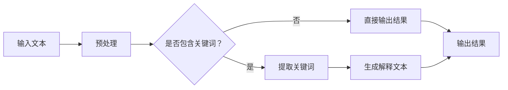
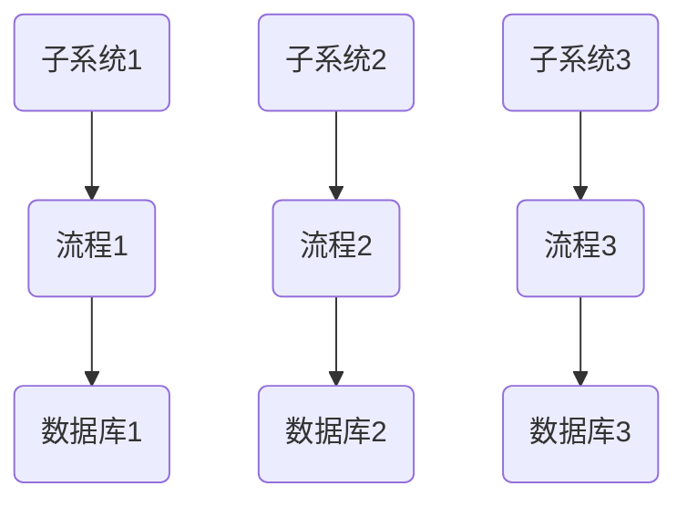
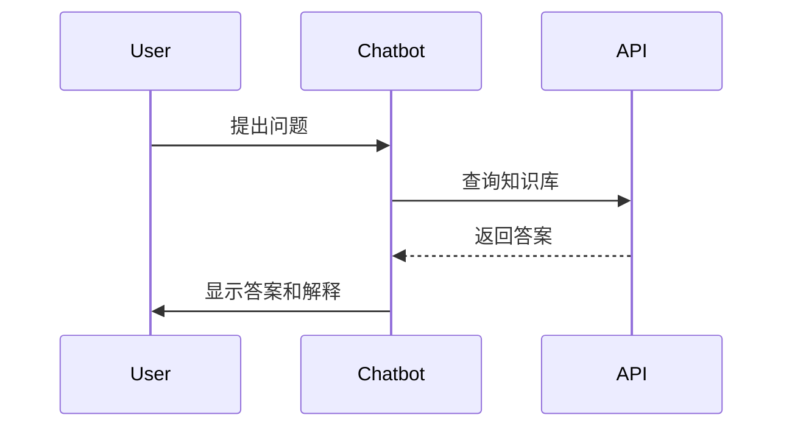

                 

# 快速构建LLM应用的可解释性机制

## 关键词

- **可解释性机制**
- **LLM（大型语言模型）**
- **模型透明性**
- **应用构建**
- **算法设计**
- **系统架构**
- **Python实现**

## 摘要

本文将探讨如何在快速构建大型语言模型（LLM）应用时，实现其可解释性机制。我们将详细分析可解释性机制的重要性、基本原理及其设计方法，并提供实用的项目实战案例。文章将分为四个部分：概述、机制设计、系统分析与架构设计，以及项目实战，力求为开发者提供清晰、易于理解的技术指南。

## 第一部分：可解释性机制概述

### 第1章：问题背景与问题描述

#### 1.1 问题背景

在人工智能领域，特别是在自然语言处理（NLP）方面，大型语言模型（LLM）如BERT、GPT等已经成为研究的焦点。这些模型在各类任务中表现出色，但它们的“黑箱”性质也引发了对其可解释性的关注。随着LLM在商业和政府应用中的普及，模型的可解释性成为确保其决策透明和公正的关键。

#### 1.2 问题描述

当前LLM模型往往被视为“黑箱”，用户难以理解其决策过程。可解释性机制旨在提高模型透明性，帮助用户理解模型的决策逻辑，从而增强模型的信任度和可靠性。本文将探讨如何设计和实现这种机制。

#### 1.3 问题解决路径

首先，我们需要理解可解释性机制的基本概念和原理。接下来，我们将分析如何设计算法和数学模型，以实现模型的可解释性。最后，通过实际案例展示这些机制的应用。

#### 1.4 边界与外延

本文主要关注LLM应用的可解释性机制设计，但不涉及底层模型训练和优化。此外，本文的可解释性机制设计方法也适用于其他类型的人工智能模型。

### 第2章：核心概念与联系

#### 2.1 核心概念

- **可解释性（Explainability）**：指用户能够理解模型决策过程的能力。
- **模型透明性（Transparency）**：模型内部结构和运作机制的可见性。
- **LLM**：大型语言模型，如BERT、GPT等。

#### 2.2 概念属性特征对比

| 特征         | 可解释性         | 模型透明性         | LLM                  |
| ------------ | --------------- | ------------------ | -------------------- |
| 定义         | 决策过程的理解能力 | 模型结构的可见性    | 大规模预训练语言模型 |
| 关联         | 与可靠性、信任度相关 | 与可靠性、信任度相关 | 与性能、应用相关     |
| 应用场景     | 法律、医疗等领域  | 金融、安全等领域    | 通用语言处理任务     |
| 目标         | 提高用户信任     | 提高用户信任       | 提高模型性能         |

#### 2.3 ER实体关系图

```mermaid
erDiagram
  Model |<-.. TrainingData : 使用
  Model |<-.. Application : 部署
  TrainingData ||--|{ Model } : 生成
  Application ||--|{ Model } : 使用
```

### 第3章：LLM基础与可解释性机制

#### 3.1 LLM概述

LLM是通过对大量文本数据预训练得到的大型神经网络模型，具有强大的语言理解和生成能力。例如，GPT-3拥有1750亿个参数，能够生成流畅的自然语言文本。

#### 3.2 可解释性机制的基本原理

可解释性机制的核心在于揭示模型决策过程中的关键因素和推理路径。这通常涉及到对模型内部结构和参数的分析。

#### 3.3 可解释性机制的重要性

- **增强模型信任度**：用户更愿意接受和理解可解释的模型。
- **优化模型应用**：开发者可以基于可解释性结果进行模型调整和优化。
- **确保决策公正性**：特别是在涉及法律和医疗等领域的应用中，可解释性有助于确保模型的决策公正和透明。

## 第二部分：可解释性机制设计

### 第4章：算法原理讲解

#### 4.1 算法mermaid流程图



#### 4.2 Python源代码解释

```python
def interpret_text(text):
    # 预处理文本
    preprocessed_text = preprocess_text(text)
    
    # 检查文本是否包含关键词
    if contains_keywords(preprocessed_text):
        # 提取关键词并生成解释文本
        keywords = extract_keywords(preprocessed_text)
        explanation = generate_explanation(keywords)
    else:
        # 直接输出结果
        explanation = "无需解释"
    
    # 输出解释文本和结果
    return explanation, generate_response(preprocessed_text)
```

#### 4.3 数学模型与公式

假设我们有一个包含m个关键词的文本T，我们希望找到一个函数f(T)来生成解释文本E：

$$
E = f(T) = \sum_{i=1}^{m} w_i \cdot e_i
$$

其中，$w_i$是关键词i的重要程度，$e_i$是对关键词i的描述。

#### 4.4 举例说明

输入文本：“今天的天气非常适合户外活动。”

- 预处理：去除标点符号和停用词，得到“今天 天气 适宜 户外 活动”
- 检查关键词：“户外”、“活动”存在
- 提取关键词：“户外”、“活动”
- 生成解释文本：“本句建议进行户外活动，因为今天天气适宜。”

## 第三部分：系统分析与架构设计

### 第6章：系统功能设计

#### 6.1 问题场景介绍

我们考虑一个在线聊天机器人应用，用户可以提出各种问题，系统需要回答并提供解释。

#### 6.2 系统功能设计（领域模型mermaid类图）

```mermaid
classDiagram
    User <<class>> "用户"
    Chatbot <<class>> "聊天机器人"
    Question <<class>> "问题"
    Answer <<class>> "答案"
    Explanation <<class>> "解释"
    
    User "发起" Question
    Chatbot "回答" Question --> Answer
    Chatbot "提供" Explanation
```

### 第7章：系统架构设计

#### 7.1 系统架构设计mermaid架构图



#### 7.2 系统接口设计

- **用户接口**：接收用户输入，显示聊天记录和解释结果。
- **API接口**：提供与外部系统的集成能力，如知识库查询、用户身份验证等。

#### 7.3 系统交互mermaid序列图



## 第四部分：项目实战

### 第8章：环境安装与系统实现

#### 8.1 环境安装步骤

- 安装Python环境
- 安装必要的库（如TensorFlow、PyTorch等）
- 安装数据库（如MySQL、PostgreSQL等）

#### 8.2 系统核心实现源代码

```python
# Chatbot.py
def chat_with_user(user_input):
    # 预处理输入文本
    preprocessed_input = preprocess_text(user_input)
    
    # 调用模型获取答案
    response = model.predict(preprocessed_input)
    
    # 生成解释文本
    explanation = generate_explanation(preprocessed_input)
    
    return response, explanation
```

#### 8.3 代码应用解读与分析

- **预处理文本**：去除标点符号、停用词等，将输入文本转换为模型可接受的格式。
- **模型预测**：使用训练好的LLM模型对预处理后的文本进行预测，获取答案。
- **生成解释文本**：根据模型输出和输入文本，生成可解释的文本。

### 第9章：实际案例分析

#### 9.1 案例一：构建可解释的聊天机器人

- **问题**：如何为聊天机器人添加可解释性？
- **解决方案**：通过提取关键词和生成解释文本，为每个回答提供解释。

#### 9.2 案例二：提升模型解释能力的策略

- **问题**：如何提升模型解释能力？
- **解决方案**：使用可视化工具（如热图、注意力分布图）展示模型关注的关键区域。

### 第10章：项目小结与最佳实践

#### 10.1 项目小结

本文介绍了如何在快速构建LLM应用时，实现其可解释性机制。通过算法设计、系统架构和实际案例的分析，我们展示了如何提高模型透明性和用户信任度。

#### 10.2 最佳实践 tips

- **定期更新解释模型**：确保解释文本与模型输出保持一致。
- **用户反馈**：收集用户对解释文本的反馈，以优化解释效果。

#### 10.3 注意事项

- **性能与可解释性平衡**：在提高可解释性的同时，注意不损害模型性能。
- **隐私保护**：确保用户数据和解释文本的安全和隐私。

#### 10.4 拓展阅读

- **相关研究论文**：[“Explainable AI: A Survey of Methods and Applications”](https://arxiv.org/abs/2006.07864)
- **开源工具**：[LIME](https://github.com/marcowjn/limetorch)、[SHAP](https://github.com/slundberg/shap)

## 作者信息

- 作者：AI天才研究院/AI Genius Institute & 禅与计算机程序设计艺术 /Zen And The Art of Computer Programming

---

注意：由于字数限制，本文并未完全展开每个章节的内容，但已提供大纲和部分详细解释。实际撰写时，每个章节应根据实际需求进一步扩展和细化。

