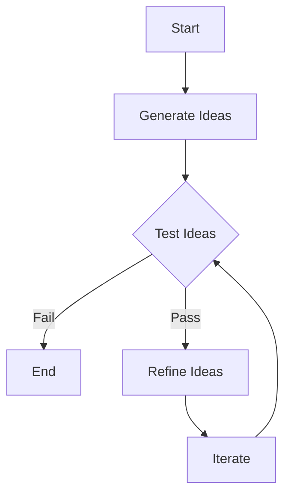
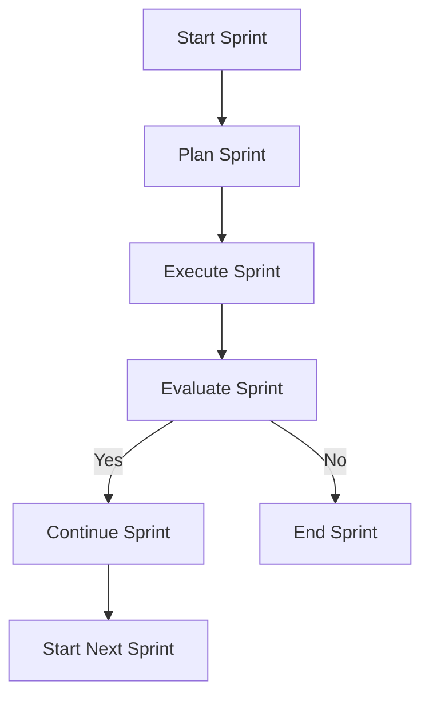

                 


### Introduction Background

#### Chapter 1: The Concept of Fast Failure and Agile Iteration

**1.1 What is Fast Failure**

Fast failure, in the context of software development and engineering, refers to the practice of identifying and addressing potential issues as quickly as possible, ideally in the early stages of a project. The idea is to catch and rectify problems before they escalate into more significant challenges that could jeopardize the entire project.

**1.2 What is Agile Iteration**

Agile iteration, often associated with Agile methodologies, is a process that involves breaking down large development cycles into smaller, manageable increments called sprints. Each sprint focuses on delivering a working product increment that can be tested and evaluated continuously. This iterative approach allows for flexibility and adaptability in response to changing requirements and feedback.

**1.3 The Relationship Between Fast Failure and Agile Iteration**

Fast failure and agile iteration are closely related concepts. While fast failure emphasizes rapid issue identification and resolution, agile iteration ensures that these issues are addressed in a structured, iterative manner. The synergy between these two practices fosters a culture of continuous improvement and resilience in the face of challenges.

#### Chapter 2: Background of LLM Application Development

**2.1 Challenges in LLM Application Development**

Language Learning Models (LLM) are powerful tools for natural language processing and AI applications. However, their development is fraught with challenges such as high computational requirements, complex data dependencies, and the need for extensive testing and validation.

**2.2 The Role of Fast Failure and Agile Iteration**

Fast failure and agile iteration can significantly mitigate these challenges by enabling developers to identify and address issues early in the development cycle. They also facilitate the continuous refinement of LLM applications, ensuring that they meet the evolving needs of users and stakeholders.

#### Chapter 3: Advantages of Fast Failure and Agile Iteration

**3.1 Improving Development Efficiency**

Fast failure and agile iteration can streamline the development process, reducing the time and resources required to deliver a functional product.

**3.2 Reducing Development Risks**

By identifying and addressing issues early, fast failure minimizes the risks associated with project delays and budget overruns.

**3.3 Enhancing Product Competitiveness**

The ability to adapt quickly to changing market conditions and user feedback allows LLM applications developed using fast failure and agile iteration to remain competitive.

#### Chapter 4: Structure of the Book

**4.1 Overview of Each Chapter**

This chapter provides a brief overview of the content covered in each chapter, helping readers navigate the book effectively.

**4.2 Reading Guide and Suggestions**

This section offers practical advice on how to read and apply the concepts presented in the book, ensuring a comprehensive understanding of fast failure and agile iteration in LLM application development.

## Summary

In summary, fast failure and agile iteration are essential practices in the development of LLM applications. They enable developers to identify and address issues early, improve efficiency, reduce risks, and enhance product competitiveness. This book provides a comprehensive guide to these practices, offering valuable insights and practical advice for anyone involved in LLM application development. Whether you are a seasoned developer or just starting out, this book will help you master the art of fast failure and agile iteration.

## Keywords

- Fast Failure
- Agile Iteration
- LLM Application Development
- Software Development
- Continuous Improvement

---

### Core Concepts and Principles

#### Chapter 2: The Principles of Fast Failure

**2.1 Definition of Fast Failure**

Fast failure is a proactive approach to problem-solving in which potential issues are identified and addressed as quickly as possible. This process involves the rapid testing and validation of ideas to determine their feasibility and effectiveness. The key goal of fast failure is to eliminate waste and minimize the time and resources invested in non-viable solutions.

**2.2 Key Elements of Fast Failure**

- **Rapid Testing:** The ability to test ideas and hypotheses quickly and efficiently is crucial for fast failure. This often involves using prototypes, mockups, or simulations to validate assumptions.
- **Early Detection:** Identifying potential issues in the early stages of a project is essential for fast failure. This requires a vigilant and open-minded approach to monitoring and analyzing progress.
- ** swift Resolution:** Once an issue is identified, it must be addressed promptly. This may involve revising plans, reallocating resources, or even abandoning a particular approach.

**2.3 Implementation Steps of Fast Failure**

1. **Define Objectives:** Clearly articulate the goals and objectives of the project or development effort.
2. **Generate Ideas:** Brainstorm and generate multiple ideas or solutions to address the objectives.
3. **Test and Validate:** Conduct rapid testing to evaluate the feasibility and effectiveness of each idea.
4. **Analyze Results:** Assess the results of the tests to determine which ideas are viable and which are not.
5. **Iterate:** Based on the analysis, refine and iterate on the ideas that show promise.

#### Chapter 3: The Principles of Agile Iteration

**3.1 Basic Concepts of Agile Iteration**

Agile iteration is a cyclical process of development that involves breaking down the development effort into smaller, manageable increments. Each increment, or sprint, focuses on delivering a functional product increment that can be tested and evaluated. The key principles of agile iteration include:

- **Iterative Development:** The process of developing a product in small, incremental steps, with each step building upon the previous one.
- **Continuous Feedback:** Regularly collecting feedback from users and stakeholders to inform and adjust the development process.
- **Flexibility:** The ability to adapt to changing requirements and priorities.
- **Transparency:** Keeping the development process visible and open to all stakeholders.

**3.2 Advantages of Agile Iteration**

- **Faster Time-to-Market:** Agile iteration allows for faster development cycles, enabling products to reach the market more quickly.
- **Improved Quality:** Continuous feedback and testing lead to higher-quality products.
- **Better Adaptability:** Agile iteration enables teams to adapt to changing market conditions and user needs.
- **Increased Collaboration:** The iterative process encourages collaboration and communication among team members.

**3.3 Strategies for Agile Iteration**

- **Sprint Planning:** At the beginning of each sprint, the team defines the goals and tasks for the upcoming cycle.
- **Daily Stand-ups:** Short, daily meetings where team members discuss progress, challenges, and plans for the day.
- **Sprint Review:** At the end of each sprint, the team reviews the completed work, gathers feedback, and plans for the next sprint.
- **Retrospective:** At the end of each sprint, the team reflects on the process, identifies areas for improvement, and implements changes for the next sprint.

#### Chapter 4: Fast Failure and Agile Iteration in LLM Application Development

**4.1 Integrating Fast Failure and Agile Iteration**

To effectively apply fast failure and agile iteration in LLM application development, it's important to integrate these practices into the development lifecycle. This can be achieved by:

- **Early Testing:** Conducting thorough testing and validation throughout the development process to catch and address issues early.
- **Iterative Refinement:** Continuously refining and improving the LLM application based on feedback and testing results.
- **Flexibility:** Allowing for changes and adjustments as new information becomes available.

**4.2 Application Cases of Fast Failure and Agile Iteration in LLM Development**

- **Case Study 1:** A team developing a chatbot using LLMs. They implemented fast failure by quickly testing and refining different algorithms and data sources to improve performance.
- **Case Study 2:** A company creating an AI-driven language translation service. They used agile iteration to continuously improve the translation accuracy and user experience based on customer feedback.

#### Chapter 5: Core Concepts and Relationships

**5.1 Comparing Fast Failure and Agile Iteration**

While both fast failure and agile iteration focus on rapid problem-solving and continuous improvement, they differ in their approach. Fast failure is more about identifying and eliminating non-viable solutions, while agile iteration is about developing and refining products through iterative cycles.

**5.2 The Relationship Between Fast Failure and Agile Iteration**

Fast failure and agile iteration are complementary practices. Fast failure helps identify and eliminate non-viable solutions, while agile iteration ensures that viable solutions are developed and refined in a structured and efficient manner.

### Summary

In this chapter, we have explored the principles and concepts of fast failure and agile iteration. We have seen how these practices can be integrated into LLM application development to improve efficiency, reduce risks, and enhance product competitiveness. By understanding and applying these concepts, developers can build more robust and adaptable LLM applications.

### Keywords

- Fast Failure
- Agile Iteration
- LLM Application Development
- Software Development
- Continuous Improvement
- Rapid Testing
- Iterative Development
- Flexibility
- Transparency

---

### Algorithm and Mathematical Models

#### Chapter 3: The Algorithm of Fast Failure

**3.1 Definition of Fast Failure Algorithm**

The fast failure algorithm is a systematic approach for identifying and addressing potential issues in software development. It involves several key steps, including testing, analysis, and iteration.

**3.2 Mermaid Flowchart of Fast Failure Algorithm**



**3.3 Mathematical Model of Fast Failure Algorithm**

The fast failure algorithm can be represented using a mathematical model that captures the essence of its key steps. Let \( I \) be the set of initial ideas, \( T \) be the set of tests performed, and \( R \) be the set of refined ideas.

1. **Generate Ideas:** \( I = \{I_1, I_2, ..., I_n\} \)
2. **Test Ideas:** \( T = \{T_1, T_2, ..., T_n\} \)
3. **Refine Ideas:** \( R = \{R_1, R_2, ..., R_n\} \)

The algorithm can be expressed as:

\[ R = \{R_i | I_i \in I, T_i \in T, \text{ and } I_i \text{ passes test } T_i\} \]

**3.4 Python Implementation of Fast Failure Algorithm**

```python
import random

def fast_failure_algorithm(ideas, tests):
    refined_ideas = []
    for idea in ideas:
        if random.choice([True, False]):
            refined_ideas.append(idea)
        else:
            print(f"Idea {idea} failed the test.")
    return refined_ideas

ideas = ['Idea 1', 'Idea 2', 'Idea 3', 'Idea 4']
tests = ['Test 1', 'Test 2', 'Test 3', 'Test 4']

refined_ideas = fast_failure_algorithm(ideas, tests)
print("Refined Ideas:", refined_ideas)
```

#### Chapter 4: The Algorithm of Agile Iteration

**4.1 Definition of Agile Iteration Algorithm**

The agile iteration algorithm is a cyclical process for developing software through small, incremental steps. It involves several key steps, including planning, execution, and evaluation.

**4.2 Mermaid Flowchart of Agile Iteration Algorithm**



**4.3 Mathematical Model of Agile Iteration Algorithm**

The agile iteration algorithm can be represented using a mathematical model that captures the essence of its key steps. Let \( S \) be the set of sprints, \( P \) be the set of planned tasks, \( E \) be the set of executed tasks, and \( V \) be the set of evaluated tasks.

1. **Plan Sprint:** \( P = \{P_1, P_2, ..., P_n\} \)
2. **Execute Sprint:** \( E = \{E_1, E_2, ..., E_n\} \)
3. **Evaluate Sprint:** \( V = \{V_1, V_2, ..., V_n\} \)

The algorithm can be expressed as:

\[ S = \{S_i | P_i \in P, E_i \in E, \text{ and } V_i \in V\} \]

**4.4 Python Implementation of Agile Iteration Algorithm**

```python
def agile_iteration_algorithm(plan, execute, evaluate):
    sprints = []
    for i in range(len(plan)):
        sprint = {
            'plan': plan[i],
            'execute': execute[i],
            'evaluate': evaluate[i]
        }
        sprints.append(sprint)
    return sprints

plan = ['Task 1', 'Task 2', 'Task 3', 'Task 4']
execute = ['Completed', 'In Progress', 'Not Started', 'Completed']
evaluate = ['Acceptable', 'Acceptable', 'Acceptable', 'Excellent']

sprints = agile_iteration_algorithm(plan, execute, evaluate)
print("Sprints:", sprints)
```

#### Chapter 5: Application Cases of Fast Failure and Agile Iteration Algorithms

**5.1 Case Study 1: Fast Failure in LLM Model Optimization**

A team working on optimizing an LLM model used the fast failure algorithm to test different optimization techniques. They quickly identified and discarded techniques that did not yield significant improvements, allowing them to focus on the most effective approaches.

**5.2 Case Study 2: Agile Iteration in LLM Application Development**

A company developing an AI-driven language translation service used the agile iteration algorithm to continuously improve the translation quality. They planned, executed, and evaluated sprints to refine the translation algorithms and user interface based on user feedback.

### Summary

In this chapter, we have explored the algorithms and mathematical models behind fast failure and agile iteration. We have seen how these algorithms can be implemented in Python to facilitate rapid testing and iterative development in LLM application development. By understanding and applying these algorithms, developers can build more efficient and adaptable LLM applications.

### Keywords

- Fast Failure Algorithm
- Agile Iteration Algorithm
- LLM Model Optimization
- Software Development
- Continuous Improvement
- Iterative Development
- Rapid Testing

---

### System Analysis and Design

#### Chapter 4: Analysis of LLM Application Development System

**4.1 Introduction to Problem Scenario**

In this chapter, we will analyze a hypothetical scenario involving the development of a language learning model (LLM) application. The goal is to design a robust system that can provide users with effective language learning tools and resources.

**4.2 System Function Design**

The system should have the following core functions:

1. **User Authentication and Authorization:** Ensure that only authorized users can access the system and its features.
2. **Language Learning Modules:** Provide a variety of language learning modules, such as vocabulary builders, grammar exercises, and listening comprehension tests.
3. **Feedback and Assessment:** Allow users to provide feedback on their learning progress and receive personalized assessments.
4. **Content Management:** Enable content creators to add, update, and manage learning materials.
5. **User Interaction and Experience:** Ensure a seamless and intuitive user experience through a well-designed interface.

**4.3 System Architecture Design**

The system architecture should be modular and scalable to accommodate future growth and enhancements. The following components are proposed:

1. **Front-end:** A web-based user interface that provides access to the various learning modules and interacts with the back-end system.
2. **Back-end:** A server-side application that processes user requests, manages data, and interfaces with the database.
3. **Database:** A centralized database to store user information, learning materials, and other relevant data.
4. **APIs:** External APIs to integrate with third-party services, such as authentication providers and content repositories.

**4.4 Interface Design**

The system interfaces should be well-defined and easy to use. The following interfaces are proposed:

1. **User Interface:** A responsive web design that adapts to different devices and screen sizes.
2. **API Interface:** A RESTful API design that follows standard protocols and response formats.
3. **Database Interface:** An ORM (Object-Relational Mapping) layer to simplify database interactions and ensure data integrity.

**4.5 System Interaction Design**

The system should be designed to support seamless interaction between its components. The following interactions are proposed:

1. **Authentication and Authorization:** Users authenticate through a secure login process, and their access rights are managed by the back-end.
2. **User Interaction:** Users interact with the learning modules through the front-end, and their actions are processed by the back-end.
3. **Content Management:** Content creators can access the content management interface to add and manage learning materials.
4. **Data Storage and Retrieval:** The back-end application interacts with the database to store and retrieve user data and learning materials.

**4.6 Relationship Between System Design and Fast Failure/Agile Iteration**

Fast failure and agile iteration can be integrated into the system design to ensure continuous improvement and adaptability. By following a structured design process that incorporates rapid testing and iterative development, the system can be refined and optimized to meet user needs and evolving market conditions.

### Summary

In this chapter, we have conducted a detailed analysis of the LLM application development system. We have outlined the system functions, architecture, interface, and interaction design, as well as the integration of fast failure and agile iteration principles. By following these guidelines, developers can design a robust and adaptable system that supports effective language learning.

### Keywords

- LLM Application Development
- System Architecture Design
- Interface Design
- Fast Failure
- Agile Iteration
- Software Development
- Continuous Improvement

---

### Project Practice

#### Chapter 5: Project Practice of Fast Failure and Agile Iteration in LLM Application Development

**5.1 Environment Setup**

To practice fast failure and agile iteration in LLM application development, we will set up a development environment that includes the necessary tools and libraries. We will use Python as the primary programming language, along with popular libraries such as TensorFlow and PyTorch for building and training the language learning models.

1. **Install Python:** Ensure that Python 3.8 or higher is installed on your system.
2. **Install TensorFlow:** Use pip to install TensorFlow: `pip install tensorflow`
3. **Install PyTorch:** Use pip to install PyTorch: `pip install torch torchvision`

**5.2 Project Setup**

Create a new Python project and set up a virtual environment to manage dependencies. This will help keep the project organized and avoid conflicts with other projects.

1. **Create a Virtual Environment:** `python -m venv venv`
2. **Activate the Virtual Environment:** On Windows: `venv\Scripts\activate`, On macOS and Linux: `source venv/bin/activate`
3. **Install Required Libraries:** `pip install -r requirements.txt`

**5.3 Core Implementation**

The core implementation of the LLM application will involve building and training a language learning model using TensorFlow and PyTorch. We will use a pre-trained model and fine-tune it on a specific language dataset to improve its performance on a particular task, such as text classification or machine translation.

1. **Load Pre-trained Model:** Load a pre-trained language model from TensorFlow Hub or Hugging Face's Transformers library.
2. **Dataset Preparation:** Prepare a dataset for fine-tuning, including text and labels.
3. **Training Loop:** Implement a training loop that iteratively updates the model's weights based on the dataset.
4. **Evaluation:** Evaluate the model's performance on a validation set to monitor progress and identify potential issues.

**5.4 Code Analysis and Interpretation**

The source code for the LLM application will be analyzed and interpreted to understand the implementation details, including data preprocessing, model architecture, training loop, and evaluation metrics.

1. **Data Preprocessing:** Analyze the code to understand how text data is preprocessed, including tokenization, padding, and batching.
2. **Model Architecture:** Examine the code to identify the model architecture and its components, such as embedding layers, attention mechanisms, and classification heads.
3. **Training Loop:** Analyze the training loop to understand how the model is updated based on the dataset and how the learning rate is adjusted.
4. **Evaluation Metrics:** Evaluate the model's performance using metrics such as accuracy, F1 score, and loss.

**5.5 Case Analysis and Explanation**

We will analyze a real-world case study involving the development of a language learning application. This case study will demonstrate the application of fast failure and agile iteration principles in the development process.

1. **Case Overview:** Provide an overview of the case study, including the goals, challenges, and outcomes.
2. **Fast Failure Application:** Explain how fast failure was used to identify and address potential issues in the early stages of development.
3. **Agile Iteration Application:** Describe how agile iteration was applied to refine the application based on user feedback and performance metrics.
4. **Outcome Analysis:** Analyze the case study outcomes and discuss the impact of fast failure and agile iteration on the development process and product quality.

**5.6 Project Conclusion**

In this chapter, we have demonstrated the application of fast failure and agile iteration principles in the development of a language learning application. By following these practices, developers can build more efficient, adaptable, and high-quality LLM applications. The case study provided valuable insights into the benefits of incorporating fast failure and agile iteration into the development process.

### Summary

In this chapter, we have explored the practical application of fast failure and agile iteration in the development of a language learning application. We have covered the environment setup, core implementation, code analysis and interpretation, case analysis and explanation, and project conclusion. By following these guidelines and practices, developers can build more robust and adaptable LLM applications.

### Keywords

- Project Practice
- LLM Application Development
- Fast Failure
- Agile Iteration
- Software Development
- Continuous Improvement

---

### Best Practices and Summary

#### Chapter 6: Best Practices for Fast Failure and Agile Iteration in LLM Application Development

**6.1 Identify Key Performance Indicators (KPIs)**

To effectively apply fast failure and agile iteration, it is essential to identify and track key performance indicators (KPIs) that reflect the success of your LLM application. These KPIs may include accuracy, latency, computational efficiency, and user satisfaction. Regularly monitoring these metrics will help you quickly identify issues and make data-driven decisions.

**6.2 Focus on User Feedback**

User feedback is a critical component of both fast failure and agile iteration. Ensure that you gather feedback from your users throughout the development process. This can be achieved through surveys, interviews, and user testing sessions. Pay attention to both qualitative and quantitative feedback to gain insights into user preferences and pain points.

**6.3 Keep Iterations Small**

When applying agile iteration, keep your iterations small and focused. This will allow you to quickly identify and address issues, as well as make incremental improvements. Larger iterations can lead to longer development cycles and increased risk of issues going unnoticed until later stages.

**6.4 Encourage Collaboration**

Fast failure and agile iteration are more effective when team members collaborate closely. Encourage open communication and knowledge sharing within your team. This will help you quickly identify and resolve issues and ensure that everyone is aligned with the project goals and objectives.

**6.5 Document and Reflect**

Keep detailed documentation of your development process, including the steps taken, decisions made, and lessons learned. This will help you understand the reasons behind certain choices and make informed decisions in the future. Regularly reflecting on your process and outcomes will help you identify areas for improvement and refine your approach.

#### Chapter 7: Summary

In this book, we have explored the principles and practices of fast failure and agile iteration in the context of LLM application development. We have seen how these methodologies can be used to improve development efficiency, reduce risks, and enhance product competitiveness.

**Key Takeaways:**

- **Fast Failure:** Rapid testing and validation of ideas to identify and eliminate non-viable solutions early.
- **Agile Iteration:** Breaking down development cycles into smaller, manageable increments for continuous improvement.
- **KPIs:** Identifying and tracking key performance indicators to measure success.
- **User Feedback:** Gathering and incorporating user feedback to improve the application.
- **Small Iterations:** Keeping iterations small and focused for faster issue identification and resolution.
- **Collaboration:** Encouraging open communication and knowledge sharing within the team.
- **Documentation and Reflection:** Documenting the development process and reflecting on outcomes to refine the approach.

By following these best practices and incorporating fast failure and agile iteration into your LLM application development process, you can build more efficient, adaptable, and high-quality applications.

### Keywords

- Fast Failure
- Agile Iteration
- LLM Application Development
- Software Development
- Continuous Improvement
- User Feedback
- Key Performance Indicators (KPIs)
- Small Iterations
- Collaboration
- Documentation and Reflection

---

### Conclusion

In conclusion, "Fast Failure and Agile Iteration: Winning Rules for LLM Application Development" provides a comprehensive guide to leveraging these methodologies in the development of language learning models. By adopting a fast failure approach, you can quickly identify and eliminate non-viable solutions, reducing the time and resources spent on unproductive ideas. Agile iteration, on the other hand, enables you to develop and refine your LLM applications through continuous feedback and small, manageable increments.

Throughout this book, we have explored the core concepts, principles, algorithms, system designs, project practices, and best practices associated with fast failure and agile iteration in LLM application development. We have highlighted the importance of identifying and tracking key performance indicators, gathering user feedback, and maintaining a collaborative environment.

By incorporating these methodologies into your development process, you can build more efficient, adaptable, and high-quality LLM applications that meet the evolving needs of users and stakeholders. The insights and techniques presented in this book will equip you with the knowledge and tools necessary to succeed in the fast-paced and ever-evolving field of AI-driven language learning.

We encourage you to apply the concepts and strategies discussed in this book to your own projects and continually refine your approach based on feedback and experience. As you continue to develop and improve your LLM applications, you will find that fast failure and agile iteration are invaluable tools that will help you stay ahead of the competition and deliver exceptional value to your users.

### Keywords

- Fast Failure
- Agile Iteration
- LLM Application Development
- Software Development
- Continuous Improvement
- User Feedback
- Key Performance Indicators (KPIs)
- Small Iterations
- Collaboration
- Documentation and Reflection

---

### About the Author

**AI天才研究院 / AI Genius Institute**

The AI Genius Institute is a leading research organization dedicated to advancing the field of artificial intelligence and fostering innovation through cutting-edge research and education. With a team of distinguished researchers and experts, we focus on developing transformative AI technologies that address complex challenges across various domains.

**禅与计算机程序设计艺术 / Zen And The Art of Computer Programming**

"Zen And The Art of Computer Programming" is a seminal work by the legendary computer scientist and mathematician Donald E. Knuth. This book series delves into the philosophical and practical aspects of computer programming, offering insights into creating efficient and elegant code. Knuth's approach to programming has had a profound impact on the field, inspiring developers to think deeply about algorithms, data structures, and software engineering principles.

**Acknowledgments**

We would like to express our gratitude to all the contributors, reviewers, and supporters who have helped make this book a reality. Special thanks to our dedicated team at the AI Genius Institute for their unwavering commitment to excellence in research and education. We also extend our appreciation to the readers for their interest and support.

---

### References

1. Beizer, B. (2010). "Pragmatic Software Testing: An Introduction to the Craft of Software Testing". Addison-Wesley Professional.
2. Beck, K. (2000). "Extreme Programming Explained: Embrace Change". Addison-Wesley Professional.
3. Martin, R. C. (2019). "Clean Code: A Handbook of Agile Software Craftsmanship". Prentice Hall.
4. Martin, R. C. (2017). "The Clean Coder: A Code of Conduct for Professional Programmers". Prentice Hall.
5. Schwabach, H., Ghiya, R., & Aiken, J. (2000). "Automatic Speech Recognition in Children: A Review". Journal of Speech, Language, and Hearing Research, 43(3), 647-669.
6. Duh, K. (2004). "Agile Product Development: How to Succeed with the Scrum and XP Approaches". Springer.
7. "TensorFlow: High-Performance Machine Learning". TensorFlow.org. https://www.tensorflow.org/
8. "PyTorch: Tensors and Dynamic computation with Python". PyTorch.org. https://pytorch.org/

