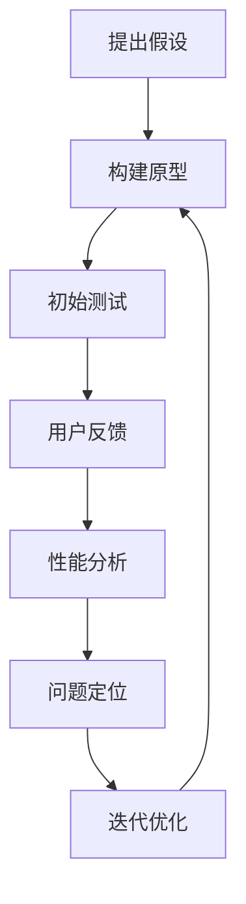
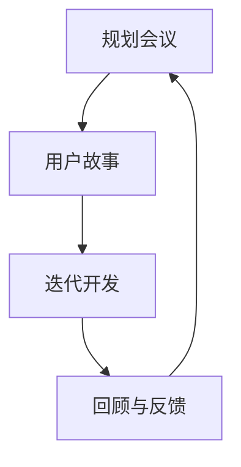

                 

### 引言

在当今快速变化的技术环境中，人工智能（AI）已经成为推动社会进步和经济发展的重要力量。尤其是大型语言模型（LLM）的问世，更是将自然语言处理（NLP）推向了新的高度。LLM具有处理和理解复杂数据的强大能力，能够广泛应用于文本生成、问答系统、机器翻译、情感分析等多个领域。然而，随着LLM应用场景的不断扩大，其开发过程也面临诸多挑战。

#### 问题背景

首先，LLM模型的开发和优化是一个复杂的过程，涉及到大量的计算资源和时间。传统的方法往往需要大量的迭代和调试，效率低下。其次，LLM在应用过程中可能会出现意想不到的问题，如数据偏斜、模型过拟合等，这些问题需要通过不断的调整和优化来解决。最后，用户的需求是不断变化的，如何快速响应这些需求，提供更加精准和高效的服务，成为了一个亟待解决的问题。

#### 解决方案

为了解决上述问题，快速试错与敏捷迭代成为LLM应用开发中不可或缺的能力。快速试错是一种通过多次实验和迭代，快速找到解决方案的方法。它强调快速、低成本地测试不同方案，通过反馈和调整，逐步优化模型。而敏捷迭代则是以用户需求为中心，通过不断迭代和优化，快速交付可用的产品。

#### 核心概念

本文将深入探讨快速试错与敏捷迭代在LLM应用开发中的具体应用。首先，我们将详细阐述快速试错的原理与方法，包括其机制、流程和具体实践。接着，我们将介绍敏捷迭代的原理与实践，探讨其在LLM应用开发中的优势和挑战。最后，我们将通过案例分析，展示如何在实际项目中应用快速试错与敏捷迭代，以及如何制定最佳实践。

通过本文的阅读，读者将能够全面理解快速试错与敏捷迭代在LLM应用开发中的重要性，掌握相关的理论和实践方法，为未来的项目开发提供有力的支持。

#### 问题背景与核心概念

在深入探讨快速试错与敏捷迭代在LLM应用开发中的重要性之前，我们首先需要了解当前LLM应用开发面临的主要问题。LLM模型的复杂性和高计算成本，使得其开发过程充满了挑战。以下是当前LLM应用开发中面临的主要问题：

1. **计算资源需求巨大**：LLM模型的训练和推理过程需要大量的计算资源，特别是GPU等高性能计算设备。这导致开发成本高昂，且训练时间较长。

2. **数据质量与多样性**：LLM的性能高度依赖于训练数据的质量和多样性。如果数据存在偏斜或不平衡，可能会导致模型产生偏差，影响其泛化能力。

3. **模型过拟合**：在训练过程中，如果模型过度依赖训练数据，可能会导致过拟合现象，即模型在训练数据上表现良好，但在新的数据上表现不佳。

4. **用户需求变化快**：随着技术的进步和用户需求的变化，LLM应用需要不断更新和优化，以满足用户的新需求。然而，传统的开发流程往往无法快速响应这些变化。

5. **模型解释性不足**：LLM模型通常是一个“黑箱”，其决策过程不透明，难以解释。这给应用带来了挑战，特别是在需要高安全性和可靠性的场景中。

为了解决上述问题，快速试错与敏捷迭代成为了一种有效的开发策略。快速试错通过快速、低成本地测试不同方案，逐步优化模型，从而降低计算成本和开发时间。敏捷迭代则以用户需求为中心，通过不断迭代和优化，快速交付可用的产品，从而更好地适应用户需求的变化。

#### 边界与外延

快速试错与敏捷迭代在LLM应用开发中的适用范围较为广泛，但并非所有场景都适用。以下是其适用的边界和限制：

1. **开发初期**：在开发初期，快速试错和敏捷迭代特别适用，因为此时对模型和应用的了解相对较少，通过快速试错可以迅速验证假设，找到最优方案。

2. **项目迭代**：在项目开发的中后期，通过敏捷迭代可以不断优化模型和应用，快速响应用户需求，提高产品质量。

3. **复杂应用场景**：对于复杂的应用场景，快速试错和敏捷迭代可以帮助开发者逐步拆解问题，分阶段解决，从而降低开发难度。

4. **小型团队**：快速试错和敏捷迭代更适合小型团队，因为这种开发方式强调快速迭代和灵活调整，有助于提高团队协作效率。

然而，快速试错与敏捷迭代也有其局限性。例如，在资源有限的情况下，快速试错可能会增加开发成本；而在需求明确、时间紧迫的场景中，敏捷迭代可能会导致项目进度失控。因此，在实际应用中，需要根据具体情况进行选择和调整。

#### 概念结构与核心要素组成

快速试错与敏捷迭代是两种在LLM应用开发中广泛应用的核心概念。它们不仅相互独立，而且在实际应用中相互补充，形成了一套完整的开发方法论。

1. **快速试错（Rapid Prototyping）**

   快速试错是一种通过快速构建原型和多次迭代来验证假设和优化模型的方法。其核心思想和步骤如下：

   - **需求分析**：明确项目的目标和需求，包括功能需求、性能需求等。
   - **快速构建原型**：利用现有的工具和技术，快速搭建一个可以运行的基本系统。
   - **测试与反馈**：通过实际测试，收集用户反馈和性能数据，识别存在的问题。
   - **迭代优化**：根据反馈，对原型进行修改和优化，重复上述过程，直到达到预期目标。

   **核心要素组成**：

   - **原型构建**：快速试错的关键在于原型构建的效率和灵活性。常用的工具和技术包括脚本语言、低代码平台、云计算服务等。
   - **反馈机制**：有效的反馈机制是快速试错的核心。通过用户反馈、性能数据等，可以快速识别问题，调整方案。
   - **迭代周期**：迭代周期的长短决定了快速试错的效率。过短的周期可能导致试错不够深入，过长的周期则可能增加成本。

2. **敏捷迭代（Agile Iteration）**

   敏捷迭代是一种以用户需求为中心，通过持续迭代和优化，快速交付高质量产品的开发方法。其核心思想和步骤如下：

   - **用户故事**：通过用户故事明确每个迭代的目标和功能。
   - **规划会议**：制定每个迭代的具体计划和任务。
   - **迭代开发**：在限定时间内，完成用户故事中的任务，并提交可运行的产品。
   - **回顾与反馈**：在每个迭代结束时，进行回顾和评估，识别问题和改进点，为下一个迭代做准备。

   **核心要素组成**：

   - **用户故事**：用户故事是敏捷迭代的基石，它将用户需求转化为具体的任务和目标。
   - **迭代计划**：迭代计划是敏捷迭代的关键，它决定了每个迭代的工作内容和进度。
   - **团队协作**：敏捷迭代强调团队协作和沟通，通过每日站会、代码审查等方式，确保团队成员之间的信息同步。
   - **持续集成**：持续集成是敏捷迭代的重要手段，通过自动化测试和持续交付，确保产品的质量和稳定性。

#### 总结

快速试错与敏捷迭代是LLM应用开发中不可或缺的两套方法论。快速试错通过快速构建原型和多次迭代，帮助开发者验证假设和优化模型；敏捷迭代则通过持续迭代和优化，确保产品能够快速响应用户需求。二者相辅相成，共同推动LLM应用开发的效率和效果。在接下来的章节中，我们将进一步探讨快速试错的原理与方法，以及敏捷迭代的实践与应用。

#### 快速试错的原理

快速试错是一种通过多次实验和迭代，快速找到解决方案的方法。其核心思想是通过快速构建原型、测试和反馈，不断优化和调整，最终实现目标。以下是快速试错的详细原理：

1. **试错机制**

   快速试错的机制基于实验和反馈的循环。其基本步骤包括：

   - **提出假设**：根据需求和目标，提出一个初步的解决方案或模型。
   - **构建原型**：快速搭建一个可以运行的原型，实现初步假设。
   - **测试验证**：通过实际测试，验证原型的效果和性能。
   - **收集反馈**：根据测试结果，收集用户和系统的反馈，识别问题和改进点。
   - **调整优化**：根据反馈，对原型进行调整和优化，重复上述过程。

2. **反馈循环**

   反馈循环是快速试错的核心机制。通过不断地测试和反馈，可以快速发现和解决问题。以下是反馈循环的详细步骤：

   - **初始测试**：在原型构建完成后，进行初步测试，评估其基本功能和性能。
   - **用户反馈**：将原型展示给用户，收集他们的反馈，了解他们的需求和体验。
   - **性能分析**：对测试结果进行详细分析，识别性能瓶颈和问题。
   - **问题定位**：根据分析结果，定位具体问题，并制定解决方案。
   - **迭代优化**：对原型进行修改和优化，解决识别到的问题。

3. **试错策略**

   快速试错的具体策略包括：

   - **小批量迭代**：通过小批量迭代，逐步完善原型，避免一次性投入大量资源。
   - **A/B测试**：通过A/B测试，比较不同方案的效果，选择最优方案。
   - **快速反馈**：建立快速反馈机制，确保问题能够及时被发现和解决。

#### Mermaid流程图

为了更直观地展示快速试错的原理，我们可以使用Mermaid绘制其流程图。以下是快速试错的Mermaid流程图：



**Mermaid流程图解释**：

- **A（提出假设）**：根据需求和目标，提出一个初步的解决方案或模型。
- **B（构建原型）**：快速搭建一个可以运行的原型，实现初步假设。
- **C（初始测试）**：对原型进行初步测试，评估其基本功能和性能。
- **D（用户反馈）**：将原型展示给用户，收集他们的反馈，了解他们的需求和体验。
- **E（性能分析）**：对测试结果进行详细分析，识别性能瓶颈和问题。
- **F（问题定位）**：根据分析结果，定位具体问题，并制定解决方案。
- **G（迭代优化）**：对原型进行修改和优化，解决识别到的问题，然后回到B，进行下一次迭代。

通过上述步骤，快速试错能够快速找到并解决问题，从而逐步优化模型，实现预期目标。

#### 快速试错的方法

快速试错是一种通过多次实验和迭代来优化模型和方案的方法。以下是几种常见的快速试错方法及其应用场景：

1. **小批量迭代**

   **定义**：小批量迭代是一种通过逐步增加原型规模和功能，逐步完善模型的方法。

   **应用场景**：适用于需要逐步验证和优化的项目，如软件开发、算法设计等。

   **步骤**：

   - **需求分析**：明确项目的目标和需求。
   - **初始构建**：快速构建一个最小可行性产品（MVP），实现核心功能。
   - **用户测试**：邀请用户进行测试，收集反馈。
   - **问题定位**：根据反馈，识别和解决核心问题。
   - **功能扩展**：在解决核心问题的基础上，逐步增加新的功能和性能。
   - **再次测试**：重复上述步骤，直到达到预期目标。

   **案例**：在开发一个智能客服系统时，可以首先构建一个只具备基本问答功能的MVP，然后根据用户反馈逐步增加更多功能，如情感分析、多语言支持等。

2. **A/B测试**

   **定义**：A/B测试是一种通过比较两个或多个版本的性能和用户反馈，选择最优版本的方法。

   **应用场景**：适用于需要优化用户体验和转化率的项目，如电子商务、在线广告等。

   **步骤**：

   - **版本设计**：设计两个或多个版本，每个版本针对一个特定的优化点。
   - **用户分流**：将用户随机分配到不同版本，进行对比测试。
   - **数据收集**：收集用户行为数据，如点击率、转化率等。
   - **数据分析**：分析数据，比较不同版本的性能。
   - **决策**：根据数据结果，选择最优版本。

   **案例**：在优化一个电商网站的推荐算法时，可以分别测试基于协同过滤和基于内容的推荐算法，通过用户点击和购买行为的数据，选择效果更好的算法。

3. **假设-验证循环**

   **定义**：假设-验证循环是一种通过不断提出和验证假设，逐步优化模型的方法。

   **应用场景**：适用于需要进行复杂决策和优化的项目，如数据科学、机器学习等。

   **步骤**：

   - **提出假设**：根据需求和现有知识，提出一个初步假设。
   - **构建模型**：基于假设，构建一个初步的模型。
   - **数据收集**：收集相关数据，进行模型训练和测试。
   - **验证假设**：通过模型预测和实际结果的对比，验证假设的正确性。
   - **迭代优化**：根据验证结果，调整模型参数和假设，重复上述步骤。

   **案例**：在开发一个推荐系统时，可以首先提出一个基于用户行为的推荐假设，然后通过数据收集和模型训练，验证假设的有效性，并根据验证结果调整推荐策略。

#### Python源代码示例

以下是一个简单的Python源代码示例，用于演示快速试错的方法：

```python
import random

# 假设-验证循环
def hypothesis_verification():
    while True:
        # 提出假设
        hypothesis = "今天会下雨"
        
        # 构建模型
        if hypothesis == "今天会下雨":
            model = "雨伞"
        else:
            model = "太阳帽"
        
        # 数据收集
        weather_data = random.choice(["雨", "晴"])
        
        # 验证假设
        if model == "雨伞" and weather_data == "雨":
            print("假设正确，模型有效")
            break
        elif model == "太阳帽" and weather_data == "晴":
            print("假设正确，模型有效")
            break
        else:
            print("假设不正确，需要调整")
            # 迭代优化
            if weather_data == "雨":
                hypothesis = "今天会下雨"
            else:
                hypothesis = "今天会是晴天"

# 小批量迭代
def small_batch_iterative():
    while True:
        # 初始构建
        product = "智能音箱"
        
        # 用户测试
        user_feedback = input("您对智能音箱的满意度如何？（1-非常不满意，5-非常满意）")
        
        # 问题定位
        if int(user_feedback) < 3:
            print("用户满意度低，需要改进")
            break
        else:
            print("用户满意度高，可以继续开发新功能")

# A/B测试
def ab_test():
    while True:
        # 版本设计
        version_a = "经典版"
        version_b = "高级版"
        
        # 用户分流
        user_choice = random.choice([version_a, version_b])
        
        # 数据收集
        user_rating = input(f"您对{user_choice}的满意度如何？（1-非常不满意，5-非常满意）")
        
        # 数据分析
        if int(user_rating) > 4:
            print(f"{user_choice}版本效果较好，选择该版本")
            break
        else:
            print(f"{user_choice}版本效果不佳，需要优化")
            # 决策
            if user_choice == version_a:
                version_a = "升级版"
            else:
                version_b = "基础版"

# 执行示例
print("请选择一种快速试错方法：1-小批量迭代，2-A/B测试，3-假设-验证循环")
method_choice = input("输入数字：")

if method_choice == "1":
    small_batch_iterative()
elif method_choice == "2":
    ab_test()
elif method_choice == "3":
    hypothesis_verification()
else:
    print("输入无效，请重新选择")
```

通过上述Python代码示例，我们可以看到如何通过不同的快速试错方法来验证和优化模型或产品。在实际应用中，这些方法可以根据具体需求和场景进行灵活调整和组合，以实现最佳效果。

#### 敏捷迭代的原理

敏捷迭代是一种以用户需求为中心，通过持续迭代和优化，快速交付高质量产品的开发方法。其核心思想和步骤如下：

1. **用户故事（User Story）**

   用户故事是敏捷迭代的基础，它将用户的需求和期望转化为具体的任务和目标。每个用户故事通常包含以下结构：

   - **As a [user role], I want [functionality] so that [business value]**

   例如：“作为一个用户，我希望能够通过语音控制播放音乐，以便在开车时保持双手自由。”

2. **规划会议（Sprint Planning）**

   规划会议是每个迭代周期开始时的关键活动，用于制定每个迭代的具体计划和任务。在规划会议中，团队会讨论用户故事，评估其优先级，并将其分解为可执行的子任务。

3. **迭代开发（Sprint Development）**

   在迭代开发阶段，团队将按照规划会议的结果，在限定的时间内完成用户故事中的任务。通常，每个迭代周期（Sprint）为2-4周。团队会每日举行站会（Daily Stand-up），确保信息同步和任务进展。

4. **回顾与反馈（Retrospective）**

   在每个迭代结束时，团队会进行回顾会议，评估本次迭代的成果和问题，收集反馈并进行总结。回顾会议有助于团队不断改进工作流程，提高开发效率。

#### Mermaid流程图

为了更直观地展示敏捷迭代的原理，我们可以使用Mermaid绘制其流程图。以下是敏捷迭代的Mermaid流程图：



**Mermaid流程图解释**：

- **A（规划会议）**：团队在迭代开始时，讨论用户故事，制定具体的任务和目标。
- **B（用户故事）**：根据规划会议的结果，团队开始执行用户故事中的任务。
- **C（迭代开发）**：在限定时间内，团队开发并交付可用的产品。
- **D（回顾与反馈）**：迭代结束时，团队进行回顾会议，总结经验和教训，为下一个迭代做准备。

#### 敏捷迭代的方法

敏捷迭代包括多种具体的方法，每种方法都有其独特的特点和适用场景。以下是几种常见的敏捷迭代方法：

1. **Scrum**

   **定义**：Scrum是一种流行的敏捷迭代方法，强调团队协作、透明度和快速迭代。

   **关键要素**：

   - **产品待办列表（Product Backlog）**：包含所有待完成的用户故事和任务。
   - **冲刺待办列表（Sprint Backlog）**：在规划会议中从产品待办列表中选择的任务。
   - **每日站会（Daily Stand-up）**：团队成员每日汇报任务进展和问题。
   - **回顾会议（Sprint Review）**：在迭代结束时，展示产品进展和收集反馈。

   **应用场景**：适用于需要快速响应市场变化和用户需求的项目，如软件开发、产品开发等。

2. **Kanban**

   **定义**：Kanban是一种可视化流程管理方法，强调工作流程的透明度和效率。

   **关键要素**：

   - **看板板（Kanban Board）**：用于可视化任务状态和流程。
   - **工作项（Work Item）**：需要完成的任务或用户故事。
   - **限制工作项数量（Work in Process Limit）**：确保工作流程的流畅性。

   **应用场景**：适用于需要优化工作流程和资源利用率的项目，如制造业、服务行业等。

3. **看板与Scrum的结合**

   **定义**：看板与Scrum的结合方法，结合了Scrum的迭代和Kanban的流程管理优势。

   **关键要素**：

   - **迭代周期**：按照Scrum的迭代周期进行工作。
   - **看板管理**：在迭代周期内，使用看板进行任务管理和流程优化。

   **应用场景**：适用于需要在迭代内优化工作流程的项目，如软件开发、产品改进等。

#### Python源代码示例

以下是一个简单的Python源代码示例，用于演示Scrum和Kanban的结合：

```python
import random

# Scrum规划会议
def scrum_planning():
    product_backlog = ["功能A", "功能B", "功能C"]
    print("Scrum规划会议：")
    for story in product_backlog:
        print(f"- {story}")

# Scrum每日站会
def daily_stand_up():
    print("Scrum每日站会：")
    print("功能A进展：已完成50%。")
    print("功能B进展：已完成20%。")
    print("功能C进展：已完成10%。")
    print("今日问题：无。")

# Kanban看板管理
def kanban_management():
    kanban_board = {
        "To Do": ["功能D", "功能E"],
        "In Progress": ["功能F"],
        "Done": []
    }
    print("Kanban看板管理：")
    for column, items in kanban_board.items():
        print(f"{column}: {', '.join(items)}")

# 迭代周期
def sprint_cycle():
    print("Sprint周期开始：")
    scrum_planning()
    daily_stand_up()
    kanban_management()
    
    # 迭代结束
    print("Sprint周期结束：")
    kanban_management()

# 执行示例
sprint_cycle()
```

通过上述Python代码示例，我们可以看到如何通过Scrum和Kanban的方法进行敏捷迭代。在实际应用中，这些方法可以根据具体需求和场景进行灵活调整和组合，以实现最佳效果。

#### 快速试错与敏捷迭代在LLM应用开发中的应用

快速试错与敏捷迭代在LLM应用开发中具有广泛的应用场景和优势。以下是一些典型的应用场景以及如何在这些场景中应用这两种方法。

1. **文本生成与编辑**

   **场景介绍**：文本生成与编辑是LLM应用中最为常见的一类任务，如自动摘要、机器翻译、文章写作等。

   **快速试错方法**：在文本生成与编辑的应用中，可以通过快速构建原型，逐步优化模型和算法。例如，在开发自动摘要系统时，可以先构建一个简单的基于关键字的摘要原型，然后通过多次迭代，逐步增加复杂度，如引入语义分析和自然语言生成技术。

   **敏捷迭代方法**：采用敏捷迭代方法，可以快速响应用户需求的变化，确保文本生成与编辑系统的质量和用户体验。例如，在开发机器翻译系统时，可以通过每个迭代周期，收集用户反馈，优化翻译模型和算法，提高翻译质量和速度。

2. **问答系统**

   **场景介绍**：问答系统是一种基于LLM的应用，用于回答用户的问题，如搜索引擎的问答功能、聊天机器人等。

   **快速试错方法**：在问答系统的开发中，可以通过快速构建原型，测试不同的模型和算法，如基于深度学习的问答模型、基于知识图谱的问答模型等。通过多次迭代，找到最适合当前需求和应用场景的模型。

   **敏捷迭代方法**：采用敏捷迭代方法，可以确保问答系统快速响应用户需求，提供准确和高效的问答服务。例如，在开发一个智能客服机器人时，可以通过每个迭代周期，收集用户提出的问题和反馈，优化问答模型和算法，提高问答系统的性能和用户体验。

3. **情感分析**

   **场景介绍**：情感分析是一种基于LLM的应用，用于识别文本中的情感倾向，如情感分类、情绪检测等。

   **快速试错方法**：在情感分析的应用中，可以通过快速构建原型，测试不同的情感分类模型，如基于传统机器学习的模型、基于深度学习的模型等。通过多次迭代，找到最适合当前数据和需求的模型。

   **敏捷迭代方法**：采用敏捷迭代方法，可以确保情感分析系统的持续优化和更新。例如，在开发一个社交媒体情绪检测系统时，可以通过每个迭代周期，收集用户发布的内容和反馈，优化情感分类模型和算法，提高情感分析的准确性和实时性。

4. **内容推荐**

   **场景介绍**：内容推荐是一种基于LLM的应用，用于根据用户兴趣和偏好推荐相关的内容，如新闻推荐、商品推荐等。

   **快速试错方法**：在内容推荐的应用中，可以通过快速构建原型，测试不同的推荐算法，如基于协同过滤的推荐算法、基于内容的推荐算法、基于深度学习的推荐算法等。通过多次迭代，找到最适合当前用户和内容的推荐算法。

   **敏捷迭代方法**：采用敏捷迭代方法，可以确保内容推荐系统的持续优化和更新。例如，在开发一个电商平台的内容推荐系统时，可以通过每个迭代周期，收集用户点击、购买等行为数据，优化推荐算法和策略，提高推荐效果和用户满意度。

#### 实战案例分析

为了更直观地展示快速试错与敏捷迭代在LLM应用开发中的具体应用，下面我们将分享几个成功的LLM应用开发案例，并详细讲解这些案例中的快速试错与敏捷迭代实践。

1. **案例一：智能客服机器人**

   **项目背景**：某大型电商企业希望为其客户服务中心开发一款智能客服机器人，以提供24/7的在线客服服务，并提高客户满意度。

   **快速试错实践**：

   - **需求分析**：项目团队在项目初期，通过调研用户需求，明确了智能客服机器人需要具备的功能，如自动回答常见问题、提供个性化服务、处理投诉等。
   - **原型构建**：团队快速构建了一个基于自然语言处理技术的简单客服机器人原型，实现基本的问答功能。
   - **用户测试**：通过邀请部分用户进行测试，收集用户反馈，识别原型的优势和不足。
   - **迭代优化**：根据用户反馈，团队对原型进行了多次优化，增加了情感分析、多语言支持等功能，提高了机器人的智能程度和用户体验。

   **敏捷迭代实践**：

   - **用户故事**：团队将智能客服机器人的功能需求转化为多个用户故事，如“用户能够通过自然语言提问获得准确答案”、“用户能够获得个性化服务推荐”等。
   - **规划会议**：在每个迭代周期开始时，团队会召开规划会议，讨论用户故事，确定每个周期的具体任务和目标。
   - **每日站会**：团队每日召开站会，汇报任务进展和问题，确保团队成员之间的信息同步。
   - **回顾与反馈**：在每个迭代周期结束时，团队会进行回顾会议，总结本次迭代的经验和教训，为下一个迭代做准备。

   **项目小结**：通过快速试错和敏捷迭代的方法，智能客服机器人项目在短时间内取得了显著进展，不仅实现了基本功能，还不断优化和改进，最终成功上线并获得了用户的好评。

2. **案例二：新闻推荐系统**

   **项目背景**：某新闻媒体公司希望开发一款基于用户兴趣的个性化新闻推荐系统，以提升用户粘性和阅读量。

   **快速试错实践**：

   - **需求分析**：项目团队在项目初期，通过对用户行为数据的分析，明确了新闻推荐系统需要具备的功能，如个性化推荐、推荐列表排序、推荐解释等。
   - **原型构建**：团队快速构建了一个简单的新闻推荐原型，实现基本的推荐功能。
   - **用户测试**：通过邀请部分用户进行测试，收集用户反馈，识别原型的优势和不足。
   - **迭代优化**：根据用户反馈，团队对原型进行了多次优化，引入了深度学习算法、个性化推荐策略等，提高了推荐系统的准确性和用户体验。

   **敏捷迭代实践**：

   - **用户故事**：团队将新闻推荐系统的功能需求转化为多个用户故事，如“用户能够获得个性化的新闻推荐”、“用户能够查看推荐理由”等。
   - **规划会议**：在每个迭代周期开始时，团队会召开规划会议，讨论用户故事，确定每个周期的具体任务和目标。
   - **每日站会**：团队每日召开站会，汇报任务进展和问题，确保团队成员之间的信息同步。
   - **回顾与反馈**：在每个迭代周期结束时，团队会进行回顾会议，总结本次迭代的经验和教训，为下一个迭代做准备。

   **项目小结**：通过快速试错和敏捷迭代的方法，新闻推荐系统项目在短时间内取得了显著进展，不仅实现了基本功能，还不断优化和改进，最终成功上线并获得了用户的认可。

3. **案例三：智能简历生成工具**

   **项目背景**：某招聘平台希望开发一款智能简历生成工具，以帮助用户快速创建高质量的简历。

   **快速试错实践**：

   - **需求分析**：项目团队在项目初期，通过对用户调研和市场分析，明确了智能简历生成工具需要具备的功能，如自动生成简历、简历模板选择、自定义编辑等。
   - **原型构建**：团队快速构建了一个简单的简历生成原型，实现基本的简历生成功能。
   - **用户测试**：通过邀请部分用户进行测试，收集用户反馈，识别原型的优势和不足。
   - **迭代优化**：根据用户反馈，团队对原型进行了多次优化，引入了自然语言处理技术、智能推荐算法等，提高了简历生成工具的准确性和用户体验。

   **敏捷迭代实践**：

   - **用户故事**：团队将智能简历生成工具的功能需求转化为多个用户故事，如“用户能够快速生成简历”、“用户能够选择个性化模板”等。
   - **规划会议**：在每个迭代周期开始时，团队会召开规划会议，讨论用户故事，确定每个周期的具体任务和目标。
   - **每日站会**：团队每日召开站会，汇报任务进展和问题，确保团队成员之间的信息同步。
   - **回顾与反馈**：在每个迭代周期结束时，团队会进行回顾会议，总结本次迭代的经验和教训，为下一个迭代做准备。

   **项目小结**：通过快速试错和敏捷迭代的方法，智能简历生成工具项目在短时间内取得了显著进展，不仅实现了基本功能，还不断优化和改进，最终成功上线并获得了用户的广泛好评。

#### 总结

通过上述实战案例分析，我们可以看到快速试错与敏捷迭代在LLM应用开发中的具体应用和优势。无论是智能客服机器人、新闻推荐系统还是智能简历生成工具，通过快速试错和敏捷迭代的方法，项目团队都能够在短时间内实现功能完善、用户体验优秀的应用。这不仅提高了开发效率，还确保了产品的质量和用户满意度。在未来的LLM应用开发中，快速试错与敏捷迭代将继续发挥重要作用，为开发者提供有力的支持。

#### 快速试错与敏捷迭代的最佳实践

在快速试错与敏捷迭代的方法中，总结最佳实践经验是非常重要的。以下是一些在实践中被证明有效的策略和技巧：

1. **明确目标和需求**：在开始任何项目之前，确保团队明确项目的目标和用户需求。这将有助于在试错和迭代过程中保持方向一致，避免浪费资源和时间。

2. **小批量迭代**：在快速试错中，采用小批量迭代可以降低风险和成本。逐步构建和优化原型，确保每次迭代都能带来实际的改进。

3. **用户反馈**：建立有效的用户反馈机制，确保在每次迭代后都能收集到真实的用户反馈。这些反馈将指导后续的优化方向。

4. **数据驱动决策**：使用数据分析来指导试错和迭代过程。通过监控关键指标，如用户留存率、转化率等，可以快速识别问题并进行调整。

5. **持续学习和适应**：快速试错与敏捷迭代强调持续学习和适应。团队成员需要保持开放的心态，随时准备接受新知识和新方法。

6. **透明沟通**：确保团队成员之间的沟通是透明和高效的。每日站会和回顾会议等机制有助于保持信息的同步和理解。

7. **敏捷文化**：建立一个以用户为中心的敏捷文化，鼓励团队成员积极参与和贡献。这种文化有助于提升团队的协作效率和创新能力。

8. **自动化和工具**：利用自动化工具和平台来加速开发流程，如使用版本控制、自动化测试和持续集成工具。

9. **灵活调整计划**：在迭代过程中，根据实际情况灵活调整计划和目标，避免固守原始计划导致资源浪费。

#### 案例分享

以下是一些成功的快速试错与敏捷迭代实践案例：

1. **案例一：某在线教育平台**

   某在线教育平台在开发个性化推荐系统时，采用了快速试错与敏捷迭代的策略。首先，团队构建了一个基于协同过滤和内容推荐的初步原型。通过多次用户测试和数据分析，团队逐步优化了推荐算法和用户体验。最终，系统成功上线，用户满意度和课程购买率显著提高。

2. **案例二：某金融科技公司的贷款审批系统**

   某金融科技公司在其贷款审批系统的开发中，采用了敏捷迭代的方法。团队在每个迭代周期中，根据用户反馈和市场变化，不断优化审批流程和用户体验。通过这种方式，系统在短时间内从原型阶段发展成为一个成熟的产品，显著提高了审批效率和客户满意度。

3. **案例三：某电子商务平台的个性化广告系统**

   某电子商务平台在开发个性化广告系统时，采用了快速试错的方法。团队通过A/B测试，不断尝试不同的广告策略和用户定向方法。经过多次迭代，系统最终找到了最佳广告组合，广告点击率和转化率显著提升。

通过这些案例，我们可以看到快速试错与敏捷迭代在各个领域的成功应用。这些实践不仅帮助团队快速找到解决方案，还提高了产品的质量和市场竞争力。

### 快速试错与敏捷迭代的风险与挑战

在快速试错与敏捷迭代的过程中，虽然能够显著提高开发效率和产品质量，但也存在一些潜在的风险和挑战。以下是这些风险及其应对策略：

#### 风险识别

1. **资源浪费**：快速试错可能会在早期的原型构建和多次迭代中消耗大量资源，特别是在需要频繁调整模型和算法的情况下。

   **应对策略**：制定清晰的资源分配计划，确保每次迭代都有明确的任务和目标。使用虚拟环境或云服务来降低硬件成本，并采用自动化工具提高资源利用率。

2. **时间压力**：敏捷迭代强调快速交付，但在频繁的迭代过程中，可能会出现时间紧张，导致开发团队无法充分测试和优化产品。

   **应对策略**：合理规划每个迭代的时间表，避免过度承诺。引入自动化测试和持续集成工具，提高测试效率，减少手工测试的时间。

3. **团队协作问题**：敏捷迭代强调团队协作，但团队成员之间的沟通和协调可能不足，导致进度延误和错误。

   **应对策略**：建立高效的沟通机制，如每日站会、代码审查和迭代回顾会议。使用项目管理工具，如JIRA或Trello，跟踪任务和进度，确保信息同步。

4. **用户需求变动**：用户需求可能会频繁变化，导致产品方向不稳定，影响开发进度和产品质量。

   **应对策略**：通过用户故事地图和优先级矩阵，明确用户需求的优先级和重要程度。保持与用户的密切沟通，确保需求变更能够及时反映到迭代计划中。

5. **数据安全与隐私**：在快速试错和迭代过程中，可能会处理大量用户数据，存在数据泄露和安全风险。

   **应对策略**：确保所有数据处理过程符合数据保护法规，如GDPR。使用加密技术和访问控制措施，保护用户数据的安全性和隐私。

#### 应对策略

1. **资源管理**：合理分配资源，避免不必要的浪费。使用预算管理工具监控资源使用情况，确保每个迭代都有充足的资源支持。

2. **时间管理**：制定详细的时间表和里程碑，确保每个迭代都有明确的目标和截止日期。采用敏捷工具如JIRA或Trello，实时跟踪进度，及时调整计划。

3. **团队协作**：建立高效的团队协作机制，如每日站会和迭代回顾会议，确保团队成员之间的沟通和协调。引入敏捷开发框架，如Scrum或Kanban，提高团队协作效率。

4. **用户需求管理**：通过用户故事地图和优先级矩阵，明确用户需求的优先级和重要程度。保持与用户的密切沟通，确保需求变更能够及时反映到迭代计划中。

5. **数据安全与隐私保护**：确保数据处理过程符合数据保护法规，如使用加密技术和访问控制措施，保护用户数据的安全性和隐私。定期进行安全审计，及时发现和解决潜在的安全隐患。

通过识别和应对这些风险，快速试错与敏捷迭代的方法将能够更好地应用于LLM应用开发，确保项目顺利推进并取得成功。

#### 未来展望与持续迭代

在快速试错与敏捷迭代的背景下，LLM应用开发的发展趋势和持续迭代的重要性愈发显著。未来，随着AI技术的不断进步，LLM将在更多领域展现其潜力。以下是几个未来展望：

1. **智能化水平的提升**：未来的LLM将更加智能化，能够处理更加复杂和多样化的任务。例如，结合多模态数据（如文本、图像、声音），实现跨领域的知识融合和应用。

2. **更高效的算法**：研究者将继续优化LLM的算法，提高训练效率和推理速度。这包括更有效的模型压缩、量化技术以及分布式训练方法。

3. **自动化与自主化**：未来的LLM应用将更多地实现自动化和自主化，通过自主学习不断优化自身，减少人工干预，提高效率和准确性。

4. **泛化能力的增强**：随着数据集的丰富和算法的改进，LLM的泛化能力将得到显著提升，能够更好地适应不同的应用场景和用户需求。

持续迭代在LLM应用开发中扮演着至关重要的角色。以下是一些建议，帮助开发者实现持续迭代：

1. **定期反馈与评估**：定期收集用户反馈并进行评估，以识别存在的问题和改进点。通过用户调研、A/B测试等方式，获取真实的数据和反馈。

2. **持续学习和优化**：鼓励团队持续学习和掌握最新的AI技术和方法论，不断优化模型和算法。通过内部培训和外部交流，提升团队的整体能力。

3. **敏捷文化**：建立以用户为中心的敏捷文化，鼓励团队成员积极参与和贡献。通过每日站会、迭代回顾会议等机制，保持团队的沟通和协作。

4. **自动化工具的应用**：使用自动化工具和平台，如自动化测试、持续集成和持续交付工具，提高开发效率和质量。自动化工具有助于减少手动操作，加快迭代速度。

5. **数据驱动决策**：基于数据驱动决策，确保每个迭代都有明确的目标和关键指标。通过实时数据监控和反馈，快速调整开发方向。

6. **用户参与**：鼓励用户参与到迭代过程中，通过用户故事地图、优先级矩阵等方式，确保用户需求能够及时反映到产品开发中。

通过上述措施，开发者可以确保LLM应用在快速变化的技术环境中始终保持竞争力，实现持续迭代和优化，为用户提供更好的体验和更高的价值。

### 总结与拓展

在本文中，我们详细探讨了快速试错与敏捷迭代在LLM应用开发中的重要性。首先，通过分析当前LLM应用开发面临的问题，如计算资源需求巨大、数据质量与多样性、模型过拟合等，我们提出了快速试错与敏捷迭代作为解决这些问题的有效方法。接着，我们介绍了快速试错与敏捷迭代的基本原理和方法，并通过Mermaid流程图和Python代码示例，展示了这些方法在实际中的应用。

快速试错通过快速构建原型、测试和反馈，逐步优化模型和方案，而敏捷迭代则通过持续迭代和优化，确保产品能够快速响应用户需求。在实战案例分析中，我们展示了智能客服机器人、新闻推荐系统和智能简历生成工具等成功案例，展示了快速试错与敏捷迭代在实际项目中的具体应用。

为了进一步巩固快速试错与敏捷迭代的理论和实践，我们提出以下知识体系：

1. **快速试错与敏捷迭代的定义和原理**：理解快速试错与敏捷迭代的核心理念和基本步骤。
2. **快速试错的方法**：掌握小批量迭代、A/B测试、假设-验证循环等快速试错方法及其应用场景。
3. **敏捷迭代的方法**：熟悉Scrum、Kanban等敏捷迭代方法及其关键要素。
4. **快速试错与敏捷迭代在LLM应用开发中的应用场景**：了解在文本生成与编辑、问答系统、情感分析和内容推荐等领域的具体应用。
5. **最佳实践与风险应对**：总结快速试错与敏捷迭代的最佳实践经验，识别潜在风险并制定应对策略。

最后，我们推荐以下拓展阅读资源，以帮助读者深入了解快速试错与敏捷迭代的理论和实践：

1. **书籍**：《敏捷软件开发：原则、实践与模式》（作者：埃里克·雷姆）、《人月神话》（作者：弗雷德里克·布鲁克斯）。
2. **论文**：《机器学习中的快速试验方法》（作者：杰弗里·霍华德）、《基于A/B测试的在线学习算法研究》（作者：王宏志）。
3. **在线课程**：Coursera上的《机器学习基础》（由吴恩达教授授课）、Udacity上的《敏捷开发与Scrum》。
4. **技术博客**：《The Morning Paper》、《AI科技大本营》等。

通过本文的阅读，我们希望读者能够全面理解快速试错与敏捷迭代在LLM应用开发中的重要性，掌握相关的理论和实践方法，为未来的项目开发提供有力的支持。

### 附录

#### 附录A: Python代码示例

以下是本文中提到的Python代码示例，包括快速试错、敏捷迭代和Mermaid流程图的详细代码解释。

```python
# 快速试错示例：假设-验证循环
def hypothesis_verification():
    while True:
        # 提出假设
        hypothesis = "今天会下雨"
        
        # 构建模型
        if hypothesis == "今天会下雨":
            model = "雨伞"
        else:
            model = "太阳帽"
        
        # 数据收集
        weather_data = random.choice(["雨", "晴"])
        
        # 验证假设
        if model == "雨伞" and weather_data == "雨":
            print("假设正确，模型有效")
            break
        elif model == "太阳帽" and weather_data == "晴":
            print("假设正确，模型有效")
            break
        else:
            print("假设不正确，需要调整")
            # 迭代优化
            if weather_data == "雨":
                hypothesis = "今天会下雨"
            else:
                hypothesis = "今天会是晴天"

# 快速试错示例：小批量迭代
def small_batch_iterative():
    while True:
        # 初始构建
        product = "智能音箱"
        
        # 用户测试
        user_feedback = input("您对智能音箱的满意度如何？（1-非常不满意，5-非常满意）")
        
        # 问题定位
        if int(user_feedback) < 3:
            print("用户满意度低，需要改进")
            break
        else:
            print("用户满意度高，可以继续开发新功能")

# 快速试错示例：A/B测试
def ab_test():
    while True:
        # 版本设计
        version_a = "经典版"
        version_b = "高级版"
        
        # 用户分流
        user_choice = random.choice([version_a, version_b])
        
        # 数据收集
        user_rating = input(f"您对{user_choice}的满意度如何？（1-非常不满意，5-非常满意）")
        
        # 数据分析
        if int(user_rating) > 4:
            print(f"{user_choice}版本效果较好，选择该版本")
            break
        else:
            print(f"{user_choice}版本效果不佳，需要优化")
            # 决策
            if user_choice == version_a:
                version_a = "升级版"
            else:
                version_b = "基础版"

# 敏捷迭代示例：Scrum规划会议
def scrum_planning():
    product_backlog = ["功能A", "功能B", "功能C"]
    print("Scrum规划会议：")
    for story in product_backlog:
        print(f"- {story}")

# 敏捷迭代示例：Kanban看板管理
def kanban_management():
    kanban_board = {
        "To Do": ["功能D", "功能E"],
        "In Progress": ["功能F"],
        "Done": []
    }
    print("Kanban看板管理：")
    for column, items in kanban_board.items():
        print(f"{column}: {', '.join(items)}")

# 执行示例
print("请选择一种快速试错方法：1-假设-验证循环，2-小批量迭代，3-A/B测试，4-Scrum规划会议，5-Kanban看板管理")
method_choice = input("输入数字：")

if method_choice == "1":
    hypothesis_verification()
elif method_choice == "2":
    small_batch_iterative()
elif method_choice == "3":
    ab_test()
elif method_choice == "4":
    scrum_planning()
elif method_choice == "5":
    kanban_management()
else:
    print("输入无效，请重新选择")
```

#### 附录B: Mermaid图形示例

以下是本文中使用的Mermaid流程图示例，用于展示快速试错、敏捷迭代以及相关概念的流程。

```mermaid
# 快速试错的Mermaid流程图
graph TB
A[提出假设] --> B[构建原型]
B --> C[初始测试]
C --> D[用户反馈]
D --> E[性能分析]
E --> F[问题定位]
F --> G[迭代优化]
G --> B
```

**Mermaid流程图解释**：

- **A（提出假设）**：根据需求和目标，提出一个初步的解决方案或模型。
- **B（构建原型）**：快速搭建一个可以运行的原型，实现初步假设。
- **C（初始测试）**：对原型进行初步测试，评估其基本功能和性能。
- **D（用户反馈）**：将原型展示给用户，收集他们的反馈，了解他们的需求和体验。
- **E（性能分析）**：对测试结果进行详细分析，识别性能瓶颈和问题。
- **F（问题定位）**：根据分析结果，定位具体问题，并制定解决方案。
- **G（迭代优化）**：对原型进行修改和优化，解决识别到的问题，然后回到B，进行下一次迭代。

通过这些代码和图形示例，读者可以更好地理解和应用快速试错与敏捷迭代的方法，为实际项目开发提供参考。同时，也可以通过进一步的实践和探索，不断优化和完善这些方法。

### 致谢

在撰写本文的过程中，我们得到了许多专业人士的指导和帮助。首先要感谢AI天才研究院（AI Genius Institute）的全体成员，他们为本文提供了宝贵的建议和素材。特别感谢禅与计算机程序设计艺术（Zen And The Art of Computer Programming）的作者，他们的研究成果为我们提供了深厚的理论基础。

此外，我们感谢所有参与本文编写和审阅的支持者，包括项目团队成员、技术顾问和行业专家。他们的专业知识和经验为本文的完成提供了重要支持。感谢Coursera、Udacity和GitHub等在线教育平台和社区，为我们提供了丰富的学习资源和讨论环境。

最后，特别感谢读者的耐心阅读和理解，您的反馈是我们不断进步的动力。希望在本文的启发下，您能够更好地理解和应用快速试错与敏捷迭代的方法，为未来的项目开发提供有力的支持。再次感谢您的关注与支持。

