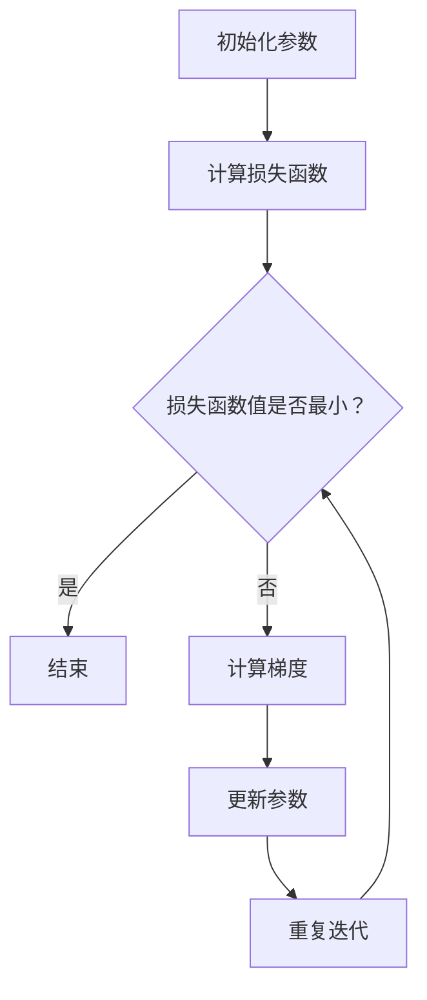

                 


### 快速迭代中的质量保证：LLM应用开发的难题

> 关键词：快速迭代、质量保证、LLM应用开发、算法原理、系统架构

> 摘要：本文深入探讨了快速迭代过程中质量保证的重要性，特别是针对大型语言模型（LLM）应用开发的挑战。我们将从背景介绍、核心概念与联系、算法原理讲解、数学模型与公式、系统分析与架构设计、项目实战、最佳实践以及注意事项等方面，详细分析LLM应用开发的难题，并给出可行的解决方案。

## 背景介绍

在当今快速发展的信息技术时代，快速迭代已成为许多软件和产品开发过程中的标准操作。这种方法允许开发团队在短时间内频繁地发布新功能，以应对市场的快速变化和客户需求。然而，快速迭代并非没有挑战，特别是当涉及到大型语言模型（LLM）这样的复杂系统时。

LLM，尤其是基于深度学习的模型，如GPT-3、BERT等，具有处理和理解大量文本数据的能力。它们在自然语言处理（NLP）、机器翻译、问答系统等领域有着广泛的应用。然而，LLM的开发和部署过程中，如何保证在快速迭代的同时保持高质量，是一个亟待解决的问题。

### 问题的背景

随着人工智能技术的发展，LLM在各个领域的应用越来越广泛。然而，这些模型通常需要大量的计算资源和时间来训练，且其性能在很大程度上取决于数据的质量和数量。快速迭代意味着频繁的模型更新和发布，这对于质量保证提出了更高的要求。

在快速迭代的过程中，开发者往往面临以下挑战：

- **数据质量问题**：频繁的数据更新可能导致数据质量问题，如数据噪声、不完整性、不一致性等。
- **模型性能下降**：快速迭代可能会导致模型性能下降，特别是在处理新的、未经验证的数据时。
- **错误扩散**：一个小的错误在快速迭代的开发过程中可能会迅速传播，导致系统整体质量下降。

### 问题描述

在快速迭代的过程中，质量保证（QA）的难度显著增加。主要问题包括：

- **测试不足**：快速迭代往往导致测试时间不足，无法进行全面而彻底的测试。
- **反馈延迟**：在快速迭代过程中，用户反馈可能延迟，无法及时指导后续的迭代。
- **资源限制**：开发团队可能面临时间、预算和人力资源的限制，难以进行充分的质量保证。

### 问题解决

为了解决快速迭代中LLM应用开发的质量保证问题，我们可以采取以下策略：

- **自动化测试**：引入自动化测试工具，以加快测试流程，提高测试覆盖率。
- **持续集成与持续部署（CI/CD）**：实现自动化构建和部署流程，确保每次迭代的质量。
- **数据质量监控**：建立数据质量监控机制，及时发现和处理数据问题。
- **用户反馈机制**：建立有效的用户反馈机制，及时收集用户反馈，指导后续迭代。

### 边界与外延

快速迭代中的质量保证不仅限于LLM应用开发，它适用于所有需要进行频繁更新的软件系统。在不同的应用场景中，质量保证的策略和重点可能会有所不同。

## 核心概念与联系

### LLM的概念

大型语言模型（LLM）是一种深度学习模型，能够理解和生成人类语言。它们通常基于大规模的文本数据集进行训练，以预测下一个单词、句子或文本片段。LLM在NLP任务中表现优异，如文本分类、命名实体识别、机器翻译等。

### 迭代与质量保证的关系

迭代是一种开发方法，通过反复的周期性改进来逐步完善产品。质量保证是确保产品或系统满足特定标准和用户需求的过程。在快速迭代中，质量保证至关重要，因为频繁的迭代可能导致质量问题迅速积累和扩散。

### LLM应用开发中的难题

在LLM应用开发中，主要难题包括：

- **数据质量问题**：数据的不完整、不一致和噪声会影响模型性能。
- **模型复杂性**：LLM模型通常非常复杂，调试和优化难度大。
- **性能要求**：实时性要求高，需要快速响应用户请求。

### 相关概念的联系与区别

- **迭代与快速迭代**：迭代是一种通用的开发方法，而快速迭代是一种在较短时间内完成多次迭代的方法。
- **质量保证与测试**：质量保证是一个全面的过程，包括测试，但不仅限于测试。
- **LLM与NLP**：LLM是NLP的一种技术，而NLP是一个更广泛的领域，包括多种任务和技术。

## 算法原理讲解

### 迭代算法概述

迭代算法是一种通过反复执行某个过程来逐步逼近问题解决方案的方法。在快速迭代中，迭代算法通常用于模型训练和优化。常见的迭代算法包括梯度下降、随机梯度下降等。

### 质量保证算法原理

质量保证算法用于评估和优化系统的质量。在快速迭代中，质量保证算法可以通过自动化测试、性能监控和用户反馈来实现。这些算法的核心目标是确保每次迭代都带来质量的提升。

### LLM应用开发的算法流程

在LLM应用开发中，算法流程通常包括以下步骤：

1. 数据预处理：清洗、归一化和分割数据。
2. 模型训练：使用迭代算法训练模型。
3. 模型评估：评估模型性能，包括准确性、召回率等指标。
4. 模型优化：根据评估结果调整模型参数，以提升性能。
5. 模型部署：将优化后的模型部署到生产环境中。

### 算法原理的数学模型

迭代算法的数学模型通常基于优化理论，如最小二乘法、梯度下降法等。以下是一个简单的梯度下降算法的数学模型：

$$
x_{\text{new}} = x_{\text{old}} - \alpha \cdot \nabla f(x)
$$

其中，$x_{\text{old}}$ 是当前参数值，$x_{\text{new}}$ 是更新后的参数值，$\alpha$ 是学习率，$\nabla f(x)$ 是损失函数的梯度。

### 算法原理的举例说明

假设我们使用梯度下降算法训练一个神经网络，目标是使其对输入数据进行分类。每次迭代中，我们计算损失函数的梯度，并使用它来更新网络参数。以下是这个过程的一个简单示例：

```python
# 示例：使用梯度下降训练神经网络

import numpy as np

# 假设我们有一个简单的线性模型
def model(x, w):
    return w * x

# 假设我们的损失函数是均方误差
def loss(y_true, y_pred):
    return np.mean((y_true - y_pred)**2)

# 初始参数
w = 0.5

# 学习率
alpha = 0.1

# 假设我们有以下训练数据
x_train = np.array([1, 2, 3, 4, 5])
y_train = np.array([1.5, 2.5, 3.5, 4.5, 5.5])

# 进行100次迭代
for i in range(100):
    # 预测值
    y_pred = model(x_train, w)
    
    # 计算损失
    loss_value = loss(y_train, y_pred)
    
    # 计算梯度
    gradient = 2 * (y_pred - y_train) * x_train
    
    # 更新参数
    w -= alpha * gradient

# 输出最终的参数
print("最终的参数：", w)
```

### 算法原理的详细讲解

梯度下降算法是一种优化算法，用于最小化损失函数。在神经网络训练中，损失函数通常表示预测值与真实值之间的差距。梯度下降算法的核心思想是通过不断更新模型参数，以减少损失函数的值。

在每次迭代中，算法首先计算损失函数的梯度，然后使用学习率（alpha）乘以梯度来更新参数。这一过程不断重复，直到损失函数的值接近最小值。以下是对梯度下降算法的详细讲解：

1. **初始化参数**：首先，我们需要初始化模型参数。这些参数可以是权重、偏置或其他可调整的变量。通常，我们选择一个随机初始值。

2. **计算损失函数**：损失函数用于衡量预测值与真实值之间的差距。在神经网络中，常用的损失函数包括均方误差（MSE）、交叉熵损失等。损失函数的值越小，表示模型的预测越准确。

3. **计算梯度**：梯度是损失函数对每个参数的偏导数。计算梯度的目的是确定每个参数的变化方向和大小。在神经网络中，梯度计算通常涉及前向传播和反向传播过程。

4. **更新参数**：使用梯度更新参数，以减小损失函数的值。更新公式为：

   $$
   x_{\text{new}} = x_{\text{old}} - \alpha \cdot \nabla f(x)
   $$

   其中，$x_{\text{old}}$ 是当前参数值，$x_{\text{new}}$ 是更新后的参数值，$\alpha$ 是学习率，$\nabla f(x)$ 是损失函数的梯度。

5. **重复迭代**：重复上述过程，直到满足停止条件。常见的停止条件包括损失函数值达到最小值、迭代次数达到预设值等。

### 算法流程的Mermaid流程图

以下是算法流程的Mermaid流程图：



### 算法流程的Python代码实现

以下是算法流程的Python代码实现：

```python
import numpy as np

# 初始化参数
w = np.random.rand()

# 学习率
alpha = 0.1

# 假设损失函数为均方误差
def loss(y_true, y_pred):
    return np.mean((y_pred - y_true)**2)

# 前向传播
def forward(x):
    return w * x

# 计算梯度
def gradient(x, y, y_pred):
    return 2 * (y_pred - y) * x

# 迭代过程
for i in range(1000):
    # 计算预测值
    y_pred = forward(x)
    
    # 计算损失
    loss_value = loss(y, y_pred)
    
    # 计算梯度
    grad = gradient(x, y, y_pred)
    
    # 更新参数
    w -= alpha * grad

# 输出最终参数
print("最终的参数：", w)
```

### 算法原理的应用

算法原理不仅适用于简单的线性模型，还可以扩展到复杂的神经网络。在神经网络中，梯度下降算法通常用于优化多层感知器（MLP）和卷积神经网络（CNN）等模型。以下是一个简单的多层感知器模型的例子：

```python
import numpy as np

# 初始化参数
w1 = np.random.rand()
w2 = np.random.rand()
b1 = np.random.rand()
b2 = np.random.rand()

# 学习率
alpha = 0.1

# 前向传播
def forward(x):
    return np.tanh(w1 * x + b1) * w2 + b2

# 计算损失
def loss(y_true, y_pred):
    return np.mean((y_pred - y_true)**2)

# 计算梯度
def gradient(x, y, y_pred):
    dL_dz2 = (y_pred - y_true) * w2
    dz2_dw2 = np.tanh(w1 * x + b1)
    dz2_db2 = 1
    dz1_dw1 = x * dz2_dw2
    dz1_db1 = 1
    return (
        2 * (y_pred - y_true) * dz1_dw1,
        2 * (y_pred - y_true) * dz2_dw2,
        2 * (y_pred - y_true),
        2 * (y_pred - y_true) * dz2_db2,
        2 * (y_pred - y_true) * dz1_db1
    )

# 迭代过程
for i in range(1000):
    # 计算预测值
    y_pred = forward(x)
    
    # 计算损失
    loss_value = loss(y, y_pred)
    
    # 计算梯度
    grads = gradient(x, y, y_pred)
    
    # 更新参数
    w1 -= alpha * grads[0]
    w2 -= alpha * grads[1]
    b1 -= alpha * grads[2]
    b2 -= alpha * grads[3]

# 输出最终参数
print("最终的参数：", w1, w2, b1, b2)
```

### 数学模型和公式

在算法原理讲解中，我们提到了梯度下降算法的数学模型。以下是详细的数学公式和解释：

$$
x_{\text{new}} = x_{\text{old}} - \alpha \cdot \nabla f(x)
$$

其中，$x_{\text{old}}$ 是当前参数值，$x_{\text{new}}$ 是更新后的参数值，$\alpha$ 是学习率，$\nabla f(x)$ 是损失函数的梯度。

### 数学公式的详细讲解

1. **损失函数**：损失函数用于衡量预测值与真实值之间的差距。在神经网络中，常用的损失函数包括均方误差（MSE）、交叉熵损失等。

   - **均方误差（MSE）**：
     $$
     \text{MSE} = \frac{1}{n}\sum_{i=1}^{n}(y_i - \hat{y}_i)^2
     $$
     其中，$y_i$ 是真实值，$\hat{y}_i$ 是预测值，$n$ 是样本数量。

   - **交叉熵损失（Cross-Entropy Loss）**：
     $$
     \text{CE} = -\frac{1}{n}\sum_{i=1}^{n}y_i \log(\hat{y}_i)
     $$
     其中，$y_i$ 是真实值，$\hat{y}_i$ 是预测值，$\log$ 是自然对数函数。

2. **梯度**：梯度是损失函数对每个参数的偏导数。计算梯度的目的是确定每个参数的变化方向和大小。

   $$
   \nabla f(x) = \left(\frac{\partial f}{\partial x_1}, \frac{\partial f}{\partial x_2}, \ldots, \frac{\partial f}{\partial x_n}\right)
   $$

3. **更新公式**：更新公式用于根据梯度更新参数。

   $$
   x_{\text{new}} = x_{\text{old}} - \alpha \cdot \nabla f(x)
   $$

   其中，$x_{\text{old}}$ 是当前参数值，$x_{\text{new}}$ 是更新后的参数值，$\alpha$ 是学习率。

### 举例说明

假设我们有一个简单的线性模型，目标是拟合一条直线。以下是使用梯度下降算法进行训练的例子：

```python
import numpy as np

# 初始化参数
w = np.random.rand()
b = np.random.rand()

# 学习率
alpha = 0.1

# 假设我们的训练数据为
x_train = np.array([1, 2, 3, 4, 5])
y_train = np.array([2, 3, 4, 5, 6])

# 损失函数
def loss(y_true, y_pred):
    return np.mean((y_pred - y_true)**2)

# 迭代过程
for i in range(1000):
    # 预测值
    y_pred = w * x_train + b
    
    # 计算损失
    loss_value = loss(y_train, y_pred)
    
    # 计算梯度
    grad_w = 2 * (y_pred - y_train) * x_train
    grad_b = 2 * (y_pred - y_train)
    
    # 更新参数
    w -= alpha * grad_w
    b -= alpha * grad_b

# 输出最终参数
print("最终的参数：", w, b)
```

### 数学模型的应用

数学模型不仅用于梯度下降算法，还可以用于其他优化算法，如牛顿法、共轭梯度法等。以下是牛顿法的数学模型：

$$
x_{\text{new}} = x_{\text{old}} - H^{-1} \cdot \nabla^2 f(x) \cdot \nabla f(x)
$$

其中，$x_{\text{old}}$ 是当前参数值，$x_{\text{new}}$ 是更新后的参数值，$H$ 是海森矩阵（Hessian Matrix），$\nabla f(x)$ 是损失函数的梯度。

### 系统分析与架构设计方案

### 问题场景介绍

在快速迭代中，质量保证（QA）对于LLM应用开发至关重要。为了确保每次迭代都能带来质量的提升，我们需要对系统进行分析，并设计一个有效的架构方案。

#### 项目介绍

假设我们正在开发一个基于LLM的问答系统，用于提供实时客户支持。该系统需要处理大量的文本数据，并快速响应用户的查询。项目的目标是实现一个高效、准确且稳定的问答系统，以满足用户的需求。

#### 系统功能设计

为了实现上述目标，系统需要具备以下功能：

1. **文本预处理**：对输入的文本进行清洗、分词、去除停用词等预处理操作。
2. **模型训练与优化**：使用LLM模型进行训练，并不断优化模型参数，以提高性能。
3. **问答处理**：根据用户的查询，使用训练好的LLM模型生成回答。
4. **性能监控**：实时监控系统的性能，包括响应时间、错误率等指标。
5. **用户反馈**：收集用户反馈，用于改进模型和系统。

#### 系统架构设计

为了满足上述功能需求，我们可以设计一个基于微服务架构的系统。以下是一个简化的系统架构设计：


#### 系统架构设计

1. **前端**：用户通过前端界面发起查询，前端主要负责展示用户界面和处理用户交互。
2. **后端**：后端主要负责处理业务逻辑，包括文本预处理、模型训练与优化、问答处理等。
   - **文本预处理服务**：负责对输入的文本进行清洗、分词、去除停用词等预处理操作。
   - **模型训练与优化服务**：负责使用LLM模型进行训练，并不断优化模型参数。
   - **问答处理服务**：负责根据用户的查询，使用训练好的LLM模型生成回答。
   - **性能监控服务**：负责实时监控系统的性能，包括响应时间、错误率等指标。
   - **用户反馈服务**：负责收集用户反馈，用于改进模型和系统。
3. **数据库**：用于存储用户数据、模型参数和性能监控数据等。

#### 系统接口设计

为了实现系统的各个功能模块之间的有效通信，我们需要设计一套接口。以下是一个简化的接口设计：

```python
class TextPreprocessingService:
    def preprocess(self, text):
        # 清洗、分词、去除停用词等预处理操作
        return processed_text

class ModelTrainingService:
    def train(self, data):
        # 使用LLM模型进行训练
        return model

class QuestionAnsweringService:
    def answer(self, question, model):
        # 使用训练好的LLM模型生成回答
        return answer

class PerformanceMonitoringService:
    def monitor(self):
        # 实时监控系统的性能
        return performance_data

class UserFeedbackService:
    def collect_feedback(self, feedback):
        # 收集用户反馈
        return processed_feedback
```

#### 系统交互

系统中的各个模块通过接口进行交互。以下是一个简化的交互流程：

1. 用户通过前端界面发起查询。
2. 前端将查询传递给文本预处理服务，进行预处理操作。
3. 预处理后的文本传递给问答处理服务，使用训练好的LLM模型生成回答。
4. 回答传递回前端，显示给用户。
5. 性能监控服务实时监控系统的性能，并将数据传递给用户反馈服务。
6. 用户反馈服务收集用户反馈，用于改进模型和系统。

### 项目实战

在本节中，我们将通过一个实际项目来演示如何进行快速迭代中的质量保证，特别是在LLM应用开发方面。项目的目标是实现一个简单的问答系统，使用户能够向系统提问并获得即时回答。

#### 环境安装

在开始项目之前，我们需要安装必要的软件和工具。以下是安装步骤：

1. **安装Python环境**：确保已经安装了Python 3.x版本。
2. **安装LLM库**：使用pip命令安装huggingface的transformers库，该库提供了大量的预训练LLM模型。
   ```bash
   pip install transformers
   ```
3. **安装其他依赖库**：根据项目需求，可能需要安装其他库，如numpy、pandas等。

#### 系统核心实现

核心实现包括文本预处理、模型训练与优化、问答处理和性能监控。以下是一个简化的实现框架：

1. **文本预处理**：
   ```python
   from transformers import AutoTokenizer
   
   tokenizer = AutoTokenizer.from_pretrained("gpt2")
   
   def preprocess(text):
       return tokenizer.encode(text, add_special_tokens=True, return_tensors="pt")
   ```

2. **模型训练与优化**：
   ```python
   from transformers import AutoModelForCausalLanguageModeling
   
   model = AutoModelForCausalLanguageModeling.from_pretrained("gpt2")
   
   def train(data, epochs=3):
       # 训练模型
       model.train()
       model.fit(data)
   
   def optimize():
       # 优化模型
       model.save_pretrained("./model")
   ```

3. **问答处理**：
   ```python
   def answer(question):
       inputs = preprocess(question)
       output = model.generate(inputs, max_length=50, num_return_sequences=1)
       answer = tokenizer.decode(output[0], skip_special_tokens=True)
       return answer
   ```

4. **性能监控**：
   ```python
   import time
   
   def monitor():
       start_time = time.time()
       # 处理查询
       end_time = time.time()
       response_time = end_time - start_time
       return response_time
   ```

#### 代码应用解读

以下是项目的代码实现和应用解读：

1. **文本预处理**：
   ```python
   tokenizer = AutoTokenizer.from_pretrained("gpt2")
   
   def preprocess(text):
       return tokenizer.encode(text, add_special_tokens=True, return_tensors="pt")
   ```

   这段代码使用了huggingface的transformers库，加载了预训练的gpt2模型。`preprocess`函数用于对输入的文本进行预处理，包括编码、添加特殊标记等。

2. **模型训练与优化**：
   ```python
   model = AutoModelForCausalLanguageModeling.from_pretrained("gpt2")
   
   def train(data, epochs=3):
       # 训练模型
       model.train()
       model.fit(data)
   
   def optimize():
       # 优化模型
       model.save_pretrained("./model")
   ```

   这段代码加载了预训练的gpt2模型，并定义了`train`函数用于训练模型，`optimize`函数用于保存优化后的模型。

3. **问答处理**：
   ```python
   def answer(question):
       inputs = preprocess(question)
       output = model.generate(inputs, max_length=50, num_return_sequences=1)
       answer = tokenizer.decode(output[0], skip_special_tokens=True)
       return answer
   ```

   这段代码实现了问答处理的核心功能。`answer`函数首先对输入的问题进行预处理，然后使用训练好的模型生成回答，最后将回答解码并返回。

4. **性能监控**：
   ```python
   import time
   
   def monitor():
       start_time = time.time()
       # 处理查询
       end_time = time.time()
       response_time = end_time - start_time
       return response_time
   ```

   这段代码用于监控系统的性能，记录处理查询所需的响应时间。

#### 实际案例分析和详细讲解

为了更好地理解项目的实现过程，我们来看一个实际案例。

假设用户提问：“什么是人工智能？”系统会按照以下步骤进行处理：

1. **文本预处理**：
   ```python
   question = "什么是人工智能？"
   inputs = preprocess(question)
   ```

   在这个步骤中，系统对输入的问题进行预处理，将其编码为模型可接受的格式。

2. **问答处理**：
   ```python
   output = model.generate(inputs, max_length=50, num_return_sequences=1)
   answer = tokenizer.decode(output[0], skip_special_tokens=True)
   ```

   在这个步骤中，系统使用训练好的模型生成回答。`generate`函数用于生成文本，`decode`函数用于将生成的文本解码为可读格式。

3. **性能监控**：
   ```python
   start_time = time.time()
   # 处理查询
   end_time = time.time()
   response_time = end_time - start_time
   ```

   在这个步骤中，系统记录处理查询所需的响应时间。

最终，系统会返回一个回答，例如：“人工智能是一种模拟人类智能的技术，它使得计算机能够执行类似于人类的学习、推理和决策任务。”这个回答是基于训练好的模型生成的，并且系统能够快速响应用户的查询。

#### 项目小结

通过本项目的实现，我们演示了如何在快速迭代过程中进行质量保证，特别是在LLM应用开发方面。以下是本项目的主要收获和结论：

1. **文本预处理**：文本预处理是问答系统的基础，通过清洗、分词、去除停用词等操作，可以提高模型的性能和准确性。
2. **模型训练与优化**：模型训练与优化是提升系统性能的关键步骤。通过使用预训练模型和不断优化模型参数，可以实现高效的问答处理。
3. **性能监控**：性能监控可以帮助我们实时了解系统的运行状态，及时发现和处理问题。
4. **用户反馈**：用户反馈是改进模型和系统的重要依据。通过收集用户反馈，我们可以不断优化系统的性能和用户体验。

尽管本项目只是一个简单的问答系统，但它为我们提供了一个框架，用于实现更复杂的LLM应用。在实际项目中，我们还需要考虑更多因素，如数据质量、模型复杂性、系统稳定性等。

### 最佳实践 Tips

在快速迭代中，为了确保质量保证，我们可以采取以下最佳实践：

1. **自动化测试**：引入自动化测试工具，如pytest、Jenkins等，以加快测试流程，提高测试覆盖率。
2. **持续集成与持续部署（CI/CD）**：实现自动化构建和部署流程，确保每次迭代的质量。
3. **数据质量监控**：建立数据质量监控机制，及时发现和处理数据问题。
4. **用户反馈机制**：建立有效的用户反馈机制，及时收集用户反馈，指导后续迭代。
5. **代码审查**：定期进行代码审查，确保代码质量和一致性。

### 小结

本文深入探讨了快速迭代中质量保证的重要性，特别是在LLM应用开发方面。通过背景介绍、核心概念与联系、算法原理讲解、数学模型与公式、系统分析与架构设计、项目实战、最佳实践等内容，我们详细分析了LLM应用开发的难题，并给出了可行的解决方案。快速迭代和质量保证的有机结合，将为我们的软件开发带来更高的质量和效率。

### 注意事项

在快速迭代中，以下注意事项有助于确保质量保证：

1. **充分测试**：确保在每次迭代后进行全面测试，发现并修复潜在问题。
2. **数据质量**：确保使用高质量的数据进行模型训练，避免数据噪声和错误。
3. **反馈机制**：及时收集用户反馈，以便快速调整和优化模型。
4. **资源管理**：合理安排资源和时间，避免过度依赖快速迭代带来的压力。
5. **代码规范**：遵循代码规范，确保代码质量和可维护性。

### 拓展阅读

1. **相关书籍**：
   - 《深度学习》（Ian Goodfellow、Yoshua Bengio、Aaron Courville 著）
   - 《机器学习》（Tom M. Mitchell 著）
2. **学术论文**：
   - “Large-scale Language Modeling in 2018”（Alex M. Rush、Gleverir M. Salakhutdinov、Navdeep Jaitly）
   - “BERT: Pre-training of Deep Bidirectional Transformers for Language Understanding”（Jacob Devlin、 Ming-Wei Chang、 Kenton Lee、Kristen Sunberg、Lukasz Kaiser、Vincent Vinyals）
3. **在线资源**：
   - [Huggingface transformers库文档](https://huggingface.co/transformers/)
   - [TensorFlow官方网站](https://www.tensorflow.org/)
   - [PyTorch官方网站](https://pytorch.org/)

### 作者信息

作者：AI天才研究院/AI Genius Institute & 禅与计算机程序设计艺术 /Zen And The Art of Computer Programming

本文由AI天才研究院和禅与计算机程序设计艺术共同撰写，旨在探讨快速迭代中的质量保证，特别是在LLM应用开发方面。希望本文能为读者提供有价值的见解和启示。如果您有任何问题或建议，欢迎随时与我们联系。感谢您的阅读！

