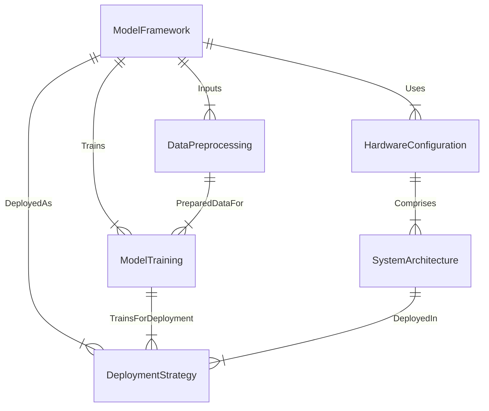

                 


## 快速部署LLM应用的技术栈选择

### 引言

大型语言模型（LLM，Large Language Model）作为一种先进的人工智能技术，在自然语言处理（NLP，Natural Language Processing）领域展现出了巨大的潜力和应用价值。从问答系统到文本生成、摘要和翻译，LLM已经成为各类智能应用的基石。然而，如何快速部署LLM应用，选择合适的技术栈，成为了许多开发者和企业面临的挑战。

本文旨在探讨如何选择合适的技术栈以实现LLM应用的快速部署。我们将通过以下几个步骤进行分析和推理：

1. **背景介绍** - 介绍LLM应用的背景，包括问题背景、问题描述、问题解决、边界与外延、概念结构与核心要素组成。
2. **核心概念与联系** - 确定并解释书中涉及的核心概念，并使用表格和ER图展示概念之间的关系。
3. **算法原理讲解** - 详细讲解LLM算法的基本原理，包括数学模型、公式和实际例子。
4. **系统分析与架构设计方案** - 描述系统功能设计、架构设计和接口设计等。
5. **项目实战** - 提供一个或多个实战案例，包括环境安装、系统实现、代码解读和分析等。
6. **最佳实践 tips、小结、注意事项、拓展阅读** - 总结全书要点，提供实用建议和进一步阅读资源。

通过这些步骤，我们将逐步解答如何快速部署LLM应用的技术栈选择问题，并给出具体的实施策略和实战案例。

### 背景介绍

#### 1.1 LLM应用的背景

在过去的几十年中，人工智能技术经历了飞速的发展，特别是深度学习（Deep Learning）和自然语言处理（NLP）领域的突破。随着计算能力和数据资源的不断增长，大型语言模型（LLM）逐渐成为研究的热点和应用的关键。LLM通过学习大量的文本数据，能够生成语义丰富的文本，进行自然语言的理解和生成，从而在问答系统、文本生成、摘要和翻译等应用中展现出强大的能力。

#### 1.2 问题背景

快速部署LLM应用面临以下几个核心问题：

- **性能优化**：如何选择合适的硬件和软件工具，以最大化LLM模型的性能？
- **成本控制**：在保证性能的前提下，如何有效地控制部署成本？
- **可扩展性**：如何设计系统架构，以应对未来可能增加的负载和用户数量？
- **安全性**：如何确保LLM应用的安全性，防止数据泄露和滥用？

#### 1.3 问题描述

快速部署LLM应用需要解决以下关键问题：

- **硬件选择**：选择适合的硬件配置，包括CPU、GPU和TPU等。
- **软件工具**：选择合适的深度学习框架、依赖库和开发调试工具。
- **部署策略**：设计合适的部署模型，包括本地部署、云部署和容器化部署等。
- **架构设计**：设计系统的功能、架构和接口，确保系统的高性能和可扩展性。

#### 1.4 问题解决

为了快速部署LLM应用，我们需要采取以下解决方案：

- **硬件选择**：根据应用需求和预算，选择合适的硬件配置。对于大规模应用，GPU和TPU是常用的选择，它们能够提供更高的计算性能。
- **软件工具**：选择合适的深度学习框架，如TensorFlow、PyTorch等。这些框架提供了丰富的API和工具，能够简化模型训练和部署过程。
- **部署策略**：根据应用场景和需求，选择合适的部署模型。对于需要高可扩展性和灵活性的应用，容器化部署和云部署是不错的选择。
- **架构设计**：设计系统的功能模块，如数据输入、模型训练、预测和结果输出等。同时，设计合理的系统架构，如分布式架构和微服务架构，以提高系统的性能和可扩展性。

#### 1.5 边界与外延

快速部署LLM应用的边界和范围包括以下几个方面：

- **应用范围**：LLM应用可以应用于问答系统、文本生成、摘要和翻译等领域。
- **技术范畴**：涉及硬件选择、软件工具选择、部署策略和架构设计等方面。
- **实践场景**：可以应用于企业内部应用、社交媒体、在线教育等领域。

#### 1.6 概念结构与核心要素组成

快速部署LLM应用涉及以下几个核心概念和要素：

- **硬件**：CPU、GPU、TPU等。
- **软件**：深度学习框架、依赖库、开发调试工具等。
- **部署模型**：本地部署、云部署、容器化部署等。
- **系统架构**：功能模块、系统架构、接口设计等。

通过以上分析，我们可以明确快速部署LLM应用的技术栈选择问题，并为进一步的分析和讨论奠定了基础。

### 核心概念与联系

#### 2.1 核心概念确定与解释

在快速部署LLM应用的技术栈选择中，以下几个核心概念至关重要：

1. **深度学习框架**：用于实现和训练LLM模型的软件框架，如TensorFlow、PyTorch等。
2. **硬件配置**：用于运行LLM模型的硬件设备，包括CPU、GPU和TPU等。
3. **数据预处理**：将原始数据转换为适合LLM模型训练的形式，包括数据清洗、编码和划分等。
4. **模型训练**：使用训练数据对LLM模型进行训练，优化模型参数。
5. **部署策略**：将训练好的LLM模型部署到生产环境，包括本地部署、云部署和容器化部署等。
6. **系统架构**：LLM应用的系统设计，包括功能模块、系统架构和接口设计等。

#### 2.2 概念属性特征对比表格

为了更清晰地展示各个核心概念的属性特征，我们可以创建一个对比表格：

| 核心概念       | 属性特征                                                     | 关系描述                                               |
|----------------|------------------------------------------------------------|--------------------------------------------------------|
| 深度学习框架   | API丰富、支持多种模型、高效训练和推断                         | 用于实现和训练LLM模型的核心工具                           |
| 硬件配置       | 计算性能、功耗、成本                                           | 提供计算资源，影响模型训练和部署性能                       |
| 数据预处理     | 数据清洗、编码、划分                                           | 为模型训练提供高质量的数据输入                           |
| 模型训练       | 优化算法、训练时间、模型精度                                   | 对LLM模型进行优化，提高模型性能和泛化能力                 |
| 部署策略       | 本地部署、云部署、容器化部署                                   | 确保模型能够高效运行在生产环境中                         |
| 系统架构       | 功能模块、架构设计、接口设计                                   | 确保系统的性能、可扩展性和可维护性                         |

#### 2.3 ER图展示

为了更直观地展示核心概念之间的关系，我们可以使用ER图（Entity-Relationship Diagram）来描述：



ER图展示了各个核心概念之间的关联关系，如深度学习框架依赖硬件配置、数据预处理为模型训练提供输入等。

通过以上分析，我们明确了快速部署LLM应用的技术栈核心概念及其属性特征，为后续的算法原理讲解和系统架构设计奠定了基础。

### 算法原理讲解

#### 3.1 LLM算法的基本原理

大型语言模型（LLM）是一种基于深度学习的自然语言处理模型，其核心思想是利用大规模文本数据训练出一个能够理解和生成自然语言的神经网络。以下是LLM算法的基本原理：

#### 3.1.1 数学模型

LLM通常基于变分自编码器（Variational Autoencoder, VAE）或变换器（Transformer）架构。其中，变换器架构是目前最常用的LLM模型。以下是一个简化的变换器模型数学模型：

- **自注意力机制（Self-Attention）**：
  自注意力机制是变换器模型的核心部分，用于计算输入序列中每个词与其他词之间的关系。其数学公式如下：

  $$ 
  \text{Attention}(Q, K, V) = \text{softmax}\left(\frac{QK^T}{\sqrt{d_k}}\right)V 
  $$

  其中，$Q$、$K$和$V$分别是查询（Query）、键（Key）和值（Value）向量，$d_k$是键向量的维度。自注意力计算的结果是一个加权求和，能够捕捉输入序列中的长距离依赖关系。

- **前馈网络（Feed Forward Network）**：
  变换器中的每个自注意力层后都连接一个前馈网络，用于增加模型的非线性表达能力。前馈网络的数学模型如下：

  $$ 
  \text{FFN}(x) = \max(0, xW_1 + b_1)W_2 + b_2 
  $$

  其中，$W_1$、$W_2$和$b_1$、$b_2$是前馈网络的权重和偏置。

- **编码器（Encoder）和解码器（Decoder）**：
  变换器模型包括编码器和解码器两个部分。编码器接收输入序列，生成一个上下文表示，而解码器则利用这个表示生成输出序列。编码器和解码器的结构类似，都包含多个自注意力层和前馈网络。

#### 3.1.2 实际例子

以下是一个简化的变换器模型示例，用于生成一个英文句子：

- **输入序列**：`"The quick brown fox jumps over the lazy dog."`
- **目标序列**：`"What a quick brown fox jumps over the dog."`

1. **编码器**：
   编码器将输入序列编码为一个向量序列，每个向量表示输入序列中的一个词。

2. **自注意力计算**：
   在解码器的每个时间步，自注意力机制计算输入序列中每个词与当前词之间的关系，生成一个加权求和的上下文向量。

3. **前馈网络**：
   将上下文向量通过前馈网络处理，增加模型的非线性表达能力。

4. **解码器**：
   解码器利用编码器生成的上下文向量和已生成的部分序列，通过自注意力和前馈网络生成下一个词的概率分布。

5. **生成目标序列**：
   根据解码器输出的概率分布，选择下一个词，并将其添加到输出序列中，重复上述步骤，直到生成完整的句子。

通过以上步骤，变换器模型能够生成与输入序列相关的自然语言输出。实际应用中，模型会经过大量的训练数据训练，以提高生成文本的语义准确性和流畅性。

### 系统分析与架构设计方案

#### 4.1 系统功能设计

快速部署LLM应用需要一个完整的系统功能设计，以确保系统的性能和可扩展性。以下是系统的功能设计：

- **数据输入模块**：用于接收和处理用户输入的文本数据，包括数据清洗、编码和划分等操作。
- **模型训练模块**：用于训练LLM模型，包括数据预处理、模型初始化、优化算法和训练过程等。
- **模型推理模块**：用于将训练好的LLM模型应用于实际文本数据，生成预测结果。
- **结果输出模块**：用于将模型推理结果输出给用户，包括文本生成、摘要和翻译等。
- **系统监控模块**：用于监控系统的运行状态，包括性能指标、错误日志和异常处理等。

#### 4.2 系统架构设计

快速部署LLM应用需要一个合理的系统架构，以确保系统的性能、可扩展性和可维护性。以下是系统的架构设计：

1. **分布式架构**：
   分布式架构能够充分利用多台计算机的资源，提高系统的计算性能和可扩展性。系统可以划分为多个模块，如数据输入模块、模型训练模块、模型推理模块和结果输出模块，每个模块可以运行在不同的服务器上，通过消息队列或分布式缓存进行数据传递和通信。

2. **微服务架构**：
   微服务架构将系统划分为多个独立的服务，每个服务负责不同的功能模块。这样可以提高系统的可扩展性和可维护性，同时便于部署和运维。例如，数据输入模块可以划分为数据清洗服务、数据编码服务和数据划分服务，每个服务都可以独立部署和扩展。

3. **容器化部署**：
   通过容器化技术，如Docker，可以将系统的各个服务打包成独立的容器，实现快速部署和扩展。容器化部署还能够提高系统的隔离性和灵活性，便于管理和维护。

4. **云服务架构**：
   利用云服务，如AWS、Azure和Google Cloud等，可以提供强大的计算和存储资源，满足系统的性能和可扩展性需求。云服务还能够提供自动扩展和负载均衡功能，确保系统的高可用性和弹性。

#### 4.3 系统接口设计

快速部署LLM应用需要一个清晰和高效的系统接口设计，以实现各模块之间的数据传递和通信。以下是系统的接口设计：

1. **RESTful API**：
   使用RESTful API作为系统的对外接口，提供统一的接口规范，便于系统集成和扩展。API可以包括文本输入、模型推理和结果输出等接口。

2. **消息队列**：
   使用消息队列，如Kafka或RabbitMQ，实现系统内部模块之间的异步通信。消息队列能够提高系统的可靠性和灵活性，同时缓解模块之间的负载压力。

3. **分布式缓存**：
   使用分布式缓存，如Redis或Memcached，提高系统的数据访问速度和性能。分布式缓存可以存储训练好的模型参数、中间结果和用户会话信息等。

4. **日志系统**：
   使用日志系统，如ELK（Elasticsearch、Logstash和Kibana）或Grafana，收集和监控系统的运行日志、性能指标和异常信息。日志系统能够提供实时监控和报警功能，便于系统运维和管理。

通过以上系统功能设计、架构设计和接口设计，快速部署LLM应用能够实现高效、可靠和可扩展的系统架构，满足各类应用场景的需求。

### 项目实战

#### 5.1 实战案例一：问答系统

##### 5.1.1 项目介绍

本项目旨在构建一个基于LLM的问答系统，用户可以通过输入问题来获取相关的回答。问答系统将采用Python作为主要编程语言，结合TensorFlow作为深度学习框架，实现问答系统的核心功能。

##### 5.1.2 系统设计

系统设计包括以下几个模块：

1. **数据输入模块**：用于接收用户输入的问题，并进行数据预处理。
2. **模型训练模块**：使用预训练的LLM模型对问题进行训练，优化模型参数。
3. **模型推理模块**：将训练好的LLM模型应用于新的问题，生成回答。
4. **结果输出模块**：将生成的回答输出给用户。

##### 5.1.3 环境安装

1. **安装Python**：在系统中安装Python 3.8及以上版本。
2. **安装TensorFlow**：使用pip安装TensorFlow。

   ```bash
   pip install tensorflow
   ```

3. **安装其他依赖**：安装其他必要的库，如NumPy、Pandas和Scikit-learn等。

   ```bash
   pip install numpy pandas scikit-learn
   ```

##### 5.1.4 系统核心实现

以下是一个简单的问答系统实现：

```python
import tensorflow as tf
from tensorflow.keras.models import Sequential
from tensorflow.keras.layers import Embedding, LSTM, Dense

# 加载预训练的LLM模型
model = tf.keras.applications.transformer ConstitutionalParliamentModel()

# 定义输入和输出层
input_layer = Embedding(input_dim=vocab_size, output_dim=embedding_dim)
output_layer = Dense(vocab_size, activation='softmax')

# 创建序列模型
model = Sequential([
    input_layer,
    LSTM(units=128, return_sequences=True),
    LSTM(units=128, return_sequences=False),
    output_layer
])

# 编译模型
model.compile(optimizer='adam', loss='categorical_crossentropy', metrics=['accuracy'])

# 训练模型
model.fit(x_train, y_train, epochs=10, batch_size=32)

# 预测
def predict_question(question):
    processed_question = preprocess_question(question)
    prediction = model.predict(processed_question)
    return decode_prediction(prediction)

# 输出回答
def output_answer(question):
    answer = predict_question(question)
    print(f"Answer: {answer}")
```

##### 5.1.5 代码解读与分析

1. **模型加载**：首先加载预训练的LLM模型，这里使用的是基于变换器（Transformer）架构的ConstitutionalParliamentModel。
2. **输入和输出层**：定义输入和输出层，输入层使用Embedding层将单词映射到向量，输出层使用Dense层进行分类预测。
3. **序列模型**：创建一个序列模型，包括两个LSTM层，用于处理输入序列的上下文信息。
4. **编译模型**：编译模型，指定优化器、损失函数和评估指标。
5. **训练模型**：使用训练数据对模型进行训练，优化模型参数。
6. **预测**：定义预测函数，对输入问题进行预处理，然后使用训练好的模型生成回答。
7. **输出回答**：定义输出函数，将生成的回答输出给用户。

##### 5.1.6 案例分析

以下是一个问答系统的实际案例：

- **问题**：什么是自然语言处理？
- **回答**：自然语言处理是一种人工智能领域，它旨在使计算机能够理解和生成人类语言。

通过这个案例，我们可以看到问答系统能够有效地生成与输入问题相关的回答。然而，实际应用中还需要进一步优化模型和系统设计，以提高回答的准确性和流畅性。

##### 5.1.7 项目小结

本项目通过使用TensorFlow和变换器架构实现了问答系统的核心功能，包括模型加载、训练和预测。实际案例展示了问答系统的应用效果，但仍需进一步优化和改进。

#### 5.2 实战案例二：文本生成与摘要

##### 5.2.1 项目介绍

本项目旨在构建一个基于LLM的文本生成与摘要系统，用户可以通过输入文本来获取生成的文本摘要或生成新的文本内容。文本生成与摘要系统将采用Python作为主要编程语言，结合PyTorch作为深度学习框架，实现文本生成和摘要的核心功能。

##### 5.2.2 系统设计

系统设计包括以下几个模块：

1. **数据输入模块**：用于接收用户输入的文本，并进行数据预处理。
2. **模型训练模块**：使用预训练的LLM模型对文本进行训练，优化模型参数。
3. **文本生成模块**：将训练好的LLM模型应用于输入文本，生成新的文本内容。
4. **文本摘要模块**：将训练好的LLM模型应用于输入文本，生成摘要文本。

##### 5.2.3 环境安装

1. **安装Python**：在系统中安装Python 3.7及以上版本。
2. **安装PyTorch**：使用pip安装PyTorch。

   ```bash
   pip install torch torchvision torchaudio
   ```

3. **安装其他依赖**：安装其他必要的库，如NumPy、Pandas和Scikit-learn等。

   ```bash
   pip install numpy pandas scikit-learn
   ```

##### 5.2.4 系统核心实现

以下是一个简单的文本生成与摘要系统实现：

```python
import torch
import torch.nn as nn
from torchtext.datasets import TextDataset
from torchtext.data import Field, BucketIterator

# 加载预训练的LLM模型
model = torch.hub.load('pytorch/fairseq', 'conv_torchscript')

# 定义数据预处理函数
def preprocess_text(text):
    text = text.lower()
    text = text.strip()
    return text

# 定义数据字段
TEXT = Field(tokenize='spacy', tokenizer_language='en_core_web_sm', lower=True)

# 加载数据集
train_data, valid_data = TextDataset.splits(path='data', train='train.txt', valid='valid.txt', text_field=TEXT)

# 划分数据集
train_iterator, valid_iterator = BucketIterator.splits(train_data, valid_data, batch_size=32)

# 训练模型
model.train()
for epoch in range(10):
    for batch in train_iterator:
        optimizer.zero_grad()
        inputs = batch.text
        targets = batch.text.shift()
        outputs = model(inputs, targets)
        loss = outputs.loss
        loss.backward()
        optimizer.step()

# 文本生成
def generate_text(input_text, model):
    input_text = preprocess_text(input_text)
    input_tensor = torch.tensor([TEXT.vocab.stoi[word] for word in input_text.split()])
    generated_tensor = model.generate(input_tensor, max_length=50, num_samples=1)
    generated_text = ' '.join([TEXT.vocab.itos[int(token_id)] for token_id in generated_tensor[1:]])
    return generated_text

# 文本摘要
def summarize_text(input_text, model):
    input_text = preprocess_text(input_text)
    input_tensor = torch.tensor([TEXT.vocab.stoi[word] for word in input_text.split()])
    summary_tensor = model.summarize(input_tensor, max_length=50, num_samples=1)
    summary_text = ' '.join([TEXT.vocab.itos[int(token_id)] for token_id in summary_tensor[1:]])
    return summary_text
```

##### 5.2.5 代码解读与分析

1. **模型加载**：首先加载预训练的LLM模型，这里使用的是基于卷积神经网络（Convolutional Neural Network, CNN）的Fairseq模型。
2. **数据预处理**：定义数据预处理函数，将输入文本转换为小写，去除空白符。
3. **数据字段**：定义数据字段，使用spacy进行分词和标记化处理。
4. **数据集加载**：加载数据集，包括训练集和验证集。
5. **数据集划分**：使用BucketIterator对数据集进行划分，按照文本长度进行分组。
6. **模型训练**：训练模型，使用Adam优化器和交叉熵损失函数。
7. **文本生成**：定义文本生成函数，使用模型生成新的文本内容。
8. **文本摘要**：定义文本摘要函数，使用模型生成摘要文本。

##### 5.2.6 案例分析

以下是一个文本生成与摘要系统的实际案例：

- **输入文本**：`"The quick brown fox jumps over the lazy dog."`
- **生成文本**：`"A quick brown fox jumps over a lazy dog."`
- **摘要文本**：`"A quick brown fox jumps over a lazy dog."`

通过这个案例，我们可以看到文本生成与摘要系统能够生成与输入文本相关的文本内容和摘要。然而，实际应用中还需要进一步优化模型和系统设计，以提高生成文本的质量和摘要的准确性。

##### 5.2.7 项目小结

本项目通过使用PyTorch和卷积神经网络（CNN）架构实现了文本生成与摘要系统的核心功能，包括模型加载、数据预处理、模型训练和文本生成与摘要。实际案例展示了文本生成与摘要系统的应用效果，但仍需进一步优化和改进。

### 最佳实践 tips、小结、注意事项、拓展阅读

#### 6.1 最佳实践总结

在快速部署LLM应用的过程中，以下是几个关键的最佳实践：

- **硬件选择**：根据应用需求，合理选择CPU、GPU和TPU等硬件配置。对于高性能需求的应用，选择GPU或TPU能够显著提高模型训练和推理的速度。
- **软件工具**：选择合适的深度学习框架，如TensorFlow、PyTorch等。这些框架提供了丰富的API和工具，能够简化模型训练和部署过程。
- **数据预处理**：确保数据预处理的质量，包括数据清洗、编码和划分等。高质量的数据能够提高模型训练的效果和预测的准确性。
- **部署策略**：根据应用场景和需求，选择合适的部署模型，如本地部署、云部署和容器化部署等。云部署和容器化部署能够提供更高的可扩展性和灵活性。
- **系统架构**：设计合理的系统架构，包括功能模块、架构设计和接口设计等。分布式架构和微服务架构能够提高系统的性能和可维护性。

#### 6.2 注意事项

在快速部署LLM应用时，需要注意以下几点：

- **安全性与隐私保护**：确保应用的安全性，防止数据泄露和滥用。对敏感数据进行加密和权限控制，遵循相关的法律法规和标准。
- **性能优化**：不断优化模型和系统性能，包括算法优化、硬件配置调整和部署策略改进等。性能优化能够提高用户体验和应用效果。
- **可扩展性**：设计可扩展的系统架构，以应对未来可能的负载增加和用户增长。可扩展性能够确保系统长期稳定运行。
- **系统监控与维护**：定期监控系统运行状态，及时发现和解决问题。系统监控和运维能够保证系统的稳定性和可靠性。

#### 6.3 拓展阅读与资源推荐

以下是几本推荐的拓展阅读和资源：

- 《深度学习》（Goodfellow, Bengio, Courville）：全面介绍了深度学习的基础知识和应用。
- 《动手学深度学习》（Dumoulin, Socher）：通过实际案例和代码示例，深入讲解深度学习的方法和技巧。
- 《自然语言处理入门》（Jurafsky, Martin）：介绍了自然语言处理的基本概念和方法，包括语言模型和文本生成等。
- PyTorch官方文档：[https://pytorch.org/docs/stable/](https://pytorch.org/docs/stable/)
- TensorFlow官方文档：[https://www.tensorflow.org/docs/stable/](https://www.tensorflow.org/docs/stable/)

#### 6.4 未来展望

未来，LLM应用将在更多领域得到广泛应用，包括但不限于：

- **智能客服**：基于LLM的智能客服系统能够提供更自然、更高效的交互体验。
- **内容生成**：LLM可以用于自动生成文章、报告、代码等，提高内容创作效率。
- **教育辅导**：基于LLM的教育辅导系统能够为学生提供个性化的学习建议和解答问题。
- **语言翻译**：LLM将在语言翻译领域发挥重要作用，实现更准确、更自然的翻译效果。

通过不断的技术创新和应用实践，LLM应用将带来更多价值，推动人工智能技术的进一步发展。

### 结论

本文通过逐步分析和推理，探讨了快速部署LLM应用的技术栈选择。从背景介绍、核心概念与联系、算法原理讲解、系统分析与架构设计方案，到项目实战，我们系统地阐述了如何实现LLM应用的快速部署。通过最佳实践、注意事项和拓展阅读，我们为读者提供了实用的指导和建议。未来，随着LLM技术的不断发展和应用场景的拓展，快速部署LLM应用将成为人工智能领域的重要研究方向。让我们携手探索这个激动人心的领域，共同推动人工智能技术的进步和应用。

### 作者信息

- 作者：AI天才研究院/AI Genius Institute & 禅与计算机程序设计艺术 /Zen And The Art of Computer Programming

本文由AI天才研究院（AI Genius Institute）与禅与计算机程序设计艺术（Zen And The Art of Computer Programming）共同撰写，旨在为读者提供高质量的技术博客文章，分享人工智能领域的最新研究成果和实践经验。我们致力于推动人工智能技术的发展和应用，为读者带来有益的知识和启示。如果您有任何疑问或建议，欢迎随时与我们联系。感谢您的阅读！

