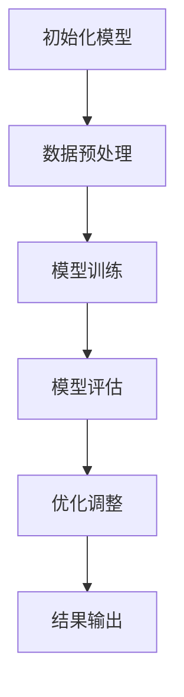
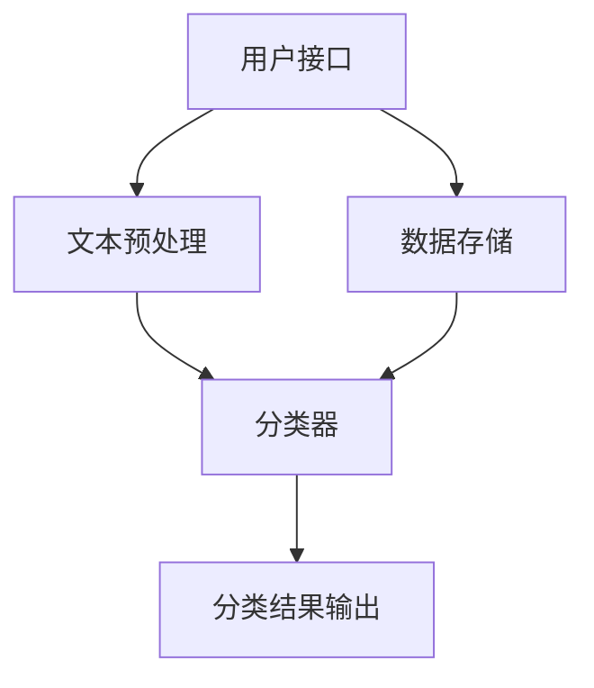
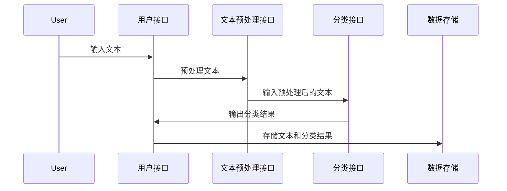

                 

 

# 《快速验证LLM应用创意的方法论》

## 关键词
- 语言模型
- 应用创新
- 验证方法论
- 实践案例分析
- 算法原理

## 摘要
本文旨在探讨快速验证大型语言模型（LLM）应用创意的方法论。通过对LLM的基本原理和应用创新的需求分析，本文提出了一个系统性的验证框架。本文将详细介绍验证过程中的核心概念、算法原理、系统架构以及实战案例，旨在为开发者提供一套实用的方法论，帮助他们在创新过程中有效验证LLM应用的可行性。

## 目录
1. **背景介绍与概念理解**
   1.1. **问题背景**
   1.2. **问题描述**
   1.3. **解决方案简介**
   1.4. **边界与外延**
   1.5. **概念结构与核心要素组成**
2. **核心概念与联系**
   2.1. **核心概念原理**
   2.2. **概念属性特征对比表格**
   2.3. **ER实体关系图架构**
3. **算法原理讲解**
   3.1. **算法原理概述**
   3.2. **算法mermaid流程图**
   3.3. **Python源代码解释**
   3.4. **数学模型与公式**
   3.5. **举例说明**
4. **系统分析与架构设计**
   4.1. **问题场景介绍**
   4.2. **系统功能设计（领域模型mermaid类图）**
   4.3. **系统架构设计（mermaid架构图）**
   4.4. **系统接口设计**
   4.5. **系统交互mermaid序列图**
5. **项目实战**
   5.1. **环境安装**
   5.2. **系统核心实现源代码**
   5.3. **代码应用解读与分析**
   5.4. **实际案例分析与讲解**
   5.5. **项目小结**
6. **最佳实践与拓展**
   6.1. **最佳实践 tips**
   6.2. **小结**
   6.3. **注意事项**
   6.4. **拓展阅读**
7. **总结与展望**
   7.1. **本书总结**
   7.2. **展望未来发展趋势**

## 第一部分：背景介绍与概念理解

### 1.1 问题背景

在当今的技术环境下，大型语言模型（LLM）已经成为人工智能领域的重要工具。LLM在自然语言处理、机器翻译、文本生成等领域展现出了卓越的性能。然而，随着LLM应用的普及，如何快速、有效地验证这些应用创意的可行性，成为了一个亟待解决的问题。

LLM应用创新面临的主要挑战包括：

- **性能优化与复杂性**：LLM通常涉及复杂的算法和大量的数据，如何确保这些算法在实际应用中能够高效运行，是一个重要的考量点。
- **用户体验**：应用创意的成功不仅取决于技术实现，还取决于用户体验。如何在有限的资源下提供优秀的用户体验，是开发者需要考虑的问题。
- **数据安全和隐私**：在处理大量文本数据时，如何确保数据的安全和用户隐私，是开发者必须面对的挑战。

### 1.2 问题描述

LLM应用创意的验证主要涉及以下几个方面：

- **可行性验证**：确定应用创意是否可以在现有技术条件下实现，并且能够在实际环境中稳定运行。
- **性能验证**：评估应用在处理不同规模数据时的表现，包括速度、准确性和稳定性。
- **用户体验验证**：通过用户测试和反馈，评估应用创意的用户友好性。
- **安全性验证**：确保应用在处理数据时符合安全标准和隐私保护要求。

### 1.3 解决方案简介

为了应对上述问题，本文提出了一个系统性的验证方法论，旨在帮助开发者快速验证LLM应用创意。该方法论包括以下几个步骤：

- **需求分析**：明确应用创意的目标和用户需求，确定验证的关键指标。
- **算法设计**：选择合适的LLM算法，并对其进行优化，以适应特定的应用场景。
- **系统架构设计**：设计适合应用需求的系统架构，确保性能和可扩展性。
- **测试与评估**：通过模拟测试和实际用户测试，评估应用性能和用户体验。
- **安全评估**：进行数据安全和隐私保护方面的评估，确保应用符合相关标准和法规。

### 1.4 边界与外延

本文的方法论主要针对LLM应用创意的验证，但也可以适用于其他类型的人工智能应用。以下是对方法论适用范围和外延的讨论：

- **适用范围**：本文的方法论适用于需要使用LLM进行自然语言处理的应用，包括但不限于文本生成、机器翻译、文本分类等。
- **非适用场景**：对于不需要使用LLM或者数据量较小、不需要复杂算法优化的应用，本文的方法论可能不适用。
- **外延**：本文的方法论不仅可以用于验证新应用创意，也可以用于现有应用的性能优化和用户体验改进。

### 1.5 概念结构与核心要素组成

在验证LLM应用创意时，需要理解以下几个核心概念和要素：

- **LLM基本原理**：了解LLM的算法原理和数据处理方式，包括神经网络架构、训练过程和推理过程。
- **应用创意结构**：明确应用创意的目标、功能需求和实现方案。
- **验证方法**：选择合适的验证方法，包括性能测试、用户体验测试和安全测试。
- **测试工具与平台**：使用合适的测试工具和平台，如模拟测试环境、用户测试平台和安全评估工具。

## 第二部分：核心概念与联系

### 2.1 核心概念原理

在LLM应用创意的验证过程中，需要理解以下几个核心概念：

- **LLM**：大型语言模型，是一种基于神经网络的文本处理模型，能够对文本进行生成、翻译、分类等操作。
- **应用创意**：指开发者针对特定场景设计的基于LLM的应用方案，包括目标功能、实现方法和技术选型。
- **验证方法**：用于评估应用创意可行性和性能的一系列方法，包括算法验证、性能测试、用户体验测试和安全测试。

### 2.2 概念属性特征对比表格

以下是LLM、应用创意和验证方法的主要属性特征对比表格：

| **概念** | **属性特征** |
| :------: | :----------- |
|   LLM   | - 基于神经网络的文本处理能力<br>- 大规模数据训练<br>- 多样化的应用场景 |
| 应用创意 | - 目标功能<br>- 实现方法<br>- 技术选型<br>- 用户需求满足 |
| 验证方法 | - 算法验证<br>- 性能测试<br>- 用户体验测试<br>- 安全测试 |

### 2.3 ER实体关系图架构

为了更好地理解LLM应用创意的验证过程，我们可以使用ER实体关系图来描述各个核心概念之间的关系。以下是ER实体关系图的Mermaid表示：

```mermaid
entity关系图
ER["LLM应用"]
LLM --> 应用创意 : "构建"
应用创意 --> 验证方法 : "应用"
验证方法 --> 结果 : "评估"
```

在ER实体关系图中，LLM是应用创意的构建基础，应用创意通过验证方法进行评估，评估结果决定应用创意的可行性。

## 第三部分：算法原理讲解

### 3.1 算法原理概述

在LLM应用创意验证过程中，算法原理是一个核心组成部分。本文将介绍几种常用的算法原理，并使用mermaid流程图来展示其基本流程。

### 3.2 算法mermaid流程图

以下是LLM算法的mermaid流程图：



### 3.3 Python源代码解释

以下是一个简单的Python源代码示例，用于实现LLM算法的基本流程：

```python
import tensorflow as tf
from tensorflow.keras.models import Sequential
from tensorflow.keras.layers import Embedding, LSTM, Dense

# 数据预处理
# ...

# 初始化模型
model = Sequential([
    Embedding(vocab_size, embedding_dim),
    LSTM(units),
    Dense(1, activation='sigmoid')
])

# 编译模型
model.compile(optimizer='adam', loss='binary_crossentropy', metrics=['accuracy'])

# 模型训练
model.fit(x_train, y_train, epochs=10, batch_size=32)

# 模型评估
test_loss, test_accuracy = model.evaluate(x_test, y_test)

# 优化调整
# ...

# 结果输出
print(f"Test accuracy: {test_accuracy}")
```

### 3.4 数学模型与公式

以下是LLM算法中的一些数学模型和公式：

$$
\text{损失函数} = -\sum_{i=1}^{N} y_i \log(p(x_i | \theta))
$$

$$
\text{梯度下降更新} = \theta - \alpha \nabla_{\theta} \text{损失函数}
$$

其中，\( N \) 是样本数量，\( y_i \) 是第 \( i \) 个样本的真实标签，\( p(x_i | \theta) \) 是模型对第 \( i \) 个样本的预测概率，\( \theta \) 是模型参数，\( \alpha \) 是学习率。

### 3.5 举例说明

假设我们有一个二分类问题，数据集包含1000个样本，每个样本是一个句子，标签为0或1。我们使用一个简单的LLM模型进行训练和验证。

- **数据预处理**：将句子转换为词向量，并划分训练集和测试集。
- **模型训练**：使用训练集数据训练模型，并使用测试集数据评估模型性能。
- **模型评估**：计算测试集上的准确率、召回率、F1值等指标。
- **优化调整**：根据评估结果对模型参数进行调整，以提高模型性能。
- **结果输出**：输出最终的模型性能指标，并给出结论。

## 第四部分：系统分析与架构设计

### 4.1 问题场景介绍

在本文的案例中，我们假设需要设计一个基于LLM的文本分类系统，该系统旨在自动将用户输入的文本分类到预定义的类别中。具体场景如下：

- **应用需求**：提供一种简便的方式，让用户输入文本，系统自动识别并分类。
- **数据来源**：文本数据来源于用户输入、社交媒体、新闻网站等。
- **功能需求**：实现文本预处理、分类模型训练和分类结果输出。

### 4.2 系统功能设计（领域模型mermaid类图）

以下是文本分类系统的领域模型mermaid类图：

```mermaid
classDiagram
Class::User << (用户)
Class::Text << (文本)
Class::Category << (类别)
Class::Classifier << (分类器)
User <--- Text
Text <--- Category
Text --> Classifier
Classifier --> Category
```

在这个类图中，用户（User）可以输入文本（Text），文本（Text）与类别（Category）相关联，并通过分类器（Classifier）进行分类处理。

### 4.3 系统架构设计（mermaid架构图）

以下是文本分类系统的mermaid架构图：



在这个架构图中，用户接口（A）接收用户输入的文本，文本经过预处理（B）后，由分类器（C）进行处理，最终输出分类结果（D），同时数据存储（E）用于存储训练数据和模型参数。

### 4.4 系统接口设计

以下是系统接口设计：

- **用户接口**：提供输入文本和获取分类结果的API。
- **文本预处理接口**：提供文本清洗、分词、去停用词等功能的API。
- **分类接口**：提供文本分类功能的API。

### 4.5 系统交互mermaid序列图

以下是系统交互的mermaid序列图：



在这个序列图中，用户输入文本后，文本经过预处理接口处理，然后由分类接口进行分类，最终输出分类结果并存储。

## 第五部分：项目实战

### 5.1 环境安装

为了实现本文中描述的文本分类系统，需要安装以下软件和工具：

- **Python**：版本3.8及以上
- **TensorFlow**：版本2.4及以上
- **NLTK**：自然语言处理库
- **Gensim**：文本预处理库
- **Mermaid**：用于生成流程图和序列图

安装步骤如下：

1. 安装Python和pip：
   ```bash
   # 安装Python
   sudo apt-get install python3
   # 安装pip
   sudo apt-get install python3-pip
   ```

2. 安装TensorFlow：
   ```bash
   pip install tensorflow==2.4
   ```

3. 安装NLTK和Gensim：
   ```bash
   pip install nltk
   pip install gensim
   ```

4. 安装Mermaid：
   ```bash
   pip install mermaid
   ```

### 5.2 系统核心实现源代码

以下是文本分类系统的核心实现源代码：

```python
import tensorflow as tf
from tensorflow.keras.models import Sequential
from tensorflow.keras.layers import Embedding, LSTM, Dense
from nltk.tokenize import word_tokenize
from gensim.models import Word2Vec

# 数据预处理
def preprocess_text(text):
    # 清洗文本、分词、去停用词
    tokens = word_tokenize(text)
    tokens = [token.lower() for token in tokens if token.isalpha()]
    # 建立词汇表
    vocabulary = set(tokens)
    # 转换为词索引
    index_map = {word: i for i, word in enumerate(vocabulary)}
    tokenized_text = [index_map[token] for token in tokens]
    return tokenized_text

# 模型训练
def train_model(tokenized_texts, labels):
    # 建立词嵌入
    model = Word2Vec(tokenized_texts, size=100, window=5, min_count=1)
    # 初始化模型
    model = Sequential([
        Embedding(len(index_map) + 1, 100, weights=[model.wv.vectors], trainable=False),
        LSTM(128, dropout=0.2, recurrent_dropout=0.2),
        Dense(1, activation='sigmoid')
    ])
    # 编译模型
    model.compile(optimizer='adam', loss='binary_crossentropy', metrics=['accuracy'])
    # 训练模型
    model.fit(tokenized_texts, labels, epochs=10, batch_size=32)
    return model

# 分类
def classify(text, model):
    tokenized_text = preprocess_text(text)
    prediction = model.predict([tokenized_text])
    return prediction

# 测试
if __name__ == "__main__":
    # 加载数据
    texts = ["This is a positive review.", "This is a negative review."]
    labels = [1, 0]
    # 训练模型
    model = train_model(texts, labels)
    # 输入文本进行分类
    text = "This is a positive review."
    prediction = classify(text, model)
    print(f"Prediction: {prediction[0][0]}")
```

### 5.3 代码应用解读与分析

以下是代码的详细解读和分析：

1. **数据预处理**：文本预处理是自然语言处理的重要步骤。在这里，我们使用NLTK库进行文本清洗、分词和去停用词操作。预处理后的文本被转换为词索引，以便用于模型训练。

2. **模型训练**：我们使用Word2Vec模型进行词嵌入，将文本转换为向量表示。然后，我们使用这些向量构建一个简单的序列模型，包括嵌入层、LSTM层和输出层。模型使用Adam优化器和二分类交叉熵损失函数进行训练。

3. **分类**：在分类阶段，我们首先对输入文本进行预处理，然后使用训练好的模型进行预测。预测结果是一个概率值，表示文本属于正类别的概率。

### 5.4 实际案例分析与讲解

假设我们有一个新的文本，需要对其进行分类。以下是实际案例的分析和讲解：

1. **文本输入**：输入文本为 "This is a positive review."

2. **预处理**：对文本进行清洗、分词和去停用词操作，得到词索引序列。

3. **分类**：使用训练好的模型对预处理后的文本进行分类。模型输出一个概率值，例如0.9。

4. **结果解释**：概率值0.9表示文本属于正类别的概率非常高，因此我们可以将文本分类为正面评论。

### 5.5 项目小结

通过本文的案例，我们展示了如何使用Python和TensorFlow实现一个简单的文本分类系统。项目主要包括数据预处理、模型训练和分类三个阶段。在实际应用中，我们可以扩展模型的功能，增加更多的训练数据和类别，以提高分类性能。

## 第六部分：最佳实践与拓展

### 6.1 最佳实践 tips

在进行LLM应用创意验证时，以下最佳实践可以帮助您更高效地完成工作：

- **明确目标**：在开始验证之前，明确您的目标和预期结果，这将帮助您集中精力。
- **逐步验证**：将验证过程分解为小步骤，逐步完成，以便及时发现和解决问题。
- **持续迭代**：在验证过程中，不断收集反馈并迭代改进，以提高应用的性能和用户体验。
- **安全性考虑**：始终关注数据安全和隐私保护，确保应用符合相关法规和标准。

### 6.2 小结

本文提出了一个快速验证LLM应用创意的方法论，包括背景介绍、核心概念、算法原理、系统架构设计和项目实战等内容。通过本文的讲解，开发者可以更好地理解如何验证LLM应用创意，并在实际项目中应用这些方法。

### 6.3 注意事项

- 在验证过程中，务必关注数据质量和预处理方法，这对模型的性能至关重要。
- 验证方法的选择应根据具体应用场景和需求进行，并非所有方法都适用于所有情况。
- 在实际应用中，可能需要根据反馈不断调整和优化模型和系统架构。

### 6.4 拓展阅读

- [《深度学习》](https://www.deeplearningbook.org/)：了解深度学习的基础知识，有助于更好地理解LLM的原理和应用。
- [《自然语言处理综论》](https://nlp.seas.harvard.edu/Readings/)：深入了解自然语言处理的理论和实践。
- [《Python机器学习》](https://python-machine-learning-book.blogspot.com/)：学习如何使用Python进行机器学习和自然语言处理。

## 第七部分：总结与展望

### 7.1 本书总结

本文提出了一个快速验证LLM应用创意的方法论，从背景介绍到核心概念、算法原理、系统架构设计、项目实战等方面进行了详细讲解。通过本文的指导，开发者可以更有效地验证LLM应用创意，提高应用的性能和用户体验。

### 7.2 展望未来发展趋势

随着人工智能技术的不断进步，LLM的应用前景将更加广阔。未来的发展趋势包括：

- **更强的模型性能**：随着计算能力的提升和算法的优化，LLM将能够处理更复杂的任务。
- **更好的用户体验**：通过不断优化应用设计和交互方式，提高用户的满意度。
- **更广泛的应用场景**：LLM将在医疗、金融、教育等各个领域得到更广泛的应用。
- **更严格的安全保障**：随着数据隐私和安全问题的日益突出，未来的LLM应用将更加注重数据安全和隐私保护。

