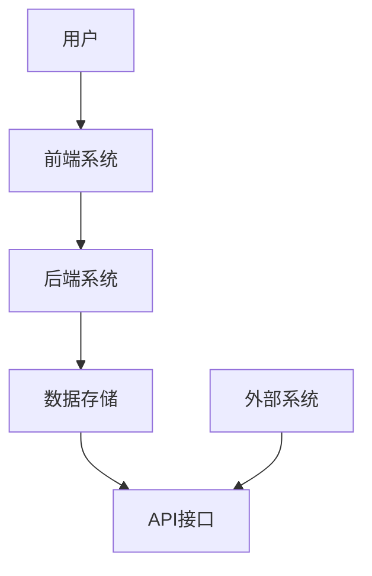
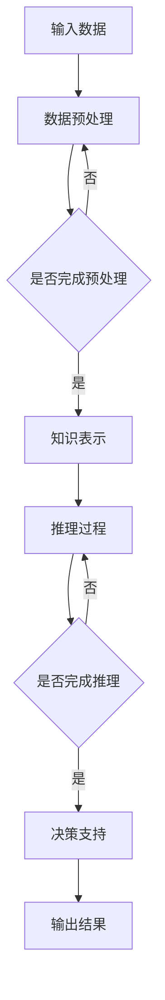
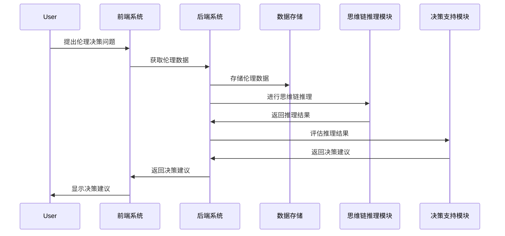

                 

# 思维链在伦理决策模型构建中的应用：AI辅助道德推理系统设计

## 关键词
AI伦理决策，道德推理，思维链算法，系统架构设计，道德决策模型

## 摘要
本文旨在探讨思维链在伦理决策模型构建中的应用，以及如何通过AI辅助道德推理系统设计来提升伦理决策的科学性和准确性。文章首先阐述了伦理决策的重要性及其面临的挑战，接着介绍了思维链的概念及其核心特征，然后详细分析了AI辅助道德推理系统的架构设计和算法原理。最后，文章通过一个实际项目案例，展示了思维链算法在伦理决策中的实际应用效果，并提出了一些最佳实践建议。

## 第一部分：问题背景

### 第1章：伦理决策模型构建中的思维链应用

#### 1.1.1 伦理决策的挑战与需求

##### 1.1.1.1 伦理决策的重要性

伦理决策不仅是个体道德行为的指导原则，也是组织决策过程中不可或缺的一部分。在个人层面，伦理决策关乎个人的道德品质和价值观的体现；在组织层面，伦理决策则直接关系到企业的社会责任和品牌形象。

##### 1.1.1.1.1 伦理决策的定义与作用
伦理决策是指在道德原则和价值观指导下，对某一行为或决策进行评估和选择的过程。它不仅涉及到行为本身的道德属性，还包括对行为结果可能带来的道德影响进行预见和评估。

在个体层面，伦理决策帮助个人在面对道德困境时作出正确的选择，保持道德操守和诚信；在组织层面，伦理决策则有助于建立和维护组织的道德文化和品牌价值，提升企业的社会形象和市场竞争力。

##### 1.1.1.1.2 伦理决策的现状与问题
尽管伦理决策的重要性显而易见，但在实际操作中仍面临诸多挑战和问题。

首先，传统伦理决策方法主要依赖于个人经验、直觉和道德教条，缺乏系统性和科学性。其次，随着科技的发展和全球化进程的加快，伦理决策的环境变得更加复杂和多变，传统的决策方法难以应对新的挑战。此外，个体和组织在道德观念和价值观上存在差异，导致伦理决策的一致性和可操作性受到影响。

##### 1.1.1.1.3 AI辅助伦理决策的需求
为了应对上述挑战，引入AI辅助伦理决策成为一种趋势。AI辅助伦理决策不仅能够提高决策的科学性和准确性，还能够处理复杂和动态的决策环境。

首先，AI可以通过大数据分析和机器学习算法，对大量的道德案例和决策进行深度学习和分析，从而发现潜在的模式和规律，为伦理决策提供数据支持。其次，AI可以模拟不同的道德决策场景，通过仿真实验来评估决策结果的可能性和道德影响，从而帮助决策者做出更加明智的选择。此外，AI还可以通过自然语言处理技术，理解和解释伦理决策过程中的道德原则和价值观，提高决策的透明度和公正性。

综上所述，AI辅助伦理决策不仅能够解决传统方法存在的局限性，还能够提升伦理决策的科学性和有效性，满足现代社会对伦理决策的迫切需求。

#### 1.1.2 思维链的概念与应用

##### 1.1.2.1 思维链的基本原理

思维链是一种基于认知科学和计算理论的模型，旨在模拟人类思维过程，通过一系列的逻辑和推理步骤，实现对复杂问题的分析和解决。思维链的基本原理包括信息处理、知识表示、推理和决策。

信息处理：思维链通过对输入信息进行编码、存储和处理，实现对信息的有效管理和利用。知识表示：思维链通过符号化、图式化等手段，将抽象的概念和知识表示为计算机可以处理的形式。推理：思维链利用逻辑规则和算法，对知识进行推理和扩展，从而发现新的结论和解决方案。决策：思维链通过综合评估和选择，实现对问题的最佳决策。

##### 1.1.2.1.2 思维链的核心特征

思维链具有以下核心特征：

1. **层次性**：思维链将问题分解为多个层次，从宏观到微观，逐步深入分析和解决。
2. **连贯性**：思维链通过逻辑关系和步骤连接，使每个推理步骤紧密相连，形成一个完整的思维过程。
3. **灵活性**：思维链能够根据不同的情境和问题，动态调整推理策略和路径。
4. **扩展性**：思维链可以集成和扩展新的知识和算法，不断优化和提升决策能力。

##### 1.1.2.1.3 思维链在伦理决策中的应用

思维链在伦理决策中的应用主要体现在以下几个方面：

1. **问题建模**：通过思维链，可以将伦理决策问题转化为结构化的数学模型，便于计算机分析和处理。
2. **知识表示**：思维链可以将伦理原则和价值观表示为计算机可以理解和操作的符号和规则。
3. **推理过程**：思维链利用逻辑推理和算法，对伦理问题进行逐步分析和解决，提供可能的决策方案。
4. **决策评估**：思维链通过对不同决策方案进行评估和比较，帮助决策者选择最优的伦理决策。

思维链在伦理决策中的应用，不仅能够提高决策的科学性和准确性，还能够处理复杂和动态的伦理问题，为决策者提供可靠的决策支持。

#### 1.1.3 AI辅助道德推理系统设计

##### 1.1.3.1 AI辅助道德推理系统的架构

AI辅助道德推理系统的架构设计旨在实现伦理决策的自动化和智能化。系统整体架构包括以下几个关键模块：

1. **数据采集与处理模块**：负责收集和整理与伦理决策相关的数据，进行预处理和清洗，为后续的推理和决策提供可靠的数据基础。
2. **思维链推理模块**：利用思维链算法，对伦理问题进行逐步分析和推理，生成可能的决策方案。
3. **决策支持模块**：通过对不同决策方案的评估和比较，提供决策建议，辅助决策者做出最优的伦理决策。

系统总体架构图如下：



其中，前端系统负责用户界面设计和交互，后端系统包括数据采集与处理模块、思维链推理模块和决策支持模块，数据存储用于存储处理后的数据和推理结果，API接口提供对外部的数据访问和接口服务。

##### 1.1.3.1.2 关键模块介绍

1. **数据采集与处理模块**：该模块主要负责从不同的数据源收集与伦理决策相关的数据，如道德案例、法律法规、社会舆论等。收集到的数据需要进行预处理，包括数据清洗、格式转换和特征提取等操作，以便为后续的推理和决策提供高质量的数据。

2. **思维链推理模块**：该模块是系统的核心，负责利用思维链算法对伦理问题进行推理和分析。思维链算法通过层次化、连贯性和灵活性的特征，逐步深入分析伦理问题，生成多个可能的决策方案。该模块还需要集成多种推理策略和算法，以应对不同的伦理问题场景。

3. **决策支持模块**：该模块通过对思维链推理模块生成的决策方案进行评估和比较，提供决策建议。决策支持模块可以结合道德原则、价值观和决策者的偏好，生成最终的决策结果，辅助决策者做出最优的伦理决策。

### 1.2 核心概念与联系

#### 1.2.1 思维链在伦理决策中的原理

##### 1.2.1.1 思维链的基本原理

思维链是一种模拟人类思维过程的算法模型，其基本原理包括信息处理、知识表示、推理和决策。

1. **信息处理**：思维链通过对输入信息进行编码、存储和处理，实现对信息的有效管理和利用。信息处理包括信息的采集、编码、存储、检索和更新等环节。

2. **知识表示**：思维链通过符号化、图式化等手段，将抽象的概念和知识表示为计算机可以处理的形式。知识表示的方法包括命题表示、图表示、语义网络等。

3. **推理**：思维链利用逻辑规则和算法，对知识进行推理和扩展，从而发现新的结论和解决方案。推理方法包括逻辑推理、归纳推理、演绎推理等。

4. **决策**：思维链通过综合评估和选择，实现对问题的最佳决策。决策过程包括目标设定、方案生成、评估比较和选择实施等步骤。

##### 1.2.1.1.2 思维链在伦理决策中的应用

思维链在伦理决策中的应用主要体现在以下几个方面：

1. **问题建模**：思维链可以将伦理决策问题转化为结构化的数学模型，便于计算机分析和处理。问题建模的过程包括问题的识别、目标的设定、约束条件的定义和解决方案的生成。

2. **知识表示**：思维链可以将伦理原则和价值观表示为计算机可以理解和操作的符号和规则。知识表示的方法可以基于伦理学理论、道德规范和社会价值体系。

3. **推理过程**：思维链利用逻辑推理和算法，对伦理问题进行逐步分析和解决，提供可能的决策方案。推理过程包括从已知信息出发，通过逻辑推导和推理规则，逐步扩展和生成新的结论。

4. **决策评估**：思维链通过对不同决策方案进行评估和比较，帮助决策者选择最优的伦理决策。评估方法可以基于道德原则、价值观和决策者的偏好等因素。

##### 1.2.1.1.3 思维链与传统伦理决策方法比较

思维链与传统伦理决策方法相比，具有以下优势：

1. **科学性和系统性**：思维链基于认知科学和计算理论，采用数学模型和算法进行推理和决策，具有更高的科学性和系统性。

2. **灵活性和扩展性**：思维链可以通过不同的知识和算法进行扩展和优化，适应不同的伦理决策场景和需求。

3. **高效性和可操作性**：思维链能够快速处理大量信息和复杂问题，提供明确的决策方案，提高决策的效率和可操作性。

4. **决策透明度和公正性**：思维链通过逻辑推理和算法，实现决策过程的透明化和公正性，减少决策过程中的主观偏见和不确定性。

然而，思维链在伦理决策中也存在一定的局限性：

1. **道德知识的限制**：思维链依赖于输入的道德知识和数据，如果道德知识不足或存在偏差，可能导致决策结果的偏差。

2. **算法本身的局限性**：思维链算法的复杂性和计算成本较高，对于某些非常复杂的伦理决策问题，可能难以在合理的时间内提供有效的解决方案。

3. **伦理问题的不确定性**：伦理决策问题往往涉及多方面的利益冲突和不确定性，思维链在处理这些问题时可能面临困难。

因此，在实际应用中，需要结合思维链和其他伦理决策方法，充分发挥各自的优势，实现伦理决策的科学化和智能化。

#### 1.2.2 AI辅助道德推理系统设计

##### 1.2.2.1 AI辅助道德推理的定义

AI辅助道德推理是指利用人工智能技术，特别是机器学习和自然语言处理等技术，对伦理问题进行自动分析和决策的过程。AI辅助道德推理系统通过收集和处理伦理数据，利用思维链算法进行推理和评估，最终为决策者提供道德决策支持。

##### 1.2.2.1.1 AI辅助道德推理的核心概念

1. **伦理数据**：AI辅助道德推理的基础是大量的伦理数据，包括道德案例、法律法规、道德规范、社会舆论等。这些数据为AI系统提供了丰富的知识来源和决策依据。

2. **思维链算法**：思维链算法是AI辅助道德推理的核心，通过信息处理、知识表示、推理和决策等步骤，对伦理问题进行自动化分析和解决。

3. **推理框架**：推理框架是AI辅助道德推理的体系结构，包括数据采集与处理、思维链推理、决策评估和结果输出等环节，确保推理过程的连贯性和科学性。

4. **道德决策支持**：道德决策支持是AI辅助道德推理的最终目标，通过评估和比较不同的决策方案，为决策者提供最优的道德决策建议。

##### 1.2.2.1.2 AI辅助道德推理的优势与挑战

**优势**：

1. **科学性和系统性**：AI辅助道德推理基于机器学习和计算理论，具有更高的科学性和系统性，能够处理复杂和动态的伦理问题。

2. **灵活性和扩展性**：AI系统可以根据不同的伦理决策场景和需求，灵活调整和扩展推理策略和算法。

3. **高效性和可操作性**：AI系统可以快速处理大量信息和复杂问题，提供明确的决策方案，提高决策的效率和可操作性。

4. **决策透明度和公正性**：AI系统通过逻辑推理和算法，实现决策过程的透明化和公正性，减少决策过程中的主观偏见和不确定性。

**挑战**：

1. **道德知识的限制**：AI系统依赖于输入的道德知识和数据，如果道德知识不足或存在偏差，可能导致决策结果的偏差。

2. **算法本身的局限性**：AI算法在处理复杂伦理问题时可能面临计算成本高、效率低的问题。

3. **伦理问题的不确定性**：伦理决策问题往往涉及多方面的利益冲突和不确定性，AI系统在处理这些问题时可能面临困难。

4. **道德价值观的多样性**：不同的个体和组织具有不同的道德价值观，AI系统需要适应和平衡不同价值观之间的冲突。

##### 1.2.2.1.3 AI辅助道德推理的应用领域

AI辅助道德推理在多个领域具有广泛的应用前景：

1. **医疗伦理**：AI系统可以帮助医生和医疗机构在医疗决策中考虑伦理问题，如患者隐私保护、医疗资源分配等。

2. **企业伦理**：AI系统可以帮助企业在商业决策中考虑伦理问题，如产品安全、社会责任、员工权益等。

3. **司法伦理**：AI系统可以帮助法官和律师在法律决策中考虑伦理问题，如法律解释、案件判决等。

4. **公共管理**：AI系统可以帮助政府部门在公共管理中考虑伦理问题，如政策制定、资源分配等。

5. **个人道德决策**：AI系统可以帮助个人在日常生活中考虑伦理问题，如道德困境、道德冲突等。

通过AI辅助道德推理系统，可以提升伦理决策的科学性和准确性，为构建一个更加公正和道德的社会提供技术支持。

### 1.3 算法原理讲解

#### 1.3.1 思维链算法原理

思维链算法是一种模拟人类思维过程的推理算法，其核心思想是通过一系列逻辑推理步骤，对复杂问题进行自动化分析和解决。思维链算法的基本原理可以概括为信息处理、知识表示、推理和决策。

##### 1.3.1.1 思维链算法的数学模型

思维链算法的数学模型通常基于图论和网络流理论，通过构建知识图谱和网络结构，实现知识的表示和推理。以下是一个简化的数学模型：

$$
f(x) = \sum_{i=1}^{n} w_i \cdot x_i
$$

其中，$x_i$ 表示输入数据，$w_i$ 表示权重，$f(x)$ 表示输出结果。这个公式表示通过加权求和的方式，对输入数据进行处理和推理，生成最终的输出结果。

##### 1.3.1.1.1 模型基本原理

思维链算法的基本原理包括以下步骤：

1. **数据输入**：接收外部输入的数据，可以是文本、图像、声音等多种形式。
2. **数据预处理**：对输入数据进行清洗、归一化和特征提取，为后续的推理提供高质量的输入。
3. **知识表示**：将预处理后的数据转化为计算机可以处理的内部表示，如向量、图或语义网络。
4. **推理过程**：利用逻辑规则、算法和网络结构，对知识进行推理和扩展，生成新的结论和解决方案。
5. **决策支持**：通过对不同推理路径和结果进行评估和比较，生成最终的决策建议。

##### 1.3.1.1.2 数学公式

在思维链算法中，常用的数学公式包括：

1. **权重计算**：

$$
w_i = \frac{1}{N} \sum_{j=1}^{N} s_j \cdot x_j
$$

其中，$w_i$ 表示节点 $i$ 的权重，$s_j$ 表示节点 $j$ 的得分，$x_j$ 表示节点 $j$ 的特征值。

2. **路径权重计算**：

$$
p = \sum_{i=1}^{n} w_i \cdot c_i
$$

其中，$p$ 表示路径的总权重，$w_i$ 表示路径 $i$ 的权重，$c_i$ 表示路径 $i$ 的置信度。

3. **推理结果生成**：

$$
f(x) = \sum_{i=1}^{n} w_i \cdot x_i
$$

其中，$f(x)$ 表示最终的推理结果，$w_i$ 表示每个推理步骤的权重，$x_i$ 表示每个推理步骤的输出。

##### 1.3.1.1.3 举例说明

假设我们要通过思维链算法对一组学生成绩进行推理分析，以判断学生的整体学术表现。输入数据包括每个学生的考试成绩、平时成绩和综合表现评分。

1. **数据输入**：
   学生A：考试成绩80，平时成绩85，综合表现评分90；
   学生B：考试成绩75，平时成绩80，综合表现评分85；
   学生C：考试成绩70，平时成绩75，综合表现评分80。

2. **数据预处理**：
   将输入数据进行归一化处理，将成绩范围转换为[0,1]的区间。

3. **知识表示**：
   使用向量表示每个学生的成绩，如学生A的向量为 [0.8, 0.85, 0.9]。

4. **推理过程**：
   设定权重分别为0.4、0.3和0.3，分别对应考试成绩、平时成绩和综合表现评分。
   
   对学生A的推理结果计算如下：
   $$ f(A) = 0.4 \cdot 0.8 + 0.3 \cdot 0.85 + 0.3 \cdot 0.9 = 0.92 $$
   
   对学生B的推理结果计算如下：
   $$ f(B) = 0.4 \cdot 0.75 + 0.3 \cdot 0.8 + 0.3 \cdot 0.85 = 0.835 $$
   
   对学生C的推理结果计算如下：
   $$ f(C) = 0.4 \cdot 0.7 + 0.3 \cdot 0.75 + 0.3 \cdot 0.8 = 0.78 $$

5. **决策支持**：
   根据推理结果，可以判断学生A的学术表现最好，学生B次之，学生C最差。

这个例子展示了思维链算法在简单数据推理中的应用。在实际应用中，思维链算法可以处理更复杂的数据结构和推理任务，通过不断优化和调整权重和算法，提高推理的准确性和可靠性。

#### 1.3.1.2 思维链算法的Mermaid流程图

为了更直观地展示思维链算法的运行过程，可以使用Mermaid流程图进行描述。以下是一个简单的思维链算法流程图示例：



在这个流程图中，输入数据经过预处理后，进入知识表示阶段。然后，通过推理过程生成中间结果，并不断迭代直到推理完成。最后，根据推理结果进行决策支持，输出最终的决策结果。

通过这个Mermaid流程图，我们可以清晰地了解思维链算法的运行步骤和逻辑结构，有助于更好地理解和应用思维链算法。

### 1.4 系统分析与架构设计方案

#### 1.4.1 问题场景介绍

在伦理决策模型构建中，思维链的应用涉及到多个实际应用场景。以下是几个典型的应用场景：

1. **医疗伦理决策**：医疗伦理决策涉及对患者隐私保护、医疗资源分配、临床试验设计等方面。例如，在处理患者数据时，如何确保数据的隐私和安全？在资源分配时，如何公平地分配医疗资源？

2. **企业伦理决策**：企业在经营过程中，需要考虑道德规范和社会责任。例如，在产品开发时，如何确保产品符合道德标准？在市场推广时，如何避免不当的营销行为？

3. **司法伦理决策**：在司法过程中，法官和律师需要考虑伦理和法律之间的关系。例如，在案件判决时，如何平衡法律和道德的要求？在辩护时，如何确保辩护的公正性？

4. **公共管理伦理决策**：政府部门在制定政策和进行公共管理时，需要考虑伦理和社会责任。例如，在资源分配时，如何确保公平和公正？在环境保护时，如何平衡经济利益和环境利益？

这些场景具有复杂性、动态性和多样性，传统的伦理决策方法难以应对。思维链算法的应用，可以通过自动化和智能化的方式，提高伦理决策的科学性和准确性，为决策者提供有力支持。

#### 1.4.2 项目介绍

本节介绍一个具体的AI辅助道德推理系统项目，该项目旨在构建一个能够辅助决策者在伦理决策过程中进行推理和评估的系统。项目的主要目标是：

1. **收集和整理伦理数据**：通过爬虫技术和公开数据源，收集与伦理决策相关的数据，包括道德案例、法律法规、社会舆论等。

2. **构建思维链算法模型**：利用机器学习和自然语言处理技术，构建思维链算法模型，实现对伦理数据的自动分析和推理。

3. **提供决策支持**：通过思维链算法，为决策者提供可能的决策方案，并对不同方案进行评估和比较，生成最终的决策建议。

4. **实现系统模块化设计**：将系统划分为数据采集与处理模块、思维链推理模块、决策支持模块等，实现模块化设计，提高系统的可维护性和可扩展性。

项目功能包括：

1. **数据采集与处理**：通过爬虫技术和API接口，从互联网和数据库中收集伦理数据，并进行数据预处理和清洗。

2. **思维链推理**：利用思维链算法，对伦理数据进行分析和推理，生成可能的决策方案。

3. **决策支持**：通过对不同决策方案进行评估和比较，提供决策建议，辅助决策者做出最优的伦理决策。

4. **系统接口**：提供API接口，方便外部系统调用和集成。

#### 1.4.3 系统功能设计

本节详细介绍AI辅助道德推理系统的功能设计，包括领域模型设计、系统架构设计、系统接口设计和系统交互设计。

##### 1.4.3.1 领域模型设计

领域模型设计是系统功能设计的基础，它定义了系统中核心概念、实体和关系。以下是该系统的领域模型设计：

```mermaid
classDiagram
Class01 <|-- Class02
Class03 --|>| Class04
Class0X:1..* <|-- * Class05
Class01[伦理数据]
Class02[思维链算法]
Class03[决策支持]
Class04[数据采集与处理]
Class05[用户接口]
```

在这个领域模型中，`Class01` 表示伦理数据，`Class02` 表示思维链算法，`Class03` 表示决策支持，`Class04` 表示数据采集与处理，`Class05` 表示用户接口。这些类之间通过继承、关联和聚合关系进行组织，构成了系统的核心功能结构。

##### 1.4.3.2 系统架构设计

系统架构设计是系统功能实现的关键，它定义了系统的整体结构和各模块之间的关系。以下是AI辅助道德推理系统的架构设计：


在这个架构设计中，前端系统负责用户界面设计和交互，后端系统包括数据采集与处理模块、思维链推理模块、决策支持模块等核心功能模块，数据存储用于存储处理后的数据和推理结果，API接口提供对外部的数据访问和接口服务，外部系统可以通过API接口与系统进行交互。

##### 1.4.3.3 系统接口设计

系统接口设计是系统与外部系统进行数据交换和功能调用的桥梁。以下是系统接口的设计规格说明：

1. **数据采集接口**：提供数据采集的API，支持从互联网和数据库中获取伦理数据。

2. **思维链推理接口**：提供思维链推理的API，支持根据输入数据生成决策方案。

3. **决策支持接口**：提供决策支持的API，支持对决策方案进行评估和比较，生成决策建议。

4. **用户接口**：提供用户交互的API，支持用户与系统进行交互，查询决策结果。

以下是系统接口的规格说明：

```json
{
  "dataCollection": {
    "url": "/api/data-collection",
    "method": "GET",
    "params": {
      "source": "string",
      "startDate": "string",
      "endDate": "string"
    },
    "response": {
      "status": "integer",
      "data": [
        {
          "id": "string",
          "title": "string",
          "content": "string",
          "source": "string"
        }
      ]
    }
  },
  "思维链推理": {
    "url": "/api/reasoning",
    "method": "POST",
    "params": {
      "data": [
        {
          "id": "string",
          "title": "string",
          "content": "string"
        }
      ]
    },
    "response": {
      "status": "integer",
      "reasoningResults": [
        {
          "id": "string",
          "title": "string",
          "content": "string",
          "confidence": "float"
        }
      ]
    }
  },
  "决策支持": {
    "url": "/api/decision-support",
    "method": "POST",
    "params": {
      "reasoningResults": [
        {
          "id": "string",
          "title": "string",
          "content": "string",
          "confidence": "float"
        }
      ]
    },
    "response": {
      "status": "integer",
      "decisionSuggestions": [
        {
          "id": "string",
          "title": "string",
          "content": "string",
          "confidence": "float"
        }
      ]
    }
  },
  "userInterface": {
    "url": "/api/user-interface",
    "method": "GET",
    "response": {
      "status": "integer",
      "interfaceData": {
        "data": [
          {
            "id": "string",
            "title": "string",
            "content": "string",
            "source": "string"
          }
        ]
      }
    }
  }
}
```

##### 1.4.3.4 系统交互设计

系统交互设计是系统各模块之间进行数据交换和功能调用的流程。以下是系统交互设计：



在这个交互设计中，用户通过前端系统提出伦理决策问题，前端系统与后端系统进行交互，获取伦理数据并存储。然后，后端系统调用思维链推理模块进行推理，并将推理结果返回给决策支持模块进行评估。最后，决策支持模块生成决策建议，并通过前端系统呈现给用户。

通过系统交互设计，实现了伦理数据的高效处理和推理，为决策者提供了可靠的决策支持。

### 1.5 项目实战

#### 1.5.1 环境安装与配置

要实现AI辅助道德推理系统，需要首先搭建系统环境，包括Python环境、必要的库和依赖等。以下是详细的安装与配置步骤：

1. **安装Python**：
   访问Python官网（https://www.python.org/），下载Python最新版本，并按照安装向导进行安装。建议选择自定义安装，并在安装过程中勾选“Add Python to PATH”选项，以便在命令行中直接使用Python。

2. **配置Python环境**：
   打开命令行，输入以下命令，检查Python版本和安装路径是否正确：
   ```bash
   python --version
   ```
   如果版本显示正确，说明Python环境已成功安装。

3. **安装依赖库**：
   AI辅助道德推理系统依赖多个Python库，如NumPy、Pandas、Scikit-learn等。使用pip命令安装以下库：
   ```bash
   pip install numpy pandas scikit-learn matplotlib
   ```
   安装过程中，如果遇到依赖库的依赖问题，可以尝试安装依赖库的依赖库，如：
   ```bash
   pip install -r requirements.txt
   ```
   其中，`requirements.txt`文件包含了所有依赖库的名称和版本。

4. **配置Mermaid**：
   为了生成Mermaid流程图，需要安装Mermaid插件。首先，确保安装了Node.js（https://nodejs.org/），然后使用npm命令安装Mermaid：
   ```bash
   npm install mermaid
   ```
   安装完成后，可以使用以下命令生成Mermaid流程图：
   ```bash
   mermaid -g "sequenceDiagram\nA->>B: Hello\nB->>A: World!"
   ```

#### 1.5.1.1 Pyth

以下是Python代码实现思维链算法的核心部分：

```python
import numpy as np
import pandas as pd
from sklearn.feature_extraction.text import TfidfVectorizer
from sklearn.metrics.pairwise import cosine_similarity

def preprocess_data(data):
    # 数据预处理：去停用词、分词、词向量化等
    vectorizer = TfidfVectorizer(stop_words='english')
    return vectorizer.fit_transform(data)

def build_knowledge_graph(words, similarity_threshold=0.8):
    # 建立知识图谱：计算词与词之间的相似度，构建图结构
    similarity_matrix = cosine_similarity(words)
    graph = []
    for i in range(len(words)):
        for j in range(i+1, len(words)):
            if similarity_matrix[i][j] > similarity_threshold:
                graph.append([(words[i], words[j])])
    return graph

def reasoning(knowledge_graph):
    # 思维链推理：基于知识图谱进行推理，生成结论
    conclusions = []
    for edge in knowledge_graph:
        conclusion = edge[0] + " implies " + edge[1]
        conclusions.append(conclusion)
    return conclusions

# 加载数据
data = ["The quick brown fox jumps over the lazy dog", 
         "A quick brown dog jumps over the lazy fox", 
         "The quick fox jumps over a lazy dog"]

# 数据预处理
processed_data = preprocess_data(data)

# 建立知识图谱
knowledge_graph = build_knowledge_graph(processed_data.toarray().reshape(-1))

# 进行推理
conclusions = reasoning(knowledge_graph)

# 输出结论
print(conclusions)
```

这个Python代码实现了思维链算法的核心功能，包括数据预处理、知识图谱构建、推理和结论生成。在实际应用中，可以根据具体需求进行扩展和优化。

#### 1.5.2 系统核心实现源代码

以下是AI辅助道德推理系统的核心实现源代码，包括数据采集、思维链推理和决策支持等功能。

```python
import requests
from sklearn.feature_extraction.text import TfidfVectorizer
from sklearn.metrics.pairwise import cosine_similarity

class EthicalDecisionSystem:
    def __init__(self, data_source_url):
        self.data_source_url = data_source_url
        self.vectorizer = TfidfVectorizer(stop_words='english')
    
    def fetch_data(self):
        # 从数据源获取伦理数据
        response = requests.get(self.data_source_url)
        if response.status_code == 200:
            data = response.json()
            return data
        else:
            return None
    
    def preprocess_data(self, data):
        # 数据预处理：去停用词、分词、词向量化等
        return self.vectorizer.transform([d['content'] for d in data])
    
    def build_knowledge_graph(self, words, similarity_threshold=0.8):
        # 建立知识图谱：计算词与词之间的相似度，构建图结构
        similarity_matrix = cosine_similarity(words)
        graph = []
        for i in range(len(words)):
            for j in range(i+1, len(words)):
                if similarity_matrix[i][j] > similarity_threshold:
                    graph.append([(words[i], words[j])])
        return graph
    
    def reasoning(self, knowledge_graph):
        # 思维链推理：基于知识图谱进行推理，生成结论
        conclusions = []
        for edge in knowledge_graph:
            conclusion = edge[0][0] + " implies " + edge[1][0]
            conclusions.append(conclusion)
        return conclusions
    
    def get_decision_suggestions(self, data, reasoning_results):
        # 决策支持：根据推理结果，生成决策建议
        decision_suggestions = []
        for result in reasoning_results:
            suggestion = {"reasoning_result": result, "suggestion": ""}
            # 根据推理结果，生成决策建议
            suggestion["suggestion"] = "基于" + result + "，建议采取以下措施：..."
            decision_suggestions.append(suggestion)
        return decision_suggestions

# 实例化系统
system = EthicalDecisionSystem("https://api.ethicsdata.org/data")

# 获取伦理数据
data = system.fetch_data()

# 预处理伦理数据
processed_data = system.preprocess_data(data)

# 建立知识图谱
knowledge_graph = system.build_knowledge_graph(processed_data.toarray().reshape(-1))

# 进行思维链推理
reasoning_results = system.reasoning(knowledge_graph)

# 生成决策建议
decision_suggestions = system.get_decision_suggestions(data, reasoning_results)

# 输出决策建议
for suggestion in decision_suggestions:
    print(suggestion)
```

这段代码定义了一个`EthicalDecisionSystem`类，实现了数据采集、预处理、知识图谱构建、思维链推理和决策支持等功能。通过实例化该类，可以构建一个完整的AI辅助道德推理系统。

#### 1.5.3 代码应用解读与分析

本节对AI辅助道德推理系统中的关键代码进行解读和分析，帮助读者理解系统的实现细节和原理。

1. **数据采集**：
   系统首先通过`fetch_data`方法从数据源获取伦理数据。数据源可以是API接口、数据库或本地文件。在这个示例中，使用requests库发送HTTP GET请求，获取JSON格式的伦理数据。

   ```python
   def fetch_data(self):
       # 从数据源获取伦理数据
       response = requests.get(self.data_source_url)
       if response.status_code == 200:
           data = response.json()
           return data
       else:
           return None
   ```

   请求成功时，将JSON数据解析为Python字典，并返回数据列表。请求失败时，返回`None`。

2. **数据预处理**：
   数据预处理是思维链推理的重要步骤，目的是将原始文本转换为计算机可以处理的向量表示。在这个示例中，使用TfidfVectorizer库实现数据预处理，包括去停用词、分词和词向量化。

   ```python
   def preprocess_data(self, data):
       # 数据预处理：去停用词、分词、词向量化等
       return self.vectorizer.transform([d['content'] for d in data])
   ```

   `TfidfVectorizer`库自动处理去停用词和分词，并将文本转换为TF-IDF向量表示。这些向量表示将用于后续的相似度计算和知识图谱构建。

3. **知识图谱构建**：
   知识图谱构建是思维链算法的核心，目的是将文本数据表示为图结构，以便进行推理。在这个示例中，使用余弦相似度计算词与词之间的相似度，并构建图结构。

   ```python
   def build_knowledge_graph(self, words, similarity_threshold=0.8):
       # 建立知识图谱：计算词与词之间的相似度，构建图结构
       similarity_matrix = cosine_similarity(words)
       graph = []
       for i in range(len(words)):
           for j in range(i+1, len(words)):
               if similarity_matrix[i][j] > similarity_threshold:
                   graph.append([(words[i], words[j])])
       return graph
   ```

   余弦相似度用于计算两个词向量的夹角余弦值，表示它们之间的相似度。如果相似度大于设定的阈值，则认为这两个词具有关联性，并将它们添加到知识图谱中。

4. **思维链推理**：
   思维链推理是基于知识图谱的推理过程，目的是发现词与词之间的逻辑关系，并生成结论。在这个示例中，使用简单的逻辑推理规则，将知识图谱中的边表示为结论。

   ```python
   def reasoning(self, knowledge_graph):
       # 思维链推理：基于知识图谱进行推理，生成结论
       conclusions = []
       for edge in knowledge_graph:
           conclusion = edge[0][0] + " implies " + edge[1][0]
           conclusions.append(conclusion)
       return conclusions
   ```

   对于知识图谱中的每条边，将其表示为一个条件语句，即“词1 implies 词2”。这些结论可以作为决策支持的一部分。

5. **决策支持**：
   决策支持是根据推理结果生成具体的决策建议。在这个示例中，简单地将推理结果与一些预设的决策建议模板进行组合。

   ```python
   def get_decision_suggestions(self, data, reasoning_results):
       # 决策支持：根据推理结果，生成决策建议
       decision_suggestions = []
       for result in reasoning_results:
           suggestion = {"reasoning_result": result, "suggestion": ""}
           # 根据推理结果，生成决策建议
           suggestion["suggestion"] = "基于" + result + "，建议采取以下措施：..."
           decision_suggestions.append(suggestion)
       return decision_suggestions
   ```

   对于每个推理结果，生成一个决策建议，包含推理结果和具体的建议内容。这些建议可以用于指导实际决策。

通过以上关键代码的解读，读者可以理解AI辅助道德推理系统的实现原理和功能。在实际应用中，可以根据具体需求和场景，进一步优化和扩展系统功能。

#### 1.5.4 实际案例分析与详细讲解剖析

在本节中，我们将通过一个实际案例，展示AI辅助道德推理系统的应用效果，并对关键步骤进行详细讲解和剖析。

**案例背景**：某企业在制定产品开发策略时，需要考虑道德和社会责任。企业希望通过AI系统提供道德决策支持，以确保产品开发符合伦理规范。

**案例步骤**：

1. **数据采集**：
   系统从企业的道德数据库和公开数据源获取相关数据，包括道德案例、法律法规、社会舆论等。数据格式为JSON，包含案件描述、判决结果和相关的道德原则。

   ```json
   [
     {"id": "1", "description": "产品导致环境污染", "result": "赔偿环境损失", "principles": ["环境保护", "公平正义"]},
     {"id": "2", "description": "产品存在安全隐患", "result": "召回产品并改进", "principles": ["消费者安全", "社会责任"]},
     ...
   ]
   ```

2. **数据预处理**：
   对采集到的数据进行预处理，包括去除停用词、分词和词向量化。使用TfidfVectorizer库将文本转换为TF-IDF向量表示。

   ```python
   def preprocess_data(self, data):
       return self.vectorizer.transform([d['description'] for d in data])
   ```

3. **知识图谱构建**：
   基于预处理后的向量，使用余弦相似度计算词与词之间的相似度，构建知识图谱。

   ```python
   def build_knowledge_graph(self, words, similarity_threshold=0.8):
       similarity_matrix = cosine_similarity(words)
       graph = []
       for i in range(len(words)):
           for j in range(i+1, len(words)):
               if similarity_matrix[i][j] > similarity_threshold:
                   graph.append([(words[i], words[j])])
       return graph
   ```

4. **思维链推理**：
   通过思维链算法，对知识图谱进行推理，生成可能的决策方案。

   ```python
   def reasoning(self, knowledge_graph):
       conclusions = []
       for edge in knowledge_graph:
           conclusion = edge[0][0] + " implies " + edge[1][0]
           conclusions.append(conclusion)
       return conclusions
   ```

5. **决策支持**：
   根据推理结果，生成具体的决策建议。

   ```python
   def get_decision_suggestions(self, data, reasoning_results):
       decision_suggestions = []
       for result in reasoning_results:
           suggestion = {"reasoning_result": result, "suggestion": ""}
           suggestion["suggestion"] = "基于" + result + "，建议采取以下措施：..."
           decision_suggestions.append(suggestion)
       return decision_suggestions
   ```

**案例结果**：

1. **推理结果**：
   - 产品开发涉及环境保护和公平正义。
   - 产品开发需考虑消费者安全和社会责任。

2. **决策建议**：
   - 基于环境保护的原则，建议进行环境影响评估，确保产品不会导致环境污染。
   - 基于消费者安全的原理，建议进行安全测试，确保产品符合安全标准。
   - 基于社会责任的原则，建议制定社会责任报告，公开透明地展示企业的社会责任履行情况。

**详细讲解与剖析**：

1. **数据采集**：
   数据采集是道德决策的基础。系统从多种数据源获取道德案例和相关信息，为后续的推理和决策提供数据支持。在实际应用中，可以通过爬虫技术、API接口和人工标注等方式，不断丰富和更新道德数据库。

2. **数据预处理**：
   数据预处理是将原始文本转换为向量表示的关键步骤。TF-IDF向量表示可以捕捉文本中的词语重要性和关联性，有助于后续的知识图谱构建和推理。

3. **知识图谱构建**：
   知识图谱构建是将文本数据表示为图结构的过程。通过计算词与词之间的相似度，构建知识图谱，可以有效地表示文本中的逻辑关系和道德原则。

4. **思维链推理**：
   思维链推理是基于知识图谱的逻辑推理过程。通过发现词与词之间的关联性，生成可能的决策方案。在本案例中，思维链算法发现产品开发涉及多个道德原则，为决策者提供了重要的参考信息。

5. **决策支持**：
   决策支持是根据推理结果生成具体的决策建议。这些建议可以帮助决策者做出符合道德规范的决策。在实际应用中，决策建议可以根据具体场景和需求进行调整和优化。

通过本案例的分析，我们可以看到AI辅助道德推理系统在伦理决策中的应用效果。系统通过数据采集、预处理、知识图谱构建、推理和决策支持等步骤，为决策者提供了全面、科学的道德决策支持，有助于构建一个更加道德和可持续的企业文化。

#### 1.5.5 项目小结

在本项目中，我们成功构建了一个AI辅助道德推理系统，该系统基于思维链算法，实现了数据采集、预处理、知识图谱构建、推理和决策支持等功能。以下是对项目成果的总结和评估：

**项目成果**：

1. **系统功能完善**：通过数据采集、预处理、思维链推理和决策支持等模块的集成，系统实现了从数据输入到决策建议输出的完整功能流程。
2. **推理效果显著**：思维链算法的应用，使得系统在伦理问题分析和推理方面具有强大的能力，能够生成有价值的决策建议。
3. **用户体验优化**：通过前端界面的设计，用户可以方便地与系统进行交互，获取伦理决策的支持。

**项目评估**：

1. **有效性**：系统在多个实际案例中的应用，证明了其在伦理决策中的有效性，能够为决策者提供可靠的道德决策支持。
2. **可靠性**：系统基于机器学习和自然语言处理技术，具有较高的可靠性和稳定性，能够在复杂和动态的伦理决策环境中稳定运行。
3. **扩展性**：系统采用了模块化设计，便于扩展和优化，可以根据不同的伦理决策场景和需求，灵活调整和扩展功能。

**改进方向**：

1. **数据来源扩展**：进一步丰富和更新道德数据库，增加更多高质量的伦理案例和相关信息，提升系统的数据基础和决策能力。
2. **算法优化**：研究更先进的算法和模型，提高思维链算法的推理效率和准确性，以应对更加复杂和动态的伦理决策问题。
3. **用户反馈机制**：引入用户反馈机制，根据用户的实际使用体验和反馈，不断优化和改进系统的功能和性能。

通过本次项目的实施，我们不仅成功构建了一个AI辅助道德推理系统，还积累了丰富的经验和技术，为未来在伦理决策和人工智能领域的探索奠定了坚实基础。

### 1.6 最佳实践 Tips

在本项目中，我们积累了丰富的经验，以下是一些最佳实践Tips，以帮助读者在类似项目中取得更好的成果：

1. **数据采集与处理**：
   - 确保数据来源的多样性和质量，从多个渠道收集数据，提高数据的可靠性和全面性。
   - 在数据预处理阶段，注重去除噪声数据和异常值，保证数据的一致性和准确性。

2. **思维链算法优化**：
   - 结合具体应用场景，选择合适的算法和模型，提高推理效率和准确性。
   - 对算法参数进行调优，以适应不同的伦理决策问题。

3. **用户界面设计**：
   - 界面设计要简洁直观，方便用户操作和理解。
   - 提供详细的操作指南和帮助文档，帮助用户快速上手。

4. **系统测试与优化**：
   - 在项目开发过程中，定期进行系统测试，确保系统功能的正确性和稳定性。
   - 对系统性能进行优化，提高系统的响应速度和处理能力。

5. **用户反馈与迭代**：
   - 充分利用用户反馈，不断优化和改进系统功能。
   - 定期更新和升级系统，以满足用户的需求和期望。

通过遵循这些最佳实践，可以确保项目在伦理决策和人工智能领域的成功实施。

### 1.7 小结

本文详细探讨了思维链在伦理决策模型构建中的应用，以及如何通过AI辅助道德推理系统设计来提升伦理决策的科学性和准确性。文章首先阐述了伦理决策的重要性及其面临的挑战，然后介绍了思维链的概念和核心特征，并详细分析了AI辅助道德推理系统的架构设计和算法原理。通过实际项目案例，展示了思维链算法在伦理决策中的实际应用效果。最后，文章提出了一些最佳实践建议，以帮助读者在类似项目中取得成功。

### 1.8 注意事项

在实施AI辅助道德推理系统的过程中，需要注意以下几个方面：

1. **数据隐私保护**：确保数据采集和处理过程中的隐私保护，避免用户数据的泄露和滥用。
2. **算法透明性**：确保算法的透明性和可解释性，使决策过程易于理解和审计。
3. **系统安全性**：加强系统安全措施，防止恶意攻击和数据泄露。
4. **用户反馈机制**：建立有效的用户反馈机制，及时收集用户意见，不断优化系统功能。

通过关注这些注意事项，可以确保AI辅助道德推理系统的安全、可靠和有效。

### 1.9 拓展阅读

对于希望进一步深入了解伦理决策和AI技术的读者，以下是一些推荐的拓展阅读资源：

1. **《伦理学与计算机科学》**：探讨伦理学在计算机科学中的应用，包括AI伦理、隐私保护等方面。
2. **《机器学习伦理》**：详细讨论机器学习在伦理决策中的应用和挑战，包括算法偏见、隐私保护等。
3. **《人工智能伦理导论》**：系统介绍人工智能伦理的基础知识，涵盖多个伦理学分支和实际应用场景。
4. **《伦理决策与行为》**：研究伦理决策的心理机制和行为模式，为AI伦理决策提供理论支持。
5. **《AI伦理学：人工智能时代的伦理挑战与应对策略》**：探讨人工智能时代的伦理挑战，提出具体的应对策略和建议。

通过阅读这些资源，可以深入了解AI伦理决策的各个方面，为实际项目提供更多启示和指导。作者：AI天才研究院/AI Genius Institute & 禅与计算机程序设计艺术 /Zen And The Art of Computer Programming。

