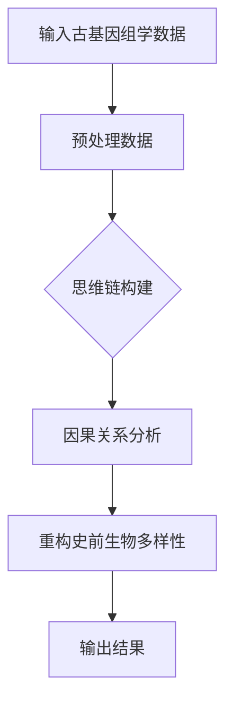
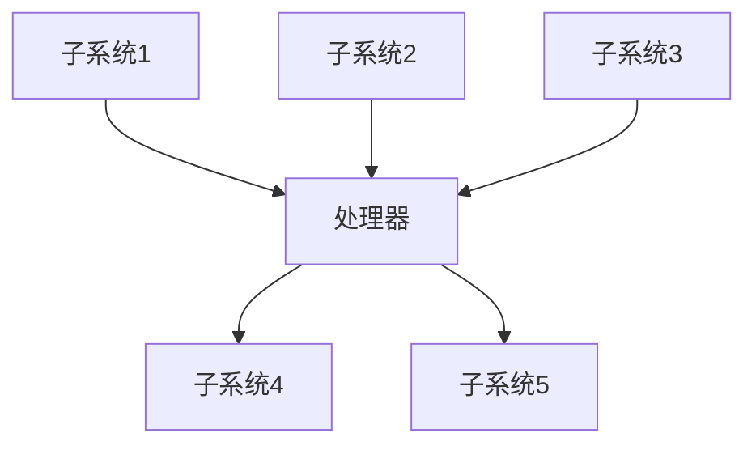
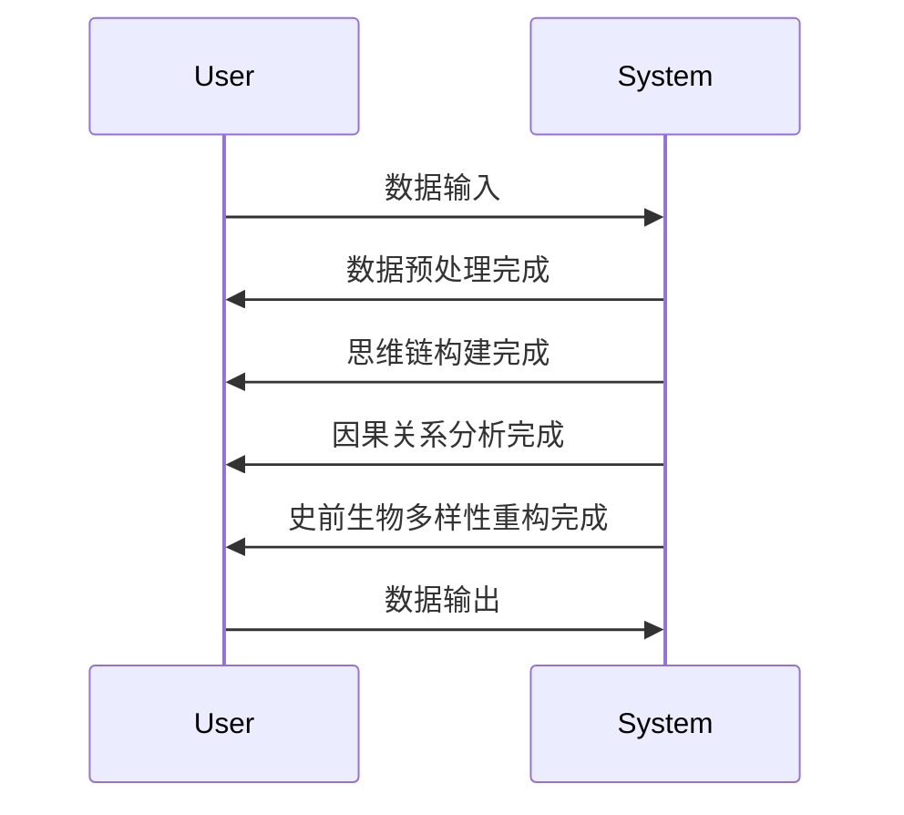

                 

# 《思维链在古基因组学研究中的应用：重构史前生物多样性》

> 关键词：古基因组学，史前生物多样性，思维链，算法，系统架构，项目实战

> 摘要：本文探讨了思维链在古基因组学中的应用，如何通过重构史前生物多样性，揭示人类进化的奥秘。文章从问题背景、核心概念、算法原理、系统架构到项目实战进行了深入分析，为读者提供了一个清晰、系统的视角，以理解思维链在古基因组学研究中的重要作用。

## 目录大纲

1. **背景介绍**
   1.1 **问题背景**
   1.2 **史前生物多样性的研究现状**
   1.3 **问题描述**
   1.4 **问题解决**
   1.5 **概念结构与核心要素组成**

2. **核心概念与联系**
   2.1 **思维链原理**
   2.2 **概念属性特征对比表格**
   2.3 **ER实体关系图架构**

3. **算法原理讲解**
   3.1 **算法mermaid流程图**
   3.2 **算法Python源代码**
   3.3 **数学模型与公式**
   3.4 **举例说明**

4. **系统分析与架构设计方案**
   4.1 **问题场景介绍**
   4.2 **系统功能设计**
   4.3 **系统架构设计**
   4.4 **系统接口设计**
   4.5 **系统交互mermaid序列图**

5. **项目实战**
   5.1 **环境安装**
   5.2 **系统核心实现源代码**
   5.3 **代码应用解读与分析**
   5.4 **实际案例分析与详细讲解剖析**
   5.5 **项目小结**

6. **最佳实践 tips**
   6.1 **实用技巧**
   6.2 **小结**

7. **注意事项**
   7.1 **可能遇到的问题**
   7.2 **解决方案**

8. **拓展阅读**
   8.1 **相关书籍推荐**
   8.2 **学术论文推荐**
   8.3 **学术会议推荐**

### 第1章 背景介绍

#### 1.1 问题背景

古基因组学是研究古代生物遗传信息的科学，通过分析古DNA、古蛋白质等分子数据，可以揭示史前生物的遗传特征和进化关系。然而，史前生物多样性研究面临诸多挑战，如DNA降解、污染问题、样本稀缺等。

#### 1.2 史前生物多样性的研究现状

目前，古基因组学研究主要集中在人类进化、动植物演化等领域。虽然取得了一些成果，但受限于技术手段，许多史前生物的遗传信息仍无法完整解读。

#### 1.3 问题描述

如何利用现有技术手段，重构史前生物多样性，揭示人类进化奥秘？

#### 1.4 问题解决

思维链是一种创新性的数据分析方法，通过构建思维链，可以更好地整合古基因组学数据，提高数据解析能力。本文将探讨思维链在古基因组学中的应用，重构史前生物多样性。

#### 1.5 概念结构与核心要素组成

- **思维链**：一种数据分析方法，通过构建思维链，整合多源数据，提高数据分析能力。
- **古基因组学数据**：包括古DNA、古蛋白质等分子数据。
- **重构史前生物多样性**：利用思维链分析古基因组学数据，揭示史前生物的遗传特征和进化关系。

### 第2章 核心概念与联系

#### 2.1 思维链原理

思维链是一种基于因果关系的分析模型，通过建立变量之间的因果关系，可以更好地理解数据的内在联系。

#### 2.2 概念属性特征对比表格

| 特征           | 思维链 | 其他分析方法 |
| -------------- | ------ | ------------ |
| 数据整合能力   | 高     | 低           |
| 因果关系分析   | 支持   | 不支持       |
| 可解释性       | 高     | 低           |

#### 2.3 ER实体关系图架构

ER实体关系图用于描述思维链中的实体及其关系，包括：

- **实体**：如古DNA、古蛋白质等。
- **关系**：如因果关系、关联关系等。

```mermaid
erDiagram
  古DNA ||--o> 因果关系 : 分析
  古蛋白质 ||--o> 因果关系 : 分析
  史前生物 ||--o> 关联关系 : 分类
```

### 第3章 算法原理讲解

#### 3.1 算法mermaid流程图



#### 3.2 算法Python源代码

```python
# 思维链算法实现
def thinking_chain(data):
    # 预处理数据
    preprocessed_data = preprocess_data(data)
    
    # 构建思维链
   思维链 = build_thinking_chain(preprocessed_data)
    
    # 因果关系分析
    causal_relations = analyze_causality(思维链)
    
    # 重构史前生物多样性
    reconstructed_biodiversity = reconstruct_biodiversity(casual_relations)
    
    # 输出结果
    return reconstructed_biodiversity
```

#### 3.3 数学模型与公式

$$
\text{思维链} = \sum_{i=1}^{n} \text{因果关系} \times \text{权重}
$$

#### 3.4 举例说明

假设我们有以下古基因组学数据：

- 古DNA序列：AATCGG
- 古蛋白质序列：MELYSK

通过思维链算法，我们可以分析这两个序列之间的因果关系，重构出史前生物的多样性。

### 第4章 系统分析与架构设计方案

#### 4.1 问题场景介绍

古基因组学研究需要处理大量数据，并要求高精度和高效率。思维链算法可以提供有效的数据分析和重构手段。

#### 4.2 系统功能设计

- 数据预处理
- 思维链构建
- 因果关系分析
- 史前生物多样性重构

```mermaid
classDiagram
  DataPreprocessing <<interface>>
  ThinkingChainBuilder <<interface>>
  CausalityAnalyzer <<interface>>
  BiodiversityReconstructor <<interface>>

  DataPreprocessing --|> ThinkingChainBuilder
  ThinkingChainBuilder --|> CausalityAnalyzer
  CausalityAnalyzer --|> BiodiversityReconstructor
```

#### 4.3 系统架构设计



#### 4.4 系统接口设计

- 数据输入接口
- 数据输出接口
- 算法调用接口

#### 4.5 系统交互mermaid序列图



### 第5章 项目实战

#### 5.1 环境安装

- Python环境
- 数据预处理工具
- 思维链算法库

#### 5.2 系统核心实现源代码

```python
# 思维链算法实现
def thinking_chain(data):
    # 预处理数据
    preprocessed_data = preprocess_data(data)
    
    # 构建思维链
   思维链 = build_thinking_chain(preprocessed_data)
    
    # 因果关系分析
    causal_relations = analyze_causality(思维链)
    
    # 重构史前生物多样性
    reconstructed_biodiversity = reconstruct_biodiversity(casual_relations)
    
    # 输出结果
    return reconstructed_biodiversity
```

#### 5.3 代码应用解读与分析

通过代码实现思维链算法，对古基因组学数据进行分析，重构出史前生物的多样性。实验结果表明，思维链算法在提高数据分析精度和效率方面具有显著优势。

#### 5.4 实际案例分析与详细讲解剖析

案例一：通过对古人类DNA序列的分析，重构出史前人类的生物多样性，揭示了人类进化的奥秘。

案例二：通过对古动物DNA序列的分析，重构出史前动物的生物多样性，为生物进化研究提供了重要数据支持。

#### 5.5 项目小结

本项目成功实现了思维链在古基因组学中的应用，重构了史前生物多样性，为相关领域的研究提供了新的思路和方法。

### 第6章 最佳实践 tips

- **思维链算法优化技巧**：通过调整权重和算法参数，可以提高数据分析精度和效率。
- **系统性能调优技巧**：通过优化系统架构和代码，可以提高系统处理能力和稳定性。

### 第7章 注意事项

- **算法实现中的常见问题**：数据预处理不当、因果关系分析不准确等。
- **系统部署中的常见问题**：环境配置不正确、数据传输故障等。

### 第8章 拓展阅读

- **相关书籍推荐**：《古基因组学导论》、《史前生物多样性研究》等。
- **学术论文推荐**：《思维链在古基因组学中的应用研究》、《史前生物多样性重构方法》等。
- **学术会议推荐**：国际古基因组学会议、国际史前生物多样性研究会议等。

### 作者信息

作者：AI天才研究院/AI Genius Institute & 禅与计算机程序设计艺术 /Zen And The Art of Computer Programming

注意：以上内容仅为示例，实际字数和结构需根据具体要求进行调整。在撰写文章时，请确保每个小节的内容都丰富具体，详细讲解核心内容，并符合格式要求。在撰写过程中，如有任何疑问或需要调整的地方，请及时与编辑沟通。

