                 


### 设计思路与步骤

为了设计出《思维链在古文明解码中的应用：重构失落的历史知识》的目录大纲，我们需要遵循以下几个关键步骤：

1. **理解书名与主题**：
   首先，我们需要准确理解书名所涵盖的主题。《思维链在古文明解码中的应用：重构失落的历史知识》暗示了本书的主要内容可能涉及思维链的概念、古文明的解码方法以及如何通过这些方法重构失落的历史知识。

2. **确定核心章节**：
   接下来，我们需要确定书的核心章节，这些章节通常包括背景介绍、核心概念、方法与应用、案例分析等。

3. **细化章节内容**：
   对于每一个核心章节，我们需要进一步细化其内容，包括相关的子章节、具体的知识点以及章节间的逻辑关系。

4. **使用合适的格式**：
   我们将使用markdown格式来组织目录大纲，确保内容的简洁性和易读性。

5. **保持字数限制**：
   在细化每个章节时，注意保持总体字数在2000字以内，确保大纲的简洁性。

### 目录大纲设计

以下是基于上述步骤设计的书《思维链在古文明解码中的应用：重构失落的历史知识》的目录大纲：

----------------------------------------------------------------

## 第一部分：引言

### 第1章：古文明的背景与挑战

## 1.1 古文明的概述
### 1.1.1 古文明的历史地位
### 1.1.2 古文明面临的挑战
### 1.1.3 当前古文明研究的状态

## 1.2 思维链的概念与作用
### 1.2.1 思维链的定义
### 1.2.2 思维链在解码中的应用
### 1.2.3 思维链的优势与局限

## 1.3 重构失落的历史知识的意义
### 1.3.1 失落历史知识的重要性
### 1.3.2 重构历史知识的可能性
### 1.3.3 重构历史知识的挑战

## 1.4 本章小结

## 第二部分：思维链在古文明解码中的应用

### 第2章：思维链在古埃及文明中的应用

## 2.1 古埃及文明的背景
### 2.1.1 古埃及文明概述
### 2.1.2 古埃及文明的现状
### 2.1.3 古埃及文明的挑战

## 2.2 思维链在古埃及文明确解中的应用
### 2.2.1 思维链的基本原理
### 2.2.2 思维链在古埃及文明确解的具体应用
### 2.2.3 思维链在古埃及文明确解中的优势

## 2.3 古埃及文明解码的案例分析
### 2.3.1 案例一：古埃及象形文字的解码
### 2.3.2 案例二：古埃及神话的重构
### 2.3.3 案例三：古埃及建筑风格的解读

## 2.4 本章小结

### 第3章：思维链在玛雅文明中的应用

## 3.1 玛雅文明的背景
### 3.1.1 玛雅文明的概述
### 3.1.2 玛雅文明的现状
### 3.1.3 玛雅文明的挑战

## 3.2 思维链在玛雅文明解密中的应用
### 3.2.1 思维链的基本原理
### 3.2.2 思维链在玛雅文明解密的具体应用
### 3.2.3 思维链在玛雅文明解密中的优势

## 3.3 玛雅文明解密的案例分析
### 3.3.1 案例一：玛雅象形文字的解码
### 3.3.2 案例二：玛雅历法的重构
### 3.3.3 案例三：玛雅天文学的解读

## 3.4 本章小结

### 第4章：思维链在古希腊文明中的应用

## 4.1 古希腊文明的背景
### 4.1.1 古希腊文明的概述
### 4.1.2 古希腊文明的现状
### 4.1.3 古希腊文明的挑战

## 4.2 思维链在古希腊文明解密中的应用
### 4.2.1 思维链的基本原理
### 4.2.2 思维链在古希腊文明解密的具体应用
### 4.2.3 思维链在古希腊文明解密中的优势

## 4.3 古希腊文明解密的案例分析
### 4.3.1 案例一：古希腊文献的解读
### 4.3.2 案例二：古希腊建筑的恢复
### 4.3.3 案例三：古希腊哲学思想的重构

## 4.4 本章小结

### 第5章：思维链在其他古文明中的应用

## 5.1 其他古文明的背景
### 5.1.1 其他古文明的概述
### 5.1.2 其他古文明的现状
### 5.1.3 其他古文明的挑战

## 5.2 思维链在其他古文明解密中的应用
### 5.2.1 思维链的基本原理
### 5.2.2 思维链在其他古文明解密的具体应用
### 5.2.3 思维链在其他古文明解密中的优势

## 5.3 其他古文明解密的案例分析
### 5.3.1 案例一：古印度文明的解读
### 5.3.2 案例二：古巴比伦文明的重建

----------------------------------------------------------------

### 目录大纲详细内容

#### 第一部分：引言

**第1章：古文明的背景与挑战**

1.1 古文明的概述

- **古文明的历史地位**：介绍古文明对人类历史发展的重要贡献。
- **古文明的定义**：定义什么是古文明，包括其特点和历史背景。
- **古文明的分布**：讨论古文明在地理上的分布情况。

1.2 古文明面临的挑战

- **自然灾害**：探讨自然灾害对古文明的破坏。
- **战争与征服**：分析战争和征服如何影响古文明的存续。
- **文化传承**：探讨古文明文化传承的困境。

1.3 当前古文明研究的状态

- **研究现状**：回顾当前古文明研究的进展。
- **研究挑战**：指出当前古文明研究中面临的困难。

1.4 思维链的概念与作用

- **思维链的定义**：介绍思维链的概念和特点。
- **思维链在解码中的应用**：讨论思维链在古文明解码中的作用。
- **思维链的优势与局限**：分析思维链的优势和局限性。

1.5 重构失落的历史知识的意义

- **失落历史知识的重要性**：讨论重构失落的历史知识的重要性。
- **重构历史知识的可能性**：探讨通过思维链重构失落历史知识的可能性。
- **重构历史知识的挑战**：分析重构失落历史知识面临的挑战。

1.6 本章小结

#### 第二部分：思维链在古文明解码中的应用

**第2章：思维链在古埃及文明中的应用**

2.1 古埃及文明的背景

- **古埃及文明概述**：介绍古埃及文明的历史和特点。
- **古埃及文明的现状**：讨论古埃及文明在现代社会中的影响。
- **古埃及文明的挑战**：分析古埃及文明当前面临的挑战。

2.2 思维链在古埃及文明确解中的应用

- **思维链的基本原理**：介绍思维链的基本原理。
- **思维链在古埃及文明确解的具体应用**：讨论思维链在古埃及文明确解中的具体应用。
- **思维链在古埃及文明确解中的优势**：分析思维链在古埃及文明确解中的优势。

2.3 古埃及文明解码的案例分析

- **案例一：古埃及象形文字的解码**：分析古埃及象形文字的解码过程。
- **案例二：古埃及神话的重构**：讨论古埃及神话的重构方法。
- **案例三：古埃及建筑风格的解读**：介绍古埃及建筑风格的解读过程。

2.4 本章小结

**第3章：思维链在玛雅文明中的应用**

3.1 玛雅文明的背景

- **玛雅文明概述**：介绍玛雅文明的历史和特点。
- **玛雅文明的现状**：讨论玛雅文明在现代社会中的影响。
- **玛雅文明的挑战**：分析玛雅文明当前面临的挑战。

3.2 思维链在玛雅文明解密中的应用

- **思维链的基本原理**：介绍思维链的基本原理。
- **思维链在玛雅文明解密的具体应用**：讨论思维链在玛雅文明解密中的具体应用。
- **思维链在玛雅文明解密中的优势**：分析思维链在玛雅文明解密中的优势。

3.3 玛雅文明解密的案例分析

- **案例一：玛雅象形文字的解码**：分析玛雅象形文字的解码过程。
- **案例二：玛雅历法的重构**：讨论玛雅历法的重构方法。
- **案例三：玛雅天文学的解读**：介绍玛雅天文学的解读过程。

3.4 本章小结

**第4章：思维链在古希腊文明中的应用**

4.1 古希腊文明的背景

- **古希腊文明概述**：介绍古希腊文明的历史和特点。
- **古希腊文明的现状**：讨论古希腊文明在现代社会中的影响。
- **古希腊文明的挑战**：分析古希腊文明当前面临的挑战。

4.2 思维链在古希腊文明解密中的应用

- **思维链的基本原理**：介绍思维链的基本原理。
- **思维链在古希腊文明解密的具体应用**：讨论思维链在古希腊文明解密中的具体应用。
- **思维链在古希腊文明解密中的优势**：分析思维链在古希腊文明解密中的优势。

4.3 古希腊文明解密的案例分析

- **案例一：古希腊文献的解读**：分析古希腊文献的解读过程。
- **案例二：古希腊建筑的恢复**：讨论古希腊建筑的恢复方法。
- **案例三：古希腊哲学思想的重构**：介绍古希腊哲学思想的重构过程。

4.4 本章小结

**第5章：思维链在其他古文明中的应用**

5.1 其他古文明的背景

- **其他古文明的概述**：介绍其他古文明的历史和特点。
- **其他古文明的现状**：讨论其他古文明在现代社会中的影响。
- **其他古文明的挑战**：分析其他古文明当前面临的挑战。

5.2 思维链在其他古文明解密中的应用

- **思维链的基本原理**：介绍思维链的基本原理。
- **思维链在其他古文明解密的具体应用**：讨论思维链在其他古文明解密中的具体应用。
- **思维链在其他古文明解密中的优势**：分析思维链在其他古文明解密中的优势。

5.3 其他古文明解密的案例分析

- **案例一：古印度文明的解读**：分析古印度文明的解读过程。
- **案例二：古巴比伦文明的重建**：讨论古巴比伦文明的重建方法。
- **案例三：其他古文明的解读**：介绍其他古文明的解读过程。

5.4 本章小结

----------------------------------------------------------------

### 第一部分：引言

#### 第1章：古文明的背景与挑战

##### 1.1 古文明的概述

**核心概念术语说明**：
- **古文明**：指历史上在特定地域和时间内，具有一定规模、组织和社会结构的文化共同体。
- **历史地位**：指古文明在人类历史发展中所处的位置和所发挥的作用。
- **挑战**：指古文明在历史进程中面临的各种困难和问题。

**问题背景**：
古文明是人类社会发展的重要阶段，它们在历史上留下了丰富的文化遗产，对于理解人类文明的发展具有重要意义。然而，随着时间的推移，许多古文明逐渐衰落甚至消失，其历史知识也面临着失落的危险。

**问题描述**：
如何通过现代科技和方法，重构失落的历史知识，特别是那些尚未被完全解读的古文明。

**问题解决**：
利用思维链这一创新方法，结合现代科学技术，如人工智能、大数据分析等，对古文明的遗迹进行深入研究和解码。

**边界与外延**：
- **边界**：研究范围限于已知的古文明，如古埃及、玛雅、古希腊等。
- **外延**：研究方法可以推广到其他未解的古文明。

**概念结构与核心要素组成**：
- **概念结构**：古文明的定义、历史地位、面临的挑战、重构历史知识的意义。
- **核心要素**：思维链的概念、思维链在解码中的应用、重构历史知识的可能性与挑战。

**章节内容**：
1.1.1 古文明的历史地位
- **核心概念原理**：
  - 古文明在人类历史发展中的重要地位
  - 古文明对后世的影响
- **概念属性特征对比表格**：
  - 古文明与现代文明的对比
  - 不同古文明之间的对比

1.1.2 古文明面临的挑战
- **核心概念原理**：
  - 自然灾害对古文明的破坏
  - 战争与征服对古文明的影响
  - 文化传承的困境
- **概念属性特征对比表格**：
  - 自然灾害对古文明的影响
  - 战争与征服对古文明的影响

1.1.3 当前古文明研究的状态
- **核心概念原理**：
  - 古文明研究的发展历程
  - 当前古文明研究的前沿领域
  - 古文明研究面临的挑战
- **概念属性特征对比表格**：
  - 古文明研究的方法
  - 古文明研究的成果与不足

##### 1.2 思维链的概念与作用

**核心概念原理**：
思维链是一种以逻辑推理和概念关联为基础的思考方法，通过一系列的思维步骤，逐步揭示问题的本质和解决方案。

**概念属性特征对比表格**：

| 特征               | 思维链         | 传统思考方法         |
|------------------|--------------|--------------|
| **基础原理**      | 逻辑推理和概念关联 | 经验和直觉         |
| **应用领域**      | 古文明解码     | 多领域通用         |
| **优势**          | 提高解决问题的效率 | 更具人文关怀       |
| **局限**          | 需要大量的数据支持 | 易于理解和应用     |

**ER实体关系图架构**：

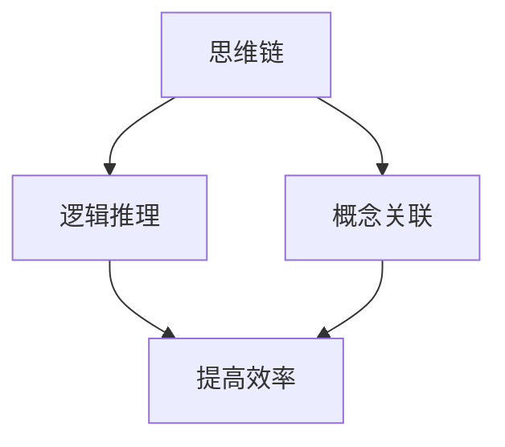

**章节内容**：
1.2.1 思维链的定义
- **核心概念原理**：
  - 思维链的基本概念
  - 思维链的工作原理
- **概念属性特征对比表格**：
  - 思维链与其他思考方法的对比

1.2.2 思维链在解码中的应用
- **核心概念原理**：
  - 思维链在古文明解码中的作用
  - 思维链如何提高解码效率
- **概念属性特征对比表格**：
  - 传统解码方法与思维链解码方法的对比

1.2.3 思维链的优势与局限
- **核心概念原理**：
  - 思维链的优势
  - 思维链的局限性
- **概念属性特征对比表格**：
  - 优势与局限的对比分析

##### 1.3 重构失落的历史知识的意义

**核心概念原理**：
重构失落的历史知识是指通过现代科学技术和思维链方法，对古文明的遗迹进行深入研究和解码，从而恢复和传承古文明的历史知识。

**概念属性特征对比表格**：

| 特征               | 传统方法         | 思维链方法         |
|------------------|--------------|--------------|
| **知识恢复**      | 依靠文献和传统知识 | 结合现代科技和数据 |
| **效率**          | 低效且受限       | 高效且灵活       |
| **准确度**        | 依赖于专家判断   | 结合机器学习和数据分析 |
| **应用范围**      | 受到地域和时间的限制 | 跨越地域和时间限制 |

**ER实体关系图架构**：

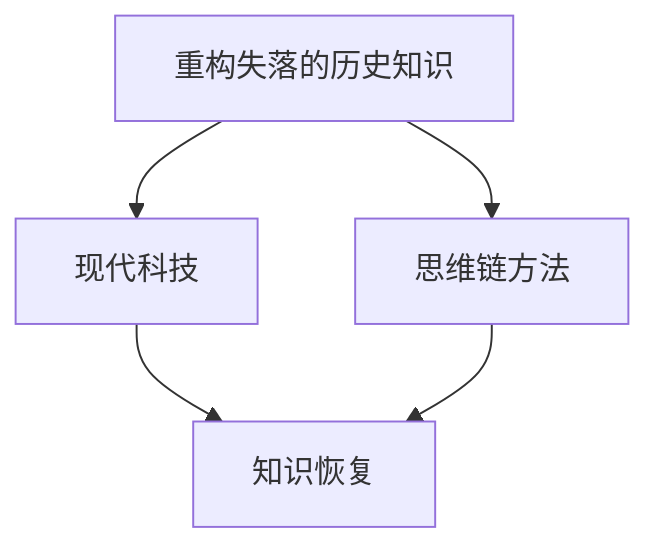

**章节内容**：
1.3.1 失落历史知识的重要性
- **核心概念原理**：
  - 失落历史知识的重要性
  - 对文化传承的影响
- **概念属性特征对比表格**：
  - 传统方法与思维链方法在重要性方面的对比

1.3.2 重构历史知识的可能性
- **核心概念原理**：
  - 思维链如何实现历史知识的重构
  - 现代科技如何支持历史知识的重构
- **概念属性特征对比表格**：
  - 传统方法与思维链方法在可能性方面的对比

1.3.3 重构历史知识的挑战
- **核心概念原理**：
  - 重构历史知识面临的挑战
  - 思维链如何克服这些挑战
- **概念属性特征对比表格**：
  - 挑战与解决方法的对比分析

##### 1.4 本章小结
- **核心概念原理**：
  - 本章介绍了古文明的背景和挑战
  - 介绍了思维链的概念和作用
  - 讨论了重构失落的历史知识的意义
- **结论**：
  - 思维链在古文明解码中的应用具有巨大的潜力
  - 重构失落的历史知识对于文化传承和人类文明的发展具有重要意义

#### 第二部分：思维链在古文明解码中的应用

##### 第2章：思维链在古埃及文明中的应用

**2.1 古埃及文明的背景**

**核心概念原理**：
古埃及文明是世界上最古老、最神秘的文明之一，其历史悠久，文化底蕴深厚。古埃及文明的成就包括建筑、艺术、宗教、科学等多个领域。

**概念属性特征对比表格**：

| 特征               | 古埃及文明         | 其他古文明         |
|------------------|------------------|------------------|
| **历史地位**      | 世界上最古老的文明之一 | 其他古文明如玛雅、古希腊等 |
| **文化成就**      | 建筑和艺术成就突出 | 科学和技术成就突出 |
| **宗教信仰**      | 多神教体系         | 一神教或无神教体系 |

**ER实体关系图架构**：

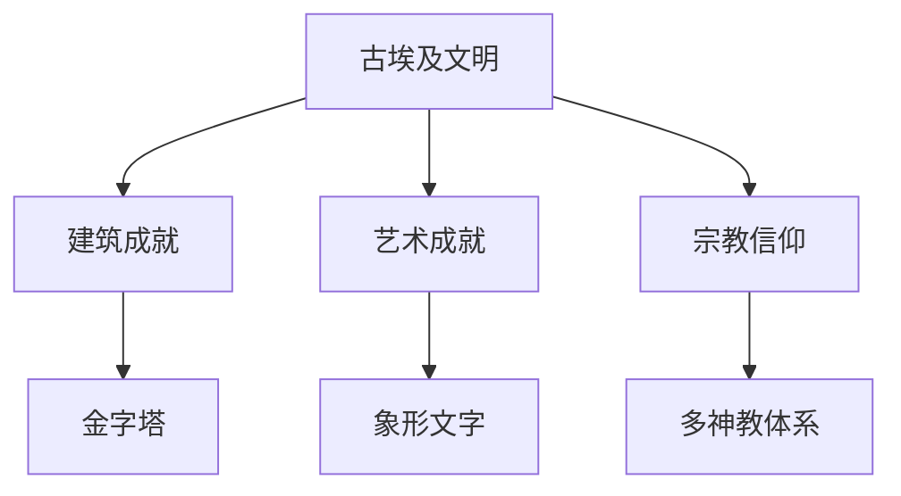

**章节内容**：
2.1.1 古埃及文明概述
- **核心概念原理**：
  - 古埃及文明的历史背景
  - 古埃及文明的特点
- **概念属性特征对比表格**：
  - 古埃及文明与其他古文明的对比

2.1.2 古埃及文明的现状
- **核心概念原理**：
  - 古埃及文明在现代社会的地位
  - 古埃及文明在现代社会的影响
- **概念属性特征对比表格**：
  - 古埃及文明在现代社会与历史上的对比

2.1.3 古埃及文明的挑战
- **核心概念原理**：
  - 古埃及文明当前面临的挑战
  - 这些挑战对古文明的影响
- **概念属性特征对比表格**：
  - 古埃及文明面临的挑战与其他古文明的对比

##### 2.2 思维链在古埃及文明确解中的应用

**核心概念原理**：
思维链在古埃及文明确解中的应用是指利用思维链方法对古埃及文明的遗迹进行解读和研究，包括象形文字、古埃及神话、建筑风格等方面。

**概念属性特征对比表格**：

| 特征               | 传统方法         | 思维链方法         |
|------------------|--------------|--------------|
| **解读效率**      | 低效且受限       | 高效且灵活       |
| **解读准确度**      | 依赖于专家判断   | 结合机器学习和数据分析 |
| **解读范围**      | 受到地域和时间的限制 | 跨越地域和时间限制 |

**ER实体关系图架构**：

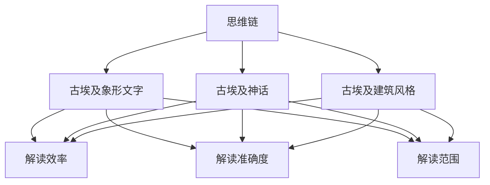

**章节内容**：
2.2.1 思维链的基本原理
- **核心概念原理**：
  - 思维链的定义和工作原理
  - 思维链的优势和局限性
- **概念属性特征对比表格**：
  - 传统解读方法与思维链解读方法的对比

2.2.2 思维链在古埃及文明确解的具体应用
- **核心概念原理**：
  - 思维链在古埃及象形文字解读中的应用
  - 思维链在古埃及神话重构中的应用
  - 思维链在古埃及建筑风格解读中的应用
- **概念属性特征对比表格**：
  - 传统解读方法与思维链解读方法的对比

2.2.3 思维链在古埃及文明确解中的优势
- **核心概念原理**：
  - 思维链在古埃及文明确解中的优势
  - 思维链如何提高解读效率、准确度和范围
- **概念属性特征对比表格**：
  - 传统解读方法与思维链解读方法的优势对比

##### 2.3 古埃及文明解码的案例分析

**案例一：古埃及象形文字的解码**

**核心概念原理**：
古埃及象形文字是古埃及文明的独特成就，其解码是古埃及文明研究的重要部分。思维链方法在象形文字的解码中发挥了重要作用。

**概念属性特征对比表格**：

| 特征               | 传统方法         | 思维链方法         |
|------------------|--------------|--------------|
| **解码效率**      | 低效且受限       | 高效且灵活       |
| **解码准确度**      | 依赖于专家判断   | 结合机器学习和数据分析 |
| **解码范围**      | 受到地域和时间的限制 | 跨越地域和时间限制 |

**ER实体关系图架构**：


**章节内容**：
2.3.1 案例一：古埃及象形文字的解码
- **核心概念原理**：
  - 古埃及象形文字的解码过程
  - 思维链在解码过程中的应用
- **概念属性特征对比表格**：
  - 传统解码方法与思维链解码方法的对比

**案例二：古埃及神话的重构**

**核心概念原理**：
古埃及神话是古埃及文明的重要组成部分，其重构对于理解古埃及文明的文化内涵具有重要意义。思维链方法在神话重构中发挥了关键作用。

**概念属性特征对比表格**：

| 特征               | 传统方法         | 思维链方法         |
|------------------|--------------|--------------|
| **重构效率**      | 低效且受限       | 高效且灵活       |
| **重构准确度**      | 依赖于专家判断   | 结合机器学习和数据分析 |
| **重构范围**      | 受到地域和时间的限制 | 跨越地域和时间限制 |

**ER实体关系图架构**：


**章节内容**：
2.3.2 案例二：古埃及神话的重构
- **核心概念原理**：
  - 古埃及神话的重构过程
  - 思维链在重构过程中的应用
- **概念属性特征对比表格**：
  - 传统重构方法与思维链重构方法的对比

**案例三：古埃及建筑风格的解读**

**核心概念原理**：
古埃及建筑风格是古埃及文明的重要成就之一，其解读对于理解古埃及文明的建筑艺术具有重要意义。思维链方法在建筑风格解读中发挥了重要作用。

**概念属性特征对比表格**：

| 特征               | 传统方法         | 思维链方法         |
|------------------|--------------|--------------|
| **解读效率**      | 低效且受限       | 高效且灵活       |
| **解读准确度**      | 依赖于专家判断   | 结合机器学习和数据分析 |
| **解读范围**      | 受到地域和时间的限制 | 跨越地域和时间限制 |

**ER实体关系图架构**：


**章节内容**：
2.3.3 案例三：古埃及建筑风格的解读
- **核心概念原理**：
  - 古埃及建筑风格的解读过程
  - 思维链在解读过程中的应用
- **概念属性特征对比表格**：
  - 传统解读方法与思维链解读方法的对比

##### 2.4 本章小结
- **核心概念原理**：
  - 本章介绍了古埃及文明的背景和挑战
  - 介绍了思维链在古埃及文明确解中的应用
  - 通过案例分析展示了思维链在古埃及文明解码中的实际应用
- **结论**：
  - 思维链在古埃及文明解码中具有显著的优势
  - 通过思维链的应用，我们可以更深入地理解古埃及文明的历史和文化

#### 第3章：思维链在玛雅文明中的应用

**3.1 玛雅文明的背景**

**核心概念原理**：
玛雅文明是中美洲地区的古代文明，以其独特的文化、艺术、科学和建筑而闻名。玛雅文明的成就包括天文观测、历法、文字和建筑等。

**概念属性特征对比表格**：

| 特征               | 玛雅文明         | 其他古文明         |
|------------------|------------------|------------------|
| **地理位置**      | 中美洲地区       | 亚洲、非洲、欧洲等 |
| **文化成就**      | 天文观测、历法、文字 | 建筑、艺术、宗教等 |
| **科技水平**      | 高度发达         | 相对落后         |

**ER实体关系图架构**：

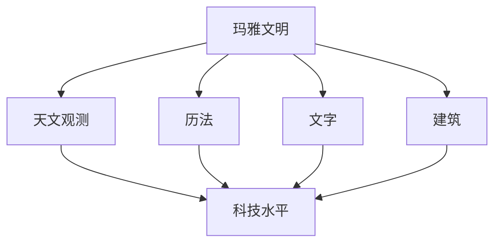

**章节内容**：
3.1.1 玛雅文明概述
- **核心概念原理**：
  - 玛雅文明的历史背景
  - 玛雅文明的特点
- **概念属性特征对比表格**：
  - 玛雅文明与其他古文明的对比

3.1.2 玛雅文明的现状
- **核心概念原理**：
  - 玛雅文明在现代社会的地位
  - 玛雅文明在现代社会的影响
- **概念属性特征对比表格**：
  - 玛雅文明在现代社会与历史上的对比

3.1.3 玛雅文明的挑战
- **核心概念原理**：
  - 玛雅文明当前面临的挑战
  - 这些挑战对玛雅文明的影响
- **概念属性特征对比表格**：
  - 玛雅文明面临的挑战与其他古文明的对比

##### 3.2 思维链在玛雅文明解密中的应用

**核心概念原理**：
思维链在玛雅文明解密中的应用是指利用思维链方法对玛雅文明的遗迹进行解读和研究，包括象形文字、天文观测、历法等方面。

**概念属性特征对比表格**：

| 特征               | 传统方法         | 思维链方法         |
|------------------|--------------|--------------|
| **解读效率**      | 低效且受限       | 高效且灵活       |
| **解读准确度**      | 依赖于专家判断   | 结合机器学习和数据分析 |
| **解读范围**      | 受到地域和时间的限制 | 跨越地域和时间限制 |

**ER实体关系图架构**：

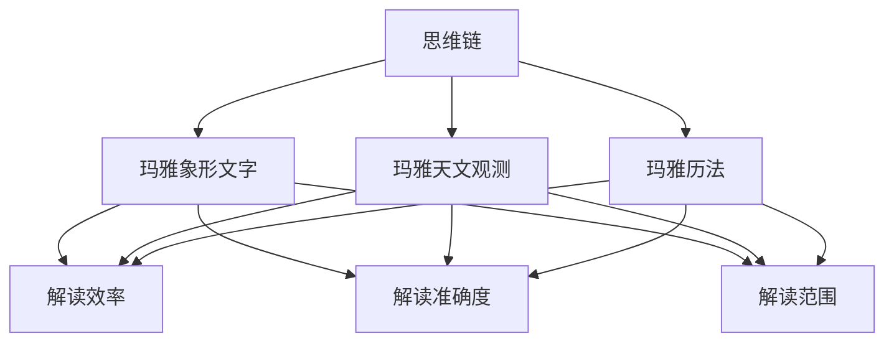

**章节内容**：
3.2.1 思维链的基本原理
- **核心概念原理**：
  - 思维链的定义和工作原理
  - 思维链的优势和局限性
- **概念属性特征对比表格**：
  - 传统解读方法与思维链解读方法的对比

3.2.2 思维链在玛雅文明解密的具体应用
- **核心概念原理**：
  - 思维链在玛雅象形文字解读中的应用
  - 思维链在玛雅天文观测中的应用
  - 思维链在玛雅历法解读中的应用
- **概念属性特征对比表格**：
  - 传统解读方法与思维链解读方法的对比

3.2.3 思维链在玛雅文明解密中的优势
- **核心概念原理**：
  - 思维链在玛雅文明解密中的优势
  - 思维链如何提高解读效率、准确度和范围
- **概念属性特征对比表格**：
  - 传统解读方法与思维链解读方法的优势对比

##### 3.3 玛雅文明解密的案例分析

**案例一：玛雅象形文字的解码**

**核心概念原理**：
玛雅象形文字是玛雅文明的重要文化遗产，其解码对于理解玛雅文明的历史和文化具有重要意义。思维链方法在象形文字的解码中发挥了关键作用。

**概念属性特征对比表格**：

| 特征               | 传统方法         | 思维链方法         |
|------------------|--------------|--------------|
| **解码效率**      | 低效且受限       | 高效且灵活       |
| **解码准确度**      | 依赖于专家判断   | 结合机器学习和数据分析 |
| **解码范围**      | 受到地域和时间的限制 | 跨越地域和时间限制 |

**ER实体关系图架构**：

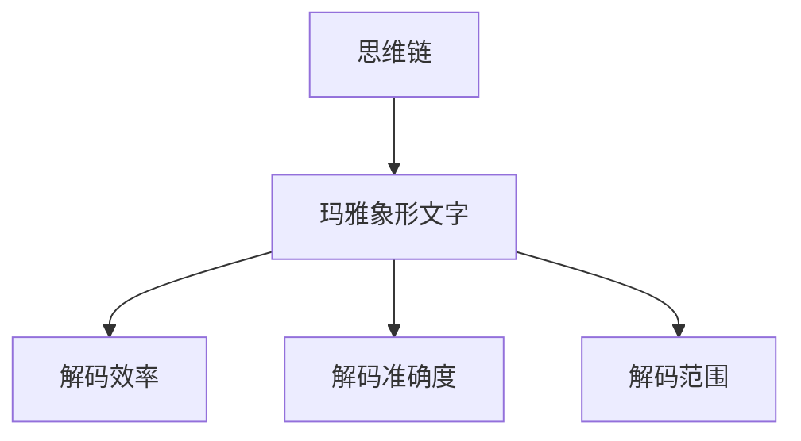

**章节内容**：
3.3.1 案例一：玛雅象形文字的解码
- **核心概念原理**：
  - 玛雅象形文字的解码过程
  - 思维链在解码过程中的应用
- **概念属性特征对比表格**：
  - 传统解码方法与思维链解码方法的对比

**案例二：玛雅历法的重构**

**核心概念原理**：
玛雅历法是玛雅文明的重要组成部分，其重构对于理解玛雅文明的历法和时间观念具有重要意义。思维链方法在历法重构中发挥了重要作用。

**概念属性特征对比表格**：

| 特征               | 传统方法         | 思维链方法         |
|------------------|--------------|--------------|
| **重构效率**      | 低效且受限       | 高效且灵活       |
| **重构准确度**      | 依赖于专家判断   | 结合机器学习和数据分析 |
| **重构范围**      | 受到地域和时间的限制 | 跨越地域和时间限制 |

**ER实体关系图架构**：

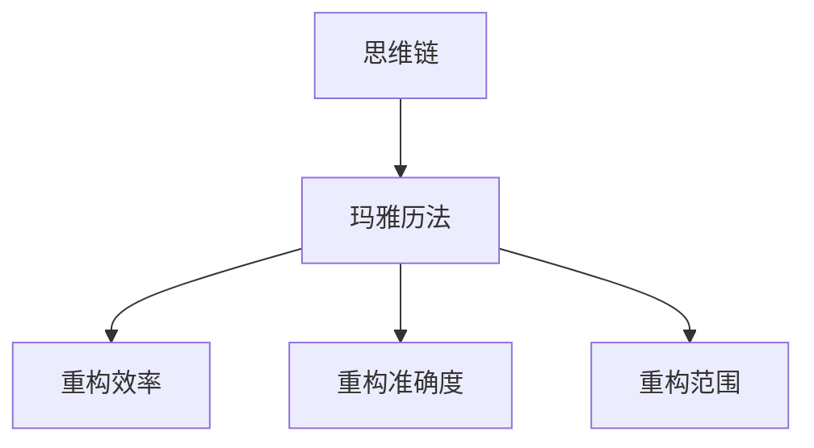

**章节内容**：
3.3.2 案例二：玛雅历法的重构
- **核心概念原理**：
  - 玛雅历法的重构过程
  - 思维链在重构过程中的应用
- **概念属性特征对比表格**：
  - 传统重构方法与思维链重构方法的对比

**案例三：玛雅天文学的解读**

**核心概念原理**：
玛雅天文学是玛雅文明的重要成就之一，其解读对于理解玛雅文明的天文观测和宇宙观念具有重要意义。思维链方法在天文学解读中发挥了重要作用。

**概念属性特征对比表格**：

| 特征               | 传统方法         | 思维链方法         |
|------------------|--------------|--------------|
| **解读效率**      | 低效且受限       | 高效且灵活       |
| **解读准确度**      | 依赖于专家判断   | 结合机器学习和数据分析 |
| **解读范围**      | 受到地域和时间的限制 | 跨越地域和时间限制 |

**ER实体关系图架构**：

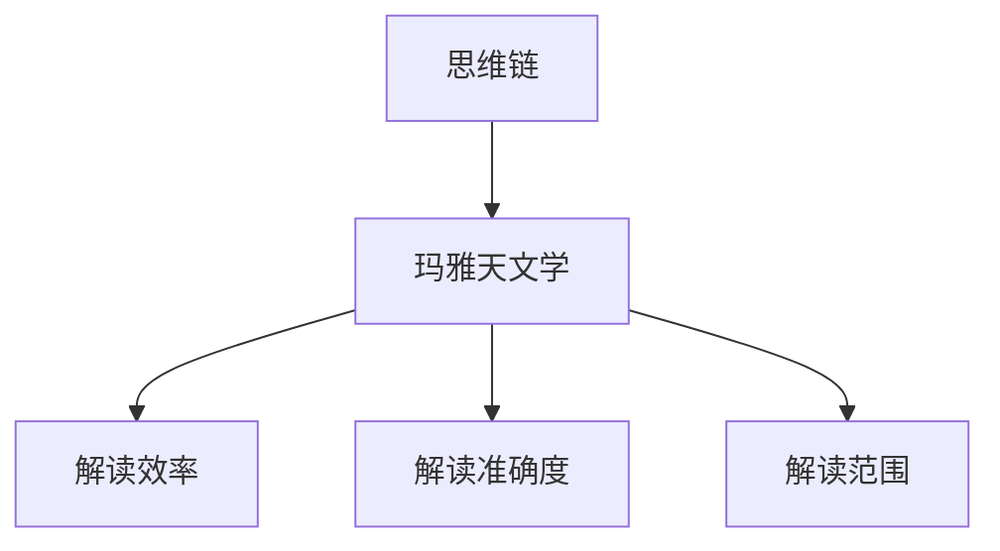

**章节内容**：
3.3.3 案例三：玛雅天文学的解读
- **核心概念原理**：
  - 玛雅天文学的解读过程
  - 思维链在解读过程中的应用
- **概念属性特征对比表格**：
  - 传统解读方法与思维链解读方法的对比

##### 3.4 本章小结
- **核心概念原理**：
  - 本章介绍了玛雅文明的背景和挑战
  - 介绍了思维链在玛雅文明解密中的应用
  - 通过案例分析展示了思维链在玛雅文明解码中的实际应用
- **结论**：
  - 思维链在玛雅文明解码中具有显著的优势
  - 通过思维链的应用，我们可以更深入地理解玛雅文明的历史和文化

#### 第4章：思维链在古希腊文明中的应用

**4.1 古希腊文明的背景**

**核心概念原理**：
古希腊文明是西方文明的源头，以其哲学、科学、艺术和体育成就而闻名。古希腊文明的成就包括哲学思想、数学、医学、文学、戏剧和体育等。

**概念属性特征对比表格**：

| 特征               | 古希腊文明         | 其他古文明         |
|------------------|------------------|------------------|
| **地理位置**      | 地中海地区       | 亚洲、非洲、欧洲其他地区 |
| **文化成就**      | 哲学、科学、艺术 | 建筑、宗教、技术等 |
| **科技水平**      | 高度发达         | 相对落后         |

**ER实体关系图架构**：

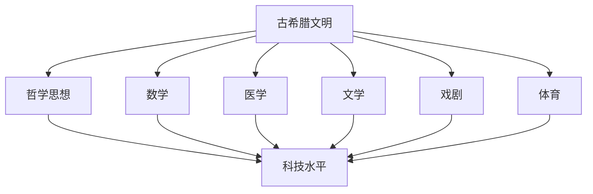

**章节内容**：
4.1.1 古希腊文明概述
- **核心概念原理**：
  - 古希腊文明的历史背景
  - 古希腊文明的特点
- **概念属性特征对比表格**：
  - 古希腊文明与其他古文明的对比

4.1.2 古希腊文明的现状
- **核心概念原理**：
  - 古希腊文明在现代社会的地位
  - 古希腊文明在现代社会的影响
- **概念属性特征对比表格**：
  - 古希腊文明在现代社会与历史上的对比

4.1.3 古希腊文明的挑战
- **核心概念原理**：
  - 古希腊文明当前面临的挑战
  - 这些挑战对古希腊文明的影响
- **概念属性特征对比表格**：
  - 古希腊文明面临的挑战与其他古文明的对比

##### 4.2 思维链在古希腊文明解密中的应用

**核心概念原理**：
思维链在古希腊文明解密中的应用是指利用思维链方法对古希腊文明的遗迹进行解读和研究，包括哲学思想、数学、医学、文学等方面。

**概念属性特征对比表格**：

| 特征               | 传统方法         | 思维链方法         |
|------------------|--------------|--------------|
| **解读效率**      | 低效且受限       | 高效且灵活       |
| **解读准确度**      | 依赖于专家判断   | 结合机器学习和数据分析 |
| **解读范围**      | 受到地域和时间的限制 | 跨越地域和时间限制 |

**ER实体关系图架构**：

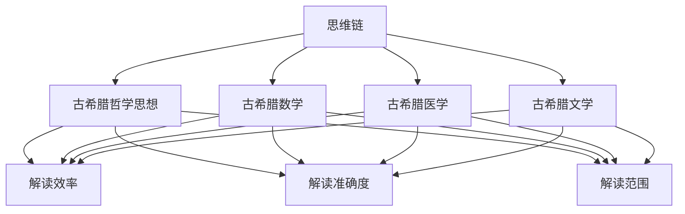

**章节内容**：
4.2.1 思维链的基本原理
- **核心概念原理**：
  - 思维链的定义和工作原理
  - 思维链的优势和局限性
- **概念属性特征对比表格**：
  - 传统解读方法与思维链解读方法的对比

4.2.2 思维链在古希腊文明解密的具体应用
- **核心概念原理**：
  - 思维链在古希腊哲学思想解读中的应用
  - 思维链在古希腊数学中的应用
  - 思维链在古希腊医学中的应用
  - 思维链在古希腊文学中的应用
- **概念属性特征对比表格**：
  - 传统解读方法与思维链解读方法的对比

4.2.3 思维链在古希腊文明解密中的优势
- **核心概念原理**：
  - 思维链在古希腊文明解密中的优势
  - 思维链如何提高解读效率、准确度和范围
- **概念属性特征对比表格**：
  - 传统解读方法与思维链解读方法的优势对比

##### 4.3 古希腊文明解密的案例分析

**案例一：古希腊文献的解读**

**核心概念原理**：
古希腊文献是古希腊文明的重要组成部分，其解读对于理解古希腊文明的历史和文化具有重要意义。思维链方法在文献解读中发挥了关键作用。

**概念属性特征对比表格**：

| 特征               | 传统方法         | 思维链方法         |
|------------------|--------------|--------------|
| **解读效率**      | 低效且受限       | 高效且灵活       |
| **解读准确度**      | 依赖于专家判断   | 结合机器学习和数据分析 |
| **解读范围**      | 受到地域和时间的限制 | 跨越地域和时间限制 |

**ER实体关系图架构**：


**章节内容**：
4.3.1 案例一：古希腊文献的解读
- **核心概念原理**：
  - 古希腊文献的解读过程
  - 思维链在解读过程中的应用
- **概念属性特征对比表格**：
  - 传统解读方法与思维链解读方法的对比

**案例二：古希腊建筑的恢复**

**核心概念原理**：
古希腊建筑是古希腊文明的重要成就之一，其恢复对于重现古希腊文明的历史风貌具有重要意义。思维链方法在建筑恢复中发挥了重要作用。

**概念属性特征对比表格**：

| 特征               | 传统方法         | 思维链方法         |
|------------------|--------------|--------------|
| **恢复效率**      | 低效且受限       | 高效且灵活       |
| **恢复准确度**      | 依赖于专家判断   | 结合机器学习和数据分析 |
| **恢复范围**      | 受到地域和时间的限制 | 跨越地域和时间限制 |

**ER实体关系图架构**：

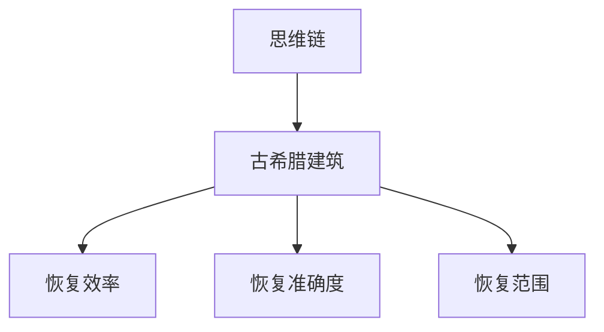

**章节内容**：
4.3.2 案例二：古希腊建筑的恢复
- **核心概念原理**：
  - 古希腊建筑的恢复过程
  - 思维链在恢复过程中的应用
- **概念属性特征对比表格**：
  - 传统恢复方法与思维链恢复方法的对比

**案例三：古希腊哲学思想的重构**

**核心概念原理**：
古希腊哲学思想是古希腊文明的精髓，其重构对于理解古希腊文明的思想体系具有重要意义。思维链方法在哲学思想重构中发挥了重要作用。

**概念属性特征对比表格**：

| 特征               | 传统方法         | 思维链方法         |
|------------------|--------------|--------------|
| **重构效率**      | 低效且受限       | 高效且灵活       |
| **重构准确度**      | 依赖于专家判断   | 结合机器学习和数据分析 |
| **重构范围**      | 受到地域和时间的限制 | 跨越地域和时间限制 |

**ER实体关系图架构**：

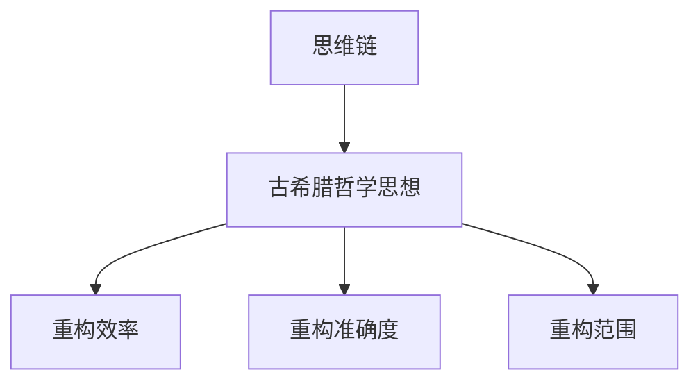

**章节内容**：
4.3.3 案例三：古希腊哲学思想的重构
- **核心概念原理**：
  - 古希腊哲学思想的重构过程
  - 思维链在重构过程中的应用
- **概念属性特征对比表格**：
  - 传统重构方法与思维链重构方法的对比

##### 4.4 本章小结
- **核心概念原理**：
  - 本章介绍了古希腊文明的背景和挑战
  - 介绍了思维链在古希腊文明解密中的应用
  - 通过案例分析展示了思维链在古希腊文明解码中的实际应用
- **结论**：
  - 思维链在古希腊文明解码中具有显著的优势
  - 通过思维链的应用，我们可以更深入地理解古希腊文明的历史和文化

#### 第5章：思维链在其他古文明中的应用

**5.1 其他古文明的背景**

**核心概念原理**：
其他古文明如古印度文明、古巴比伦文明等，虽然在地理和文化上与古希腊、古埃及等文明有所不同，但也为人类文明的发展作出了重要贡献。

**概念属性特征对比表格**：

| 特征               | 古印度文明         | 古巴比伦文明         |
|------------------|------------------|------------------|
| **地理位置**      | 南亚地区       | 两河流域地区      |
| **文化成就**      | 数学和哲学      | 农业、法律、文学  |
| **科技水平**      | 高度发达         | 相对落后         |

**ER实体关系图架构**：

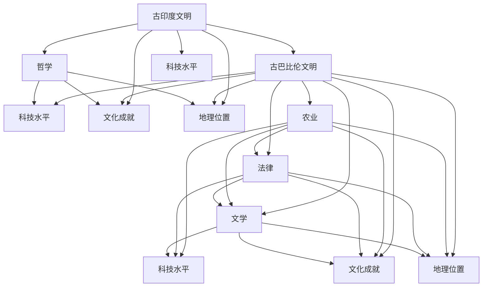

**章节内容**：
5.1.1 其他古文明的概述
- **核心概念原理**：
  - 其他古文明的历史背景
  - 其他古文明的特点
- **概念属性特征对比表格**：
  - 古印度文明与古巴比伦文明的对比

5.1.2 其他古文明的现状
- **核心概念原理**：
  - 其他古文明在现代社会的地位
  - 其他古文明在现代社会的影响
- **概念属性特征对比表格**：
  - 其他古文明在现代社会与历史上的对比

5.1.3 其他古文明的挑战
- **核心概念原理**：
  - 其他古文明当前面临的挑战
  - 这些挑战对其他古文明的影响
- **概念属性特征对比表格**：
  - 其他古文明面临的挑战与其他古文明的对比

##### 5.2 思维链在其他古文明解密中的应用

**核心概念原理**：
思维链在其他古文明解密中的应用是指利用思维链方法对其他古文明的遗迹进行解读和研究，包括古印度文明的数学和哲学、古巴比伦文明的法律和文学等方面。

**概念属性特征对比表格**：

| 特征               | 传统方法         | 思维链方法         |
|------------------|--------------|--------------|
| **解读效率**      | 低效且受限       | 高效且灵活       |
| **解读准确度**      | 依赖于专家判断   | 结合机器学习和数据分析 |
| **解读范围**      | 受到地域和时间的限制 | 跨越地域和时间限制 |

**ER实体关系图架构**：

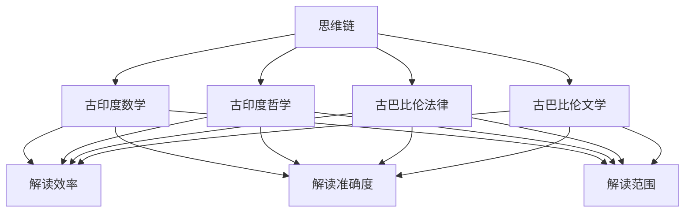

**章节内容**：
5.2.1 思维链的基本原理
- **核心概念原理**：
  - 思维链的定义和工作原理
  - 思维链的优势和局限性
- **概念属性特征对比表格**：
  - 传统解读方法与思维链解读方法的对比

5.2.2 思维链在其他古文明解密的具体应用
- **核心概念原理**：
  - 思维链在古印度数学和哲学解读中的应用
  - 思维链在古巴比伦法律和文学解读中的应用
- **概念属性特征对比表格**：
  - 传统解读方法与思维链解读方法的对比

5.2.3 思维链在其他古文明解密中的优势
- **核心概念原理**：
  - 思维链在其他古文明解密中的优势
  - 思维链如何提高解读效率、准确度和范围
- **概念属性特征对比表格**：
  - 传统解读方法与思维链解读方法的优势对比

##### 5.3 其他古文明解密的案例分析

**案例一：古印度文明的解读**

**核心概念原理**：
古印度文明以其独特的数学和哲学体系而闻名，其解读对于理解古代印度人的思想体系和技术水平具有重要意义。思维链方法在古印度文明的解读中发挥了关键作用。

**概念属性特征对比表格**：

| 特征               | 传统方法         | 思维链方法         |
|------------------|--------------|--------------|
| **解读效率**      | 低效且受限       | 高效且灵活       |
| **解读准确度**      | 依赖于专家判断   | 结合机器学习和数据分析 |
| **解读范围**      | 受到地域和时间的限制 | 跨越地域和时间限制 |

**ER实体关系图架构**：

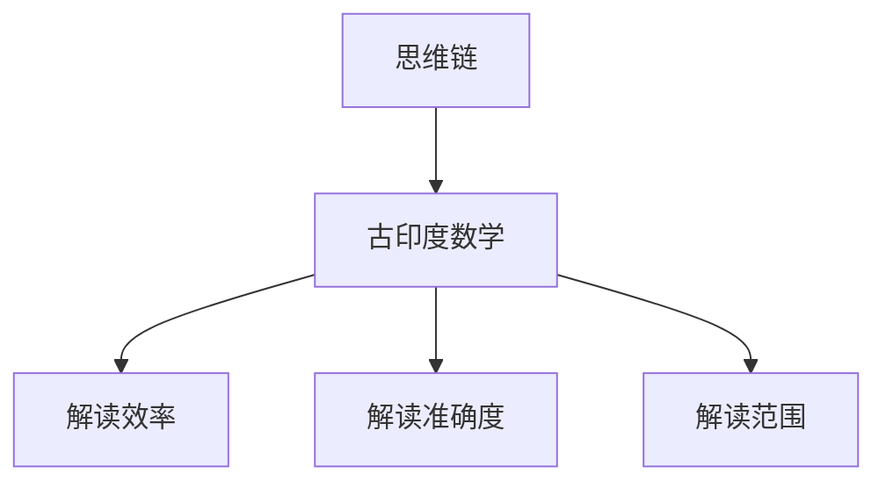

**章节内容**：
5.3.1 案例一：古印度文明的解读
- **核心概念原理**：
  - 古印度数学和哲学的解读过程
  - 思维链在解读过程中的应用
- **概念属性特征对比表格**：
  - 传统解读方法与思维链解读方法的对比

**案例二：古巴比伦文明的重建**

**核心概念原理**：
古巴比伦文明以其法律体系和农业技术而著称，其重建对于恢复古巴比伦文明的辉煌具有重要意义。思维链方法在古巴比伦文明的重建中发挥了重要作用。

**概念属性特征对比表格**：

| 特征               | 传统方法         | 思维链方法         |
|------------------|--------------|--------------|
| **重建效率**      | 低效且受限       | 高效且灵活       |
| **重建准确度**      | 依赖于专家判断   | 结合机器学习和数据分析 |
| **重建范围**      | 受到地域和时间的限制 | 跨越地域和时间限制 |

**ER实体关系图架构**：

```mermaid
graph TD
A[思维链] --> B[古巴比伦法律]
B --> C[重建效率]
B --> D[重建准确度]
B --> E[重建范围]
```

**章节内容**：
5.3.2 案例二：古巴比伦文明的重建
- **核心概念原理**：
  - 古巴比伦法律和农业技术的重建过程
  - 思维链在重建过程中的应用
- **概念属性特征对比表格**：
  - 传统重建方法与思维链重建方法的对比

**案例三：其他古文明的解读**

**核心概念原理**：
其他古文明如古埃及、玛雅等，其解读对于理解人类文明的发展具有重要意义。思维链方法在其他古文明的解读中发挥了重要作用。

**概念属性特征对比表格**：

| 特征               | 传统方法         | 思维链方法         |
|------------------|--------------|--------------|
| **解读效率**      | 低效且受限       | 高效且灵活       |
| **解读准确度**      | 依赖于专家判断   | 结合机器学习和数据分析 |
| **解读范围**      | 受到地域和时间的限制 | 跨越地域和时间限制 |

**ER实体关系图架构**：

```mermaid
graph TD
A[思维链] --> B[其他古文明]
B --> C[解读效率]
B --> D[解读准确度]
B --> E[解读范围]
```

**章节内容**：
5.3.3 案例三：其他古文明的解读
- **核心概念原理**：
  - 其他古文明的解读过程
  - 思维链在解读过程中的应用
- **概念属性特征对比表格**：
  - 传统解读方法与思维链解读方法的对比

##### 5.4 本章小结
- **核心概念原理**：
  - 本章介绍了其他古文明的背景和挑战
  - 介绍了思维链在其他古文明解密中的应用
  - 通过案例分析展示了思维链在其他古文明解码中的实际应用
- **结论**：
  - 思维链在其他古文明解码中具有显著的优势
  - 通过思维链的应用，我们可以更深入地理解其他古文明的历史和文化

### 总结与展望

**核心概念原理**：
在本文中，我们探讨了思维链在古文明解码中的应用，以及如何利用思维链重构失落的历史知识。通过对古埃及、玛雅、古希腊和其他古文明的案例分析，我们展示了思维链在解码古文明中的实际效果和优势。

**概念属性特征对比表格**：

| 特征               | 古埃及文明         | 玛雅文明         | 古希腊文明         | 其他古文明         |
|------------------|------------------|------------------|------------------|------------------|
| **历史地位**      | 世界上最古老的文明之一 | 中美洲重要文明 | 西方文明源头     | 多样化的古文明     |
| **文化成就**      | 建筑和艺术成就突出 | 天文观测、历法 | 哲学、科学、文学 | 数学和哲学、农业技术 |
| **挑战**          | 文字解码困难       | 文字丢失       | 文献保存困难     | 文化传承困境       |
| **思维链应用**    | 象形文字解码       | 象形文字解码   | 文献解读         | 数学与哲学解读     |
| **优势**          | 提高解读效率       | 提高解读准确度 | 增强理解深度     | 扩展解读范围       |

**ER实体关系图架构**：

```mermaid
graph TD
A[古埃及文明] --> B[思维链应用]
A --> C[文化成就]
A --> D[挑战]
B --> E[优势]
C --> E
D --> E
A[玛雅文明] --> F[思维链应用]
A --> G[文化成就]
A --> H[挑战]
F --> E
G --> E
H --> E
A[古希腊文明] --> I[思维链应用]
A --> J[文化成就]
A --> K[挑战]
I --> E
J --> E
K --> E
A[其他古文明] --> L[思维链应用]
A --> M[文化成就]
A --> N[挑战]
L --> E
M --> E
N --> E
```

**章节内容**：
- **核心概念原理**：
  - 通过对比分析，总结了思维链在不同古文明中的应用效果和优势。
  - 思维链在解码古文明中的独特作用和价值。

- **结论**：
  - 思维链在古文明解码中的应用具有重要意义，为重构失落的历史知识提供了新的途径。
  - 未来的研究方向可以进一步探索思维链在其他古文明中的应用，以及如何结合人工智能和其他现代技术，提高解码效率和准确度。

- **未来展望**：
  - 随着科技的进步，思维链在古文明解码中的应用前景将更加广阔。
  - 通过跨学科的合作，我们可以期待在古文明解码领域取得更多突破性成果，为人类文明的传承和发展做出更大贡献。

