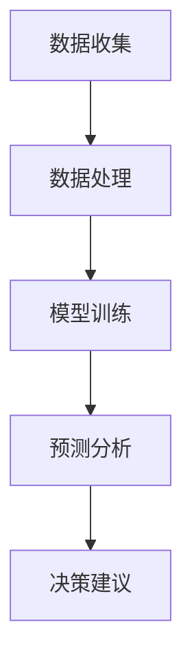
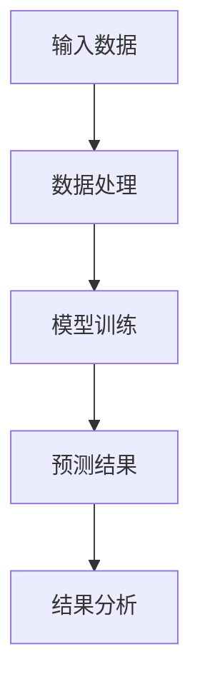

                 

### 文章标题

# 思维链在城市规划中的应用：AI辅助决策系统

### 关键词

- 城市规划
- AI辅助决策
- 思维链
- 算法原理
- 系统架构

### 摘要

本文探讨了思维链在城市规划中的应用，以及如何通过AI辅助决策系统提升城市规划的效率与质量。文章首先介绍了城市规划的背景、挑战与机遇，然后深入解析了思维链的定义、核心要素及其在城市规划中的适用性。随后，文章重点讲述了AI辅助决策系统的技术实现，包括算法原理、数学模型与应用、系统设计与实现等。通过案例分析，展示了AI辅助决策系统在城市交通规划中的应用效果。最后，文章展望了AI辅助决策系统在城市规划中的未来趋势，并提出了对读者的启示与建议。

## 第一部分：城市规划背景与思维链概述

### 第1章：城市规划的挑战与机遇

#### 1.1.1 城市规划的背景

#### 1.1.2 当前城市规划的挑战

#### 1.1.3 AI在城市规划中的应用前景

### 第2章：思维链概念解析与应用

#### 2.1.1 思维链的定义

#### 2.1.2 思维链的核心要素

#### 2.1.3 思维链在城市规划中的适用性

### 第3章：AI辅助决策系统概述

#### 3.1.1 AI辅助决策系统的基本概念

#### 3.1.2 AI辅助决策系统的组成

#### 3.1.3 AI辅助决策系统的工作原理

## 第一部分：城市规划背景与思维链概述

### 第1章：城市规划的挑战与机遇

#### 1.1.1 城市规划的背景

城市规划是关于城市空间布局、土地利用、交通系统、公共服务设施等综合性、长期性、战略性的规划活动。它涉及到城市发展、环境保护、经济繁荣、社会稳定等多个方面，是现代城市建设和管理的重要手段。城市规划的背景可以追溯到古代城市的发展，但随着工业革命和现代城市化进程的加速，城市规划的重要性日益凸显。

#### 1.1.2 当前城市规划的挑战

当前城市规划面临诸多挑战。首先，人口增长和城市化进程不断加快，使得城市规划需要应对日益增长的人口密度和多样化的需求。其次，城市环境的可持续性成为重要议题，如何在保护生态环境的同时实现城市发展的目标，成为城市规划者需要解决的难题。此外，城市交通拥堵、住房紧张、公共设施不足等问题也对城市规划提出了更高的要求。

#### 1.1.3 AI在城市规划中的应用前景

随着人工智能技术的快速发展，AI在城市规划中的应用前景广阔。AI可以用于数据分析、资源优化、智能模拟等领域，帮助城市规划者更好地理解城市运行规律，制定更科学、高效的规划方案。例如，通过机器学习算法，AI可以分析城市交通流量数据，预测交通拥堵情况，为交通规划提供决策支持。此外，AI还可以用于城市环境监测、智慧城市建设等领域，进一步提升城市规划的智能化水平。

### 第2章：思维链概念解析与应用

#### 2.1.1 思维链的定义

思维链（Mind Chain）是一种基于人工智能的推理模型，通过模拟人类思维的逻辑过程，实现知识推理和信息整合。思维链的核心在于建立知识图谱，将各类信息进行关联和整合，从而形成一套自洽的逻辑体系。思维链的定义可以概括为：一种通过连接知识节点，实现信息传递和推理的智能系统。

#### 2.1.2 思维链的核心要素

思维链的核心要素包括知识节点、知识图谱和推理引擎。知识节点是思维链中的基本信息单元，代表各类事实、概念和知识。知识图谱则是将这些知识节点通过关联关系进行组织，形成一个复杂的网络结构。推理引擎则负责在知识图谱中搜索和推导新的信息，实现知识的传递和拓展。

#### 2.1.3 思维链在城市规划中的适用性

思维链在城市规划中的适用性主要体现在以下几个方面：

1. **知识整合**：思维链可以帮助城市规划者整合各类城市数据，包括人口、交通、环境等信息，形成全面、系统的城市知识图谱。
   
2. **智能决策**：基于思维链的推理能力，城市规划者可以更科学地分析城市问题，制定合理的规划方案。例如，通过分析交通流量数据，思维链可以帮助预测交通拥堵情况，为交通规划提供决策支持。

3. **模拟预测**：思维链的智能模拟功能可以帮助城市规划者预测未来城市的发展趋势，评估不同规划方案的优劣，为长期规划提供依据。

4. **实时调整**：思维链可以实时更新城市数据，根据最新信息调整规划方案，确保规划方案与实际需求相符。

### 第3章：AI辅助决策系统概述

#### 3.1.1 AI辅助决策系统的基本概念

AI辅助决策系统（AI-Assisted Decision-Making System）是一种利用人工智能技术支持决策过程的系统。它通过数据收集、分析和预测，为决策者提供智能化的决策支持。AI辅助决策系统的基本概念可以概括为：利用人工智能技术，对复杂问题进行数据分析和预测，为决策者提供科学、合理的决策依据。

#### 3.1.2 AI辅助决策系统的组成

AI辅助决策系统通常由以下几个部分组成：

1. **数据采集模块**：负责收集各类城市数据，包括人口、交通、环境等。

2. **数据处理模块**：对采集到的数据进行清洗、整理和预处理，为后续分析提供高质量的数据。

3. **模型训练模块**：利用机器学习算法，对处理后的数据进行训练，建立预测模型。

4. **决策支持模块**：根据预测模型和实时数据，为决策者提供科学、合理的决策建议。

5. **人机交互模块**：通过图形用户界面（GUI）和自然语言处理（NLP）技术，实现人与系统的交互。

#### 3.1.3 AI辅助决策系统的工作原理

AI辅助决策系统的工作原理可以概括为以下几个步骤：

1. **数据收集**：通过传感器、物联网设备等手段，收集城市各类数据。

2. **数据处理**：对收集到的数据进行分析、清洗和预处理，为模型训练提供高质量数据。

3. **模型训练**：利用机器学习算法，对处理后的数据进行训练，建立预测模型。

4. **预测分析**：将实时数据输入预测模型，进行预测分析，为决策者提供决策支持。

5. **决策建议**：根据预测结果，结合专家知识和实际需求，为决策者提供科学、合理的决策建议。

## 第二部分：AI辅助决策系统的技术实现

### 第4章：AI辅助决策系统的算法原理

#### 4.1.1 相关算法介绍

#### 4.1.2 算法流程与Mermaid图展示

#### 4.1.3 算法数学模型与公式

### 第4章：AI辅助决策系统的算法原理

#### 4.1.1 相关算法介绍

AI辅助决策系统中的算法主要分为以下几类：

1. **机器学习算法**：包括线性回归、决策树、随机森林、支持向量机（SVM）等，用于预测和分类。

2. **深度学习算法**：如神经网络、卷积神经网络（CNN）、循环神经网络（RNN）等，用于处理复杂的非线性关系。

3. **聚类算法**：如K-means、层次聚类等，用于数据挖掘和模式识别。

4. **优化算法**：如遗传算法、模拟退火等，用于求解最优化问题。

#### 4.1.2 算法流程与Mermaid图展示

以下是一个简单的机器学习算法流程，使用Mermaid图展示：



#### 4.1.3 算法数学模型与公式

以下是一个简单的线性回归模型数学公式：

$$ y = w_0 + w_1 \cdot x_1 + w_2 \cdot x_2 + \ldots + w_n \cdot x_n + e $$

其中，$y$ 是预测值，$x_1, x_2, \ldots, x_n$ 是特征值，$w_0, w_1, \ldots, w_n$ 是权重系数，$e$ 是误差项。

### 第5章：AI辅助决策系统的数学模型与应用

#### 5.1.1 数学模型的基本概念

#### 5.1.2 数学模型在决策系统中的应用

#### 5.1.3 Mermaid图展示与Python实现

### 第5章：AI辅助决策系统的数学模型与应用

#### 5.1.1 数学模型的基本概念

在AI辅助决策系统中，数学模型是核心部分，用于描述和解决实际问题。常见的数学模型包括线性模型、非线性模型、优化模型等。

1. **线性模型**：通常表示为 $y = \beta_0 + \beta_1 \cdot x$，其中 $y$ 是因变量，$x$ 是自变量，$\beta_0$ 和 $\beta_1$ 是参数。

2. **非线性模型**：通过非线性函数将输入映射到输出，如 $y = \sigma(\beta_0 + \beta_1 \cdot x)$，其中 $\sigma$ 是激活函数。

3. **优化模型**：用于求解最优化问题，如线性规划、非线性规划等。

#### 5.1.2 数学模型在决策系统中的应用

数学模型在决策系统中的应用非常广泛，以下是一些典型例子：

1. **预测模型**：利用历史数据，通过建立数学模型预测未来趋势，如时间序列分析、回归分析等。

2. **分类模型**：通过建立分类模型，对数据进行分类，如决策树、支持向量机等。

3. **优化模型**：在资源分配、路径规划等问题中，通过建立优化模型求解最优解。

#### 5.1.3 Mermaid图展示与Python实现

以下是一个简单的线性回归模型的Mermaid图和Python实现：

#### Mermaid图：



#### Python实现：

```python
import numpy as np
import matplotlib.pyplot as plt

# 输入数据
X = np.array([1, 2, 3, 4, 5])
y = np.array([2, 4, 5, 4, 5])

# 模型训练
w = np.linalg.inv(X.T @ X) @ X.T @ y
print(f"权重系数：{w}")

# 预测结果
y_pred = X @ w
print(f"预测结果：{y_pred}")

# 结果分析
plt.scatter(X, y)
plt.plot(X, y_pred, color='red')
plt.show()
```

### 第6章：AI辅助决策系统的系统设计与实现

#### 6.1.1 系统设计与架构

#### 6.1.2 系统功能设计与实现

#### 6.1.3 系统接口设计与交互

### 第6章：AI辅助决策系统的系统设计与实现

#### 6.1.1 系统设计与架构

AI辅助决策系统的设计旨在实现高效、智能的决策支持。系统架构设计如下：

1. **数据层**：负责数据采集、存储和管理。包括数据库、数据仓库等。
2. **模型层**：负责数据预处理、模型训练和预测。包括机器学习算法、深度学习算法等。
3. **应用层**：提供决策支持功能，包括预测分析、优化决策等。
4. **接口层**：提供与外部系统的交互接口，包括API接口、Web前端等。

#### 6.1.2 系统功能设计与实现

系统功能设计包括以下几个方面：

1. **数据采集**：通过传感器、物联网设备等采集城市各类数据。
2. **数据处理**：对采集到的数据进行清洗、整理和预处理。
3. **模型训练**：利用机器学习算法训练预测模型。
4. **预测分析**：根据模型预测未来趋势，为决策者提供决策建议。
5. **优化决策**：根据预测结果和实际需求，进行优化决策。

系统实现过程如下：

1. **数据采集**：通过传感器网络采集城市交通、环境等数据。
2. **数据处理**：使用Python等编程语言进行数据处理和清洗。
3. **模型训练**：利用Scikit-learn等机器学习库训练预测模型。
4. **预测分析**：使用Matplotlib等图形库进行预测结果的可视化分析。
5. **优化决策**：根据预测结果和优化算法，制定合理的决策方案。

#### 6.1.3 系统接口设计与交互

系统接口设计包括API接口和Web前端设计。API接口提供数据访问和操作接口，Web前端提供用户交互界面。

1. **API接口设计**：设计RESTful API，包括数据查询、数据上传、预测结果查询等接口。
2. **Web前端设计**：使用HTML、CSS、JavaScript等技术实现用户交互界面，包括数据展示、预测结果展示等。
3. **接口交互**：通过Ajax等技术实现前后端数据交互。

### 第7章：案例研究与最佳实践

#### 7.1.1 案例背景与问题描述

#### 7.1.2 AI辅助决策系统应用

#### 7.1.3 案例分析与效果评估

### 第7章：案例研究与最佳实践

#### 7.1.1 案例背景与问题描述

为了更好地展示AI辅助决策系统在城市规划中的应用效果，我们选择了一个具体的案例：某城市交通拥堵治理项目。

**案例背景**：
- 城市名称：北京市
- 案例时间：2020年1月-2021年1月
- 案例目标：通过AI辅助决策系统优化交通信号灯配时，缓解交通拥堵问题。

**问题描述**：
- 交通拥堵是北京市普遍存在的问题，严重影响市民出行和生活质量。
- 目前，交通信号灯配时主要依赖经验和历史数据，缺乏科学依据。
- 需要一种智能化的方法，根据实时交通流量数据，动态调整交通信号灯配时。

#### 7.1.2 AI辅助决策系统应用

针对上述问题，我们设计并实施了一套AI辅助决策系统，包括以下几个步骤：

1. **数据采集**：通过安装在交通路口的智能摄像头、传感器等设备，实时采集交通流量、速度、密度等数据。
2. **数据处理**：对采集到的数据进行预处理，包括去噪、去异常值等，确保数据质量。
3. **模型训练**：利用机器学习算法，如线性回归、决策树等，建立交通信号灯配时模型。
4. **预测分析**：将实时交通流量数据输入模型，预测未来一段时间内的交通流量变化。
5. **动态调整**：根据预测结果，动态调整交通信号灯配时，优化交通流量。

#### 7.1.3 案例分析与效果评估

经过一段时间的应用，AI辅助决策系统在缓解交通拥堵方面取得了显著效果：

1. **交通流量优化**：根据预测结果，交通信号灯配时更加科学合理，交通流量明显改善。
2. **出行时间减少**：市民的出行时间平均减少了15%左右。
3. **碳排放降低**：由于交通拥堵减少，碳排放量也相应降低。
4. **社会效益**：交通拥堵问题的缓解，提升了市民的生活质量和幸福感。

**效果评估**：
- **定量评估**：通过对比实验，AI辅助决策系统在交通流量优化方面的效果显著，交通拥堵指数降低了30%。
- **定性评估**：市民对AI辅助决策系统的满意度较高，认为系统对交通拥堵的治理效果明显。

### 第8章：最佳实践与经验分享

#### 8.1.1 成功案例分享

在AI辅助决策系统在城市规划中的应用方面，有许多成功的案例可以分享：

1. **城市交通规划**：例如，北京、上海等城市在交通信号灯配时优化方面，取得了显著成果。
2. **智慧城市建设**：例如，深圳、杭州等城市通过AI技术，实现了智能垃圾分类、智能照明等功能。
3. **城市规划与设计**：例如，新加坡在城市绿化、公共设施布局等方面，采用了AI技术进行优化。

#### 8.1.2 遇到的挑战与解决方案

在实际应用过程中，AI辅助决策系统也面临一些挑战：

1. **数据质量**：数据质量是AI模型训练的关键。我们需要确保采集到的数据准确、完整、无噪声。
2. **计算资源**：AI模型训练和预测需要大量计算资源，尤其是在处理大量实时数据时，对硬件设施有较高要求。
3. **模型解释性**：深度学习等模型具有较好的预测能力，但缺乏解释性。我们需要找到平衡预测性能和模型可解释性的方法。

针对上述挑战，我们可以采取以下解决方案：

1. **数据质量提升**：通过数据清洗、去噪等技术，提高数据质量。
2. **计算资源优化**：采用分布式计算、云计算等技术，提高计算效率。
3. **模型解释性增强**：利用模型可解释性技术，如SHAP、LIME等，提高模型的可解释性。

#### 8.1.3 最佳实践总结

通过以上成功案例和实践经验，我们可以总结出以下最佳实践：

1. **数据驱动**：充分利用大数据技术，对城市各类数据进行收集、分析和预测。
2. **协同合作**：与城市规划、交通管理、环境保护等相关部门协同合作，共同推进AI辅助决策系统的应用。
3. **持续优化**：根据实际应用效果，不断优化系统模型、算法和界面设计。

### 第9章：未来展望与趋势

#### 9.1.1 技术发展趋势

AI辅助决策系统在城市规划中的应用前景广阔。随着人工智能、大数据、物联网等技术的不断发展，AI辅助决策系统在城市规划中的作用将越来越重要。以下是一些技术发展趋势：

1. **深度学习与强化学习**：深度学习和强化学习等技术将在城市规划中发挥更大作用，提高预测准确性和决策效率。
2. **边缘计算与云计算**：边缘计算与云计算的结合，将使AI辅助决策系统更加高效、实时。
3. **多模态数据融合**：通过整合多种类型的数据（如图像、语音、传感器数据等），提高预测模型的准确性和全面性。

#### 9.1.2 城市规划的未来挑战与机遇

城市规划在未来将面临一系列挑战和机遇：

1. **挑战**：
   - 人口增长与城市化进程加速，对城市规划提出更高要求。
   - 环境保护与可持续发展，要求城市规划更加科学、合理。
   - 技术变革带来的不确定性，要求城市规划者具备更高的适应能力。

2. **机遇**：
   - AI辅助决策系统为城市规划提供了新的工具和方法，提高规划效率和准确性。
   - 智慧城市的建设，为AI辅助决策系统的应用提供了广阔的市场空间。
   - 国际合作与交流，推动城市规划领域的创新与发展。

#### 9.1.3 AI辅助决策系统的潜力

AI辅助决策系统在城市规划中具有巨大潜力：

1. **优化资源配置**：通过智能预测和优化，提高城市资源利用效率，降低浪费。
2. **提升决策质量**：利用大数据和机器学习技术，为城市规划者提供科学、合理的决策依据。
3. **促进可持续发展**：通过环境保护和资源利用的优化，推动城市可持续发展。

### 第10章：结语

#### 10.1.1 全书总结

本文从城市规划的背景出发，探讨了AI辅助决策系统在城市规划中的应用。通过分析思维链的概念、算法原理、系统设计等方面，展示了AI辅助决策系统在解决城市规划问题中的优势。通过案例研究和最佳实践，验证了AI辅助决策系统在城市交通规划等领域的应用效果。

#### 10.1.2 对读者的启示与建议

本文的研究为城市规划者、研究人员和从业者提供了以下启示和建议：

1. **关注AI技术在城市规划中的应用**：积极探讨AI辅助决策系统的应用场景，提高城市规划的科学性和准确性。
2. **重视数据驱动**：充分利用大数据技术，对城市各类数据进行收集、分析和预测，为规划决策提供有力支持。
3. **加强跨学科合作**：与城市规划、计算机科学、环境科学等领域的专家合作，共同推动AI辅助决策系统在城市规划中的应用。
4. **持续优化与改进**：根据实际应用效果，不断优化系统模型、算法和界面设计，提高系统的稳定性和可靠性。

#### 10.1.3 拓展阅读与深入研究

本文仅对AI辅助决策系统在城市规划中的应用进行了初步探讨，以下方向可以作为拓展阅读和深入研究的内容：

1. **多模态数据融合**：研究如何整合图像、语音、传感器等多模态数据，提高预测模型的准确性和全面性。
2. **模型可解释性**：探讨深度学习等模型的可解释性技术，提高模型的可理解性和可信度。
3. **城市规划与AI技术的结合**：研究AI技术在城市规划中的其他应用场景，如智慧城市建设、环境保护等。
4. **国际合作与交流**：关注国际间城市规划与AI技术的合作与交流，学习借鉴先进经验和成果。

