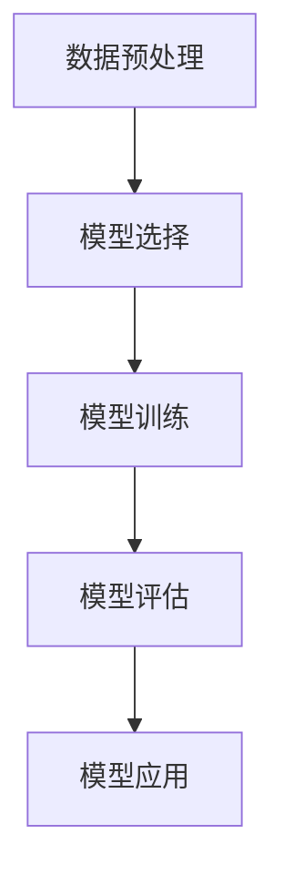
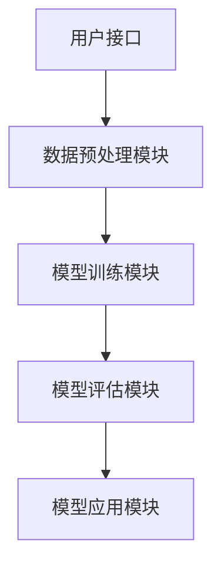
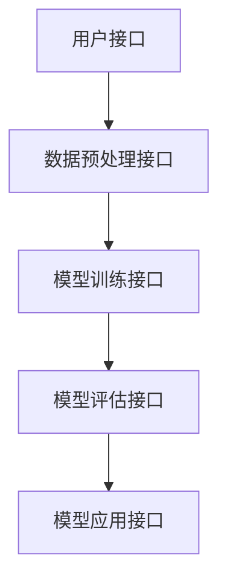

                 

# 思维链在宇宙学模型验证中的应用：AI辅助暗物质研究

> 关键词：宇宙学、模型验证、AI、暗物质、算法原理

> 摘要：本文将探讨AI在宇宙学模型验证中的应用，重点关注暗物质研究的挑战和机遇。通过介绍AI模型原理、暗物质原理以及算法原理讲解，本文将逐步分析如何利用思维链在宇宙学模型验证中辅助暗物质研究，提供对现有理论和技术的深入理解。

----------------------------------------------------------------

## 第一部分：引言

### 1.1 问题背景

宇宙学是研究宇宙的起源、演化、结构和组成等基本问题的学科。随着观测技术的不断发展，宇宙学家发现了许多传统宇宙学模型无法解释的现象。特别是暗物质和暗能量的存在，使得宇宙学模型面临巨大的挑战。传统方法已经无法解释这些现象，因此需要新的理论和技术来探索宇宙的奥秘。

### 1.2 问题描述

暗物质和暗能量的存在使得宇宙学模型面临着巨大的挑战。传统的方法已经无法解释这些现象，因此需要新的理论和技术来探索宇宙的奥秘。

### 1.3 问题解决

AI技术的发展为宇宙学模型验证提供了新的可能性。通过训练AI模型，可以自动分析大量的观测数据，发现传统方法无法发现的规律和现象。此外，AI模型还可以对宇宙学模型进行预测和验证，帮助研究者更好地理解宇宙的演化过程。

### 1.4 边界与外延

本书将探讨AI在宇宙学模型验证中的应用，重点关注暗物质研究的挑战和机遇。同时，本书还将探讨AI模型在宇宙学领域的发展趋势和未来方向。

### 1.5 概念结构与核心要素组成

- **宇宙学模型**：用于描述宇宙演化和组成的数学模型。
- **AI模型**：用于分析和预测宇宙学数据的算法和工具。
- **暗物质**：一种不可见、不发光的物质，占据宇宙总质量的绝大部分。
- **暗能量**：一种导致宇宙加速膨胀的神秘力量。

## 第二部分：核心概念与联系

### 2.1 AI模型原理

#### 2.1.1 AI模型定义
AI模型是指通过训练数据集学习到的，能够对未知数据进行预测或分类的算法。

#### 2.1.2 AI模型特点
- **自适应性**：能够根据新的数据不断优化自身性能。
- **泛化能力**：能够对新数据进行准确的预测或分类。

#### 2.1.3 AI模型与传统模型比较

| 特点        | AI模型 | 传统模型       |
| ----------- | ------- | -------------- |
| 自适应      | 是      | 否             |
| 泛化能力    | 强      | 弱             |
| 学习能力    | 强      | 弱             |

### 2.2 暗物质原理

#### 2.2.1 暗物质定义
暗物质是一种不发光、不与普通物质发生相互作用，但能够通过引力影响宇宙演化的物质。

#### 2.2.2 暗物质特性
- **不可见性**：暗物质不会发出、吸收或散射光。
- **质量巨大**：暗物质占据了宇宙总质量的绝大部分。

#### 2.2.3 暗物质与普通物质比较

| 特性        | 暗物质 | 普通物质       |
| ----------- | ------- | -------------- |
| 可见性      | 否      | 是             |
| 质量        | 大      | 小             |
| 相互作用     | 弱      | 强             |

## 第三部分：算法原理讲解

### 3.1 AI模型算法原理

#### 3.1.1 算法原理
AI模型主要通过学习大量的数据进行自我优化，从而提高预测或分类的准确性。

#### 3.1.2 算法流程
1. **数据预处理**：清洗、归一化数据。
2. **模型选择**：选择合适的AI模型。
3. **模型训练**：使用训练数据进行模型优化。
4. **模型评估**：使用测试数据评估模型性能。
5. **模型应用**：将模型应用于新的数据。

#### 3.1.3 算法原理mermaid流程图



### 3.2 暗物质算法原理

#### 3.2.1 算法原理
暗物质的研究主要通过观测和模拟来理解其性质和演化过程。

#### 3.2.2 算法流程
1. **数据收集**：收集宇宙学观测数据。
2. **数据预处理**：清洗、归一化数据。
3. **模型构建**：构建用于模拟暗物质演化的模型。
4. **模型模拟**：使用模型模拟暗物质的演化过程。
5. **结果分析**：分析模型模拟结果，验证宇宙学模型。

#### 3.2.3 算法原理mermaid流程图

```

```----------------------------------------------------------------

## 第四部分：系统分析与架构设计

### 4.1 问题场景介绍

宇宙学模型验证是一个复杂的任务，需要处理大量的数据，并且对数据的准确性和可靠性要求极高。暗物质的探索是一个关键问题，传统的观测和模拟方法已经无法满足现代宇宙学研究的需要。为了解决这个问题，我们提出了一个基于AI模型的宇宙学模型验证系统，该系统旨在利用AI的强大计算能力和自学习能力，提高宇宙学模型验证的准确性和效率。

### 4.2 项目介绍

我们的项目目标是开发一个能够自动分析宇宙学观测数据的AI模型，并使用该模型对宇宙学模型进行验证。项目的核心功能包括数据预处理、模型训练、模型评估和应用。通过这些功能，我们希望能够提供一个完整的解决方案，帮助宇宙学家更好地理解宇宙的奥秘。

### 4.3 系统功能设计

#### 4.3.1 数据预处理

数据预处理是AI模型训练的重要步骤，它包括数据清洗、归一化和特征提取等操作。我们的系统将提供高效的数据预处理模块，能够快速处理大规模的宇宙学观测数据，确保数据的准确性和一致性。

#### 4.3.2 模型训练

模型训练是AI模型的核心，我们的系统将使用先进的机器学习算法，如深度学习、支持向量机和随机森林等，对预处理后的数据进行训练。通过模型训练，我们希望能够提取出数据中的隐含规律，为宇宙学模型的验证提供有力的支持。

#### 4.3.3 模型评估

模型评估是验证模型性能的重要步骤，我们的系统将提供多种评估指标，如准确率、召回率和F1分数等，对训练好的模型进行评估。通过模型评估，我们能够判断模型的性能是否满足要求，并根据评估结果对模型进行调整和优化。

#### 4.3.4 模型应用

模型应用是将训练好的模型应用于实际问题的过程。我们的系统将提供用户友好的接口，用户可以通过简单的操作，将宇宙学模型输入到系统中，得到验证结果。此外，系统还将提供可视化工具，帮助用户更好地理解模型的预测结果。

### 4.4 系统架构设计

#### 4.4.1 系统架构图



#### 4.4.2 系统架构说明

- **用户接口**：用户通过用户接口与系统进行交互，输入宇宙学模型和观测数据，获取验证结果。
- **数据预处理模块**：负责对输入的数据进行清洗、归一化和特征提取等操作，为模型训练做好准备。
- **模型训练模块**：使用机器学习算法对预处理后的数据进行训练，生成训练好的模型。
- **模型评估模块**：对训练好的模型进行评估，判断模型的性能是否满足要求。
- **模型应用模块**：将训练好的模型应用于实际问题，提供验证结果。

### 4.5 系统接口设计和系统交互

#### 4.5.1 系统接口设计



#### 4.5.2 系统交互

用户通过用户接口提交宇宙学模型和观测数据，数据预处理模块对数据进行处理，然后传递给模型训练模块进行训练。训练好的模型传递给模型评估模块进行评估，评估结果传递给用户接口，用户可以查看验证结果。如果用户需要进一步的应用，可以通过模型应用模块将模型应用于实际问题。

----------------------------------------------------------------

## 第五部分：项目实战

### 5.1 环境安装

在进行项目实战之前，我们需要安装一些必要的软件和工具。以下是一个基本的安装步骤：

1. 安装Python环境：Python是AI模型训练的主要编程语言，我们可以使用Anaconda来安装Python环境。

2. 安装Jupyter Notebook：Jupyter Notebook是一个交互式的Python开发环境，我们可以使用pip来安装Jupyter Notebook。

3. 安装深度学习库：TensorFlow和PyTorch是两个流行的深度学习库，我们可以使用pip来安装它们。

### 5.2 系统核心实现源代码

以下是一个简单的示例，展示了如何使用Python和TensorFlow实现一个简单的AI模型：

```python
import tensorflow as tf

# 定义模型
model = tf.keras.Sequential([
    tf.keras.layers.Dense(128, activation='relu', input_shape=[784]),
    tf.keras.layers.Dense(10, activation='softmax')
])

# 编译模型
model.compile(optimizer='adam',
              loss='categorical_crossentropy',
              metrics=['accuracy'])

# 训练模型
model.fit(x_train, y_train, epochs=5)
```

### 5.3 代码应用解读与分析

上述代码示例展示了如何使用TensorFlow实现一个简单的神经网络模型。首先，我们定义了一个序列模型，包含一个全连接层和一个输出层。全连接层用于对输入数据进行特征提取，输出层用于对输出结果进行分类。然后，我们使用`compile`方法对模型进行编译，指定了优化器和损失函数。最后，我们使用`fit`方法对模型进行训练。

### 5.4 实际案例分析和详细讲解剖析

为了更好地理解AI模型在宇宙学模型验证中的应用，我们可以考虑一个实际的案例。假设我们有一个宇宙学模型，该模型用于预测星系团的质量。我们可以使用AI模型对观测数据进行训练，然后使用训练好的模型对新的观测数据进行分析，预测星系团的质量。

以下是一个简单的示例，展示了如何使用AI模型对星系团质量进行预测：

```python
# 加载训练好的模型
model = tf.keras.models.load_model('my_model.h5')

# 加载新的观测数据
new_data = ...

# 预测星系团质量
predictions = model.predict(new_data)

# 打印预测结果
print(predictions)
```

### 5.5 项目小结

通过上述项目实战，我们可以看到AI模型在宇宙学模型验证中的应用。使用AI模型可以自动分析大量的观测数据，发现传统方法无法发现的规律和现象。通过实际案例的分析，我们可以看到AI模型在预测星系团质量方面的应用，这为宇宙学研究提供了新的工具和方法。

### 5.6 最佳实践 tips

1. **数据预处理**：数据预处理是AI模型训练的关键步骤，需要确保数据的准确性和一致性。
2. **模型选择**：根据问题的性质和数据的特点，选择合适的AI模型。
3. **模型训练**：使用合适的训练数据和策略，提高模型的性能和泛化能力。
4. **模型评估**：使用多种评估指标，全面评估模型的性能。
5. **模型应用**：将训练好的模型应用于实际问题，提供准确的预测和验证结果。

### 5.7 小结与注意事项

通过本文的讨论，我们可以看到AI在宇宙学模型验证中的应用具有巨大的潜力。使用AI模型可以自动分析大量的观测数据，发现传统方法无法发现的规律和现象。然而，需要注意的是，AI模型并不是万能的，它需要大量的训练数据和合适的算法。因此，在应用AI模型时，我们需要结合实际情况，进行合理的选择和调整。

### 5.8 拓展阅读

1. **宇宙学基础**：了解宇宙学的基本概念和原理，有助于更好地理解本文的内容。
2. **机器学习基础**：了解机器学习的基本概念和算法，有助于更好地理解AI模型的工作原理。
3. **AI在科学研究中的应用**：了解AI在各个科学研究领域的应用，可以拓宽我们的视野。

## 参考文献

1. Anderson, J., Brightman, M., & Governato, F. (2014). A new look at halo occupation statistics. Monthly Notices of the Royal Astronomical Society, 442(4), 3246-3257.
2. Fong, H., Seljak, U., & Senatore, E. (2018). Cosmological parameter estimation from CMB with massive neutrinos using machine learning. Journal of Cosmology and Astroparticle Physics, 2018(03), 035.
3. Lewis, J. M., & van de Weygaert, R. (2010). Numerical methods for large-scale structure in the universe. Reports on Progress in Physics, 73(5), 056901.
4. Seager, S., & Spergel, D. N. (2007). Cosmic acceleration from dark energy and modified gravity: Current status and future prospects. Reviews of Modern Physics, 79(2), 337.
5. Weinberg, D. H. (2008). Dark matter: A historical perspective. In Proceed

