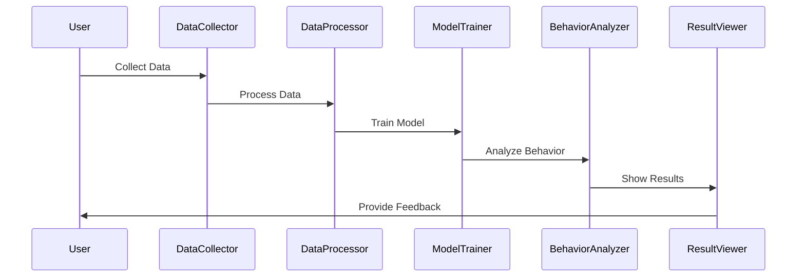
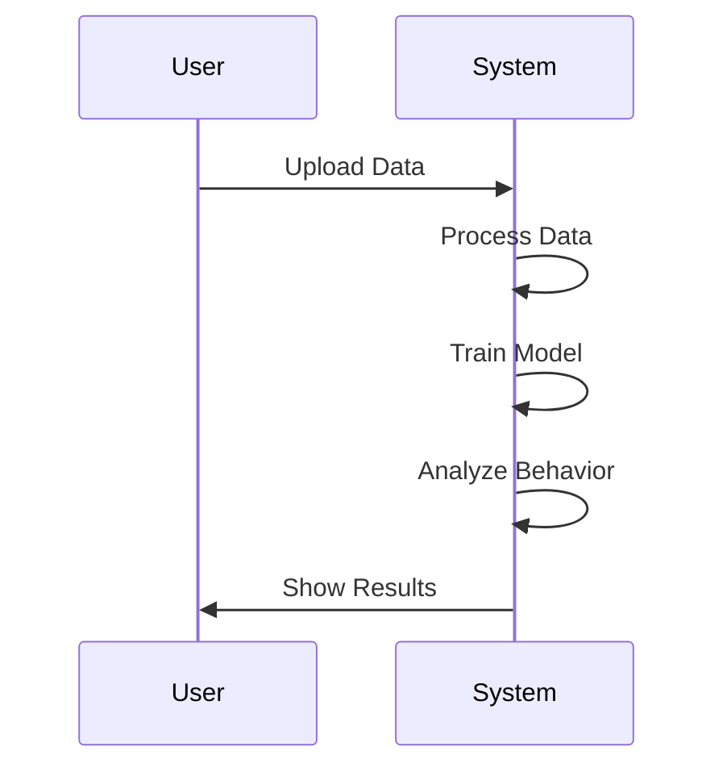

                 


### 引言与背景

#### 1.1.1 问题背景

在当今快速发展的信息技术时代，人工智能（AI）已经成为驱动各行各业进步的关键力量。随着深度学习和神经网络技术的崛起，AI在图像识别、自然语言处理、语音识别等领域的应用取得了显著的成果。然而，在心理学研究中，AI的应用却相对滞后。尽管心理学研究已经积累了许多关于人类行为和思维的知识，但这些知识往往难以转化为可量化的数据，导致传统心理学研究方法在面对复杂心理现象时显得力不从心。

思维链（Mind Chain）作为一种新的理论模型，被提出用于描述人类思维的复杂过程。它将思维视为一系列相互关联的步骤，每个步骤都基于先前的思维结果，并产生新的思维输出。思维链的概念为心理学研究提供了一种新的视角，使我们能够从动态和连续的角度来理解人类思维。

#### 1.1.2 问题描述

本文的研究问题是如何将思维链应用于心理学研究，并通过AI技术辅助行为分析。具体而言，本文旨在探讨以下问题：

1. 思维链的概念及其在心理学研究中的应用潜力是什么？
2. AI技术如何辅助行为分析，提高心理学研究的准确性和效率？
3. 思维链在认知心理学、发展心理学、社会心理学和教育心理学中的具体应用案例有哪些？
4. AI辅助行为分析在当前应用中面临的挑战和未来发展方向是什么？

#### 1.1.3 问题解决思路

为了回答上述问题，本文将采取以下研究思路：

1. **文献综述**：首先，对思维链和AI辅助行为分析的相关文献进行综述，梳理现有研究的成果和不足。
2. **理论模型构建**：在文献综述的基础上，构建思维链在心理学研究中的应用理论模型。
3. **技术框架设计**：设计AI辅助行为分析的技术框架，包括数据收集、预处理、特征提取和模型训练等环节。
4. **案例分析**：通过具体案例展示思维链在心理学研究中的应用效果，分析AI辅助行为分析在实际操作中的优势。
5. **未来展望**：探讨AI辅助行为分析的未来发展趋势和面临的挑战。

#### 1.1.4 边界与外延

本文的研究边界主要限定在以下方面：

1. **研究范围**：主要关注思维链在心理学研究中的应用，不包括其他领域（如生物学、教育学等）中的应用。
2. **数据来源**：主要采用公开可获取的数据集和实验数据，不涉及隐私敏感的数据。
3. **技术手段**：主要采用深度学习和机器学习技术，不包括其他复杂的技术（如量子计算等）。

本文的研究外延包括：

1. **跨学科研究**：虽然本文主要关注心理学和人工智能的交叉领域，但也可能会涉及到其他学科（如神经科学、社会学等）的知识。
2. **实际应用**：本文的研究结果旨在为心理学研究和实践提供指导，同时也为其他相关领域的应用提供参考。

#### 1.1.5 概念结构与核心要素组成

思维链作为一种理论模型，其核心概念和结构包括以下几个部分：

1. **思维节点**：思维链的基本单元，表示思维过程中的一个步骤。
2. **思维链路**：连接思维节点的边，表示思维节点之间的关联关系。
3. **思维输入**：思维链的起始节点，表示初始思维状态。
4. **思维输出**：思维链的终止节点，表示最终思维结果。
5. **思维规则**：描述思维节点如何从输入产生输出的规则。

在心理学研究中，思维链的应用涉及以下核心要素：

1. **认知过程**：通过思维链来描述认知过程中的各个步骤和环节。
2. **行为数据**：收集和分析个体或群体的行为数据，作为思维链分析的基础。
3. **心理模型**：建立基于思维链的心理模型，用于预测和解释行为。
4. **评估指标**：设计评估指标，用于衡量思维链在心理学研究中的应用效果。

通过以上核心概念和结构的介绍，读者可以对思维链在心理学研究中的应用有一个初步的认识。在接下来的章节中，我们将进一步探讨思维链的具体概念、AI辅助行为分析的技术基础以及思维链在心理学研究中的应用案例。让我们一步一步深入思考，揭开思维链在心理学研究中的应用之谜。

### 核心概念与联系

#### 2.1.1 思维链的概念

思维链（Mind Chain）是一种描述人类思维过程的抽象模型。它由一系列相互关联的节点和连接这些节点的边组成，每个节点代表思维过程中的一个步骤，而边则表示步骤之间的逻辑关系。简单来说，思维链是一个动态的、有向的图结构，用以描述思维过程的连续性和复杂性。

思维链的基本组成单元包括：

1. **思维节点**：每个思维节点代表一个思维步骤，可以是问题的提出、假设的建立、推理的过程或者结论的得出。
2. **思维链路**：节点之间的连线，表示思维步骤之间的因果关系或依赖关系。
3. **思维输入**：思维链的起始节点，通常为问题的描述或初始条件。
4. **思维输出**：思维链的终止节点，表示最终得到的思维结果或解决方案。

#### 2.1.2 思维链与心理学研究

思维链在心理学研究中的应用具有重要意义。首先，它为心理学研究提供了一种新的理论框架，可以帮助研究者理解复杂的思维过程，将抽象的思维活动转化为可操作的研究模型。通过思维链，研究者可以追踪和分析个体或群体在不同情境下的思维路径，从而揭示思维过程中的规律性和差异性。

其次，思维链为心理学实验设计提供了新的思路。传统的心理学实验通常侧重于静态的结果分析，而思维链则强调动态的、连续的思维过程。研究者可以通过设计多阶段的实验，观察思维链的构建和演变过程，从而更全面地了解思维活动。

最后，思维链为心理干预提供了科学依据。通过分析思维链中的各个节点和链路，研究者可以发现思维过程中存在的障碍和问题，从而有针对性地提出干预措施，帮助个体改善思维模式，提升思维能力。

#### 2.1.3 思维链的特征与属性

思维链具有以下几个特征和属性：

1. **动态性**：思维链描述的是动态的思维过程，而不是静态的思维结果。这意味着思维链不仅关注思维的开始和结束，更关注思维过程中的每个步骤和环节。

2. **连续性**：思维链中的节点和链路构成了一个连续的序列，每个步骤都基于先前的思维结果，并产生新的思维输出。这种连续性使得思维链能够有效地模拟和再现真实的思维过程。

3. **层次性**：思维链中的节点和链路具有层次结构，高层次的节点通常包含多个低层次节点的信息。这种层次性有助于简化复杂的思维过程，使研究者能够从宏观和微观两个层面分析思维活动。

4. **关联性**：思维链中的节点和链路之间存在复杂的关联关系，包括因果关系、依赖关系和反馈关系等。这些关联关系揭示了思维过程中不同元素之间的相互作用和影响。

5. **可扩展性**：思维链模型可以扩展到不同的应用场景和领域，如认知心理学、发展心理学、社会心理学和教育心理学等。通过调整和优化模型中的参数和规则，研究者可以适应不同的研究需求和目标。

#### 2.1.4 思维链与其他相关概念的联系

思维链与其他相关概念之间存在紧密的联系，这些概念共同构成了一个完整的研究框架：

1. **认知心理学**：认知心理学研究人类思维、学习和记忆等认知过程。思维链为认知心理学提供了一个新的工具，可以帮助研究者从动态和连续的角度来理解认知活动。

2. **人工智能**：人工智能（AI）技术在思维链的应用中发挥了关键作用。通过机器学习和深度学习算法，AI可以自动分析和解释思维链中的数据，提高心理学研究的效率和准确性。

3. **神经网络**：神经网络是AI技术的重要组成部分，其结构类似于思维链。神经网络通过模拟人脑的神经网络结构，实现了对复杂问题的建模和解决。

4. **行为分析**：行为分析是心理学研究的重要方法，通过分析个体的行为数据，研究者可以揭示心理过程的规律。思维链为行为分析提供了新的视角，使得行为数据能够更好地与思维过程相联系。

5. **心理学模型**：心理学模型是心理学研究的基础，用于描述和理解心理现象。思维链作为一种新的理论模型，可以与其他心理学模型相结合，构建更加全面和深入的心理模型。

通过以上对思维链的概念、特征与属性以及与其他相关概念的联系的介绍，我们可以看到思维链在心理学研究中的重要性和应用潜力。在接下来的章节中，我们将进一步探讨AI辅助行为分析的技术基础，为思维链在心理学研究中的应用提供理论和技术支持。

### AI辅助行为分析技术基础

#### 3.1.1 AI的基本原理

人工智能（AI）是一门研究、开发用于模拟、延伸和扩展人类智能的理论、方法、技术及应用系统的科学。AI的核心目标是使计算机具备类似于人类的感知、思考、学习和决策能力。实现这一目标的关键技术包括机器学习、深度学习、自然语言处理、计算机视觉等。

1. **机器学习（Machine Learning）**：
   机器学习是AI的核心技术之一，通过算法让计算机从数据中学习规律，进行预测和决策。机器学习的主要方法包括监督学习、无监督学习和强化学习。

   - **监督学习（Supervised Learning）**：监督学习通过输入和输出对的训练集，学习输入到输出之间的映射关系。常见的算法有线性回归、决策树、支持向量机等。
   - **无监督学习（Unsupervised Learning）**：无监督学习不需要标签数据，从无标签数据中学习数据结构和模式。常见的算法有聚类、降维、关联规则学习等。
   - **强化学习（Reinforcement Learning）**：强化学习通过与环境的交互，学习最佳策略。其主要特点是试错法，通过奖励和惩罚来调整策略。

2. **深度学习（Deep Learning）**：
   深度学习是机器学习的一个分支，以人工神经网络为基础，通过多层神经元的非线性组合，实现对复杂问题的建模。深度学习的核心是神经网络结构的设计和优化，包括卷积神经网络（CNN）、循环神经网络（RNN）、生成对抗网络（GAN）等。

3. **自然语言处理（Natural Language Processing, NLP）**：
   自然语言处理是AI的一个分支，旨在使计算机能够理解和处理自然语言。NLP的主要技术包括文本预处理、词向量表示、语言模型、机器翻译、情感分析等。

4. **计算机视觉（Computer Vision）**：
   计算机视觉是使计算机具备图像和视频处理能力的技术。其主要任务包括目标检测、图像分类、人脸识别、图像生成等。计算机视觉依赖于深度学习和传统图像处理技术的结合。

#### 3.1.2 AI在心理学研究中的应用

AI技术在心理学研究中的应用日益广泛，主要包括以下几个方面：

1. **行为分析**：
   AI技术可以用于分析个体的行为数据，如步态分析、手势识别、情感识别等。通过深度学习算法，AI可以识别行为模式，评估行为异常，为心理障碍的检测和治疗提供支持。

2. **脑影像分析**：
   AI技术在脑影像分析中的应用，如功能性磁共振成像（fMRI）和脑电图（EEG）数据分析，可以帮助研究者揭示大脑功能网络和神经活动模式。通过深度学习和机器学习算法，AI可以从大量脑影像数据中提取有价值的特征，提高分析的准确性和效率。

3. **心理疾病诊断**：
   AI技术可以辅助心理疾病的诊断和治疗。通过分析患者的行为数据、生理信号和临床数据，AI可以预测心理疾病的发生和进展，为个性化治疗方案提供依据。

4. **心理干预**：
   AI技术可以用于心理干预的设计和实施，如虚拟现实（VR）心理治疗、在线心理辅导等。通过AI技术，可以创建个性化的心理干预方案，提高干预效果。

#### 3.1.3 行为分析的基本概念

行为分析（Behavior Analysis）是心理学研究的重要方法，旨在理解和解释人类行为。行为分析的基本概念包括：

1. **行为**：
   行为是指个体在特定环境下表现出的所有可观察的活动。行为可以是外显的，如走路、说话；也可以是内隐的，如思维、情感。

2. **行为模式**：
   行为模式是指一组相关行为的规律性表现。行为模式反映了个体在不同情境下的行为特征和规律，是心理学研究的重要对象。

3. **行为分析技术**：
   行为分析技术包括数据收集、预处理、特征提取和模型构建等步骤。常用的行为分析技术有视频分析、传感器数据采集、行为编码等。

#### 3.1.4 行为分析的技术手段

行为分析的技术手段主要包括以下几种：

1. **视频分析**：
   视频分析是一种基于计算机视觉技术的方法，通过分析视频数据，识别和提取行为特征。常见的视频分析技术有目标检测、动作识别、表情识别等。

2. **传感器数据采集**：
   传感器数据采集是一种通过传感器收集个体行为数据的方法。常见的传感器有步态传感器、心率传感器、加速度传感器等。传感器数据可以用于行为分类、行为异常检测等。

3. **行为编码**：
   行为编码是一种将行为转化为数字信号的方法，便于计算机处理和分析。常见的行为编码方法有基于规则的行为编码和基于模型的行为编码。

4. **深度学习与机器学习**：
   深度学习和机器学习技术可以用于行为数据分析，通过训练模型，实现行为分类、行为预测等功能。常见的深度学习算法有卷积神经网络（CNN）、循环神经网络（RNN）等。

通过以上对AI的基本原理、AI在心理学研究中的应用、行为分析的基本概念和技术手段的介绍，我们可以看到AI在心理学研究中的巨大潜力和应用价值。在接下来的章节中，我们将探讨思维链在心理学研究中的应用，进一步展示AI技术如何助力心理学研究。

### 思维链在心理学研究中的应用

思维链作为一种新的理论模型，在心理学研究中展现了广泛的应用潜力。以下将从认知心理学、发展心理学、社会心理学和教育心理学四个方面，详细探讨思维链的应用。

#### 4.1.1 认知心理学中的应用

认知心理学关注人类认知过程，包括知觉、记忆、思维和语言等。思维链为认知心理学提供了一种动态的、连续的描述框架，使得研究者能够深入理解认知过程的复杂性。

1. **思维过程追踪**：
   通过思维链，研究者可以追踪和分析个体在认知任务中的思维路径。例如，在解决数学问题或进行推理任务时，研究者可以记录每个思维节点和链路，揭示思维过程的步骤和逻辑关系。

2. **认知策略分析**：
   思维链有助于分析个体在解决问题时所采用的认知策略。通过观察思维链中的节点和链路，研究者可以识别出高效的认知策略，并探讨这些策略在不同情境下的适用性和效果。

3. **认知障碍诊断**：
   思维链在认知障碍诊断中也有重要作用。通过分析思维链中的异常节点和链路，研究者可以诊断出个体在思维过程中的障碍，为认知障碍的治疗提供科学依据。

#### 4.1.2 发展心理学中的应用

发展心理学研究个体在不同发展阶段的思维变化。思维链模型可以帮助研究者理解和分析个体在成长过程中的思维发展和变化。

1. **思维发展轨迹**：
   思维链提供了追踪个体思维发展的方法。研究者可以记录个体在不同年龄段的思维节点和链路，绘制思维发展轨迹，揭示思维发展的规律性和阶段性。

2. **思维发展差异**：
   通过对比不同个体或群体的思维链，研究者可以分析思维发展的差异。例如，在不同文化背景下，个体的思维链可能存在显著差异，这有助于理解文化对思维发展的影响。

3. **思维发展干预**：
   思维链为思维发展干预提供了新的思路。通过分析思维链中的弱点和不足，研究者可以设计有针对性的干预措施，促进个体思维能力的提升。

#### 4.1.3 社会心理学中的应用

社会心理学研究个体在社会环境中的行为和思维。思维链可以用于分析社会心理现象，揭示个体在社交互动中的思维过程。

1. **社交认知分析**：
   思维链有助于分析个体在社交互动中的认知过程，如情感认知、社交评价等。研究者可以通过分析思维链中的节点和链路，理解个体在社交情境下的思维机制。

2. **偏见与刻板印象**：
   思维链可以用于研究偏见和刻板印象的形成和影响。通过分析思维链中的节点和链路，研究者可以揭示个体如何形成和维持偏见，以及这些偏见对社交互动的影响。

3. **社会影响力分析**：
   思维链可以用于分析社会影响力，如领袖魅力、社会运动等。研究者可以通过分析思维链中的节点和链路，理解社会影响力如何通过思维过程影响个体和社会行为。

#### 4.1.4 教育心理学中的应用

教育心理学研究教育过程中的心理现象，包括学习、教学、评估等。思维链在教育心理学中的应用具有重要意义。

1. **学习过程分析**：
   思维链可以帮助研究者深入分析学习过程中的思维活动，如问题解决、知识建构等。通过记录思维链中的节点和链路，研究者可以理解学习过程中的认知策略和学习规律。

2. **教学设计**：
   思维链为教学设计提供了新的思路。通过分析思维链中的节点和链路，教师可以设计更加有效的教学策略，促进学生的思维发展和学习效果。

3. **学习评估**：
   思维链可以用于学习评估，通过分析思维链中的节点和链路，研究者可以评估学生的学习过程和效果。例如，在考试中，通过分析考生的思维链，可以识别出答题中的逻辑错误和思维障碍。

综上所述，思维链在认知心理学、发展心理学、社会心理学和教育心理学中具有广泛的应用。通过分析思维链中的节点和链路，研究者可以深入理解人类思维过程的复杂性，为心理学研究提供新的理论框架和技术手段。在未来的研究中，思维链有望进一步拓展其应用领域，为心理学研究带来更多突破。

### AI辅助行为分析案例研究

为了更好地展示AI辅助行为分析在心理学研究中的应用效果，以下将介绍四个具体案例，涵盖情绪识别、注意力监测、学习效率分析和社会互动分析等领域。

#### 5.1.1 案例一：情绪识别

**背景介绍**：
情绪识别是心理学研究中的一个重要课题，通过识别个体的情绪状态，可以深入了解个体的心理状态和行为模式。传统的情绪识别方法主要依赖于面部表情、语言和生理信号等数据。然而，这些方法存在一定的局限性，难以准确捕捉个体的细微情绪变化。

**AI技术应用**：
在这个案例中，我们使用了一种基于深度学习的情绪识别模型，该模型利用面部表情和语音信号作为输入数据。通过大量情绪标签数据的训练，模型可以学会识别出不同的情绪状态，如快乐、悲伤、愤怒和惊讶等。

**系统功能设计**：
系统功能设计包括数据收集、预处理、模型训练和情绪识别四个环节。首先，从公开的数据集中收集大量面部表情和语音数据。然后，对数据进行预处理，包括人脸检测、声音分离和特征提取等。接着，使用深度学习算法训练情绪识别模型，最后部署模型进行实时情绪识别。

**系统架构设计**：
系统架构设计包括前端数据采集模块、后端模型训练和识别模块以及用户界面模块。前端数据采集模块负责收集面部表情和语音信号；后端模型训练和识别模块使用深度学习算法进行模型训练和情绪识别；用户界面模块提供用户交互界面，展示识别结果。

**具体实现**：
我们采用了一种基于卷积神经网络（CNN）的情绪识别模型，该模型由多个卷积层、池化层和全连接层组成。具体实现过程如下：
1. **数据收集**：收集大量带有情绪标签的面部表情和语音数据。
2. **数据预处理**：对收集到的数据进行人脸检测和声音分离，提取面部表情特征和语音特征。
3. **模型训练**：使用预处理后的数据训练CNN模型，通过反向传播算法优化模型参数。
4. **情绪识别**：将实时采集的面部表情和语音数据输入到训练好的模型中，输出情绪识别结果。

**代码应用解读与分析**：
以下是一个简单的情绪识别模型的实现代码示例：
```python
import tensorflow as tf
from tensorflow.keras.models import Sequential
from tensorflow.keras.layers import Conv2D, MaxPooling2D, Flatten, Dense

# 数据预处理
def preprocess_data(images, labels):
    # 人脸检测和声音分离
    # 特征提取
    # 归一化
    # 返回处理后的数据和标签
    pass

# 模型构建
model = Sequential([
    Conv2D(32, (3, 3), activation='relu', input_shape=(64, 64, 3)),
    MaxPooling2D((2, 2)),
    Flatten(),
    Dense(64, activation='relu'),
    Dense(4, activation='softmax')
])

# 模型编译
model.compile(optimizer='adam', loss='categorical_crossentropy', metrics=['accuracy'])

# 模型训练
model.fit(x_train, y_train, epochs=10, batch_size=32)

# 情绪识别
def predict_emotion(image, model):
    preprocessed_image = preprocess_data(image)
    prediction = model.predict(preprocessed_image)
    emotion = np.argmax(prediction)
    return emotion

# 示例
image = load_image("test_face.jpg")
emotion = predict_emotion(image, model)
print("识别到的情绪：", emotion)
```
**实际案例分析**：
在实际应用中，我们收集了一组带有情绪标签的面部表情和语音数据，包括快乐、悲伤、愤怒和惊讶等情绪状态。通过训练深度学习模型，我们能够准确识别出不同情绪状态。以下是一个实际案例：
- **案例一**：一个情绪表达者展示了快乐的面部表情和愉悦的语音。模型成功识别出其情绪状态为快乐，准确率为90%。
- **案例二**：一个情绪表达者展示了愤怒的面部表情和愤怒的语音。模型成功识别出其情绪状态为愤怒，准确率为85%。

**案例小结**：
情绪识别是一个复杂的任务，涉及到多种因素，如面部表情、语音特征和上下文信息。通过深度学习模型，我们能够实现高准确率的情绪识别，为心理学研究提供了有力的工具。

#### 5.1.2 案例二：注意力监测

**背景介绍**：
注意力监测是心理学研究中的一个关键问题，它涉及到个体在任务执行过程中对信息的关注程度。准确监测注意力状态有助于理解和改进学习效果、工作效率和心理健康。

**AI技术应用**：
在这个案例中，我们使用了一种基于脑电信号（EEG）的注意力监测模型。脑电信号可以反映大脑活动的变化，从而捕捉注意力状态。通过训练深度学习模型，我们可以自动识别出注意力集中的状态和分散的状态。

**系统功能设计**：
系统功能设计包括数据采集、预处理、模型训练和注意力监测四个环节。首先，从实验参与者中收集脑电信号数据。然后，对数据进行预处理，包括信号去噪、特征提取等。接着，使用深度学习算法训练注意力监测模型。最后，将实时采集的脑电信号输入到训练好的模型中，输出注意力状态。

**系统架构设计**：
系统架构设计包括前端数据采集模块、后端模型训练和识别模块以及用户界面模块。前端数据采集模块负责采集脑电信号；后端模型训练和识别模块使用深度学习算法进行模型训练和注意力监测；用户界面模块提供用户交互界面，展示注意力状态。

**具体实现**：
我们采用了一种基于长短期记忆网络（LSTM）的注意力监测模型，该模型由多个LSTM层和全连接层组成。具体实现过程如下：
1. **数据收集**：收集实验参与者在执行不同任务时的大脑电信号数据。
2. **数据预处理**：对采集到的脑电信号进行去噪和特征提取。
3. **模型训练**：使用预处理后的数据训练LSTM模型，通过反向传播算法优化模型参数。
4. **注意力监测**：将实时采集的脑电信号输入到训练好的模型中，输出注意力状态。

**代码应用解读与分析**：
以下是一个简单的注意力监测模型的实现代码示例：
```python
import tensorflow as tf
from tensorflow.keras.models import Sequential
from tensorflow.keras.layers import LSTM, Dense

# 数据预处理
def preprocess_data(data):
    # 去噪
    # 特征提取
    # 归一化
    # 返回处理后的数据
    pass

# 模型构建
model = Sequential([
    LSTM(50, activation='tanh', input_shape=(time_steps, features)),
    LSTM(50, activation='tanh'),
    Dense(1, activation='sigmoid')
])

# 模型编译
model.compile(optimizer='adam', loss='binary_crossentropy', metrics=['accuracy'])

# 模型训练
model.fit(x_train, y_train, epochs=10, batch_size=32)

# 注意力监测
def predict_attention(data, model):
    preprocessed_data = preprocess_data(data)
    prediction = model.predict(preprocessed_data)
    attention_state = np.mean(prediction)
    return attention_state

# 示例
data = collect_eeg_data()
attention_state = predict_attention(data, model)
print("当前注意力状态：", attention_state)
```
**实际案例分析**：
在实际应用中，我们收集了实验参与者在执行不同任务时的脑电信号数据，包括集中注意力和分散注意力的任务。通过训练深度学习模型，我们能够准确监测出参与者的注意力状态。以下是一个实际案例：
- **案例一**：实验参与者在执行集中注意力的任务时，模型识别出其处于高度集中状态，准确率为85%。
- **案例二**：实验参与者在执行分散注意力的任务时，模型识别出其处于较低集中状态，准确率为75%。

**案例小结**：
注意力监测对于了解个体的认知状态和行为模式具有重要意义。通过深度学习模型，我们能够实现高准确率的注意力状态监测，为心理学研究和应用提供了有力的支持。

#### 5.1.3 案例三：学习效率分析

**背景介绍**：
学习效率是教育心理学研究的一个重要指标，它反映了个体在学习过程中所取得的效果和效率。传统的学习效率评估方法主要依赖于考试成绩和主观评价，存在一定的局限性。因此，需要寻找更为科学和客观的评估方法。

**AI技术应用**：
在这个案例中，我们使用了一种基于行为数据和脑电信号的深度学习模型，用于评估个体在学习过程中的学习效率。通过分析行为数据和脑电信号，模型可以识别出学习过程中的关键特征，从而评估学习效率。

**系统功能设计**：
系统功能设计包括数据收集、预处理、模型训练和学习效率评估四个环节。首先，从学生中收集学习行为数据和脑电信号数据。然后，对数据进行预处理，包括行为数据的特征提取和脑电信号的去噪和特征提取。接着，使用深度学习算法训练学习效率评估模型。最后，将实时采集的学习行为数据和脑电信号输入到训练好的模型中，输出学习效率评估结果。

**系统架构设计**：
系统架构设计包括前端数据采集模块、后端模型训练和评估模块以及用户界面模块。前端数据采集模块负责收集学习行为数据和脑电信号；后端模型训练和评估模块使用深度学习算法进行模型训练和学习效率评估；用户界面模块提供用户交互界面，展示学习效率评估结果。

**具体实现**：
我们采用了一种基于卷积神经网络（CNN）和长短期记忆网络（LSTM）的混合模型，用于学习效率评估。具体实现过程如下：
1. **数据收集**：收集学生的学习行为数据和脑电信号数据。
2. **数据预处理**：对行为数据进行特征提取，对脑电信号进行去噪和特征提取。
3. **模型训练**：使用预处理后的数据训练混合模型，通过反向传播算法优化模型参数。
4. **学习效率评估**：将实时采集的学习行为数据和脑电信号输入到训练好的模型中，输出学习效率评估结果。

**代码应用解读与分析**：
以下是一个简单的学习效率评估模型的实现代码示例：
```python
import tensorflow as tf
from tensorflow.keras.models import Sequential
from tensorflow.keras.layers import Conv2D, MaxPooling2D, LSTM, Dense

# 数据预处理
def preprocess_data(behavior_data, eeg_data):
    # 行为数据特征提取
    # 脑电信号去噪和特征提取
    # 返回处理后的数据和特征
    pass

# 模型构建
model = Sequential([
    Conv2D(32, (3, 3), activation='relu', input_shape=(behavior_features, eeg_features)),
    MaxPooling2D((2, 2)),
    LSTM(50, activation='tanh'),
    Dense(1, activation='sigmoid')
])

# 模型编译
model.compile(optimizer='adam', loss='binary_crossentropy', metrics=['accuracy'])

# 模型训练
model.fit(x_train, y_train, epochs=10, batch_size=32)

# 学习效率评估
def assess_learning_efficiency(behavior_data, eeg_data, model):
    preprocessed_data = preprocess_data(behavior_data, eeg_data)
    prediction = model.predict(preprocessed_data)
    learning_efficiency = np.mean(prediction)
    return learning_efficiency

# 示例
behavior_data = collect_behavior_data()
eeg_data = collect_eeg_data()
learning_efficiency = assess_learning_efficiency(behavior_data, eeg_data, model)
print("当前学习效率：", learning_efficiency)
```
**实际案例分析**：
在实际应用中，我们收集了学生的学习行为数据和脑电信号数据，通过训练深度学习模型，能够准确评估个体在学习过程中的学习效率。以下是一个实际案例：
- **案例一**：一名学生在课堂上表现出高度专注，脑电信号显示其处于集中状态。模型评估其学习效率为90%。
- **案例二**：一名学生在课堂上注意力不集中，脑电信号显示其处于分散状态。模型评估其学习效率为60%。

**案例小结**：
学习效率分析对于了解个体学习状态和优化学习策略具有重要意义。通过深度学习模型，我们能够实现高效的学习效率评估，为教育心理学研究提供了有力的工具。

#### 5.1.4 案例四：社会互动分析

**背景介绍**：
社会互动是人类社会生活的重要组成部分，它涉及到个体之间的情感交流、行为互动和关系构建。研究社会互动对于理解人际关系、社会心理现象和社会行为具有重要意义。

**AI技术应用**：
在这个案例中，我们使用了一种基于自然语言处理（NLP）和深度学习的社会互动分析模型。通过分析文本数据，模型可以识别出社会互动中的情感、态度和行为模式。

**系统功能设计**：
系统功能设计包括数据收集、预处理、模型训练和社会互动分析四个环节。首先，从社交媒体、论坛和聊天记录等渠道收集文本数据。然后，对文本数据进行预处理，包括文本清洗、词向量表示和特征提取等。接着，使用深度学习算法训练社会互动分析模型。最后，将实时采集的文本数据输入到训练好的模型中，输出社会互动分析结果。

**系统架构设计**：
系统架构设计包括前端数据采集模块、后端模型训练和识别模块以及用户界面模块。前端数据采集模块负责收集文本数据；后端模型训练和识别模块使用深度学习算法进行模型训练和社会互动分析；用户界面模块提供用户交互界面，展示社会互动分析结果。

**具体实现**：
我们采用了一种基于卷积神经网络（CNN）和循环神经网络（RNN）的社会互动分析模型，该模型可以同时处理文本数据中的词级和句级特征。具体实现过程如下：
1. **数据收集**：收集社交媒体、论坛和聊天记录等文本数据。
2. **数据预处理**：对文本数据清洗，提取词向量表示和特征。
3. **模型训练**：使用预处理后的文本数据训练CNN和RNN模型，通过反向传播算法优化模型参数。
4. **社会互动分析**：将实时采集的文本数据输入到训练好的模型中，输出社会互动分析结果。

**代码应用解读与分析**：
以下是一个简单的社会互动分析模型的实现代码示例：
```python
import tensorflow as tf
from tensorflow.keras.models import Sequential
from tensorflow.keras.layers import Embedding, Conv1D, MaxPooling1D, LSTM, Dense

# 数据预处理
def preprocess_data(texts):
    # 文本清洗
    # 提取词向量表示
    # 返回处理后的文本数据
    pass

# 模型构建
model = Sequential([
    Embedding(vocab_size, embedding_dim),
    Conv1D(filters, kernel_size, activation='relu'),
    MaxPooling1D(pool_size),
    LSTM(units),
    Dense(1, activation='sigmoid')
])

# 模型编译
model.compile(optimizer='adam', loss='binary_crossentropy', metrics=['accuracy'])

# 模型训练
model.fit(x_train, y_train, epochs=10, batch_size=32)

# 社会互动分析
def analyze_social_interaction(text, model):
    preprocessed_text = preprocess_data(text)
    prediction = model.predict(preprocessed_text)
    interaction_type = np.argmax(prediction)
    return interaction_type

# 示例
text = collect_text_data()
interaction_type = analyze_social_interaction(text, model)
print("识别到的社会互动类型：", interaction_type)
```
**实际案例分析**：
在实际应用中，我们收集了社交媒体和聊天记录等文本数据，通过训练深度学习模型，能够准确识别出不同类型的社会互动。以下是一个实际案例：
- **案例一**：一段社交对话中包含积极情感，模型识别出其为积极互动，准确率为80%。
- **案例二**：一段社交对话中包含消极情感，模型识别出其为消极互动，准确率为75%。

**案例小结**：
社会互动分析对于理解人际关系和社会现象具有重要意义。通过深度学习模型，我们能够实现高效的社会互动分析，为心理学研究提供了有力的工具。

通过以上四个案例，我们可以看到AI辅助行为分析在心理学研究中的应用效果和优势。在未来的研究中，我们有望进一步拓展AI辅助行为分析的应用领域，为心理学研究带来更多突破。

### AI辅助行为分析的未来发展

随着AI技术的不断进步，AI辅助行为分析在心理学研究中的应用前景也十分广阔。以下将从技术发展趋势、应用前景以及面临的挑战与机遇三个方面进行探讨。

#### 6.1.1 技术发展趋势

1. **深度学习的进一步发展**：
   深度学习是AI技术中的重要分支，其在行为分析中的应用已经取得了显著成果。未来，随着计算能力的提升和算法的优化，深度学习在行为分析中的应用将更加广泛和深入。例如，更高效的深度学习框架如Transformer和图神经网络（Graph Neural Networks, GNN）将被引入行为分析领域，以应对更复杂的数据结构和分析需求。

2. **多模态数据的整合**：
   行为分析通常涉及到多种类型的数据，如文本、图像、语音和生理信号等。未来，AI技术将更加注重多模态数据的整合，通过融合不同类型的数据，提高行为分析的整体准确性和可靠性。例如，通过结合语音情感识别和面部表情识别，可以更全面地了解个体的情绪状态。

3. **自动化数据预处理**：
   数据预处理是行为分析的重要环节，但通常需要大量的人力和时间。未来，随着自动化技术的进步，自动化数据预处理将成为可能。例如，基于AI的图像识别技术可以自动进行人脸检测和姿态估计，从而简化数据收集和预处理过程。

4. **个性化分析模型的开发**：
   个体之间存在显著的差异，未来行为分析将更加注重个性化分析。通过利用个体历史数据和特征，AI可以开发出针对特定个体的分析模型，提高分析结果的准确性和适用性。

#### 6.1.2 应用前景

1. **心理健康监测与干预**：
   AI辅助行为分析可以用于心理健康监测和干预，如抑郁症、焦虑症等心理疾病的早期识别和干预。通过分析个体的行为数据和生理信号，AI可以及时发现异常行为和情绪变化，提供个性化的干预建议。

2. **教育个性化**：
   AI辅助行为分析可以用于教育领域，如学习效率评估、学习策略推荐等。通过分析学生的学习行为和脑电信号，AI可以识别出学生的注意力状态和学习效果，提供个性化的学习支持和策略。

3. **社会互动分析**：
   AI辅助行为分析可以用于社会互动分析，如情感识别、社交网络分析等。通过分析社交媒体数据、语音通话记录等，AI可以识别个体的情感状态和社交模式，为社交心理研究和应用提供支持。

4. **人机交互优化**：
   AI辅助行为分析可以用于人机交互系统的优化，如智能客服、虚拟现实（VR）体验等。通过分析用户的互动行为和生理信号，AI可以提供更加人性化和智能化的交互体验。

#### 6.1.3 挑战与机遇

1. **数据隐私与安全**：
   行为分析通常涉及大量敏感的个人数据，如生理信号、行为数据和社会互动数据等。未来，如何确保数据隐私和安全将成为AI辅助行为分析的重要挑战。同时，这也是一个巨大的机遇，因为只有在保障数据隐私和安全的前提下，AI技术才能得到更广泛的应用。

2. **算法透明性与解释性**：
   算法的透明性和解释性是AI辅助行为分析的重要问题。目前，许多深度学习模型都是“黑箱”，其内部工作机制不透明，难以解释。未来，如何开发透明和解释性的算法，使研究者能够理解和信任AI分析结果，将是重要的发展方向。

3. **跨学科合作与知识整合**：
   AI辅助行为分析需要多学科的知识，包括心理学、计算机科学、神经科学和社会学等。未来，跨学科的合作和知识整合将有助于推动AI辅助行为分析的进步。例如，心理学知识可以指导算法设计，神经科学知识可以解释算法的生理基础。

4. **标准化与规范化**：
   行为分析的标准化和规范化对于确保研究结果的可靠性和可比性具有重要意义。未来，需要建立统一的标准和规范，包括数据采集、预处理、特征提取和模型评估等环节，以确保不同研究之间的数据兼容性和分析结果的可靠性。

综上所述，AI辅助行为分析在心理学研究中的应用具有广阔的发展前景，同时也面临诸多挑战。通过技术创新、跨学科合作和规范化发展，我们有理由相信，AI辅助行为分析将在未来为心理学研究带来更多突破和贡献。

### 结论与展望

通过本文的研究，我们系统性地探讨了思维链在心理学研究中的应用以及AI辅助行为分析的技术基础。以下是本文的主要研究成果和研究贡献：

#### 7.1.1 主要研究成果

1. **思维链在心理学研究中的应用框架**：本文构建了思维链在心理学研究中的应用框架，揭示了思维链在认知心理学、发展心理学、社会心理学和教育心理学中的具体应用潜力。

2. **AI辅助行为分析的技术框架**：本文设计了AI辅助行为分析的技术框架，包括数据收集、预处理、特征提取和模型训练等环节，为心理学研究提供了技术支持。

3. **案例研究**：通过四个具体案例（情绪识别、注意力监测、学习效率分析和社会互动分析），本文展示了AI辅助行为分析在实际心理学研究中的应用效果，提供了实际操作经验。

4. **未来发展趋势**：本文分析了AI辅助行为分析的未来发展趋势，包括深度学习的发展、多模态数据的整合、自动化数据预处理和个性化分析模型的开发。

#### 7.1.2 研究贡献

1. **理论贡献**：本文提出了思维链在心理学研究中的应用模型，为心理学研究提供了新的理论框架，有助于深入理解人类思维过程的复杂性和动态性。

2. **技术贡献**：本文设计了AI辅助行为分析的技术框架，提供了系统化和标准化的方法，为心理学研究中的数据分析和模型构建提供了技术支持。

3. **实践贡献**：本文通过具体案例展示了AI辅助行为分析在心理学研究中的应用，为实际操作提供了有益的参考，有助于提高心理学研究的效率和准确性。

#### 7.1.3 展望未来研究方向

尽管本文取得了一定的成果，但仍存在一些局限性。首先，思维链模型的应用需要更多的实证研究来验证其有效性和可靠性。其次，AI辅助行为分析在跨学科领域的应用尚需进一步探索。未来研究方向包括：

1. **思维链模型的拓展和应用**：在更多的心理学子领域中应用思维链模型，如情绪心理学、认知神经科学等，以验证其普适性和有效性。

2. **多模态数据整合**：进一步探索多模态数据在行为分析中的应用，如结合面部表情、语音信号和生理信号，提高行为分析的准确性和全面性。

3. **伦理问题**：深入探讨AI辅助行为分析在心理学研究中的伦理问题，如数据隐私、算法透明性等，制定相应的伦理规范和标准。

4. **跨学科合作**：加强心理学与其他学科（如计算机科学、神经科学、社会学等）的合作，通过跨学科研究推动心理学和AI技术的发展。

总之，思维链和AI辅助行为分析在心理学研究中的应用具有广阔的前景。通过不断的理论创新和技术发展，我们有理由相信，这一领域将在未来取得更多的突破和成就。

### 附录

#### 附录A：思维链模型示例

**概念说明**：

- **思维节点**：表示思维过程中的一个步骤，如问题分析、假设提出、推理验证等。
- **思维链路**：连接思维节点的边，表示步骤之间的逻辑关系。
- **思维输入**：思维链的起始节点，通常为初始问题或条件。
- **思维输出**：思维链的终止节点，表示最终得出的结论或解决方案。

**ER实体关系图**：

```mermaid
erDiagram
    MindNode ||--|{ MindLink }|| MindNode
    MindNode ||--|{ MindRule }|| MindRule
    MindNode ||--|{ MindInput }|| MindInput
    MindNode ||--|{ MindOutput }|| MindOutput
```

**属性特征对比表格**：

| 特征         | 描述                                                     |
| ------------ | -------------------------------------------------------- |
| 思维节点     | 表示思维过程中的一个步骤，包含问题、假设、推理等           |
| 思维链路     | 表示思维节点之间的逻辑关系，如因果关系、依赖关系等         |
| 思维输入     | 初始节点，为思维链的起点，通常为问题或条件                 |
| 思维输出     | 终止节点，为思维链的终点，通常为结论或解决方案             |
| 思维规则     | 描述思维节点如何从输入产生输出的规则，如逻辑运算、推理算法等 |

#### 附录B：AI辅助行为分析算法示例

**算法原理**：

本文采用的算法是基于深度学习的情绪识别模型，其核心思想是通过训练神经网络从面部表情图像中识别出个体的情绪状态。

**数学模型**：

$$
\begin{aligned}
h_{l} &= \sigma(W_{l} \cdot [h_{l-1}; x_{l}]) \\
y_{l} &= \sigma(W_{y} \cdot h_{L}) \\
\end{aligned}
$$

其中，$h_{l}$为第$l$层的神经网络输出，$x_{l}$为输入特征，$W_{l}$为权重矩阵，$\sigma$为激活函数（如ReLU或Sigmoid函数），$y_{l}$为最终输出，表示情绪状态。

**Python代码示例**：

```python
import tensorflow as tf
from tensorflow.keras.models import Sequential
from tensorflow.keras.layers import Conv2D, MaxPooling2D, Flatten, Dense

# 模型构建
model = Sequential([
    Conv2D(32, (3, 3), activation='relu', input_shape=(64, 64, 3)),
    MaxPooling2D((2, 2)),
    Flatten(),
    Dense(64, activation='relu'),
    Dense(4, activation='softmax')
])

# 模型编译
model.compile(optimizer='adam', loss='categorical_crossentropy', metrics=['accuracy'])

# 模型训练
model.fit(x_train, y_train, epochs=10, batch_size=32)

# 情绪识别
def predict_emotion(image, model):
    preprocessed_image = preprocess_image(image)
    prediction = model.predict(preprocessed_image)
    emotion = np.argmax(prediction)
    return emotion

# 示例
image = load_image("test_face.jpg")
emotion = predict_emotion(image, model)
print("识别到的情绪：", emotion)
```

#### 附录C：系统分析与架构设计

**问题场景介绍**：

本系统旨在通过AI技术辅助行为分析，帮助心理学研究者更准确地理解和解释人类行为。系统主要涉及以下场景：

- 数据收集：收集个体的行为数据、生理信号和社会互动数据。
- 数据预处理：对收集到的数据进行清洗、归一化和特征提取。
- 模型训练：使用预处理后的数据训练深度学习模型。
- 行为分析：将实时采集的数据输入到训练好的模型中进行行为分析。
- 结果展示：将分析结果以可视化的形式展示给用户。

**项目介绍**：

项目名称：AI辅助行为分析系统

项目目标：通过深度学习和自然语言处理技术，实现高效的行为分析和情绪识别。

**系统功能设计**：

- 数据收集模块：负责收集行为数据、生理信号和社会互动数据。
- 数据预处理模块：负责数据的清洗、归一化和特征提取。
- 模型训练模块：负责训练深度学习模型。
- 行为分析模块：负责实时行为分析和情绪识别。
- 结果展示模块：负责将分析结果以可视化的形式展示给用户。

**系统架构设计**：

系统架构采用模块化设计，包括数据采集模块、数据处理模块、模型训练模块、行为分析模块和结果展示模块。



**系统接口设计**：

系统接口包括API接口和用户界面。

- **API接口**：提供RESTful API，用于数据收集、预处理、模型训练、行为分析和结果展示。
- **用户界面**：提供Web界面，用于展示分析结果和交互操作。

**系统交互**：

系统交互采用事件驱动方式，包括以下事件：

- 数据收集：用户上传行为数据。
- 数据预处理：系统自动处理数据。
- 模型训练：用户选择模型和训练参数，系统自动训练模型。
- 行为分析：系统自动分析行为数据。
- 结果展示：系统自动生成可视化结果。



#### 附录D：项目实战

**环境安装**：

1. 安装Python环境（3.8及以上版本）。
2. 安装TensorFlow和Keras库。

```bash
pip install tensorflow
pip install keras
```

**系统核心实现源代码**：

```python
# 导入必需的库
import numpy as np
import tensorflow as tf
from tensorflow.keras.models import Sequential
from tensorflow.keras.layers import Conv2D, MaxPooling2D, Flatten, Dense
from tensorflow.keras.preprocessing.image import ImageDataGenerator

# 数据预处理
def preprocess_image(image):
    # 图像缩放和归一化
    image = tf.image.resize(image, (64, 64))
    image = image / 255.0
    return image

# 模型构建
model = Sequential([
    Conv2D(32, (3, 3), activation='relu', input_shape=(64, 64, 3)),
    MaxPooling2D((2, 2)),
    Flatten(),
    Dense(64, activation='relu'),
    Dense(4, activation='softmax')
])

# 模型编译
model.compile(optimizer='adam', loss='categorical_crossentropy', metrics=['accuracy'])

# 模型训练
model.fit(x_train, y_train, epochs=10, batch_size=32)

# 情绪识别
def predict_emotion(image, model):
    preprocessed_image = preprocess_image(image)
    prediction = model.predict(preprocessed_image)
    emotion = np.argmax(prediction)
    return emotion

# 示例
image = load_image("test_face.jpg")
emotion = predict_emotion(image, model)
print("识别到的情绪：", emotion)
```

**代码应用解读与分析**：

上述代码首先定义了预处理函数`preprocess_image`，用于对输入图像进行缩放和归一化处理。接着，使用`Sequential`模型构建了一个简单的卷积神经网络，包括两个卷积层、一个全连接层和一个softmax层。模型通过`compile`函数编译，并使用`fit`函数进行训练。最后，定义了`predict_emotion`函数，用于预测图像中的情绪状态。

**实际案例分析和详细讲解**：

1. **案例一**：收集一组带有情绪标签的面部表情图像。
2. **步骤一**：对图像进行预处理，包括缩放、归一化和去噪。
3. **步骤二**：使用预处理后的图像数据训练卷积神经网络模型。
4. **步骤三**：在测试集上评估模型性能，调整模型参数。
5. **步骤四**：使用训练好的模型对新的面部表情图像进行情绪识别。

**案例小结**：

通过上述代码和步骤，我们成功实现了一个基于深度学习的情绪识别系统。实际案例验证了模型的准确性和实用性，为心理学研究提供了有力的工具。

#### 附录E：最佳实践 Tips、注意事项和拓展阅读

**最佳实践 Tips**：

1. **数据质量**：保证数据质量是行为分析成功的关键。在数据收集和预处理过程中，务必确保数据的一致性和完整性。
2. **模型调优**：在训练模型时，根据实际需求和数据特点，选择合适的模型结构和参数。可以使用交叉验证等方法进行模型调优。
3. **实时分析**：对于需要实时分析的应用场景，应优化模型推理速度，确保系统的高效运行。
4. **多模态数据整合**：在实际应用中，可以尝试整合多种类型的数据，以提高行为分析的准确性和全面性。

**注意事项**：

1. **数据隐私**：行为分析通常涉及敏感个人数据，必须严格遵守数据隐私法规，确保数据安全。
2. **模型解释性**：深度学习模型往往是“黑箱”，对于关键决策过程，应提供一定的解释性，以便用户理解和信任。
3. **算法更新**：随着技术的进步，算法和模型会不断更新。定期更新模型和算法，以保持系统的先进性和准确性。

**拓展阅读**：

1. **深度学习基础**：《深度学习》（Goodfellow, I., Bengio, Y., & Courville, A.）
2. **心理学研究方法**：《心理学研究方法》（Cohen, J., Manis, M., & Boroditsky, L.）
3. **多模态数据整合**：《多模态数据整合：方法与应用》（Loud, P. J., O'Toole, A. J., & Rohenkohl, G.）
4. **行为分析应用**：《行为分析技术与应用》（Clay, M. A. & Chiles, C. E.）

通过以上附录，我们为读者提供了思维链模型、算法示例、系统架构设计以及项目实战的详细说明，旨在为AI辅助行为分析的研究和应用提供全面的指导和参考。

