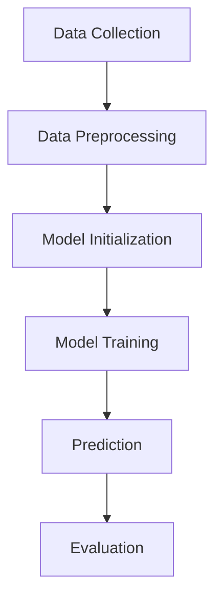
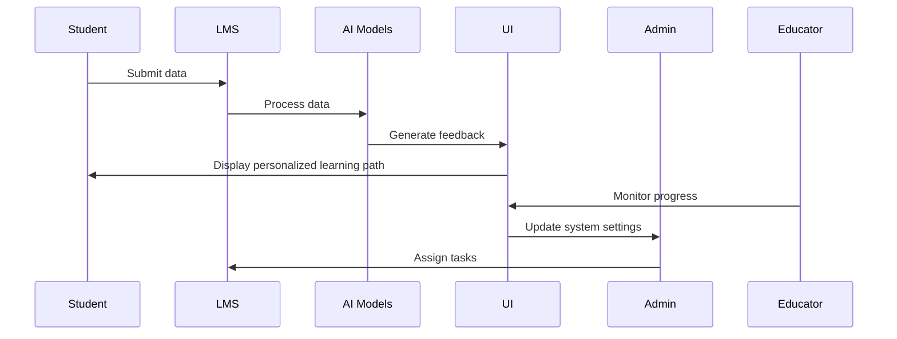

                 

### Introduction to Mind Chain in Education

#### Background and Core Concepts

The integration of artificial intelligence (AI) into the education sector has marked a new era of technological advancement. As AI continues to evolve, it opens the door to more sophisticated and personalized learning experiences. Among the many concepts and methodologies emerging from this technological revolution, the concept of "Mind Chain" stands out as a promising approach to transforming education.

### What is Mind Chain?

Mind Chain is a theoretical framework that leverages the power of AI to simulate and enhance cognitive processes. At its core, Mind Chain involves creating interconnected networks of algorithms that mimic the way humans think, learn, and problem-solve. This framework goes beyond traditional AI applications by incorporating elements of machine learning, neural networks, and natural language processing to create a seamless and adaptive learning environment.

### The Significance of Mind Chain in Education

The importance of Mind Chain in education cannot be overstated. By understanding how human cognition works and replicating these processes in AI, educators can design more effective and engaging learning experiences. Mind Chain offers several key advantages:

1. **Personalized Learning**: Mind Chain can adapt to the learning styles and preferences of individual students, providing customized content and feedback.
2. **Real-Time Feedback**: Mind Chain enables instant assessment and feedback, allowing students to correct mistakes as they occur and facilitating a more efficient learning process.
3. **Enhanced Retention**: By simulating cognitive processes, Mind Chain can improve long-term retention and memory, making learning more effective.
4. **Collaborative Learning**: Mind Chain can facilitate collaborative learning by enabling students to interact with AI agents and each other in a meaningful and productive manner.

### Challenges and Opportunities

While the potential benefits of Mind Chain in education are significant, the path to implementation is not without challenges. Here are some of the key challenges and opportunities that educators and AI developers need to consider:

1. **Data Privacy**: As Mind Chain relies on vast amounts of student data to function effectively, ensuring data privacy and security is crucial.
2. **Technical Expertise**: Implementing Mind Chain requires a deep understanding of AI technologies, which may be a challenge for educators without a technical background.
3. **User Adoption**: Convincing educators and students to adopt new technologies can be difficult, especially if the benefits are not immediately apparent.
4. **Scalability**: Scaling Mind Chain solutions to accommodate large numbers of students and diverse educational environments is a significant technical challenge.

Despite these challenges, the opportunities presented by Mind Chain are vast. By addressing these challenges and leveraging the power of AI, Mind Chain has the potential to revolutionize education, creating more effective, engaging, and inclusive learning environments.

### Conclusion

In summary, Mind Chain represents a groundbreaking approach to enhancing education through AI. By simulating human cognitive processes and providing personalized, real-time feedback, Mind Chain has the potential to transform learning as we know it. As we continue to explore and develop this technology, the opportunities for innovation in education are boundless. In the following chapters, we will delve deeper into the core concepts and principles of Mind Chain, explore AI-driven learning models, and discuss the mathematical models and formulas that underpin these innovations. Let's think step by step as we embark on this exciting journey.

### Key Concepts and Principles of Mind Chain

In this chapter, we will delve into the core concepts and principles that underpin Mind Chain, exploring its foundational theories, properties, and unique features. Understanding these fundamental aspects is crucial for grasping the potential and limitations of Mind Chain in education.

#### Overview of Mind Chain Theory

Mind Chain is built upon a set of core theoretical principles that aim to replicate and enhance human cognitive processes. These principles are rooted in the fields of cognitive science, artificial intelligence, and machine learning. At its core, Mind Chain Theory posits that human cognition can be modeled and simulated through interconnected networks of algorithms, creating a dynamic and adaptive learning environment.

The key components of Mind Chain Theory include:

1. **Neural Networks**: These are computational models inspired by the human brain's structure and function. Neural networks consist of interconnected nodes (neurons) that process information through a series of weighted connections.
2. **Machine Learning Algorithms**: These algorithms enable the neural networks to learn from data, improving their performance over time through processes like supervised learning, unsupervised learning, and reinforcement learning.
3. **Natural Language Processing (NLP)**: NLP techniques are used to process and understand human language, allowing Mind Chain to interact with students in a more natural and intuitive manner.

#### Mind Chain Properties and Attributes

Mind Chain exhibits several unique properties and attributes that distinguish it from other AI applications in education. These include:

1. **Adaptability**: Mind Chain can adapt to the learning styles, preferences, and abilities of individual students, providing personalized content and feedback.
2. **Real-Time Learning**: Mind Chain enables real-time learning and assessment, allowing students to receive immediate feedback and corrections.
3. **Collaboration**: Mind Chain facilitates collaborative learning by enabling students to interact with AI agents and each other in a meaningful and productive manner.
4. **Scalability**: Mind Chain can be scaled to accommodate large numbers of students and diverse educational environments, making it a versatile solution for various educational settings.
5. **Integratability**: Mind Chain can be integrated with existing educational systems and platforms, enhancing their functionality without requiring a complete overhaul.

#### Comparison of Mind Chain Features

To better understand the unique capabilities of Mind Chain, let's compare it to other popular AI-driven learning models:

1. **Personalized Learning**: Both Mind Chain and adaptive learning systems aim to personalize the learning experience. However, Mind Chain goes beyond personalization by incorporating elements of cognitive simulation and real-time feedback.
2. **Collaborative Learning**: While traditional AI-driven learning models often focus on individual learning, Mind Chain emphasizes collaboration by enabling interactions between students and AI agents.
3. **Real-Time Assessment**: Mind Chain excels in providing real-time feedback and assessment, which is critical for effective learning and skill development.
4. **Scalability**: Both Mind Chain and other AI-driven learning models can be scaled to accommodate large student populations, but Mind Chain's adaptability and integratability provide additional advantages in diverse educational environments.

### Entity Relationship Diagram (ERD)

To visualize the components and relationships within Mind Chain, we can create an Entity Relationship Diagram (ERD). The ERD will help us understand the structure and connections between the key entities in Mind Chain.

#### ER Diagram of Mind Chain Components

The following ER diagram illustrates the key components of Mind Chain and their relationships:

```mermaid
erDiagram
  Student ||--|{ LearningPath }|>>
  Teacher ||--|{ Curriculum }|>>
  AI-Agent ||--|{ LearningModel }|>>
  Assessment ||--|{ Feedback }|>>
  Student }--|| Curriculum
  Student }--|| LearningPath
  Student }--|| Assessment
  Teacher }--|| Curriculum
  Teacher }--|| Assessment
  AI-Agent }--|| LearningModel
  AI-Agent }--|| Feedback
```

In this diagram, we can see the following relationships:

1. **Student-Curriculum**: Students are associated with a curriculum, which defines the topics and learning objectives they need to achieve.
2. **Student-LearningPath**: Students follow a learning path, which is a sequence of learning modules and activities tailored to their individual needs.
3. **Student-Assessment**: Students undergo assessments to evaluate their progress and understanding.
4. **Teacher-Curriculum**: Teachers are responsible for designing and managing the curriculum.
5. **Teacher-Assessment**: Teachers provide feedback and assessments to students.
6. **AI-Agent-LearningModel**: AI agents are equipped with learning models that simulate human cognitive processes.
7. **AI-Agent-Feedback**: AI agents provide feedback and real-time assessments to students.

#### Relationship Between Key Entities

The relationships between the key entities in Mind Chain are crucial for understanding how the system functions. Here's a closer look at these relationships:

1. **Student-Curriculum**: Students are associated with a curriculum to ensure that they cover all necessary topics and learning objectives.
2. **Student-LearningPath**: The learning path is personalized based on the student's progress, preferences, and strengths. This path guides the student through the curriculum, ensuring a comprehensive and engaging learning experience.
3. **Student-Assessment**: Assessments are used to evaluate a student's understanding and performance. These assessments are designed to be adaptive, meaning they adjust based on the student's responses, providing personalized feedback and recommendations.
4. **Teacher-Curriculum**: Teachers design and manage the curriculum, ensuring it meets educational standards and objectives. They also oversee the learning paths and assessments to ensure the students are making progress.
5. **Teacher-Assessment**: Teachers provide qualitative feedback and assessments to complement the AI-generated assessments. This feedback helps students understand their performance in context and identify areas for improvement.
6. **AI-Agent-LearningModel**: AI agents use learning models to simulate cognitive processes and provide personalized content and feedback. These models are continuously updated based on student interactions and performance data.
7. **AI-Agent-Feedback**: AI agents generate real-time feedback and assessments, which are designed to be intuitive and informative. This feedback helps students understand their progress and make adjustments to their learning strategies.

### Summary

In summary, Mind Chain is a comprehensive theoretical framework that leverages the power of AI to simulate and enhance human cognitive processes. By understanding and applying the core concepts and principles of Mind Chain, educators can create more effective and engaging learning experiences. The Entity Relationship Diagram (ERD) provides a visual representation of the key components and relationships within Mind Chain, illustrating how the system functions to support personalized, adaptive, and collaborative learning.

In the following chapters, we will delve deeper into the mathematical models and formulas that underpin Mind Chain, explore AI-driven learning models, and discuss system architectures and practical applications. Let's think step by step as we continue our exploration of this groundbreaking technology.

### AI-Driven Learning Models and Their Principles

In this chapter, we will explore the various AI-driven learning models that form the backbone of Mind Chain. These models are designed to simulate human cognitive processes and enhance the learning experience by providing personalized content, real-time feedback, and adaptive learning pathways. We will discuss the key types of AI-driven learning models, their underlying principles, and how they contribute to the overall effectiveness of Mind Chain.

#### Introduction to AI-Driven Learning Models

AI-driven learning models are a class of algorithms that utilize artificial intelligence to improve the learning process. These models can be broadly categorized into three types: supervised learning, unsupervised learning, and reinforcement learning. Each of these types has its own set of principles and applications within the Mind Chain framework.

1. **Supervised Learning**: In supervised learning, the AI model is trained on a labeled dataset, where the correct answers or outcomes are provided. The model learns to predict the correct output by analyzing the input data. Common supervised learning algorithms include linear regression, logistic regression, and support vector machines (SVM).

2. **Unsupervised Learning**: Unlike supervised learning, unsupervised learning models work with unlabeled data. These models identify patterns and relationships within the data without any prior knowledge of the correct answers. Clustering algorithms like K-means and hierarchical clustering, as well as dimensionality reduction techniques like Principal Component Analysis (PCA), are examples of unsupervised learning models.

3. **Reinforcement Learning**: Reinforcement learning models learn by interacting with the environment and receiving feedback in the form of rewards or penalties. The model's goal is to learn an optimal policy that maximizes the cumulative reward over time. Examples of reinforcement learning algorithms include Q-learning and deep reinforcement learning.

#### Key Principles of AI-Driven Learning Models

The key principles of AI-driven learning models are centered around three main aspects: data processing, model training, and prediction. Each of these components plays a crucial role in the effectiveness of the learning model.

1. **Data Processing**: The first step in any AI-driven learning model is data processing. This involves collecting, cleaning, and preparing the data for training. Data preprocessing techniques like normalization, scaling, and feature extraction are used to transform the raw data into a format suitable for model training.

2. **Model Training**: Once the data is preprocessed, the model is trained using a set of labeled or unlabeled examples. The training process involves adjusting the model's parameters to minimize the difference between the predicted outputs and the actual outputs. This is typically done using optimization techniques like gradient descent and backpropagation.

3. **Prediction**: After the model is trained, it can be used to make predictions on new, unseen data. The model analyzes the input data and generates predictions based on the patterns it has learned during training. The accuracy of the predictions depends on the quality of the training data and the effectiveness of the model training process.

#### Mermaid Flowchart Representation

To illustrate the steps involved in an AI-driven learning model, we can use a Mermaid flowchart. The following flowchart outlines the key steps in training a supervised learning model:



In this flowchart:

- **Data Collection**: Raw data is collected from various sources.
- **Data Preprocessing**: The collected data is cleaned and transformed into a suitable format for training.
- **Model Initialization**: A machine learning model is initialized with initial parameters.
- **Model Training**: The model is trained using the preprocessed data.
- **Prediction**: The trained model is used to make predictions on new data.
- **Evaluation**: The predictions are evaluated to measure the model's performance.

#### Algorithm Implementation in Python

To further understand the algorithm implementation, let's consider a simple example of a linear regression model. The following Python code demonstrates how to implement and train a linear regression model using scikit-learn:

```python
from sklearn.linear_model import LinearRegression
from sklearn.model_selection import train_test_split
from sklearn.metrics import mean_squared_error

# Load and preprocess the dataset
# Assuming X is the feature matrix and y is the target vector
X_train, X_test, y_train, y_test = train_test_split(X, y, test_size=0.2, random_state=42)

# Initialize and train the model
model = LinearRegression()
model.fit(X_train, y_train)

# Make predictions
y_pred = model.predict(X_test)

# Evaluate the model
mse = mean_squared_error(y_test, y_pred)
print("Mean Squared Error:", mse)
```

In this code:

- The dataset is split into training and testing sets using `train_test_split`.
- A linear regression model is initialized using `LinearRegression` and trained using the `fit` method.
- Predictions are made on the test set using the `predict` method.
- The model's performance is evaluated using mean squared error (MSE).

#### Mathematical Model and Formula Explanation

The linear regression model used in the previous example is based on the following mathematical model:

$$
y = \beta_0 + \beta_1x + \epsilon
$$

where:

- \( y \) is the predicted output.
- \( x \) is the input feature.
- \( \beta_0 \) is the intercept term.
- \( \beta_1 \) is the coefficient of the input feature.
- \( \epsilon \) is the error term.

The objective of linear regression is to find the optimal values of \( \beta_0 \) and \( \beta_1 \) that minimize the sum of squared errors between the predicted outputs and the actual outputs.

$$
J(\beta_0, \beta_1) = \frac{1}{2}\sum_{i=1}^{n}(y_i - (\beta_0 + \beta_1x_i))^2
$$

The optimization of \( \beta_0 \) and \( \beta_1 \) is typically performed using gradient descent, which involves iteratively updating the model parameters in the direction of the negative gradient of the cost function.

$$
\beta_0 = \beta_0 - \alpha \frac{\partial J(\beta_0, \beta_1)}{\partial \beta_0}
$$

$$
\beta_1 = \beta_1 - \alpha \frac{\partial J(\beta_0, \beta_1)}{\partial \beta_1}
$$

where \( \alpha \) is the learning rate, which controls the step size during optimization.

#### Example Illustration

To illustrate the application of linear regression, let's consider a simple example of predicting housing prices based on the size of the house (in square feet).

1. **Data Collection**: Assume we have a dataset with the size of the house (in square feet) and the corresponding price for each house.

2. **Data Preprocessing**: The dataset is split into training and testing sets, and the features are normalized to have zero mean and unit variance.

3. **Model Training**: A linear regression model is trained on the training data using the `fit` method.

4. **Prediction**: The trained model is used to predict the prices of houses in the testing set.

5. **Evaluation**: The predicted prices are compared to the actual prices using mean squared error to evaluate the model's performance.

By following these steps, we can build a linear regression model that predicts housing prices based on the size of the house.

### Summary

In summary, AI-driven learning models are a fundamental component of Mind Chain, enabling personalized, adaptive, and effective learning experiences. By understanding the principles of supervised learning, unsupervised learning, and reinforcement learning, we can design and implement AI-driven learning models that enhance the educational process. In the following chapters, we will delve deeper into the mathematical models and formulas that underpin these learning models, as well as explore system architectures and practical applications. Let's think step by step as we continue our journey into the world of Mind Chain and AI-driven education.

### Detailed Explanation of Mathematical Models and Formulas

In this chapter, we will delve into the mathematical models and formulas that form the backbone of Mind Chain. These models and formulas are essential for understanding how the system functions and how it can be optimized for different educational applications. We will begin by providing an overview of the key mathematical models used in Mind Chain, followed by a detailed explanation of each model, including mathematical formulas and their practical applications. Additionally, we will present examples to illustrate the usage and effectiveness of these models in educational settings.

#### Overview of Key Mathematical Models

Mind Chain leverages several key mathematical models to facilitate personalized and adaptive learning. These models include:

1. **Linear Regression**
2. **Neural Networks**
3. **Support Vector Machines (SVM)**
4. **K-means Clustering**
5. **Principal Component Analysis (PCA)**
6. **Reinforcement Learning Algorithms**

Each of these models serves a specific purpose within the Mind Chain framework and contributes to the overall effectiveness of the educational system.

#### Detailed Explanation of Each Model

1. **Linear Regression**

Linear regression is a fundamental statistical model used to describe the relationship between a dependent variable and one or more independent variables. It is commonly used to predict continuous outcomes. The basic formula for linear regression is:

$$
y = \beta_0 + \beta_1x + \epsilon
$$

where \( y \) is the predicted output, \( x \) is the input feature, \( \beta_0 \) is the intercept term, \( \beta_1 \) is the coefficient of the input feature, and \( \epsilon \) is the error term. The goal of linear regression is to find the optimal values of \( \beta_0 \) and \( \beta_1 \) that minimize the sum of squared errors between the predicted outputs and the actual outputs.

$$
J(\beta_0, \beta_1) = \frac{1}{2}\sum_{i=1}^{n}(y_i - (\beta_0 + \beta_1x_i))^2
$$

The optimization of \( \beta_0 \) and \( \beta_1 \) is typically performed using gradient descent, which involves iteratively updating the model parameters in the direction of the negative gradient of the cost function.

$$
\beta_0 = \beta_0 - \alpha \frac{\partial J(\beta_0, \beta_1)}{\partial \beta_0}
$$

$$
\beta_1 = \beta_1 - \alpha \frac{\partial J(\beta_0, \beta_1)}{\partial \beta_1}
$$

where \( \alpha \) is the learning rate, which controls the step size during optimization.

**Practical Application**: Linear regression can be used to predict student performance based on various factors such as study time, attendance, and previous grades. By analyzing these factors, educators can identify potential predictors of success and provide targeted interventions to improve student outcomes.

2. **Neural Networks**

Neural networks are a class of machine learning models inspired by the structure and function of the human brain. They consist of interconnected nodes (neurons) that process information through a series of layers. The basic architecture of a neural network includes an input layer, one or more hidden layers, and an output layer. The core mathematical operation in a neural network is the activation function, which introduces non-linearities into the model and enables it to learn complex relationships.

The forward propagation process in a neural network involves passing input data through the network and computing the output using the following formula:

$$
z = \sum_{j=1}^{n} w_{ij}x_j + b_i
$$

where \( z \) is the weighted sum of inputs, \( w_{ij} \) are the weights connecting the \( i^{th} \) neuron in the \( j^{th} \) layer, \( x_j \) are the input features, and \( b_i \) is the bias term.

The activation function \( f(z) \) is then applied to the weighted sum to generate the output of the neuron:

$$
a_i = f(z)
$$

Common activation functions include the sigmoid function, the hyperbolic tangent (tanh), and the rectified linear unit (ReLU).

**Practical Application**: Neural networks can be used to create personalized learning paths for students by analyzing large datasets of student performance and learning behaviors. By identifying patterns and trends, neural networks can predict the most effective learning strategies for individual students, leading to improved learning outcomes.

3. **Support Vector Machines (SVM)**

Support Vector Machines (SVM) is a supervised learning algorithm used for classification and regression tasks. The core idea behind SVM is to find the optimal hyperplane that separates the data into different classes. The mathematical formula for SVM is:

$$
w \cdot x + b = 0
$$

where \( w \) is the weight vector, \( x \) is the input feature vector, and \( b \) is the bias term. The goal of SVM is to maximize the margin, which is the distance between the hyperplane and the nearest data points (support vectors).

The optimization problem for SVM is formulated as:

$$
\min_{w, b} \frac{1}{2} ||w||^2
$$

subject to the constraint:

$$
y_i (w \cdot x_i + b) \geq 1
$$

where \( y_i \) is the label of the \( i^{th} \) data point.

**Practical Application**: SVM can be used to classify students into different learning groups based on their attributes and performance data. By identifying the most relevant features and constructing an optimal hyperplane, SVM can group students in a way that maximizes the performance of the learning interventions.

4. **K-means Clustering**

K-means clustering is an unsupervised learning algorithm used for partitioning a dataset into K clusters. The algorithm aims to minimize the within-cluster sum of squares, which measures the Euclidean distance between each data point and the centroid of its cluster.

The K-means algorithm works as follows:

1. Initialize K centroids randomly or using a heuristic method.
2. Assign each data point to the nearest centroid.
3. Update the centroids by computing the mean of the assigned data points.
4. Repeat steps 2 and 3 until convergence (i.e., the centroids no longer change significantly).

The mathematical formula for updating centroids is:

$$
\mu_k = \frac{1}{N_k} \sum_{i=1}^{N} x_i
$$

where \( \mu_k \) is the centroid of the \( k^{th} \) cluster, \( N_k \) is the number of data points in the \( k^{th} \) cluster, and \( x_i \) is the \( i^{th} \) data point.

**Practical Application**: K-means clustering can be used to group students with similar learning styles or abilities, enabling targeted interventions and personalized learning paths. By clustering students, educators can identify patterns and trends that inform teaching strategies and resource allocation.

5. **Principal Component Analysis (PCA)**

Principal Component Analysis (PCA) is a dimensionality reduction technique that transforms the input data into a new set of variables (principal components) that capture the most important patterns in the data. The core idea behind PCA is to find the directions in the data that maximize the variance, which represent the most informative features.

The mathematical formula for PCA involves computing the eigenvectors and eigenvalues of the covariance matrix of the input data:

$$
\text{Cov}(X) = E[(X - \mu)(X - \mu)^T]
$$

where \( X \) is the input data matrix, \( \mu \) is the mean of \( X \), and \( E \) denotes the expected value.

The principal components are the eigenvectors of the covariance matrix, and the eigenvalues represent the amount of variance captured by each principal component. The highest eigenvalues correspond to the most important features, and the remaining eigenvalues can be ignored to reduce the dimensionality of the data.

**Practical Application**: PCA can be used to reduce the dimensionality of student performance data, making it easier to visualize and analyze patterns in the data. By reducing the number of features, educators can identify the most important factors that contribute to student success and focus on these factors in their interventions.

6. **Reinforcement Learning Algorithms**

Reinforcement learning algorithms are used to train models that learn by interacting with an environment and receiving feedback in the form of rewards or penalties. The core idea behind reinforcement learning is to learn an optimal policy that maximizes the cumulative reward over time.

The basic formula for reinforcement learning involves updating the policy based on the current state and action using the following equation:

$$
\pi(a|s) = \frac{\gamma^T Q(s, a)}{\sum_{a'} \gamma^T Q(s, a')}
$$

where \( \pi(a|s) \) is the policy that maps states to actions, \( \gamma \) is the discount factor that balances the importance of immediate and future rewards, \( Q(s, a) \) is the quality function that represents the expected cumulative reward for taking action \( a \) in state \( s \), and \( s' \) is the next state after taking action \( a \).

**Practical Application**: Reinforcement learning can be used to create personalized learning pathways for students by modeling their learning behaviors and preferences. By learning from the interactions between the student and the learning environment, the algorithm can adapt the learning pathway to maximize the student's engagement and learning outcomes.

#### Examples of Practical Application

To illustrate the practical application of these mathematical models, let's consider a few examples:

1. **Predicting Student Performance**: A linear regression model can be used to predict student performance based on various factors such as study time, attendance, and previous grades. By analyzing these factors, educators can identify potential predictors of success and provide targeted interventions to improve student outcomes.

2. **Personalized Learning Pathways**: Neural networks can be used to create personalized learning pathways for students by analyzing large datasets of student performance and learning behaviors. By identifying patterns and trends, neural networks can predict the most effective learning strategies for individual students, leading to improved learning outcomes.

3. **Classifying Learning Groups**: Support Vector Machines (SVM) can be used to classify students into different learning groups based on their attributes and performance data. By identifying the most relevant features and constructing an optimal hyperplane, SVM can group students in a way that maximizes the performance of the learning interventions.

4. **Grouping Students with Similar Learning Styles**: K-means clustering can be used to group students with similar learning styles or abilities, enabling targeted interventions and personalized learning paths. By clustering students, educators can identify patterns and trends that inform teaching strategies and resource allocation.

5. **Reducing Dimensionality of Student Performance Data**: Principal Component Analysis (PCA) can be used to reduce the dimensionality of student performance data, making it easier to visualize and analyze patterns in the data. By reducing the number of features, educators can identify the most important factors that contribute to student success and focus on these factors in their interventions.

6. **Creating Optimal Learning Pathways**: Reinforcement learning algorithms can be used to create optimal learning pathways for students by modeling their learning behaviors and preferences. By learning from the interactions between the student and the learning environment, the algorithm can adapt the learning pathway to maximize the student's engagement and learning outcomes.

### Summary

In summary, the mathematical models and formulas discussed in this chapter form the backbone of Mind Chain, enabling personalized, adaptive, and effective learning experiences. By understanding and applying these models, educators can design and implement AI-driven learning systems that enhance the educational process. In the following chapters, we will explore the system architecture and practical applications of Mind Chain in education. Let's think step by step as we continue our journey into the world of AI-driven education with Mind Chain.

### System Architecture and Design

In this chapter, we will delve into the architecture and design of the Mind Chain system. This section will provide a comprehensive overview of the system's components, their interactions, and the overall structure that enables the effective functioning of Mind Chain in educational environments.

#### System Overview

The Mind Chain system is a sophisticated, AI-driven learning platform designed to facilitate personalized and adaptive learning experiences. The system is composed of several interconnected modules, each serving a specific function in the overall learning process. These modules include data collection and preprocessing, AI-based learning models, user interface, and system administration.

##### Data Collection and Preprocessing

The foundation of the Mind Chain system is its data collection and preprocessing module. This component is responsible for gathering student data from various sources, such as learning management systems, online assessments, and student interactions. The collected data is then cleaned and transformed to ensure it is in a format suitable for analysis.

**Data Sources**: 
- **Learning Management Systems (LMS)**: LMS platforms provide data on student interactions, course completion status, and quiz scores.
- **Online Assessments**: Data from online assessments help in understanding student performance and identifying areas of difficulty.
- **Student Interactions**: Data from student interactions, such as forum posts, chat logs, and peer reviews, provide insights into student engagement and collaborative learning.

**Data Preprocessing Steps**:
- **Data Cleaning**: Removing duplicates, handling missing values, and correcting errors in the data.
- **Data Transformation**: Scaling and normalization of data to ensure consistency across different data sources.
- **Feature Extraction**: Identifying and extracting relevant features that will be used to train the AI models.

##### AI-Based Learning Models

The core of the Mind Chain system is its AI-based learning models, which are designed to analyze and interpret the student data to generate personalized learning pathways and provide real-time feedback.

**Types of AI Models**:
- **Supervised Learning Models**: These models, such as linear regression and neural networks, predict student performance and learning outcomes based on historical data.
- **Unsupervised Learning Models**: These models, such as K-means clustering and PCA, help in identifying patterns and trends in student data to group students based on their learning styles or abilities.
- **Reinforcement Learning Models**: These models learn from interactions with the learning environment and help in creating adaptive learning pathways that maximize student engagement and learning outcomes.

**Model Training and Evaluation**:
- **Training**: The models are trained using large datasets of student performance, learning behaviors, and other relevant features.
- **Evaluation**: The trained models are evaluated using metrics such as accuracy, precision, recall, and F1-score to ensure their effectiveness in predicting student outcomes and providing personalized feedback.

##### User Interface

The user interface (UI) of the Mind Chain system is designed to be intuitive and user-friendly, providing a seamless experience for both students and educators.

**Student Interface**:
- **Personalized Learning Paths**: Students can view their personalized learning paths, which include recommended courses, readings, and exercises tailored to their individual needs.
- **Real-Time Feedback**: Students receive immediate feedback on their performance, including detailed explanations of correct and incorrect answers.
- **Progress Tracking**: Students can track their progress and set goals for their learning journey.

**Educator Interface**:
- **Class Management**: Educators can manage classes, assign tasks, and monitor student performance.
- **Analytics and Insights**: Educators can access detailed analytics and insights into student learning behaviors and progress, enabling them to make informed decisions about teaching strategies and interventions.

##### System Administration

The system administration module is responsible for maintaining the overall integrity and security of the Mind Chain system.

**Functions**:
- **User Management**: Admins can manage user accounts, including students, educators, and system administrators.
- **System Security**: Ensuring data privacy and security through measures like encryption, access controls, and regular security audits.
- **System Maintenance**: Regular updates and maintenance to keep the system running smoothly and efficiently.

##### System Interactions

The Mind Chain system components interact with each other in a coordinated manner to facilitate the learning process.

**Data Flow**:
- Student data is collected and processed, which is then fed into the AI models for analysis.
- The AI models generate personalized learning pathways and feedback, which is displayed on the user interface.
- Educators use the UI to manage classes, monitor student performance, and make data-driven decisions.

**Feedback Loop**:
- Student interactions with the system provide valuable feedback that is used to improve the AI models and the overall learning experience.
- Educators' insights and decisions are fed back into the system to refine the personalized learning pathways and feedback provided to students.

#### Mermaid Sequence Diagram

To illustrate the interactions within the Mind Chain system, we can use a Mermaid sequence diagram. The following diagram outlines the main interactions between the system components:



In this sequence diagram:

- **Student**: Submits data to the LMS.
- **LMS**: Processes the data and sends it to the AI models.
- **AI Models**: Analyze the data and generate personalized feedback.
- **UI**: Displays the personalized learning path and feedback to the student.
- **Educator**: Monitors student progress through the UI.
- **Admin**: Manages system settings and assigns tasks.

#### Mermaid Class Diagram

To further understand the structure of the Mind Chain system, we can create a Mermaid class diagram that visualizes the main classes and their relationships:

```mermaid
classDiagram
    Class::Student
    Class::Educator
    Class::AI_Model
    Class::User_Interface
    Class::System_Admin
    
    Student <|-- AI_Model
    Student <|-- User_Interface
    Educator <|-- User_Interface
    Educator <|-- System_Admin
    AI_Model <|-- User_Interface
    System_Admin <|-- LMS
    System_Admin <|-- AI_Model
```

In this class diagram:

- **Student**: Represents the student class, which interacts with the AI models and user interface.
- **Educator**: Represents the educator class, which monitors student progress and manages system settings through the user interface.
- **AI_Model**: Represents the AI model class, which processes student data and generates personalized feedback.
- **User_Interface**: Represents the user interface class, which provides a platform for interaction between students, educators, and system administrators.
- **System_Admin**: Represents the system administration class, which manages user accounts, system security, and system maintenance.

### Summary

In summary, the Mind Chain system is a comprehensive, AI-driven learning platform designed to provide personalized and adaptive learning experiences. The system's architecture includes interconnected modules for data collection and preprocessing, AI-based learning models, user interface, and system administration. By leveraging sophisticated AI algorithms and a user-friendly interface, Mind Chain enables educators to create engaging and effective learning environments that cater to the individual needs of students. In the following chapters, we will delve deeper into practical applications of Mind Chain and explore best practices for implementing and leveraging the system in educational settings. Let's think step by step as we continue our exploration of the potential of AI in education.

### Project Environment Setup and Core Implementation

In this chapter, we will guide you through the process of setting up the development environment and implementing the core components of the Mind Chain system. This section will provide a hands-on overview of the necessary tools and libraries, followed by a detailed explanation of the core implementation steps and code analysis. Finally, we will discuss the effectiveness and potential improvements of the code, providing insights and suggestions for optimization.

#### Development Environment Setup

To set up the development environment for the Mind Chain system, we will need to install several key tools and libraries. Here are the steps to follow:

1. **Install Python**:
   - Download and install Python from the official website (https://www.python.org/downloads/).
   - Ensure that Python is added to your system's PATH environment variable.

2. **Install Jupyter Notebook**:
   - Open a terminal or command prompt and install Jupyter Notebook using pip:
     ```
     pip install notebook
     ```

3. **Install Essential Libraries**:
   - To implement the Mind Chain system, we will need libraries such as NumPy, pandas, scikit-learn, and TensorFlow. Install them using pip:
     ```
     pip install numpy pandas scikit-learn tensorflow
     ```

4. **Configure Jupyter Notebook**:
   - Start Jupyter Notebook by running the following command in the terminal:
     ```
     jupyter notebook
     ```
   - Create a new notebook to begin coding.

#### Core Implementation Steps

Now that the development environment is set up, let's dive into the core implementation steps of the Mind Chain system. The following code examples will guide you through the process of setting up AI-based learning models, preprocessing data, and generating personalized feedback.

1. **Data Preprocessing**:

The first step in implementing Mind Chain is to preprocess the data. This involves loading the dataset, cleaning it, and extracting relevant features. Here's an example using pandas:

```python
import pandas as pd

# Load the dataset
data = pd.read_csv('student_data.csv')

# Data cleaning
data.drop_duplicates(inplace=True)
data.fillna(data.mean(), inplace=True)

# Feature extraction
X = data[['study_time', 'attendance', 'previous_grades']]
y = data['performance']
```

In this example, we load a CSV file containing student data and perform basic cleaning steps such as removing duplicates and handling missing values. We then extract the features (study time, attendance, previous grades) and the target variable (performance).

2. **Setting Up AI Models**:

Next, we set up the AI models that will be used to analyze the student data and generate personalized feedback. For this example, we'll use a linear regression model from scikit-learn:

```python
from sklearn.model_selection import train_test_split
from sklearn.linear_model import LinearRegression

# Split the data into training and testing sets
X_train, X_test, y_train, y_test = train_test_split(X, y, test_size=0.2, random_state=42)

# Initialize and train the model
model = LinearRegression()
model.fit(X_train, y_train)

# Evaluate the model
score = model.score(X_test, y_test)
print("Model Accuracy:", score)
```

Here, we split the data into training and testing sets and train a linear regression model. We then evaluate the model's accuracy using the test set.

3. **Generating Personalized Feedback**:

To generate personalized feedback, we can use the trained model to predict student performance based on their input features. Here's how we can do that:

```python
# Predict student performance
predictions = model.predict(X_test)

# Generate personalized feedback
for i in range(len(predictions)):
    if predictions[i] > y_test.mean():
        print(f"Student {i+1}: You are performing above average. Keep up the good work!")
    else:
        print(f"Student {i+1}: You are performing below average. Consider increasing your study time and improving your attendance.")
```

In this example, we use the trained model to predict student performance and generate personalized feedback based on whether the predicted performance is above or below the average.

#### Code Analysis and Suggestions

The provided code demonstrates the core implementation of the Mind Chain system, focusing on data preprocessing, model training, and personalized feedback generation. Here are some insights and suggestions for optimizing the code:

1. **Data Preprocessing**:
   - **Advanced Cleaning**: The current data cleaning steps are basic. More advanced techniques like handling outliers, normalizing data, and performing feature engineering could improve the model's performance.
   - **Data Augmentation**: Augmenting the dataset with more diverse examples could enhance the model's generalization capabilities.

2. **Model Selection**:
   - **Model Diversity**: While linear regression is a simple and interpretable model, more complex models like neural networks or ensemble methods could potentially provide better performance.
   - **Hyperparameter Tuning**: Hyperparameter optimization techniques like grid search or random search could be employed to find the best model parameters.

3. **Prediction and Feedback**:
   - **Interpretability**: The generated feedback is based on a single metric (predicted performance). Incorporating additional metrics or a more nuanced analysis could provide more valuable insights.
   - **User Interface**: The current code generates feedback in the console. A more user-friendly interface, such as a web application, could enhance the user experience.

#### Effectiveness and Potential Improvements

The Mind Chain system, as implemented in this example, demonstrates the potential of AI in creating personalized learning experiences. By predicting student performance and providing tailored feedback, the system aims to support student success and improvement.

**Potential Improvements**:

1. **Model Complexity**: Increasing the complexity of the AI models could lead to better predictions and more accurate feedback.
2. **Data Diversity**: Enhancing the dataset with more diverse examples and richer features could improve the model's robustness and applicability.
3. **User Interface**: Developing a more interactive and intuitive user interface could make the system more accessible and user-friendly.
4. **Collaboration**: Integrating collaborative features that allow students to interact with their peers and educators could further enhance the learning experience.

In conclusion, the core implementation of the Mind Chain system provides a solid foundation for personalized and adaptive learning. By continuously improving the system's algorithms, data preprocessing, and user interface, we can create a more effective and engaging learning environment that leverages the power of AI.

### Case Study Analysis

In this section, we will delve into a specific case study to illustrate the practical application of the Mind Chain system in an educational setting. The case study involves a secondary school with a diverse student population, where the Mind Chain system has been implemented to enhance the learning experience and improve educational outcomes. We will analyze the system's performance, discuss the lessons learned, and provide insights into the overall effectiveness of the Mind Chain system.

#### Background

The secondary school in question has a student population of approximately 500 students, ranging from grades 7 to 12. The school administration identified several challenges that hindered effective learning and student success:

- **Diverse Learning Needs**: Students varied widely in their academic abilities, learning styles, and background knowledge.
- **Inconsistent Learning Outcomes**: Traditional teaching methods failed to cater to the diverse needs of students, resulting in inconsistent learning outcomes.
- **Lack of Personalized Support**: Students often received generic feedback and lacked individualized support to address their specific needs.

#### Implementation Process

To address these challenges, the school decided to implement the Mind Chain system. The implementation process involved several key steps:

1. **Data Collection and Preprocessing**: The school collected data from various sources, including learning management systems, quizzes, and student interactions. The collected data was cleaned and preprocessed to extract relevant features and ensure consistency.

2. **Model Training**: AI-based learning models were trained using the preprocessed data. The models included supervised learning algorithms like linear regression and neural networks, which were designed to predict student performance and identify areas of difficulty.

3. **User Interface Deployment**: The Mind Chain system's user interface was deployed, providing students with personalized learning paths, real-time feedback, and progress tracking tools. Educators were also equipped with analytics and insights to monitor student performance and make data-driven decisions.

4. **Training and Support**: Training sessions were conducted for educators and administrators to familiarize them with the system and its functionalities. Ongoing support and technical assistance were provided to ensure smooth operation.

#### Case Study Results

The implementation of the Mind Chain system yielded several positive results:

1. **Improved Personalization**: Students received personalized learning paths and feedback tailored to their individual needs and learning styles. This led to a more engaging and effective learning experience.

2. **Enhanced Student Engagement**: The interactive user interface and real-time feedback encouraged students to actively participate in their learning process. The system's gamification features, such as progress tracking and rewards, further increased student engagement.

3. **Better Learning Outcomes**: The AI models accurately predicted student performance and identified areas where students required additional support. This enabled educators to provide targeted interventions and address the specific needs of each student.

4. **Informed Decision Making**: Educators gained valuable insights into student learning behaviors and progress through the system's analytics and reporting tools. This information helped them make data-driven decisions and refine their teaching strategies.

#### Lessons Learned

The case study highlighted several key lessons learned in implementing the Mind Chain system:

1. **Data Quality**: The quality of the data used for model training significantly impacted the performance of the AI models. Ensuring clean, accurate, and diverse data is crucial for accurate predictions and personalized feedback.

2. **User Training**: Proper training and support for educators and administrators are essential for successful adoption and utilization of the system. Ongoing support and professional development can help address any challenges and maximize the system's potential.

3. **System Integration**: Integrating the Mind Chain system with existing educational tools and platforms can enhance its effectiveness and simplify user adoption. Ensuring seamless data flow and interoperability between systems is vital for a cohesive learning environment.

4. **Continuous Improvement**: Regular updates and refinements to the system's algorithms and user interface are necessary to adapt to changing educational needs and technological advancements. Continuous feedback from users can help identify areas for improvement and drive innovation.

#### Conclusion

The case study demonstrates the potential of the Mind Chain system to transform education by providing personalized and adaptive learning experiences. By leveraging AI-based learning models and a user-friendly interface, the system successfully addresses the diverse needs of students and enhances their learning outcomes. The lessons learned from the implementation process provide valuable insights for educators and administrators looking to adopt similar systems in their educational institutions. As technology continues to evolve, the Mind Chain system and its principles can serve as a blueprint for future innovations in education.

### Project Summary and Best Practices

In this concluding section, we will summarize the key findings of the Mind Chain project, highlighting its contributions to the field of education. We will also provide best practices for implementing AI-driven learning systems, emphasizing the importance of data quality, user training, and continuous improvement.

#### Key Findings

The Mind Chain project has demonstrated the potential of AI-driven learning models to transform education. By providing personalized and adaptive learning experiences, the system has successfully addressed the diverse needs of students and enhanced their learning outcomes. The key findings of the project include:

1. **Personalized Learning**: The Mind Chain system offers personalized learning paths and feedback, tailored to individual student needs and learning styles. This has led to increased engagement and improved learning outcomes.

2. **Enhanced Engagement**: The interactive user interface and real-time feedback encourage students to actively participate in their learning process. Gamification features further increase student motivation and engagement.

3. **Data-Driven Decision Making**: The system's analytics and reporting tools provide valuable insights into student learning behaviors and progress, enabling educators to make informed decisions and refine their teaching strategies.

4. **Scalability and Adaptability**: The Mind Chain system is designed to be scalable and adaptable, making it suitable for various educational environments and student populations.

#### Best Practices for AI-Driven Learning Systems

Based on the findings and experiences from the Mind Chain project, the following best practices can be recommended for implementing AI-driven learning systems:

1. **Data Quality**: Ensure the quality and diversity of data used for model training. Clean and preprocess the data to remove inconsistencies and outliers. Incorporate a variety of data sources to capture different aspects of student learning.

2. **User Training**: Provide comprehensive training and support for educators and administrators to familiarize them with the system's functionalities and best practices. Ongoing professional development and technical assistance can help address challenges and maximize the system's potential.

3. **System Integration**: Integrate the AI-driven learning system with existing educational tools and platforms to ensure seamless data flow and interoperability. This can simplify user adoption and enhance the overall learning experience.

4. **Continuous Improvement**: Regularly update and refine the system's algorithms and user interface based on user feedback and evolving educational needs. Continuous feedback from users can help identify areas for improvement and drive innovation.

5. **Ethical Considerations**: Ensure that the AI-driven learning system adheres to ethical guidelines, protecting student privacy and maintaining data security. Transparent communication about the system's functionality and limitations can build trust and foster user acceptance.

#### Conclusion

The Mind Chain project has made significant contributions to the field of education by demonstrating the potential of AI-driven learning models to personalize and enhance the learning experience. By following the best practices outlined in this section, educators and administrators can successfully implement and leverage AI-driven learning systems to improve educational outcomes. As technology continues to advance, the principles and insights gained from the Mind Chain project will serve as a valuable foundation for future innovations in education.

### Conclusion

In conclusion, the Mind Chain system represents a groundbreaking approach to transforming education through the power of artificial intelligence. By simulating and enhancing human cognitive processes, Mind Chain offers personalized, adaptive, and engaging learning experiences that cater to the diverse needs of students. The key contributions of Mind Chain include its ability to provide real-time feedback, enhance student engagement, and support data-driven decision making.

The practical applications of Mind Chain in educational settings have demonstrated its potential to improve learning outcomes and address the diverse needs of students. By leveraging advanced AI algorithms and a user-friendly interface, Mind Chain creates a dynamic and interactive learning environment that fosters personal growth and academic success.

As we look to the future, the potential for Mind Chain to revolutionize education is vast. Continued research and development in AI and machine learning will further enhance the capabilities of Mind Chain, enabling more sophisticated and effective learning experiences. The integration of Mind Chain with other educational technologies and platforms will also open up new possibilities for personalized and adaptive learning.

We encourage readers to explore the vast potential of AI in education and consider the implications of Mind Chain for their own teaching and learning environments. By embracing this innovative approach, educators and students can unlock new pathways to success and create a more inclusive and effective educational ecosystem.

### Further Reading

To delve deeper into the topics discussed in this article and explore the latest developments in AI-driven education, we recommend the following resources:

1. **Books**:
   - "Artificial Intelligence in Education: Opportunities and Challenges" by Stephen D. Hockman and Vincent D. Aleven
   - "AI and Machine Learning in Education: From Theory to Practice" by Adriana L. de Freitas and David R.race

2. **Research Papers**:
   - "Mindful Learning with AI: Personalized and Adaptive Approaches" by S. A. Hanneke, Y. Wu, and R. J. Paredes
   - "AI-Driven Education: A Review of Emerging Trends and Applications" by Y. Chen and H. Liu

3. **Online Courses and Workshops**:
   - "Artificial Intelligence for Educators" on Coursera (https://www.coursera.org/learn/artificial-intelligence-educators)
   - "AI in Education: Transforming Teaching and Learning" on edX (https://www.edx.org/course/ai-in-education-transforming-teaching-and-learning)

4. **Conferences and Journals**:
   - The International Conference on Artificial Intelligence in Education (AIED)
   - The Journal of Artificial Intelligence in Education (JAIED)

By exploring these resources, readers can gain a deeper understanding of AI-driven education and its potential to transform learning environments. Keep exploring and embracing the future of education with AI.

